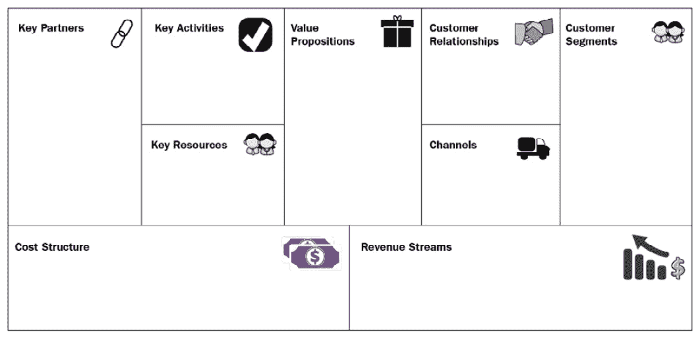
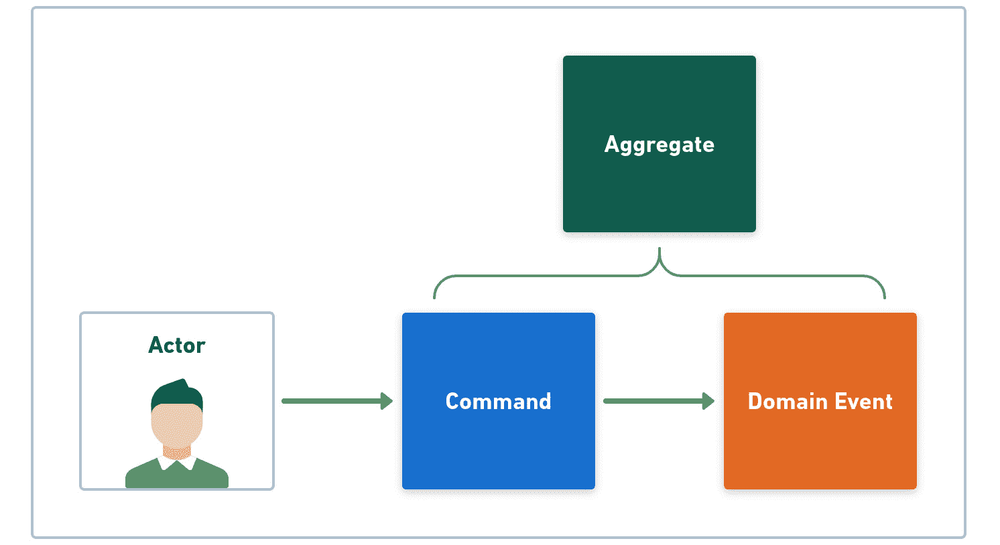
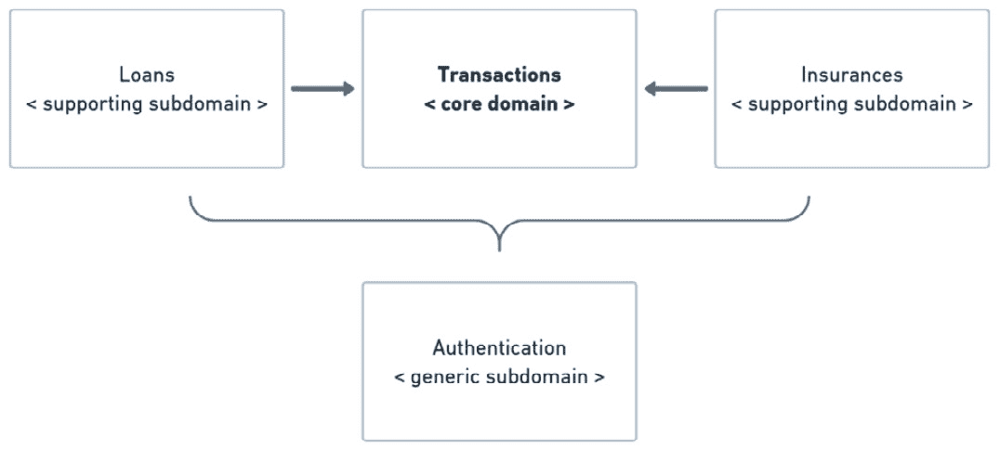
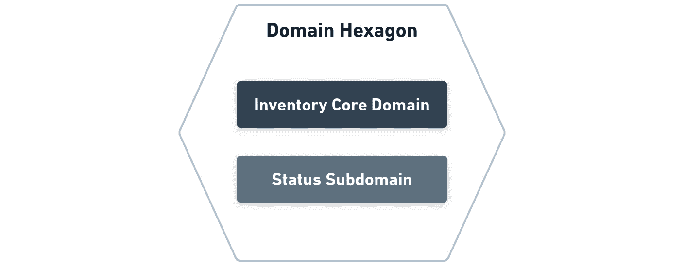

# 第十七章：为您的六边形应用程序制定良好的设计实践

在本书中探索六边形架构时，我们了解了一些表征六边形应用程序的原则和技术。通过可视化具有明确定义边界的系统，我们建立了三个六边形：领域、应用程序和框架。

以这些六边形为指导，我们探讨了如何将业务代码与技术代码分离。这种分离使我们能够探索创建易于变更的系统的方法。但我们并没有止步于此。更进一步，我们学习了如何使用 Quarkus 框架将六边形应用程序转变为云原生应用程序。

我们已经掌握了创建六边形系统所需的基本思想，结束了这本书的阅读。在本章中，我们将探讨一些在创建健壮的六边形应用程序时可以应用的有用的设计实践。

在本章中，我们将涵盖以下主要主题：

+   使用**领域驱动设计**（**DDD**）来塑造领域六边形

+   创建端口和用例的需求

+   处理多个适配器类别

+   结论——六边形之旅

到本章结束时，您将了解可以使您的六边形架构项目更健壮的设计实践。这些实践还将帮助您决定何时以及如何应用六边形架构原则。

# 技术要求

要编译和运行本章中展示的代码示例，您需要在您的计算机上安装最新的**Java SE 开发工具包**和**Maven 3.8**。它们都适用于**Linux**、**Mac**和**Windows**操作系统。

您可以在 GitHub 上找到本章的代码文件：

[`github.com/PacktPublishing/-Designing-Hexagonal-Architecture-with-Java---Second-Edition/tree/main/Chapter17`](https://github.com/PacktPublishing/-Designing-Hexagonal-Architecture-with-Java---Second-Edition/tree/main/Chapter17)

# 使用领域驱动设计来塑造领域六边形

当使用六边形架构来设计系统的代码结构时，我们无法强调首先实现领域六边形的重要性。正是领域六边形为整个应用程序的开发定下了基调。

只要您将代码保持在仅表达问题域的领域六边形中——不将业务关注点与技术关注点合并的代码——您就走在确保有利于更易于变更的设计的封装级别的正确道路上。您在开发领域六边形时使用的技巧不应是您当前的主要关注点——相反，您的目标应该是创建一个专注于系统目的的领域六边形，而不是您可能用于实现它的技术。因此，您可以使用自己的原则集来开发领域六边形，或者您可以借鉴那些以前解决过类似问题的他人的想法。

使用领域驱动设计（DDD）的优势在于，这意味着你不需要重新发明轮子。大多数——如果不是所有——你需要来建模你的问题域的概念和原则，在 DDD 技术丰富的知识体系中都已确立。然而，这并不意味着你必须字面遵循所有 DDD 原则。推荐的方法是采用和适应对你项目有帮助的东西。

接下来，我们将探讨一些在使用 DDD 设计领域六边形时你可以遵循的方法。

## 理解我们所从事的业务

一个好的应用程序设计反映了对其所服务业务的良好理解。设计之旅不是从代码开始的，而是通过寻求业务知识。我并不是要你成为你打算为它编写软件的领域的业务专家。然而，我认为理解基础很重要，因为如果你不这样做，设计阶段初期犯下的错误可能会造成不可逆转的损害，这种损害会延伸到整个软件项目。

在最佳情况下，项目可以幸存这些早期的错误，但不是没有付出混乱和难以维护的软件的高昂代价。在最坏的情况下，结果是不可用的软件，从头开始一个新的项目是最好的选择。

理解业务基础是我们应该做的第一件事。业务细节也很重要，如果我们想制作出顶级的软件，我们应该密切关注它们。但与细节相关的错误并不像与基础相关的错误那样严重。前者通常更容易且更便宜地修复。

让我们暂时回顾一下拓扑和库存系统。我们有一个业务规则，即只有来自同一国家的边缘路由器才能相互连接。我们使用边缘路由器来处理区域流量，因为它们的流量容量比核心路由器小。核心路由器可以位于不同的国家，因为它们的流量容量更大。

整个领域模型都是基于这些业务前提构建的。如果我们无法理解和将这些业务前提转化为一个连贯的领域模型，我们将妥协整个系统开发。在我们之上构建的一切都将基于薄弱或错误的假设。这就是为什么我们需要投入必要的时间来掌握业务基础。

现在，让我们看看我们可以使用的一些技术来构建业务知识。

### 商业模式画布

使用商业模式画布技术可以做一个很好的练习，以了解业务是如何运作的。**商业模式画布**是一个创建商业模式的工具。它提供了分析和理解业务主要要素的工具。通过提供一种结构化和简化的方式来识别业务的主要方面，商业模式画布可以成为绘制您和您的团队需要理解业务基础的大图的起点。

工具的主要好处是它关注对业务盈利至关重要的关键要素。另一个有益的方面是它如何表示整体商业景观中的客户和合作伙伴。这有助于我们了解商业模式在多大程度上满足了客户和合作伙伴的期望。

一个缺点是它并没有提供一个深入和全面的视角，说明业务应该如何运作才能产生良好的结果。此外，它也没有涉及业务战略。它的大部分重点在于最终结果，而不是长期目标。

商业模式画布有一个变体和替代方案，称为**精益画布**，它更倾向于初创企业。这种方法的 主要区别在于它关注初创企业在尝试开发新想法和产品时面临的高度不确定性水平。

这里是商业模式画布的示意图：



图 17.1 – 商业模式画布

如前图所示，商业模式画布让我们能够将每个业务方面结构化为不同的部分。这种分离有助于我们可视化构成业务的主要要素。以下是商业模式画布的要素：

+   **关键合作伙伴**要素代表我们的关键合作伙伴和供应商，并包含有关在该关系中涉及的关键资源或活动的信息

+   在**关键活动**中，我们陈述了实现关键活动所需的价值主张

+   对于**关键资源**，我们需要确定使关键资源得以实现的必要价值主张

+   在**价值主张**中，我们描述了我们打算向客户提供的价值要素

+   **客户关系**要素是关于每个客户细分在建立和维护与我们关系时的期望

+   在**渠道**中，我们确定客户细分将通过哪些沟通渠道联系我们

+   **客户细分**要素代表了我们希望为其提供价值的群体

+   **成本结构**要素描述了使商业模式得以实现的最高成本

+   **收入来源**要素显示了客户真正愿意为其支付的价值

除了商业模式画布，我们还有事件风暴技术作为替代方案，它更适合 DDD 项目。现在让我们来考察它。

### 事件风暴

如果你认为商业模型画布不是一个合适的方法，另一种称为**事件风暴**的技术可以帮助你理解你的业务需求。由 Alberto Brandolini 创建的事件风暴使用彩色便利贴将业务元素映射到领域事件、命令、行为者和聚合体。每个便利贴元素都有自己的颜色，如下面的流程图所示：



图 17.2 – 事件风暴技术

如前图所示，事件风暴使用的术语与我们处理领域驱动设计（DDD）时遇到的术语相同。这是因为事件风暴是专门为那些使用 DDD 并需要理解其项目业务需求的人而创建的。

事件风暴会议应由开发者、领域专家和协调会议的协调员共同进行，以确保映射工作朝正确的方向进行。

事件风暴会议的起点通常是一个具有挑战性的业务流程模型。在这些会议中，通常讨论的是行为者和他们的行为如何影响业务流程。另一个重点是外部系统如何支持并与业务流程交互。风险和痛点也是必须映射的主题，以确定业务关键区域。要了解更多关于事件风暴的信息，请访问其网站[`www.eventstorming.com`](https://www.eventstorming.com)。

一旦我们理解了业务运作的方式，我们需要将这种知识转化为领域模型。在下一节中，我们将看到协作如何帮助我们增加对业务的了解。

## 促进协作以增加知识

领域模型是人们试图理解业务并将这种理解转化为代码的结果。为了最大限度地利用这一过程，在复杂度高且事情难以完成的情况下，协作发挥着至关重要的作用。为了克服这种复杂性，我们需要建立一个协作氛围，让所有参与项目的人都能提供相关信息，帮助构建整体图景。协作方法有助于确保每个人都对问题领域有相同的理解，从而产生更好地反映业务关注的领域模型。

除了使用代码本身来捕捉和传达问题领域知识外，书面文档也是协作的另一个有用工具。我并不是在谈论编写长篇和全面的文档——我的意思是相反的。让我来解释一下。

简洁的文档，专注于解释系统的构建块，可以帮助那些不熟悉代码的人迈出理解系统、进而理解问题域的第一步。有时，对系统主要元素的介绍可以迅速导致对问题域的全面理解。

我所说的可能看起来很显然，但很多时候，我遇到了一个复杂且缺乏或完全没有文档的代码库。当问题域复杂时，代码变得复杂也是自然的。没有文档来解释基本系统，原本复杂的东西变得更加难以理解。

我建议在项目结束时留出一些时间来编写系统文档。特别是新加入的人员，将受益于一份友好的文档，它提供了对系统整体概览的概述。

现在我们已经了解到，基于对业务需求的理解建立坚实的基础是多么重要，并且我们已经讨论了协作在增加我们对问题域知识了解的价值，那么让我们来探讨一些在构建领域六边形时可以采用的 DDD 技术。

## 将 DDD 技术应用于构建领域六边形

在本节中，我们将探讨一些设计实践，以帮助我们确立六边形系统中的明确边界。补充我们在*第二章*中看到的，“将业务规则封装在领域六边形内”，我们将看到创建子域、寻找通用语言和定义边界上下文以区分问题域不同方面的重要性。

### 子域

**子域**的目的是将支持核心域但又不属于表达核心域的元素分组。这些支持元素对于核心域的活动至关重要。没有支持元素，核心域无法工作。也存在一些通用子域，其目的是为核心域和支持子域提供额外的功能。通用子域作为一个独立组件工作，不依赖于其他领域提供的东西。

我们可以说，核心域中有主要活动。而在子域中，我们有次要活动，这些活动使得主要活动得以实现。如果我们混合主要和次要活动，我们最终会得到一个具有混合关注点的领域模型。对于较小的系统来说，这可能不是什么大问题，但在较大的系统中，它可能会增加相当大的复杂性，这可能会损害试图理解系统的人的生产力。这就是为什么将领域分解为子域是一个好的方法。我们总会有一个专注于代码最重要部分的中心域。

让我们以银行系统为例，进一步探讨子域的概念。在这样的系统中，可以识别以下领域：

+   作为核心域，我们有**事务**，允许用户接收和发送金钱

+   作为支持子域，我们可能有**贷款**和**保险**，它们为系统增加了更多功能，但依赖于**事务**核心域来启用这些功能

+   最后，我们有**认证**作为一个通用子域，为需要每个交易都进行认证的核心域和支持子域提供服务

下图显示了子域与核心域之间的关系：



图 17.3 – 银行系统子域

**事务**核心域包含系统的构建块元素。这些元素也存在于**贷款**和**保险**子域中，但用途不同。通用的**认证**子域对其他域一无所知。它只提供一种认证机制，该机制在核心域和支持子域之间共享。

### 通用语言

DDD 的一个试金石是它强调我们如何使用语言来描述领域模型。这种强调旨在避免我们的一般沟通中的歧义渗透到我们想要创建的系统代码中。

作为人类，我们比计算机有更大的处理语言歧义的能力，因为我们可以在我们的词语中添加上下文。另一方面，除非我们为它们提供，否则计算机没有这种能力。为了降低系统的歧义水平，通用语言寻求精确的术语来描述构成领域模型的元素。

然而，定义精确的术语并不足以确保我们始终在领域模型中传达正确的含义，因为相似的词语在不同的上下文中可能有不同的含义。这就是为什么在 DDD 中还有另一种称为边界上下文的技术，我们可以用它来处理领域模型中的意义差异。

### 边界上下文

**边界上下文**的概念是对这样一个事实的回应：词语的含义取决于它们被使用的上下文。当我们把这个想法带到领域驱动设计（DDD）中时，我们可能会发现，一个领域模型元素在不同的应用上下文中可能具有不同的含义或表现不同的行为。如果我们不主动采取行动来明确定义上下文以阐明这样的领域模型元素的含义，我们就在系统中增加了歧义。

例如，考虑拓扑和库存系统。假设除了库存功能外，我们希望系统能够从路由器和其他网络设备获取实时状态和基本信息。这个新功能可能导致两种上下文：一种用于库存，另一种用于状态。

从库存的角度来看，路由器意味着数据库中的一个静态记录。另一方面，从状态的角度来看，路由器是一个*活生生的*东西，它发布实时数据。通过将这种区别以边界上下文的形式表达出来，我们确保我们对一个上下文的理解不会与另一个上下文混淆。不仅如此，通过在边界上下文可以提供的清晰边界内组织代码，我们正在创建一个可以以更组织化的方式演化和接收变更的系统。此外，我们在模块级别强制执行单一职责原则。这意味着一个模块只应该因为一个原因而改变，而不是多个原因。

本次会议讨论的 DDD 技术，如果我们不首先掌握我们的业务需求，那么它们的价值就不大。这就是为什么我们首先探索了一些我们可以用来增强我们对业务模型理解的技术。一旦我们了解了我们所从事的业务，我们就可以安全地使用 DDD 技术（如子域和边界上下文）来建立不同系统组件之间的边界，并消除领域模型内的歧义。

因此，让我们看看我们如何在六边形系统中实现边界上下文和子域。

## 在六边形系统中实现边界上下文和子域

我们实现边界上下文的方法依赖于子域的创建。在这里，我们讨论了边界上下文和子域。

边界上下文可以存在于子域内或不存在子域。我们已经看到，拓扑和库存系统可以检查网络设备的状况。假设我们确定状态元素是问题域的一个基本且关键的特性。在这种情况下，我们可以将状态元素作为核心域的一部分，而不是将其放入一个支持子域。但我们需要处理域元素服务于不同目的的歧义。为了解决这个问题，我们必须在核心域内建立两个边界上下文：一个用于库存，另一个用于状态。

如果我们决定状态元素不是核心域的一部分，我们可以将其建模为一个子域，正如我们接下来将要看到的。

在开发拓扑和库存系统时，我们将一个单一域模型放置在领域六边形内。这个域模型满足了与网络资产库存管理相关的业务需求。考虑拓扑和库存系统可以访问网络设备以检查其状态的情况。为了避免库存管理和状态信息之间的关注点混合，我们将**领域六边形**拆分为两个域模型。第一个是一个**核心域**，用于满足库存管理需求。第二个域模型是一个**子域**，用于满足状态信息需求。以下图表显示了新的**领域六边形**的表示：



图 15.4 – 领域六边形

在 **域六边形** 内，我们现在有 **库存核心域** 和 **状态子域**。在以下步骤中，我们将配置域六边形模块以反映新的结构：

1.  在项目的根 `pom.xml` 文件中，我们添加了新的 Maven `modules` 元素，它代表核心域和子域：

    ```java
    <modules>
      <module>domain</module>
      <module>domain/inventory-core-domain</module>
      <module>domain/status-sub-domain</module>
      <module>application</module>
      <module>framework</module>
      <module>bootstrap</module>
    </modules>
    ```

    注意，我们在 `pom.xml` 文件中添加了 `domain/inventory-core-domain` 和 `domain/status-sub-domain` Maven 模块。

    在继续之前，请确保将所有文件从 `domain/src/main/java` 移动到 `domain/inventory-core-domain/src/main/java`。`domain` Maven 模块将用作父项目，以聚合核心域和子域项目。

1.  接下来，我们将配置 `domain` Maven 模块的 `pom.xml` 文件：

    ```java
    <?xml version="1.0" encoding="UTF-8"?>
      <!-- Code omitted -->
      <artifactId>domain</artifactId>
      <dependencies>
        <dependency>
          <groupId>dev.davivieira</groupId>
          <artifactId>inventory-core-domain</artifactId>
        </dependency>
        <dependency>
          <groupId>dev.davivieira</groupId>
          <artifactId>status-sub-domain</artifactId>
        </dependency>
      </dependencies>
    </project>
    ```

    `domain` Maven 模块依赖于 `inventory-core-domain` 和 `status-sub-domain`。我们保留了 `domain` 模块，但将其拆分为两部分。采用这种方法，将不需要在应用程序和框架六边形中更改任何内容。

1.  我们还需要重新配置 `module-info.java` 模块描述符：

    ```java
    module domain {
        requires transitive inventory_core_domain;
        requires transitive status_sub_domain;
    }
    ```

    `transitive` 关键字是必要的，以确保从 `inventory_core_domain` 和 `status_sub_domain` 导出的内容对依赖于 `domain` 模块的其它模块可见。

1.  接下来，我们配置 `inventory-core-domain` Maven 模块的 `pom.xml` 文件：

    ```java
    <?xml version="1.0" encoding="UTF-8"?>
      <!-- Code omitted -->
      <parent>
        <groupId>dev.davivieira</groupId>
        <artifactId>topology-inventory</artifactId>
        <version>1.0-SNAPSHOT</version>
      </parent>
      <artifactId>inventory-core-domain</artifactId>
    </project>
    ```

    上述示例是一个简单的 `pom.xml` 文件，只包含 `artifactId` 和 `parent` 坐标。除了 `pom.xml` 之外，我们还需要提供一个 `module-info.java` 文件，如下所示：

    ```java
    module inventory_core_domain {
        exports
          dev.davivieira.topologyinventory.domain.entity;
        exports
          dev.davivieira.topologyinventory.domain.service;
        exports
          dev.davivieira.topologyinventory.domain
          .specification;
        exports
          dev.davivieira.topologyinventory.domain.vo;
        exports
          dev.davivieira.topologyinventory.domain.entity
          .factory;
        requires static lombok;
    }
    ```

    此 Java 模块为库存核心域提供了更好的封装。请注意，我们还在导出 `entity`、`service`、`specification` 和 `vo` 包。它们都是核心域的一部分。

1.  接下来，我们配置 `status-sub-domain` Maven 模块的 `pom.xml` 文件：

    ```java
    <?xml version="1.0" encoding="UTF-8"?>
      <!-- Code omitted -->
      <artifactId>status-sub-domain</artifactId>
      <dependencies>
        <dependency>
          <groupId>dev.davivieira</groupId>
          <artifactId>inventory-core-domain</artifactId>
          <version>1.0-SNAPSHOT</version>
        </dependency>
      </dependencies>
    </project>
    ```

    我们声明了对 `inventory-core-domain` Maven 模块的依赖，因为我们使用核心域中存在的相同实体，在 `status-sub-domain` 子域 Maven 模块中提供状态信息功能。然而，当我们在状态信息上下文中时，相同的实体（例如 `Router`），可以有不同的含义（以及数据模型）。

1.  最后，我们需要为 `status_sub_domain` 配置 `module-info.java` 文件：

    ```java
    module status_sub_domain {
       exports dev.davivieira.topologyinventory.status;
       requires inventory_core_domain;
    }
    ```

    我们只导出一个包，并声明此模块依赖于 `inventory_core_domain`。

    现在我们已经正确配置了 Maven 和 Java 模块，以帮助我们强制核心域和子域之间的边界，让我们来探索使用边界上下文。

让我们考虑拓扑和库存系统现在可以检查路由器的状态。为了隔离这种行为并建立此类活动的上下文，我们将在子域中创建一个名为 `RouterInfo` 的类：

```java
package dev.davivieira.topologyinventory.status;
import dev.davivieira.topologyinventory.domain.entity.factory.RouterFactory;
import dev.davivieira.topologyinventory.domain.vo.IP;
import dev.davivieira.topologyinventory.domain.vo.Id;
import dev.davivieira.topologyinventory.domain.vo.Model;
import dev.davivieira.topologyinventory.domain.vo.RouterType;
import dev.davivieira.topologyinventory.domain.vo.Vendor;
public class RouterInfo {
    public String getRouterStatus () {
        var router = RouterFactory.getRouter(
                Id.withoutId(),
                Vendor.CISCO,
                Model.XYZ0004,
                IP.fromAddress("55.0.0.1"),
                null,
                RouterType.CORE);
        return "Router with "+router.getIp()+" is alive!";
    }
}
```

在`RouterInfo`类中，我们有一个名为`getRouterStatus`的占位符方法，它只是用来说明`Router`实体可以在状态信息的上下文中具有不同的行为和数据模型。这使得将子域功能提供给应用程序和框架六边形变得非常简单。

让我们执行以下步骤，看看子域如何融入整体六边形系统：

1.  我们首先在`RouterManagementUseCase`中添加一个新的方法定义：

    ```java
    public interface RouterManagementUseCase {
        /** Code omitted **/
        String getRouterStatus();
    }
    ```

    `getRouterStatus`方法与子域集成以检索路由状态。

1.  接下来，我们在`RouterManagementInputPort`中实现`getRouterStatus`：

    ```java
    @Override
    public String getRouterStatus() {
        var routerInfo = new RouterInfo();
        return routerInfo.getRouterStatus();
    }
    ```

    在这里，我们从子域获取`RouterInfo`对象的实例并调用`getRouterStatus`方法。

1.  最后，我们在`RouterManagementAdapter`中实现端点：

    ```java
    @Transactional
    @GET
    @Path("/get-router-status")
    @Operation(operationId = "getRouterStatus", description = "Get router status")
    @Produces(MediaType.TEXT_PLAIN)
    public Uni<Response> getRouterStatus() {
        return Uni.createFrom()
                .item(routerManagementUseCase
                .getRouterStatus())
                .onItem()
                .transform(
                  router -> router != null ?
                  Response.ok(router) :
                  Response.ok(null))
                .onItem()
                .transform(Response.ResponseBuilder::build);
    }
    ```

在这里，我们使用 RESTEasy Reactive 来实现`/get-router-status`端点，该端点将从子域获取路由状态信息：

```java
$ curl -X GET http://localhost:8080/router/get-router-status
```

执行前面的`curl`命令会给我们以下输出：

```java
Router with IP(ipAddress=55.0.0.1, protocol=IPV4) is alive!
```

这种实施领域驱动设计（DDD）元素，如子域和边界上下文，帮助我们理解如何将这些元素与六边形架构集成。使用 Maven 和 Java 模块，我们可以更强调核心领域和子域之间的边界。

现在，让我们将注意力转向应用程序六边形，这是端口和用例的领域。

# 创建端口和用例的需求

在领域六边形中对问题域进行建模投入了一些努力之后，下一步就是转向应用程序六边形，并定义系统如何启用满足来自领域六边形的业务相关操作的特性。参与者——可以是用户和其他系统——驱动这些行为。它们决定了系统的能力。

当我们开始实施应用程序六边形时，这个时刻至关重要，因为我们将开始从与领域模型不直接相关的方面进行思考。相反，这些方面可能与与其他系统通信的集成相关。但我们不应走得太远，以至于决定使用哪些技术。在实施应用程序六边形时，我们不做出与技术相关的决策。相反，技术问题是我们深入探讨框架六边形的一个主题。

我们使用用例来定义系统可以做什么以满足参与者的需求。不考虑具体的技术细节，我们可以声明，创建用例的好时机是我们需要表达参与者对系统的意图时。参与者的意图在塑造系统行为中起着基本的作用。通过使用用例，我们可以描述这样的行为。接下来，通过定义系统将如何实际实现参与者的目标，我们定义输入端口。输入端口可以立即实现，也可以稍后实现。然而，它们必须在您决定继续到框架六边形之前实现。如果您选择在实现输入端口之前实现框架六边形，将无法使框架六边形与应用程序六边形通信。换句话说，用例和端口是连接两个六边形的桥梁。

当涉及到输出端口时，我们无需过多担心，因为它们是框架六边形中输出适配器实现的接口。然而，如果我们有多个适配器类别，输出适配器可能会带来一些问题。接下来，我们将评估拥有多个适配器类别的一些后果。

# 处理多个适配器类别

在六边形架构的背景下，适配器帮助我们增加六边形系统对不同协议和技术的兼容性。在框架六边形中，我们最终决定系统将通过输入适配器如何暴露其功能，以及它将通过输出适配器如何与外部系统通信。

与应用和领域六边形中发生的情况类似，框架六边形被封装在其自己的 Java 模块中。这种模块方法帮助我们强制实施每个系统六边形之间的边界。从框架六边形的视角来看，将所有输入和输出适配器分组在同一模块内是很好的。尽管模块化可以帮助我们设定边界，但这不足以防止我们在处理多个适配器类别时可能面临的维护挑战。

我所说的适配器类别是指一种分类，用于将能够与特定技术集成的适配器分组。例如，在拓扑和库存系统中，我们有`RouterManagementAdapter`和`SwitchManagementAdapter`输入适配器。这些适配器暴露 HTTP RESTful 端点。因此，这些输入适配器构成了提供 HTTP 支持的适配器类别，为六边形系统提供支持。如果我们想与其他技术集成，例如 gRPC，我们需要在支持暴露 gRPC 端点的适配器类别中创建一组新的适配器。

当处理输入适配器时，我们不会因为多个适配器类别为六边形系统中的不同技术提供支持而面临重大的维护负担。然而，如果我们有多个输出适配器类别，可能会出现一些问题。

使用输出适配器，我们可以将六边形应用与外部系统集成。但重要的是要注意，在每次新的集成中，我们需要提供翻译机制的地方。这些翻译帮助我们映射通过输出适配器传入和传出的数据。如果输出适配器的适配器类别变得过大，可能会潜在地造成维护问题。在这种情况下，我们需要为每个适配器类别保持多个翻译机制。

考虑以下场景。想象一个系统，最初所有的数据都由数据库提供服务。随着主系统的演变，开发者将其部分迁移到更小的子系统，以防止主系统变得过大。但在迁移过程中，某些用例无法完全迁移到新的子系统，导致主系统仍然需要从数据库和子系统获取数据，以履行某些业务规则。在这种情况下，主系统需要两个输出适配器：一个用于数据库，另一个用于子系统。由于迁移未完成，允许两个输出适配器服务于同一目的可能会潜在地增加维护成本。这种方法的主要问题之一是需要翻译来自数据库和子系统的领域模型数据。

因此，对于输入适配器，当我们采用多个适配器类别时，风险较低。然而，对于输出适配器来说，情况并非如此。这里的建议是要意识到维护多个输出适配器的翻译机制所必须做出的权衡。

# 结论——六边形之旅

软件开发中令人着迷的一点是，我们可以采用许多方法来实现相同的结果。这种自由增加了软件开发的乐趣，并促进了创造力的发展。创造力是解决复杂问题的巧妙方案背后的主要力量。这就是为什么我们应当在任何软件项目中都为创造力留出空间。但是，当与紧张的时间表和资源相结合时，自由和创造力应该得到管理，以便在不增加不必要复杂性的情况下产生有价值的软件。

我认为六边形架构是一种可以帮助我们管理这些不同需求的方法。它提供了一套明确的原理，以灵活且一致的方式组织系统代码。六边形方法提供了一个模型，以有组织且在一定程度上标准化的方式指导我们的创造力。

六角形架构并非适合所有人，也不一定适合每个项目。然而，那些寻求标准化软件开发实践方法的人会发现，六角形架构是一个有用的蓝图，可以帮助他们构建下一个软件项目。尽管如此，理解使用六角原则构建系统的相当复杂性是很重要的。如果项目是一个中等或大型、长期且高度可变性的系统，我相信六角形架构是一个确保系统长期可维护性的优秀选择。另一方面，如果我们谈论的是负责一两个小功能的小型应用程序，那么使用六角形架构就像是拿着枪杀蚂蚁。因此，你需要仔细评估情况，以确定六角形架构是否会给你的项目带来比问题更多的解决方案。

六角形架构并非是能神奇地解决你的技术债务和维护问题的银弹。这些问题更多地与你的保持事物简单的心态有关，而不是你选择的结构应用程序的软件架构。但是，如果你已经承诺保持简单和易于理解的态度，无论你处理的问题域多么复杂，六角形架构都可以帮助你解决这些问题。我鼓励你保持简单的心态，探索和扩展六角形架构的思想。对我来说，设计六角形系统一直是一个不断学习和有益的经历。我希望这同样对你也是如此。

让我通过真诚地感谢你陪伴我走过这段六角形之旅来结束这本书。

# 摘要

我们从探讨与领域驱动设计（DDD）相关的一些想法开始本章，并讨论了在直接进入开发之前理解我们的业务需求的重要性。我们还学习了商业模式画布和事件风暴。

在讨论领域驱动设计（DDD）时，我们了解到子域和边界上下文对于在领域六角形内建立清晰的边界是至关重要的。之后，我们讨论了用例和端口。我们了解到在开始构建框架六角形之前实现输入端口是至关重要的。

接下来，我们学习了拥有多个适配器类别对可维护性的影响，主要是在处理需要翻译机制的输出适配器时。最后，我们通过反思我们的六角形之旅和保持软件开发简单的重要性来结束这本书。

当使用 Quarkus 时，尤其是使用原生镜像功能，我们需要考虑构建原生可执行文件所需的大量内存和时间。如果你的 CI 环境受限，你可能会遇到由计算资源不足引起的问题。此外，请注意，编译原生镜像时编译时间会显著增加。如果你的优先级是更快的编译而不是更快的系统启动，你可能需要重新考虑使用原生镜像。我总是建议通过官方邮件列表和其他渠道检查 Quarkus 文档和 Quarkus 社区。这可以帮助你了解更多关于 Quarkus 的信息，并保持对常见问题和解决方法更新的了解。如果社区帮助不够，你可以寻求由 Red Hat 提供的 Quarkus 官方支持。

六边形架构为我们提供了开发健壮和可变系统原则。Quarkus 是一种前沿技术，我们可以用它将六边形原则应用于创建现代、云原生应用程序。通过将六边形架构与 Quarkus 相结合，我们可以产生出色的软件。我鼓励你们进行实验，进一步探索这种迷人组合的可能性。这本书的六边形之旅到此结束，但你们可以通过应用、调整和演变我向你们展示的想法开始新的旅程。

# 问题

1.  我们可以使用哪些技术来理解我们的业务需求？

1.  为什么我们应该采用子域和边界上下文？

1.  在实现框架六边形之前，为什么定义用例和创建输入端口很重要？

1.  对于输出适配器有多个适配器类别会有什么后果？

# 答案

1.  商业模式画布和事件风暴。

1.  子域和边界上下文帮助我们建立清晰的边界，以防止在领域模型中混淆实体的意义和关注点。

1.  因为用例和输入端口是框架和应用六边形之间的桥梁。

1.  如果我们有很多这样的机制，可能会导致难以维护的几种翻译机制。
