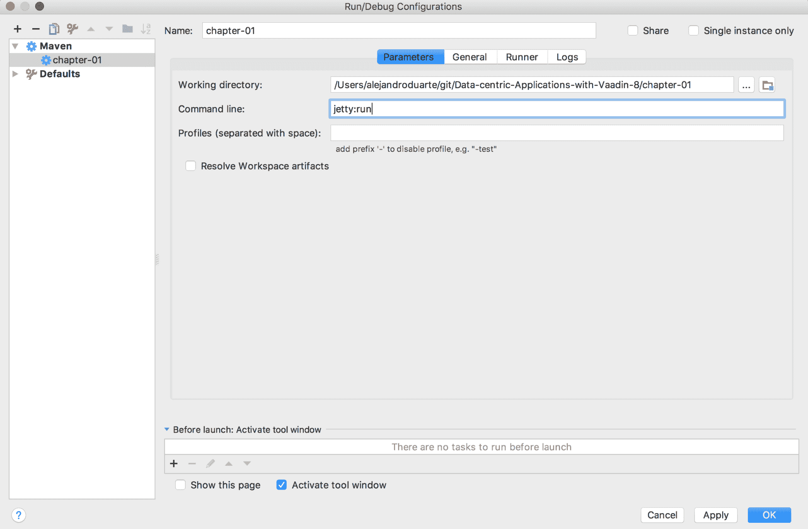
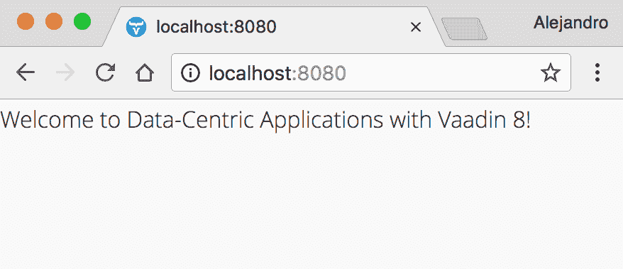
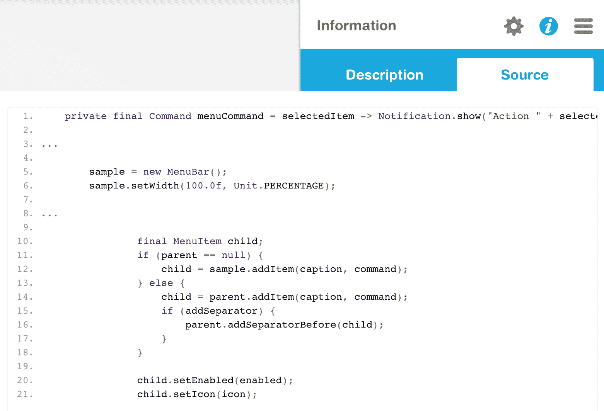

# 创建新的 Vaadin 项目

这第一章是通往充满有趣技术、激动人心的挑战和有用代码之旅的基础。如果您正在阅读这本书，您之前编写过 Vaadin 应用程序的可能性很高。您可能对 Vaadin 应用程序中的关键角色有基本了解：组件、布局、监听器、绑定器、资源、主题和小部件集；当然，您也分享过 Java 编码的经验！

在开始项目时拥有坚实的基础，不仅对于 Vaadin，对于任何其他技术也是如此，在成功项目中起着重要作用。了解您的代码做什么以及为什么需要它有助于您做出更好的决策并提高生产力。本章将帮助您了解运行 Vaadin 应用程序真正需要什么，以及您如何对启动新 Vaadin 项目所需的依赖项和 Maven 配置更有信心。

本章涵盖以下主题：

+   Vaadin 中的主要 Java 依赖项

+   Servlets 和 UIs

+   Maven 插件

+   Vaadin 应用程序中的关键元素

# 技术要求

您需要安装 Java SE 开发工具包和 Java EE SDK 版本 8 或更高版本。您还需要 Maven 版本 3 或更高版本。建议使用具有 Maven 支持的 Java IDE，例如 IntelliJ IDEA、Eclipse 或 NetBeans。最后，为了使用本书的 Git 仓库，您需要安装 Git。

本章的代码文件可以在 GitHub 上找到：

[`github.com/PacktPublishing/Data-centric-Applications-with-Vaadin-8/tree/master/chapter-01`](https://github.com/PacktPublishing/Data-centric-Applications-with-Vaadin-8/tree/master/chapter-01)

查看以下视频以查看代码的实际运行情况：

[`goo.gl/RHavBs`](https://goo.gl/RHavBs)

# 关于演示应用程序

本书以两种方式提供价值：书本身及其解释，以及其配套源代码。本书不是开发一个单一的应用程序，而是通过几个小型演示应用程序来展示每章中解释的概念。这有助于您跳转到任何感兴趣的章节，并完全理解代码各部分的用途，而无需担心我们在其他章节中探讨的技术细节。

# 理解源代码

在编译项目之前，您必须启动一个 H2 数据库实例。为了您的方便，`Data-centric-Applications-with-Vaadin-8/chapter-05` Maven 模块中已配置了一个服务器。您可以为此 Maven 命令创建一个运行配置，或者您可以直接在命令行上运行它：

```java
cd Data-centric-Applications-with-Vaadin-8/chapter-05
mvn test exec:java -Dexec.mainClass="packt.vaadin.datacentric.chapter05.jdbc.H2Server"
```

数据库启动并运行后，您可以通过执行以下操作构建所有演示应用程序：

```java
cd Data-centric-Applications-with-Vaadin-8
mvn install
```

所有演示应用程序都聚合在一个多模块 Maven 项目中，其中每个模块对应本书的一章。

本书假设您对 Maven 已经足够熟悉，能够跟随每一章的示例应用程序。如果您没有 Maven 或多模块 Maven 项目的先前经验，请花些时间浏览以下教程和文档：[`maven.apache.org/guides`](http://maven.apache.org/guides)。

每一章的模块可能包含多个子模块，具体取决于该章节所解释的概念。我们将使用 Jetty Maven 插件来运行示例。如今，大多数 IDE 都对 Maven 有很好的支持。使用本书代码的最佳方式是将 `Data-centric-Applications-with-Vaadin-8` Maven 项目导入您的 IDE，并为每个演示应用程序创建单独的 *运行配置*。网上有大量资源解释如何为最流行的 IDE（如 IntelliJ IDEA、NetBeans 和 Eclipse）执行此操作。例如，要在 IntelliJ IDEA 中运行本章的示例应用程序，创建一个新的运行配置，如下所示：



确保工作目录对应于项目中的正确模块。或者，您可以在命令行上执行以下操作来运行应用程序：

```java
cd Data-centric-Applications-with-Vaadin-8/chapter-01
mvn package jetty:run
```

这将执行 Maven 的打包阶段并启动 Jetty 服务器。应用程序应在 `http://localhost:8080` 上可用。

因此，继续前进！下载源代码，将其导入您的 IDE，并运行几个示例。请随意探索代码，修改它，甚至将其用于您自己的项目中。

# 理解 Vaadin 应用程序的架构

最好的开始新 Vaadin 项目的办法是什么？很难说。这取决于您的先前经验、当前的开发环境设置以及您的个人偏好。创建新 Vaadin 项目的最流行方法之一是使用官方的 *Maven 架构模板*。您可能已经使用过 `vaadin-archetype-application` Maven 架构模板，这对于快速开始使用 Vaadin 很有帮助。也许您已经使用过 `vaadin-archetype-widgetset` 架构模板来创建 Vaadin 扩展，或者您可能使用过 `vaadin-archetype-application-multimodule` 或 `vaadin-archetype-application-example` 架构模板来启动一些应用程序。例如，Eclipse 这样的 IDE 提供了创建 Vaadin 项目而不必考虑 Maven 架构模板的工具。

所有这些架构模板和工具都很好，因为它们能快速让您开始，并展示一些良好的实践。然而，当您从头开始创建项目时，您能更好地理解整个应用程序的架构。当然，如果您已经对生成的 `pom.xml` 文件中的每个部分都感到足够舒适，您可以使用这些架构模板。然而，从头开始构建项目是真正理解和控制您的 Vaadin 应用程序配置的好方法。

# 从头开始创建新项目

通常，您会使用 `vaadin-archetype-application` 或 `vaadin-archetype-application-multimodule` Maven 原型来创建一个新的 Vaadin 应用程序。如果您生成的代码符合您的需求，使用这些原型是没有问题的。然而，这些原型生成的代码比您需要的多，部分原因是因为它们试图向您展示如何开始使用 Vaadin，部分原因是因为它们是通用型启动器，非常适合大多数项目。但是，让我们通过以非常不同的方式创建一个 Vaadin 项目来完全控制（和理解）网络应用程序——一种更细粒度、更受控制的方式。

从根本上说，Vaadin 应用程序是一个打包为 `WAR` 文件的 Java 应用程序。您可以将它视为一个标准网络应用程序，其中您放置一些 JAR 文件，允许您使用 Java 编程语言而不是 HTML 和 JavaScript 来构建 Web UI。这就像将一些 JAR 文件放入您的 Java 项目中那么简单吗？让我们来看看！

使用 `maven-archetype-webapp` 通过在命令行中执行以下操作来生成一个简单的 Java 网络应用程序：

```java
mvn archetype:generate -DarchetypeGroupId=org.apache.maven.archetypes -DarchetypeArtifactId=maven-archetype-webapp
```

在提示时使用以下属性：

+   `groupId`: `packt.vaadin.datacentric.chapter01`

+   `artifactId`: `chapter-01`

+   `version`: `1.0-SNAPSHOT`

+   `package`: `packt.vaadin.datacentric.chapter01`

NetBeans、Eclipse 和 IntelliJ IDEA 等集成开发环境对 Maven 有很好的支持。您应该能够在 IDE 中使用之前提供的原型创建一个新的 Maven 项目，只需提供相应的 Maven 坐标，无需使用命令行。

清理 `pom.xml` 文件，使其看起来如下所示：

```java
<project ...>
    <modelVersion>4.0.0</modelVersion>

    <artifactId>chapter-01</artifactId>
    <version>1.0-SNAPSHOT</version>
    <packaging>war</packaging>
</project>
```

注意，在本书提供的代码中，您会在 `chapter-01` 项目的 `pom.xml` 文件中找到一个 `<parent>` 部分。这是因为本书的所有演示应用程序都已聚合到一个单独的 `Data-centric-Applications-with-Vaadin-8` Maven 项目中，以便您方便使用。如果您按照本章的步骤进行操作，您不需要在项目中添加任何 `<parent>` 部分。

删除 `src/main/webapp` 和 `src/main/resources` 目录。这将删除生成的 `web.xml` 文件，这将使 Maven 抱怨。为了告诉它这是故意的，请将以下属性添加到您的 `pom.xml` 文件中：

```java
    ...
    <packaging>war</packaging>

 <properties>
 <failOnMissingWebXml>false</failOnMissingWebXml>
    </properties>
    ...
```

此外，添加以下属性以配置 Maven 使用 Java 8：

```java
        <maven.compiler.source>1.8</maven.compiler.source>
        <maven.compiler.target>1.8</maven.compiler.target>
```

# Maven 依赖项

到目前为止，我们有一个非常简单的 Java 项目设置，它将被打包成 `WAR` 文件。下一步自然的步骤是添加所需的依赖项或库。Vaadin，就像许多其他 Java 网络应用程序一样，需要 Servlet API。按照以下步骤将其添加到 `pom.xml` 文件中：

```java
    <dependencies>
        <dependency>
            <groupId>javax.servlet</groupId>
            <artifactId>javax.servlet-api</artifactId>
            <version>3.1.0</version>
            <scope>provided</scope>
        </dependency>
    </dependencies>
```

注意，这个依赖项的范围被设置为 `provided`，这意味着服务器，或者更具体地说，Servlet 容器，如 Jetty 或 Tomcat，将提供实现。

让我们继续添加所需的 Vaadin 依赖项。首先，将 `vaadin-bom` 依赖项添加到您的 `pom.xml` 文件中：

```java
     <dependencyManagement>
        <dependencies>
            <dependency>
                <groupId>com.vaadin</groupId>
                <artifactId>vaadin-bom</artifactId>
                <version>8.3.2</version>
                <type>pom</type>
                <scope>import</scope>
            </dependency>
        </dependencies>
    </dependencyManagement>

```

本书使用 Vaadin 框架版本 8.3.2，这是撰写本书时的最新生产就绪版本。

Maven BOM，或物料清单，让你免于担心相关依赖项的版本；在这种情况下，是 Vaadin 依赖项。让我们接下来删除这些依赖项。将以下内容添加到你的 `pom.xml` 文件中：

```java
    <dependency>
        <groupId>com.vaadin</groupId>
        <artifactId>vaadin-server</artifactId>
    </dependency>
    <dependency>
        <groupId>com.vaadin</groupId>
        <artifactId>vaadin-client-compiled</artifactId>
    </dependency>
    <dependency>
        <groupId>com.vaadin</groupId>
        <artifactId>vaadin-themes</artifactId>
    </dependency>
```

由于 `vaadin-bom` 依赖，你无需显式设置这些版本的值。我们刚刚添加了一个服务器端 API (`vaadin-server`)，一个客户端引擎或小部件集 (`vaadin-client-compiled`)，以及 Valo 主题 (`vaadin-themes`)。

在这一点上，你可以在 `chapter-01` 目录内运行以下命令来编译项目：

```java
mvn clean install
```

如果你之前没有使用过 Vaadin 8.3.2，这将下载依赖项到你的本地 Maven 仓库。

# Servlet 和 UI

简单形式的 Vaadin 应用程序是一个将用户界面逻辑委托给 `UI` 实现的 `Servlet`。`vaadin-server` 依赖项包括 `Servlet` 实现：`VaadinServlet` 类。让我们来配置一个。

在 `src/main` 目录内创建一个名为 `java` 的新目录。

你可能需要告诉你的 IDE 这是一个源目录。你很可能会通过右键单击目录并选择将其标记为源目录的选项来找到它。请查阅你 IDE 的文档以获取详细说明。

创建一个名为 `packt.vaadin.datacentric.chapter01` 的新包，并在该包内添加一个简单的 `UI` 实现：

```java
public class VaadinUI extends UI {

    @Override
    protected void init(VaadinRequest vaadinRequest) {
        setContent(new Label("Welcome to Data-Centric Applications with Vaadin 8!"));
    }
}
```

添加一个新的 `WebConfig` 类来封装与网络配置相关的所有内容，并将 `VaadinServlet` 定义为一个内部类：

```java
public class WebConfig {

    @WebServlet("/*")
    @VaadinServletConfiguration(
          ui = VaadinUI.class, productionMode = false)
    public static class WebappVaadinServlet extends VaadinServlet {
    }
}
```

`WebappVaadinServlet` 类必须是 `public static`，以便 Servlet 容器可以实例化它。注意我们是如何使用 `@WebServlet` 注解将 `/*` 配置为 servlet URL 映射的。这使得应用程序在部署路径的根目录下可用。注意，`@VaadinServletConfiguration` 注解如何将 `Servlet` 连接到 `UI` 实现，即我们在上一步中实现的 `VaadinUI` 类。

# Maven 插件

你可能已经使用过，或者至少见过 Vaadin Maven 插件。它允许你编译小部件集和主题，以及其他任务。然而，在创建一个新的 Vaadin 应用程序时，你没有任何附加组件、自定义客户端组件或主题。这意味着你目前不需要 Vaadin Maven 插件。你可以使用由 `vaadin-client-compiled` 依赖提供的默认小部件集。

在这一点上，我们可以从至少一个 Maven 插件中受益：Jetty Maven 插件。虽然你可以配置大多数 IDE 以使用各种服务器来在开发期间部署你的应用程序，但 Jetty Maven 插件让你免去了进一步的特定配置，这使得开发者可以简单地选择他们偏好的工具。要使用此插件，请将以下内容添加到 `pom.xml` 文件中：

```java
<build>
    <plugins>
        <plugin>
            <groupId>org.eclipse.jetty</groupId>
            <artifactId>jetty-maven-plugin</artifactId>
            <version>9.3.7.v20160115</version>
        </plugin>
    </plugins>
</build>
```

在此基础上，你可以通过在 IDE 中创建一个新的运行配置来执行`mvn jetty:run`来运行应用程序。将你的浏览器指向`http://localhost:8080`，你应该会看到应用程序正在运行：



# 组件和布局

为了全面了解 Vaadin 应用程序的主要部分，让我们快速回顾一些你应该已经熟悉的最重要的类。在 Vaadin 应用程序中，大部分代码都与组件和布局相关。简而言之，你将`Label`、`TextField`、`CheckBox`、`ComboBox`和`Grid`等组件添加到`VerticalLayout`、`FormLayout`、`GridLayout`、`HorizontalLayout`和`CSSLayout`等布局中。你还可以将布局添加到布局中。

在设计或开发过程中，你可能想要探索框架中可用的组件和布局，以便你可以为特定场景选择最佳选项。查看框架中包含的所有组件和布局的一种方法是通过访问 Vaadin 示例器：[`demo.vaadin.com/sampler`](http://demo.vaadin.com/sampler)。你可以通过点击页面右上角的“信息”图标来查看代码示例：



# 监听器和绑定器

Vaadin 应用程序通过监听器和绑定器与服务器交互。监听器允许你处理用户交互，而绑定器允许你保持输入组件（如`TextField`）和域对象（例如，自定义的`User`类）的值同步。

# 事件和监听器

在 Vaadin 应用程序中，行为是通过*监听器*添加的。当发生相应的动作时，监听器会触发一个事件，这通常是由用户与 UI 的交互引起的。Vaadin 中最常见的两个监听器是`ClickListener`（用于按钮）和`ValueChangeListener`（用于输入组件）。监听器通常通过实现*功能接口*来定义，这允许你使用方法引用来响应事件：

```java
protected void init(VaadinRequest vaadinRequest) { 
   Button button = new Button("Click this");
   button.addClickListener(this::buttonClicked);
}
...
private void buttonClicked(Button.ClickEvent event) {
    Notification.show("Thanks for clicking");
}
```

你也可以使用 Lambda 表达式：

```java
button.addClickListener(
        event -> Notification.show("Thanks for clicking"));
```

为了使其更易于阅读和测试，将监听器逻辑提取到新的方法中，只传递所需的参数（在这种情况下，不需要传递任何参数）：

```java
protected void init(VaadinRequest vaadinRequest) { 
   ...
   button.addClickListener(event -> buttonClicked());
}
...
private void buttonClicked() {
    Notification.show("Thanks for clicking");
}
```

# 数据绑定

数据绑定通常通过`Binder`类来完成。这个类允许你将一个或多个字段中的值连接到域类中的 Java 属性。假设你有一个`User`类（域类），它有一个作为其属性之一的 Java `String`类型的`password`。你可以创建一个`TextField`并将其值绑定到`password`属性，如下所示：

```java
TextField textField = new TextField(“Email”);
Binder binder = new Binder<User>()
    .forField(textField)
    .bind(User::getPassword, User::setPassword);
```

这是一种强大且类型安全的实现数据绑定的方式。想象一下，在开发过程中，你决定将 `User` 类中的 `password` 属性重命名为类似 `pin` 的名称。你可以使用 IDE 的重构工具来重命名属性，IDE 将重命名获取器、设置器和调用这些方法的任何代码。当然，你必须自己将标题 `"Email"` 改为 `"PIN"`，但这也适用于其他绑定机制。

绑定器也用于添加验证器和转换器。这些可以使用 Lambda 表达式或方法引用添加。例如，以下代码片段检查一个 `String` 是否恰好有 `4` 个字符，并将其转换为整数：

```java
binder.withValidator(s -> s.length() == 4, “Must be 4 characters")
      .withConverter(Integer::parseInt, Object::toString);
```

# 资源和主题

`Resource` 接口及其实现是 Java 代码与图像、可下载文件或嵌入式内容等资源之间的连接。你可能已经使用过 `StreamResource` 来动态生成用户可以下载的文件，或者使用 `ThemeResource` 在你的 UI 中显示图像。

主题，反过来，是一组用于配置 Vaadin 应用程序外观的静态资源。默认情况下，Vaadin 应用程序使用 Valo 主题，这是一组强大的样式，可以使用变量进行配置。

# 小部件集和附加组件

到目前为止，你已经了解了 Vaadin 应用程序最常见的一部分。Vaadin 主要关于使用在服务器端运行的 Java API。这段 Java 代码定义了应用程序的外观和行为，但 Vaadin 应用程序是在浏览器上使用 HTML 5 和 JavaScript 运行的。你不需要编写一行 HTML 或 JavaScript 代码来实现 Vaadin 应用程序。这是如何实现的？Java 类是如何定义在浏览器中渲染的 HTML 的？

理解这一点的关键是 *小部件集*。小部件集是在客户端运行的 JavaScript 引擎，其中包含显示组件和与服务器端通信所需的所有代码。小部件集是通过使用 GWT 将一组 Java 类编译成 JavaScript 生成的。这些 Java 类由 Vaadin 框架提供，如果你想的话，可以添加自己的。如果你没有使用自定义客户端组件（你自己的或第三方 Vaadin 附加组件提供的），你可以使用已经编译好的小部件集，该小部件集包含在 `vaadin-client-compiled` 依赖项中。

# 摘要

本章作为 Vaadin 应用程序架构及其主要角色的介绍。我们解释了 Vaadin 应用程序最重要的部分以及它们是如何连接的。我们还学习了如何从头开始创建一个最小的 Vaadin 应用程序，通过添加我们自己需要的每一个配置。

在下一章中，你将学习如何实现主屏幕和自定义应用程序模块，这些模块在运行时会与 Vaadin 应用程序发现并注册。
