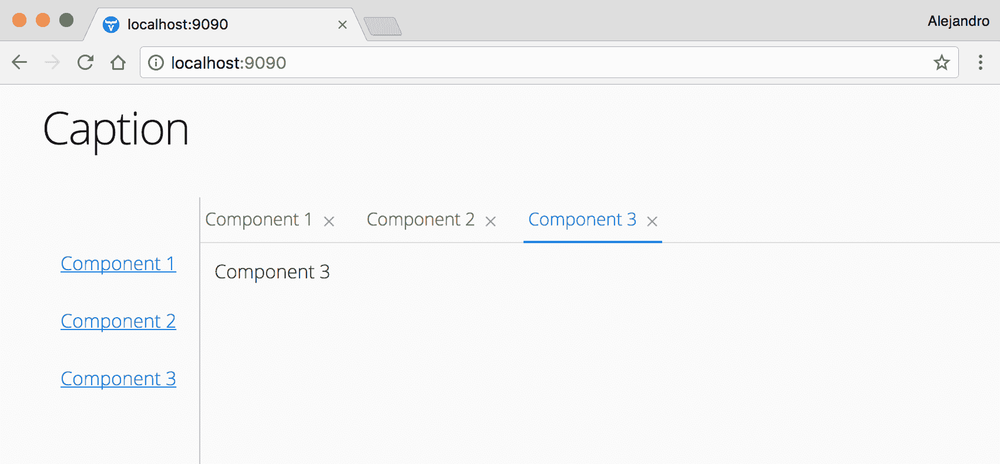
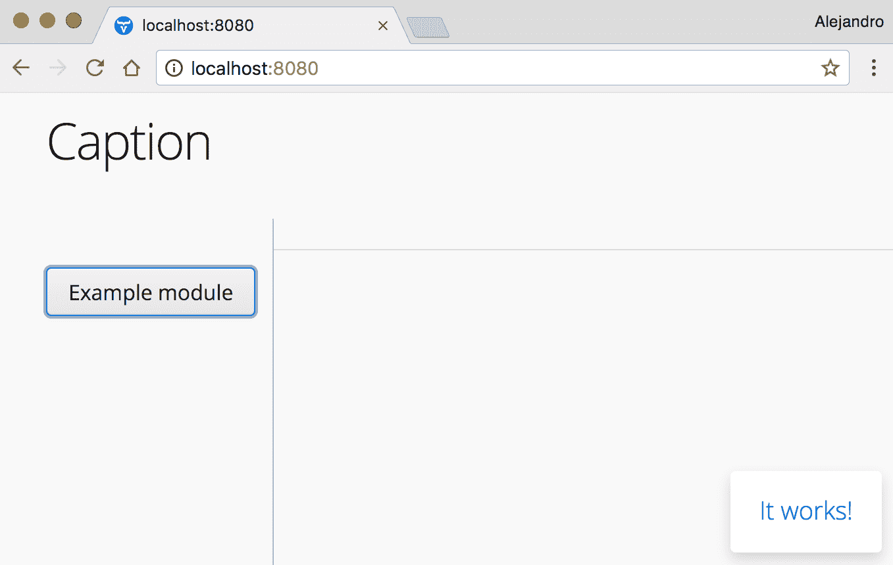

# 模块化和主屏幕

模块化的主要目的是降低系统的复杂性。通过将功能划分为多个模块，开发者可以 *忘记* 与正在开发的功能不相关的系统部分。它还通过例如允许根据环境或客户激活功能，以及创建第三方模块以自定义和扩展应用程序的功能等方式，使部署过程更加高效。

本章演示了如何模块化您的应用程序以使其更易于管理和维护，以及如何实现一个支持在运行时注册新模块的主屏幕。

本章涵盖了以下主题：

+   Vaadin 应用程序的模块化

+   应用程序主屏幕的实现

# 技术要求

您需要拥有 Java SE 开发工具包和 Java EE 开发工具包版本 8 或更高版本。您还需要 Maven 版本 3 或更高版本。建议使用具有 Maven 支持的 Java IDE，例如 IntelliJ IDEA、Eclipse 或 NetBeans。最后，为了使用本书的 Git 仓库，您需要安装 Git。

本章的代码文件可以在 GitHub 上找到：

[`github.com/PacktPublishing/Data-centric-Applications-with-Vaadin-8/tree/master/chapter-02`](https://github.com/PacktPublishing/Data-centric-Applications-with-Vaadin-8/tree/master/chapter-02)

查看以下视频以查看代码的实际运行情况：

[`goo.gl/VnLouE`](https://goo.gl/VnLouE)

# 创建多模块 Maven 项目

一个 *多模块* Maven 项目将多个 Maven 项目聚合为一个单一的项目。在本章中，我们将创建三个模块，形成一个完整的应用程序：

+   `webapp`: 一个打包为 WAR 文件的 Vaadin 网络应用程序，包括部署到服务器（如 Tomcat、Wildfly、Jetty 或任何其他 Java 服务器）所需的一切

+   `api`: 一个打包为 JAR 的 Java API，由 webapp 和任何 *功能模块* 使用

+   `example-module`: 一个使用 `api` JAR 添加应用程序功能的 *功能模块* 示例

所有这些模块都聚合到一个名为 `chapter-02` 的单个 Maven 项目中。让我们首先使用 `pom-root` Maven 架构创建这个聚合项目。在终端中运行以下命令：

```java
mvn archetype:generate \
-DarchetypeGroupId=org.codehaus.mojo.archetypes \
-DarchetypeArtifactId=pom-root \
-DarchetypeVersion=RELEASE
```

当提示时，请使用以下属性：

+   `groupId`: `packt.vaadin.datacentric`

+   `artifactId`: `chapter-02`

+   `version`: `1.0-SNAPSHOT`

+   `package`: `packt.vaadin.datacentric.chapter02`

当使用此架构时，Maven 为顶级多模块或聚合项目生成一个 `pom.xml` 文件。您可以删除 `<name>` 标签，因为它对我们来说是不必要的。修改文件以包含一个用于 Vaadin 版本的属性：

```java
<project  xsi:schemaLocation="…">
    <modelVersion>4.0.0</modelVersion>

    <groupId>packt.vaadin.datacentric</groupId>
    <artifactId>chapter-02</artifactId>
    <version>1.0-SNAPSHOT</version>
```

```java
    <packaging>pom</packaging>

    <properties>
        <vaadin.version>8.3.2</vaadin.version>
    </properties>
</project>
```

注意，在本书提供的代码中，您会在`chapter-02`项目的`pom.xml`文件中找到一个`<parent>`部分。这是因为本书的所有演示应用程序都已聚合到一个单独的`Data-centric-Applications-with-Vaadin-8` Maven 项目中，以便您使用。如果您遵循本章中的步骤，则不需要在项目中添加任何`<parent>`部分。

这个项目（`chapter-02`）可以被视为一个完整应用程序的根目录，该应用程序包含多个 Maven 模块，每个模块都致力于系统功能的一个特定方面。

# 实现应用程序的主屏幕

让我们从实现一个具体组件开始：一个主屏幕，这是每个 Web 应用程序都需要的东西。请记住，实现主屏幕的方式不止一种。这里提供的示例可能适合您的应用程序，或者它可能激发您开发更复杂的实现。

在本例中的主屏幕主要由一个*标题栏*、一个*菜单*和一个*工作区域*组成，当用户从主菜单中选择一个选项时，其他组件会显示在工作区域中。对于外部世界来说，这个组件应该包括以下功能：

+   向标题栏添加组件

+   向工作区域添加组件

+   向主菜单添加选项

+   添加监听器以响应用户操作

+   从工作区域和标题栏获取组件

# 定义应用程序主屏幕的 API

为了探索和学习使用 Vaadin 进行 Web 开发中的 API 设计，让我们假设我们希望主屏幕是一个通用组件，不仅仅用于这个演示应用程序。因此，我们需要将组件提供在一个单独的 JAR 文件中。首先，在`chapter-02`项目中使用`maven-archetype-simple`存档创建一个新的 Maven 模块，如下所示：

```java
cd chapter-02
mvn archetype:generate -DarchetypeGroupId=org.apache.maven.archetypes -DarchetypeArtifactId=maven-archetype-quickstart
```

当提示时，请使用以下属性：

+   `groupId: packt.vaadin.datacentric.chapter02`

+   `artifactId: api`

+   `version: 1.0-SNAPSHOT`

+   `package: packt.vaadin.datacentric.chapter02.api`

确认新的`api`模块已列在`chapter-02/pom.xml`文件中：

```java
<project ...>
    ...
    <modules>
        <module>api</module>
    </modules>
</project>
```

根据需要清理，并添加 Vaadin BOM 和`vaadin-server`依赖项。您还可以删除生成的`App`和`AppTest`类。您还需要使用属性配置 Java 8，类似于上一章中所述的方法。

您可以在本书所附源代码的`Data-centric-Applications-with-Vaadin-8\chapter-02\api` Maven 项目的`pom.xml`文件中找到完整的`pom.xml`文件。

API 应该允许开发者创建具有类似功能的其他具体主屏幕实现。可以通过定义以下 Java 接口来抽象这个功能：

```java
public interface ApplicationLayout extends Component {

 void addHeaderComponent(Component component);

 void addWorkingAreaComponent(WorkingAreaComponent
         component);

 Collection<Component> getHeaderComponents();

 Collection< WorkingAreaComponent> getWorkingAreaComponents();

 void addMenuOption(MenuOption menuOption,
         SerializableConsumer<MenuOption> clickListener);

}
```

`ApplicationLayout`接口和相关类位于本书所附源代码的`Data-centric-Applications-with-Vaadin-8/chapter-02/api` Maven 项目中。

此接口扩展了 `Component`，因此任何具体的实现都可以用作常规 UI 组件，并添加到任何 Vaadin 组件容器中，例如 `VerticalLayout`。具体的实现将扩展 `Composite`，这将在稍后展示。

# 实现支持类

之前的界面无法编译。需要实现两个类：`WorkingAreaComponent` 和 `MenuOption`。`addWorkingAreaComponent(WorkingAreaComponent)` 方法期望传入一个 `WorkingAreaComponent`，它封装了一个标题和要显示的相应的 Vaadin 组件。此接口定义如下：

```java
public interface ApplicationLayout extends Component {

    public static class WorkingAreaComponent
            implements Serializable {

        private final String caption;
        private final Component component;

        public WorkingAreaComponent(String caption,
                Component component) {
            this.caption = caption;
            this.component = component;
        }

       ... hashCode(), equals(), and getters 
    }
    ...
}
```

`WorkingAreaComponent` 类实现了 `Serializable` 接口。Vaadin 主要是一个服务器端框架。组件存储在 HTTP 会话中。为了序列化会话，所有包含的对象都必须是 `Serializable` 的。例如，在停止像 Jetty 或 Tomcat 这样的 Web 容器时，会进行这种序列化。所有 HTTP 会话都会序列化到磁盘，下次服务器启动时，会话会被恢复。注意，`SerializableConsumer` 在 `ApplicationLayout` 接口中也是出于同样的原因被使用的。

为什么需要这样做？为什么不简单地将 `addWorkingAreaComponent(WorkingAreaComponent)` 方法的参数设置为标题和组件，就像以下代码片段所示？

```java
void addWorkingAreaComponent(String caption, Component component);
```

如果你百分之百确定，当你向工作区域添加新组件时，只需要一个标题和一个组件，那就没问题。然而，你不知道具体的 `ApplicationLayouts` 将如何发展。如果需要图标怎么办？颜色或帮助文本呢？

假设你已经决定将方法实现为 `addWorkingAreaComponent(String, Component)`，几个月后，某个使用该组件的应用程序需要为添加到工作区域中的每个组件提供一个图标。一个可能的解决方案是将方法修改为接受一个用于图标的新的参数，如下所示：

```java
void addWorkingAreaComponent(String caption, Component component,
        Resource icon);
```

这种修改将破坏任何引用旧方法签名的现有客户端。另一种方法是通过添加新参数来重载方法。然而，这将破坏所有当前的 `ApplicationLayout` 实现。封装可能发生变化的内容总是一个好主意。

封装 `addWorkingAreaComponent(WorkingAreaComponent)` 方法的参数的另一个原因是 `getWorkingAreaComponents()` 方法。假设你想实现一个具体的 `ApplicationLayout`，允许用户在标签页和窗口之间切换。为了实现这个功能，你需要获取当前显示在工作区域中的所有组件（使用 `getWorkingAreaComponents(WorkingAreaComponent)` 方法），并将它们相应地放置在标签页或窗口中。对于每个组件，你需要创建一个标签页或窗口，设置其标题，并添加相应的 Vaadin 组件。你需要标题和组件。将这些对象封装在单个类中可以极大地简化这项任务；否则，我们需要有一个额外的方法来返回有序集合形式的标题。此外，`getWorkingAreaComponents()` 方法也应该返回一个有序集合。

关于 `ApplicationLayout` 类需要注意的最后一件事是 `addMenuOption(MenuOption, SerializableConsumer<MenuOption>)` 方法。此方法期望一个 `MenuOption`（封装要渲染的标题）和一个 `SerializableConsumer`，它作为菜单选项的点击监听器。当用户点击选项时，会调用 `Consumer.accept(MenuOption)` 方法，并将点击的 `MenuOption` 作为其参数传递。

`SerializableConsumer` 是 `Consumer` 类的可序列化版本，它是 Java 8 中引入的一种函数式接口。函数式接口只有一个抽象方法。这允许客户端使用 lambda 表达式创建接口的实例。有关函数式接口的更多信息，请参阅：

[`docs.oracle.com/javase/8/docs/api/java/lang/FunctionalInterface.html`](http://docs.oracle.com/javase/8/docs/api/java/lang/FunctionalInterface.html).

`MenuOption` 类可以按照以下方式实现：

```java
public interface ApplicationLayout extends Component {

    public static class MenuOption implements Serializable {
        private final String caption;

        public MenuOption(String caption) {
            this.caption = caption;
        }

        public String getCaption() {
            return caption;
        }
    }
}
```

# 实现具体应用程序的主屏幕

本节解释了如何使用上一节中开发的 `ApplicationLayout` 接口实现和使用基本的基于标签的布局。布局包括顶部的标题和左侧的侧边菜单。当用户在主菜单上点击选项时，会在新的标签页内添加一个新的组件。以下是这个布局的截图：



# 添加和配置所需的 UI 组件

第一步是创建所需的 Vaadin UI 组件，并使用标准 Vaadin API 进行配置。这可以按照以下方式完成：

```java
public class TabBasedApplicationLayout extends Composite {

    private VerticalLayout mainLayout = new VerticalLayout();
    private HorizontalLayout header = new HorizontalLayout();
    private HorizontalSplitPanel splitPanel
            = new HorizontalSplitPanel();
    private VerticalLayout menuLayout = new VerticalLayout();
    private TabSheet tabSheet = new TabSheet();

    public TabBasedApplicationLayout(String caption) {
        ... layout and components configuration
    }
}
```

配置 UI 元素的代码被省略了，因为本书的目的不是解释 Vaadin UI 组件的基本使用和配置。完整的实现可以在本书附带的源代码的 `Data-centric-Applications-with-Vaadin-8\chapter-02\api` Maven 项目中找到。

# 实现 ApplicationLayout 接口

下一步是实现 `ApplicationLayout` 接口并添加所需的方法：

+   `void addHeaderComponent(Component)`

+   `void addWorkingAreaComponent(WorkingAreaComponent)`

+   `Collection<Component> getHeaderComponents()`

+   `Collection<WorkingAreaComponent> getWorkingAreaComponents()`

+   `void addMenuOption(MenuOption, SerializableConsumer<MenuOption>)`

实现`addHeaderComponent(Component)`方法相当直接：

```java
@Override
public void addHeaderComponent(Component component) {
    component.setWidth(null);
    header.addComponent(component);
    header.setComponentAlignment(component,
            Alignment.MIDDLE_RIGHT);
}
```

`addWorkingAreaComponent(WorkingAreaComponent)`方法应避免添加具有相同标题的两个标签页。而不是两次添加相同的标签页，它应该选择相应的现有标签页。使用`Collection`来跟踪添加的组件，如下面的代码所示：

```java
public class TabBasedApplicationLayout extends CustomComponent
        implements ApplicationLayout {
    ...

    private Collection<WorkingAreaComponent> workingAreaComponents
            = new HashSet<>();

    @Override
    public void addWorkingAreaComponent(WorkingAreaComponent
            component) {
        addWorkingAreaComponent(component, true);
    }

    public void addWorkingAreaComponent(WorkingAreaComponent
            component, boolean closable) {
        if (!workingAreaComponents.contains(component)) {
            TabSheet.Tab tab = tabSheet.addTab(
                    component.getComponent(),
                            component.getCaption());
            tab.setClosable(closable);
            tabSheet.setSelectedTab(tab);
            workingAreaComponents.add(component);
        } else {
            showComponent(component.getCaption());
        }
    }

    public void showComponent(String caption) {
        IntStream.range(0, tabSheet.getComponentCount())
                .mapToObj(tabSheet::getTab)
                .filter(tab -> tab.getCaption().equals(caption))
                .forEach(tabSheet::setSelectedTab);
    }
}
```

由于这个具体实现基于一个`TabSheet`，其中每个标签页可以关闭或不能关闭，因此重载`ApplicationLayout.addWorkingAreaComponent(WorkingAreaComponent)`方法以允许客户端指定此行为是有意义的。

上一段代码中一个有趣的部分是`showComponent(String)`方法，该方法通过标题选择标签页。此方法使用`IntStream`遍历`TabSheet`中的标签页。此方法等同于以下方法：

```java
public void showComponent(String caption) {
   for(int i = 0; i < tabSheet.getComponentCount(); i++) {
       TabSheet.Tab tab = tabSheet.getTab(i);

       if(tab.getCaption().equals(caption)) {
           tabSheet.setSelectedTab(tab);
       }
   }
}
```

`showComponents(String)` 方法的实现使用了两个 Java 8 特性：流和管道。有关流和管道的更多信息，请参阅[`docs.oracle.com/javase/tutorial/collections/streams/index.html`](http://docs.oracle.com/javase/tutorial/collections/streams/index.html)。

下一个要实现的方法是`getHeaderComponents()`：

```java
@Override
public Collection<Component> getHeaderComponents() {
    return IntStream.range(0, header.getComponentCount())
            .mapToObj(header::getComponent)
            .collect(Collectors.toList());
}
```

此方法使用与`showComponent(String)`方法中类似的`IntStream`。使用`Collector`创建一个包含标题中所有组件的`List`。

由于我们已经有了一个包含工作区域所有组件的`Collection`对象，因此`getWorkingAreaComponents()`方法的实现只是一个常规的 getter：

```java
@Override
public Collection<WorkingAreaComponent> getWorkingAreaComponents() {
    return workingAreaComponents;
}
```

# 实现菜单

为了使菜单正常工作，我们可以按照以下方式实现`addMenuOption(MenuOption, SerializableConsumer<MenuOption>)`方法：

```java
public class TabBasedApplicationLayout ... {
    ...
    private Collection<String> menuButtonStyles = new HashSet<>();
    ...

    @Override
    public void addMenuOption(MenuOption menuOption,
            SerializableConsumer<MenuOption> clickListener) {
        Button button = new Button(menuOption.getCaption(),
                event -> clickListener.accept(menuOption));
        menuButtonStyles.forEach(button::addStyleName);
        menuLayout.addComponent(button);
    }
    ...
}
```

此方法遍历`menuButtonStyles`集合，将每个样式添加到新按钮中。最后，设置菜单选项和标题样式的相关方法应如下所示：

```java
public void setHeaderStyleName(String styleName) {
    header.setStyleName(styleName);
}

public void addHeaderStyleName(String styleName) {
    header.addStyleName(styleName);
}

public void setMenuButtonsStyleName(String styleName) {
    menuButtonStyles.clear();
    menuButtonStyles.add(styleName);
    updateMenuButtonsStyle(styleName,
            Component::setStyleName);
}

public void addMenuButtonsStyleName(String styleName) {
    menuButtonStyles.add(styleName);
    updateMenuButtonsStyle(styleName,
            Component::addStyleName);
}

private void updateMenuButtonsStyle(String styleName,
        BiConsumer<Component, String> setOrAddStyleMethod) {
    IntStream.range(0, menuLayout.getComponentCount())
            .mapToObj(menuLayout::getComponent)
            .forEach(component ->
                    setOrAddStyleMethod.accept(
                            component, styleName));
}
```

组件现在已准备就绪！我们可以在任何 Vaadin 应用程序中使用它。您可以通过与上一章类似的方式创建 Vaadin 应用程序，或者使用标准的 Vaadin Maven 存档。`chapter-02`模块包括`webapp`子模块，一个 Vaadin 网络应用程序。以下是在`webapp`模块中`UI`实现的初始化方法：

```java
protected void init(VaadinRequest request) {
    TabBasedApplicationLayout layout =
            new TabBasedApplicationLayout("Caption");
    IntStream.range(1, 4)
            .mapToObj(i -> new Label("Component " + i))
            .map(l -> new ApplicationLayout.WorkingAreaComponent(
                    l.getValue(), l))
            .forEach(c -> layout.addMenuOption(
                    new ApplicationLayout.MenuOption(
                            c.getCaption()),
                    (option) ->
                            layout.addWorkingAreaComponent(
                                    c, true)));
    layout.setMenuButtonsStyleName(ValoTheme.BUTTON_LINK);
    setContent(layout);
}
```

在编译和再次运行应用程序之前，请记住将`api`依赖项添加到`webapp`模块的`pom.xml`文件中：

```java
<dependency>
    <groupId>packt.vaadin.datacentric.chapter02</groupId>
    <artifactId>api</artifactId>
    <version>1.0-SNAPSHOT</version>
</dependency>
```

尽管在前几节中我们已经通过使用 Vaadin 框架的核心学习了如何构建一个裸骨的主屏幕，但你应该考虑使用在 Vaadin 目录网站发布的 *SideMenu Add-on*（[`vaadin.com/directory/component/sidemenu-add-on`](https://vaadin.com/directory/component/sidemenu-add-on)）。这个组件允许你快速实现类似于在官方 *dashboard demo* 中的侧菜单，你可以在 [`demo.vaadin.com/dashboard`](https://demo.vaadin.com/dashboard) 上看到这个 demo。

# 模块化 Vaadin 应用程序

在本书中，我们使用术语模块来指代一个可以独立开发和部署的软件组件。从这个意义上讲，模块化应用程序可以在不分发或修改原始应用程序源代码的情况下进行定制和扩展。就我们的目的而言，当一个新的模块被部署时，它必须向应用程序注册。模块的功能在运行时被整合到应用程序中。

请记住，也存在 Maven 模块。本书在提到这类模块时使用完整的术语 Maven 模块或 Maven 项目。

# 识别模块化的替代方案

在 Java 中实现模块化应用程序有几种机制和方法。例如，如果你需要提供热部署——即运行时部署和卸载模块的能力，你可以使用 OSGi。另一个选项是 **服务提供者接口**（**SPI**），它是 Java SE 中包含的一组标准接口和类，有助于开发可扩展的应用程序。你甚至可以使用 **上下文和依赖注入**（**CDI**）或一个 *控制反转* 框架，例如 Spring 框架提供的框架，来开发基于注入机制的定制模块系统。此外，你还可以使用 Java 反射 API 来创建编译时未知的类的实例。

由于解释所有这些替代方案超出了本书的范围，我们将使用最简单的替代方案：SPI。

# 在应用程序中注册模块

在应用程序中注册模块意味着将模块的功能添加到应用程序中。这个模块注册执行的操作取决于应用程序的需求。例如，如果应用程序包含主菜单，那么一个模块的可能的注册操作是向主菜单添加菜单项。如果应用程序基于标签页，一个可能的注册操作可以是向主屏幕添加标签页。所有这些操作都需要通过一个共享的 API 来执行。以添加菜单项为例。在这种情况下，一个可能的接口可能如下所示：

```java
public interface MenuItemRegistration {
    void addMenuItem(MenuBar menu);
}
```

模块可以实现此接口，将菜单项添加到现有应用程序的主菜单中。

由于我们已经有了一个 `ApplicationLayout` 接口，该接口定义了用于操作布局的方法，所以以下接口就足够好了：

```java
public interface AppModule {
    void register(ApplicationLayout layout);
}
```

`AppModule` 接口位于本书附带源代码的 `Data-centric-Applications-with-Vaadin-8\chapter-02\api` Maven 项目中。

此接口可以打包到一个单独的 JAR 文件中，以便可以将其分发给任何第三方开发者。此 JAR 应包含模块实现可能需要的所有类和接口。这就是我们之前创建 `api` Maven 模块的原因。这也有另一个优点：`api` JAR 可以分发给第三方开发者，使他们能够在不分发整个 Web 应用程序编译代码的情况下为应用程序创建新功能。

# 发现模块

`webapp` 应用程序应在运行时检测所有 `AppModule` 的实现。对于每个实现，它应该创建一个新的实例并调用 `register(ApplicationLayout)` 方法。使用 Java SPI 来做这件事非常简单：

```java
public class VaadinUI extends UI {

    protected void init(VaadinRequest vaadinRequest) {
        TabBasedApplicationLayout layout
              = new TabBasedApplicationLayout("Caption");
        setContent(layout);
        loadModules(layout);
    }

    private void loadModules(
            ApplicationLayout applicationLayout) {
        ServiceLoader<AppModule> moduleLoader =
                ServiceLoader.load(AppModule.class);
        moduleLoader.forEach(
                module -> module.register(applicationLayout));
    }
}
```

使用 `ServiceLoader` 类来发现实现 `AppModule` 接口的所有类。对于每个模块，我们调用其 `register` 方法，传递应用程序布局以给模块机会初始化自身并在需要时修改布局。

# 实现新模块

新模块必须实现 `AppModule` 接口，并遵循 SPI 要求进行打包，通过在 `META-INF/services` 目录中添加一个名为 `packt.vaadin.datacentric.chapter02.api.AppModule` 的新文件来实现。此文件必须包含 `AppModule` 实现的完全限定名称。

假设你想开发一个模块，该模块在点击主菜单时显示通知选项。这可以很容易地实现如下：

```java
package com.example;
...

public class ExampleModule implements AppModule {

    @Override
    public void register(ApplicationLayout layout) {
        ApplicationLayout.MenuOption menuOption
            = new ApplicationLayout.MenuOption("Example module");
        layout.addMenuOption(menuOption, this::optionClicked);
    }

    private void optionClicked(
                ApplicationLayout.MenuOption menuOption) {
        Notification.show("It works!",
                Notification.Type.TRAY_NOTIFICATION);
    }
}
```

此类可以位于一个单独的 Maven 项目中，并应包含 `api` 依赖项。

`ExampleModule` 的实现位于本书附带源代码的 `Data-centric-Applications-with-Vaadin-8\chapter-02\example-module` Maven 项目中。

要使模块可由 `webapp` 应用程序发现，你必须在新模块的 `main/resources/META-INF/services` 目录中添加一个名为 `packt.vaadin.datacentric.chapter02.api.AppModule` 的文件。该文件必须包含 `AppModule` 实现的完全限定名称，如下所示：

```java
packt.vaadin.datacentric.chapter02.example.module.ExampleModule
```

一旦打包，你可以独立部署 JAR 文件，并且 `webapp` 应用程序应该自动发现并注册该模块。

要将模块与 Web 应用程序一起部署，你可以在 `Data-centric-Applications-with-Vaadin-8/chapter-02/webapp` Maven 项目的 `pom.xml` 文件中将其添加为依赖项。如果你将应用程序作为 WAR 文件部署到 Servlet 容器，你可以将 JAR 文件添加到 `WEB-INF/lib` 目录。

下图是应用程序的截图，显示了正在运行的示例模块：



# 摘要

在本章中，我们开发了一个自包装的 UI 组件（一个*主屏幕*组件），创建了一个多模块 Maven 项目，并学习了如何在运行时通过 Vaadin 应用程序发现和注册特定应用模块的实现方法。在解释这些概念的同时，我们还看到了一些 Java 8 和 Vaadin 8 的代码片段，这些片段突出了良好的实践，例如使代码更易于维护和扩展。

在下一章中，你将学习如何实现具有多语言功能的登录表单。
