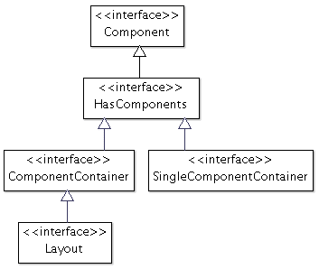
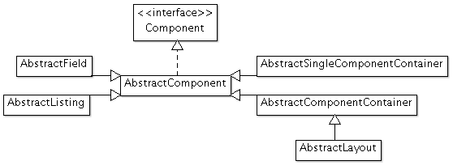
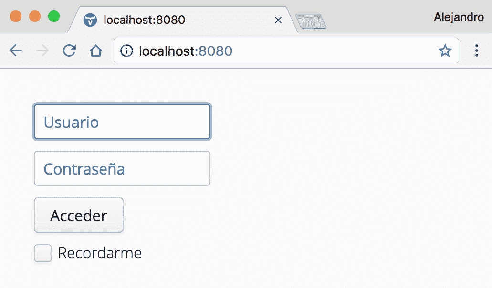

# 使用国际化实现服务器端组件

在 Web 应用程序中，拥有一个登录表单可以说是最常见的需求之一。在本章中，你将学习如何实现一个可重用且可扩展的登录表单，它支持多种语言，并看到在实现 UI 组件时优先考虑*组合*而非*扩展*的优势。通过示例，我们将讨论为什么*扩展*并不总是最佳方法，并探讨使用 Vaadin 实现自定义服务器端 UI 组件的几种替代方案。

本章涵盖了以下主题：

+   扩展布局组件

+   使用`Composite`类

+   外部化 Java 字符串

# 技术要求

你需要拥有 Java SE 开发工具包和 Java EE SDK 版本 8 或更高版本。你还需要 Maven 版本 3 或更高版本。建议使用具有 Maven 支持的 Java IDE，如 IntelliJ IDEA、Eclipse 或 NetBeans。最后，为了使用本书的 Git 仓库，你需要安装 Git。

本章的代码文件可以在 GitHub 上找到：

[`github.com/PacktPublishing/Data-centric-Applications-with-Vaadin-8/tree/master/chapter-03`](https://github.com/PacktPublishing/Data-centric-Applications-with-Vaadin-8/tree/master/chapter-03)

查看以下视频以查看代码的实际应用：

[`goo.gl/fu8W3W`](https://goo.gl/fu8W3W)

# 使用扩展来开发 UI 组件

让我们探讨如何实现一个登录表单组件。在开始开发 UI 组件时，脑海中首先浮现的想法是在 Java 意义上扩展现有组件。大多数情况下，自然的选择是扩展布局组件，如`VerticalLayout`或`HorizontalLayout`。例如，登录表单通常至少包括用户名字段、密码字段、登录按钮和一个记住我复选框，所有这些都垂直对齐。因此，让我们首先直接扩展`VerticalLayout`。

# 扩展 VerticalLayout

以下代码片段展示了扩展`VerticalLayout`以实现 UI 组件的典型方式，在这种情况下，是登录表单：

```java
public class LoginFormLayout extends VerticalLayout {

    private TextField username = new PasswordField();
    private PasswordField password = new PasswordField();
    private Button logIn = new Button();
    private CheckBox rememberMe = new CheckBox();

    public LoginFormLayout() {
        ...
        addComponents(username, password, logIn, rememberMe);
    }
    ...
}
```

在上一个示例中省略了处理事件和可能需要的额外 UI 配置的逻辑。

`LoginFormLayout`类的完整实现位于本书附带源代码的`Data-centric-Applications-with-Vaadin-8/chapter-03` Maven 项目中。

# 为什么避免扩展？

前一个实现有什么问题？嗯，它本身并没有什么固有的问题。然而，它可以得到极大的改进。《LoginFormLayout》类违反了封装性！该类的客户端知道使用了`VerticalLayout`。`VerticalLayout`的所有公共方法都暴露给了`LoginFormLayout`的客户端。如果出于某种原因，实现需要更改为不同的布局（例如`FormLayout`、`CssLayout`，甚至是`Panel`），调用`VerticalLayout`中任何不在新基类中的方法的客户端将会出错。

对于外界来说，`LoginFormLayout` 是一个 `Layout`。登录表单的目的不是作为布局（定位其他组件），而是显示用于验证用户与应用程序交互所需的字段。所以，让我们尝试在设计中获得更多的封装性！

# 使用组合来开发自定义组件

如果扩展 `VerticalLayout` 是一个问题，一个可能的解决方案是完全不扩展任何类。然而，在这种情况下，我们不会得到一个 `Component`，而是一个其实例不能添加到组件树中的类。那么扩展层次结构中更合适的组件怎么样？让我们从接口开始。以下图显示了层次结构中的一些顶级接口：



在层次结构中向上，我们找到了 `Component` 接口，它有超过 20 个需要实现的方法。其他接口继承这些 20 多个方法并添加一些。幸运的是，Vaadin 为这些接口提供了抽象实现。以下图显示了其中的一些等效实现：



`AbstractComponent` 是 `Component` 的默认实现。许多 Vaadin 组件直接扩展了这个类。然而，对于登录表单来说，它并不是一个方便的类，因为它太通用，并且不提供添加其他组件的方法。`AbstractField` 和 `AbstractListing` 也可以被丢弃，因为登录表单不仅仅是一个显示值或值列表的字段。

下一个候选类是 `AbstractSingleComponentContainer`、`AbstractComponentContainer` 和 `AbstractLayout`。这些类有助于布局的实现，但正如我们之前讨论的，登录表单不应该在对外界看来像布局一样。

# 实现工厂

那么组件工厂怎么样？以下是一个包含返回 `Component` 方法的工厂实现：

```java
public class LoginFormFactory {

    public static Component getComponent() {

        ... create and configure all required components

        return new VerticalLayout(
                username, password, button, rememberMe);
    }
}
```

这隐藏了实现细节，但也使得向客户端提供功能变得更加困难和复杂。例如，类客户端如何获取用户在表单中输入的用户名或密码值？一个选项是在工厂类中实现获取器，但这将需要在 `LoginFormFactory` 类中进行一些调整。最终，这种实现将需要你为单个自定义组件实现（并维护）两个高度耦合的类。这不是一个好主意。

# 使用复合类

如果你有一些 Vaadin 的经验，那么你很可能已经知道`CustomComponent`类。`Composite`类以与`CustomComponent`类相同的方式工作，但它更轻量，因为它只在浏览器 DOM 中添加一个简单的`<div>`元素。`Composite`类通过消除之前描述的一些问题来简化组件组合的开发。`Composite`直接扩展了`AbstractComponent`，这意味着任何扩展`Composite`的类本身就是一个`Component`，可以添加到任何 Vaadin 布局中。`Composite`可以指定一个组合根，作为组件树（通常是布局）的根，例如：

```java
public class LoginFormComponent extends Composite {

    public LoginFormComponent() {

        ... create and configure all required components

        VerticalLayout layout = new VerticalLayout(
                username, password, button, rememberMe);

        setCompositionRoot(layout);
    }

    ... getters and setters
}
```

# 使用`LoginForm`类

Vaadin 自带一个`LoginForm`类，默认情况下，它会渲染用户名和密码字段。它还在浏览器中添加了*自动完成*和*自动填充*功能。`LoginForm`类是一个很好的扩展候选（如果你想要覆盖其默认设置，你必须扩展它）。例如，以下代码片段创建了一个`loginForm`和一个监听器，当用户点击登录按钮时会被调用：

```java
LoginForm loginForm = new LoginForm()
loginForm.addLoginListener(e ->  {
    String password = e.getLoginParameter("password");
    String username = e.getLoginParameter("username");
    ...
});
```

要向表单中添加更多字段，请覆盖`createContent`方法。例如：

```java
LoginForm loginForm = new LoginForm() {
    @Override
    protected Component createContent(TextField username,
            PasswordField password, Button loginButton) {

        CheckBox rememberMe = new CheckBox();
        rememberMe.setCaption("Remember me");

        return new VerticalLayout(username, password, loginButton,
                rememberMe);
    }
};
```

尽管其设计是为了扩展，但总是通过扩展`Composite`并抽象出底层的`LoginForm`类来隐藏实现细节是一个好主意。以下代码片段展示了新`LoginFormComponent`类的一个初始迭代：

```java
public class LoginFormComponent extends Composite {

    private TextField username;
    private PasswordField password;
    private CheckBox rememberMe = new CheckBox();

    public LoginFormComponent() {
        LoginForm loginForm = new LoginForm() {
            @Override
            protected Component createContent(TextField username,
                    PasswordField password, Button loginButton) {
                LoginFormComponent.this.username = userNameField;
                LoginFormComponent.this.password = passwordField;

                rememberMe.setCaption("Remember me");

                return new VerticalLayout(username,password,
                        loginButton, rememberMe);
            }
        };

        setCompositionRoot(loginForm);
    }
}
```

`createContent`方法由`LoginForm`类内部调用。注意`username`和`password`变量是如何在`LoginFormComponent`类中被分配给引用的。这些引用可以在以后用来检索字段中的值。

允许`LoginFormComponent`类的客户端在用户点击登录按钮时被通知可以通过自定义`LoginListener`接口来实现：

```java
public class LoginFormComponent extends Composite {

    public interface LoginListener {
        void logInClicked(LoginFormComponent loginForm);
    }
    ...

    private LoginListener loginListener;

    public LoginFormComponent(LoginListener loginListener) {
        this();
        this.loginListener = loginListener;
    }

    public LoginFormComponent() {
        ...

        loginForm.addLoginListener(this::logInClicked);
        ...
    }

    public void setLoginListener(LoginListener loginListener) {
        this.loginListener = loginListener;
    }

    private void logInClicked(LoginForm.LoginEvent loginEvent) {
        if (loginListener != null) {
            loginListener.logInClicked(this);
        }
    }
}
```

`LoginListener`接口定义了一个接受`LoginFormComponent`的方法。现在，定义 getter 以允许客户端获取字段中的值变得很容易：

```java
public class LoginFormComponent extends Composite {
    ...

    public String getUsername() {
        return username.getValue();
    }

    public String getPassword() {
        return password.getValue();
    }

    public boolean isRememberMe() {
        return rememberMe.getValue();
    }
}
```

如果将来在登录表单中添加了新的组件，可以添加一个 getter 来返回添加的字段中的值，而不会破坏现有客户端的类。

`LoginFormComponent`类的最终版本可以在本书所附源代码的`Data-centric-Applications-with-Vaadin-8\chapter-03` Maven 项目中找到。

# 使用国际化支持多语言

**国际化**是指使一个应用程序准备好支持多种语言和数据格式的过程。一个国际化的应用程序可以被适应特定的语言和地区，这个过程称为**本地化**，它包括向国际化的应用程序添加一组特定的资源（通常是文本、图像和数据格式）。理想情况下，本地化不应该需要重新构建应用程序，而只需添加本地化资源，最多只需要重新启动 Web 容器。

在软件开发项目的早期阶段处理国际化，并了解受众，可以使这个过程变得容易得多。国际化与所有应用程序层都是正交的，本地化的过程可能涉及翻译和定义多个资源，如文本、图像、视频、音频文件、数字格式、日期格式、货币符号，甚至颜色。

# 移除硬编码的字符串

自定义可重用 UI 组件不应依赖于处理国际化的机制。例如，`LoginFormComponent`应该包含设置器（或者也可以在构造函数中提供参数）来配置内部 UI 组件的标题。以下实现展示了如何使用设置器在登录表单中配置标题：

```java
public class LoginFormComponent extends Composite {
    ...

    private String usernameCaption = "Username";
    private String passwordCaption = "Password";
    private String loginButtonCaption = "Log in";
    private String rememberMeCaption = "Remember me";

    public LoginFormComponent() {
        LoginForm loginForm = new LoginForm() {
            @Override
            protected Component createContent(...) {
                username.setPlaceholder(usernameCaption);
                password.setPlaceholder(passwordCaption);
                loginButton.setCaption(loginButtonCaption);
                rememberMe.setCaption(rememberMeCaption);
                ... 
           }
        };

        ...
    }

    public void setUsernameCaption(String usernameCaption) {
        this.usernameCaption = usernameCaption;
    }

    ... similar setters for password, login, and remember me ...
} 
```

提供默认值并提供一种方法，在一次调用中设置所有标题，这是一个好主意。示例应用程序中的实现包括这些功能。

# 获取本地化字符串

在这一点上，`LoginFormComponent`可以进行国际化。下一步是传递包含正确语言标题的字符串。通常，`Locale`和`ResourceBundle`标准 Java 类足够用于外部化本地化消息。然而，将字符串外部化逻辑隔离到单独的类中也是一个好主意，这样客户端可以通过名称添加资源包并获取本地化字符串。将此逻辑封装到单独的类中允许你更改底层机制（例如，从数据库中读取消息）并添加诸如缓存等特性，而不会影响应用程序的其他部分。

以下是一个`Messages`实用类实现的示例，用于封装字符串外部化逻辑：

```java
public class Messages { 

    private static final TreeSet<String> baseNames = 
            new TreeSet<>(); 

    public static void addBundle(String baseName) { 
        baseNames.add(baseName); 
    } 

    public static String get(String key) { 
        return baseNames.stream() 
                .map(baseName -> ResourceBundle.getBundle( 
                        baseName, UI.getCurrent().getLocale())) 
                .filter(bundle -> bundle.containsKey(key)) 
                .map(bundle -> bundle.getString(key)) 
                .findFirst().get(); 
    } 

} 
```

这个类可以用来注册标准`ResourceBundle`类内部使用的**基本名称**。这个基本名称应该与包含翻译的属性文件名称匹配。例如，为了添加英语和西班牙语消息，你必须创建两个文件，`messages_en.properties`和`messages_es.properties`。这些文件名称中的`messages`部分对应于**基本名称**。你可以通过调用`Messages.addBundle("messages")`来加载这些资源包。

`Messages` 类位于与本书配套的源代码的 `Data-centric-Applications-with-Vaadin-8\chapter-03` Maven 项目中。该类包含一个获取所有可用语言的方法，以便允许最终用户从 UI 中更改语言。

支持新语言与添加新的 `.properties` 文件（在 `resources` 目录中）一样简单（或复杂），该文件包含翻译后的属性。例如，`messages_en.properties` 文件可以定义以下属性：

```java
auth.username=Username
auth.password=Password
auth.login=Login
auth.rememberMe=Remember me
auth.logout=Logout
auth.bad.credentials=Wrong username or password
```

要支持西班牙语，例如，您需要添加一个包含以下内容的 `messages_es.properties` 文件：

```java
auth.username=Usuario
auth.password=Contrase\u00f1a
auth.login=Acceder
auth.rememberMe=Recordarme
auth.logout=Salir
auth.bad.credentials=Usuario o contraseña incorrectos
```

注意，如果您想包含特殊字符（如示例中的西班牙语 *n* 带有 *波浪号*），则必须使用 *Unicode 转义* 语法。

您可以通过调用 `Messages.get("property")` 来获取浏览器语言的短信。例如，以下代码片段为 `LoginFormComponent` 中的组件设置了正确的标签：

```java
loginForm.setCaptions( 
        Messages.get("auth.username"), 
        Messages.get("auth.password"), 
        Messages.get("auth.login"), 
        Messages.get("auth.rememberMe")); 
```

# 获取和设置区域设置

Vaadin 会自动设置浏览器报告的 `Locale`。您可以通过调用 `UI::getLocale()` 方法来获取此 `Locale`，并通过调用 `UI::setLocale(Locale)` 方法来设置当前用户的 `Locale`。本章的示例应用程序使用浏览器报告的 `Locale`。除了使用辅助 `Messages` 类添加资源包外，无需做其他任何事情。示例应用程序在 `UI` 实现的静态块中这样做（`VaadinUI` 类）：

```java
static {
    Messages.addBundle("messages");
}
```

在更复杂的场景中，您应该使用事件监听器，如 `ServletContextListener`，在上下文启动时添加资源包，例如。

您可以配置浏览器以不同的语言来测试此功能。如何配置可能取决于您的浏览器和操作系统供应商。然而，在 Chrome 中，您可以使用语言设置。只需将您要测试的语言移动到列表的顶部。您必须重新启动 Chrome 以使此更改生效。

下图是使用西班牙语区域设置的 `LoginFormComponent` 的截图：



国际化需要在 UI 开发的整个过程中持续努力。尝试捕捉自己 *硬编码* 字符串，并立即通过在适当的属性文件中创建条目来修复它们。将此实践纳入您的编码常规中。

在实现真正国际化的应用程序时，您应该有一个定义良好且简单的流程，允许翻译者创建所有新资源的所有本地化（翻译）。这样做的一种方法是通过使用定义良好的目录或文件，翻译者可以在构建新的生产就绪工件之前取走并完成（例如，通过翻译字符串）。

# 摘要

在本章中，我们通过考虑几种方法，如扩展布局组件、扩展专用组件以及使用`Composite`类进行组合，学习了如何在面向对象技术的帮助下设计 UI 组件。我们开发了一个`LoginForm`类，该类使用浏览器的语言来显示适当的语言字幕。

在下一章中，你将学习如何通过添加身份验证和授权功能来使登录表单变得可用。
