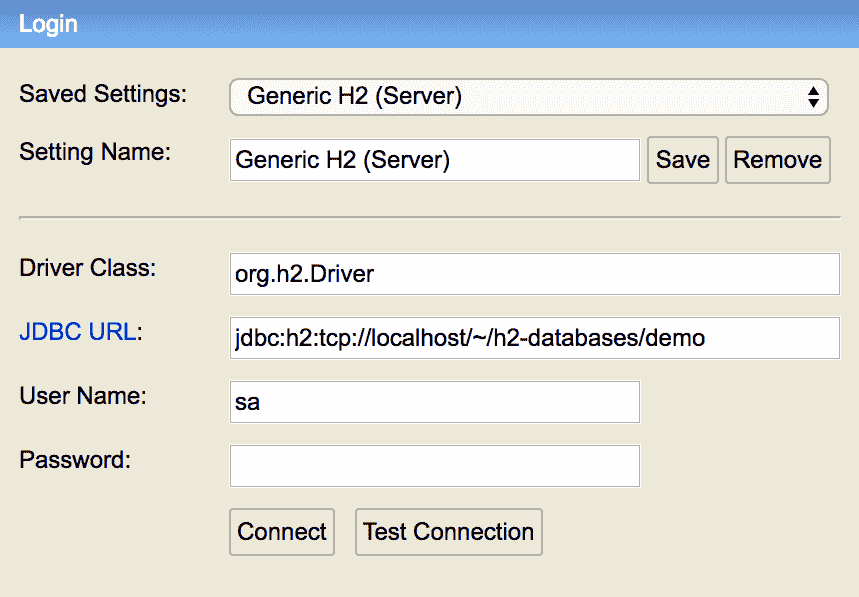
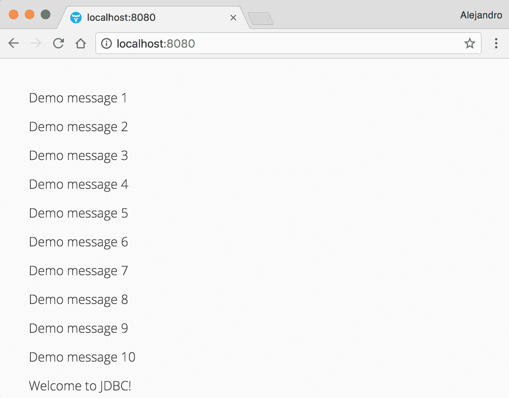
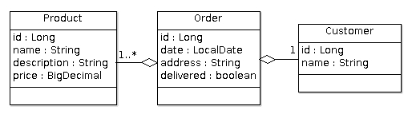
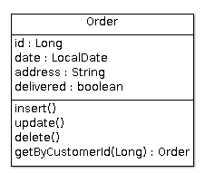

# 第五章：使用 JDBC 连接到 SQL 数据库

管理信息意味着在数据存储中执行诸如存储、修改、删除、排序、排列、链接和匹配数据等操作。数据库管理系统提供了执行这些操作的手段，而关系数据库是用于 Web 应用程序的最常见的数据存储类型。

本章首先简要讨论了持久化的基本 Java 技术，**Java 数据库连接**（**JDBC**）。我们将学习如何连接以及如何使用连接池和 SQL 查询从关系数据库中获取数据。我们还将描述 *数据存储库* 的概念，这是一种封装持久化实现细节的方法。

我们将开发一个非常简单的 Web UI，列出数据库中的数据。这个示例的目的是向您展示数据库连接的基本原理。第六章，*使用 ORM 框架连接 SQL 数据库*，将专注于更高级的数据库操作和基本数据绑定。

本章涵盖以下主题：

+   JDBC 技术

+   JDBC 驱动程序

+   连接池

+   SQL 查询执行

+   数据存储库

# 技术要求

你需要拥有 Java SE 开发工具包和 Java EE SDK 版本 8 或更高版本。你还需要 Maven 版本 3 或更高版本。建议使用具有 Maven 支持的 Java IDE，例如 IntelliJ IDEA、Eclipse 或 NetBeans。最后，为了使用本书的 Git 仓库，你需要安装 Git。

本章的代码文件可以在 GitHub 上找到：

[`github.com/PacktPublishing/Data-centric-Applications-with-Vaadin-8/tree/master/chapter-05`](https://github.com/PacktPublishing/Data-centric-Applications-with-Vaadin-8/tree/master/chapter-05)

查看以下视频以查看代码的实际应用：

[`goo.gl/7VonXg`](https://goo.gl/7VonXg)

# JDBC 简介

如果你使用 Java 开发了 *商业应用程序*，你很可能直接或间接（通过对象关系映射框架）使用了 JDBC 来连接和使用关系数据库。*关系数据库* 是一种以表格形式存储信息的系统；也就是说，在表格中。有许多供应商提供免费和商业的 **关系数据库管理系统**（**RDBMS**）。最受欢迎的两个开源 RDBMS 是 *PostgreSQL* 和 *MySQL*，而 *Oracle 数据库* 和 *Microsoft SQL Server* 在商业产品中是知名的选择。这些系统理解 **结构化查询语言**（**SQL**），这是一种用于执行诸如在表中添加或删除行等任务的 *声明性语言*。

当使用 **声明性语言** 时，你指定程序需要做什么。相比之下，当使用 **命令性语言**，例如 Java 编程语言时，你指定如何做。

在我们开始实际代码之前，尝试编译并运行位于`Data-centric-Applications-with-Vaadin-8/chapter-05` Maven 模块中的示例应用程序。按照以下步骤操作：

1.  如果您还没有这样做，将`Data-centric-Applications-with-Vaadin-8` Maven 项目导入到您的 IDE 中。

1.  为`packt.vaadin.datacentric.chapter05.jdbc.H2Server`类创建一个运行配置并运行它。这是您的数据库服务器。它在您的计算机上的一个单独进程中运行。或者，您可以从`chapter-05`目录使用 Maven 运行 H2 服务器：`mvn test exec:java -Dexec.mainClass="packt.vaadin.datacentric.chapter05.jdbc.H2Server"`。

1.  为`packt.vaadin.datacentric.chapter05.jdbc.DatabaseInitialization`类创建一个运行配置并运行它。您应该在日志中看到一个初始化成功的消息。此初始化在数据库中创建了一个新的表（`messages`），并向其中添加了一些演示行。或者，您可以使用 Maven 运行初始化应用程序：`mvn exec:java -Dexec.mainClass="packt.vaadin.datacentric.chapter05.jdbc.DatabaseInitialization"`。

1.  在`chapter-05`模块中为 Jetty Maven 插件创建一个运行配置。

1.  将您的浏览器指向`http://localhost:8080`。您应该会看到由 Vaadin 应用程序渲染的一些演示数据。

1.  在步骤 2 中启动的 H2 服务器还启动了一个您可以使用它来运行 SQL 查询的 Web 应用程序。让我们试试！将您的浏览器指向`http://localhost:8082`并使用以下配置进行连接：



1.  通过执行以下 SQL 语句将新行插入到`messages`表中：`INSERT INTO messages VALUES('Welcome to JDBC!')`。

1.  将您的浏览器指向（或重新加载）Vaadin 应用程序。您应该会看到那里列出了新消息：



如果您愿意，您可以停止 Vaadin 应用程序和 H2 服务器，然后再次运行它们。您应该看到与之前相同的所有数据，包括新插入的行。只需记住，您需要首先运行 H2 服务器！

如果您好奇，实际的 H2 数据库文件位置是`<home-directory>/h2-databases/demo.mv.db`。如果您想重新创建数据库的初始状态，可以删除此文件并再次运行`DatabaseInitialization`应用程序。

**Java 数据库连接**（**JDBC**）**API**使您的应用程序能够连接到关系型数据库管理系统（RDBMS）并向其发出 SQL 调用。其他 SQL 持久化技术通常是在 JDBC 之上实现的。了解 JDBC 的关键方面将使您在使用其他持久化技术（即使您计划使用或已经使用）时生活更加轻松。

通常，您的应用程序应该按照以下五个步骤来使用 JDBC API 与数据库进行交互：

1.  为您的数据库添加一个**JDBC 驱动**。

1.  建立与数据库的**连接**。

1.  创建一个**语句**来**执行**一个 SQL 查询。

1.  获取并处理**结果集**。

1.  **关闭**连接。

# 为你的数据库添加 JDBC 驱动

从 Java 应用程序连接到 RDBMS 是通过 *JDBC 驱动* 实现的。大多数（如果不是所有）数据库供应商都为其 RDBMS 提供了 JDBC 驱动。在实践中，JDBC 驱动只是你项目中的一个 Java 依赖项（一个 JAR 文件）。例如，如果你需要将应用程序连接到 PostgreSQL 数据库，你需要将 `postgresql-x.x.x.jar` 文件添加到你的类路径中。当然，这也可以使用 Maven 完成。正是通过这个 JDBC 驱动，你的 Java 应用程序与 RDBMS 进行通信，它通过建立连接并执行 SQL 语句来检索数据。

本书不涉及 RDBMS 和 SQL 的细节。这些主题本身就足够复杂，值得有一本完整的书来介绍。有许多优秀的参考文献和在线资源，你可以查阅以了解更多关于这些主题的信息。

在本书中，我们将使用 H2 数据库。H2 是一个流行的开源数据库引擎，它不需要你在电脑上安装任何东西。所有这些概念也适用于其他 RDBMS，我们将在配套代码中包含片段或注释部分，展示 MySQL 和 PostgreSQL 的具体细节，以便你可以在自己尝试这些数据库时参考。

添加 JDBC 驱动就像在你的项目中包含正确的依赖项一样简单。例如，要包含 H2 JDBC 驱动，将以下依赖项添加到你的 `pom.xml` 文件中：

```java
<dependency>
    <groupId>com.h2database</groupId>
    <artifactId>h2</artifactId>
    <version>1.4.196</version>
</dependency>
```

或者，如果你想使用 MySQL 或 PostgreSQL，添加以下依赖项：

```java
<dependency>
    <groupId>mysql</groupId>
    <artifactId>mysql-connector-java</artifactId>
    <version>6.0.6</version>
</dependency>

<dependency>
    <groupId>org.postgresql</groupId>
    <artifactId>postgresql</artifactId>
    <version>42.1.4</version>
</dependency>
```

JDBC 被设计为不仅支持关系型数据库，还支持任何类型的数据源，包括文件系统或面向对象系统。当你需要将应用程序连接到任何类型的数据源时，请记住这一点；可能存在一个 JDBC 驱动程序可以用于它。

你当然可以在同一个项目中包含多个 JDBC 驱动。`chapter-05` 应用程序包含了所有之前的驱动。

在 JDBC 的旧版本中，你必须手动使用 `Class.forName` 方法加载 JDBC 驱动类。在 JDBC 4.0 中，这不再需要了。类路径中的任何 JDBC 4.0 驱动都会自动加载。

# 通过连接池建立数据库连接

在使用 Vaadin 开发 Web 应用程序时，最常见的陷阱之一就是忘记你所开发的是一个实际的 Web 应用程序！由于 API 类似于桌面型 UI 框架，很容易忘记 Vaadin 应用程序很可能是同时被多个用户使用的。在建立数据库连接时，你需要牢记 Vaadin 应用的多用户特性。

你在本地机器上运行的桌面应用程序可能在其执行时间内能够与数据库的单个连接完美工作（当然，这取决于应用程序的复杂性）。这是因为应用程序的单用户性质；你知道每个实例只有一个用户。另一方面，一个网络应用程序的单个实例同时被许多用户使用。它需要多个连接才能正常工作。你不想让用户 *A、B、C...、X* 等待贪婪的用户 *Z* 释放连接，对吧？然而，建立连接是昂贵的！每次新用户请求应用程序时都打开和关闭连接不是一种选择，因为你的应用程序可能达到大量的并发用户，以及相应的连接。

这就是连接池派上用场的地方。连接池是一个类，它维护到数据库的多个连接，如果你愿意，就像一个连接的*缓存*。连接池保持所有连接都打开，以便客户端类在需要时可以重用它们。没有连接池，每次你的应用程序需要执行数据库操作时，它都必须创建一个新的连接，执行查询，然后关闭连接。如前所述，这是昂贵的，并且浪费资源。相反，连接池创建一组连接，并将它们“借”给客户端类。一旦连接被使用，它不会被关闭，而是返回到池中并再次使用。

如你所猜，连接池是一个如此知名的模式，以至于存在许多实现。让我们看看如何使用其中之一，`BoneCP`，这是一个免费的开放源代码 JDBC 连接池实现。

其他流行的连接池实现包括 *C3P0* 和 *Apache DBCP*。此外，应用程序服务器和 Servlet 容器提供定义池化数据源的可能性（请参阅 Java 的`DataSource`接口文档），作为它们配置的一部分。这将数据源配置与你的运行环境解耦，同时免费提供连接池机制。

首先，这里是你需要添加的依赖项：

```java
<dependency>
    <groupId>com.jolbox</groupId>
    <artifactId>bonecp</artifactId>
    <version>0.8.0.RELEASE</version>
</dependency>
<dependency>
    <groupId>org.slf4j</groupId>
    <artifactId>slf4j-simple</artifactId>
    <version>1.7.25</version>
    <scope>test</scope>
</dependency>

```

`BoneCP` 需要 SLF4J，这是一个提供多个日志框架的*外观*的日志库。这是为了能够在控制台或 Web 服务器日志中看到`BoneCP`的日志。

每个 Web 应用程序实例应该有一个连接池实例。在前一章中，我们使用了一个静态 Java 块来初始化应用程序级别的资源。这在资源不依赖于其他资源的简单应用程序中是有效的。在更复杂的应用程序中，你的初始化代码可能依赖于其他服务（例如*依赖注入*）才能工作，所以这次让我们使用一个更实际的方法，并使用`ServletContextListener`来`init`连接池。`ServletContextListener`允许你的应用程序对`servlet 上下文生命周期`中的事件做出反应；特别是，初始化 servlet 上下文及其销毁。

与之前的示例一样，`chapter-05` Vaadin 应用程序包含一个`WebConfig`类，它定义了<q>所有 Web 相关的内容</q>；也就是说，servlet 和事件监听器。除了`VaadinServlet`之外，我们还可以包括一个`ServletContextListener`，它在创建 servlet 上下文时初始化数据库（即当 Web 应用程序启动时... sort of）：

```java
@WebListener
public static class JdbcExampleContextListener implements ServletContextListener {

    @Override
    public void contextInitialized(ServletContextEvent sce) {
        try {
            DatabaseService.init();

        } catch (Exception e) {
            e.printStackTrace();
        }
    }

    @Override
    public void contextDestroyed(ServletContextEvent sce) {
    }
}
```

多亏了`@WebListener`注解，这个类将被 servlet 容器发现并自动注册到 servlet 上下文中。在`contextInitialized`方法中，我们可以添加初始化连接池的代码；在这种情况下，通过委托给我们将要实现的自定义`DatabaseService`类。

基础设施代码已经准备好了；现在是我们实际使用`BoneCp`连接池的时候了。让我们从`init`方法开始：

```java
public class DatabaseService {

    private static BoneCP pool;

    public static void init() throws SQLException {
        BoneCPConfig config = new BoneCPConfig();
        config.setJdbcUrl("jdbc:h2:tcp://localhost/~/h2-databases/demo");
        config.setUsername("sa");
        config.setPassword("");

        pool = new BoneCP(config);
    }
}
```

这个实现定义了一个静态（每个应用程序只有一个实例）的`BoneCP`字段，`pool`，这是实际的连接池。`pool`字段在`init`方法中初始化，该方法在应用程序启动时被调用（参见`JdbcExampleContextListener`类）。

当使用 JDBC 连接数据库时，你需要指定三件事情：

+   **连接 URL**：在 JDBC 中，数据库由一个连接 URL 表示。JDBC 使用这个 URL 来获取有关如何连接数据库的信息。在之前的示例中，我们可以看到字符串包含数据库的名称（`h2`）、主机（`localhost`）和数据库名称（`~/h2-databases/demo`）。

+   **用户名**：数据库允许你定义一组用户、角色和权限。用户名是数据库可以检查的标识符，以便在数据上授予权限。默认情况下，H2 数据库定义了用户名`sa`。

+   **密码**：正如你所猜到的，这是允许数据库引擎运行身份验证检查的东西。默认情况下，H2 为默认的`sa`用户使用空密码。

如果您现在想使用 MySQL 或 PostgreSQL，您将不得不更改此类中的`String`文本，重新编译和重新部署。一个更好的方法是外部化这个`String`。一种方法是用标准的 Java `Properties`类加载带有连接 URL、用户名和密码的*键/值*对。例如，`chapter-05`应用程序在`/src/main/resources`目录中包含一个`datasource.properties`文件：

```java
datasource.url=jdbc:h2:tcp://localhost/~/h2-databases/demo
datasource.username=sa
datasource.password=

```

对于 MySQL 数据库，使用：`datasource.url=jdbc:mysql://localhost/demo`

对于 PostgreSQL 数据库，使用：`datasource.url=jdbc:postgresql://localhost:5432/demo`

`DatabaseService`类现在可以使用这些属性（`datasource.*`）而不是*硬编码*的文本：

```java
public class DatabaseService {

    private static String url;
    private static String password;
    private static String username;
    private static BoneCP pool;

    public static void init() throws SQLException, IOException {
        loadProperties();
        createPool();
    }

    private static void loadProperties() throws IOException {
        try (InputStream inputStream = DatabaseService.class.getClassLoader().getResourceAsStream("datasource.properties")) {
            Properties properties = new Properties();
            properties.load(inputStream);

 url = properties.getProperty("datasource.url");
            username = properties.getProperty("datasource.username");
            password = properties.getProperty("datasource.password");
        }
    }

    private static void createPool() {
        ...
 config.setJdbcUrl(url);
        config.setUsername(username);
        config.setPassword(password);        ...
    }
}
```

连接属性（`url`、`username`和`password`）现在是类中的静态字段，由`datasource.properties`文件填充。

要使您的 Web 应用程序配置独立于运行环境，可以使用操作系统的*环境变量*。例如，假设您在计算机上定义了一个名为`MY-WEBAPP-CONF-DIRECTORY`的环境变量，并将其值设置为`~/my-webapp-conf`。在这个目录内，您可以放置所有构成配置的`.properties`文件，例如，`datasource.properties`文件。Web 应用程序可以像这样读取环境变量：`String confDirectory = System.getenv("MY-WEBAPP-CONF-DIRECTORY")`，并读取此目录内的任何文件以相应地配置应用程序。使用这种技术，团队中的每个开发者都可以定义他们自己的本地配置。此外，您可以通过定义环境变量并将相应的配置文件放置在对应的环境中轻松地配置*测试*和*生产*环境——除了检查所有配置属性是否就绪外，无需担心在部署到这些环境时替换文件。确保当属性不存在时显示良好的错误或警告信息。

现在我们已经准备好了连接池，我们可以获取到数据库的实际连接。以下是方法：

```java
Connection connection = pool.getConnection();
```

一个`连接`代表与数据库的会话。此接口包含许多方法，用于获取有关数据库功能和连接状态的信息，但最重要的部分允许您创建`语句`对象。

连接池实现为开发或测试环境提供了良好的配置。这很可能不适合生产环境。请查阅实现文档，并在部署到生产环境时相应地调整配置。

# 创建语句并执行 SQL 查询

`语句`对象用于在数据库中调用 SQL 语句。以下代码片段展示了如何从连接池中检索`连接`对象。此对象用于创建一个新的`语句`，然后用于执行 SQL 语句：

```java
try (Connection connection = pool.getConnection()) {
    Statement statement = connection.createStatement();
 ResultSet resultSet = statement.execute("SELECT content FROM messages");
}
```

在本章中，我们使用 `Statement` 接口及其 `createStatement` 对应方法。在更关键的应用中，你应该使用 `PreparedStatement` 接口和 `prepareStatement` 方法以提高性能并防止 SQL 注入攻击。

# 获取和处理结果集

如你所见，`Statement` 类的 `execute` 方法返回一个 `ResultSet` 对象。`ResultSet` 对象表示数据库中的数据。它就像一个指向数据行中的游标。首先，游标放置在第一行之前。你可以使用 `next` 方法如下迭代行：

```java
while (resultSet.next()) {
    String content = resultSet.getString("content"));
}
```

在前面的例子中，我们使用 `getString` 方法来获取与 `content` 列相对应的值。有各种数据类型的方法：例如，`getInt` 方法将指定列的值作为 Java `int` 返回。

# 关闭数据库连接

当使用连接池时，连接池的实现会负责关闭 JDBC 连接。根据具体实现，你可能需要调用此过程。通常，你希望连接池在 Web 应用程序的生命周期内保持活跃。还记得我们用来初始化连接池的 `ServletContextListener` 实现吗？嗯，我们可以用它来关闭池。我们只需要实现 `contextDestroyed` 方法：

```java
@WebListener
public static class JdbcExampleContextListener implements ServletContextListener {
    ...

    @Override
    public void contextDestroyed(ServletContextEvent sce) {
 DatabaseService.shutdown();
    }
}
```

最后，`shutdown` 方法实现如下：

```java
public class DatabaseService {
    ...
    public static void shutdown() {
        pool.shutdown();
    }
}
```

现在，是你再次尝试 `chapter-05` 演示应用程序的好时机。仔细看看 `DatabaseService` 类以及它在 `VaadinUI` 类中的使用。特别是 `findAllMessages` 方法非常有趣，因为它作为 Vaadin 应用程序和 UI 之间的主要通信点：

```java
package packt.vaadin.datacentric.chapter05.jdbc;

import com.jolbox.bonecp.BoneCP;
import com.jolbox.bonecp.BoneCPConfig;

import java.io.IOException;
import java.io.InputStream;
import java.sql.Connection;
import java.sql.ResultSet;
import java.sql.SQLException;
import java.sql.Statement;
import java.util.ArrayList;
import java.util.List;
import java.util.Properties;

/**
 * @author Alejandro Duarte
 */
public class DatabaseService {

    private static final String SELECT_SQL = "SELECT content FROM messages";
    private static final String CONTENT_COLUMN = "content";
    ...

    public static List<String> findAllMessages() throws SQLException {
        try (Connection connection = pool.getConnection()) {
            Statement statement = connection.createStatement();
            ResultSet resultSet = statement.executeQuery(SELECT_SQL);

            List<String> messages = new ArrayList<>();
            while (resultSet.next()) {
                messages.add(resultSet.getString(CONTENT_COLUMN));
            }

            return messages;
        }
    }
    ...

}
```

看看 SQL 查询是如何在 `String` 常量中定义的。你能想到更好的方法来做这件事吗？在一个更复杂的应用中，你可能会有成百上千个 SQL 查询。在这些情况下，一个更好的做法是将 SQL 代码外部化。属性文件可能会有所帮助，但至少可以说，在单行中定义 SQL 查询可能是一个挑战。一个更好的方法是使用 XML，这种格式允许你使用多行来定义值。我们将在 第六章 中看到 MyBatis 如何推广这种方法，*使用 ORM 框架连接 SQL 数据库*。

在 `findAllMessages` 方法中，另一个有趣的细节是返回类型。为什么不返回一个 `ResultSet` 对象呢？我们这样做是为了避免将表示层与持久化实现细节耦合。这就是我们将在下一节中要探讨的内容。

你可能已经注意到`findAllMessages`方法可能会抛出`SQLException`。这使得此方法的使用者对某些层面的实现细节有所了解。尽管异常类名暗示正在使用 SQL，但根据 API 文档，`SQLException`是"<q>一个提供数据库访问错误或其他错误信息的异常</q>"。这个异常在*NoSQL*数据库的驱动程序中也被使用。

# 实现数据存储库

在本书的目的下，*存储库*是一个包含所有或部分**CRUD**操作（**创建、读取、更新和删除**）的类。存储库封装了应用程序的持久性细节。存储库持有领域模型（或实体）的手段。

更确切地说，领域模型不仅包括数据，还包括行为。另一个广泛使用的术语是**数据传输对象**（**DTO**）。尽管 DTO 的原始定义是为了描述在进程之间传输数据的方式，但许多架构（不准确）将 DTO 定义为在相同进程中的软件组件之间携带数据的对象。更复杂的是，还有*值对象*（如果它们的属性相等，则相等的对象）和*实体*（基于其身份相等的对象，这可以由单个属性定义）。在记录和设计你的软件时，花些时间研究这些术语，并尝试选择最适合你设计的一个。

# 定义领域模型

让我们通过一个例子来学习这个。假设你正在实现一个简单的电子商务应用程序。你负责的模块是*订单模块*，需要通过 Web UI 提供与此模块相关的数据访问。在阅读了规范后，你设计了一个简单的领域模型，由以下类组成：



这相当直接：一个`Order`对象有一个或多个`Product`对象和一个`Customer`对象。你希望使用假设的*技术 X*来持久化数据（在这个例子中，哪个技术不重要），并且你希望你的 Vaadin `UI`实现能够直接使用领域类；然而，你不想将你的 UI 实现与 Technology X 耦合。此外，你必须通过 Web 服务公开订单和产品数据，以便外部会计系统使用。因此，你决定实现三个存储库，每个领域类一个：`ProductRepository`、`OrderRepository`和`CustomerRepository`。

# 实现存储库和服务

在这一点上，你开始实现 Vaadin UI，并对存储库应该公开的方法有了清晰的理解。然后你在相应的存储库类中实现了这些方法：


让我们更仔细地看看仓库类中的方法。正如你所看到的，所有方法名都以 `find` 或 `get` 开头。这是行业中的一个众所周知的标准，并被诸如 **Spring Data** 或 **Apache DeltaSpike** 这样的库所使用。以 `find` 开头的方法返回对象集合，而以 `get` 开头的方法返回单个、可直接使用的值（例如领域实例或其属性之一）。

注意到每个仓库都有一个代表使用技术 X 的入口点的私有 `persistence` 字段，我们将在本章后面看到具体的例子。如果由于某种原因，你必须将持久化技术更改为其他技术，客户端类不会受到影响。此外，你可以为不同的仓库使用不同的持久化技术，而无需客户端类处理不同的 API。以下代码将清楚地说明这些仓库可以如何实现：

```java
public class OrderRepository {

    private TechnologyX persistence = ...

    public List<Product> findAll() {
        ... use Technology X through the persistence instance to fetch the data ...
        ... convert the data to a List ...
        return list;
    }
    ...
}
```

所有关于如何获取数据的实现细节都被封装在仓库类中。现在，让我们继续看看如何从 Vaadin 应用程序中使用它。

在进行*结对编程*时，你的同事建议你应该使用服务类来从 Vaadin UI 中抽象出 *仓库* 的概念。她认为应该为每个仓库有一个 `service` 类：`ProductService`、`OrderService` 和 `CustomerService`。这个想法在你看来也很不错；然而，她立刻注意到这些服务类将只是其仓库对应类的简单 *门面*，并且不会包含任何额外的逻辑。你指出应用程序必须通过会计系统使用的网络服务来公开数据，并且服务类可能被用于此目的。在你和你的同事调查了网络服务必须公开的确切数据后，你们俩决定 *追求简洁*，而不是为每个 `repository` 类实现一个 `service` 类。

相反，Vaadin UI 将被允许引用仓库类。你还决定实现一个单独的 `AccountingWebService` 类来公开会计系统的数据，这样你就可以知道并控制这个系统未来“看到”的内容。与 Vaadin UI 类一样，网络服务实现将使用仓库类来获取数据。

之前的假设例子并不意味着你不应该在项目中强制实施仓库/服务配对的设计。在做出此类决定之前，总是要停下来思考。例子中的情况显示了开发者如何考虑替代方案，更深入地调查需求，然后做出明智的决定。考虑到将来会维护你代码的开发者。记住你的遗产。

# 活动记录模式

在项目中，可能有许多架构模式可能会或可能不会有所帮助；特别是关于领域模型和持久化。你可能想了解一下*活动记录模式*。活动记录类不仅封装了数据，还封装了其持久化操作。例如，前一个示例中的`Order`类看起来如下：



注意 CRUD 操作是如何在领域类中实现的，这些操作与之前在`repository`类中实现的方法并列。虽然这是一个值得考虑的替代方案，但在这本书中，我们不会进一步介绍或使用活动记录模式。

# 摘要

本章介绍了使用 Java 进行数据库连接的基础知识。我们学习了诸如 JDBC 驱动程序（允许应用程序连接到特定的关系型数据库引擎）和连接池（以更好地使用连接资源）等概念。我们学习了如何使用`ContextServletListener`来初始化连接池或数据库相关服务。我们看到了一个简单的领域模型示例，以及如何通过仓库类来封装对在此模型中表示的数据的访问。

在下一章中，我们将学习几种持久化技术，以及如何将它们与 Vaadin 框架集成。
