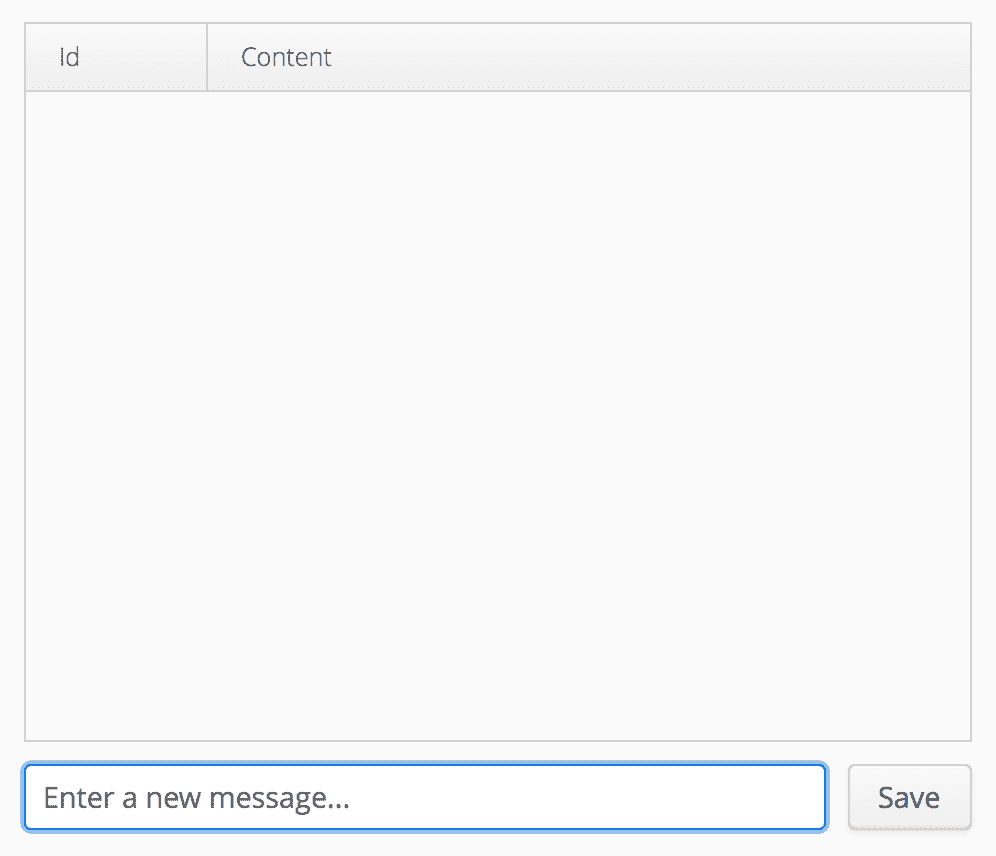

# 第六章：使用 ORM 框架连接到 SQL 数据库

**Vaadin 框架**是一个*Web 框架——如果愿意的话，也可以是一个库，它有助于*Web 开发*。作为开发者，你有机会将其与其他 Java 技术集成，特别是与任何持久化技术集成。由于最流行的数据持久化技术是 SQL，因此本章致力于探讨从 Vaadin 应用程序连接到 SQL 数据库的几种替代方案。

我们将首先研究*对象关系映射*的概念，这是一种允许开发者使用面向对象编程语言在否则不兼容的系统中消费和操作数据的技术。然后，我们将继续探讨用于连接到 SQL 数据库的三个最流行的 Java 框架：*JPA*、*MyBatis*和*jOOQ*。这些技术在行业中广泛使用，了解每个技术的哲学和基础对于选择最适合你项目的选项非常重要。

在本章的各个部分中，我们将开发非常简单的 Web UI，列出数据库中的数据（使用`Grid`类），并展示一个简单的表单来添加数据。这些示例的目的是向你展示使用 Vaadin 进行数据绑定的基本原理。下一章将专注于更高级的数据绑定，以开发复杂的**CRUD**（创建、读取、更新和删除）用户界面。

本章涵盖了以下主题：

+   **对象关系映射** (**ORM**)框架

+   **Java 持久化 API** (**JPA**)

+   MyBatis

+   **Java 面向对象查询** (**jOOQ**)

# 技术要求

你需要拥有 Java SE 开发工具包和 Java EE SDK 版本 8 或更高版本。你还需要 Maven 版本 3 或更高版本。建议使用具有 Maven 支持的 Java IDE，如 IntelliJ IDEA、Eclipse 或 NetBeans。最后，为了使用本书的 Git 仓库，你需要安装 Git。

本章的代码文件可以在 GitHub 上找到：

[`github.com/PacktPublishing/Data-centric-Applications-with-Vaadin-8/tree/master/chapter-06`](https://github.com/PacktPublishing/Data-centric-Applications-with-Vaadin-8/tree/master/chapter-06)

观看以下视频，以查看代码的实际运行情况：

[`goo.gl/p1CGkr`](https://goo.gl/p1CGkr)

# 使用对象关系映射框架

在关系型数据库中，数据以*表*的形式表示。在 Java 程序中，数据以*对象*的形式表示。例如，如果你有与客户相关的数据，你可以将这些数据存储在`customers`表中。同样，你也可以将这些数据存储在`Customer`类的实例对象中。*对象关系映射*框架允许你在这两个系统之间转换数据。

我们已经在上一章学习了如何通过 JDBC 和`ResultSet`接口获取数据。你可以获取这个接口的一个实例，遍历行，并手动设置 Java 类如`Customer`的字段。当你这样做的时候，你就是在做 ORM 框架的工作。为什么要重新发明轮子呢？Java 生态系统提供了几个选项来解决*对象-关系阻抗不匹配*。在接下来的几节中，我们将检查三种最流行的替代方案来解决这种阻抗不匹配。

面向对象范式基于软件工程原则，而关系范式基于数学原则。*对象-关系阻抗不匹配*指的是这两个范式之间的不兼容性。

在接下来的几节中开发的示例使用的是我们在上一章介绍 JDBC 时初始化的 H2 数据库实例。请确保 H2 服务器正在运行，并且`messages`表存在（有关详细信息，请参阅`packt.vaadin.datacentric.chapter05.jdbc.DatabaseInitialization`类）。如果你想使用其他数据库，请确保你的数据库服务器正在运行，创建`messages`表，并配置你的应用程序以指向你的新数据库。

# 使用 JPA 连接 SQL 数据库

关于 JPA 的第一件事你需要知道的是，它是一个规范，而不是一个实现。有几个实现，其中*Hibernate*和*EclipseLink*可能是最受欢迎的。在这本书中，我们将使用 Hibernate。关于 JPA 的其他一些事情，通过编码学习会更好！让我们看看如何创建一个简单的 Vaadin 应用程序，该程序显示数据库中的`Grid`消息。

你认为开始使用 JPA，或者更具体地说，Hibernate 的第一件事需要做什么？当然是添加依赖项。创建一个 Vaadin 项目，并将以下依赖项添加到你的`pom.xml`文件中：

```java
<dependency>
    <groupId>org.hibernate</groupId>
    <artifactId>hibernate-core</artifactId>
    <version>5.2.10.Final</version>
</dependency>

```

你可以在本节的`Data-centric-Applications-with-Vaadin-8/chapter-06/jpa-example` Maven 项目中找到所有开发的代码。

# 定义持久化单元

因此，JPA 已经包含在类路径中。下一步的逻辑步骤可能是什么？定义数据库连接是合理的。最简单的方法是创建一个`persistence.xml`文件。JPA 将自动读取类路径中`META-INF`目录下的此文件。在 Maven 项目中，位置是`resources/META-INF/persistence.xml`。在这个文件中，你可以定义一个或多个*持久化单元*（数据库连接）及其连接属性。以下是一个你可以用来连接 H2 数据库的最小`persistence.xml`文件示例：

```java
<persistence xmlns="http://java.sun.com/xml/ns/persistence"
            xmlns:xsi="http://www.w3.org/2001/XMLSchema-instance"
            xsi:schemaLocation="http://java.sun.com/xml/ns/persistence   
           http://java.sun.com/xml/ns/persistence/persistence_2_0.xsd"
             version="2.0">
        <persistence-unit name="jpa-example-pu">
          <properties>
            <property name="javax.persistence.jdbc.url" 
            value="jdbc:h2:tcp://localhost/~/h2-databases/demo" />
           <property name="javax.persistence.jdbc.user" value="sa" />
           <property name="javax.persistence.jdbc.password" value="" />
          </properties>
        </persistence-unit>
</persistence>

```

由于你可以定义多个持久化单元（例如，当你的应用程序需要连接到多个数据库时），每个持久化单元都必须有一个名称来标识它。我们为我们的持久化单元使用了`jpa-example-pu`。注意我们如何使用了之前与纯 JDBC 相同的连接属性（URL、用户、密码）。

# 创建 EntityManagerFactory

我们已经通过持久化单元定义了一个连接，但应用程序实际上还没有真正*使用*它。应用程序使用 JPA 的方式是通过`EntityManagerFactory`。你可以将`EntityManagerFactory`视为 JPA 的*入口点*。`EntityManagerFactory`允许你与特定的持久化单元进行交互。如果你喜欢，它几乎，但不完全像连接池。

JPA 实现，如 Hibernate 或 EclipseLink，提供内置的连接池机制，这些机制由内部处理。你通常可以通过在持久化单元定义中使用额外的属性来调整池配置。有关详细信息，请参阅你使用的 JPA 实现的文档。

在我们的案例中，只有一个持久化单元`jpa-example-pu`，因此对于每个应用程序实例只有一个`EntityManagerFactory`实例是有意义的。与纯 JDBC 一样，我们可以使用`ServletContextListener`来创建`EntityManagerFactory`，但再次，让我们将此委托给另一个类来封装与 JPA 相关的内容：

```java
public class JPAService {

    private static EntityManagerFactory factory;

    public static void init() {
        if (factory == null) {
            factory = Persistence.createEntityManagerFactory("jpa-
             example-pu");
        }
    }

    public static void close() {
        factory.close();
    }

    public static EntityManagerFactory getFactory() {
        return factory;
    }
 }
```

我们已经定义了`init`和`close`方法，分别用于初始化和关闭`EntityManagerFactory`。这些方法可以在`ServletContextListener`中使用：

```java
@WebListener
public class JpaExampleContextListener implements ServletContextListener {

    @Override
    public void contextInitialized(ServletContextEvent sce) {
        JPAService.init();
    }

    @Override
    public void contextDestroyed(ServletContextEvent sce) {
        JPAService.close();
    }
}
```

`JPAService`方法还通过`getFactory`方法公开了`EntityManagerFactory`实例。从这里开始，事情开始变得更加功能化。使用 JPA 时，你使用`EntityManagerFactory`来创建`EntityManager`实例。将`EntityManager`视为一个*工作单元*，例如，你需要与数据库进行的具体交互，例如保存数据或读取数据。某个类可以使用`JPAService.getFactory`方法，例如，从数据库中获取所有消息。省略实际查询数据库和异常处理的代码，以下是与 JPA 交互的*通用基础设施*代码：

```java
EntityManager entityManager = JPAService.getFactory().createEntityManager();
entityManager.getTransaction().begin();

... run queries ...

entityManager.getTransaction().commit();
entityManager.close();
```

此代码获取`EntityManagerFactory`以创建一个新的`EntityManager`。有了它，可以开始一个新的数据库事务。在此之后，你可以放置实际运行数据库查询的代码，但在我们揭示`...运行查询...`代码之前，我们需要实现一个我们缺少的重要类。

# 实现实体类

JPA 是一个 ORM 框架。它*映射*SQL 表到 Java 对象。我们已经有 SQL 表`messages`，但 Java 对应的部分是什么？我们需要定义一个`Message`类。如果你看过 JDBC 部分的代码，你可能看到了创建消息表的 SQL 代码。如果没有，这里就是：

```java
CREATE TABLE messages(id BIGINT auto_increment, content VARCHAR(255))
```

我们希望这个表在 Java 端表示如下：

```java
public class Message {

    private Long id;
    private String content;

    ... getters and setters ...
}
```

这个类将成为 JPA 所说的实体类，一个**POJO**（**Plain Old Java Object**）类，它被注解以匹配一个 SQL 表。你可以使用注解来*告诉*JPA 如何*映射*对象到表。代码本身就能说明一切：

```java
@Entity
@Table(name = "messages")
public class Message {

 @Id    private Long id;

    private String content;

    ... getters and setters ...
}
```

我们使用`@Entity`注解来标记类为一个实体。`@Table`告诉 JPA 映射到哪个 SQL 表。`@Id`标记与 SQL 表中的主键对应的属性。关于消息表中的`id`列的`auto_increment`定义如何？我们不想担心*计数*ID 以跟踪下一个要使用的值，对吧？我们可以这样告诉 JPA 该列是由数据库生成的：

```java
@Id
@GeneratedValue(strategy = GenerationType.IDENTITY)
private Long id;

```

根据你的数据库，你可能想要使用不同的策略。例如，对于 PostgreSQL，你很可能会使用`GenerationType.SEQUENCE`。

消息表中的`id`列定义了行的*标识*。它必须与其 Java 对应项相同。我们可以通过重写`equals`方法来实现这一点，由于`Object.hashCode`方法的契约，我们还需要重写`hashCode`方法：

```java
  public class Message {
     ...

     @Override
     public boolean equals(Object o) {
         if (this == o) return true;
         if (o == null || getClass() != o.getClass()) return false;

         Message message = (Message) o;

        return id != null ? id.equals(message.id) : message.id == null;
     }

     @Override
     public int hashCode() {
         return id != null ? id.hashCode() : 0;
     }

     ...
 }
```

根据 JavaDocs 中`Object.equals`方法的说明：“...通常在重写此方法时需要重写`hashCode`方法，以便维护`hashCode`方法的通用契约，该契约指出，相等的对象必须具有相等的哈希码”。大多数 IDE 都包含一个功能可以为你生成此代码。

# 执行查询

连接属性已准备就绪，`EntityManagerFactory`已准备就绪，实体类也已准备就绪。现在是时候揭露`... run queries ...`部分了：

```java
Query query = entityManager.createQuery("select m from Message m");
List<Message> messages = query.getResultList();

```

起初，你可能会认为`select m from Message m`是 SQL 代码。但事实并非如此！首先，数据库中没有`Messages`表（它是`messages`）。其次，这个查询是一个**Java Persistence Query Language**（**JPQL**）查询。

JPQL 是一种与 SQL 类似的平台无关的语言。JPA 将 JPQL 查询转换为相应的 SQL 查询，这些查询可以发送到数据库。如果你想要了解更多关于 JPQL 的信息，网上有很多资源。

之前的代码看起来就像你会在仓库类中封装的东西。让我们这样做，并实现一个`MessageRepository`类，如下所示：

```java
public class MessageRepository {

    public static List<Message> findAll() {
        EntityManager entityManager = null;
        try {
            entityManager =    
            JPAService.getFactory().createEntityManager();
            entityManager.getTransaction().begin();

 Query query = entityManager.createQuery("select m from   
            Message m");
 List<Message> messages = query.getResultList();

            entityManager.getTransaction().commit();
            return messages;

        } finally {
            if (entityManager != null) {
                entityManager.close();
            }
        }
     }

 }
```

有很多样板代码。仓库类喜欢有很多方法，其中大多数都需要相同类型的基础设施代码来运行单个查询。幸运的是，我们可以使用一些 Java 结构来封装创建`EntityManager`、打开和关闭事务以及关闭`EntityManager`的逻辑。`JPAService`类看起来是完美的候选者：

```java
public class JPAService {
    ...

    public static <T> T runInTransaction(Function<EntityManager, T> 
      function) {
        EntityManager entityManager = null;

        try {
            entityManager = 
            JPAService.getFactory().createEntityManager();
            entityManager.getTransaction().begin();

 T result = function.apply(entityManager); 
            entityManager.getTransaction().commit();
            return result;

        } finally {
            if (entityManager != null) {
                entityManager.close();
            }
        }
     }

 }
```

`runInTransaction`方法是一个通用方法，它使用 Java `Function`将实际的查询逻辑委托给客户端。得益于 Java lambda 表达式，我们可以按照以下方式清理`MessagesService`类的代码：

```java
public class MessageRepository {

    public static List<Message> findAll() {
 return JPAService.runInTransaction(em ->
 em.createQuery("select m from Message m").getResultList()
 );    }
}
```

我们还可以添加一个保存新消息的方法。使用 JPA，这很简单：

```java
public class MessageRepository {
    ...

    public static void save(Message message) {
        JPAService.runInTransaction(em -> {
            em.persist(message);
            return null;
        });
    }
}
```

注意`EntityManager.persist`方法直接接受`Message`实体类的实例。

注意，本章中的配置和代码示例仅在仅使用 Servlet 规范的网络应用程序的上下文中有效。当使用完整的 Jakarta EE（之前称为 Java EE）规范或 Spring 框架时，配置和代码有细微的差异和实践。例如，您应该使用服务器中配置的 JNDI 可发现的数据源，而不是使用 Jakarta EE 指定数据库连接的用户名和密码。此外，可以使用 Jakarta EE 和 Spring 框架自动管理事务边界，这意味着您不需要实现和使用`runInTransaction`方法。

# 实现一个用于列出和保存实体的 Vaadin UI

我们如何从 Vaadin UI 中使用它？这根本不是什么秘密，对吧？只需使用 Vaadin 组件，并在需要时调用`MessageRepository`类。让我们看看它是如何工作的！首先实现一个基本的 UI，显示一个`Grid`、一个`TextField`和一个`Button`，如下所示：



随意实现不同的布局。以下是对应于上一张截图的实现：

```java
public class VaadinUI extends UI {

    private Grid<Message> grid;
    private TextField textField;
    private Button button;

    @Override
    protected void init(VaadinRequest request) {
        initLayout();
        initBehavior();
    }

    private void initLayout() {
        grid = new Grid<>(Message.class);
        grid.setSizeFull();
        grid.getColumn("id").setWidth(100);

        textField = new TextField();
        textField.setPlaceholder("Enter a new message...");
        textField.setSizeFull();

        button = new Button("Save");

        HorizontalLayout formLayout = new HorizontalLayout(textField, button);
        formLayout.setWidth("100%");
        formLayout.setExpandRatio(textField, 1);

        VerticalLayout layout = new VerticalLayout(grid, formLayout);
        layout.setWidth("600px");
        setContent(layout);
    }

    private void initBehavior() {
        // not yet implemented! Stay tuned!
    }
}
```

之前的实现展示了良好的实践：将构建 UI 的代码与添加到 UI 上的行为代码分离。在这个例子中，行为意味着添加一个`ClickListener`来保存`TextField`中的消息，并在网格中显示数据库中的消息。以下完成了 UI 行为实现的代码：

```java
public class VaadinUI extends UI {
    ...

    private void initBehavior() {
 button.addClickListener(e -> saveCurrentMessage());        update();
    }

    private void saveCurrentMessage() {
        Message message = new Message();
        message.setContent(textField.getValue());
        MessageRepository.save(message);

        update();
        grid.select(message);
        grid.scrollToEnd();
    }

    private void update() {
 grid.setItems(MessageRepository.findAll());
        textField.clear();
        textField.focus();
    }
}
```

我们直接使用`MessageRepository`类来调用与持久性相关的逻辑。注意`saveCurrentMessage`方法中是如何进行数据绑定的。这种绑定是单向的：从 UI 到实体。这是您可以使用 Vaadin 的最为基本的数据绑定形式。在`Grid`的情况下，数据绑定方向相反：从实体到 UI。我们将在下一章中看到更高级的数据绑定技术。

何时应该使用 JPA？一般来说，JPA 适合 RDBMS 的可移植性。JPA 在业界得到广泛应用，并且有许多工具和资源可用。JPA 是一个官方的 Java 规范，多个供应商提供实现（如 Hibernate 和 EclipseLink）。JPA 不是唯一的官方 Java 持久性规范。**Java 数据对象**（**JDO**）是另一个您可能至少想要考虑的 Java 规范。

# 使用 MyBatis 连接 SQL 数据库

MyBatis 是一个将 SQL 映射到 Java 对象的持久化框架。MyBatis 的学习曲线比 JPA 平坦，并且利用了 SQL，这使得如果你对 SQL 有很好的了解或者有很多复杂的 SQL 查询需要重用，它是一个很好的选择。

如同往常一样，你首先需要添加依赖项。以下是如何使用 Maven 来做这件事的示例：

```java
<dependency>
    <groupId>org.mybatis</groupId>
    <artifactId>mybatis</artifactId>
    <version>3.4.5</version>
</dependency>
```

你可以在本节中开发的示例的完整实现，在 `Data-centric-Applications-with-Vaadin-8/chapter-06/mybatis-example` Maven 项目中找到。

# 定义数据库连接

使用 MyBatis，你可以使用 Java API 或配置 XML 文件来定义数据库连接。最简单的方法是将一个 XML 文件放在类路径中（当使用 Maven 时，是 `resources` 目录）。以下是一个这样的配置文件的示例：

```java
<?xml version="1.0" encoding="UTF-8" ?>
<!DOCTYPE configuration
PUBLIC "-//mybatis.org//DTD Config 3.0//EN"
        "http://mybatis.org/dtd/mybatis-3-config.dtd">
<configuration>
    <environments default="development">
        <environment id="development">
            <transactionManager type="JDBC"/>
            <dataSource type="POOLED">
                <property name="driver" value="org.h2.Driver"/>
                <property name="url" 
                 value="jdbc:h2:tcp://localhost/~/h2-databases/demo"/>
                <property name="username" value="sa"/>
                <property name="password" value=""/>
            </dataSource>
        </environment>
    </environments>
    <mappers>
        <mapper  
     class="packt.vaadin.datacentric.chapter06.mybatis.MessageMapper"/>
    </mappers>
</configuration>

```

你可以为这个文件命名任何名称。本节的示例使用 `mybatis-config.xml`。

如你所见，我们使用了与 JDBC 和 JPA 相同的连接属性，但添加了一个 `driver` 属性。它的值应该对应于你将要用于数据库连接的 JDBC 驱动程序的名称。

我们如何使用这个文件？再一次，我们可以使用 `ServletContextListener` 来初始化 MyBatis。此外，`ServletContextListener` 可以委托给一个像以下这样的服务类：

```java
public class MyBatisService {

    private static SqlSessionFactory sqlSessionFactory;

    public static void init() {
        InputStream inputStream = MyBatisService.class.getResourceAsStream("/mybatis-config.xml");
        sqlSessionFactory = new SqlSessionFactoryBuilder().build(inputStream);
    }

    public static SqlSessionFactory getSqlSessionFactory() {
        return sqlSessionFactory;
    }
}
```

`SqlSessionFactory` 类是 MyBatis 的 *入口点*。前面的类提供了一个可以从 `ServletContextListener` 调用的初始化方法，它为应用程序的每个实例创建一个 `SqlSessionFactory`，并通过 getter 暴露它。这与我们之前与 JPA 一起使用的模式类似。

# 实现映射类

MyBatis 使用 *映射类*（实际上，是接口）来定义将 SQL 查询映射到 Java 对象的方法。这些几乎等同于我们迄今为止开发的仓库类。然而，当使用 MyBatis 时，使用 MyBatis 术语是有意义的。此外，正如我们稍后将要看到的，我们需要在调用映射类的方法周围添加事务或会话管理代码，但让我们先从映射类开始。如果你足够细心，`mybatis-config.xml` 文件在 `mappers` 部分定义了一个映射类。回去看看它。以下是一个这样的映射类的定义：

```java
public interface MessageMapper {

 @Select("SELECT id, content FROM messages")
    List<Message> findAll();

 @Insert("INSERT INTO messages(content) VALUES (#{content})")
    @Options(useGeneratedKeys = true, keyProperty = "id")
    void save(Message message);

}
```

如您所见，`MessageMapper` 是一个接口。您不必实现此接口；MyBatis 将在运行时为您提供实现。我们定义了两个方法：一个用于返回 `List` 类型的消息，另一个用于保存消息。注意 `@Select` 和 `@Insert` 注解。这些注解用于定义当调用这些方法时将运行的 SQL。注意您如何将参数的值传递到 SQL 查询中。保存方法接受一个 `Message` 实例。在由 `@Insert` 注解定义的 SQL 查询中，我们使用 `#{content}` 来 *传递* `Message.content` 属性的值到查询中。您也可以传递一个包含该值的 `String`。在这种情况下，您可以直接使用参数的名称。然而，我们希望 MyBatis 在行插入后设置 `id` 属性的值。此值在数据库中是自动生成的，因此我们必须使用 `@Options` 注解来配置此行为。

# 实现服务类

如前所述，我们需要添加一些事务和会话处理代码，以便使用映射类。这可以在 *服务类* 中完成。服务类是一个执行某种业务逻辑的类（相比之下，映射类仅执行持久化逻辑）。以下是一个封装会话处理以避免将 UI 与 MyBatis 相关逻辑耦合的类的示例：

```java
public class MessageService {

    public static List<Message> findAll() {
        try (SqlSession session =   
          MyBatisService.getSqlSessionFactory().openSession()) {
            MessageMapper mapper = 
             session.getMapper(MessageMapper.class);
            return mapper.findAll();
        }
    }

    public static void save(Message message) {
        try (SqlSession session = MyBatisService.getSqlSessionFactory().openSession()) {
            MessageMapper mapper = session.getMapper(MessageMapper.class);
            mapper.save(message);
 session.commit();        }
    }
}
```

每个工作单元的持久化操作都应该被一个活跃的会话所包围。此外，对于插入或更新操作，我们需要将事务提交到数据库。

MyBatis 是一个强大且成熟的框架，在决定技术时您应该牢记。它有许多其他功能，例如将方法映射到 SQL 存储过程或使用 XML 文件（甚至 Apache Velocity 脚本语言）来定义 SQL 查询的可能性，这在查询需要多行或需要动态形成时非常有用。

# 使用 jOOQ 连接到 SQL 数据库

jOOQ 是一个持久化框架，允许您使用 Java 编程语言定义 SQL 查询。它具有许多功能，在本节中，我们只展示其中的一些。

与往常一样，您可以通过添加所需的依赖项来开始使用 jOOQ：

```java
<dependency>
    <groupId>org.jooq</groupId>
    <artifactId>jooq</artifactId>
    <version>3.9.5</version>
</dependency>
<dependency>
    <groupId>org.jooq</groupId>
    <artifactId>jooq-codegen</artifactId>
    <version>3.9.5</version>
</dependency>

```

您可以在 `Data-centric-Applications-with-Vaadin-8/chapter-06/jooq-example` Maven 项目中找到本节中开发的全部代码。

# 定义数据库连接

您可以使用您喜欢的任何连接池与 jOOQ 一起使用。本节的示例使用与我们使用纯 JDBC 相同的方法，因此连接属性可以在 `datasource.properties` 文件中定义：

```java
datasource.url=jdbc:h2:tcp://localhost/~/h2-databases/demo
datasource.username=sa
datasource.password=

```

到目前为止，您应该熟悉如何使用 `ServletContextListener` 来初始化数据库连接池。让我们省略这部分（有关详细信息，请参阅关于 JDBC 的部分）并直接跳到更具体的话题。

# 反向工程数据库模式

假设您有一个用于管理书籍和作者的数据库模式。这样一个数据库的可能 SQL 查询可能如下所示：

```java
SELECT AUTHOR.FIRST_NAME, AUTHOR.LAST_NAME
FROM AUTHOR
ORDER BY AUTHOR.LAST_NAME ASC
```

jOOQ 允许您用 Java 编写相同的 SQL 查询：

```java
dslContext.select(AUTHOR.FIRST_NAME, AUTHOR.LAST_NAME)
      .from(AUTHOR)
      .orderBy(AUTHOR.LAST_NAME.asc()

```

如您所见，语法与实际的 SQL 非常接近。您可能想知道 `AUTHOR` 对象及其属性从何而来。它们来自 jOOQ 生成的代码。代码生成过程可以用 Maven 自动化。以下代码展示了如何在 `pom.xml` 中配置 `jooq-codegen-maven` 插件：

```java
<plugin>
    <groupId>org.jooq</groupId>
    <artifactId>jooq-codegen-maven</artifactId>
    <version>3.9.5</version>
    <executions>
        <execution>
            <goals>
                <goal>generate</goal>
            </goals>
        </execution>
    </executions>
    <configuration>
        <jdbc>
            <url>${datasource.url}</url>
            <user>${datasource.username}</user>
            <password>${datasource.password}</password>
        </jdbc>
        <generator>
            <database>
                <name>org.jooq.util.h2.H2Database</name>
            </database>
            <target>
               <packageName>packt.vaadin.datacentric.chapter06.jooq
               </packageName>
                <directory>target/generated-sources/jooq</directory>
            </target>
        </generator>
    </configuration>
</plugin>

```

您必须配置连接属性，以便生成器可以扫描数据库模式。您还必须配置数据库以使用它（在这个例子中是 `H2`）。最后，您必须配置用于生成代码的包以及该项目中该包所在的目录。

虽然有一个小细节。我们使用表达式（如 `${datasource.url}`）来指定数据库连接属性。您如何在 `pom.xml` 文件中使用来自 `.properties` 文件中的值？通过使用 `properties-maven-plugin` Maven 插件：

```java
<plugin>
    <groupId>org.codehaus.mojo</groupId>
    <artifactId>properties-maven-plugin</artifactId>
    <version>1.0.0</version>
    <executions>
        <execution>
            <phase>initialize</phase>
            <goals>
                <goal>read-project-properties</goal>
            </goals>
            <configuration>
                <files>

                <file>src/main/resources/datasource.properties</file>
                </files>
            </configuration>
        </execution>
    </executions>
</plugin>

```

在之前的配置中，Maven 将能够读取 `datasource.properties` 文件中的属性，并替换 `pom.xml` 文件中相应的表达式。

在配置这两个 Maven 插件之后，您可以通过运行 `mvn clean package` 来逆向工程数据库模式并生成相应的代码。

# 运行查询

您可以通过创建一个 `DSLContext` 实例来使用 jOOQ 运行查询。获取此实例的一种方法是通过 `DSL.using` 方法：

```java
Connection connection = pool.getConnection();
DSLContext dslContext = DSL.using(connection);
```

通过这种方式，您可以使用 jOOQ 提供的流畅 API 轻松运行查询。例如，要获取消息表中的所有行，您可以使用以下代码：

```java
List<MessagesRecord> messages = dslContext.select()
        .from(MESSAGES)
        .fetchInto(MessagesRecord.class);
```

`MessagesRecord` 类和 `MESSAGES` 实例是由 jOOQ 生成的代码提供的。这使得之前的查询具有类型安全性。

如果由于某种原因，您的数据库模式发生变化，您将遇到编译错误，并在将其部署到生产之前有机会修复问题。这是 jOOQ 的一个优点。

从这里，您可以想象如何使用 jOOQ 实现一个 `MessageRepository` 类。以下是解决这个谜题的方案：

```java
public class MessageRepository {

    public static List<MessagesRecord> findAll() {
        try {
            return JooqService.runWithDslContext(context ->
                    context.select()
                            .from(MESSAGES)
                            .fetchInto(MessagesRecord.class)
            );

        } catch (SQLException e) {
            e.printStackTrace();
            return Collections.emptyList();
        }
    }

    public static void save(MessagesRecord message) {
        try {
            JooqService.runWithDslContext(context ->
                    context.insertInto(MESSAGES, MESSAGES.CONTENT)
                            .values(message.getContent())
                            .execute()
            );

        } catch (SQLException e) {
            e.printStackTrace();
        }
    }

}
```

以及方便的 `JooqService.runWithDslContext` 方法：

```java
public class JooqService {
    ...

    public static <T> T runWithDslContext(Function<DSLContext, T> 
 function) throws SQLException {
        try (Connection connection = pool.getConnection(); DSLContext 
 dslContext = DSL.using(connection)) {
            T t = function.apply(dslContext);
            return t;
        }
    }
}
```

如果您对 jOOQ 感兴趣，您可能想评估 *Ebean* ([`ebean-orm.github.io`](http://ebean-orm.github.io)) 和 *Querydsl* ([`www.querydsl.com`](http://www.querydsl.com))，这两个都是允许您在 Java 中实现类型安全查询的 ORM 框架。

# 摘要

本章充满了新技术！我们讨论了对象关系映射框架是什么，并研究了如何使用 Java 的三个流行持久化技术：JPA、MyBatis 和 jOOQ 的实践示例。我们看到了 Vaadin 框架如何允许我们直接消费任何类型的 Java API，通常是通过封装细节（如服务和仓库类）的自定义抽象来实现。我们还学习了 Vaadin 中最基本的数据绑定形式，它包括直接从领域对象设置和获取值到 UI 组件。我们还学习了如何将构建 UI 的代码与添加行为以改进其可维护性的代码分开。

在第七章《实现 CRUD 用户界面》中，我们将探讨更多与 Vaadin 相关的主题，并更深入地讨论数据绑定。
