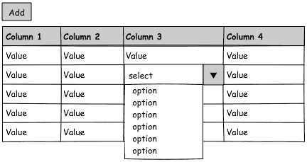
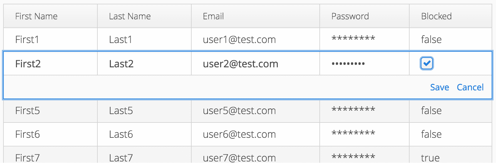
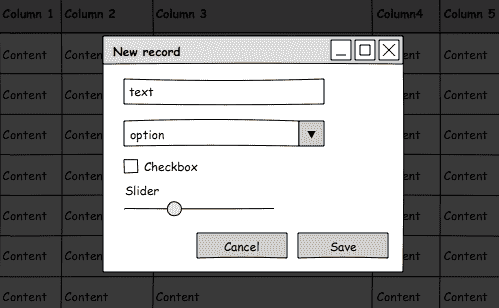
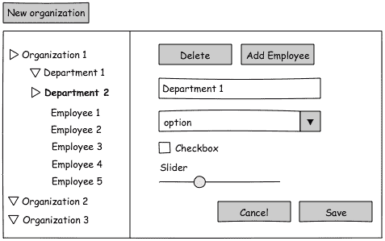
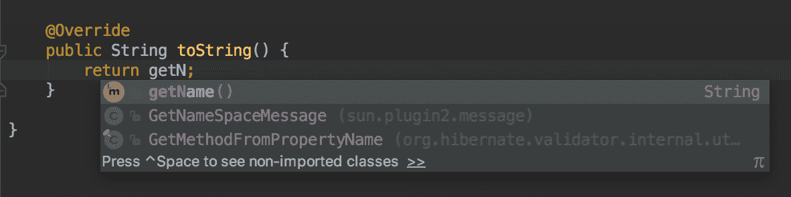
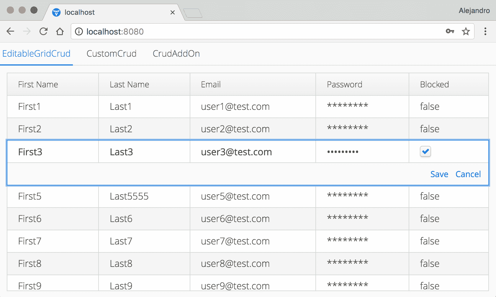
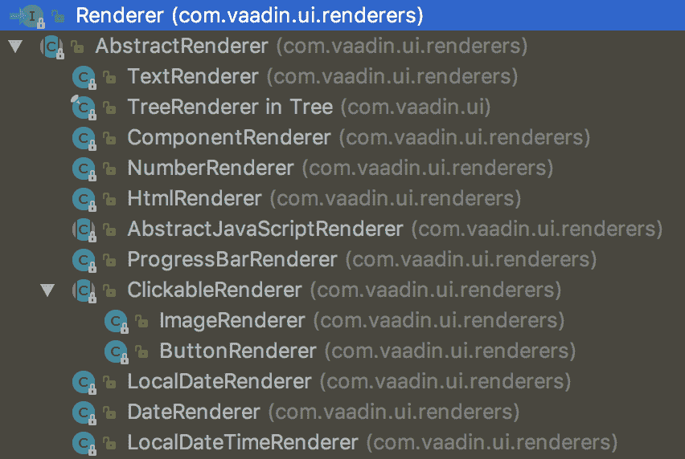
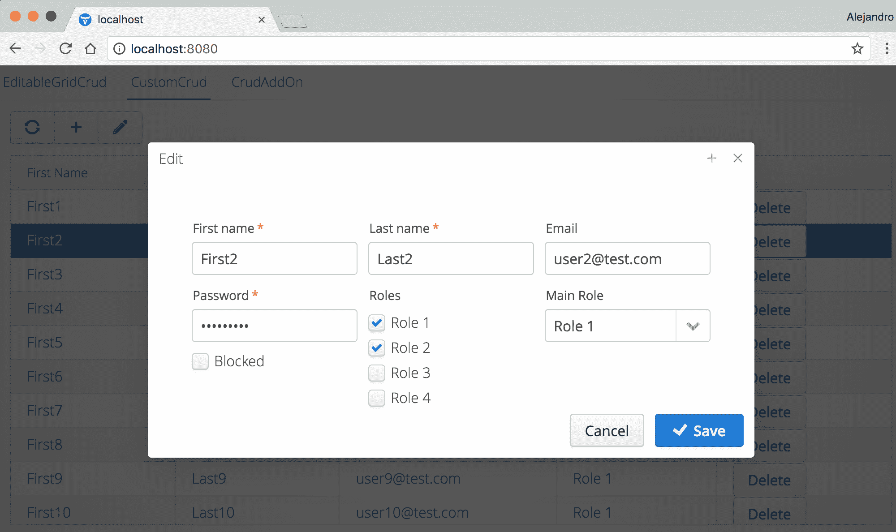
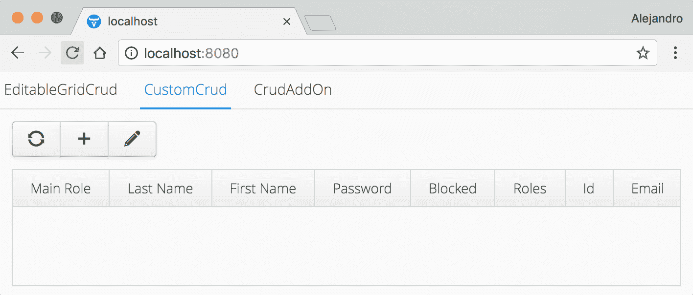
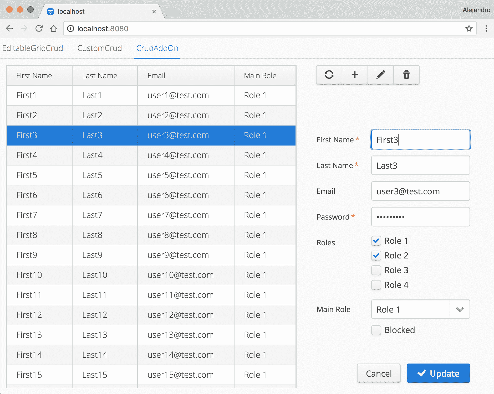

# 实现 CRUD 用户界面

大多数商业应用程序必须处理数据操作。用户能够查看、更改、删除和添加数据。所有这些操作都是根据业务规定的一组规则在上下文中执行的。在其更基本的形式中，商业应用程序包括图形用户界面来执行对数据的 CRUD 操作。**CRUD**是**创建、读取、更新和删除**的缩写。本章探讨了 CRUD 视图的设计和实现。

我们将从从**用户体验**（**UX**）的角度对 CRUD 视图进行简要讨论。然后，我们将继续探讨如何使用两种不同的 UI 设计来设计和实现 CRUD 用户界面。本章还解释了数据绑定的基础知识，展示了如何使用 Java Bean 验证 API，并演示了如何在`Grid`组件内部渲染 UI 组件。

本章涵盖了以下主题：

+   CRUD 用户界面设计

+   数据绑定

+   使用 JSR-303 进行验证

+   网格渲染器

+   过滤

# 技术要求

你需要拥有 Java SE 开发工具包和 Java EE SDK 版本 8 或更高版本。你还需要 Maven 版本 3 或更高版本。建议使用具有 Maven 支持的 Java IDE，如 IntelliJ IDEA、Eclipse 或 NetBeans。最后，为了使用本书的 Git 仓库，你需要安装 Git。

本章的代码文件可以在 GitHub 上找到：

[`github.com/PacktPublishing/Data-centric-Applications-with-Vaadin-8/tree/master/chapter-07`](https://github.com/PacktPublishing/Data-centric-Applications-with-Vaadin-8/tree/master/chapter-07)

查看以下视频，看看代码的实际效果：

[`goo.gl/szGaRy`](https://goo.gl/szGaRy)

# CRUD 用户界面设计

在**用户界面**（**UI**）的上下文中，UX（用户体验）指的是用户与 UI 之间交互的质量程度。一个考虑到 UX 的应用程序通过提高其可用性来增强用户满意度。在 UX 设计过程中，简洁是关键，但应避免陷入极简主义设计，否则可能会损害可用性。

你可以在[`uxmyths.com`](http://uxmyths.com)上找到更多关于简洁、极简主义以及 UX 设计的一般神话的信息。

UX 设计可能包括多个学科，包括线框图、原型设计、测试和验证设计。在本节中，我们将探讨典型 CRUD 视图的变体。这类视图的例子包括管理注册用户的管理员视图、内部应用程序配置视图或**DevOps**成员使用的视图。

DevOps 是一种软件开发学科，它统一了软件开发和软件操作（部署和基础设施管理）。

我们将避免使用 CRUD 这个术语，因为它可能包括所有的 CRUD 操作。一般来说，这些视图是业务特定的，开发者应根据每个案例的特定情况来设计它们。

CRUD 视图关乎**记录**编辑。记录通常被理解为整体的项目。有些适合表格展示，而有些则不适合；例如，日历上的事件。在设计 CRUD 视图时，考虑以下因素：

+   **记录复杂性**：记录包含多少字段？字段是否会根据其他字段的状态而变化？是否存在如地图或日历等复杂字段？验证规则有多复杂？

+   **编辑频率**：用户需要多频繁地编辑记录？他们是否需要快速编辑某些字段的方法？

+   **上下文感知**：在编辑记录时，用户是否需要额外的数据？他们是否需要，或者从查看其他记录中获益？

作为经验法则，考虑用户将如何频繁地在视图中执行操作，以及他们是否可以从一次看到多个记录中受益。如果任何操作的频率都很高，并且他们不会从在视图中看到其他记录中受益，那么不要使用*通用* CRUD 接口。实现针对用例定制的视图。

让我们分析三种 CRUD 用户界面设计：原位字段、模态弹出窗口和分层菜单。

# 原位字段

使用这种设计，用户可以激活一个字段来编辑单个值。数据可以以表格格式呈现，在这种情况下，点击单元格将激活一个输入字段，允许用户直接编辑值。以下图显示了这种类型界面的一个示例：



**Vaadin 框架**通过`Grid.addComponentColumn`方法允许这样做。以下行向现有的`Grid`添加了一个`Button`：

```java
grid.addComponentColumn(user -> new Button("Delete", e -> deleteClicked(user)));
```

使用此选项有优点和缺点。主要优点是速度。用户可以快速编辑一个值，而且无需导航到其他视图来编辑数据；然而，实现`添加`操作需要额外的考虑。当用户点击添加按钮时，会添加一个新空行；然而，很难知道何时可以保存该行（例如，在数据库中）。一个完全空的行是否是一个有效的记录？解决这一问题的方法之一是在所有值都有效时才持久化记录。另一个缺点是当记录包含许多字段时明显，在这种情况下，意味着一个有许多列的网格。在滚动出视图的列中编辑数据需要用户进行额外的交互，这抵消了快速编辑数据的优势。

# 模态弹出窗口

这种用户界面在用户想要创建、修改或删除记录时始终显示一个模态窗口。对此的一种方法是结合原地编辑器和模态窗口。当用户点击或双击一行时，编辑器会放置在该行上方，显示所有用于编辑数据的输入字段以及取消操作或保存数据的按钮。这正是 Vaadin 框架中的 `Grid` 编辑器，如下面的截图所示：



这可以通过以下方式实现：

```java
grid.getEditor().setEnabled(true);
```

第二种方法是实际显示一个阻止与页面其他部分任何其他交互的模态窗口。以下是这样一种界面的图示：



这种方法有几个优点。窗口允许对包含的表单进行任何类型的设计。如果输入字段相关，则可以分组；可以添加帮助文本或说明，并且可以通过多种方式显示验证错误。它也是一个直观的**死胡同视图**；用户无法导航到任何其他地方，只能返回，这使得它易于使用。

# 分层菜单

当数据可以以分层的方式表示时，它可以作为 CRUD 中的**读取**部分，以及作为导航工具。以下图显示了**组织**、**部门**和**员工**记录的 CRUD：



这种设计的关键元素是使用大部分可用空间来容纳包含输入字段的表单。表单以**查看模式**显示，并在用户点击编辑按钮时变为可编辑。在前面的图中，记录的简短表示出现在导航菜单本身中。为了编辑一条记录，用户可以从菜单中点击它。当一条记录可以与另一类型的记录中的一个或多个记录相关联时，它们会被分组并以分层的方式在菜单中显示。菜单中的顶级项不一定是记录本身，因为它们可以作为不同类型的分组。例如，顶级项可以显示包含所有实际组织记录的**子项**。

这种设计对于配置选项来说效果很好；然而，它同时显示许多选项的缺点可能会分散最终用户的注意力。例如，用户在编辑了一些字段之后可能会忘记点击**保存**按钮。

# 领域模型

以下部分展示了如何使用两种不同的设计实现 CRUD 视图：可编辑模式的 `Grid` 和模态窗口。但首先，我们需要实现一个**领域模型**。我们将使用 JPA 和*仓库类*，这在之前的章节中已经解释过。领域模型由简单的类组成，用于建模基于角色的模式：`User`和`Role`。它还包括相应的`UserRepository`和`RoleRepository`类。

让我们从最简单的类`Role`开始。以下是这个类的完整实现：

```java
@Entity
@Data public class Role {

    @Id
    @GeneratedValue
    private Long id;

    private String name;

    private Boolean module1Authorized;

    private Boolean module2Authorized;

    @Override
    public String toString() {
        return name;
    }
}
```

除了通常的 JPA 配置内容（如`@Entity`、`@Id`和`@GeneratedValue`注解）之外，这个类中最有趣的事情是它没有`getters`和`setters`。尽管如此，类中每个 Java 字段的`getters`和`setters`都存在！这要归功于*Project Lombok*，这是一个减少 Java 程序中所需样板代码量的库。Lombok 在类级别生成代码。在前一个类中，我们使用了`@Data`注解来告诉 Lombok 生成`getters`和`setters`、`toString`、`equals`和`hashCode`方法。由于 Lombok 生成的`toString`方法不符合我们的要求，我们重写了它并提供了自定义的一个。

为了使用 Lombok，你需要在你的 IDE 中安装它，并将依赖项添加到`pom.xml`文件中：

```java
<dependency>
    <groupId>org.projectlombok</groupId>
    <artifactId>lombok</artifactId>
    <version>1.16.18</version>
    <scope>provided</scope>
</dependency>

```

你可以在[`projectlombok.org`](https://projectlombok.org)找到关于 IntelliJ IDEA、NetBeans、Eclipse 和其他 IDE 的安装说明。安装 Lombok 后，你将能够使用 IDE 的自动完成和其他功能来使用生成的代码，即使你不在 Java 类中看到它。例如，以下截图显示了**IntelliJ IDEA**在使用自动完成功能时建议生成的`getName`方法：



你可以使用自己的实现来编写`getters`、`setters`、`equals`和`hashCode`方法，而不是使用 Lombok。大多数 IDE（如果不是所有 IDE）都有在源代码级别生成这些方法的功能；然而，使用 Lombok 的源代码文件会变得非常短，这在大多数情况下使得它们更容易维护。`@Data`不是 Lombok 提供的唯一有用的注解。有关其功能的更多信息，请参阅[`projectlombok.org`](https://projectlombok.org)的文档。

以下是`User`类的实现，它也使用了 Lombok：

```java
@Entity
@Data
public class User {

    @Id
    @GeneratedValue
    private Long id;

    private String firstName;

    private String lastName;

    private String email;

    private String password;

    private boolean blocked;

    @ManyToMany(fetch = FetchType.EAGER)
    private Set<Role> roles;

 @ManyToOne    private Role mainRole;
}
```

注意到`roles`字段中的`@ManyToMany`注解。`@ManyToMany`和`@OneToMany`之间有什么区别？`-ToMany`部分意味着每个`User`都可以与多个`Role`对象相关联。`@Many-`部分意味着每个`Role`可以有多个`User`实例。如果使用`@OneToMany`，则`@One-`部分将意味着每个`Role`只能与一个`User`相关联，这显然不是我们在这个模型中想要的。

为什么 `@ManyToMany` 注解为获取策略指定了 `FetchType.EAGER`？Hibernate 默认使用 `Fetch.LAZY`，这可能会导致 `LazyInitializationException`。如果想在实际需要时加载数据，则 `Lazy` 获取可能很有用。然而，这需要在访问集合时有一个打开的 Hibernate 会话。在 Web 环境中，通常在处理请求后关闭会话。由于我们需要在视图中显示 `Role` 数据，最佳方法是积极获取数据。在许多应用程序中，使用 *Open Session in View* 模式是一种常见做法；然而，这也可能被视为一种反模式。始终考虑使用 DTO 投影而不是在视图中打开会话模式。有关此主题的更详细讨论，请访问 [`vladmihalcea.com/2016/05/30/the-open-session-in-view-anti-pattern`](https://vladmihalcea.com/2016/05/30/the-open-session-in-view-anti-pattern)。

领域模型的最后一部分是仓库类。对于 `RoleRepository` 类，我们只需要一个方法来查找所有的 `Role` 对象，以及另一个方法来保存一个新的对象，如下面的代码片段所示：

```java
public class RoleRepository {

    public static List<Role> findAll() { ... }

    public static Role save(Role role) { ... }
}
```

为了完整性，以下是在 `UserRepository` 类中的方法：

```java
public class UserRepository {

    public static List<User> findAll() { ... }

    public static User findById(Long id) { ... }

    private static User getById(Long id, EntityManager em) { ... }

    public static User save(User user) { ... }

    public static void delete(User user) { ... }
}
```

为了简化，这里省略了方法的实际实现，但你可以在这个章节的示例的源代码中找到完整的源代码，该源代码位于 `Data-centric-Applications-with-Vaadin-8\chapter-07` Maven 项目中。

# 使用可编辑的 `Grid` 组件实现 CRUD

在本节中，我们将实现一个包含可编辑 `Grid` 的组件。以下是一个显示编辑模式的 `Grid` 组件的应用程序截图：



为了简单起见，在这个例子中，我们将暂时省略 *add* 和 *delete* CRUD 操作。让我们首先创建一个类来封装组件，如下所示：

```java
public class EditableGridCrud extends Composite {

    private Grid<User> grid = new Grid<>();

    public EditableGridCrud() {
        initLayout();
        initBehavior();
    }

    private void initLayout() {
        grid.setSizeFull();
        VerticalLayout layout = new VerticalLayout(grid);

        setCompositionRoot(layout);
        setSizeFull();
    }

    private void initBehavior() {
    }
}
```

扩展 `Composite` 的类声明了一个 `Grid` 来显示 `User` 实例。`Grid` 类中有几个构造函数可用：

+   `Grid()`: 创建一个新的 `Grid`，没有列。列需要手动添加。

+   `Grid(String caption)`: 与 `Grid()` 相同，但设置了一个标题。

+   `Grid(Class<T> beanType)`: 创建一个新的 `Grid`，并自动为指定类中的每个属性（具有 `getter` 和 `setter`）创建列。可以通过 `getColumn(String)` 方法按名称检索列。

+   `Grid(DataProvider<T, ?> dataProvider)`: 创建一个新的 `Grid`，没有列。它接受一个 `DataProvider`，这是一个抽象，用于从任何类型的后端提供数据。你可以实现这个接口，或者使用框架中可用的实现。如果你不熟悉数据提供者，请参阅官方文档：[`vaadin.com/docs/v8/framework/datamodel/datamodel-providers.html`](https://vaadin.com/docs/v8/framework/datamodel/datamodel-providers.html)。

+   `Grid(String caption, DataProvider<T, ?> dataProvider)`: 与 `Grid(DataProvider)` 相同，但设置一个标题。

+   `Grid(String caption, Collection<T> items)`: 创建一个新的没有列的 `Grid` 并设置一个标题。提供的集合用于获取将要渲染在 `Grid` 中的数据（在幕后使用 `DataProvider`）。

到目前为止，我们有一个没有列和行（数据）的 `Grid` 组件。

# 实现读取操作

可以将 *读取* CRUD 操作视为在 `Grid` 中显示所有 `User` 实例的动作。

由于 `Grid` 目前没有任何列，向其中添加行不会产生任何影响，所以让我们先添加列。向 `Grid` 添加列的最简单方法是将 bean 的类型（`User`）传递给 `Grid` 构造函数：

```java
Grid grid = new Grid(User.class);
```

在此之后，我们可以通过使用 bean 中的属性名来添加列。例如：

```java
grid.setColumns("firstName", "lastName");
```

然而，这并不类型安全。当手动向 `Grid` 添加列时，更好的方法不是使用 `Grid(Class<T> beanType)` 构造函数，而是使用 `ValueProvider`。让我们在示例应用程序中这样做：

```java
public class EditableGridCrud extends Composite {
    ...

    private void initBehavior() {
        grid.addColumn(User::getFirstName).setCaption("First name");
        grid.addColumn(User::getLastName).setCaption("Last name");
        grid.addColumn(User::getEmail).setCaption("Email");
        grid.addColumn(User::getPassword).setCaption("Password");
        grid.addColumn(User::isBlocked).setCaption("Blocked");
    }
 }
```

这是一个更好的方法，因为它完全类型安全。`addColumn` 方法接受一个 `ValueProvider`，这是一个与 bean 类型中任何 getter 兼容的功能接口。`addColumn` 方法返回一个 `Grid.Column` 实例，我们可以从中配置任何额外的属性。在上面的代码片段中，我们配置了列的标题。所有的 `setXX` 方法都返回相同的 `Column` 实例，这允许你链式调用以进一步配置列。例如，你可以设置列的标题和宽度如下：

```java
grid.addColumn(User::getFirstName)
    .setCaption("First name")
    .setWidth(150);
```

在列就位后，我们现在可以向 `Grid` 中添加行。这就像调用 `setItems(Collection)` 方法，并传递一个 `User` 实例的 `Collection`。由于我们将在编辑行后需要重新加载 `Grid` 的内容，所以将 `setItems` 的调用封装起来是一个好主意：

```java
public class EditableGridCrud extends Composite {
    ...

    public EditableGridCrud() {
        initLayout();
        initBehavior();
        refresh();
    }

    private void refresh() {
        grid.setItems(UserRepository.findAll());
    }
    ...

}
```

目前存在一个轻微的安全问题，而且我所说的“轻微”实际上是“重大”。密码在 `Grid` 中以纯文本形式显示。我们希望保留密码列，以便它与 `Grid` 编辑器良好地协同工作，但我们希望显示一系列星号（`********`）而不是实际的密码。这可以通过 `Renderer` 接口来完成。`Renderer` 是一个扩展，它 *绘制* 值的客户端表示。我们可以使用提供的 `TextRenderer` 实现来更改密码列中显示的文本，如下所示：

```java
grid.addColumn(User::getPassword)
        .setCaption("Password")
        .setRenderer(user -> "********", new TextRenderer());
```

`setRenderer`方法接受一个`ValueProvider`和一个`Renderer`。我们不再返回`user.getPassword()`，而是无论密码的值是什么，都返回`"********"`字符串。`TextRenderer`将接受这个字符串，并将其作为文本绘制出来。还有许多其他的`Renderer`可以接受值并以多种形式绘制；例如，作为一个`Button`或`HTML`。以下图显示了框架中包含的实现：



# 实现更新操作

更新 CRUD 操作是通过`Grid.Editor`类实现的。启用编辑器就像调用以下代码一样简单：

```java
grid.getEditor().setEnabled(true);
```

然而，`Editor`需要一种方式来知道每个列应该使用哪种输入组件，以及如何获取这些输入组件的值，以及用户编辑后如何将这些值设置回对象中。这是通过两个方法完成的：`Grid.Editor.getBinder`和`Grid.Column.setEditorBinding`。你应该熟悉 Vaadin 框架中的`Binder`类；它是一个实用工具类，允许你将`setters`和`getters`与输入组件以及验证器、转换器和其他数据绑定配置连接起来。你可以通过调用`getBinder`方法来获取`Binder`实例：

```java
Binder<User> binder = grid.getEditor().getBinder();
```

`Binder`类的基本思想是你可以指定一个输入组件，并绑定一个获取器和设置器：

`binder.bind(textField, User::getFirstName, User::setLastName);`。

如果你不太熟悉`Binder`类，请阅读以下必读文档：[`vaadin.com/docs/v8/framework/datamodel/datamodel-forms.html`](https://vaadin.com/docs/v8/framework/datamodel/datamodel-forms.html)。

启用`Editor`后，我们可以为每一列设置一个输入组件。例如，我们可以使用`setEditorBinding`方法将`TextField`用于“名字”列，如下所示：

```java
grid.addColumn(User::getFirstName)
        .setCaption("First Name")
        .setEditorBinding(binder
                .forField(new TextField())
                .bind(User::getFirstName, User::setFirstName));

```

`setEditorBinding`接受一个`Binding`实例，我们可以很容易地从`binder`中获取它。我们使用`Binder`中的`forField`方法指定一个新的`TextField`，并使用返回`Binding`实例的`bind`方法来配置`User`对象中的相应`getter`和`setter`。最终结果是，当你双击`Grid`中的行时，`Editor`将在名字单元格中呈现一个新的`TextField`，并将其值设置为`User::getFirstName`返回的值，并在点击保存按钮时调用`User::setFirstName`，传递`TextField`中的值。

当你设置多个编辑器绑定并复制粘贴代码时，请注意。你可能会忘记更改三个方法引用中的一个，这会导致出现奇怪的行为，例如值没有更新或值在对象中更新到错误的字段。

为了持久化编辑后的`User`实例，我们需要添加一个`EditorSaveListener`，它方便地是一个函数式接口。我们使用`addSaveListener`方法添加此监听器，如下所示：

```java
grid.getEditor().addSaveListener(e -> save(e.getBean()));
```

`save`方法可以简单地实现如下：

```java
public class EditableGridCrud extends Composite {
    ...

    private void save(User user) {
        UserRepository.save(user);
        refresh();
    }
    ...
}
```

# 使用 JSR-303 添加 Bean 验证

JSR-303 是**Java Bean 验证**的规范。它使得使用`@NotNull`、`@Email`和`@Size`等注解来指示 Java Bean 中的约束成为可能。Java Bean 验证是一个规范，并且有几种实现，其中两个最受欢迎的是**Hibernate Validation**和*Apache Bean Validation*。由于我们已经在本章的示例中使用了 Hibernate，因此使用 Hibernate Validation 也是合理的。这是通过在`pom.xml`文件中添加`hibernate-validator`依赖项来完成的：

```java
<dependency>
    <groupId>org.hibernate</groupId>
    <artifactId>hibernate-validator</artifactId>
    <version>6.0.2.Final</version>
</dependency>

```

在此之后，我们可以在`User`类中使用`javax.validation.constraints`包中可用的注解。以下代码为`firstName`、`lastName`和`password`字段添加了*非空*约束，为`email`字段添加了*电子邮件格式*约束，以及为`password`字段添加了*大小*（或长度）约束：

```java
...
public class User {
    ...

 @NotNull    private String firstName;

    @NotNull
    private String lastName;

    @Email
    private String email;

    @NotNull
 @Size(min = 8, max = 100)
    private String password;

    ...
}
```

为了使其与`Editor`一起工作，我们需要将其`Binder`中的`BeanValidators`添加。以下代码片段显示了如何将其添加到第一个名称列：

```java
grid.addColumn(User::getFirstName)
        .setCaption("First Name")
        .setEditorBinding(binder
                .forField(new TextField())
 .withNullRepresentation("")
 .withValidator(new BeanValidator(User.class, "firstName"))
                .bind(User::getFirstName, User::setFirstName));

```

注意，我们还调用了`withNullRepresentation`。这允许我们在客户端使用空`String`，并在服务器端将它们解释为 null 值。`BeanValidator`的实现由框架提供，并将负责为`User`类中的每个 JavaBean 验证注解运行验证。

不幸的是，你必须指定属性的名称为一个`String`字面量，这并不是类型安全的，如果在重构属性名称时忘记更新它，可能会导致问题。另一方面，现代 IDE 能够在你使用 Java 标识符重构的工具时建议这样的更改。

你可以使用相同的方法来配置`Grid`中其余列的`Editor`。

作为练习，尝试通过创建一个按钮来添加一个新空行来实现`add`操作。当按钮被点击时，你可以创建并持久化一个新的`User`（你将不得不为`User`类的`firstName`、`lastName`和`password`字段设置默认值），刷新网格，并使用`grid.getEditor().editRow(rowIndex)`方法打开新`User`的编辑器。

# 使用网格和表单实现 CRUD

在本节中，我们将开发一个使用模态弹出窗口显示添加和编辑`User`实例表单的 CRUD 用户界面。以下是为完成表单的截图：



让我们从以下组件开始：

```java
public class CustomCrud extends Composite {

    private Button refresh = new Button("", VaadinIcons.REFRESH);
    private Button add = new Button("", VaadinIcons.PLUS);
    private Button edit = new Button("", VaadinIcons.PENCIL);

    private Grid<User> grid = new Grid<>(User.class);

    public CustomCrud() {
        initLayout();
        initBehavior();
        refresh();
    }

    private void initLayout() {
        CssLayout header = new CssLayout(refresh, add, edit);
        header.addStyleName(ValoTheme.LAYOUT_COMPONENT_GROUP);

        grid.setSizeFull();

        VerticalLayout layout = new VerticalLayout(header, grid);
        layout.setExpandRatio(grid, 1);
        setCompositionRoot(layout);
        setSizeFull();
    }

    private void initBehavior() {
    }

    public void refresh() {
    }
}
```

在这里有一些需要注意的事情。我们使用 `Grid(Class<T> beanType)` 构造函数，这意味着列是自动创建的，我们稍后可以通过名称引用它们。我们使用 `VaadinIcons` 类为刷新（读取）、添加和更新按钮设置图标而不是文本。这个类包含在 Vaadin 框架中。最后，我们使用具有 `LAYOUT_COMPONENT_GROUP` 样式的 `CssLayout`，这使得按钮看起来像工具栏。以下是这个组件的截图：



# 实现读取操作

我们可以先配置我们实际上想在 `Grid` 中显示的列。由于列是由构造函数自动创建的，我们可以使用 `setColumns` 方法按名称设置它们的可见性：

```java
...
    private void initLayout() {
        ...
        grid.setColumns("firstName", "lastName", "email", "mainRole");
        ...
    }
...
```

与之前的可编辑 `Grid` 相比，这里我们不需要 *密码* 列，因为我们没有使用 `Editor`。

我们可以继续通过向 `refresh` 按钮添加点击监听器并实现 `refresh` 方法。这相当直接：

```java
...
    private void initBehavior() {
 grid.asSingleSelect().addValueChangeListener(e -> updateHeader());
 refresh.addClickListener(e -> refresh());
    }

    public void refresh() {
 grid.setItems(UserRepository.findAll());
        updateHeader();
    }

    private void updateHeader() {
        boolean selected = !grid.asSingleSelect().isEmpty();
        edit.setEnabled(selected);
    }
...
```

我们引入了一个新的 `updateHeader` 方法，用于根据 `Grid` 中的选择状态启用或禁用 `edit` 按钮。只有当有行被选中时，启用 `edit` 按钮才有意义。我们需要在刷新列表和 `Grid` 中选中的值发生变化时调用此方法（参见 `Grid.addValueChangeListener` 方法）。

# 实现创建和更新操作

*创建* CRUD 操作在用户点击 `add` 按钮时开始。同样，*更新* CRUD 操作在用户点击 `update` 按钮时开始。我们需要以下 *基础设施* 代码：

```java
...
private void initBehavior() {
    ...
 add.addClickListener(e -> showAddWindow());
    edit.addClickListener(e -> showEditWindow()); }

private void showAddWindow() {
    UserFormWindow window = new UserFormWindow("Add", new User());
    getUI().addWindow(window);
}

private void showEditWindow() {
    UserFormWindow window = new UserFormWindow("Edit", grid.asSingleSelect().getValue());
    getUI().addWindow(window);
}

```

当任何按钮被点击时，我们会显示一个 `UserFormindow`（稍后实现）。对于 `add` 按钮，我们传递一个新的 `User` 实例。对于 `update` 按钮，我们传递在 `Grid` 中选中的 `User` 实例。我们可以在 `CustomCrud` 内部实现 `UserWindow` 作为内部类。我们将省略布局配置的细节，并专注于数据绑定部分。让我们从以下内容开始：

```java
private class UserFormWindow extends Window { // inner to CustomCrud

    private TextField firstName = new TextField("First name");
    private TextField lastName = new TextField("Last name");
    private TextField email = new TextField("Email");
    private PasswordField password = new PasswordField("Password");
    private CheckBoxGroup<Role> roles = new CheckBoxGroup<>("Roles", RoleRepository.findAll());
    private ComboBox<Role> mainRole = new ComboBox<>("Main Role", RoleRepository.findAll());
    private CheckBox blocked = new CheckBox("Blocked");

    private Button cancel = new Button("Cancel");
    private Button save = new Button("Save", VaadinIcons.CHECK);

    public UserFormWindow(String caption, User user) {
        initLayout(caption);
        initBehavior(user);
    }

    private void initLayout(String caption) {
        ...
    }

    private void initBehavior(User user) {
    }
}
```

表单中的所有输入字段都是 `UserFormWindow` 类的成员，并在 `initLayout` 方法（未显示）中添加到某种布局中。`initBehaviour` 方法应配置 `User` 实例和输入字段之间的数据绑定。它还应向 `cancel` 和 `save` 按钮添加行为。在我们开始编码之前，让我们考虑一下需要什么：

+   我们需要数据绑定。在 Vaadin 框架中，这通常意味着使用 `Binder`。

+   我们需要将 `UserFormWindow` 类中的字段绑定到 `User` 类中的字段。

+   我们需要确保输入字段最初显示正确的值。

+   我们需要确保在点击保存按钮时，输入字段的值被写入 `User` 实例。

+   我们需要确保在点击取消按钮时，`User` 实例中没有写入任何值。

现在，我们可以开始编码了：

```java
private void initBehavior(User user) { // inside UserFormWindow
    Binder<User> binder = new Binder<>(User.class);
    binder.bindInstanceFields(this);
    binder.readBean(user);
}
```

在前面的代码中发生了两件重要的事情：一是 `UserFormWindow` 类中也是输入字段的 Java 字段都绑定到了 `User` 类中的 Java 字段（通过 `bindIntanceFields` 调用）；二是 `User` 类中的所有值都设置到了 `UserFormWindow` 类中相应的输入字段（通过 `readBean` 调用）。

最后，以下代码为按钮添加了行为：

```java
private void initBehavior(User user) { // inside UserFormWindow
    ...

    cancel.addClickListener(e -> close());
    save.addClickListener(e -> {
        try {
            binder.writeBean(user);
            UserRepository.save(user);
            close();
            refresh();
            Notification.show("User saved");

        } catch (ValidationException ex) {
            Notification.show("Please fix the errors and try again");
        }
    });
}
```

`cancel` 按钮的监听器只需调用 `Window.close()`（继承）。`save` 按钮的监听器调用 `writeBean` 以将输入字段中的值写入 `user` 实例。

注意，`writeBean` 会抛出 `ValidationException`。目前还没有验证。添加 `User` 类中已有的 JavaBean 验证约束与更改 `Binder` 实现一样简单。

```java
private void initBehavior(User user) { // inside UserFormWindow
    BeanValidationBinder<User> binder = new BeanValidationBinder<>(User.class);
    ...
}
```

# 实现删除操作

让我们使用不同的方法来实现 *删除* CRUD 操作。而不是简单地添加一个用于操作的单独按钮，我们将在 `Grid` 的每一行上添加一个删除按钮。在 `Grid` 中添加 UI 组件的最简单方法是通过使用 `addComponentColumn` 方法：

```java
public class CustomCrud extends Composite {
    ...

    private void initLayout() {
        ...

        grid.addComponentColumn(user -> new Button("Delete", e -> deleteClicked(user)));
        ...
    }
    ...

    private void deleteClicked(User user) {
        showRemoveWindow(user);
        refresh();
    }

    private void showRemoveWindow(User user) {
        Window window = new RemoveWindow(user);
        window.setModal(true);
        window.center();
        getUI().addWindow(window);
    }
}
```

`addComponentColumn` 方法接受一个 `ValueProvider`，用于获取 UI 组件。创建 `Button` 时使用的构造函数接受一个点击监听器，该监听器反过来调用 `showRemoveWindow` 方法，并传递按钮所在的行对应的 `User` 实例。`RemoveWindow` 类的实际实现留作练习。

`addComponentColumn` 方法是 `addColumn(user -> new Button("Delete", e -> deleteClicked(user)), new ComponentRenderer())` 的快捷方式。

# 使用 Crud UI 插件

由于其开源性质，有数百个第三方组件和实用工具在 [`vaadin.com/directory`](https://vaadin.com/directory) 上发布可用。其中之一几乎完成了本章中我们所做的大部分工作。以下类展示了如何使用在 [`vaadin.com/directory/component/crud-ui-add-on`](https://vaadin.com/directory/component/crud-ui-add-on) 可用的 `Crud UI 插件` 来实现 CRUD 用户界面，该插件由本书的作者维护：

```java
public class CrudAddOn extends Composite {

    private GridCrud<User> crud = new GridCrud<>(User.class, new HorizontalSplitCrudLayout());

    public CrudAddOn() {
        initLayout();
        initBehavior();
    }

    private void initLayout() {
        crud.getGrid().setColumns("firstName", "lastName", "email", "mainRole");
        crud.getCrudFormFactory().setVisibleProperties("firstName", "lastName", "email", "password", "roles", "mainRole", "blocked");

        crud.getCrudFormFactory().setFieldType("password", PasswordField.class);
        crud.getCrudFormFactory().setFieldProvider("roles", new CheckBoxGroupProvider<>(RoleRepository.findAll()));
        crud.getCrudFormFactory().setFieldProvider("mainRole", new ComboBoxProvider<>("Main Role", RoleRepository.findAll()));

        VerticalLayout layout = new VerticalLayout(crud);
        setCompositionRoot(layout);
        setSizeFull();
    }

    private void initBehavior() {
        crud.setFindAllOperation(() -> UserRepository.findAll());
        crud.setAddOperation(user -> UserRepository.save(user));
        crud.setUpdateOperation(user -> UserRepository.save(user));
        crud.setDeleteOperation(user -> UserRepository.delete(user));
        crud.getCrudFormFactory().setUseBeanValidation(true);
    }
}
```

该插件提供了一些配置选项，例如配置布局、设置字段提供者以及使用 JavaBean 验证。它还将 CRUD 操作委托给您的代码，允许您使用任何类型的 Java 后端技术。以下是用 Crud UI 插件创建的 CRUD 组件的截图：



# 过滤

过滤可以通过添加 UI 组件来实现，例如带有值监听器的`TextField`和`ComoboBox`。当用户更改过滤组件时，值监听器通过将它们的值传递到后端并相应地更新视图来更新数据。例如，为了按姓氏过滤，`UserRepository.findAll`方法应该接受一个包含要匹配值的字符串：

```java
public class UserRepository {

    public static List<User> findAll(String lastName) {
        return JPAService.runInTransaction(em ->
                em.createQuery("select u from User u where u.lastName like :lastName")
                        .setParameter("lastName", lastName)
                        .getResultList()
        );
    }
    ...
}
```

总是记住，当`findAll`方法返回少量结果时，它们是有用且安全的。当这种情况不成立时，你应该添加像在第九章中讨论的*延迟加载*能力。

假设有一个`lastNameFilter`输入组件（例如，类型为`TextField`），`Grid`应该使用新方法填充，并传递过滤中的值：

```java
grid.setItems(UserRepository.findAll(lastNameFilter.getValue()));
```

# 摘要

在本章中，我们学习了如何实现*通用* CRUD 用户界面。我们研究了三种不同的 CRUD 用户界面的 UI 设计：原地字段、模态弹出窗口和分层菜单。我们了解了 Project Lombok，它允许我们在 Java 程序中减少所需的样板代码量，并使用 JPA 和 JavaBean 验证约束实现了领域模型。我们还涵盖了使用`Binder`类、`Grid`渲染器和过滤的数据绑定。

在下一章中，我们将探讨另一个在许多商业应用中非常有用的有趣主题：生成和可视化报告。
