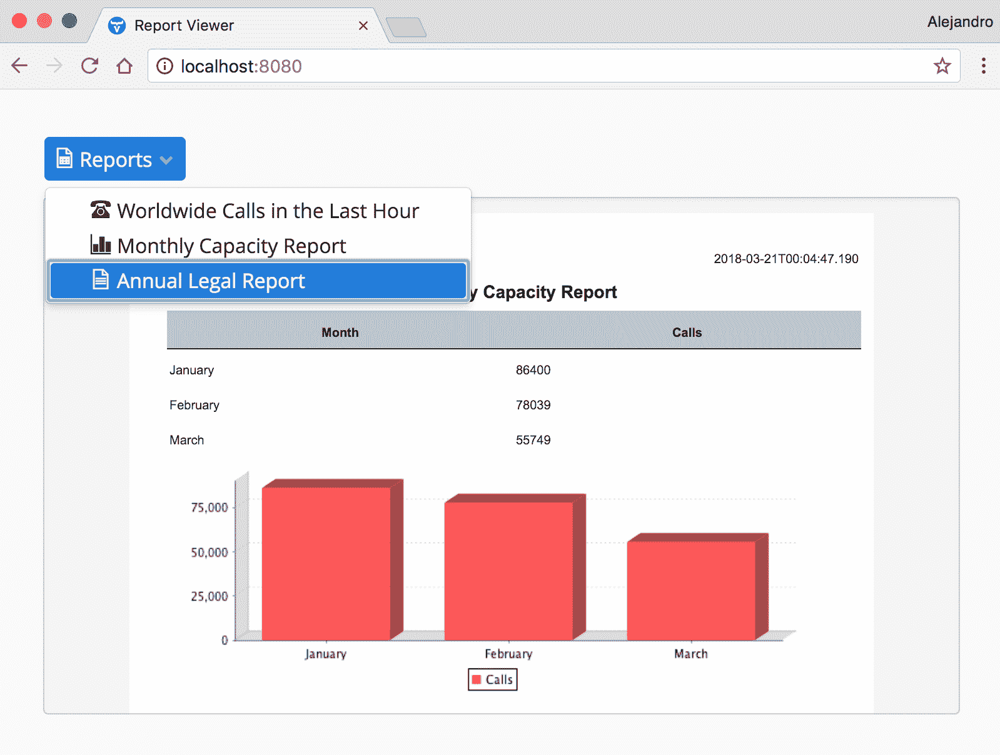
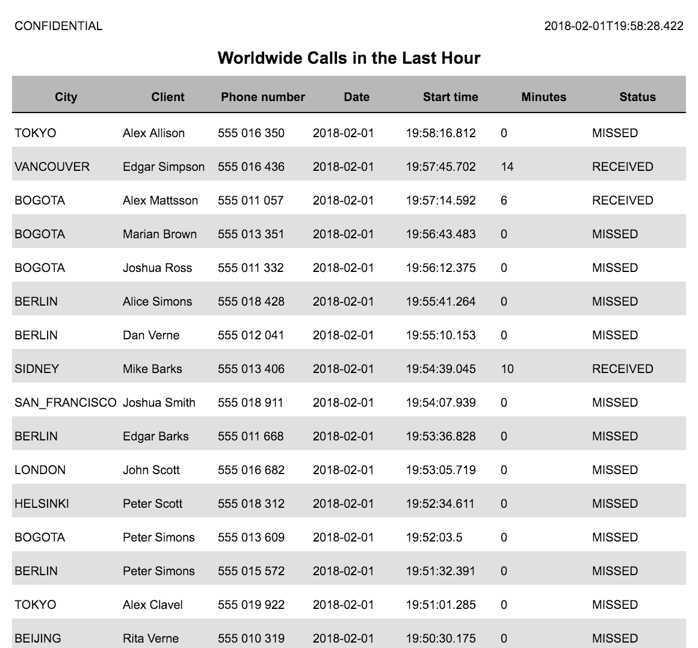
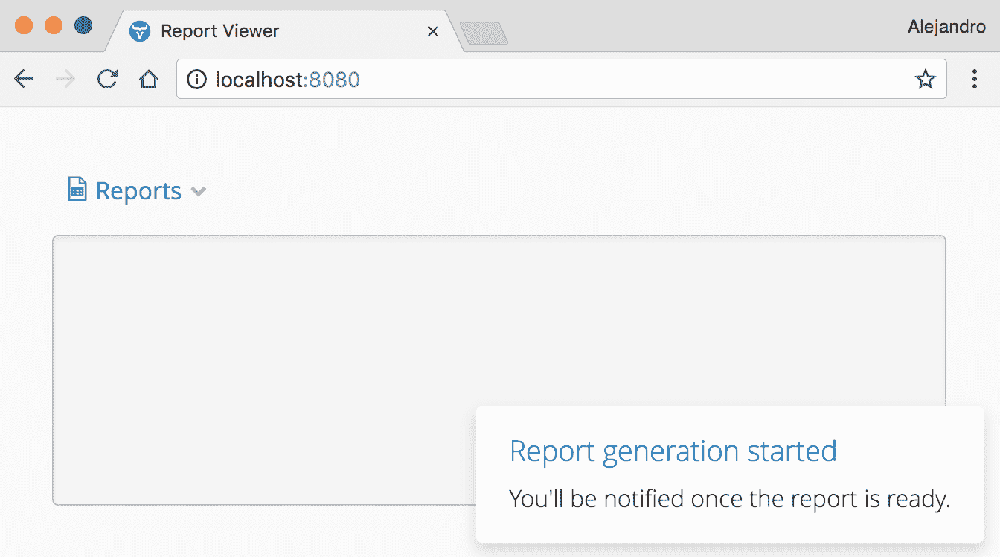
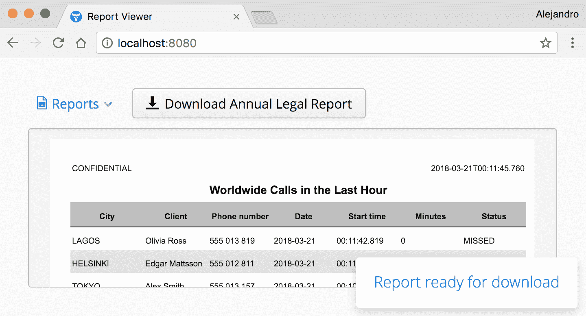

# 第八章：添加报告功能

许多商业应用程序需要生成报告作为其功能的一部分。*报告*是以特定格式向特定受众展示数据的一种表示。*报告生成器*（或*报告查看器*）是一个应用程序或应用程序模块，允许最终用户可视化并下载报告。通常，报告生成器从数据库中获取数据，并生成适合打印在纸上的文档。在本章中，我们将关注这种类型的报告生成器。有许多具有高级功能（如商业智能和分析）的现成报告生成器，但这些系统超出了本书的范围。

在本章中，我们将学习如何在 Vaadin 应用程序中渲染`JasperReports`，而无需处理报告设计人员或 XML 设计格式。相反，我们将使用 Java API 来设计报告，类似于使用 Vaadin 框架用 Java 设计 Web UI 的方式。我们还将讨论后台报告生成和服务器推送，这是一种允许我们从服务器上运行的单独线程更新客户端的机制。

本章涵盖了以下主题：

+   将`JasperReports`与 Vaadin 集成

+   渲染运行时生成的 HTML

+   长运行的后台任务

+   服务器推送

# 技术要求

您需要具备 Java SE 开发工具包和 Java EE SDK 版本 8 或更高版本。您还需要 Maven 版本 3 或更高版本。建议使用具有 Maven 支持的 Java IDE，例如 IntelliJ IDEA、Eclipse 或 NetBeans。最后，为了使用本书的 Git 仓库，您需要安装 Git。

本章的代码文件可以在 GitHub 上找到：

[`github.com/PacktPublishing/Data-centric-Applications-with-Vaadin-8/tree/master/chapter-08`](https://github.com/PacktPublishing/Data-centric-Applications-with-Vaadin-8/tree/master/chapter-08)

查看以下视频以查看代码的实际效果：

[`goo.gl/9sdD5q`](https://goo.gl/9sdD5q)

# 示例应用程序

在本章中，我们将开发一个报告查看器。以下是为完成的应用程序的截图：



# 数据模型

数据模型基于一个简单的 SQL 表，`Call`，其中包含 ID、客户名称、电话号码、城市、开始时间、持续时间以及状态列。以下是一个代表此表的 JPA 实体：

```java
@Entity
@Data
public class Call {

    @Id
    @GeneratedValue
    private Long id;

    private String client;

    private String phoneNumber;

    @Enumerated(EnumType.STRING)
    private City city;

    private LocalDateTime startTime;

    private Integer duration;

    @Enumerated(EnumType.STRING)
    private Status status;
}
```

`Status`和`City`是简单的 Java `enum`，定义了一些测试值：

```java
public enum Status {
    RECEIVED, MISSED
}

public enum City {
    BOGOTA, TURKU, LONDON, BERLIN, HELSINKI, TOKYO, SAN_FRANCISCO, SIDNEY, LAGOS, VANCOUVER, SANTIAGO, BEIJING
}
```

注意`Call`类的`city`和`status`字段中的`@Enumerated`注解。这用于将值作为字符串而不是表示值的整数持久化到数据库中，这使得我们可以为报告使用更简单的 SQL 查询。

在这个应用中，我们将使用两个持久化框架。对于需要保存数据或运行业务逻辑的应用部分，我们将使用 JPA。对于报表数据，我们将使用 MyBatis。当然，在你的应用中你也可以只使用一个框架。选择 MyBatis 进行报表生成的原因是它非常适合构建和维护复杂的 SQL 查询。SQL 反过来又是一种强大的语言，非常适合报表。能够从你的代码中复制 SQL 查询并在 SQL 客户端直接运行它，简化了实现和维护，因为你可以快速看到报告中会得到的数据，而无需编译或执行应用程序。每个报表都有自己的**数据传输模型**（**DTO**），这是一个封装在方便格式中的类，用于在报表中呈现数据。这种做法的优势在于我们不必查询报表中未使用的额外数据，从而在一定程度上减轻了 Web 服务器的数据处理负担。

两个框架的配置都实现在`JPAService`和`MyBatisService`类以及`persistence.xml`和`mybatis-config.xml`文件中。默认使用基于文件的 H2 数据库，但在配置文件中你可以找到 MySQL 和 PostgreSQL 的配置示例作为注释。

你可以在本书附带的源代码的`Data-centric-Applications-with-Vaadin-8\chapter-08` Maven 项目中找到本章示例的完整源代码。

由于没有数据，报表查看器就没有意义，因此示例应用包含一个随机数据生成器，用于向`Call`表填充随机数据。当表为空时，生成器将以每年一千万个电话的速率填充过去 6 个月内的电话数据。如果表不为空，生成器将使用相同的速率“填充”表中最后一条通话时间和当前时间之间的时间段。此外，生成器还运行一个后台线程，在运行时插入随机数据。这个生成器旨在模拟现实生活中的情况，数据不断被插入到数据库中，有时甚至在应用程序未运行时也是如此。你可以在`DataGenerator`类中找到其实现。`DataGenerator`功能是通过在`WebConfig`类中定义的`ServletContextListener`调用的。生成器中使用的初始时间范围和速率可以通过参数进行配置，以防你想使用不同的值。

# Vaadin UI

`VaadinServlet`在`WebConfig`类中进行配置。`UI`实现是在`VaadinUI`类中完成的。为了参考，以下代码片段显示了示例应用的布局实现：

```java
@Title("Report Viewer")
public class VaadinUI extends UI {

    private HorizontalLayout header = new HorizontalLayout();
    private Panel panel = new Panel();
    private MenuBar.MenuItem annualLegalReportItem;

    @Override
    protected void init(VaadinRequest vaadinRequest) {
        MenuBar menuBar = new MenuBar();
        menuBar.addStyleName(ValoTheme.MENUBAR_BORDERLESS);
        MenuBar.MenuItem reportsMenuItem = menuBar.addItem("Reports", VaadinIcons.FILE_TABLE, null);
        reportsMenuItem.addItem("Worldwide Calls in the Last Hour", VaadinIcons.PHONE_LANDLINE,
                i -> showLastHourCallReport());
        reportsMenuItem.addItem("Monthly Capacity Report", VaadinIcons.BAR_CHART_H,
                i -> showMonthlyCapacityReport());
        annualLegalReportItem = reportsMenuItem.addItem("Annual Legal Report", VaadinIcons.FILE_TEXT_O,
                i -> generateAnnualLegalReport());

        header.addComponents(menuBar);

        panel.addStyleName(ValoTheme.PANEL_WELL);

        VerticalLayout mainLayout = new VerticalLayout(header);
        mainLayout.addComponentsAndExpand(panel);
        setContent(mainLayout);
    }
    ...
}
```

我们将开发三个不同的报告。`showLastHourCallReport`、`showMonthlyCapacityReport` 和 `generateAnnualLegalReport` 方法包含修改 UI 的逻辑，以便在 `panel` 组件内显示相应的报告。

# 将 JasperReports 与 Vaadin 集成

`JasperReports` 是一个开源的报告引擎，可以生成可以在多种格式中渲染的报告，例如 HTML、PDF、Microsoft Excel、ODT（OpenOffice）等。通常，报告是在视觉编辑器（iReport Designer）或 XML 文件（JRXML）中设计的。设计被编译成 Jasper 文件（`*.jasper`），填充数据，并导出为所需的格式。

`DynamicJasper` 和 `DynamicReports` 是两个开源库，它们抽象了 JRXML 格式并提供 API 以在 Java 中设计报告。这与 Vaadin 框架的哲学相吻合，该框架允许您使用 Java 实现基于 HTML 的网络应用程序。在本章中，我们将使用 `DynamicJasper`，但如果您更喜欢 `DynamicReports`，概念是相似的。如果您计划直接在 JRXML 文件中或通过 iReport 设计师工具设计报告，一些概念也可以使用。

您可以通过在 `pom.xml` 文件中添加以下依赖项来包含 `DynamicJasper`：

```java
<dependency>
    <groupId>ar.com.fdvs</groupId>
    <artifactId>DynamicJasper</artifactId>
    <version>5.1.0</version>
</dependency>

```

为了导出 Microsoft Office 格式，您需要添加 Apache POI 作为依赖项：

```java
<dependency>
    <groupId>org.apache.poi</groupId>
    <artifactId>poi-ooxml</artifactId>
    <version>3.10-FINAL</version>
</dependency>
```

# 获取数据

报告生成的一个关键部分是数据收集。数据可以说是报告中最重要的输入。拥有良好的“基础设施代码”进行数据收集将极大地提高报告模块的可维护性。在本章中，我们将使用 SQL 数据库，因为它可能是使用中最常见的数据库类型。这意味着报告是用 SQL 查询填充的。报告不需要保存数据，只需读取。报告中的 SQL 查询通常有多行，有时是动态生成的。MyBatis 似乎是报告模块的一个很好的选择。MyBatis 允许在 XML 文件中定义查询，与 Java 字符串不同，这有助于处理长多行 SQL 查询和动态查询定义。

要使用基于 XML 的 MyBatis 映射器，请在 MyBatis 配置文件中 `mapper` 元素的 `resource` 属性中指定 XML 文件的名称：

```java
<configuration>
    ...
    <mappers>
        <mapper resource="mappers/ReportsMapper.xml"/>
    </mappers>
</configuration>

```

`ReportsMapper.xml` 文件定义如下：

```java
<?xml version="1.0" encoding="UTF-8" ?>
<!DOCTYPE mapper PUBLIC "-//mybatis.org//DTD Mapper 3.0//EN" "http://mybatis.org/dtd/mybatis-3-mapper.dtd">

<mapper namespace="packt.vaadin.datacentric.chapter08.reports.ReportsMapper">
    ...
</mapper>

```

此文件定义了要使用的映射 Java 接口。在 `mapper` 元素内部定义的所有查询都映射到 `ReportsMapper` 类中的相应方法。例如，我们可以定义一个方法来获取给定时间之前的所有调用，如下所示：

```java
public interface ReportsMapper {

    List<CallDto> findCallsBefore(LocalDateTime time);
}
```

注意，我们不是使用 JPA 实体作为结果类型。相反，我们使用 DTO，并且仅使用所需的 Java 字段来存储 SQL 查询中的数据：

```java
@Data
public class CallDto {
    private String client;
    private String phoneNumber;
    private City city;
    private LocalDateTime startTime;
    private Integer duration;
    private Status status;
}
```

我们可以将 SQL 查询映射到 `findCallsBefore` 方法，如下所示：

```java
<mapper namespace="packt.vaadin.datacentric.chapter08.reports.ReportsMapper">

    <select id="findCallsBefore" resultType="packt.vaadin.datacentric.chapter08.reports.CallDto">
        SELECT
          city,
          client,
          phoneNumber,
          startTime,
          duration,
          status
        FROM Call
        WHERE startTime >= #{time}
        ORDER BY startTime DESC
    </select>

</mapper>

```

UI 不直接消耗映射接口。相反，我们可以在服务类中定义更高级的方法。例如，*过去一小时的全球通话* 报告，该报告的数据来自之前的查询，它使用了 `ReportsService` 类中的 `lastHourCalls` 方法：

```java
public class ReportsService {

    public static List<CallDto> lastHourCalls() {
        try (SqlSession session = MyBatisService.getSqlSessionFactory().openSession()) {
            LocalDateTime startOfHour = LocalDateTime.now().minusHours(1);
            ReportsMapper mapper = session.getMapper(ReportsMapper.class);
            return mapper.findCallsBefore(startOfHour);
        }
    }
}
```

这允许在数据相同但需要不同处理（如格式化或计算输入参数）时重用查询。

# 设计报告

让我们从实现一个简单的报告开始，即 *过去一小时的全球通话* 报告，如下面的截图所示：



要使用 `DynamicJasper` 创建报告，你必须创建一个 `DynamicReport` 类型的对象。这是通过使用 `DynamicReportBuilder` 类来完成的，它提供了添加标题、页眉、列和其他构成报告的元素的方法。`DynamicReportBuilder` 类实现了 *建造者模式*，允许逐步创建报告，并提供了一个构建 `DynamicReport` 实例的方法。`DynamicReportBuilder` 有几个子类；我们将遵循官方文档中给出的示例，并使用 `FastReportBuilder` 类。

我们可以先配置标题和页眉信息，启用全页宽，设置无数据时显示的文本，并启用奇数行的背景色：

```java
DynamicReport report = new FastReportBuilder()
        .setTitle("Worldwide Calls in the Last Hour")
        .addAutoText("CONFIDENTIAL", AutoText.POSITION_HEADER, AutoText.ALIGMENT_LEFT, 200, new Style())
        .addAutoText(LocalDateTime.now().toString(), AutoText.POSITION_HEADER, AutoText.ALIGNMENT_RIGHT, 200, new Style())
        .setUseFullPageWidth(true)
        .setWhenNoData("(no calls)", new Style())
        .setPrintBackgroundOnOddRows(true)
        .build();
```

注意，在配置报告后，我们通过调用 `build` 方法来结束句子，该方法返回一个 `DynamicReport` 实例。所有配置调用都发生在实例化（`new FastReportBuilder()`）和调用 `build()` 之间。

报告数据由列定义。列通过 `addColumn` 方法进行配置。`addColumn` 方法接受一个类型为 `AbstractColumn` 的实例，我们可以通过使用 `ColumnBuilder`（也是一个构建类）来创建它。以下代码片段演示了如何创建构成报告的七个列：

```java
DynamicReport report = new FastReportBuilder()
        ...
        .addColumn(ColumnBuilder.getNew()
                .setColumnProperty("city", City.class)
                .setTitle("City")
                .build())
        .addColumn(ColumnBuilder.getNew()
                .setColumnProperty("client", String.class)
                .setTitle("Client")
                .build())
        .addColumn(ColumnBuilder.getNew()
                .setColumnProperty("phoneNumber", String.class)
                .setTitle("Phone number")
                .build())
        .addColumn(ColumnBuilder.getNew()
                .setColumnProperty("startTime", LocalDateTime.class)
                .setTitle("Date")
                .setTextFormatter(DateTimeFormatter.ISO_DATE.toFormat())
                .build())
        .addColumn(ColumnBuilder.getNew()
                .setColumnProperty("startTime", LocalDateTime.class)
                .setTextFormatter(DateTimeFormatter.ISO_LOCAL_TIME.toFormat())
                .setTitle("Start time")
                .build())
        .addColumn(ColumnBuilder.getNew()
                .setColumnProperty("duration", Integer.class)
                .setTitle("Minutes")
                .build())
        .addColumn(ColumnBuilder.getNew()
                .setColumnProperty("status", Status.class)
                .setTitle("Status").build())
        .build();

```

对于每一列，我们必须指定 `CallDto` 类中相应的 Java 属性的名称及其类型。在需要时，我们还可以指定标题和 *文本格式化器*。

`DynamicReport` 实例定义了报告的视觉结构。有了这个基础，我们可以创建一个 `JasperPrint` 对象，它代表一个面向页面的文档，可以稍后导出为多种格式。我们首先需要从服务类中获取数据，然后将 `DynamicReport` 实例和数据传递给 `DynamicJasperHelper` 类的 `generateJasperPrint` 方法：

```java
List<CallDto> calls = ReportsService.lastHourCalls();
JasperPrint print = DynamicJasperHelper.generateJasperPrint(report, new ClassicLayoutManager(), calls);

```

# 将报告渲染为 HTML

`JasperPrint` 实例可以导出为多种格式。由于我们感兴趣的是在 Vaadin 网络应用程序中渲染报告，我们可以将报告导出为 HTML，并使用配置了 `ContentMode.HTML` 的 `Label`，如下所示：

```java
ByteArrayOutputStream outputStream = new ByteArrayOutputStream()
HtmlExporter exporter = new HtmlExporter();
exporter.setExporterOutput(new SimpleHtmlExporterOutput(outputStream));
exporter.setExporterInput(new SimpleExporterInput(print));
exporter.exportReport();

outputStream.flush();
Label htmlLabel = new Label("", ContentMode.HTML);
htmlLabel.setValue(outputStream.toString("UTF-8"));

```

`HtmlExporter` 类将输出发送到 `OutputStream`，我们可以将其转换为 `String` 并设置为 `Label` 的值。这个 `Label` 可以添加到任何 Vaadin 布局中，如以下代码片段所示，同时也考虑了异常处理和资源管理：

```java
public class LastHourCallReport extends Composite {

    public LastHourCallReport() {
        try (ByteArrayOutputStream outputStream = new ByteArrayOutputStream()) {
            DynamicReport report = new FastReportBuilder()
                    ...
                    .build();
            ...

            Label htmlLabel = new Label("", ContentMode.HTML);
            htmlLabel.setValue(outputStream.toString("UTF-8"));
            setCompositionRoot(htmlLabel);

        } catch (JRException | IOException e) {
            throw new RuntimeException(e);
        }
    }
}
```

# 添加图表

使用 `DynamicJasper` 添加图表是通过 `FastReportBuilder` 类的 `addChart` 方法完成的。以下代码片段显示了 *月度容量报告* 的完整配置：

```java
DynamicReportBuilder reportBuilder = new FastReportBuilder()
        .setUseFullPageWidth(true)
        .setTitle("Monthly Capacity Report")
        .setWhenNoData("(no data)", new Style())
        .addAutoText("CONFIDENTIAL", AutoText.POSITION_HEADER, AutoText.ALIGMENT_LEFT, 200, new Style())
        .addAutoText(LocalDateTime.now().toString(), AutoText.POSITION_HEADER, AutoText.ALIGNMENT_RIGHT, 200, new Style())
        .addColumn(monthColumn = ColumnBuilder.getNew()
                .setColumnProperty("monthName", String.class)
                .setTitle("Month")
                .build())
        .addColumn(callsColumn = ColumnBuilder.getNew()
                .setColumnProperty("calls", Integer.class)
                .setTitle("Calls")
                .build())
        .addChart(new DJBar3DChartBuilder()
                .setCategory((PropertyColumn) monthColumn)
                .addSerie(callsColumn)
                .build());

```

注意我们如何需要引用包含我们想要在图表中使用的数据的列。`setCategory` 和 `addSeries` 方法接受这些引用。

为了渲染图表，我们必须配置一个 `ImageServlet`，这是由 `JasperReports` 库提供的。这个 servlet 提供了构成图表的图像。在本章的示例应用程序中，servlet 在 `WebConfig` 类中声明为一个静态内部类：

```java
@WebServlet("/image")
public static class ReportsImageServlet extends ImageServlet {
}
```

你可以使用任何合适的 URL。这需要在导出类（例如，`HTMLExporter`）使用的输出中进行配置。此外，`JasperPrint` 实例必须在 HTTP 会话中设置。以下代码片段显示了在渲染图表时所需的额外配置：

```java
...
JasperPrint print = ...
VaadinSession.getCurrent().getSession().setAttribute(ImageServlet.DEFAULT_JASPER_PRINT_SESSION_ATTRIBUTE, print);

SimpleHtmlExporterOutput exporterOutput = ...
exporterOutput.setImageHandler(new WebHtmlResourceHandler("image?image={0}"));

HtmlExporter exporter = new HtmlExporter();
exporter.setExporterOutput(exporterOutput); ...
```

`WebHtmlResourceHandler` 构造函数接受一个字符串，该字符串用于导出器内部图像处理程序使用的 URL 模式。注意模式以 `image` 开头。这是在 `ImageServlet` 映射中使用的相同值。

# 在后台任务中生成报告

由于大量数据、与外部系统的连接以及数据处理，报告生成可能涉及昂贵的计算。在许多情况下，报告数据直接从原始来源收集，通常是 SQL 数据库。这有两个明显的缺点。第一个问题是随着应用程序的运行，越来越多的数据被添加到数据库中，使得报告随着时间的推移运行速度变慢。第二个问题是报告生成可能在某些时候过度使用数据库，干扰应用程序其他部分的用法。

改善这种情况的一个步骤是逐步和持续地生成报告所需的数据。例如，考虑以下查询，它计算某一列的平均值：

```java
SELECT AVG(column_name) FROM table_name
```

而不是使用这个查询，你可以使用以下公式来连续计算每次新值 (*x[n]*) 持久化时的平均值 (*an*)，从上一个平均值值 (*a[n-1]*) 开始：


当然，这没有考虑到 *删除* 操作，并且需要在数据库中持久化新值时计算平均值，但这个简单示例的关键思想是尝试 *帮助* 应用程序预先生成报告数据，因为数据被添加、修改或删除，以最大限度地减少报告生成时间所需的计算能力。

在预处理数据时，或者当有依赖于时间或外部数据源的计算时，报告生成可能比正常的应用程序请求花费更长的时间。在这些情况下，您可以使用后台线程生成报告，并在报告准备就绪时通知用户。在示例应用程序中，您可以在报告菜单中看到一个年度法律报告选项。生成此报告在应用程序时间上代价高昂，因此，而不是锁定应用程序的使用直到报告准备就绪，应用程序显示一个通知，说明报告正在生成，并在后台线程中启动此过程，同时允许用户在此期间可视化其他报告：



当报告准备就绪时，应用程序会再次通知您，并显示一个按钮，允许您下载报告：



下一个章节将解释如何实现这种行为。

# 将报告导出为 PDF

HTML 是在浏览器中渲染报告的最佳选择。然而，`JasperReports` 和 `DynamicJasper` 支持许多其他格式。这些格式作为 `JRExporter` 接口的实现而可用。其中之一是 `JRPdfExporter` 类。示例应用程序包括 `LastHourCallReport` 类，与之前的报告实现不同，它不是一个 Vaadin UI 组件。由于我们希望允许用户下载此报告，我们实际上不需要为它创建 UI 组件。相反，`LastHourCallReport` 是一个辅助类，用于配置报告，将其导出为 PDF，并通过适合 `FileDownloader` 类的 `OutputStream` 暴露文件内容，`FileDownloader` 类是 Vaadin 框架的一部分。

省略了关于报告配置的细节，这些细节我们在前面的章节中已经介绍过，以下是对 `LastHourCallReport` 类的实现：

```java
public class AnnualLegalReport {

    public static ByteArrayOutputStream getOutputStream() {
        try (ByteArrayOutputStream outputStream = new ByteArrayOutputStream()) {
            DynamicReport report = new FastReportBuilder()
                    ... configure report ...
                    .build();

            List<ClientCountDto> clients = ReportsService.countYearCallsByClient();
            JasperPrint print = DynamicJasperHelper.generateJasperPrint(report, new ClassicLayoutManager(), clients);

            JRPdfExporter exporter = new JRPdfExporter();
            exporter.setExporterOutput(new SimpleOutputStreamExporterOutput(outputStream));
            exporter.setExporterInput(new SimpleExporterInput(print));
            exporter.exportReport();

            outputStream.flush();
 return outputStream;

        } catch (JRException | IOException e) {
            throw new RuntimeException(e);
        }
    }
}
```

我们需要从新线程中调用 `getOutputStream` 方法，并从同一新线程修改 UI，以添加一个下载 PDF 文件的按钮。为了从单独的线程修改 UI，我们需要启用并使用服务器推送。

# 服务器推送

让我们看看如果我们不使用服务器推送，从单独的线程修改 UI 会发生什么：

```java
@Title("Report Viewer")
public class VaadinUI extends UI {

    private HorizontalLayout header = new HorizontalLayout();
    private MenuBar.MenuItem annualLegalReportItem;
    ...

    private void generateAnnualLegalReport() {
        Notification.show("Report generation started",
                "You'll be notified once the report is ready.", Notification.Type.TRAY_NOTIFICATION);
        annualLegalReportItem.setEnabled(false);

 new Thread(() -> {
            ByteArrayOutputStream outputStream = AnnualLegalReport.getOutputStream();
            ByteArrayInputStream inputStream = new ByteArrayInputStream(outputStream.toByteArray());
            Button button = new Button("Download Annual Legal Report", VaadinIcons.DOWNLOAD_ALT);
            header.addComponent(button);

            FileDownloader downloader = new FileDownloader(new StreamResource(() -> {
                header.removeComponent(button);
                annualLegalReportItem.setEnabled(true);
                return inputStream;
            }, "annual-legal-report.pdf"));
            downloader.extend(button);

            Notification.show("Report ready for download", Notification.Type.TRAY_NOTIFICATION);
        }).start();
    }
}
```

当用户点击菜单中的相应选项时，会调用`generateAnnualLegalReport`方法。该方法启动一个新线程，所以我们最终有两个线程；一个是在 HTTP 请求发生时启动的（菜单选项被点击），另一个是由`generateAnnualLegalReport`方法启动的。当 HTTP 请求完成后，用户能够继续在浏览器中使用应用程序。在稍后的某个时刻，`AnnualLegalReport.getOutputStream()`方法完成，应用程序尝试修改 UI。然而，这发生在服务器的一个单独的后台线程中。所有对 UI 的更改都会丢失或可能失败，因为线程没有与 UI 实例关联，并且框架可能会抛出`NullPointerExceptions`（这是`Notification.show`方法的情况）。

您可以通过锁定会话来确保有一个 UI 实例可用，并通过使用`UI.access(Runnable)`方法将任何修改 UI 的代码（从请求处理线程外部）包装起来，以避免`NullPointerExceptions`：

```java
new Thread(() -> {
    ByteArrayOutputStream outputStream = AnnualLegalReport.getOutputStream();
    ByteArrayInputStream inputStream = new ByteArrayInputStream(outputStream.toByteArray());
 access(() -> {
        Button button = new Button("Download Annual Legal Report", VaadinIcons.DOWNLOAD_ALT);
        header.addComponent(button);

        FileDownloader downloader = new FileDownloader(new StreamResource(() -> {
            header.removeComponent(button);
            annualLegalReportItem.setEnabled(true);
            return inputStream;
        }, "annual-legal-report.pdf"));
        downloader.extend(button);

        Notification.show("Report ready for download", Notification.Type.TRAY_NOTIFICATION);
 });
}).start(); 
```

仍然有一个问题；服务器需要将更改发送到浏览器，我们可以通过启用**服务器推送**来实现这一点。服务器推送是一种从服务器到客户端启动通信过程的技术，与典型的 HTTP 请求相反，其中通信是由客户端（网页浏览器）发起的。为了使用服务器推送，您需要在`pom.xml`文件中添加`vaadin-push`依赖项：

```java
<dependency>
    <groupId>com.vaadin</groupId>
    <artifactId>vaadin-push</artifactId>
</dependency>
```

要启用服务器推送，您可以使用`@Push`注解 UI 实现类：

```java
@Push
@Title("Report Viewer")
public class VaadinUI extends UI { ... }
```

`Push`注解接受两个可选参数：`value`和`transport`。第一个参数，`value`，配置要使用的*推送模式*。主要有两种选项：`PushMode.AUTOMATIC`和`PushMode.MANUAL`。`AUTOMATIC`表示一旦`UI.access`方法完成（技术上，一旦会话锁释放），所有对 UI 的更改都会自动发送到客户端。`MANUAL`表示您必须调用`UI.push`来使 UI 更改在浏览器中可用。第二个参数，`transport`，配置要使用的*传输类型*。有三个选项：`Transport.WEBSOCKET`（使用标准*WebSockets*协议，与 HTTP 不同的协议，用于服务器和客户端之间的所有通信），`Transport.WEBSOCKET_XHR`（使用 WebSockets 进行服务器到客户端通信，使用 XHR 进行客户端到服务器通信），以及`Transport.LONG_POLLING`（一种使用标准 HTTP 协议的技术，客户端请求服务器数据，服务器保持请求直到有新数据可用，然后再次重复此过程）。

您还必须为`VaadinServlet`启用异步操作模式，以优化资源并允许在 WebSockets 不可用时将 XHR 作为后备机制：

```java
@WebServlet(value = "/*", asyncSupported = true)
@VaadinServletConfiguration(ui = VaadinUI.class, productionMode = false)
public static class chapter08VaadinServlet extends VaadinServlet {
}
```

# 摘要

在本章中，我们学习了如何在 Vaadin 应用程序中渲染 `JasperReports`。我们使用了 `DynamicJasper`，这使得我们可以使用 Java 编程语言来设计报告。我们还学习了如何在服务器上运行的背景线程中生成报告，并通过使用服务器推送在报告准备好后通知客户端。

在下一章中，你将学习如何通过使用懒加载来在 UI 中处理大量数据。
