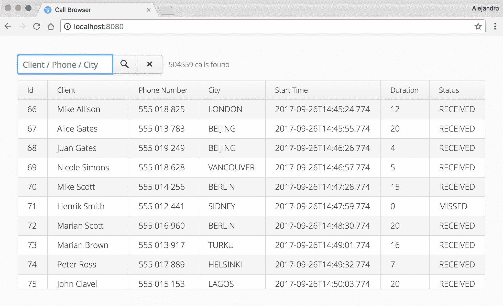
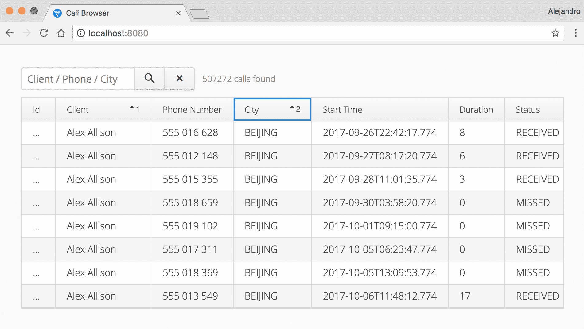
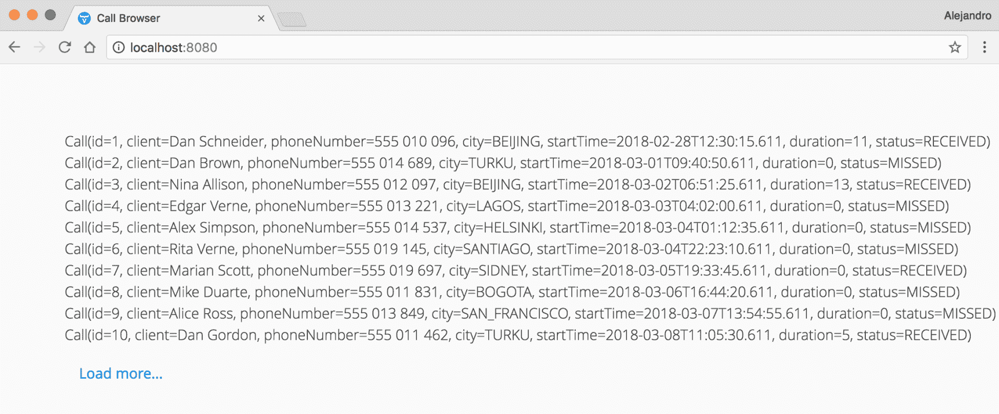

# 懒加载

*懒加载*是一种降低内存消耗（可能还有处理时间）的技术。这种技术将数据的加载延迟到实际需要在 UI 中使用的时刻。例如，如果你有一个`Grid`组件，有 10,000 行数据，但在任何给定时间只有其中一部分可见，那么加载全部 10,000 行可能是一种资源浪费。懒加载背后的理念与懒人的行为相同：如果你将做某事推迟到最后一刻，如果因为某些原因你最终不需要完成这项任务，你将节省时间。在 Web 应用中也是如此。例如，如果一个用户在未滚动数据的情况下离开某些视图，应用程序就不需要加载除了几个可见项目之外的其他任何内容，从而节省了从数据源加载可能成千上万或数百万项内容的需要；当许多用户同时查看同一视图时，这可能会成为一个严重的问题。

在本章中，我们将讨论如何使用`Grid`组件实现懒加载。然而，同样的原则也适用于任何其他显示来自大型数据集数据的 UI 组件。

本章涵盖以下主题：

+   为后端服务添加懒加载功能

+   使用 lambda 表达式实现`DataProvider`

+   过滤

+   排序

+   无限懒加载

# 技术要求

你需要安装 Java SE 开发工具包和 Java EE SDK 版本 8 或更高版本。你还需要 Maven 版本 3 或更高版本。建议使用具有 Maven 支持的 Java IDE，例如 IntelliJ IDEA、Eclipse 或 NetBeans。最后，为了使用本书的 Git 仓库，你需要安装 Git。

本章的代码文件可以在 GitHub 上找到：

[`github.com/PacktPublishing/Data-centric-Applications-with-Vaadin-8/tree/master/chapter-09`](https://github.com/PacktPublishing/Data-centric-Applications-with-Vaadin-8/tree/master/chapter-09)

查看以下视频以查看代码的实际运行情况：

[`goo.gl/GLTkjq`](https://goo.gl/GLTkjq)

# 示例应用程序

我们将开发一个简单的应用程序来测试 Vaadin 在`Grid`组件中显示数十万行数据的能力。用户可以通过输入一个过滤文本来在`Grid`中过滤数据，应用程序将此文本与三列（客户端、电话号码和城市）进行匹配。用户还可以通过拖动标题来更改列的位置，并通过点击列标题来排序行。以下是一个示例应用程序的截图：



# 数据模型

本章使用与第八章中相同的**添加报告功能**所使用的数据模型。数据模型基于一个简单的 SQL 表，`Call`。我们将使用 JPA 连接到基于文件的 H2 数据库。JPA 逻辑封装在`CallRepository`类中。有关数据模型的更多详细信息，请参阅第八章，**添加报告功能**。

你可以在本书附带源代码的`Data-centric-Applications-with-Vaadin-8\chapter-09` Maven 项目中找到本章示例的完整源代码。

# Vaadin UI

`VaadinServlet`在`WebConfig`类中进行配置。`UI`实现由`VaadinUI`类实现。为了参考，以下为`VaadinUI`类的实现：

```java
@Title("Call Browser")
public class VaadinUI extends UI {

    @Override
    protected void init(VaadinRequest vaadinRequest) {
        VerticalLayout mainLayout = new VerticalLayout();
        mainLayout.addComponentsAndExpand(new CallsBrowser());
        setContent(mainLayout);
    }
}
```

注意 UI 由一个只包含`CallsBrowser`组件的`VerticalLayout`组成。我们将从以下`CallsBrowser`自定义组件的实现开始：

```java
public class CallsBrowser extends Composite {

    public CallsBrowser() {
        TextField filter = new TextField();
        filter.setPlaceholder("Client / Phone / City");
        filter.focus();

        Button search = new Button(VaadinIcons.SEARCH);
        search.setClickShortcut(ShortcutAction.KeyCode.ENTER);

        Button clear = new Button(VaadinIcons.CLOSE_SMALL);

        CssLayout filterLayout = new CssLayout(filter, search, clear);
        filterLayout.addStyleName(ValoTheme.LAYOUT_COMPONENT_GROUP);

        Label countLabel = new Label();
        countLabel.addStyleNames(
                ValoTheme.LABEL_LIGHT, ValoTheme.LABEL_SMALL);

        HorizontalLayout headerLayout = new HorizontalLayout(
                filterLayout, countLabel);
        headerLayout.setComponentAlignment(countLabel, Alignment.MIDDLE_LEFT);

        Grid<Call> grid = new Grid<>(Call.class);
        grid.setColumns("id", "client", "phoneNumber", "city", "startTime",
                "duration", "status");
        grid.setSizeFull();

        VerticalLayout mainLayout = new VerticalLayout(headerLayout);
        mainLayout.setMargin(false);
        mainLayout.addComponentsAndExpand(grid);
        setCompositionRoot(mainLayout);
    }
}
```

如果你想自己实现本章的概念，这个类可以用作起点。在这个阶段，UI 在`Grid`中不显示任何数据，并且没有行为。

# 为懒加载准备后端

懒加载（和过滤）功能应尽可能委托给后端。尽管`Grid`类本身能够缓存一些数据，并且仅在需要时将其发送到客户端，但它无法阻止你查询整个数据库，例如。为了支持懒加载，后端服务应提供懒加载数据的手段。

通常，UI 从服务或仓库类获取数据。让我们看看一个仓库类如何提供具有懒加载功能的方法的示例。`CallRepository`类可以定义一个`findAll`方法，查询`Call`表中的*部分*行，如下所示：

```java
public class CallRepository {

    public static List<Call> findAll(int offset, int limit) {
        ...
    }

    public static int count() {
        ...
    }
}
```

在之前的代码中，`limit`用于**限制**应返回的行数（实际上是`User`实例的实例）的数量。当使用 SQL 时，这可以用作 SQL 查询中的`LIMIT`子句。`offset`用于**跳过**一定数量的行，这相当于起始行号。例如，如果 SQL 表有 100 行，我们使用`offset=10`和`limit=5`，则该方法应仅返回第 10 到 15 行。如果我们使用`offset=98`和`limit=5`，则该方法应返回第 98 到 100 行（在 98 之后没有足够的行来完成一组五行）。

为了参考，以下是一个 JPA 实现这些方法的示例：

```java
public class CallRepository {
    ...

    public static List<Call> find(int offset, int limit) {
        return JPAService.runInTransaction(em -> {
            Query query = em.createQuery("select c from Call c");
            query.setFirstResult(offset);
            query.setMaxResults(limit);

            List<Call> resultList = query.getResultList();
            return resultList;
        });
    }

    public static int count() {
        return JPAService.runInTransaction(em -> {
            Query query = em.createQuery("select count(c.id) from Call c");

            Long count = (Long) query.getSingleResult();
            return count.intValue();
        });
    }
}
```

注意我们如何在之前的代码片段中包含了`count`方法。在某些情况下，例如在使用`Grid`组件的懒加载时，这是必需的。

# 使用 Grid 组件进行懒加载

`Grid`组件可以通过使用`setDataProvider`方法利用之前章节中描述的`offset`和`limit`参数，如下所示：

```java
grid.setDataProvider(
    (sortOrders, offset, limit) ->
            CallRepository.findAll(offset, limit).stream(),
    () -> CallRepository.count()
);
```

之前的代码定义了两个 lambda 表达式：

+   `(sortOrders, offset, limit) -> service.find(...)`: 这个 lambda 表达式应该返回由 `offset` 和 `limit` 参数定义的 *slice* 中使用的所有项目（我们稍后会看到如何使用 `sortOrders` 参数）

+   `() -> service.count()`: 这个 lambda 表达式应该返回没有 *slices* 的可用项目总数

在上一个示例中我们使用的 `setDataProvider` 方法接收一个 `FetchItemsCallback` 的实例，这是一个定义了获取项目（或行）的方法的功能接口：

```java
@FunctionalInterface
public interface FetchItemsCallback<T> extends Serializable {

    public Stream<T> fetchItems(
            List<QuerySortOrder> sortOrder, int offset, int limit);
}
```

您还可以使用另一个版本的 `setDataProvider` 方法，该方法接受 `DataProvider` 的实例。在 `DataProvider` 接口中有一个静态辅助方法，允许您使用类似于我们之前使用的 lambda 表达式来实现它：

```java
DataProvider<Call, Void> dataProvider = DataProvider.fromCallbacks(
        query -> CallRepository.find(
                query.getOffset(),
                query.getLimit()).stream(),
        query -> CallRepository.count()
);

grid.setDataProvider(dataProvider);
```

与上一个版本的不同之处在于，我们从 `Query` 实例中获取 `offset` 和 `limit` 值，因此我们需要使用相应的获取器。

# 添加过滤器

过滤也应该在后台服务的帮助下进行。我们可以以与我们在第七章实现 CRUD 用户界面中相同的方式实现它。首先，后台服务方法应该接受过滤输入。在示例应用程序中，过滤值是一个 `String`，但在其他情况下，您可能需要一个包含所有可用于过滤的值的自定义对象。以下是新的 `find` 方法，它接受一个过滤 `String`：

```java
public static List<Call> find(int offset, int limit, String filter,
        Map<String, Boolean> sort) {
    return JPAService.runInTransaction(em -> {
        Query query = em.createQuery("select c from Call c where lower(c.client) like :filter or c.phoneNumber like :filter or lower(c.city) like :filter");
        query.setParameter("filter",
 "%" + filter.trim().toLowerCase() + "%");
        query.setFirstResult(offset);
        query.setMaxResults(limit);

        List<Call> resultList = query.getResultList();
        return resultList;
    });
}
```

注意我们如何通过使用 `lower` JPQL 函数和 `toLowerCase` 方法将过滤值转换为小写来使过滤不区分大小写。我们还在数据库值中间使用 `%` 运算符来允许匹配。我们必须对 `count` 方法做类似的事情：

```java
public static int count(String filter) {
    return JPAService.runInTransaction(em -> {
        Query query = em.createQuery("select count(c.id) from Call c where lower(c.client) like :filter or c.phoneNumber like :filter or lower(c.city) like :filter");
        query.setParameter("filter", "%" + filter.trim().toLowerCase() + "%");

        Long count = (Long) query.getSingleResult();
        return count.intValue();
    });
}
```

在实现的用户界面方面，我们需要将过滤值发送到服务方法。这个值来自 `filter` 文本字段：

```java
DataProvider<Call, Void> dataProvider = DataProvider.fromFilteringCallbacks(
        query -> CallRepository.find(query.getOffset(), query.getLimit(),
 filter.getValue()).stream(),
        query -> CallRepository.count(filter.getValue())
);

```

当点击搜索按钮时，我们还需要刷新 `DataProvider`。这可以通过使用 `ClickListener` 和 `DataProvider` 接口的 `refreshAll` 方法来实现：

```java
search.addClickListener(e -> dataProvider.refreshAll());
```

对于 `clear` 按钮，也可以执行类似的操作，该按钮用于移除用户引入的过滤器：

```java
clear.addClickListener(e -> {
    filter.clear();
    dataProvider.refreshAll();
});

```

当调用 `refreshAll` 方法时，我们之前定义的 lambda 表达式将被再次调用，并从服务类中获取新的数据。

通常，在应用程序用于过滤数据的列上添加数据库索引是一个好主意。在示例应用程序中，我们允许对 `client`、`phoneNumber` 和 `city` 列进行过滤。您可以通过使用 `@Index` 注解让 JPA 创建这些索引，如下所示：

```java
@Entity
@Table(indexes = {
        @Index(name = "client_index", columnList = "client"),
        @Index(name = "phoneNumber_index", columnList = "phoneNumber"),
        @Index(name = "city_index", columnList = "city")
})
@Data
public class Call {
    ...
}
```

默认情况下，示例应用程序在`Call`表中生成大约 500,000 行。不幸的是，`Grid`类无法处理这么多的行。有关这些限制的更多信息，请参阅以下 GitHub 上的问题：[`github.com/vaadin/framework/issues/6290`](https://github.com/vaadin/framework/issues/6290)，以及[`github.com/vaadin/framework/issues/9751`](https://github.com/vaadin/framework/issues/9751)。克服这些问题的方法之一是在查询返回的行数少于一个设定的阈值时，仅在`Grid`中显示过滤结果。

# 在网格组件中排序行

如你所猜，排序（或排序）是另一个应该尽可能委托给后端服务的任务。此外，当你正在后端服务中实现分页（即使用`limit`和`offset`参数的懒加载）时，这可能是必需的。

服务方法应包含一个指定如何执行排序的参数。`Grid`组件允许用户点击列标题以激活按该列排序。需要排序的这些列通过一个`Query`对象传递给`DataProvider`。你可以通过调用`Query.getSortOrders()`方法来获取这些列，该方法返回一个`QuerySortOrder`对象的`List`。你可以将这个`List`传递给服务方法，但总是避免将后端服务与前端技术耦合是一个好主意。`QuerySortOrder`是 Vaadin 框架中的一个类，所以如果你将它们部署在单独的组件中，你将需要在后端服务中包含 Vaadin 依赖。为了避免这种耦合，我们可以实现一个将`QuerySortOrder`对象转换为框架无关对象的实用方法。在后端服务中，我们可以使用一个`Map<String, Boolean>`，其中键是一个包含属性名称的`String`，值是一个`Boolean`，它告诉方法是否按升序排序。

# 准备后端服务

那么，让我们先从向示例应用程序中`CallRepository`的`find`方法添加一个排序配置参数开始：

```java
public static List<Call> find(int offset, int limit,
        String filter, Map<String, Boolean> order) {
    return JPAService.runInTransaction(em -> {
        String jpql = "select c from Call c where lower(c.client) like :filter or c.phoneNumber like :filter or lower(c.city) like :filter" + buildOrderByClause(sort);
        Query query = em.createQuery(jpql);
        query.setParameter("filter", "%" + filter.trim().toLowerCase() + "%");
        query.setFirstResult(offset);
        query.setMaxResults(limit);

        List<Call> resultList = query.getResultList();
        return resultList;
    });
}
```

`order`参数包含我们需要按其排序的属性名称。我们需要将这个`Map`转换为 JPQL 中的`order by`子句（以字符串形式）。这是在`buildOrderByClause`方法中完成的：

```java
private static String buildOrderByClause(Map<String, Boolean> order) {
    StringBuilder orderBy = new StringBuilder();
    order.forEach((property, isAscending) -> orderBy.append(property + (isAscending ? "" : " desc") + ","));

    if (orderBy.length() > 0) {
        orderBy.delete(orderBy.length() - 1, orderBy.length());
        return " order by " + orderBy.toString();
    } else {
        return "";
    }
}
```

如果用户在`Grid`中点击客户端标题，`buildOrderByClause`方法将返回以下字符串：

```java
" order by client"
```

这个字符串将被连接到 JPQL 查询的末尾，然后在该`find`方法中执行。

`Grid` 组件还支持按多列排序。要向排序配置中添加列，用户必须按住 *Shift* 键不放，然后点击列头。例如，如果用户点击 Client 表头，并在点击 City 表头时按住 *Shift* 键不放，则 `buildOrderByClause` 方法将返回以下字符串：

```java
" order by client,city"
```

# 在 UI 中启用排序

正如我们之前讨论的，`DataProvider` 接口使用类型为 `List<QuerySortOrder>` 的对象来提供排序配置。然而，后端服务需要一个类型为 `Map<String, Boolean>` 的对象。我们必须实现一个帮助方法来在这两种类型之间进行转换。我们可以将此方法添加到单独的 `DataUtils` 类中，并按如下方式实现：

```java
public class DataUtils {

    public static <T, F> Map<String, Boolean> getOrderMap(
            Query<T, F> query) {
        Map<String, Boolean> map = new LinkedHashMap<>();

        for (QuerySortOrder order : query.getSortOrders()) {
            String property = order.getSorted();
            boolean isAscending = SortDirection.ASCENDING.equals(
                    order.getDirection());
            map.put(property, isAscending);
        }

        return map;
    }
}
```

`getOrderMap` 方法遍历由 `query.getSortOrders()` 方法返回的 `QuerySortOrder` 对象，并将它们映射到类型为 `Map<String, Boolean>` 的映射中的条目。注意我们使用了 `LinkedHasMap` 类型。这允许我们按照从 `query` 对象提供的 `List` 中来的顺序保持映射中的条目，如果我们想支持 `Grid` 中的多列排序（`order by` 子句应反映用户在浏览器中点击表头时使用的顺序），这是我们所需要的。

我们可以在 `DataProvider` 中使用此实用方法，如下所示：

```java
DataProvider<Call, Void> dataProvider = DataProvider.fromFilteringCallbacks(
        query -> CallRepository.find(query.getOffset(), query.getLimit(), filter.getValue(), DataUtils.getOrderMap(query)).stream(),
        query -> {
            int count = CallRepository.count(filter.getValue());
            countLabel.setValue(count + " calls found");
            return count;
        }
);

```

最终结果如下截图所示：



要完成本章的示例，我们可以启用列排序（用户可以在浏览器中拖动列以重新定位它们），如下所示：

```java
grid.setColumnReorderingAllowed(true);
```

# 用户体验与大数据集

为了结束本章，让我分享一下拥有 10,000 行（或更多）的 `Grid` 的便利性（或不便之处）的一些想法。

# 懒加载网格与直接搜索

在我用来开发本章示例的屏幕上，我可以在 `Grid` 组件中一次看到大约 15 行。如果我想看到第 5,390 行，例如，我必须向下滚动并尝试找到大约 5,390 行的行。如果幸运的话，这需要 1 或 2 秒钟。之后，我必须进行一些精细的滚动才能到达确切的行。这又可能需要 1 或 2 秒钟。在这个示例应用程序中，通过搜索数据来实现这种滚动查找是可能的，因为演示数据是用连续数字为字段中的值生成的。没有缺失的数字。在其他情况下，这可能根本不可能。即使在可能的情况下，滚动数千行也不是一个好的用户体验。

过滤器旨在提供帮助；点击`TextField`并输入 5,390 比滚动浏览数据要快。然而，如果用户需要输入 5,390，我们可以争论渲染数千行甚至不是必需的。整个 UI 可能需要重新设计以更好地适应用例。当你遇到这种包含数千行`Grid`的界面时，换位思考；站在用户的角度。考虑类似向导的界面、滚动时的无限懒加载（如 Facebook 或 Twitter），或任何其他事件，并将视图分割成几个视图，每个视图针对更具体的用例。

# 无限懒加载

尽管我们已经通过使用`Grid`组件解释了懒加载，但我们也可以使用相同的后端服务方法来实现支持懒加载的自定义 UI 组件。例如，你可以在用户点击布局底部的“加载更多”按钮时，使用`VerticalLayout`来添加一组，比如 10 个组件。在这种情况下，你需要跟踪当前偏移量并持续增加它，直到服务方法返回少于 10 个项目。

以下是一个简单的 UI 组件，展示了如何实现这种类型的无限懒加载：

```java
public class LazyLoadingVerticalLayout extends Composite {

    private CssLayout content = new CssLayout();
    private Button button = new Button("Load more...");

    private int offset;
    private int pageSize;

    public LazyLoadingVerticalLayout(int pageSize) {
        this.pageSize = pageSize;

        button.setStyleName(ValoTheme.BUTTON_BORDERLESS_COLORED);

        VerticalLayout mainLayout = new VerticalLayout(content, button);
        setCompositionRoot(mainLayout);

        button.addClickListener(e -> loadMore());
        loadMore();
    }

    public void loadMore() {
        List<Call> calls = CallRepository.find(
                offset, pageSize, "", new HashMap<>());

        if (calls.size() < pageSize) {
            button.setVisible(false);
        }

        calls.stream()
                .map(call -> new Label(call.toString()))
                .forEach(content::addComponent);

        offset += pageSize;
    }
}
```

注意`loadMore`方法如何持续向`content`布局添加组件，直到没有更多结果可以添加，此时“加载更多...”按钮从 UI 中隐藏。

以下截图显示了此组件的实际应用：



# 概述

在本章中，我们学习了如何通过增强后端服务方法以支持它来实现懒加载。我们学习了如何使用具有过滤和排序功能的懒加载`Grid`组件。我们通过提供两个 lambda 表达式来实现`DataProvider`：一个用于获取数据切片，另一个用于计算项目总数。我们还讨论了处理大型数据集时需要考虑的 UX 方面，并学习了如何实现无限懒加载，作为拥有数千行`Grid`的替代方案。

本章结束了通过许多与模块化、API 设计、UI 设计和在 Vaadin 开发的应用程序中的数据管理相关有趣主题的旅程。关于这个主题，我们在这本书中无法涵盖的内容还有很多。希望这本书能激发你找到解决在用 Vaadin 开发以数据为中心的 Web 应用程序时可能遇到的某些挑战的好方法。编码愉快！
