# 1

# 设置环境和工具 – 后端

在本书中，我们将学习使用 Spring Boot 在后端和 React 在前端进行全栈开发。本书的第一部分侧重于后端开发。本书的第二部分侧重于使用 React 的前端编程。在第三部分，我们将**实现**前端。

在本章中，我们将设置用于使用 Spring Boot 进行后端编程的环境和工具。Spring Boot 是一个基于现代 Java 的后端框架，它使开发速度比传统的基于 Java 的框架更快。使用 Spring Boot，你可以创建一个具有嵌入式应用服务器的独立 Web 应用程序。

有很多不同的**集成开发环境**（**IDE**）工具可用于开发 Spring Boot 应用程序。在本章中，我们将安装**Eclipse**，这是一个适用于多种编程语言的开源 IDE。我们将通过使用**Spring Initializr**项目启动页面来创建我们的第一个 Spring Boot 项目。在开发 Spring Boot 应用程序时，阅读控制台日志是一项关键技能，我们也将涉及这一点。

在本章中，我们将探讨以下主题：

+   安装 Eclipse

+   理解 Gradle

+   使用 Spring Initializr

+   安装 MariaDB

# 技术要求

要与 Eclipse 和 Spring Boot 3 一起使用，需要**Java 软件开发工具包**（**JDK**），版本 17 或更高。在本书中，我们使用的是 Windows 操作系统，但所有工具也适用于 Linux 和 macOS。您可以从 Oracle（[`www.oracle.com/java/technologies/downloads/`](https://www.oracle.com/java/technologies/downloads/））获取 JDK 安装包，或者您也可以使用 OpenJDK 版本。您可以通过在终端中输入 `java –version` 命令来检查已安装的 Java SDK 版本。

您可以从 GitHub 下载本章的代码：[https://github.com/PacktPublishing/Full-Stack-Development-with-Spring-Boot-3-and-React-Fourth-Edition/tree/main/Chapter01](https://github.com/PacktPublishing/Full-Stack-Development-with-Spring-Boot-3-and-React-Fourth-Edition/tree/main/Chapter01)。

# 安装 Eclipse

**Eclipse**是由 Eclipse 基金会开发的开放源代码编程 IDE。可以从[`www.eclipse.org/downloads`](https://www.eclipse.org/downloads)下载安装包或安装程序。Eclipse 可用于 Windows、Linux 和 macOS。如果您熟悉其他 IDE 工具，如 IntelliJ 或 VS Code，您也可以使用它们。

您可以下载 Eclipse 的 ZIP 包或执行安装向导的安装包。在安装程序中，您应选择**适用于企业 Java 和 Web 开发者的 Eclipse IDE**，如下面的截图所示：

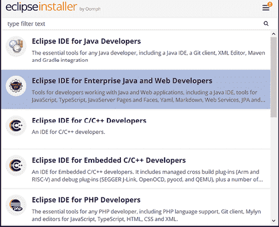

图 1.1：Eclipse 安装程序

如果使用 ZIP 包，您必须将其提取到您的本地磁盘上，它将包含一个可执行的 `eclipse.exe` 文件，您可以通过双击文件来运行它。您应该下载 **Eclipse IDE for Enterprise Java and Web Developers** 包。

Eclipse 是一个支持多种编程语言的 IDE，如 Java、C++ 和 Python。Eclipse 包含不同的 **视角**以满足您的需求，这些视角是 Eclipse 工作台中的一组视图和编辑器。以下截图显示了 Java 开发中常见的视角：

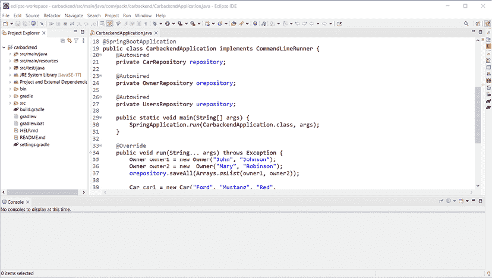

图 1.2：Eclipse 工作台

在左侧，我们有 **项目资源管理器**，我们可以在这里看到我们的项目结构和资源。**项目资源管理器**也用于通过双击文件来打开文件。文件将在工作台中间的编辑器中打开。**控制台**视图可以在工作台的下半部分找到。这个视图非常重要，因为它显示了应用程序的日志消息。

重要提示

如果您想，您可以为 Eclipse 获取 **Spring Tool Suite** (**STS**)，但在这本书中我们不会使用它，因为纯 Eclipse 安装就足够我们使用了。STS 是一系列插件，可以使 Spring 应用程序开发变得简单，您可以在以下链接中找到更多关于它的信息：[`spring.io/tools`](https://spring.io/tools)。

现在我们已经安装了 Eclipse，让我们快速了解一下 Gradle 是什么以及它如何帮助我们。

# 理解 Gradle

**Gradle** 是一个构建自动化工具，它使软件开发过程变得更简单，并统一了开发过程。它管理我们的项目依赖关系并处理构建过程。

重要提示

您还可以使用另一个名为 **Maven** 的项目管理工具与 Spring Boot 一起使用，但我们将专注于本书中使用 Gradle，因为它比 Maven 更快、更灵活。

在我们的 Spring Boot 项目中使用 Gradle 不需要执行任何安装，因为我们正在项目中使用 Gradle 包装器。

Gradle 配置是在项目的 `build.gradle` 文件中完成的。该文件可以根据项目的具体需求进行自定义，并可用于自动化构建、测试和部署软件等任务。`build.gradle` 文件是 Gradle 构建系统的重要组成部分，用于配置和管理软件项目的构建过程。`build.gradle` 文件通常包含有关项目依赖信息，如项目编译所需的外部库和框架。您可以使用 Kotlin 或 Groovy 编程语言编写 `build.gradle` 文件。在本书中，我们使用 **Groovy**。以下是一个 Spring Boot 项目 `build.gradle` 文件的示例：

```java
plugins {
    id 'java'
    id 'org.springframework.boot' version '3.1.0'
    id 'io.spring.dependency-management' version '1.1.0'
}
group = 'com.packt'
version = '0.0.1-SNAPSHOT'
sourceCompatibility = '17'
repositories {
    mavenCentral()
}
dependencies {
    implementation 'org.springframework.boot:spring-boot-starter-web'
    developmentOnly 'org.springframework.boot:spring-boot-devtools'
    testImplementation 'org.springframework.boot:spring-boot-starter-
    test'
}
tasks.named('test') {
    useJUnitPlatform()
} 
```

`build.gradle` 文件通常包含以下部分：

+   **插件**：`plugins` 块定义了项目中使用的 Gradle 插件。在这个块中，我们可以定义 Spring Boot 的版本。

+   **仓库**：`repositories` 块定义了用于解析依赖项的依赖项仓库。我们使用 Maven Central 仓库，Gradle 从中拉取依赖项。

+   **依赖项**：`dependencies` 块指定了项目中使用的依赖项。

+   **任务**：`tasks` 块定义了构建过程中的任务，例如测试。

Gradle 通常从命令行使用，但我们使用 Gradle 包装器和 Eclipse，它们处理我们需要的所有 Gradle 操作。包装器是一个脚本，它调用声明的 Gradle 版本，并将您的项目标准化为给定的 Gradle 版本。因此，我们在此不关注 Gradle 命令行使用。最重要的是理解 `build.gradle` 文件的结构以及如何向其中添加新的依赖项。我们将在下一节学习如何使用 Spring Initializr 添加依赖项。在本书的后续章节中，我们还将手动将新的依赖项添加到 `build.gradle` 文件中。

在下一节中，我们将创建我们的第一个 Spring Boot 项目，并查看我们如何使用 Eclipse IDE 运行它。

# 使用 Spring Initializr

我们将使用 **Spring Initializr** 创建我们的后端项目，这是一个基于网络的工具，用于创建 Spring Boot 项目。然后，我们将学习如何使用 Eclipse IDE 运行我们的 Spring Boot 项目。在本节的最后，我们还将探讨如何使用 Spring Boot 日志。

## 创建项目

要使用 Spring Initalizr 创建我们的项目，请完成以下步骤：

1.  通过您的网络浏览器导航到 [`start.spring.io`](https://start.spring.io) 打开 Spring Initializr。您应该看到以下页面：

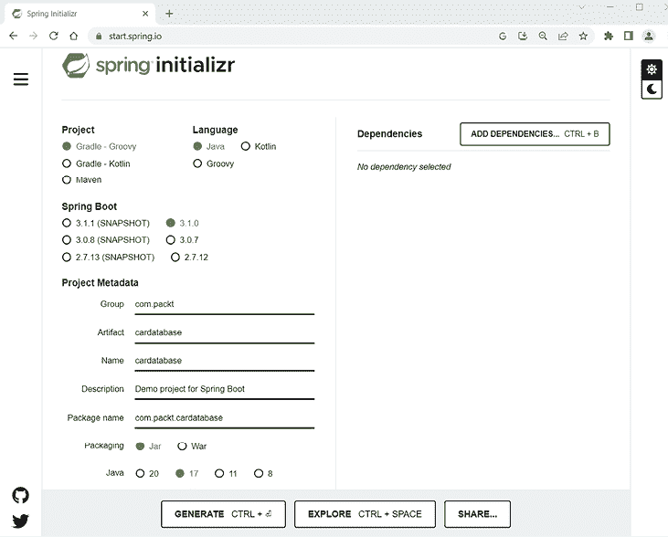

图 1.3：Spring Initializr

1.  我们将生成一个 **Gradle - Groovy** 项目，包含 **Java** 和最新的稳定版 **Spring Boot 3.1.x**。如果您使用的是更新的主要或次要版本，您应该检查发布说明以了解有哪些变化。在 **组** 字段中，我们将定义我们的组 ID（**com.packt**），这也会成为我们 Java 项目的基包。在 **工件** 字段中，我们将定义一个工件 ID（**cardatabase**），这也会成为我们在 Eclipse 中的项目名称。

    重要提示

    在 Spring Initializr 中选择正确的 Java 版本。在本章中，我们使用 Java 版本 17。在 Spring Boot 3 中，Java 基准是 Java 17。

1.  通过点击**添加依赖项…**按钮，我们将选择项目中需要的启动器和依赖项。Spring Boot 提供简化 Gradle 配置的启动包。Spring Boot 启动包实际上是一组你可以包含在项目中的依赖项。我们将通过选择两个依赖项来开始我们的项目：**Spring Web**和**Spring Boot DevTools**。你可以在搜索字段中输入依赖项，或者从出现的列表中选择，如图下所示：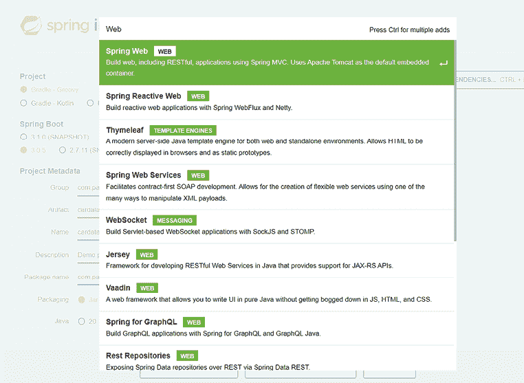

    图 1.4：添加依赖项

    **Spring Boot DevTools**依赖项为我们提供了 Spring Boot 开发者工具，这些工具提供了自动重启功能。这使得开发变得更快，因为当更改已保存时，应用程序会自动重启。

    **Spring Web**启动包是全栈开发的基石，并提供了内嵌的 Tomcat 服务器。在你添加了依赖项之后，Spring Initializr 中的**依赖项**部分应该看起来像这样：

    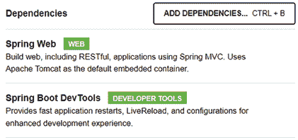

    图 1.5：Spring Initializr 依赖项

1.  最后，点击**生成**按钮，这将为我们生成一个项目启动 ZIP 包。

接下来，我们将学习如何使用 Eclipse IDE 运行我们的项目。

## 运行项目

执行以下步骤以在 Eclipse IDE 中运行 Gradle 项目：

1.  提取我们在上一节中创建的项目 ZIP 包，并打开**Eclipse**。

1.  我们将把我们的项目导入到 Eclipse IDE 中。要开始导入过程，选择**文件 | 导入**菜单，导入向导将被打开。以下截图显示了向导的第一页：

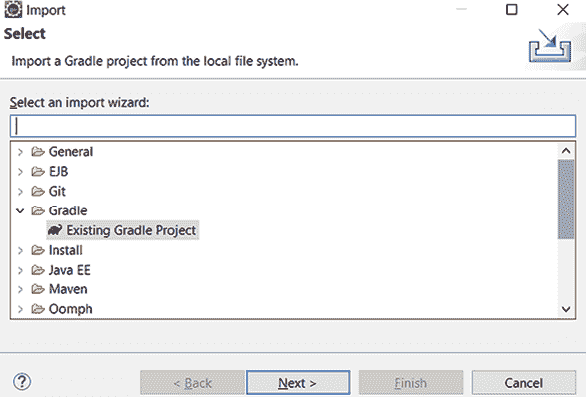

图 1.6：导入向导（步骤 1）

1.  在第一阶段，你应该从**Gradle**文件夹下的列表中选择**现有 Gradle 项目**，然后点击**下一步 >**按钮。以下截图显示了导入向导的第二步：

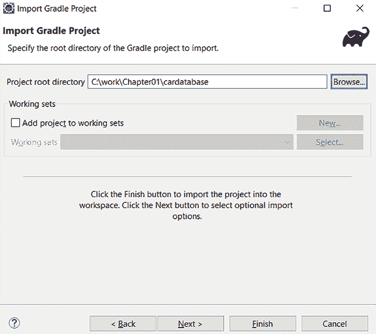

图 1.7：导入向导（步骤 2）

1.  在这个阶段，点击**浏览...**按钮并选择提取的项目文件夹。

1.  点击**完成**按钮以完成导入。如果一切运行正确，你应该在 Eclipse IDE 的**项目资源管理器**中看到`cardatabase`项目。项目准备需要一段时间，因为所有依赖项将在导入后由 Gradle 下载。你可以在 Eclipse 的右下角看到依赖项下载的进度。以下截图显示了成功导入后的 Eclipse IDE**项目资源管理器**：

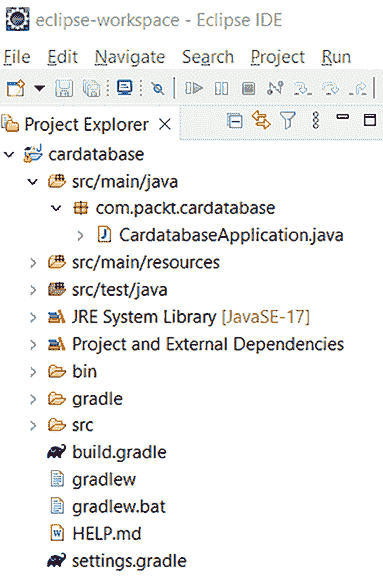

图 1.8：项目资源管理器

1.  **项目资源管理器**也显示了我们的项目包结构。一开始，只有一个名为`com.packt.cardatabase`的包。在该包下面是我们的主应用程序类，名为`CardatabaseApplication.java`。

1.  现在，我们的应用程序没有任何功能，但我们可以运行它并查看是否一切已成功启动。要运行项目，通过双击它打开主类，如图所示，然后在 Eclipse 工具栏中点击 **运行** 按钮（播放图标）。或者，您可以选择 **运行** 菜单并点击 **运行方式 | Java 应用程序**：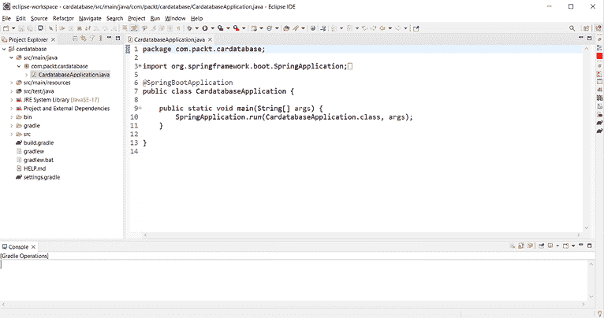

    图 1.9：Cardatabase 项目

    您可以在 Eclipse 中看到 **控制台** 视图已打开，其中包含有关项目执行的重要信息。正如我们之前讨论的，这是所有日志文本和错误消息出现的视图，因此当出现问题时检查视图的内容非常重要。

    如果项目执行正确，您应该在控制台末尾的文本中看到已启动的 `CardatabaseApplication` 类。以下截图显示了我们的 Spring Boot 项目启动后 Eclipse 控制台的内容：

    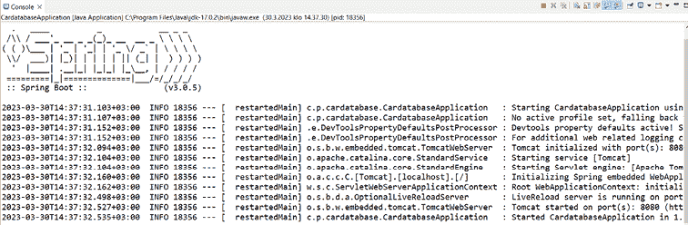

    图 1.10：Eclipse 控制台

您也可以使用以下命令（在您的项目文件夹中）从命令提示符或终端运行您的 **Spring Boot Gradle** 项目：

```java
gradlew bootRun 
```

在我们的项目根目录中，有一个 `build.gradle` 文件，这是我们的项目 Gradle 配置文件。如果您查看文件中的依赖项，您会看到现在有我们在 Spring Initializr 页面上选择的依赖项。还有一个自动包含的测试依赖项，如下面的代码片段所示：

```java
dependencies {
    implementation 'org.springframework.boot:spring-boot-starter-
    web'
    developmentOnly 'org.springframework.boot:spring-boot-
    devtools'
    testImplementation 'org.springframework.boot:spring-boot-
    starter-test'
} 
```

在接下来的章节中，我们将向我们的应用程序添加更多功能，然后我们将手动将更多依赖项添加到 `build.gradle` 文件中。

让我们更仔细地看看 Spring Boot 的 `main` 类：

```java
package com.packt.cardatabase;
import org.springframework.boot.SpringApplication;
import org.springframework.boot.autoconfigure.SpringBootApplication;
**@SpringBootApplication**
public class CardatabaseApplication {
    public static void main(String[] args) {
        SpringApplication.run(CardatabaseApplication.class, args);
    }
} 
```

在类开始处有 `@SpringBootApplication` 注解，这实际上是多个注解的组合：

| **注释** | **描述** |
| --- | --- |
| `@EnableAutoConfiguration` | 这启用了 Spring Boot 的自动配置，因此您的项目将根据依赖项自动进行配置。例如，如果您有 `spring-boot-starter-web` 依赖项，Spring Boot 假设您正在开发一个 Web 应用程序，并相应地配置您的应用程序。 |
| `@ComponentScan` | 这启用了 Spring Boot 组件扫描以找到您应用程序的所有组件。 |
| `@Configuration` | 这定义了一个可以用作 bean 定义源的类。 |

表 1.1：SpringBootApplication 注解

应用程序的执行从 `main()` 方法开始，就像标准 Java 应用程序一样。

重要提示

建议您将主应用程序类定位在根包中，位于其他类之上。包含应用程序类的所有包都将由 Spring Boot 的组件扫描覆盖。应用程序无法正常工作的一个常见原因是 Spring Boot 无法找到关键类。

## Spring Boot 开发工具

Spring Boot 开发工具使应用程序开发过程更简单。开发工具最重要的功能是在`classpath`上的文件被修改时自动重启。如果将以下依赖项添加到 Gradle 的 `build.gradle` 文件中，项目将包括开发工具：

```java
developmentOnly 'org.springframework.boot:spring-boot-devtools' 
```

当您创建应用程序的完整打包生产版本时，开发工具将被禁用。您可以通过在主类中添加一条注释行来测试自动重启，如下所示：

```java
package com.packt.cardatabase;
import org.springframework.boot.SpringApplication;
import org.springframework.boot.autoconfigure.SpringBootApplication;
@SpringBootApplication
public class CardatabaseApplication {
    public static void main(String[] args) {
        // After adding this comment the application is restarted
        SpringApplication.run(CardatabaseApplication.class, args);
    }
} 
```

保存文件后，您可以在控制台中看到应用程序已重启。

## 日志和问题解决

日志可以用来监控您的应用程序流程，并且是捕获程序代码中意外错误的好方法。Spring Boot 启动包提供了 **Logback**，我们可以用于日志记录而无需任何配置。以下示例代码展示了如何使用日志。Logback 使用 **Simple Logging Façade for Java** （**SLF4J**）作为其原生接口：

```java
package com.packt.cardatabase;
**import org.slf4j.Logger;**
**import org.slf4j.LoggerFactory;**
import org.springframework.boot.SpringApplication;
import org.springframework.boot.autoconfigure.SpringBootApplication;
@SpringBootApplication
public class CardatabaseApplication {
    **private static** **final Logger logger = LoggerFactory.getLogger(**
        **CardatabaseApplication.class**
    **);**

    public static void main(String[] args) {
        SpringApplication.run(CardatabaseApplication.class, args);
        **logger.info("Application started");**
    }
} 
```

`logger.info` 方法将日志消息打印到控制台。运行项目后，您可以在控制台中看到日志消息，如下截图所示：

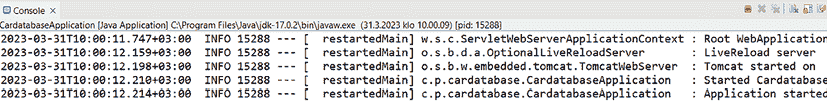

图 1.11：日志消息

日志有七个不同的级别：`TRACE`、`DEBUG`、`INFO`、`WARN`、`ERROR`、`FATAL`和`OFF`。您可以在 Spring Boot 的 `application.properties` 文件中配置日志级别。该文件位于项目内部的 `/resources` 文件夹中，如下截图所示：

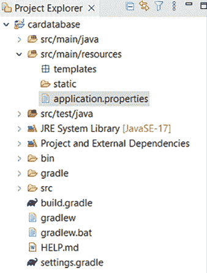

图 1.12：应用程序属性文件

如果我们将日志级别设置为 `DEBUG`，我们就可以看到来自日志级别 `DEBUG` 或更高（即 `DEBUG`、`INFO`、`WARN` 和 `ERROR`）的日志消息。在以下示例中，我们设置了根的日志级别，但您也可以在包级别设置它：

```java
logging.level.root=DEBUG 
```

现在，当您运行项目时，您将无法再看到 `TRACE` 消息。`TRACE` 级别包含所有应用程序行为细节，除非您需要完全了解应用程序中发生的事情，否则不需要。这可能是一个开发版本应用程序的好设置。如果您没有定义其他任何内容，默认日志级别是 `INFO`。

在运行 Spring Boot 应用程序时，您可能会遇到一个常见的失败情况。Spring Boot 默认使用 Apache Tomcat ([`tomcat.apache.org/`](http://tomcat.apache.org/)) 作为应用程序服务器，默认情况下在端口 `8080` 上运行。您可以在 `application.properties` 文件中更改端口。以下设置将在端口 `8081` 上启动 Tomcat：

```java
server.port=8081 
```

如果端口被占用，应用程序将无法启动，您将在控制台中看到以下 **APPLICATION FAILED TO START** 消息：

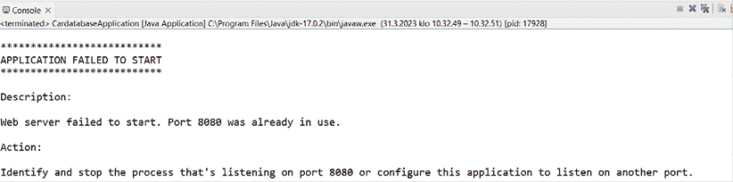

图 1.13：端口已被占用

如果发生这种情况，你必须停止监听端口`8080`的进程或在你 Spring Boot 应用程序中使用另一个端口。你可以在运行应用程序之前点击 Eclipse 控制台中的**终止**按钮（红色方块）来避免这种情况。

在下一节中，我们将安装一个**MariaDB**数据库，作为我们后端的数据库使用。

# 安装 MariaDB

在**第三章**，**使用 JPA 创建和访问数据库**中，我们将使用 MariaDB，因此你需要在你的计算机上本地安装它。MariaDB 是一个广泛使用的开源关系型数据库。MariaDB 适用于 Windows、Linux 和 macOS，你可以在[`mariadb.com/downloads/community/`](https://mariadb.com/downloads/community/)下载最新的稳定社区服务器。MariaDB 是在*GNU* *通用公共许可证，版本 2 (GPLv2)* 许可下开发的。

以下步骤指导你安装 MariaDB：

1.  对于 Windows，有**Microsoft Installer**（**MSI**），我们将在这里使用它。下载安装程序并执行它。从安装向导中安装所有功能，如下面的截图所示：

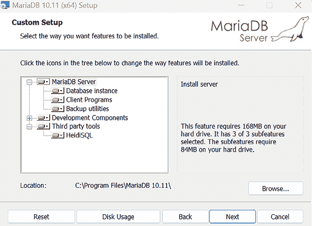

图 1.14：MariaDB 安装（步骤 1）

1.  在下一步中，你应该为 root 用户设置一个密码。这个密码在下一章我们将应用程序连接到数据库时需要。过程如下面的截图所示：

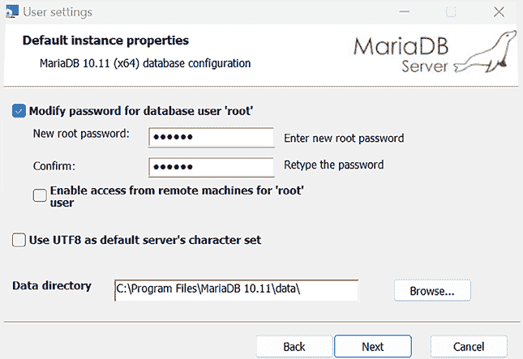

图 1.15：MariaDB 安装（步骤 2）

1.  在下一个阶段，我们可以使用默认设置，如下面的截图所示：

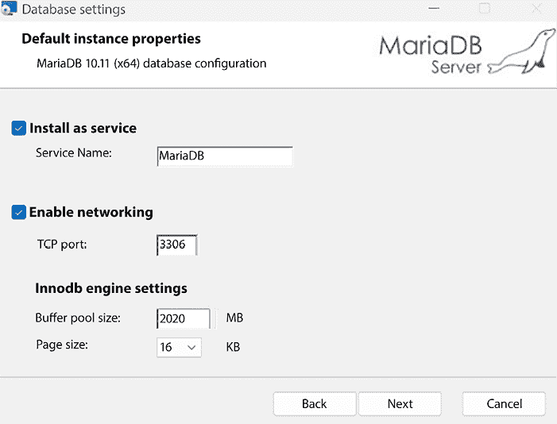

图 1.16：MariaDB 安装（步骤 3）

1.  现在，安装将开始，MariaDB 将安装在你的本地计算机上。安装向导将为我们安装**HeidiSQL**。这是一个易于使用的图形数据库客户端。我们将使用它来添加新的数据库并对我们的数据库进行查询。你也可以使用安装包中包含的命令提示符。

1.  打开**HeidiSQL**，使用安装阶段提供的密码登录。然后你应该会看到以下屏幕：

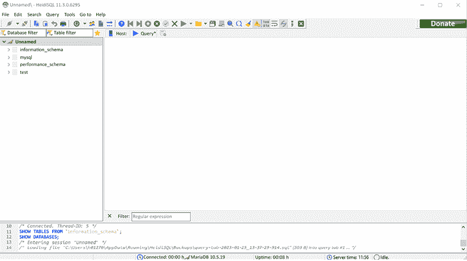

图 1.17：HeidiSQL

重要提示

HeidiSQL 仅适用于 Windows。如果你使用 Linux 或 macOS，可以使用 DBeaver([`dbeaver.io/`](https://dbeaver.io/))代替。

现在我们已经拥有了开始实现后端所需的一切。

# 摘要

在本章中，我们安装了使用 Spring Boot 进行后端开发所需的工具。对于 Java 开发，我们设置了广泛使用的编程 IDE Eclipse。我们使用 Spring Initializr 页面创建了一个新的 Spring Boot 项目。创建项目后，将其导入 Eclipse 并执行。我们还介绍了如何解决 Spring Boot 的常见问题以及如何查找重要的错误和日志消息。最后，我们安装了一个 MariaDB 数据库，我们将在下一章中使用它。

在下一章中，我们将了解什么是 **依赖注入**（**DI**）以及它如何与 Spring Boot 框架一起使用。

# 问题

1.  什么是 Spring Boot？

1.  什么是 Eclipse IDE？

1.  什么是 Gradle？

1.  我们如何创建一个 Spring Boot 项目？

1.  我们如何运行 Spring Boot 项目？

1.  我们如何使用 Spring Boot 进行日志记录？

1.  我们如何在 Eclipse 中查找错误和日志消息？

# 进一步阅读

Packt 提供了其他关于学习 Spring Boot 的资源，如下所示：

+   *《学习 Spring Boot 3.0 第三版》*，作者：Greg L. Turnquist ([`www.packtpub.com/product/learning-spring-boot-30-third-edition/9781803233307`](https://www.packtpub.com/product/learning-spring-boot-30-third-edition/9781803233307))

+   *《使用 Spring Boot 3 和 Spring Cloud 的微服务》第三版*，作者：Magnus Larsson ([`www.packtpub.com/product/microservices-with-spring-boot-3-and-spring-cloud-third-edition/9781805128694`](https://www.packtpub.com/product/microservices-with-spring-boot-3-and-spring-cloud-third-edition/9781805128694))

# 在 Discord 上了解更多

要加入本书的 Discord 社区——在那里您可以分享反馈、向作者提问，并了解新版本——请扫描下面的二维码：

[`packt.link/FullStackSpringBootReact4e`](https://packt.link/FullStackSpringBootReact4e)


