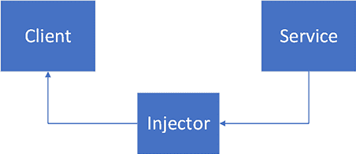

# 第二章：理解依赖注入

在本章中，我们将学习什么是**依赖注入**（**DI**）以及我们如何使用 Spring Boot 框架来实现它。Spring Boot 框架提供了 DI；因此，了解基础知识是很好的。DI 允许组件之间松散耦合，使代码更加灵活、可维护和可测试。

在本章中，我们将探讨以下内容：

+   介绍依赖注入

+   在 Spring Boot 中使用依赖注入

# 技术要求

本章的所有代码都可以在以下 GitHub 链接中找到：[`github.com/PacktPublishing/Full-Stack-Development-with-Spring-Boot-3-and-React-Fourth-Edition/tree/main/Chapter02`](https://github.com/PacktPublishing/Full-Stack-Development-with-Spring-Boot-3-and-React-Fourth-Edition/tree/main/Chapter02)。

# 介绍依赖注入

依赖注入是一种软件开发技术，我们可以创建依赖于其他对象的对象。DI 有助于类之间的交互，但同时也保持类的独立性。

DI 中有三种类型的类：

+   **服务**是一个可以使用的类（这是依赖）。

+   **客户端**是使用依赖的类。

+   **注入器**将依赖（服务）传递给依赖类（客户端）。

以下图表显示了 DI 中的三种类型类：



图 2.1：DI 类

DI 使类之间松散耦合。这意味着客户端依赖的创建与客户端的行为分离，这使得单元测试更容易。

让我们通过 Java 代码的简化示例来了解一下 DI。在以下代码中，我们没有 DI，因为`Car`客户端类正在创建服务类的一个对象：

```java
public class Car {
    private Owner owner;

    public Car() {
        owner = new Owner();
    }
} 
```

在以下代码中，服务对象不是在客户端类中直接创建的。它作为参数传递给类的构造器：

```java
public class Car {
    private Owner owner;

    public Car(Owner owner) {
        this.owner = owner;
    }
} 
```

服务类也可以是抽象类；我们可以在客户端类中使用该类的任何实现，并在测试时使用模拟。

有不同类型的依赖注入；让我们在这里看看两种：

+   **构造器注入**：依赖通过客户端类的构造器传递。在先前的`Car`代码中已经展示了构造器注入的例子。对于强制依赖，建议使用构造器注入。所有依赖都通过类构造器提供，并且没有其必需依赖的对象无法创建。

+   **设置器注入**：依赖通过设置器提供。以下代码展示了设置器注入的例子：

    ```java
    public class Car {
        private Owner owner;

        public void setOwner(Owner owner) {
            this.owner = owner;
        }
    } 
    ```

在这里，依赖现在作为参数传递给设置器。设置器注入更灵活，因为可以创建没有所有依赖的对象。这种方法允许有可选依赖。

依赖注入减少了代码中的依赖关系，并使代码更具可重用性。它还提高了代码的可测试性。我们现在已经学习了 DI 的基础知识。接下来，我们将探讨 DI 在 Spring Boot 中的应用。

# 在 Spring Boot 中使用依赖注入

在 Spring 框架中，依赖注入是通过 Spring `ApplicationContext`实现的。`ApplicationContext`负责创建和管理对象——**bean**——及其依赖关系。

Spring Boot 扫描您的应用程序类，并将带有特定注解（`@Service`、`@Repository`、`@Controller`等）的类注册为 Spring bean。然后，可以使用依赖注入将这些 bean 注入。

Spring Boot 支持多种依赖注入机制，其中最常见的是：

+   **构造函数注入**：依赖通过构造函数注入。这是最推荐的方式，因为它确保在对象创建时所有必需的依赖都可用。一个相当常见的情况是我们需要数据库访问来进行某些操作。在 Spring Boot 中，我们使用仓库类来处理这种情况。在这种情况下，我们可以使用构造函数注入来注入仓库类，并开始使用其方法，如下面的代码示例所示：

    ```java
    // Constructor injection
    public class Car {
        private final CarRepository carRepository;
        public Car(CarRepository carRepository) {
            this.carRepository = carRepository;
        }

        // Fetch all cars from db 
        carRepository.findAll();
    } 
    ```

    如果您的类中有多个构造函数，您必须使用`@Autowired`注解来定义用于依赖注入的构造函数：

    ```java
    // Constructor to used for dependency injection
    @Autowired
    public Car(CarRepository carRepository) {
        this.carRepository = carRepository;
    } 
    ```

+   **setter 注入**：依赖通过 setter 方法注入。setter 注入在您有可选依赖项或希望在运行时修改依赖项时很有用。下面是 setter 注入的示例：

    ```java
    // Setter injection
    @Service
    public class AppUserService {
        private AppUserRepository userRepository;
    @Autowired
        public void setAppUserRepository(
            AppUserRepository userRepository) {
                this.userRepository = userRepository;
            }
        // Other methods that use userRepository
    } 
    ```

+   **字段注入**：依赖直接注入到字段中。字段注入的优点是简单，但它也有一些缺点。如果依赖不可用，它可能会导致运行时错误。此外，测试您的类也更困难，因为您不能为测试模拟依赖。以下是一个示例：

    ```java
    // Field injection
    @Service
    public class CarDatabaseService implements CarService {
    // Car database services
    }
    public class CarController {
        **@Autowired**
        private CarDatabaseService carDatabaseService;
    //...
    } 
    ```

您可以在 Spring 文档中了解更多关于 Spring Boot 注入的信息：https://spring.io/guides。

# 摘要

在本章中，我们学习了依赖注入是什么以及如何在 Spring Boot 框架中使用它，这是我们用于后端的部分。

在下一章中，我们将探讨如何使用**Java 持久化 API**（**JPA**）与 Spring Boot 以及如何设置 MariaDB 数据库。我们还将学习创建 CRUD 仓库以及数据库表之间的一对多连接。

# 问题

1.  什么是依赖注入？

1.  Spring Boot 中的`@Autowired`注解是如何工作的？

1.  您如何在 Spring Boot 中注入资源？

# 进一步阅读

Packt 提供了一些关于学习 Spring Boot 的视频资源：

+   *通过简单方式学习 Spring 核心框架*，作者 Karthikeya T. ([`www.packtpub.com/product/learn-spring-core-framework-the-easy-way-video/9781801071680`](https://www.packtpub.com/product/learn-spring-core-framework-the-easy-way-video/9781801071680))

+   *精通 Spring 框架基础*, 由 Matthew Speake 著 ([`www.packtpub.com/product/mastering-spring-framework-fundamentals-video/9781801079525`](https://www.packtpub.com/product/mastering-spring-framework-fundamentals-video/9781801079525))

# 在 Discord 上了解更多

要加入这本书的 Discord 社区——在那里您可以分享反馈、向作者提问，并了解新书发布——请扫描下面的二维码：

[`packt.link/FullStackSpringBootReact4e`](https://packt.link/FullStackSpringBootReact4e)


