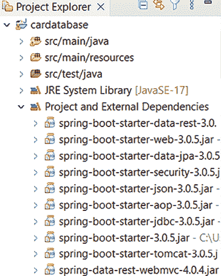

# 3

# 使用 JPA 创建和访问数据库

本章介绍了如何使用 **Jakarta Persistence API**（**JPA**）与 Spring Boot 一起工作，以及如何使用实体类定义数据库。在第一阶段，我们将使用 **H2** 数据库。H2 是一个内存 SQL 数据库，适用于快速开发或演示目的。在第二阶段，我们将从 H2 迁移到 **MariaDB**。本章还描述了 CRUD 仓库的创建以及数据库表之间的一对多连接。

在本章中，我们将涵盖以下主题：

+   ORM、JPA 和 Hibernate 的基础知识

+   创建实体类

+   创建 CRUD 仓库

+   在表之间添加关系

+   设置 MariaDB 数据库

# 技术要求

我们在前面章节中创建的 Spring Boot 应用程序是必需的。

创建数据库应用程序需要安装 MariaDB：[`downloads.mariadb.org/`](https://downloads.mariadb.org/)。我们已经在 *第一章* 中介绍了安装步骤。

本章的代码可以在以下 GitHub 链接中找到：[`github.com/PacktPublishing/Full-Stack-Development-with-Spring-Boot-3-and-React-Fourth-Edition/tree/main/Chapter03`](https://github.com/PacktPublishing/Full-Stack-Development-with-Spring-Boot-3-and-React-Fourth-Edition/tree/main/Chapter03).

# ORM、JPA 和 Hibernate 的基础知识

ORM 和 JPA 是软件开发中广泛使用的处理关系数据库的技术。您不必编写复杂的 SQL 查询；相反，您可以与对象一起工作，这对于 Java 开发者来说更自然。通过这种方式，ORM 和 JPA 可以通过减少编写和调试 SQL 代码的时间来加快您的开发过程。许多 JPA 实现还可以根据您的 Java 实体类自动生成数据库模式。简要来说：

+   **对象关系映射**（**ORM**）是一种技术，允许您通过使用面向对象编程范式从数据库中检索和操作数据。ORM 对于程序员来说非常好，因为它依赖于面向对象的概念，而不是数据库结构。它还使开发过程更快，并减少了源代码的数量。ORM 主要独立于数据库，开发者不必担心供应商特定的 SQL 语句。

+   **Jakarta Persistence API**（**JPA**，以前称为 **Java Persistence API**）为 Java 开发者提供了对象关系映射。JPA 实体是一个代表数据库表结构的 Java 类。实体类的字段代表数据库表的列。

+   **Hibernate** 是最流行的基于 Java 的 JPA 实现，并且默认用于 Spring Boot。Hibernate 是一个成熟的产品，在大型应用程序中得到广泛使用。

接下来，我们将开始使用 H2 数据库实现我们的第一个实体类。

# 创建实体类

**实体类**是一个简单的 Java 类，它被 JPA 的`@Entity`注解所标注。实体类使用标准的 JavaBean 命名约定，并具有适当的 getter 和 setter 方法。类字段具有私有可见性。

当应用程序初始化时，JPA 会创建一个与类名相同的数据库表。如果您想为数据库表使用其他名称，您可以在实体类中使用`@Table`注解。

在本章的开始，我们将使用 H2 数据库（https://www.h2database.com/），这是一个嵌入式的内存数据库。为了能够使用 JPA 和 H2 数据库，我们必须将以下依赖项添加到`build.gradle`文件中：

```java
dependencies {
    implementation 'org.springframework.boot:spring-boot-starter-web'
    **implementation** **'org.springframework.boot:spring-boot-starter-data-jpa'**
    developmentOnly 'org.springframework.boot:spring-boot-devtools'
    **runtimeOnly** **'com.h2database:h2'**
    testImplementation 'org.springframework.boot:spring-boot-starter-test'
} 
```

在您更新了`build.gradle`文件之后，您应该通过在 Eclipse 的**项目资源管理器**中选择项目并右键单击以打开上下文菜单来更新您的依赖项。然后，选择**Gradle | 刷新 Gradle 项目**，如下一截图所示：


图 3.1：刷新 Gradle 项目

您还可以通过打开**窗口 | 首选项**菜单来启用自动项目刷新。转到**Gradle**设置，那里有一个**自动项目同步**复选框，您可以勾选它。然后，如果您更改了构建脚本文件，您的项目将自动同步。这是推荐的，意味着您在更新构建脚本时不需要手动刷新项目：


图 3.2：Gradle 包装器设置

您可以从 Eclipse 的**项目资源管理器**中的**项目和外部依赖**文件夹中找到项目依赖项。现在，您应该在那里找到`spring-boot-starter-data-jpa`和 h2 依赖项：



图 3.3：项目依赖项

让我们看看以下步骤来创建实体类：

1.  要在 Spring Boot 中创建实体类，我们必须为实体创建一个包。这个包应该创建在根包下。为了开始这个过程，在 Eclipse 的**项目资源管理器**中激活根包，并右键单击以出现上下文菜单。

1.  从此菜单中选择**新建 | 包**。以下截图显示了如何为实体类创建一个包：


图 3.4：新包

1.  我们将命名我们的包为`com.packt.cardatabase.domain`：


图 3.5：新 Java 包

1.  接下来，我们将创建我们的实体类。在 Eclipse 的**项目资源管理器**中激活新的`com.packt.cardatabase.domain`包，右键单击它，并从菜单中选择**新建 | 类**。

1.  由于我们将创建一个汽车数据库，实体类的名称将是`Car`。在**名称**字段中输入`Car`，然后按**完成**按钮，如以下截图所示：


图 3.6：新 Java 类

1.  通过在**项目资源管理器**中双击它来在编辑器中打开`Car`类文件。首先，我们必须使用`@Entity`注解注解该类。`@Entity`注解是从`jakarta.persistence`包导入的：

    ```java
    package com.packt.cardatabase.domain;
    **import** **jakarta.persistence.Entity;**
    **@Entity**
    public class Car {
    } 
    ```

    你可以在 Eclipse IDE 中使用*Ctrl* + *Shift* + *O*快捷键自动导入缺失的包。在某些情况下，可能存在包含相同标识符的多个包，因此你必须小心选择正确的导入。例如，在下一步中，`Id`可以在多个包中找到，但你应该选择`jakarta.persistence.Id`。

1.  接下来，我们必须在我们的类中添加一些字段。实体类字段映射到数据库表列。实体类还必须包含一个唯一 ID，该 ID 在数据库中用作主键：

    ```java
    package com.packt.cardatabase.domain;
    import jakarta.persistence.Entity;
    **import** **jakarta.persistence.GeneratedValue;**
    **import** **jakarta.persistence.GenerationType;**
    **import** **jakarta.persistence.Id;**
    @Entity
    public class Car {
        **@Id**
        **@GeneratedValue(strategy=GenerationType.AUTO)**
        **private** **Long id;**
        **private** **String brand, model, color, registrationNumber;**
        **private****int modelYear, price;**
    } 
    ```

    主键是通过使用`@Id`注解定义的。`@GeneratedValue`注解定义了 ID 将由数据库自动生成。我们还可以定义自己的键生成策略；`AUTO`类型表示 JPA 提供者会选择特定数据库的最佳策略，这也是默认的生成类型。你可以通过在多个属性上注解`@Id`来创建一个复合主键。

    默认情况下，数据库列的命名遵循类字段命名约定。如果你想使用其他命名约定，可以使用`@Column`注解。使用`@Column`注解，你可以定义列的长度以及列是否为`nullable`。以下代码展示了使用`@Column`注解的示例。根据此定义，数据库中列的名称为`explanation`，列的长度为`512`，且不可为空：

    ```java
    @Column(name="explanation", nullable=false, length=512)
    private String description 
    ```

1.  最后，我们必须向实体类添加 getter、setter、默认构造函数和带属性的构造函数。由于自动 ID 生成，我们不需要在构造函数中添加 ID 字段。`Car`实体类构造函数的源代码如下：

    Eclipse 提供了自动添加 getter、setter 和构造函数的功能。将光标置于你想要添加代码的位置，然后右键单击。从菜单中选择**源 | 生成 getter 和 setter...**或**源 | 使用字段生成构造函数...**。

    ```java
    // Car.java constructors
    public Car() {
    }
    public Car(String brand, String model, String color,
        String registrationNumber, int modelYear, int price) {
            super();
            this.brand = brand;
            this.model = model;
            this.color = color;
            this.registrationNumber = registrationNumber;
            this.modelYear = modelYear;
            this.price = price;
    } 
    ```

    以下是为`Car`实体类编写的 getter 和 setter 的源代码：

    ```java
     public Long getId() {
                return id;
        }
        public String getBrand() {
                return brand;
        }
        public void setBrand(String brand) {
                this.brand = brand;
        }
        public String getModel() {
                return model;
        }
        public void setModel(String model) {
                this.model = model;
        }
    // Rest of the setters and getters. See the whole source code from GitHub 
    ```

1.  我们还必须在`application.properties`文件中添加新的属性。这允许我们将 SQL 语句记录到控制台。我们还需要定义数据源 URL。打开`application.properties`文件，并在文件中添加以下两行：

    ```java
    spring.datasource.url=jdbc:h2:mem:testdb
    spring.jpa.show-sql=true 
    ```

    当你正在编辑`application.properties`文件时，你必须确保行尾没有多余的空格。否则，设置将不会生效。这可能会发生在你复制/粘贴设置时。

1.  现在，当运行应用程序时，数据库将创建`car`表。在此阶段，我们可以在控制台中看到表创建语句：

    图 3.7：汽车表 SQL 语句

    如果在`application.properties`文件中没有定义`spring.datasource.url`，Spring Boot 将创建一个随机数据源 URL，当您运行应用程序时可以在控制台中看到，例如，`H2 控制台在'/h2-console'可用。数据库在'jdbc:h2:mem:b92ad05e-8af4-4c33-b22d-ccbf9ffe491e'可用`。

1.  H2 数据库提供了一个基于 Web 的控制台，可以用来探索数据库并执行 SQL 语句。要启用控制台，我们必须在`application.properties`文件中添加以下行。第一个设置启用了 H2 控制台，而第二个定义了其路径：

    ```java
    spring.h2.console.enabled=true
    spring.h2.console.path=/h2-console 
    ```

1.  您可以通过启动应用程序并使用 Web 浏览器导航到`localhost:8080/h2-console`来访问 H2 控制台。使用`jdbc:h2:mem:testdb`作为**JDBC URL**，并在**登录**窗口的**密码**字段中留空。按下**连接**按钮登录到控制台，如图下所示：


图 3.8：H2 控制台登录

您也可以通过在`application.properties`文件中使用以下设置来更改 H2 数据库的用户名和密码：`spring.datasource.username`和`spring.datasource.password`。

现在，您可以在数据库中看到我们的`CAR`表。您可能会注意到注册号和型号年份之间有一个下划线。下划线的原因是属性的驼峰命名（`registrationNumber`）：


图 3.9：H2 控制台

现在，我们已经创建了我们的第一个实体类，并学习了 JPA 如何从实体类生成数据库表。接下来，我们将创建一个提供 CRUD 操作的存储库类。

# 创建 CRUD 存储库

Spring Boot Data JPA 提供了一个`CrudRepository`接口用于**创建**、**读取**、**更新**和**删除**（**CRUD**）操作。它为我们提供了实体类的 CRUD 功能。

让我们在`domain`包中创建我们的存储库，如下所示：

1.  在`com.packt.cardatabase.domain`包中创建一个新的接口`CarRepository`，并根据以下代码片段修改文件：

    ```java
    package com.packt.cardatabase.domain;
    import org.springframework.data.repository.CrudRepository;
    public interface CarRepository extends CrudRepository<Car,Long> {
    } 
    ```

    `CarRepository`现在扩展了 Spring Boot JPA 的`CrudRepository`接口。类型参数`<Car, Long>`定义了这是一个`Car`实体类的存储库，并且 ID 字段的类型是`Long`。

    `CrudRepository`接口提供了多个 CRUD 方法，我们现在可以开始使用了。以下表格列出了最常用的方法：

    | **方法** | **描述** |
    | --- | --- |
    | `long count()` | 返回实体数量 |
    | `Iterable<T> findAll()` | 返回给定类型的所有项 |
    | `Optional<T> findById(ID Id)` | 通过 ID 返回一个项 |
    | `void delete(T entity)` | 删除一个实体 |
    | `void deleteAll()` | 删除存储库中的所有实体 |
    | `<S extends T> save(S entity)` | 保存一个实体 |
    | `List<S> saveAll(Iterable<S> entities)` | 保存多个实体 |

    表 3.1：CRUD 方法

    如果方法只返回一个项目，则返回 `Optional<T>` 而不是 `T`。`Optional` 类是在 Java 8 SE 中引入的，它是一种单值容器，要么包含一个值，要么不包含。如果有值，`isPresent()` 方法返回 `true`，并且您可以通过使用 `get()` 方法获取它；否则，它返回 `false`。通过使用 `Optional`，我们可以防止 **空指针异常**。空指针可能导致 Java 程序中出现意外和通常不希望的行为。

    在添加 `CarRepository` 类后，您的项目结构应该如下所示：

    

    图 3.10：项目结构

1.  现在，我们准备向我们的 H2 数据库添加一些演示数据。为此，我们将使用 Spring Boot 的 `CommandLineRunner` 接口。`CommandLineRunner` 接口允许我们在应用程序完全启动之前执行额外的代码。因此，这是一个向数据库添加演示数据的好时机。您的 Spring Boot 应用程序的 `main` 类实现了 `CommandLineRunner` 接口。因此，我们应该实现 `run` 方法，如下面的 `CardatabaseApplication.java` 代码所示：

    ```java
    package com.packt.cardatabase;
    **import** **org.springframework.boot.CommandLineRunner;**
    import org.springframework.boot.SpringApplication;
    import org.springframework.boot.autoconfigure.SpringBootApplication;
    @SpringBootApplication
    public class CardatabaseApplication **implements****CommandLineRunner** **{**
        public static void main(String[] args) {
            SpringApplication.run
                (CardatabaseApplication.class, args);
        }
        **@Override**
        **public** **void** **run****(String... args)** **throws** **Exception {**
            **// Place your code here**
        **}**
    **}** 
    ```

1.  接下来，我们必须将我们的汽车存储库注入到主类中，以便能够将新的汽车对象保存到数据库中。我们使用构造函数注入来注入 `CarRepository`。我们还将向我们的 `main` 类添加一个记录器（我们之前在 *第一章* 中看到了它的代码）：

    ```java
    package com.packt.cardatabase;
    **import** **org.slf4j.Logger;**
    **import** **org.slf4j.LoggerFactory;**
    import org.springframework.boot.CommandLineRunner;
    import org.springframework.boot.SpringApplication;
    import org.springframework.boot.autoconfigure.SpringBootApplication;
    **import** **com.packt.cardatabase.domain.Car;**
    **import** **com.packt.cardatabase.domain.CarRepository;**
    @SpringBootApplication
    public class CardatabaseApplication implements CommandLineRunner {
        **private static final****Logger****logger** **=**
            **LoggerFactory.getLogger(**
                **CardatabaseApplication.class**
            **);**
        **private final** **CarRepository repository;**
        **public****CardatabaseApplication****(CarRepository repository) {**
            **this****.repository = repository;**
        **}**
        public static void main(String[] args) {
            SpringApplication.run
                (CardatabaseApplication.class, args);
        }
        @Override
        public void run(String... args) throws Exception {
          // Place your code here
        }
    } 
    ```

1.  一旦我们注入了存储库类，我们就可以在 `run` 方法中使用它提供的 CRUD 方法。以下示例代码展示了如何使用 `save` 方法将几辆汽车插入到数据库中。我们还将使用存储库的 `findAll()` 方法从数据库中检索所有汽车，并使用记录器将它们打印到控制台：

    ```java
     // CardataseApplication.java run method
        @Override
        public void run(String... args) throws Exception {
            **repository.save(****new****Car****(****"Ford"****,** **"Mustang"****,** **"Red"****,**
                      **"ADF-1121"****,** **2023****,** **59000****));**
            **repository.save(****new****Car****(****"Nissan"****,** **"Leaf"****,** **"White"****,**
                      **"SSJ-3002"****,** **2020****,** **29000****));**
            **repository.save(****new****Car****(****"Toyota"****,** **"Prius"****,**
                      **"Silver"****,** **"KKO-0212"****,** **2022****,** **39000****));**
            **// Fetch all cars and log to console**
            **for (Car car : repository.findAll()) {**
                **logger.info(****"****brand: {}, model:****{}"****,**
                    **car.getBrand(), car.getModel());**
            **}**
        } 
    ```

一旦应用程序执行完毕，您可以在 Eclipse 控制台中看到 `insert` 语句和记录的汽车：


图 3.11：插入语句

现在，您可以使用 H2 控制台从数据库中检索汽车，如下面的屏幕截图所示：


图 3.12：H2 控制台：选择汽车

您可以在 Spring Data 存储库中定义查询。查询必须以一个前缀开始，例如，`findBy`。在前面缀之后，您必须定义在查询中使用的实体类字段。以下是一些三个简单查询的示例代码：

```java
package com.packt.cardatabase.domain;
import java.util.List;
import org.springframework.data.repository.CrudRepository;
public interface CarRepository extends CrudRepository <Car, Long> {
    **// Fetch cars by brand**
    **List<Car>** **findByBrand****(String brand);**
    **// Fetch cars by color**
    **List<Car>** **findByColor****(String color);**
    **// Fetch cars by model year**
    **List<Car>** **findByModelYear****(int modelYear);**
} 
```

在 `By` 关键字之后可以有多个字段，通过 `And` 和 `Or` 关键字连接：

```java
package com.packt.cardatabase.domain;
import java.util.List;
import org.springframework.data.repository.CrudRepository;
public interface CarRepository extends CrudRepository <Car, Long> {
    **// Fetch cars by brand and model**
    **List<Car>** **findByBrandAndModel****(String brand, String model);**
    **// Fetch cars by brand or color**
    **List<Car>** **findByBrandOrColor****(String brand, String color);**
} 
```

可以通过在查询方法中使用 `OrderBy` 关键字来对查询进行排序：

```java
package com.packt.cardatabase.domain;
import java.util.List;
import org.springframework.data.repository.CrudRepository;
public interface CarRepository extends CrudRepository <Car, Long> {
    **// Fetch cars by brand and sort by year**
    **List<Car>** **findByBrandOrderByModelYearAsc****(String brand);**
} 
```

您也可以通过使用 `@Query` 注解来通过 SQL 语句创建查询。以下示例展示了在 `CrudRepository` 中使用 SQL 查询的用法：

```java
package com.packt.cardatabase.domain;
import java.util.List;
**import** **org.springframework.data.jpa.repository.Query;**
import org.springframework.data.repository.CrudRepository;
public interface CarRepository extends CrudRepository <Car, Long> {
    **// Fetch cars by brand using SQL**
    **@Query("select c from Car c where c.brand = ?1")**
    **List<Car>** **findByBrand****(String brand);**
} 
```

使用`@Query`注解，你可以使用更高级的表达式，例如`like`。以下示例展示了在`CrudRepository`中使用`like`查询的用法：

```java
package com.packt.cardatabase.domain;
import java.util.List;
**import** **org.springframework.data.jpa.repository.Query;**
import org.springframework.data.repository.CrudRepository;
public interface CarRepository extends CrudRepository <Car, Long> {
    **// Fetch cars by brand using SQL**
    **@Query("select c from Car c where c.brand like %?1")**
    List<Car> findByBrandEndsWith(String brand);
} 
```

如果你使用`@Query`注解并在代码中编写 SQL 查询，你的应用程序可能在不同数据库系统之间的可移植性会降低。

Spring Data JPA 还提供了`PagingAndSortingRepository`，它扩展了`CrudRepository`。这提供了使用分页和排序获取实体的方法。如果你处理大量数据，这是一个很好的选择，因为你不需要从大型结果集中返回所有内容。你还可以将数据排序成有意义的顺序。`PagingAndSortingRepository`可以以与创建`CrudRepository`类似的方式创建：

```java
package com.packt.cardatabase.domain;
import org.springframework.data.repository.PagingAndSortingRepository;
public interface CarRepository extends
    PagingAndSortingRepository <Car, Long> {
    } 
```

在这种情况下，你现在有了仓库提供的两个新方法：

| **方法** | **描述** |
| --- | --- |
| `Iterable<T> findAll(Sort sort)` | 根据给定的选项返回所有已排序的实体 |
| `Page<T> findAll(Pageable pageable)` | 根据给定的分页选项返回所有实体 |

表 3.2：PagingAndSortingRepository 方法

到目前为止，我们已经完成了第一个数据库表的创建，我们现在准备在数据库表之间添加关系。

# 添加表之间的关系

我们将创建一个新的表名为`owner`，它与`car`表有一个一对多关系。在这种情况下，一对多关系意味着所有者可以拥有多辆车，但一辆车只能有一个所有者。

以下**统一建模语言**（**UML**）图显示了表之间的关系：


图 3.13：一对多关系

创建新表的步骤如下：

1.  首先，我们必须在`com.packt.cardatabase.domain`包中创建`Owner`实体和仓库类。`Owner`实体和仓库的创建方式与`Car`类类似。

    以下为`Owner`实体类的源代码：

    ```java
    // Owner.java
    package com.packt.cardatabase.domain;
    import jakarta.persistence.Entity;
    import jakarta.persistence.GeneratedValue;
    import jakarta.persistence.GenerationType;
    import jakarta.persistence.Id;
    @Entity
    public class Owner {
        @Id
        @GeneratedValue(strategy = GenerationType.AUTO)
        private Long ownerid;
        private String firstname, lastname;
        public Owner() {
        }
        public Owner(String firstname, String lastname) {
            super();
            this.firstname = firstname;
            this.lastname = lastname;
        }
        public Long getOwnerid() {
            return ownerid;
        }
        public String getFirstname() {
            return firstname;
        }
        public void setFirstname(String firstname) {
            this.firstname = firstname;
        }
        public String getLastname() {
            return lastname;
        }
        public void setLastname(String lastname) {
            this.lastname = lastname;
        }
    } 
    ```

    以下为`OwnerRepository`的源代码：

    ```java
    // OwnerRepository.java
    package com.packt.cardatabase.domain;
    import org.springframework.data.repository.CrudRepository;
    public interface OwnerRepository extends 
        CrudRepository<Owner, Long> {
        } 
    ```

1.  现在，我们应该检查一切是否正常工作。运行项目并检查是否已创建两个数据库表，并且控制台没有错误。以下截图显示了创建表时的控制台消息！[](img/B19818_03_14.png)

    图 3.14：汽车和所有者表

    现在，我们的领域包包含两个实体类和仓库：

    

    图 3.15：项目资源管理器

1.  一对多关系可以通过使用`@ManyToOne`和`@OneToMany`注解（`jakarta.persistence`）来添加。在包含外键的汽车实体类中，你必须使用`@ManyToOne`注解来定义关系。你还应该为所有者字段添加 getter 和 setter。建议你为所有关联使用`FetchType.LAZY`。对于`toMany`关系，这是默认值，但对于`toOne`关系，你应该定义它。`FetchType`定义了从数据库获取数据的策略。值可以是`EAGER`或`LAZY`。在我们的情况下，`LAZY`策略意味着当所有者从数据库中检索时，与其关联的汽车将在需要时被检索。`EAGER`意味着汽车将立即由所有者检索。以下源代码显示了如何在`Car`类中定义一对多关系：

    ```java
    // Car.java
    @ManyToOne(fetch=FetchType.LAZY)
    @JoinColumn(name="owner")
    private Owner owner;
    // Getter and setter
    public Owner getOwner() {
        return owner;
    }
    public void setOwner(Owner owner) {
        this.owner = owner;
    } 
    ```

1.  在所有者实体上，关系是通过`@OneToMany`注解定义的。字段的类型是`List<Car>`，因为一个所有者可能有多个汽车。添加相应的 getter 和 setter，如下所示：

    ```java
    // Owner.java
    @OneToMany(cascade=CascadeType.ALL, mappedBy="owner")
    private List<Car> cars;

    public List<Car> getCars() {
        return cars;
    }
    public void setCars(List<Car> cars) {
        this.cars = cars;
    } 
    ```

    `@OneToMany`注解有两个我们正在使用的属性。`cascade`属性定义了在删除或更新时级联如何影响实体。`ALL`属性设置意味着所有操作都会级联。例如，如果删除所有者，与该所有者关联的汽车也会被删除。`mappedBy="owner"`属性设置告诉我们`Car`类有一个`owner`字段，这是此关系的键。

    当你运行项目时，通过查看控制台，你会看到已经创建了关系：

    

    图 3.16：控制台

1.  现在，我们可以使用`CommandLineRunner`向数据库添加一些所有者。让我们也修改`Car`实体类构造函数，并在其中添加一个`owner`对象：

    ```java
    // Car.java constructor
    public Car(String brand, String model, String color, 
               String registrationNumber, int modelYear, int price,
               **Owner owner**) 
    {
        super();
        this.brand = brand;
        this.model = model;
        this.color = color;
        this.registrationNumber = registrationNumber;
        this.modelYear = modelYear;
        this.price = price;
        **this****.owner = owner;**
    } 
    ```

1.  首先，我们将创建两个所有者对象，并使用仓库的`saveAll`方法将它们保存到数据库中，我们可以使用该方法一次性保存多个实体。为了保存所有者，我们必须将`OwnerRepository`注入到主类中。然后，我们必须使用`Car`构造函数将所有者与汽车连接起来。首先，让我们通过添加以下导入来修改`CardatabaseApplication`类：

    ```java
    // CardatabaseApplication.java
    **import** **com.packt.cardatabase.domain.Owner;**
    **import** **com.packt.cardatabase.domain.OwnerRepository;** 
    ```

1.  现在，让我们也使用构造函数注入将`OwnerRepository`注入到`CardatabaseApplication`类中：

    ```java
    private final CarRepository repository;
    **private** **final** **OwnerRepository orepository;**
    public CardatabaseApplication(CarRepository repository,
                                  **OwnerRepository orepository)** 
    {
        this.repository = repository;
        **this****.orepository = orepository;**
    } 
    ```

1.  在这一点上，我们必须修改`run`方法以保存所有者和将所有者与汽车关联：

    ```java
    @Override
    public void run(String... args) throws Exception {
        **// Add owner objects and save these to db**
        **Owner owner1** **=** **new** **Owner****(****"John"** **,** **"Johnson"****);**
        **Owner owner2** **=** **new** **Owner****(****"Mary"** **,** **"Robinson"****);**
        **orepository.saveAll(Arrays.asList(owner1, owner2));**
        repository.save(new Car("Ford", "Mustang", "Red",
                                "ADF-1121", 2023, 59000**, owner1**));
        repository.save(new Car("Nissan", "Leaf", "White",
                                "SSJ-3002", 2020, 29000**, owner2**));
        repository.save(new Car("Toyota", "Prius", "Silver",
                                "KKO-0212", 2022, 39000**, owner2**));
        // Fetch all cars and log to console
        for (Car car : repository.findAll()) 
          {
            logger.info("brand: {}, model: {}", car.getBrand(), 
            car.getModel());
          }
    } 
    ```

1.  现在，如果你运行应用程序并从数据库中检索汽车，你会看到所有者现在与汽车关联了：


图 3.17：OneToMany 关系

如果你想要创建一个多对多关系，这意味着在实践中，一个所有者可以有多个汽车，一辆汽车可以有多个所有者，你应该使用`@ManyToMany`注解。在我们的示例应用程序中，我们将使用一对多关系。你在这里完成的代码将在下一章中需要。

接下来，你将学习如何将关系更改为多对多。在多对多关系中，建议你使用`Set`而不是`List`与 Hibernate 一起使用：

1.  在`Car`实体类的多对多关系中，定义 getter 和 setter 的方式如下：

    ```java
    // Car.java
    @ManyToMany(mappedBy="cars")
    private Set<Owner> owners = new HashSet<Owner>();
    public Set<Owner> getOwners() {
        return owners;
    }
    public void setOwners(Set<Owner> owners) {
        this.owners = owners;
    } 
    ```

1.  在`Owner`实体类中，多对多关系定义如下：

    ```java
    // Owner.java
    @ManyToMany(cascade=CascadeType.PERSIST)
    @JoinTable(name="car_owner",joinColumns = 
            {
            @JoinColumn(name="ownerid") },
            inverseJoinColumns = 
            {
            @JoinColumn(name="id") }
    )
    private Set<Car> cars = new HashSet<Car>();
    public Set<Car> getCars() {
        return cars;
    }
    public void setCars(Set<Car> cars) {
        this.cars = cars;
    } 
    ```

1.  现在，如果你运行应用程序，将在汽车和所有者表之间创建一个新的**连接表**，称为`car_owner`。连接表是一种特殊的表，用于管理两个表之间的多对多关系。

    连接表是通过使用`@JoinTable`注解定义的。使用这个注解，我们可以设置连接表和连接列的名称。以下截图显示了使用多对多关系时的数据库结构：

    

    图 3.18：多对多关系

    现在，数据库 UML 图如下所示：

    

    图 3.19：多对多关系

到目前为止，我们在章节中使用了内存中的 H2 数据库。在下一节中，我们将使用一对多关系，所以如果你遵循了之前的多对多示例，*请将你的代码改回一对多关系*。

接下来，我们将探讨如何使用 MariaDB 数据库。

# 设置 MariaDB 数据库

现在，我们将把正在使用的数据库从 H2 切换到 MariaDB。H2 是一个用于测试和演示的好数据库，但 MariaDB 在应用程序需要性能、可靠性和可伸缩性时，是一个更好的生产数据库选项。

在这本书中，我们使用的是 MariaDB 版本 10。数据库表仍然由 JPA 自动创建。然而，在我们运行应用程序之前，我们必须为它创建一个数据库。

在本节中，我们将使用上一节中的一对多关系。

数据库可以使用 HeidiSQL（或如果你使用 Linux 或 macOS，则使用 DBeaver）创建。打开 HeidiSQL 并按照以下步骤操作：

1.  激活顶部的数据库连接名称（**未命名**）并右键单击。

1.  然后，选择**创建新 | 数据库**：


图 3.20：创建新数据库

1.  让我们将我们的数据库命名为`cardb`。点击**确定**后，你应该在数据库列表中看到新的`cardb`数据库：


图 3.21：cardb 数据库

1.  在 Spring Boot 中，将 MariaDB Java 客户端依赖项添加到`build.gradle`文件中，并删除 H2 依赖项，因为我们不再需要它了。记得在修改了`build.gradle`文件后刷新你的 Gradle 项目：

    ```java
    dependencies {
        implementation 'org.springframework.boot:spring-boot-starter-web'
        implementation 'org.springframework.boot:spring-boot-starter-data-jpa'
        developmentOnly 'org.springframework.boot:spring-boot-devtools'
        **runtimeOnly** **'org.mariadb.jdbc:mariadb-java-client'**
        testImplementation 'org.springframework.boot:spring-boot-starter-test'
    } 
    ```

1.  在 `application.properties` 文件中，你必须定义 MariaDB 的数据库连接。在这个阶段，你应该删除旧的 H2 数据库设置。首先，你必须定义数据库的 URL、用户名、密码（在 *第一章* 中定义）和数据库驱动类：

    ```java
    spring.datasource.url=jdbc:mariadb://localhost:3306/cardb
    spring.datasource.username=root
    spring.datasource.password=YOUR_PASSWORD
    spring.datasource.driver-class-name=org.mariadb.jdbc.Driver 
    ```

    在这个例子中，我们使用的是数据库 root 用户，但在生产环境中，你应该为你的数据库创建一个没有所有 root 数据库权限的用户。

1.  添加 `spring.jpa.generate-ddl` 设置，它定义了 JPA 是否应该初始化数据库（`true`/`false`）。还要添加 `spring.jpa.hibernate.ddl-auto` 设置，它定义了数据库初始化的行为：

    ```java
    spring.datasource.url=jdbc:mariadb://localhost:3306/cardb
    spring.datasource.username=root
    spring.datasource.password=YOUR_PASSWORD
    spring.datasource.driver-class-name=org.mariadb.jdbc.Driver
    **spring.jpa.generate-ddl****=****true**
    **spring.jpa.hibernate.ddl-auto****=****create-drop** 
    ```

    `spring.jpa.hibernate.ddl-auto` 的可能值有 `none`、`validate`、`update`、`create` 和 `create-drop`。默认值取决于你的数据库。如果你使用的是嵌入式数据库，如 H2，则默认值为 `create-drop`；否则，默认值为 `none`。`create-drop` 表示数据库在应用程序启动时创建，在应用程序停止时删除。`create` 值仅在应用程序启动时创建数据库。`update` 值在创建数据库的同时，如果模式已更改，则更新模式。

1.  检查 MariaDB 数据库服务器是否正在运行，并重新启动你的 Spring Boot 应用程序。运行应用程序后，你应该能在 MariaDB 中看到表格。你可能需要先通过按 *F5* 键刷新 HeidiSQL 的数据库树。以下截图显示了创建数据库后的 HeidiSQL 用户界面：


图 3.22：MariaDB cardb 你也可以在 HeidiSQL 中运行 SQL 查询。

现在，你的应用程序已经准备好与 MariaDB 一起使用了。

# 摘要

在本章中，我们使用 JPA 创建了我们的 Spring Boot 应用程序数据库。首先，我们创建了实体类，它们映射到数据库表。

然后，我们为我们的实体类创建了一个 `CrudRepository`，它为实体提供了 CRUD 操作。之后，我们通过使用 `CommandLineRunner` 成功地向我们的数据库添加了一些示例数据。我们还创建了两个实体之间的一对多关系。在本章的开始，我们使用了 H2 内存数据库，并在本章的结尾将数据库切换到了 MariaDB。

在下一章中，我们将为我们的后端创建一个 RESTful Web 服务。我们还将探讨使用 cURL 命令行工具和 Postman 图形用户界面测试 RESTful Web 服务。

# 问题

1.  ORM、JPA 和 Hibernate 是什么？

1.  你如何创建一个实体类？

1.  你如何创建一个 `CrudRepository`？

1.  `CrudRepository` 为你的应用程序提供了什么？

1.  你如何在一对多关系之间创建表？

1.  你如何使用 Spring Boot 向数据库添加示例数据？

1.  你如何访问 H2 控制台？

1.  你如何将你的 Spring Boot 应用程序连接到 MariaDB？

# 进一步阅读

Packt 提供了其他关于 MariaDB、Hibernate 和 JPA 的学习资源：

+   《*从入门到精通 MariaDB*》，作者 Daniel Bartholomew ([`www.packtpub.com/product/getting-started-with-mariadb/9781785284120`](https://www.packtpub.com/product/getting-started-with-mariadb/9781785284120))

+   《*100 步掌握 Spring Boot 中的 Hibernate 和 JPA [视频]*》，作者 In28Minutes Official ([`www.packtpub.com/product/master-hibernate-and-jpa-with-spring-boot-in-100-steps-video/9781788995320`](https://www.packtpub.com/product/master-hibernate-and-jpa-with-spring-boot-in-100-steps-video/9781788995320))

# 在 Discord 上了解更多

要加入本书的 Discord 社区——在那里您可以分享反馈、向作者提问，并了解新书发布——请扫描下面的二维码：

[`packt.link/FullStackSpringBootReact4e`](https://packt.link/FullStackSpringBootReact4e)


