# 4

# 使用 Spring Boot 创建 RESTful Web 服务

互联网上使用 HTTP 协议进行通信的应用程序称为 Web 服务。存在许多不同类型的 Web 服务架构，但所有设计中的主要思想是相同的。在这本书中，我们将创建一个 RESTful Web 服务：如今，这是一种非常流行的设计。

在本章中，我们将首先使用控制器类创建一个 **RESTful Web 服务**。然后，我们将使用 **Spring Data REST** 创建一个提供所有 CRUD 功能的 RESTful Web 服务，并使用 **OpenAPI 3** 进行文档记录。在为您的应用程序创建 RESTful API 之后，您可以使用 JavaScript 库（如 React）实现前端。我们将使用前一章中创建的数据库应用程序作为起点。

在本章中，我们将涵盖以下主题：

+   REST 基础

+   使用 Spring Boot 创建 RESTful Web 服务

+   使用 Spring Data REST

+   记录 RESTful API

# 技术要求

需要前几章中创建的 Spring Boot 应用程序。

你还需要 Postman、cURL 或其他合适的工具，用于使用各种 HTTP 方法传输数据。

以下 GitHub 链接将需要：[`github.com/PacktPublishing/Full-Stack-Development-with-Spring-Boot-3-and-React-Fourth-Edition/tree/main/Chapter04`](https://github.com/PacktPublishing/Full-Stack-Development-with-Spring-Boot-3-and-React-Fourth-Edition/tree/main/Chapter04)。

# REST 基础

**表征状态转移**（**REST**）是创建 Web 服务的架构风格。REST 既不依赖于语言也不依赖于平台；不同的客户端，如移动应用、浏览器和其他服务，可以相互通信。RESTful 服务可以轻松扩展以满足增加的需求。

REST 不是一个标准，而是一组由 Roy Fielding 定义的约束。约束如下：

+   **无状态**：服务器不应保留任何有关客户端状态的信息。

+   **客户端-服务器独立性**：客户端和服务器应独立行动。服务器不应在没有客户端请求的情况下发送任何信息。

+   **可缓存**：许多客户端经常请求相同的资源；因此，为了提高性能，应该对资源进行缓存。

+   **统一接口**：来自不同客户端的请求应该看起来相同。客户端可能包括，例如，浏览器、Java 应用程序和移动应用程序。

+   **分层系统**：组件可以添加或修改，而不会影响整个服务。这个限制影响了可扩展性。

+   **代码按需**：这是一个可选约束。大多数情况下，服务器以 JSON 或 XML 的形式发送静态内容。这个约束允许服务器在需要时发送可执行代码。

统一接口约束非常重要，这意味着每个 REST 架构都应该具有以下元素：

+   **资源的标识**：资源应由唯一的标识符进行标识，例如，基于 Web 的 REST 服务中的 URI。REST 资源应公开易于理解的目录结构 URI。因此，一个良好的资源命名策略非常重要。

+   **通过表示进行资源操作**：在向资源发出请求时，服务器应以资源的表示形式进行响应。通常，表示的格式是 JSON 或 XML。

+   **自描述的消息**：消息应包含足够的信息，以便服务器知道如何处理它们。

+   **超媒体作为应用程序状态引擎**（**HATEOAS**）：响应应包含指向服务其他区域的链接。

我们将在下一节中开发的 RESTful 网络服务遵循上述 REST 架构原则。

# 使用 Spring Boot 创建 RESTful 网络服务

在 Spring Boot 中，所有 HTTP 请求都由 **控制器类** 处理。为了能够创建 RESTful 网络服务，首先，我们必须创建一个控制器类。我们将为控制器创建自己的 Java 包：

1.  在 Eclipse **项目资源管理器**中激活根包，然后右键单击。从菜单中选择 **新建 | 包**。我们将命名我们的新包为 `com.packt.cardatabase.web`：

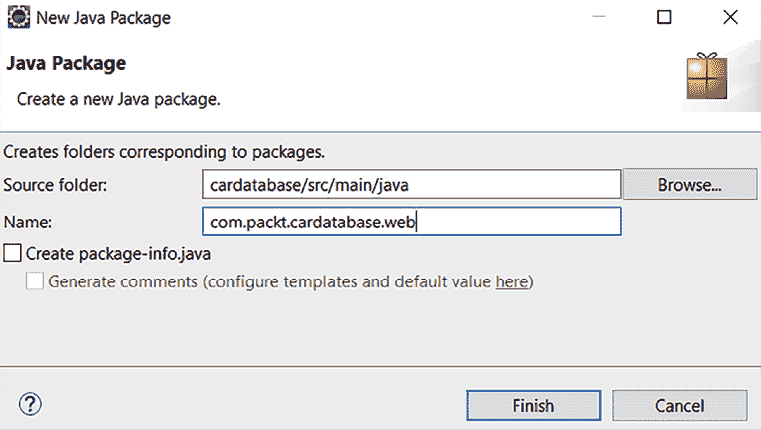

图 4.1：新的 Java 包

1.  接下来，我们将在新的 Web 包中创建一个新的 `controller` 类。在 Eclipse **项目资源管理器**中激活 `com.packt.cardatabase.web` 包。右键单击并从菜单中选择 **新建 | 类**；我们将命名我们的类为 `CarController`：

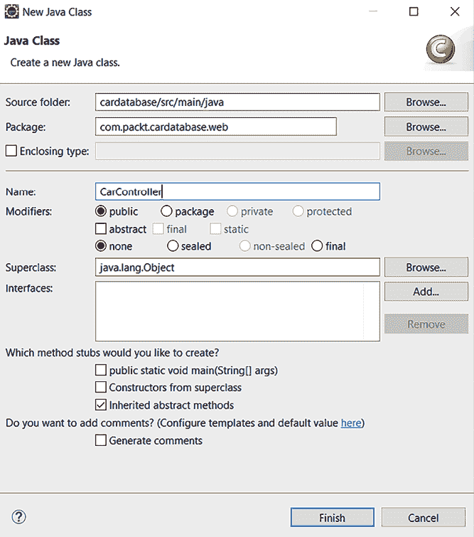

图 4.2：新的 Java 类

1.  现在，你的项目结构应该看起来像以下截图所示：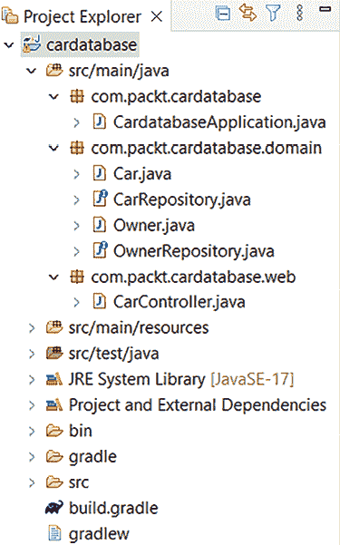

    图 4.3：项目结构

    如果你意外地创建了错误包中的类，你可以在项目资源管理器中拖放文件在包之间。有时，当你进行一些更改时，项目资源管理器视图可能无法正确渲染。刷新项目资源管理器有助于（激活项目资源管理器并按 *F5*）。

1.  在编辑器窗口中打开你的控制器类，并在类定义之前添加 `@RestController` 注解。参考以下源代码。`@RestController` 注解标识了该类将是 RESTful 网络服务的控制器：

    ```java
    package com.packt.cardatabase.web;
    **import** **org.springframework.web.bind.annotation.RestController;**
    **@RestController**
    public class CarController {
    } 
    ```

1.  接下来，我们在控制器类内部添加一个新的方法。该方法使用 `@GetMapping` 注解进行标注，该注解定义了方法映射到的端点。在下面的代码片段中，你可以看到示例源代码。在这个例子中，当用户向 `/cars` 端点发送 `GET` 请求时，`getCars()` 方法将被执行：

    ```java
    package com.packt.cardatabase.web;
    **import** **org.springframework.web.bind.annotation.GetMapping;**
    import org.springframework.web.bind.annotation.RestController;
    **import** **com.packt.cardatabase.domain.Car;**
    @RestController
    public class CarController {
        **@GetMapping("/cars")**
        **public** **Iterable<Car>** **getCars****() {**
    **//Fetch and return cars**
        **}**
    } 
    ```

    `getCars()` 方法返回所有汽车对象，然后由 **Jackson** 库（https://github.com/FasterXML/jackson）自动将它们序列化为 JSON 对象。

    现在，`getCars()`方法仅处理来自`/cars`端点的`GET`请求，因为我们使用了`@GetMapping`注解。还有其他注解用于不同的 HTTP 方法，例如`@GetMapping`、`@PostMapping`、`@DeleteMapping`等等。

1.  要能够从数据库中返回汽车，我们必须将`CarRepository`注入到控制器中。然后，我们可以使用仓库提供的`findAll()`方法来获取所有汽车。由于`@RestController`注解，数据现在在响应中序列化为 JSON 格式。以下源代码显示了控制器代码：

    ```java
    package com.packt.cardatabase.web;
    import org.springframework.web.bind.annotation.GetMapping;
    import org.springframework.web.bind.annotation.RestController;
    import com.packt.cardatabase.domain.Car;
    **import** **com.packt.cardatabase.domain.CarRepository;**
    @RestController
    public class CarController {
        **private** **final** **CarRepository repository;**
        **public****CarController****(CarRepository repository) {**
            **this****.repository = repository;**
        **}**
        @GetMapping("/cars")
        public Iterable<Car> getCars() {
            **return** **repository.findAll();**
        }
    } 
    ```

1.  现在，我们已准备好运行我们的应用程序并导航到`localhost:8080/cars`。我们可以看到有些不对劲，应用程序似乎陷入了一个无限循环。这是由于我们的汽车和车主表之间的多对一关系。那么，实际情况是怎样的呢？首先，汽车被序列化，它包含一个车主，然后车主被序列化，反过来，车主又包含汽车，然后这些汽车被序列化，以此类推。有几种不同的解决方案可以避免这种情况。一种方法是在`Owner`类的`cars`字段上使用`@JsonIgnore`注解，在序列化过程中忽略`cars`字段。如果您不需要双向映射，也可以通过避免双向映射来解决这个问题。我们还将使用`@JsonIgnoreProperties`注解来忽略由 Hibernate 生成的字段：

    ```java
    // Owner.java
    **import** **com.fasterxml.jackson.annotation.JsonIgnore;**
    **import** **com.fasterxml.jackson.annotation.JsonIgnoreProperties;**
    @Entity
    **@JsonIgnoreProperties({"hibernateLazyInitializer","handler"})**
    public class Owner {
        @Id
        @GeneratedValue(strategy=GenerationType.AUTO)
        private long ownerid;
        private String firstname, lastname;
        public Owner() {}
        public Owner(String firstname, String lastname) {
            super();
            this.firstname = firstname;
            this.lastname = lastname;
        }
        **@JsonIgnore**
        @OneToMany(cascade=CascadeType.ALL, mappedBy="owner")
        private List<Car> cars; 
    ```

1.  现在，当您运行应用程序并导航到`localhost:8080/cars`时，一切应该如预期进行，并且您将以 JSON 格式从数据库中获取所有汽车，如下面的截图所示：

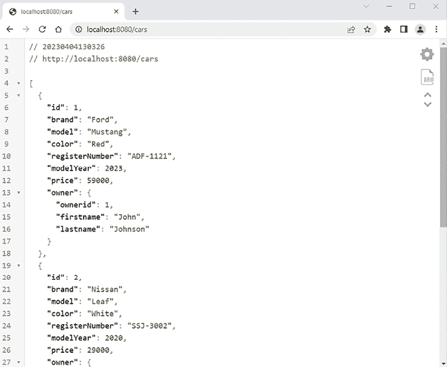

图 4.4：对 http://localhost:8080/cars 的 GET 请求

您的输出可能与截图不同，因为浏览器之间的差异。在这本书中，我们使用的是 Chrome 浏览器和**JSON Viewer**扩展程序，这使得 JSON 输出更加易于阅读。JSON Viewer 可以从 Chrome Web Store 免费下载。

我们已经编写了我们的第一个 RESTful Web 服务。通过利用 Spring Boot 的能力，我们能够快速实现一个返回我们数据库中所有汽车的服务。然而，这仅仅是 Spring Boot 为创建健壮和高效的 RESTful Web 服务所能提供的功能的一部分，我们将在下一节继续探索其功能。

# 使用 Spring Data REST

**Spring Data REST**（https://spring.io/projects/spring-data-rest）是 Spring Data 项目的一部分。它提供了一种简单快捷的方式来实现使用 Spring 的 RESTful Web 服务。Spring Data REST 提供了**HATEOAS**（**Hypermedia as the Engine of Application State**）支持，这是一种架构原则，允许客户端使用超媒体链接动态地导航 REST API。Spring Data REST 还提供了事件，您可以使用这些事件来自定义 REST API 端点的业务逻辑。

您可以在 Spring Data REST 文档中了解更多关于事件的信息：https://docs.spring.io/spring-data/rest/docs/current/reference/html/#events。

要开始使用 Spring Data REST，您必须将以下依赖项添加到`build.gradle`文件中：

```java
dependencies {
    implementation 'org.springframework.boot:spring-boot-starter-web'
    implementation 'org.springframework.boot:spring-boot-starter-data-jpa'
    **implementation** **'org.springframework.boot:spring-boot-starter-data-rest'**
    developmentOnly 'org.springframework.boot:spring-boot-devtools'
    runtimeOnly 'org.mariadb.jdbc:mariadb-java-client'
    testImplementation 'org.springframework.boot:spring-boot-starter-test'
} 
```

在修改了`build.gradle`文件后，从 Eclipse 中刷新您的 Gradle 项目。在 Eclipse 的项目资源管理器中选择项目，然后右键单击以打开上下文菜单。然后，选择**Gradle | 刷新 Gradle 项目**。

默认情况下，Spring Data REST 从应用程序中查找所有公共仓库，并自动为您的实体创建 RESTful Web 服务。在我们的例子中，我们有两个仓库：`CarRepository`和`OwnerRepository`；因此，Spring Data REST 自动为这些仓库创建 RESTful Web 服务。

您可以在`application.properties`文件中定义服务的端点，如下所示。您可能需要重新启动应用程序以使更改生效：

```java
spring.data.rest.basePath=/api 
```

现在，您可以从`localhost:8080/api`端点访问 RESTful Web 服务。通过调用服务的根端点，它返回可用的资源。Spring Data REST 以**超文本应用语言**（**HAL**）格式返回 JSON 数据。HAL 格式提供了一套在 JSON 中表示超链接的约定，这使得您的 RESTful Web 服务对前端开发者来说更容易使用：

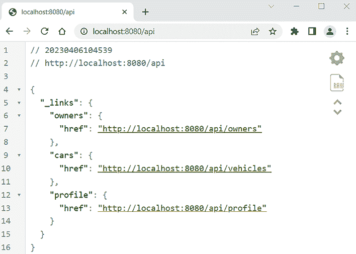

图 4.5：Spring Boot Data REST 资源

我们可以看到有链接到汽车和所有者实体服务。Spring Data REST 服务路径名称是从实体类名称派生出来的。名称将被复数化并转换为小写。例如，实体`Car`服务路径名称将变为`cars`。`profile`链接是由 Spring Data REST 生成的，并包含特定于应用程序的元数据。如果您想使用不同的路径命名，您可以在您的仓库类中使用`@RepositoryRestResource`注解，如下一个示例所示：

```java
package com.packt.cardatabase.domain;
import org.springframework.data.repository.CrudRepository;
import org.springframework.data.rest.core.annotation.RepositoryRestResource;
**@RepositoryRestResource(path="vehicles")**
public interface CarRepository extends CrudRepository<Car, Long> {
} 
```

现在，如果您调用端点`localhost:8080/api`，您可以看到端点已从`/cars`更改为`/vehicles`。

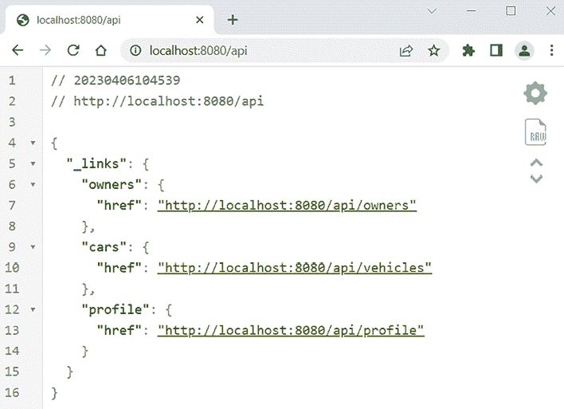

图 4.6：Spring Boot Data REST 资源

您可以删除不同的命名，我们将继续使用默认的端点名称，`/cars`。

现在，我们将开始更仔细地检查不同的服务。有多种工具可用于测试和消费 RESTful Web 服务。在这本书中，我们使用的是**Postman**（https://www.postman.com/downloads/）桌面应用程序，但您可以使用您熟悉的工具，例如**cURL**。Postman 可以作为桌面应用程序或浏览器插件获取。cURL 也可以通过使用 Windows Ubuntu Bash（**Windows 子系统（WSL**））在 Windows 上获得。

如果您使用`GET`方法（注意：您可以使用网络浏览器进行`GET`请求）向`/cars`端点（`http://localhost:8080/api/cars`）发出请求，您将获得所有汽车列表，如下面的截图所示：

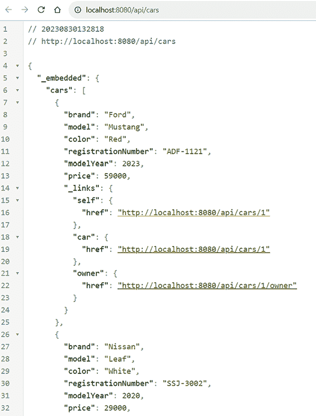

图 4.7：获取汽车

在 JSON 响应中，你可以看到有一个汽车数组，并且每辆汽车都包含特定的汽车数据。所有的汽车都有`_links`属性，这是一个链接集合，通过这些链接，你可以访问汽车本身或获取汽车的所有者。要访问特定的汽车，路径将是`http://localhost:8080/api/cars/{id}`。

向`http://localhost:8080/api/cars/3/owner`发出的`GET`请求返回了 ID 为 3 的汽车的所有者。响应现在包含所有者数据、所有者的链接以及所有者其他汽车的链接。

Spring Data REST 服务提供了所有 CRUD 操作。以下表格显示了你可以用于不同 CRUD 操作的不同 HTTP 方法：

| **HTTP 方法** | **CRUD** |
| --- | --- |
| `GET` | 读取 |
| `POST` | 创建 |
| `PUT/PATCH` | 更新 |
| `DELETE` | 删除 |

表 4.1：Spring Data REST 操作

接下来，我们将探讨如何通过我们的 RESTful 网络服务从数据库中删除一辆汽车。在删除操作中，你必须使用`DELETE`方法和将要删除的汽车的链接（`http://localhost:8080/api/cars/{id}`）。

以下截图显示了如何使用 Postman 桌面应用程序通过`id`为 3 删除一辆汽车。在 Postman 中，你必须从下拉列表中选择正确的 HTTP 方法，输入请求 URL，然后点击**Send**按钮：

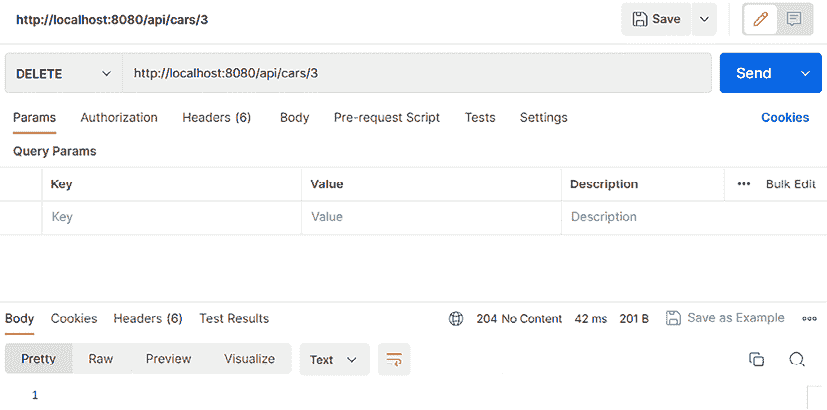

图 4.8：删除汽车的 DELETE 请求

如果一切顺利，你将在 Postman 中看到响应状态**200 OK**。在成功的`DELETE`请求之后，如果你向`http://localhost:8080/api/cars/`端点发出`GET`请求，你将看到数据库中现在还剩下两辆汽车。如果你在`DELETE`响应中得到了**404 Not Found**状态，请检查你使用的是数据库中存在的汽车 ID。

当我们想要将一辆新车添加到数据库中时，我们必须使用`POST`方法，请求 URL 是`http://localhost:8080/api/cars`。头部必须包含带有值`application/json`的`Content-Type`字段，新的汽车对象将以 JSON 格式嵌入到请求体中。

这里有一个汽车示例：

```java
{
  "brand":"Toyota",
  "model":"Corolla",
  "color":"silver",
  "registrationNumber":"BBA-3122",
  "modelYear":2023,
  "price":38000
} 
```

如果你点击**Body**标签并从 Postman 中选择**raw**，你可以在**Body**标签下输入一个新的汽车 JSON 字符串。同时，从下拉列表中选择 JSON，如下面的截图所示：

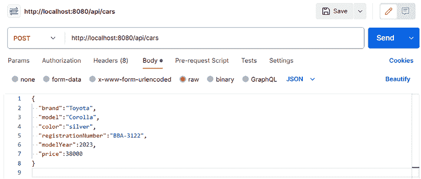

图 4.9：添加新汽车的 POST 请求

你还必须在 Postman 中点击**Headers**标签来设置一个头部，如下面的截图所示。Postman 根据你的请求选择自动添加一些头部。请确保`Content-Type`头部在列表中，并且值是正确的（`application/json`）。如果它不存在，你应该手动添加它。自动添加的头部默认可能被隐藏，但你可以通过点击**hidden**按钮来查看这些头部。最后，你可以按下**Send**按钮：

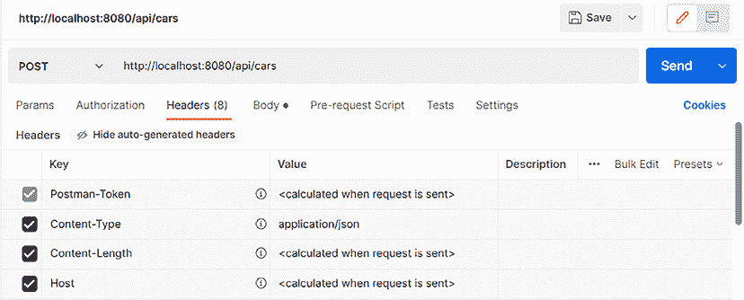

图 4.10：POST 请求头部

如果一切顺利，响应将发送一个新创建的`car`对象，并且响应状态将是**201 已创建**。现在，如果你再次向`http://localhost:8080/api/cars`路径发出`GET`请求，你将看到新汽车存在于数据库中。

要更新实体，我们可以使用`PATCH`方法和我们想要更新的汽车的链接（`http://localhost:8080/api/cars/{id}`）。头部必须包含带有值`application/json`的`Content-Type`字段，并且编辑后的`car`对象将包含在请求体中。

如果你使用`PATCH`，你必须只发送更新的字段。如果你使用`PUT`，你必须包含请求体中的所有字段。

让我们编辑在前一个示例中创建的汽车，将其颜色改为白色。我们使用`PATCH`，因此有效负载中只包含`color`属性：

```java
{
  "color": "white"
} 
```

Postman 请求如下截图所示（注意：我们设置了与`POST`示例相同的头部，并在 URL 中使用汽车`id`）：

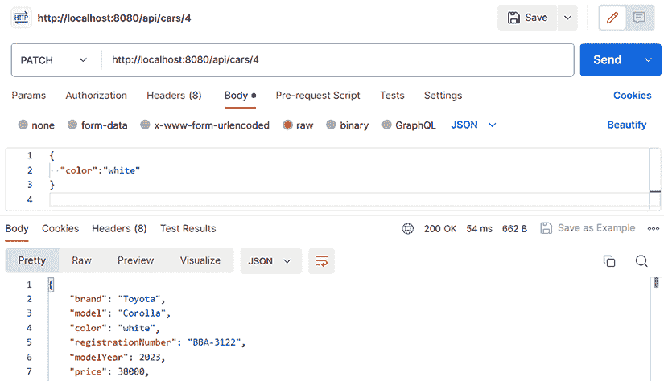

图 4.11：更新现有汽车的 PATCH 请求

如果更新成功，响应状态是**200 OK**。现在，如果你使用`GET`请求获取更新的汽车，你会看到颜色已经更新。

接下来，我们将为新创建的汽车添加一个车主。我们可以使用`PUT`方法和`http://localhost:8080/api/cars/{id}/owner`路径。在这个例子中，新汽车的 ID 是`4`，所以链接是`http://localhost:8080/api/cars/4/owner`。现在请求体的内容链接到一个车主，例如，`http://localhost:8080/api/owners/1`。

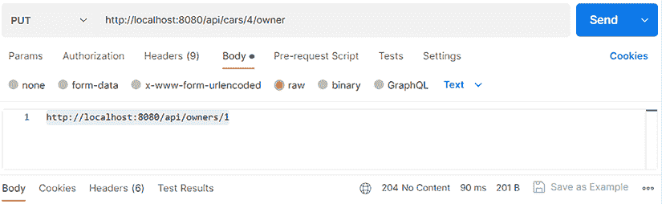

图 4.12：更新所有者的 PUT 请求

在这种情况下，头部的`Content-Type`值应该是`text/uri-list`。如果你不能修改自动添加的头部，你可以通过取消选中它来禁用它。然后，添加一个新的，如下一图所示，并按**发送**按钮：

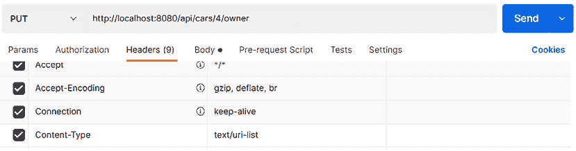

图 4.13：更新现有汽车的 PATCH 请求头部

最后，你可以为汽车发出`GET`请求车主，现在你应该看到车主已经与汽车链接。

在上一章中，我们为我们的存储库创建了查询。这些查询也可以包含在我们的服务中。要包含查询，你必须将`@RepositoryRestResource`注解添加到存储库类中。查询参数用`@Param`注解。以下源代码显示了带有这些注解的`CarRepository`：

```java
package com.packt.cardatabase.domain;
import java.util.List;
import org.springframework.data.repository.CrudRepository;
import org.springframework.data.repository.query.Param;
import org.springframework.data.rest.core.annotation RepositoryRestResource;
**@RepositoryRestResource**
public interface CarRepository extends CrudRepository<Car, Long> {
    // Fetch cars by brand
    **List<Car>** **findByBrand****(****@Param("brand")** **String brand);**
    // Fetch cars by color
    **List<Car>** **findByColor****(****@Param("color")** **String color);**
} 
```

现在，当你向`http://localhost:8080/api/cars`路径发出`GET`请求时，你可以看到有一个新的端点叫做`/search`。调用`http://localhost:8080/api/cars/search`路径将返回以下响应：

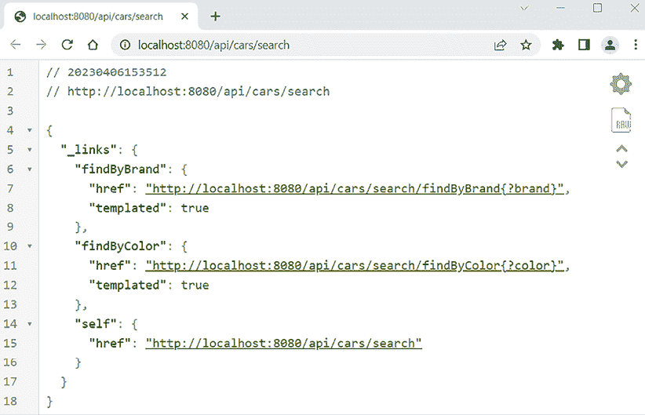

图 4.14：REST 查询

从响应中，你可以看到现在我们的服务中都有了这两个查询。以下 URL 演示了如何通过品牌获取汽车：`http://localhost:8080/api/cars/search/findByBrand?brand=Ford`。输出将只包含品牌为 Ford 的汽车。

在本章的开头，我们介绍了 REST 原则，我们可以看到我们的 RESTful API 满足了 REST 规范的一些方面。它是无状态的，来自不同客户端的请求看起来相同（统一的接口）。响应包含可以用来在相关资源之间导航的链接。我们的 RESTful API 提供了一个反映数据模型和资源之间关系的 URI 结构。

我们现在已经为我们的后端创建了 RESTful API，我们将在稍后用我们的 React 前端来消费它。

# 记录 RESTful API

一个 RESTful API 应该得到适当的文档，以便使用它的开发者能够理解其功能和行为。文档应包括可用的端点、接受的数据格式以及如何与 API 交互。

在这本书中，我们将使用 Spring Boot 的 **OpenAPI 3** 库（https://springdoc.org）来自动生成文档。**OpenAPI 规范**（以前称为 Swagger 规范）是 RESTful API 的 API 描述格式。还有其他替代方案，例如 RAML（https://raml.org/），也可以使用。你还可以使用一些其他文档工具来记录你的 REST API，这些工具提供了灵活性，但需要更多手动工作。使用 OpenAPI 库可以自动化这项工作，让你能专注于开发。

以下步骤演示了如何为你的 RESTful API 生成文档：

1.  首先，我们必须将 OpenAPI 库添加到我们的 Spring Boot 应用程序中。将以下依赖项添加到你的 `build.gradle` 文件中：

    ```java
    implementation group: 'org.springdoc', name: 'springdoc-openapi-starter-webmvc-ui', version: '2.0.2' 
    ```

1.  接下来，我们为我们的文档创建一个配置类。在你的应用程序的 `com.packt.cardatabase` 包中创建一个名为 `OpenApiConfig` 的新类。以下是为配置类编写的代码，我们可以配置，例如，REST API 的标题、描述和版本。我们可以使用 `info()` 方法来定义这些值：

    ```java
    package com.packt.cardatabase;
    import org.springframework.context.annotation.Bean;
    import org.springframework.context.annotation.Configuration;
    import io.swagger.v3.oas.models.OpenAPI;
    import io.swagger.v3.oas.models.info.Info;
    @Configuration
    public class OpenApiConfig {
        @Bean
        public OpenAPI carDatabaseOpenAPI() {
            return new OpenAPI()
                .info(new Info()
                .title("Car REST API")
                .description("My car stock")
                .version("1.0"));
        }
    } 
    ```

1.  在 `application.properties` 文件中，我们可以定义我们文档的路径。我们还可以启用 **Swagger UI**，这是一个用于可视化使用 OpenAPI 规范（https://swagger.io/tools/swagger-ui/）编写的 RESTful API 的用户友好工具。将以下设置添加到你的 `application.properties` 文件中：

    ```java
    springdoc.api-docs.path=/api-docs
    springdoc.swagger-ui.path=/swagger-ui.html
    springdoc.swagger-ui.enabled=true 
    ```

1.  现在，我们已经准备好运行我们的项目。当你的应用程序正在运行时，导航到 `http://localhost:8080/swagger-ui.html`，你将看到 Swagger UI 中的文档，如下面的截图所示：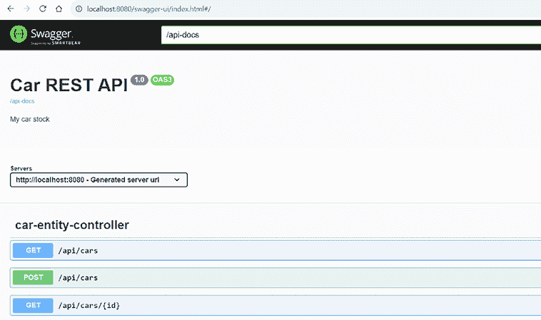

    图 4.15：汽车 RESTful API 文档

    你可以看到你 RESTful API 中所有可用的端点。如果你打开任何一个端点，甚至可以通过按下**尝试它**按钮来尝试它们。文档也以 JSON 格式在`http://localhost:8080/api-docs`提供。

现在你已经为你的 RESTful API 提供了文档，开发者们使用起来就更加容易了。

在下一章中，我们将保护我们的 RESTful API，这将中断 Swagger UI 的访问。你可以通过修改你的安全配置（允许`"/api-docs/**"`和`"/swagger-ui/**"`路径）来再次允许访问。你也可以使用 Spring Profiles，但这本书的范围之外。

# 摘要

在本章中，我们使用 Spring Boot 创建了一个 RESTful 网络服务。首先，我们创建了一个控制器和一个返回所有汽车 JSON 格式的函数。接下来，我们使用了 Spring Data REST 来获取一个具有所有 CRUD 功能的完整网络服务。我们涵盖了使用我们创建的服务 CRUD 功能所需的不同类型的请求。我们还将在 RESTful 网络服务中包含我们的查询。最后，我们学习了如何使用 OpenAPI 3 正确地记录我们的 API。

我们将在本书的后面部分使用这个 RESTful 网络服务与我们的前端，现在你也可以轻松地为你的需求实现 REST API。

在下一章中，我们将使用 Spring Security 来保护我们的后端。我们将学习如何通过实现身份验证来保护我们的数据。然后，只有经过身份验证的用户才能访问我们创建的 RESTful API 的资源。

# 问题

1.  什么是 REST？

1.  你如何使用 Spring Boot 创建一个 RESTful 网络服务？

1.  你如何使用我们的 RESTful 网络服务获取项目？

1.  你如何使用我们的 RESTful 网络服务删除项目？

1.  你如何使用我们的 RESTful 网络服务添加项目？

1.  你如何使用我们的 RESTful 网络服务更新项目？

1.  你如何使用我们的 RESTful 网络服务使用查询？

1.  OpenAPI 规范是什么？

1.  Swagger UI 是什么？

# 进一步阅读

Packt 提供了其他资源，用于学习 Spring Boot RESTful 网络服务：

+   *Praveenkumar Bouna 的 Postman 教程：API 测试入门[视频]* ([`www.packtpub.com/product/postman-tutorial-getting-started-with-api-testing-video/9781803243351`](https://www.packtpub.com/product/postman-tutorial-getting-started-with-api-testing-video/9781803243351))

+   *Harihara Subramanian J 和 Pethuru Raj 的《动手实践 RESTful API 设计模式和最佳实践》* ([`www.packtpub.com/product/hands-on-restful-api-design-patterns-and-best-practices/9781788992664`](https://www.packtpub.com/product/hands-on-restful-api-design-patterns-and-best-practices/9781788992664))

# 在 Discord 上了解更多

要加入本书的 Discord 社区——在那里你可以分享反馈、向作者提问，并了解新版本——请扫描下面的二维码：

[`packt.link/FullStackSpringBootReact4e`](https://packt.link/FullStackSpringBootReact4e)


