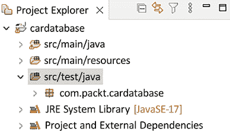

# 6

# 测试您的后端

本章解释了如何测试您的 Spring Boot 后端。应用程序的后端负责处理业务逻辑和数据存储。适当的后端测试确保应用程序按预期工作，安全，并且更容易维护。我们将创建一些与我们的后端相关的单元和集成测试，以我们之前创建的数据库应用程序作为起点。

在本章中，我们将涵盖以下主题：

+   在 Spring Boot 中进行测试

+   创建测试用例

+   测试驱动开发

# 技术要求

我们在前面章节中创建的 Spring Boot 应用程序是必需的。

以下 GitHub 链接也将是必需的：[`github.com/PacktPublishing/Full-Stack-Development-with-Spring-Boot-3-and-React-Fourth-Edition/tree/main/Chapter06`](https://github.com/PacktPublishing/Full-Stack-Development-with-Spring-Boot-3-and-React-Fourth-Edition/tree/main/Chapter06)。

# 在 Spring Boot 中进行测试

当我们创建项目时，**Spring Initializr** 会自动将 Spring Boot 测试启动器包添加到 `build.gradle` 文件中。测试启动器依赖项可以在以下代码片段中看到：

```java
testImplementation 'org.springframework.boot:spring-boot-starter-test' 
```

Spring Boot 测试启动器提供了许多方便的库用于测试，例如 **JUnit**、**Mockito** 和 **AssertJ**。Mockito 是一个常与测试框架如 JUnit 一起使用的模拟框架。AssertJ 是一个流行的库，用于在 Java 测试中编写断言。在本书中，我们将使用 **JUnit 5**。**JUnit Jupiter** 模块是 JUnit 5 的一部分，提供了更灵活的测试的注解。

如果您查看项目结构，您会看到它已经为测试类创建了自己的包：

­

图 6.1：测试类

默认情况下，Spring Boot 使用内存数据库进行测试。在本章中，我们使用 **MariaDB**，但如果我们向 `build.gradle` 文件中添加以下依赖项，我们也可以使用 H2 进行测试：

```java
testRuntimeOnly 'com.h2database:h2' 
```

这指定了 H2 数据库将仅用于运行测试；否则，应用程序将使用 MariaDB 数据库。

在您更新了 `build.gradle` 文件后，请记住在 Eclipse 中刷新您的 Gradle 项目。

现在，我们可以开始为我们的应用程序创建测试用例。

# 创建测试用例

软件测试有很多不同类型，每种类型都有自己的特定目标。一些最重要的测试类型包括：

+   **单元测试**：单元测试关注软件的最小组件。例如，这可能是一个函数，单元测试将确保它在隔离状态下正确工作。**模拟**在单元测试中经常被用来替换正在被测试的单元的依赖项。

+   **集成测试**：集成测试关注各个组件之间的交互，确保各个组件按预期协同工作。

+   **功能测试**：功能测试侧重于在功能规范中定义的业务场景。测试用例旨在验证软件是否符合指定的要求。

+   **回归测试**：回归测试旨在验证新代码或代码更新不会破坏现有功能。

+   **可用性测试**：可用性测试验证软件是否易于用户使用、直观且易于从最终用户的角度使用。可用性测试更侧重于前端和用户体验。

对于单元和集成测试，我们使用**JUnit**，这是一个流行的基于 Java 的单元测试库。Spring Boot 内置了对 JUnit 的支持，这使得编写应用程序的测试变得容易。

以下源代码展示了 Spring Boot 测试类的示例框架。`@SpringBootTest`注解指定该类是一个常规测试类，用于运行基于 Spring Boot 的测试。方法前的`@Test`注解指定 JUnit 该方法可以作为测试用例运行：

```java
**@SpringBootTest**
public class MyTestsClass {
    **@Test**
    public void testMethod() {
        // Test case code
    }
} 
```

单元测试中的**断言**是用于验证代码单元的实际输出是否与预期输出匹配的语句。在我们的案例中，断言是通过`spring-boot-starter-test`工件自动包含的**AssertJ**库实现的。AssertJ 库提供了一个`assertThat()`方法，您可以使用它来编写断言。您将对象或值传递给该方法，允许您比较值与实际断言。AssertJ 库包含多种针对不同数据类型的断言。下一个示例演示了一些示例断言：

```java
// String assertion
assertThat("Learn Spring Boot").startsWith("Learn");
// Object assertion
assertThat(myObject).isNotNull();
// Number assertion
assertThat(myNumberVariable).isEqualTo(3);
// Boolean assertion
assertThat(myBooleanVariable).isTrue(); 
```

您可以在 AssertJ 文档中找到所有不同的断言：[`assertj.github.io/doc`](https://assertj.github.io/doc)。

现在，我们将创建我们的初始单元测试用例，该测试用例检查我们的控制器实例是否正确实例化且不是`null`。按照以下步骤进行：

1.  打开 Spring Initializr 启动项目为您的应用程序创建的`CardatabaseApplicationTests`测试类。这里有一个名为`contextLoads`的测试方法，我们将在这里添加测试。编写以下测试，该测试检查控制器实例是否已成功创建和注入。我们使用 AssertJ 断言来测试注入的控制器实例不是`null`：

    ```java
    package com.packt.cardatabase;
    import static org.assertj.core.api.Assertions.assertThat;
    import org.junit.jupiter.api.Test;
    import org.springframework.beans.factory.annotation.Autowired;
    import org.springframework.boot.test.context.SpringBootTest;
    import com.packt.cardatabase.web.CarController;
    @SpringBootTest
    class CardatabaseApplicationTests {
        @Autowired
        private CarController controller;
        @Test
        void contextLoads() {
            assertThat(controller).isNotNull();
        }
    } 
    ```

    我们在这里使用**字段注入**，这对于测试类来说非常适合，因为您永远不会直接实例化测试类。您可以在 Spring 文档中了解更多关于测试固定依赖注入的信息：[`docs.spring.io/spring-framework/reference/testing/testcontext-framework/fixture-di.html`](https://docs.spring.io/spring-framework/reference/testing/testcontext-framework/fixture-di.html)。

1.  要在 Eclipse 中运行测试，请在**项目资源管理器**中激活测试类，然后右键单击。从菜单中选择**运行方式 | JUnit 测试**。现在，您应该在 Eclipse 工作台的下部看到**JUnit**标签页。测试结果将显示在此标签页中，测试用例已通过，如下面的截图所示：


图 6.2：JUnit 测试运行

1.  您可以使用`@DisplayName`注解为您的测试用例提供一个更具描述性的名称。在`@DisplayName`注解中定义的名称将在 JUnit 测试运行器中显示。以下代码片段展示了如何实现：

    ```java
    @Test
    **@DisplayName("First example test case")**
    void contextLoads() {
        assertThat(controller).isNotNull();
    } 
    ```

现在，我们将为我们的所有者存储库创建集成测试，以测试**创建**、**读取**、**更新**和**删除**（**CRUD**）操作。此测试验证我们的存储库是否正确与数据库交互。想法是模拟数据库交互并验证您的存储库方法是否按预期行为：

1.  在根测试包中创建一个名为`OwnerRepositoryTest`的新类。如果测试专注于**Jakarta Persistence API**（**JPA**）组件，则可以使用`@DataJpaTest`注解代替`@SpringBootTest`注解。使用此注解时，H2 数据库和 Spring Data 将自动配置用于测试。SQL 日志记录也被打开。以下代码片段展示了如何实现：

    ```java
    package com.packt.cardatabase;
    import static org.assertj.core.api.Assertions.assertThat;
    import org.junit.jupiter.api.Test;
    import org.springframework.beans.factory.annotation.Autowired;
    import org.springframework.boot.test.autoconfigure.orm.jpa.DataJpaTest;
    import com.packt.cardatabase.domain.Owner;
    import com.packt.cardatabase.domain.OwnerRepository;
    @DataJpaTest
    class OwnerRepositoryTest {
        @Autowired
        private OwnerRepository repository;
    } 
    ```

    在此示例中，我们使用根包为所有测试类命名，并逻辑地命名我们的类。或者，您可以为您的测试类创建与我们的应用程序类类似的包结构。

1.  我们将添加第一个测试用例以测试将新所有者添加到数据库中。将以下查询添加到您的`OwnerRepository.java`文件中。我们将在测试用例中使用此查询：

    ```java
    Optional<Owner> findByFirstname(String firstName); 
    ```

1.  使用`save`方法创建一个新的`Owner`对象并将其保存到数据库中。然后，我们检查是否可以找到所有者。将以下测试用例方法代码添加到您的`OwnerRepositoryTest`类中：

    ```java
    @Test
    void saveOwner() {
        repository.save(new Owner("Lucy", "Smith"));
        assertThat(
            repository.findByFirstname("Lucy").isPresent()
        ).isTrue();
    } 
    ```

1.  第二个测试用例将测试从数据库中删除所有者。创建一个新的`Owner`对象并将其保存到数据库中。然后，从数据库中删除所有所有者，最后`count()`方法应返回零。以下源代码显示了测试用例方法。将以下方法代码添加到您的`OwnerRepositoryTest`类中：

    ```java
    @Test
    void deleteOwners() {
        repository.save(new Owner("Lisa", "Morrison"));
        repository.deleteAll();
        assertThat(repository.count()).isEqualTo(0);
    } 
    ```

1.  运行测试用例并检查 Eclipse 的**JUnit**标签页，以确定测试是否通过。以下截图显示测试确实通过了：


图 6.3：存储库测试用例

接下来，我们将演示如何测试您的 RESTful Web 服务 JWT 身份验证功能。我们将创建一个集成测试，该测试向登录端点发送实际的 HTTP 请求并验证响应：

1.  在根测试包中创建一个名为`CarRestTest`的新类。为了测试控制器或任何公开的端点，我们可以使用一个`MockMvc`对象。通过使用`MockMvc`对象，服务器不会启动，但测试是在 Spring 处理 HTTP 请求的层中进行的，因此它模拟了真实情况。`MockMvc`提供了`perform`方法来发送这些请求。为了测试身份验证，我们必须在请求体中添加凭据。我们使用`andDo()`方法将请求和响应的详细信息打印到控制台。最后，我们使用`andExpect()`方法检查响应状态是否为`Ok`。代码在下面的代码片段中展示：

    ```java
    package com.packt.cardatabase;
    import static org.springframework.test.web.servlet.
    request.MockMvcRequestBuilders.post;
    import static org.springframework.test.web.
    servlet.result.MockMvcResultHandlers.print;
    import static org.springframework.test.web.servlet.result.MockMvcResultMatchers.status;
    import org.junit.jupiter.api.Test;
    import org.springframework.beans.factory.annotation.Autowired;
    import org.springframework.boot.test.autoconfigure.web.servlet.AutoConfigureMockMvc;
    import org.springframework.boot.test.context.SpringBootTest;
    import org.springframework.http.HttpHeaders;
    import org.springframework.test.web.servlet.MockMvc;
    @SpringBootTest
    @AutoConfigureMockMvc
    class CarRestTest {
        @Autowired
        private MockMvc mockMvc;
        @Test
        public void testAuthentication() throws Exception {
        // Testing authentication with correct credentials
            this.mockMvc
                .perform(post("/login")
                .content("{\"username\":\"admin\",\"password\""
                         +":\"admin\"}")
                .header(HttpHeaders.CONTENT_TYPE,"application/json"))
                .andDo(print()).andExpect(status().isOk());
        }
    } 
    ```

1.  现在，当我们运行身份验证测试时，我们会看到测试通过，如下面的截图所确认的：


图 6.4：登录测试

1.  您可以通过从项目资源管理器中选择测试包并运行 JUnit 测试（**运行方式** | **JUnit 测试**）来一次性运行所有测试。在下面的图片中，您可以查看所有测试用例都通过的结果：


图 6.5：运行测试

## 使用 Gradle 进行测试

当您使用 Gradle 构建项目时，所有测试都会自动运行。我们将在本书的后面更详细地介绍构建和部署。在本节中，我们只介绍一些基础知识：

1.  您可以使用 Eclipse 运行不同的预定义 Gradle 任务。打开**窗口 | 显示视图 | 其他…**菜单。这会打开**显示视图**窗口，在那里您应该选择**Gradle 任务**：


图 6.6：Gradle 任务

1.  您应该看到 Gradle 任务列表，如下面的图片所示。打开`build`文件夹，双击**build**任务来运行它：

    图 6.7：构建任务

    Gradle 构建任务在您的项目中创建一个`build`文件夹，Spring Boot 项目在这里构建。构建过程会运行项目中的所有测试。如果任何测试失败，构建过程也会失败。构建过程会创建一个测试摘要报告（一个`index.html`文件），您可以在`build\reports\tests\test`文件夹中找到它。如果您的任何测试失败，您可以从摘要报告中找到原因。在下面的图片中，您可以看到一个测试摘要报告的示例：

    

    图 6.8：测试摘要

1.  构建任务在`\build\libs`文件夹中创建一个可执行的`jar`文件。现在，您可以在`\build\libs`文件夹中使用以下命令运行构建的 Spring Boot 应用程序（您应该已经安装了 JDK）：

    ```java
    java -jar .\cardatabase-0.0.1-SNAPSHOT.jar 
    ```

现在，您可以为您 Spring Boot 应用程序编写单元和集成测试。您也已经学会了如何使用 Eclipse IDE 运行测试。

# 测试驱动开发

**测试驱动开发**（**TDD**）是一种软件开发实践，其中在编写实际代码之前先编写测试。其理念是确保您的代码满足设定的标准或要求。让我们看看 TDD 在实际中是如何工作的一个例子。

我们的目标是实现一个服务类，用于管理我们应用程序中的消息。你可以在下面看到测试驱动开发（TDD）的常见步骤：

以下代码并不完全功能。它只是为你更好地了解测试驱动开发（TDD）过程的一个示例。

1.  首先要实现的功能是添加新消息的服务。因此，在测试驱动开发（TDD）中，我们将为向消息列表添加新消息创建一个测试用例。在测试代码中，我们首先创建消息服务类的实例。然后，我们创建一个我们想要添加到列表中的测试消息。我们调用`messageService`实例的`addMsg`方法，并将`msg`作为参数传递。此方法负责将消息添加到列表中。最后，断言检查添加到列表中的消息是否与预期的消息`"Hello world"`匹配：

    ```java
    import org.junit.jupiter.api.Test;
    import org.springframework.boot.test.context.SpringBootTest;
    import static org.junit.jupiter.api.Assertions.assertEquals;
    @SpringBootTest
    public class MessageServiceTest {
        @Test
        public void testAddMessage() {
            MessageService messageService = new MessageService();
            String msg = "Hello world";
            Message newMsg = messageService.addMsg(msg);
            assertEquals(msg, newMsg.getMessage());
        }
    } 
    ```

1.  现在，我们可以运行测试。它应该失败，因为我们还没有实现我们的服务。

1.  接下来，我们将实现`MessageService`，它应该包含我们在测试用例中测试的`addMsg()`函数：

    ```java
    @Service
    public class MessageService {
        private List<Message> messages = new ArrayList<>();
        public Message addMsg(String msg) {
            Message newMsg = new Message(msg);
            messages.add(newMSg);
            return newMsg;
        }
    } 
    ```

1.  现在，如果你再次运行测试，如果代码按预期工作，它应该通过。

1.  如果测试未通过，你应该重构你的代码，直到它通过。

1.  为每个新功能重复这些步骤。

测试驱动开发是一个迭代过程，有助于确保你的代码能够正常工作，并且新功能不会破坏软件的其他部分。这也被称为**回归测试**。通过在实现功能之前编写测试，我们可以在开发阶段早期捕捉到错误。开发者应该在实际开发之前理解功能需求和预期结果。

到目前为止，我们已经涵盖了 Spring Boot 应用程序测试的基础知识，并且你已经获得了实施更多测试用例所需的知识。

# 摘要

在本章中，我们专注于测试 Spring Boot 后端。我们使用了 JUnit 进行测试，并实现了针对 JPA 和 RESTful Web 服务认证的测试用例。我们为我们的所有者存储库创建了一个测试用例，以验证存储库方法是否按预期行为。我们还通过使用我们的 RESTful API 测试了认证过程。请记住，测试是整个开发生命周期中的一个持续过程。当你的应用程序发展时，你应该更新和添加测试用例以覆盖新功能和变更。测试驱动开发是实现这一目标的一种方法。

在下一章中，我们将设置与前端开发相关的环境和工具。

# 问题

1.  如何使用 Spring Boot 创建单元测试？

1.  单元测试和集成测试之间的区别是什么？

1.  如何运行和检查单元测试的结果？

1.  什么是测试驱动开发（TDD）？

# 进一步阅读

有许多其他优秀的资源可以帮助你学习关于 Spring Security 和测试的知识。这里列出了一些：

+   *《Java 开发者的 JUnit 和 Mockito 单元测试》*，作者 Matthew Speake ([`www.packtpub.com/product/junit-and-mockito-unit-testing-for-java-developers-video/9781801078337`](https://www.packtpub.com/product/junit-and-mockito-unit-testing-for-java-developers-video/9781801078337))

+   *《使用 JUnit 5 掌握软件测试》*，作者 Boni García ([`www.packtpub.com/product/mastering-software-testing-with-junit-5/9781787285736`](https://www.packtpub.com/product/mastering-software-testing-with-junit-5/9781787285736))

+   *《赫尔辛基大学的 Java 编程 MOOC：测试简介》*，作者 赫尔辛基大学 ([`java-programming.mooc.fi/part-6/3-introduction-to-testing`](https://java-programming.mooc.fi/part-6/3-introduction-to-testing))

+   *《使用 Spring Boot 和 Mockito 掌握 Java 单元测试》*，作者 In28Minutes Official ([`www.packtpub.com/product/master-java-unit-testing-with-spring-boot-and-mockito-video/9781789346077`](https://www.packtpub.com/product/master-java-unit-testing-with-spring-boot-and-mockito-video/9781789346077))

# 在 Discord 上了解更多

要加入这本书的 Discord 社区——在那里您可以分享反馈、向作者提问，并了解新书发布——请扫描下面的二维码：

[`packt.link/FullStackSpringBootReact4e`](https://packt.link/FullStackSpringBootReact4e)


