# 第七章：设置环境和工具 – 前端

本章描述了开发 React 所需的开发环境和工具，以便您可以开始前端开发。在本章中，我们将使用 Vite 前端工具创建一个简单的入门级 React 应用。

本章我们将涵盖以下主题：

+   安装 Node.js

+   安装 Visual Studio Code

+   创建和运行一个 React 应用

+   调试 React 应用

# 技术要求

下面的 GitHub 链接将是必需的：[`github.com/PacktPublishing/Full-Stack-Development-with-Spring-Boot-3-and-React-Fourth-Edition/tree/main/Chapter07`](https://github.com/PacktPublishing/Full-Stack-Development-with-Spring-Boot-3-and-React-Fourth-Edition/tree/main/Chapter07)。

# 安装 Node.js

**Node.js** 是一个开源的、基于 JavaScript 的服务器端环境。它适用于多个操作系统，如 Windows、macOS 和 Linux，并且是开发 React 应用所必需的。

Node.js 安装包可以在 [`nodejs.org/en/download/`](https://nodejs.org/en/download/) 找到。为您的操作系统下载最新的 **长期支持** (**LTS**) 版本。在本书中，我们使用的是 Windows 10 操作系统，您可以获取适用于它的 Node.js MSI 安装程序，这使得安装变得非常简单。

当您运行安装程序时，您将进入安装向导，您可以使用默认设置进行操作：

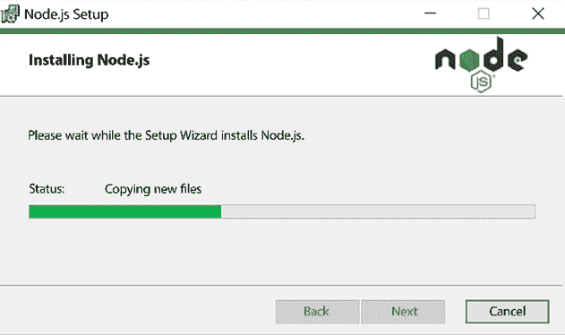

图 7.1：Node.js 安装

安装完成后，我们可以检查一切是否按预期进行。打开 PowerShell 或您正在使用的任何终端，并输入以下命令：

```java
node --version
npm --version 
```

这些命令应显示已安装的 Node.js 和 `npm` 版本：

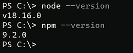

图 7.2：Node.js 和 npm 版本

`npm` 随 Node.js 安装而来，是 JavaScript 的包管理器。在接下来的章节中，当我们为 React 应用安装不同的 Node.js 模块时，我们会大量使用它。

还有一个名为 **Yarn** 的包管理器，您也可以使用，但我们将使用 `npm`，因为它随 Node.js 安装而来。Yarn 有一些优点，例如由于其缓存机制而具有更好的整体性能。

接下来，我们将安装一个代码编辑器。

# 安装 Visual Studio Code

**Visual Studio Code** (**VS Code**) 是一个开源的多语言代码编辑器。它由微软开发。有许多不同的代码编辑器可供选择，例如 Atom 和 Sublime，如果您熟悉其他编辑器，您可以使用其他编辑器。

我们用于后端开发的 Eclipse，针对 Java 开发进行了优化。VS Code 也可以用于 Java 和 Spring Boot 开发，因此如果您愿意，可以使用一个编辑器同时进行后端和前端开发。

VS Code 可用于 Windows、macOS 和 Linux，您可以从 [`code.visualstudio.com/`](https://code.visualstudio.com/) 下载它。Windows 的安装使用 MSI 安装程序完成，并且您可以使用默认设置执行安装。

以下截图显示了 VS Code 的工作台。在左侧是活动栏，您可以使用它在不同视图之间导航。活动栏旁边是一个侧边栏，其中包含不同的视图，例如项目文件资源管理器。编辑器占据了工作台的大部分空间：

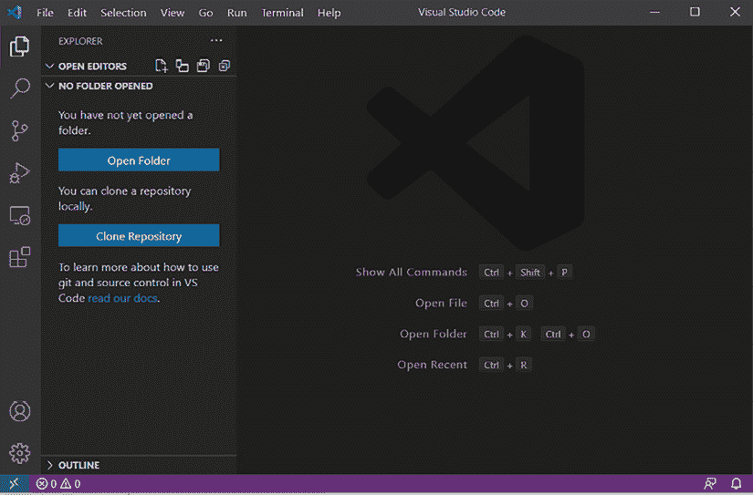

图 7.3：VS Code 工作台

VS Code 提供了一个集成的终端，您可以使用它创建和运行 React 应用程序。终端可以在 **视图 | 终端** 菜单中找到。您可以在后面的章节中创建更多 React 应用程序时使用它。

## VS Code 扩展

可用于不同编程语言和框架的扩展有很多。如果您从活动栏打开 **扩展**，您可以搜索不同的扩展。

一个对 React 开发非常有用的扩展是 **Reactjs 代码片段**，我们推荐您安装。它为 React.js 应用程序提供了多个代码片段，这使得开发过程更快。VS Code 代码片段扩展可以通过节省时间、提高一致性和减少错误来显著提高您的效率。

以下截图显示了 Reactjs 代码片段的安装页面：

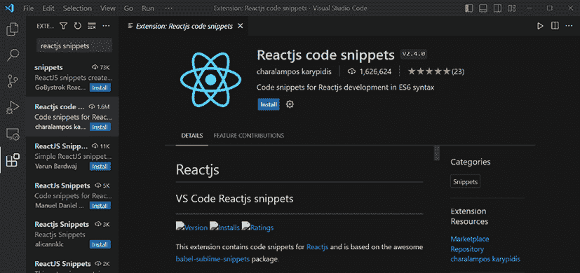

图 7.4：React js 代码片段

**ESLint** 扩展帮助您快速查找拼写错误和语法错误，并使格式化源代码变得更容易：

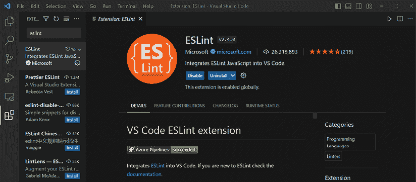

图 7.5：ESLint 扩展

ESLint ([`eslint.org/`](https://eslint.org/)) 是一个开源的 JavaScript 代码检查工具，它帮助您在源代码中查找和修复问题。ESLint 可以在 VS Code 编辑器中直接突出显示错误和警告，帮助您在编写代码时识别和修复问题。错误和警告以红色或黄色下划线显示，并且当您将鼠标悬停在这些行上时，您可以看到有关特定错误或警告的信息。VS Code 还提供了一个 **问题** 面板，显示所有 ESLint 错误和警告。ESLint 是灵活的，并且可以使用 `.eslintrc` 文件进行配置。您可以定义哪些规则被启用以及错误级别。

**Prettier** 是一个代码格式化工具。使用 Prettier 扩展，您可以获得自动代码格式化：

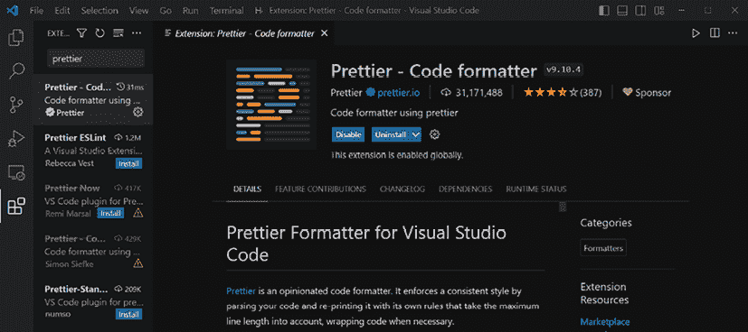

图 7.6：Prettier 扩展

您可以在 VS Code 中设置它，以便在保存后自动格式化代码，方法是转到 **文件 | 首选项** 菜单中的 **设置**，然后搜索 **保存时格式化**。

这些只是您可以为 VS Code 获取的众多优秀扩展的几个示例。我们建议您安装所有这些扩展并亲自测试它们。

在下一节中，我们将创建我们的第一个 React 应用程序，并学习如何运行和修改它。

# 创建和运行 React 应用程序

现在我们已经安装了 Node.js 和我们的代码编辑器，我们准备好创建我们的第一个 React.js 应用了。我们将使用**Vite**前端工具（[`vitejs.dev/`](https://vitejs.dev/)）来完成这项工作。有很好的 React 框架可用，如 Next.js 或 Remix，也可以使用，但 Vite 是学习 React 基础知识的好选择。Vite 提供了一个非常快的开发服务器，您不需要进行任何复杂的配置就可以开始编码。

在过去，**Create React App**（**CRA**）是创建 React 项目的最流行工具，但其使用量已下降，并且官方文档不再推荐使用它。Vite 相对于 CRA 提供了许多优势（例如其更快的开发服务器）。

本书使用 Vite 版本 4.3。如果您使用的是其他版本，请根据 Vite 文档验证命令。此外，检查 Node.js 版本要求，并在包管理器警告您的情况下升级您的 Node.js 安装。

以下是您需要遵循的步骤，以使用 Vite 创建您的第一个 React 项目：

1.  打开 PowerShell 或您正在使用的另一个终端，并将文件夹移动到您想要创建项目的地方。

1.  输入以下`npm`命令，它使用 Vite 的最新版本：

    ```java
    npm create vite@latest 
    ```

    要使用本书中使用的相同的 Vite 主版本，您也可以在命令中指定 Vite 版本：

    ```java
    npm create vite@4.3 
    ```

    命令启动项目创建向导。如果您是第一次创建 Vite 项目，您将收到一条消息，提示您安装`create-vite`包。按*y*继续。

1.  在第一阶段，输入您的项目名称——在本例中为`myapp`：

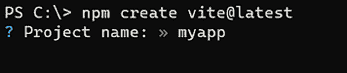

图 7.7：项目名称

1.  然后，您将选择一个**框架**。在这个阶段，选择**React**框架。请注意，Vite 并不局限于 React，也可以用于启动许多不同的前端框架：

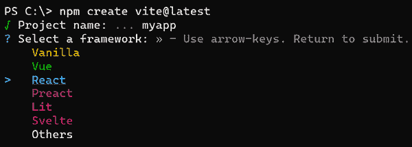

图 7.8：框架选择

1.  在最后一步，您将选择一个**变体**。我们首先将学习使用 JavaScript 的 React 基础知识，然后转向 TypeScript。因此，在这个阶段，我们将选择**JavaScript**：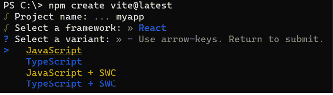图 7.9：项目变体

    **SWC**（**快速 Web 编译器**）是一个用 Rust 编写的快速 JavaScript 和 TypeScript 编译器。它是一个比通常使用的 Babel 更快的替代品。

1.  一旦创建了应用，请进入您的应用文件夹：

    ```java
    cd myapp 
    ```

1.  然后，使用以下命令安装依赖项：

    ```java
    npm install 
    ```

1.  最后，使用以下命令运行您的应用，该命令以开发模式启动应用：

    ```java
    npm run dev 
    ```

    现在，您应该在终端中看到以下消息：

    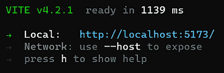

    图 7.10：运行您的项目

1.  打开您的浏览器，导航到终端中显示的**Local:**文本后面的 URL（在示例中为`http://localhost:5173/`，但您的可能不同）：

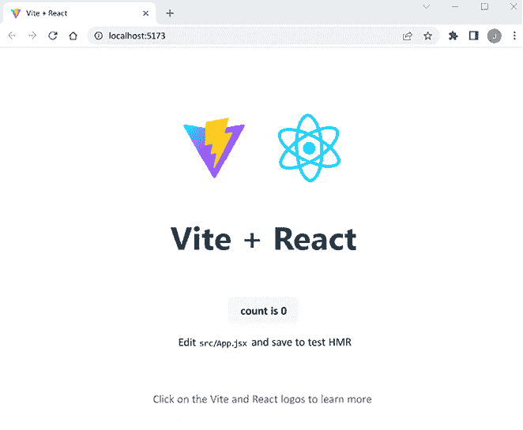

图 7.11：React 应用

1.  您可以通过在终端中按*q*来停止开发服务器。

要为生产环境构建您应用的压缩版本，您可以使用`npm run build`命令，该命令将在构建文件夹中构建您的应用。我们将在第十七章 *部署您的应用* 中更详细地讨论部署。

## 修改 React 应用

现在，我们将学习如何使用 Vite 创建的 React 应用进行修改。我们将使用之前安装的 VS Code：

1.  使用 VS Code 通过选择 **文件 | 打开文件夹** 来打开您的 React 项目文件夹。您应该在文件资源管理器中看到应用的架构。在这个阶段，最重要的文件夹是 `src` 文件夹，其中包含 JavaScript 源代码：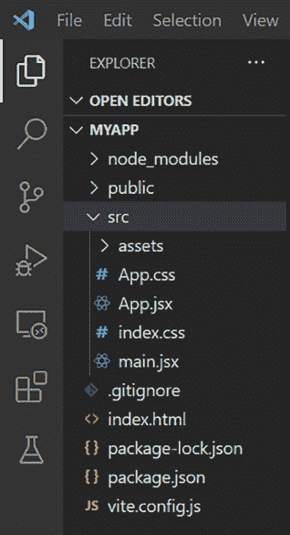

    图 7.12：项目结构

    您也可以通过在终端中输入`code .`命令来打开 VS Code。此命令将打开 VS Code 以及您所在的文件夹。

1.  在代码编辑器中打开 `src` 文件夹中的 `App.jsx` 文件。将 `<h1>` 元素内的文本修改为 `Hello React` 并保存文件。您目前不需要了解此文件的其他内容。我们将在第八章 *React 入门* 中更深入地探讨此主题：


图 7.13：App.js 代码

1.  现在，如果您查看浏览器，应该会立即看到标题文本已更改。Vite 提供了 **热模块替换** (**HMR**) 功能，当您在 React 项目中修改其源代码或样式时，它会自动更新 React 组件，无需手动刷新页面：

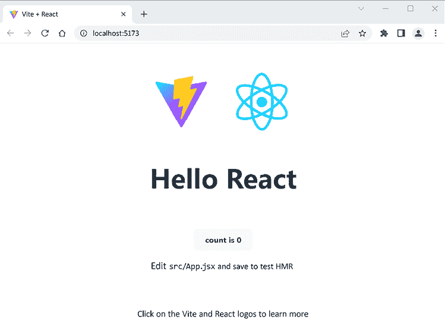

图 7.14：修改后的 React 应用

# 调试 React 应用

为了调试 React 应用，我们还应该安装 **React 开发者工具**，它适用于 Chrome、Firefox 和 Edge 浏览器。Chrome 插件可以从 Chrome 网上应用店安装（[`chrome.google.com/webstore/category/extensions`](https://chrome.google.com/webstore/category/extensions)），而 Firefox 扩展插件可以从 Firefox 扩展网站安装（[`addons.mozilla.org`](https://addons.mozilla.org)）。安装 React 开发者工具后，当您导航到您的 React 应用时，您应该在浏览器开发者工具中看到一个新的 **组件** 选项卡。

您可以通过在 Chrome 浏览器中按 *Ctrl* + *Shift* + *I*（或 *F12*）来打开开发者工具。以下截图显示了浏览器中的开发者工具。**组件**选项卡显示了 React 组件树的视觉表示，您可以使用搜索栏来查找组件。如果您在组件树中选择一个组件，您将在右侧面板中看到更多关于它的具体信息：


图 7.15：React 开发者工具

我们将看到浏览器的开发者工具非常重要，在开发期间打开它们非常有用，这样您可以立即看到错误和警告。开发者工具中的**控制台**是您可以从 JavaScript 或 TypeScript 代码中记录消息、警告和错误的地方。**网络**选项卡显示了网页发出的所有请求，包括它们的状态码、响应时间和内容。这对于优化您的 Web 应用性能和诊断网络相关问题是很有帮助的。

# 摘要

在本章中，我们安装了启动 React 前端开发所需的一切。首先，我们安装了 Node.js 和 VS Code 编辑器。然后，我们使用 Vite 创建了我们的第一个 React 应用。最后，我们运行了该应用，演示了如何修改它，并介绍了调试工具。在接下来的章节中，我们将继续使用 Vite。

在下一章中，我们将熟悉 React 编程的基础知识。

# 问题

1.  Node.js 和 `npm` 是什么？

1.  如何安装 Node.js？

1.  什么是 VS Code？

1.  如何安装 VS Code？

1.  如何使用 Vite 创建 React 应用？

1.  如何运行 React 应用？

1.  如何对您的应用进行基本修改？

# 进一步阅读

这里有一些有用的资源，可以帮助我们扩展本章学到的知识：

+   *React 18 设计模式和最佳实践*，由 Carlos Santana Roldán 编著 ([`www.packtpub.com/product/react-18-design-patterns-and-best-practices-fourth-edition/9781803233109`](https://www.packtpub.com/product/react-18-design-patterns-and-best-practices-fourth-edition/9781803233109))

+   *JavaScript 在 Visual Studio Code 中*，由微软提供 ([`code.visualstudio.com/docs/languages/javascript`](https://code.visualstudio.com/docs/languages/javascript))

+   *TypeScript 在 Visual Studio Code 中*，由微软提供 ([`code.visualstudio.com/docs/languages/typescript`](https://code.visualstudio.com/docs/languages/typescript))

# 在 Discord 上了解更多

要加入本书的 Discord 社区——在那里您可以分享反馈、向作者提问，并了解新版本——请扫描下面的二维码：

[`packt.link/FullStackSpringBootReact4e`](https://packt.link/FullStackSpringBootReact4e)


