# 第八章：React 入门

本章描述了 React 编程的基础。我们将涵盖创建 React 前端基本功能所需的技术。在 JavaScript 中，我们使用 **ECMAScript 2015**（**ES6**）语法，因为它提供了许多使编码更简洁的功能。

在本章中，我们将探讨以下主题：

+   创建 React 组件

+   有用的 ES6 功能

+   JSX 和样式

+   Props 和状态

+   条件渲染

+   React 钩子

+   上下文 API

+   使用 React 处理列表、事件和表单

# 技术要求

对于我们的工作，需要使用 React 版本 18 或更高版本。我们在*第七章*中正确设置了我们的环境。

您可以在本章的 GitHub 链接中找到更多资源：[`github.com/PacktPublishing/Full-Stack-Development-with-Spring-Boot-3-and-React-Fourth-Edition/tree/main/Chapter08`](https://github.com/PacktPublishing/Full-Stack-Development-with-Spring-Boot-3-and-React-Fourth-Edition/tree/main/Chapter08)。

# 创建 React 组件

React 是一个用于**用户界面**（**UI**）的 JavaScript 库。自 15 版本以来，React 一直在 MIT 许可下开发。React 是基于组件的，组件是独立且可重用的。组件是 React 的基本构建块。当你开始使用 React 开发 UI 时，最好先创建**模拟界面**。这样，将很容易确定你需要创建哪些类型的组件以及它们如何交互。

从以下模拟用户界面中，我们可以看到 UI 可以如何拆分为组件。在这种情况下，将有一个应用程序根组件、一个搜索栏组件、一个表格组件和一个表格行组件：

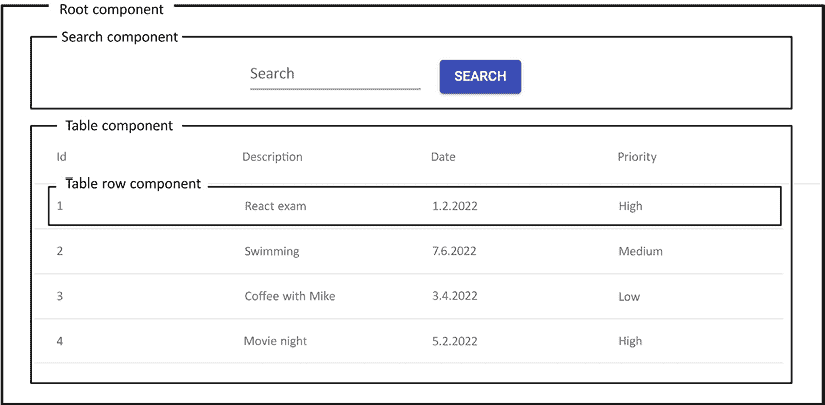

图 8.1：React 组件

组件可以按照以下截图所示的**树形层次结构**进行排列：

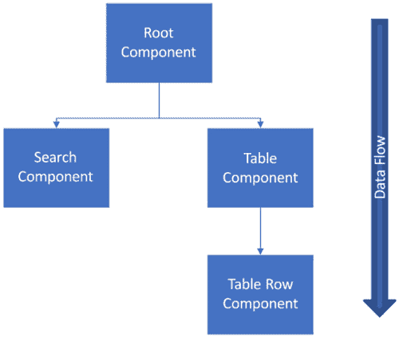

图 8.2：组件树

**根组件**有两个**子组件**：搜索组件和表格组件。表格组件有一个子组件：表格行组件。在 React 中需要理解的重要一点是数据流是从父组件流向子组件。我们将在稍后学习如何使用 props 从父组件传递数据到子组件。

React 使用 **虚拟文档对象模型**（**VDOM**）进行 UI 的选择性重新渲染，这使得它更加高效。**文档对象模型**（**DOM**）是用于表示网页为结构化对象树的编程接口。树中的每个对象都对应文档的一部分。使用 DOM，程序员可以创建文档、导航其结构，并添加、修改或删除元素和内容。VDOM 是 DOM 的轻量级副本，对 VDOM 的操作比在真实 DOM 中要快得多。在更新 VDOM 之后，React 会将其与在更新之前拍摄的 VDOM 快照进行比较。比较之后，React 将知道哪些部分已经更改，并且只有这些部分会被更新到真实 DOM。

一个 React 组件可以通过使用 JavaScript 函数——一个 **函数组件**——或者 ES6 JavaScript 类——一个 **类组件**来定义。我们将在下一节更深入地了解 ES6。

这里有一些简单的组件源代码，用于渲染 `Hello World` 文本。第一个代码块使用 JavaScript 函数：

```java
// Using JavaScript function
function App() {
  return <h1>Hello World</h1>;
} 
```

React 函数组件中必须的 `return` 语句定义了组件的外观。

或者，以下代码使用 ES6 类来创建一个组件：

```java
// Using ES6 class
class App extends React.Component {
  render() {
    return <h1>Hello World</h1>;
  }
} 
```

类组件包含必要的 `render()` 方法，该方法显示并更新组件的渲染输出。如果您比较函数和类 `App` 组件，您会看到在函数组件中不需要 `render()` 方法。在 React 版本 16.8 之前，您必须使用类组件才能使用状态。现在，您也可以使用 hooks 在函数组件中创建状态。我们将在本章后面学习状态和 hooks。

在这本书中，我们将使用函数创建组件，这意味着我们需要编写更少的代码。函数组件是编写 React 组件的现代方式，我们建议避免使用类。

React 组件的名称应该以大写字母开头。还建议使用 PascalCase 命名约定，即每个单词都以大写字母开头。

假设我们正在修改示例组件的 `return` 语句，并向其中添加一个新的 `<h2>` 元素，如下所示：

```java
function App() {
  return (
    <h1>Hello World</h1>
    <h2>This is my first React component</h2>
  );
} 
```

现在，如果运行应用程序，我们将看到一个 **相邻 JSX 元素必须包裹在封装标签中**的错误，如下面的屏幕截图所示：

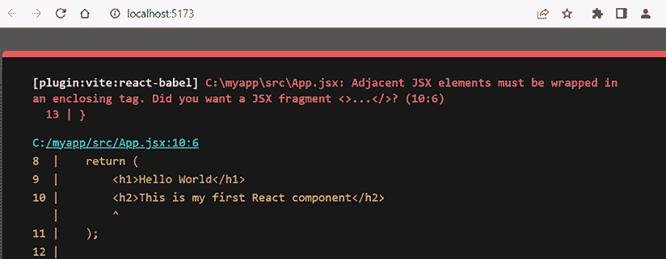

图 8.3：相邻 JSX 元素错误

如果您的组件返回多个元素，您必须将这些元素包裹在一个父元素内部。为了修复这个错误，我们必须将标题元素包裹在一个元素中，例如一个 `div`，如下面的代码片段所示：

```java
// Wrap elements inside the div
function App() {
  return (
    <div>
      <h1>Hello World</h1>
      <h2>This is my first React component</h2>
    </div>
  );
} 
```

我们还可以使用 React **片段**，如下面的代码片段所示。片段不会向 DOM 树添加任何额外的节点：

```java
// Using fragments
function App() {
  return (
    **<React.Fragment>**
      <h1>Hello World</h1>
      <h2>This is my first React component</h2>
    <**/React.Fragment**>
  );
} 
```

对于片段，也有更短的语法，它看起来像空的 JSX 标签。这在上面的代码片段中显示：

```java
// Using fragments short syntax
function App() {
  return (
    <>
      <h1>Hello World</h1>
      <h2>This is my first React component</h2>
    </>
  );
} 
```

## 检查我们的第一个 React 应用

让我们更仔细地看看我们在 *第七章* 中使用 Vite 创建的第一个 React 应用，*设置环境和工具 – 前端*。

根文件夹中的 `main.jsx` 文件的源代码如下：

```java
import React from 'react'
import ReactDOM from 'react-dom/client'
import App from './App'
import './index.css'
ReactDOM.createRoot(document.getElementById('root')).render(
  <React.StrictMode>
    <App />
  </React.StrictMode>,
) 
```

在文件的开头有一些 `import` 语句，它们将组件和资产加载到我们的文件中。例如，第二行从 `node_modules` 文件夹中导入 `react-dom` 包，第三行导入 `App` 组件（位于 `src` 文件夹中的 `App.jsx` 文件），第四行导入与 `main.jsx` 文件相同的文件夹中的 `index.css` 样式表。

`react-dom` 包为我们提供了特定的 DOM 方法。要将 React 组件渲染到 DOM 中，我们可以使用来自 `react-dom` 包的 `render` 方法。`React.StrictMode` 用于在您的 React 应用中查找潜在问题，这些问题会在浏览器控制台中打印出来。严格模式仅在开发模式下运行，并且会额外渲染您的组件，因此它有足够的时间来查找错误。

**root API** 用于在浏览器 DOM 节点内渲染 React 组件。在以下示例中，我们首先通过将 DOM 元素传递给 `createRoot` 方法来创建一个根。根调用 `render` 方法将一个元素渲染到根：

```java
import ReactDOM from 'react-dom/client';
import App from './App';
const container = document.getElementById('root');
// Create a root
const root = ReactDOM.createRoot(container);
// Render an element to the root
root.render(<App />); 
```

根 API 中的 `container` 是 `<div id="root"></div>` 元素，它位于项目根文件夹内的 `index.html` 文件中。查看以下 `index.html` 文件：

```java
<!DOCTYPE html>
<html lang="en">
  <head>
    <meta charset="UTF-8" />
    <link rel="icon" type="image/svg+xml" href="/vite.svg" />
    <meta name="viewport" content="width=device-width, initial-scale=1.0" />
    <title>Vite + React</title>
  </head>
  <body>
    **<****div****id****=****"root"****></****div****>**
    <script type="module" src="img/main.jsx"></script>
  </body>
</html> 
```

以下源代码显示了我们的第一个 React 应用中的 `App.jsx` 组件。您可以看到 `import` 也适用于资产，如图片和样式表。在源代码的末尾有一个 `export default` 语句，它导出组件，并且可以通过使用 `import` 语句使其对其他组件可用：

```java
import { useState } from 'react'
import reactLogo from './assets/react.svg'
import viteLogo from '/vite.svg'
import './App.css'
function App() {
  const [count, setCount] = useState(0)
  return (
    <div className="App">
      <div>
        <a href="https://vitejs.dev" target="_blank">
          
        </a>
        <a href="https://reactjs.org" target="_blank">
          
        </a>
      </div>
      <h1>Hello React</h1>
      <div className="card">
        <button onClick={() => setCount((count) => count + 1)}>
          count is {count}
        </button>
        <p>
          Edit <code>src/App.jsx</code> and save to test HMR
        </p>
      </div>
      <p className="read-the-docs">
        Click on the Vite and React logos to learn more
      </p>
    </div>
  )
}
export default App 
```

您可以看到，在 Vite 创建的 `App` 组件中，我们没有在语句末尾使用分号。在 JavaScript 中这是可选的，但在这本书中，当我们开始创建自己的 React 组件时，我们将使用分号来终止语句。

每个文件只能有一个 `export default` 语句，但可以有多个命名的 `export` 语句。默认导出通常用于导出 React 组件。命名导出通常用于从模块中导出特定的函数或对象。

以下示例显示了如何导入默认和命名的导出：

```java
import React from 'react' // Import default value
import { name } from … //  Import named value 
```

导出看起来是这样的：

```java
export default React // Default export
export { name }  //  Named export 
```

现在我们已经涵盖了 React 组件的基础知识，让我们来看看 ES6 的基本特性。

# 有用的 ES6 特性

**ES6** 于 2015 年发布，并引入了许多新特性。ECMAScript 是一种标准化的脚本语言，而 JavaScript 是其一种实现。在本节中，我们将介绍 ES6 中发布的最重要特性，这些特性将在接下来的章节中使用。

## 常量和变量

```java
const keyword, the variable content cannot be reassigned:
```

```java
const PI = 3.14159; 
```

现在，如果您尝试重新分配 `PI` 值，将会得到错误，如下面的截图所示：

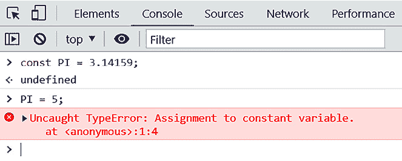

图 8.4：向常量变量赋值

`const` 是块级作用域的。这意味着 `const` 变量只能在其定义的块内部使用。在实践中，块是花括号 `{}` 之间的区域。如果 `const` 在任何函数或块外部定义，它就变成了全局变量，您应尽量避免这种情况。全局变量会使代码更难以理解、维护和调试。以下示例代码展示了作用域是如何工作的：

```java
let count = 10;
if (count > 5) {
  const total = count * 2;
  console.log(total); // Prints 20 to console
}
console.log(total); // Error, outside the scope 
```

第二个 `console.log` 语句会报错，因为我们试图在作用域之外使用 `total` 变量。

以下示例演示了当 `const` 是对象或数组时会发生什么：

```java
const myObj = {foo:  3};
myObj.foo = 5; // This is ok 
```

当 `const` 是对象或数组时，其属性或元素可以被更新。

`let` 关键字允许您声明可变块级作用域变量。使用 `let` 声明的变量可以在其声明的块内部使用（也可以在子块内部使用）。

## 箭头函数

在 JavaScript 中定义函数的传统方式是使用 `function` 关键字。以下函数接受一个参数，并返回该参数值乘以 `2`：

```java
function(x) {
  return x * 2;
} 
```

当我们使用 ES6 箭头函数时，函数看起来是这样的：

```java
x => x * 2 
```

如我们所见，通过使用箭头函数，我们使相同函数的声明更加紧凑。该函数是一个所谓的**匿名函数**，我们无法调用它。匿名函数通常用作其他函数的参数。在 JavaScript 中，函数是**一等公民**，您可以将函数存储在变量中，如下所示：

```java
const calc = x => x * 2 
```

现在，您可以使用变量名来调用函数，如下所示：

```java
calc(5); // returns 10 
```

当您有多个参数时，您必须将参数包裹在括号中，并用逗号分隔参数，以有效地使用箭头函数。例如，以下函数接受两个参数，并返回它们的和：

```java
const calcSum = (x, y) => x + y
// function call
calcSum(2, 3); // returns 5 
```

如果函数体是一个表达式，那么您不需要使用 `return` 关键字。表达式总是隐式地从函数中返回。当函数体有多行时，您必须使用花括号和一个 `return` 语句，如下所示：

```java
const calcSum = (x, y) => {
  console.log('Calculating sum');
  return x + y;
} 
```

如果函数没有参数，那么您应该使用空括号，如下所示：

```java
const sayHello = () => "Hello" 
```

我们将在我们的前端实现中大量使用箭头函数。

## 模板字符串

模板字符串可以用于连接字符串。连接字符串的传统方式是使用 `+` 运算符，如下所示：

```java
let person = {firstName: 'John', lastName: 'Johnson'};
let greeting = "Hello " + ${person.firstName} + " " + ${person.lastName}; 
```

使用模板字符串时，语法如下。您必须使用反引号（`）而不是单引号或双引号：

```java
let person = {firstName: 'John', lastName: 'Johnson'};
let greeting = `Hello ${person.firstName} ${person.lastName}`; 
```

接下来，我们将学习如何使用对象解构。

## 对象解构

对象解构功能允许你从对象中提取值并将它们分配给变量。你可以使用单个语句将对象的多个属性分配给单个变量。例如，如果你有这个对象：

```java
const person = {
  firstName: 'John',
  lastName: 'Johnson',
  email: 'j.johnson@mail.com'
}; 
```

你可以使用以下语句对其进行解构：

```java
const { firstName, lastName, email } = person; 
```

它创建了三个变量，`firstName`、`lastName` 和 `email`，它们从 `person` 对象中获取它们的值。

没有对象解构的情况下，你必须单独访问每个属性，如下面的代码片段所示：

```java
const firstName = person.firstName;
const lastName = person.lastName;
const email = person.email; 
```

接下来，我们将学习如何使用 JavaScript ES6 语法创建类。

## 类和继承

ES6 中的类定义与其他面向对象的语言（如 Java 或 C#）类似。我们在之前查看如何创建 React 类组件时已经看到了 ES6 类。但是，正如我们之前所说的，类不再推荐用于创建 React 组件。

定义类的关键字是 `class`。一个类可以有字段、构造函数和类方法。以下示例代码展示了 ES6 类：

```java
class Person {
  constructor(firstName, lastName) {
    this.firstName = firstName;
    this.lastName = lastName;
  }
} 
```

继承是通过 `extends` 关键字实现的。以下示例代码展示了继承自 `Person` 类的 `Employee` 类。这意味着它继承了父类的所有字段，并且可以有自己的特定于 `Employee` 的字段。在构造函数中，我们首先使用 `super` 关键字调用父类构造函数。这个调用对于其余的代码是必需的，如果它缺失，你会得到一个错误：

```java
class Employee extends Person {
  constructor(firstName, lastName, title, salary) {
    super(firstName, lastName);
    this.title = title;
    this.salary = salary;
  }
} 
```

尽管 ES6 已经相当老了，但其中一些功能在现代网络浏览器中仍然只部分受支持。**Babel** 是一个 JavaScript 编译器，用于将 ES6（或更新的版本）编译成与所有浏览器兼容的旧版本。你可以在 Babel 网站上测试编译器（[`babeljs.io`](https://babeljs.io)）。以下截图显示了箭头函数编译回旧版 JavaScript 语法：

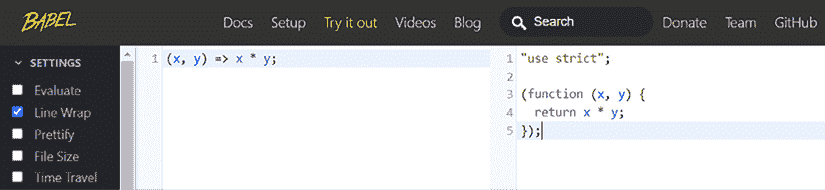

图 8.5：Babel

现在我们已经了解了 ES6 的基础知识，让我们来看看 JSX 和样式都是些什么。

# JSX 和样式

**JavaScript XML**（**JSX**）是 JavaScript 的语法扩展。使用 JSX 与 React 不是强制性的，但有一些使开发更简单的优点。例如，JSX 防止注入攻击，因为所有值在 JSX 渲染之前都会被转义。最有用的功能是，你可以通过用花括号包裹它们来在 JSX 中嵌入 JavaScript 表达式；这种技术将在接下来的章节中大量使用。JSX 由 Babel 编译成常规 JavaScript。

在以下示例中，我们可以在使用 JSX 时访问组件的 props：

```java
function App(props) {
  return <h1>Hello World **{props.user}**</h1>;
} 
```

组件 props 将在下一节中介绍。

你也可以像以下代码片段所示那样将 JavaScript 表达式作为 props 传递：

```java
<Hello count=**{****2****+****2****}** /> 
```

你可以使用内联和外部样式与 React JSX 元素一起使用。以下有两个内联样式的示例。第一个在 `div` 元素内部定义了样式：

```java
<div style={{ height: 20, width: 200 }}>
  Hello
</div> 
```

第二个示例首先创建一个样式对象，然后在该 `div` 元素中使用。对象名称应使用 *camelCase* 命名约定：

```java
const divStyle = { color: 'red', height: 30 };
const MyComponent = () => (
  <div style={divStyle}>Hello</div>
); 
```

如前一个部分所示，你可以将样式表导入到 React 组件中。要引用外部 **CSS** 文件中的类，你应该使用 `className` 属性，如下面的代码片段所示：

```java
import './App.js';
...
<div **className**="App-header"> This is my app</div> 
```

在下一节中，我们将学习关于 React props 和 state 的内容。

# Props 和 state

**Props** 和 **state** 是渲染组件的输入数据。当 props 或 state 发生变化时，组件会重新渲染。

## Props

**Props** 是组件的输入，它们是传递数据从父组件到子组件的机制。Props 是 JavaScript 对象，因此它们可以包含多个键值对。

Props 是不可变的，因此组件不能改变其 props。Props 是从父组件接收的。组件可以通过作为参数传递给函数组件的 `props` 对象来访问 props。例如，让我们看一下以下组件：

```java
function Hello() {
  return <h1>Hello John</h1>;
} 
```

组件仅渲染一个静态消息，并且不可复用。我们可以通过使用 props 将一个名字传递给 `Hello` 组件，而不是使用硬编码的名字，如下所示：

```java
function Hello**(props)** {
  return <h1>Hello **{props.user}**</h1>;
} 
```

父组件可以通过以下方式将 props 发送到 `Hello` 组件：

```java
<Hello user="John" /> 
```

现在，当 `Hello` 组件被渲染时，它显示 `Hello John` 文本。

你也可以向组件传递多个 props，如下所示：

```java
<Hello firstName="John" lastName="Johnson" /> 
```

现在，你可以使用 `props` 对象访问组件中的这两个 props，如下所示：

```java
function Hello(props) {
  return <h1>Hello {props.firstName} {props.lastName}</h1>;
} 
```

现在，组件输出为 `Hello John Johnson`。

你也可以使用对象解构以以下方式解构 `props` 对象：

```java
function Hello({ firstName, lastName }) {
  return <h1>Hello {firstName} {lastName}</h1>;
} 
```

## State

在 React 中，组件 **state** 是一个内部数据存储，它持有随时间变化的信息。状态还影响组件的渲染。当状态更新时，React 会安排组件的重新渲染。当组件重新渲染时，状态保留其最新的值。状态允许组件动态且对用户交互或其他事件做出响应。

通常，避免在 React 组件中引入不必要的状态是一个好的实践。不必要的状态会增加组件的复杂性，并可能导致不期望的副作用。有时，局部变量可能是一个更好的选择。但你要明白，*局部变量的更改不会触发重新渲染*。每次组件重新渲染时，局部变量都会被重新初始化，它们的值在渲染之间不会持久化。

使用 `useState` 钩子函数创建状态。它接受一个参数，即状态的初始值，并返回一个包含两个元素的数组。第一个元素是状态的名字，第二个元素是一个用于更新状态值的函数。`useState` 函数的语法在下面的代码片段中展示：

```java
const [state, setState] = React.useState(initialValue); 
```

下一个代码示例创建了一个名为 `name` 的状态变量，其初始值为 `Jim`：

```java
const [name, setName] = React.useState('Jim'); 
```

您也可以像这样从 React 导入`useState`函数：

```java
import React, { useState } from 'react'; 
```

然后，您不需要像这里所示的那样键入`React`关键字：

```java
const [name, setName] = useState('Jim'); 
```

现在，您可以使用`setName`函数来更新状态值，如下面的代码片段所示。这是修改状态值的唯一方法：

```java
// Update name state value
setName('John'); 
```

您绝对不应该直接使用`=`运算符来更新状态值。如果您直接更新状态，如以下所示，React 将不会重新渲染组件，您也会得到一个错误，因为您不能重新分配`const`变量：

```java
// Don't do this, UI won't re-render
name = 'John'; 
```

如果您有多个状态，您可以多次调用`useState`函数，如下面的代码片段所示：

```java
// Create two states: firstName and lastName
const [firstName, setFirstName] = useState('John');
const [lastName, setLastName] = useState('Johnson'); 
```

现在，您可以使用`setFirstName`和`setLastName`函数来更新状态，如下面的代码片段所示：

```java
// Update state values
setFirstName('Jim');
setLastName('Palmer'); 
```

您也可以使用对象来定义状态，如下所示：

```java
const [name, setName] = useState({
  firstName: 'John',  
  lastName: 'Johnson'
}); 
```

现在，您可以使用`setName`函数更新`firstName`和`lastName`状态对象参数，如下所示：

```java
setName({ firstName: 'Jim', lastName: 'Palmer' }) 
```

如果您想对对象进行部分更新，可以使用**展开运算符**。在下面的示例中，我们使用了在 ES2018 中引入的对象展开语法（`...`），它克隆了`name`状态对象并将`firstName`的值更新为`Jim`：

```java
setName({ ...name, firstName: 'Jim' }) 
```

可以通过使用状态名称来访问状态，如下一个示例所示。状态的范围是组件，因此它不能在定义它的组件外部使用：

```java
// Renders Hello John
import React, { useState } from 'react';
function MyComponent() {
  const [firstName, setFirstName] = useState('John');
  return <div>Hello **{firstName}**</div>;
} 
```

如果您的状态是一个对象，那么您可以按以下方式访问它：

```java
const [name, setName] = useState({
  firstName: 'John',  
  lastName: 'Johnson'
});
return <div>Hello **{name.firstName}**</div>; 
```

我们现在已经学习了状态和属性的基础知识，我们将在本章的后面部分学习更多关于状态的内容。

## 无状态组件

React 的**无状态组件**只是一个接受 props 作为参数并返回 React 元素的纯 JavaScript 函数。以下是一个无状态组件的示例：

```java
function HeaderText(props) {
  return (
    <h1>
      {props.text}
    </h1>
  )
}
export default HeaderText; 
memo():
```

```java
import React, { memo } from 'react';
function HeaderText(props) {
  return (
    <h1>
      {props.text}
    </h1>
  )
}
export default memo(HeaderText); 
```

现在，组件已被渲染并**缓存**。在下一次渲染中，如果属性没有改变，React 将渲染缓存的结果。`React.memo()`短语还有一个第二个参数`arePropsEqual()`，您可以使用它来自定义渲染条件，但这里我们不会涉及。使用函数组件的一个好处是单元测试，因为它们的返回值对于相同的输入值始终相同。

# 条件渲染

如果条件为`true`或`false`，您可以使用条件语句来渲染不同的 UI。这个特性可以用来显示或隐藏某些元素，处理身份验证等等。

在下面的示例中，我们将检查`props.isLoggedin`是否为`true`。如果是这样，我们将渲染`<Logout />`组件；否则，我们将渲染`<Login />`组件。现在这是通过两个单独的`return`语句实现的：

```java
function MyComponent(props) {
  const isLoggedin = props.isLoggedin;
  if (isLoggedin) {
    return (
      <Logout />
    )
  }
  return (
    <Login />
  )
} 
```

您也可以通过使用`condition ? true : false`逻辑运算符来实现这一点，然后您只需要一个`return`语句，如下所示：

```java
function MyComponent(props) {
  const isLoggedin = props.isLoggedin;
  return (
    <>
      { isLoggedin ? <Logout /> : <Login /> }
    </>
  );
} 
```

# React hooks

**钩子**是在 React 16.8 版本中引入的。钩子允许你在函数组件中使用状态和一些其他 React 特性。在钩子出现之前，如果需要状态或复杂的组件逻辑，你必须编写类组件。

在 React 中使用钩子有一些重要的规则。你应该始终在 React 函数组件的顶层调用钩子。你不应该在循环、条件语句或嵌套函数中调用钩子。钩子名称以单词`use`开头，后跟它们所服务的目的。

## useState

我们已经熟悉了用于声明状态的`useState`钩子函数。让我们看看使用`useState`钩子的另一个示例。我们将创建一个包含按钮的示例计数器，当按下按钮时，计数器增加`1`，如下截图所示：

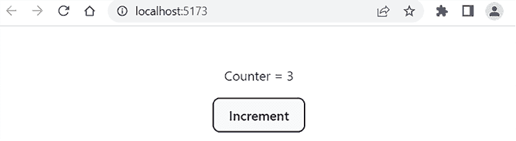

图 8.6：计数器组件

1.  首先，我们创建一个`Counter`组件，并声明一个名为`count`的状态，其初始值为`0`。可以使用`setCount`函数更新计数器状态的值。以下代码片段展示了这一过程：

    ```java
    import { useState } from 'react';
    function Counter() {
      // count state with initial value 0
      const [count, setCount] = useState(0);
      return <div></div>;
    };
    export default Counter; 
    ```

1.  接下来，我们渲染一个按钮元素，每次按下按钮时将状态增加`1`。我们使用`onClick`事件属性来调用`setCount`函数，新值是当前值加`1`。我们还将渲染计数器状态值。以下代码片段展示了这一过程：

    ```java
    import { useState }  from 'react';
    function Counter() {
      const [count, setCount] = useState(0);
      return (
        <div>
          <p>Counter = {count}</p>
          <button onClick={() => setCount(count + 1)}>
            Increment
          </button>
        </div>
      );
    };
    export default Counter; 
    ```

1.  现在，我们的`Counter`组件已经准备好，每次按下按钮时计数器都会增加`1`。当状态更新时，React 会重新渲染组件，我们可以看到新的`count`值。

在 React 中，事件名称使用驼峰式命名法，例如，**onClick**。

注意，必须将函数传递给事件处理器，然后 React 仅在用户点击按钮时调用该函数。以下示例中我们使用箭头函数，因为它更简洁，并且可以提高代码的可读性。如果你在事件处理器中调用该函数，那么该函数将在组件渲染时被调用，这可能导致无限循环：

```java
**// Correct -> Function is called when button is pressed**
<button onClick={() => setCount(count + 1)}>
**// Wrong -> Function is called in render -> Infinite loop**
<button onClick={setCount(count + 1)}> 
```

状态更新是异步的，因此当新的状态值依赖于当前状态值时，你必须小心。为了确保使用最新的值，你可以将一个函数传递给更新函数。你可以在以下示例中看到这一点：

```java
setCount(prevCount => prevCount + 1) 
```

现在，将前一个值传递给函数，然后返回并保存到`count`状态中的更新值。

此外，还有一个名为`useReducer`的钩子函数，当你有复杂的状态时推荐使用，但在此书中我们不会涉及这一点。

### 批处理

React 使用**批处理**来更新状态以减少重新渲染。在 React 18 版本之前，批处理仅在浏览器事件期间更新的状态中起作用——例如，按钮点击。以下示例演示了批处理更新的概念：

```java
import { useState } from 'react';
function App() {
  const [count, setCount] = useState(0);
  const [count2, setCount2] = useState(0);
  const increment = () => {
    setCount(count + 1); // No re-rendering yet
    setCount2(count2 + 1);
    // Component re-renders after all state updates
  }
  return (
    <>
      <p>Counters: {count} {count2}</p>
      <button onClick={increment}>Increment</button>
    </>
  );
};
export default App; 
```

从 React 版本 18 开始，所有状态更新都将被批处理。如果你在某些情况下不想使用批处理更新，你可以使用 `react-dom` 库的 `flushSync` API 来避免批处理。例如，你可能有一个在更新下一个状态之前更新一些状态的情况。当整合第三方代码，如浏览器 API 时，这可能很有用。

这是你需要执行的代码：

```java
import { flushSync } from "react-dom";
const increment = () => {
  flushSync( () => {
    setCount(count + 1); // No batch update
  });
} 
```

你应该只在需要时使用 `flushSync`，因为它可能会影响你的 React 应用的性能。

## useEffect

`useEffect` 钩子函数可以用来在 React 函数组件中执行副作用。副作用可以是，例如，一个 `fetch` 请求。`useEffect` 钩子接受两个参数，如以下所示：

```java
useEffect(callback, [dependencies]) 
```

`callback` 函数包含副作用逻辑，`[dependencies]` 是一个可选的依赖数组。

```java
useEffect hook. Now, when the button is pressed, the count state value increases, and the component is re-rendered. After each render, the useEffect callback function is invoked and we can see Hello from useEffect in the console, as illustrated in the following code snippet:
```

```java
import { useState, useEffect } from 'react';
function Counter() {
  const [count, setCount] = useState(0);
  // Called after every render
  useEffect(() => {
    console.log('Hello from useEffect')
  });
  return (
    <>
      <p>{count}</p>
      <button onClick={() => setCount(count + 1)}>Increment
      </button>
    </>
  );
};
export default Counter; 
```

在下面的屏幕截图中，我们可以看到控制台现在的样子，并且我们可以看到 `useEffect` 回调在每个渲染后都会被调用。第一条日志行是在初始渲染后打印的，其余的都是在按钮被按下两次并且组件由于状态更新而重新渲染后打印的：

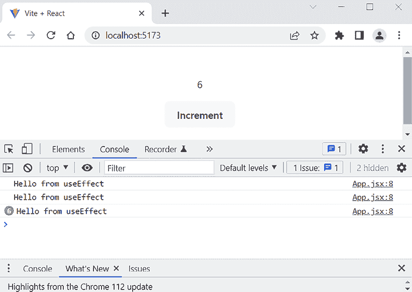

图 8.7：useEffect

```java
count state value is changed (meaning that the previous and current values differ), the useEffect callback function will be invoked. We can also define multiple states in the second argument. If any of these state values are changed, the useEffect hook will be invoked:
```

```java
// Runs when count value is changed and component is re-rendered
useEffect(() => {
  console.log('Counter value is now ' + count);
}, [count]); 
```

如果你将空数组作为第二个参数传递，`useEffect` 回调函数只会在第一次渲染后运行，如下面的代码片段所示：

```java
// Runs only after the first render
useEffect(() => {
  console.log('Hello from useEffect')
}, []); 
```

现在，你可以看到在初始渲染后，**来自 useEffect 的问候** 只打印了一次，如果你按下按钮，文本就不会打印。由于 React Strict Mode，消息在第一次渲染后打印了两次。Strict Mode 在开发模式下渲染你的组件两次以查找错误，并且不会影响生产构建：

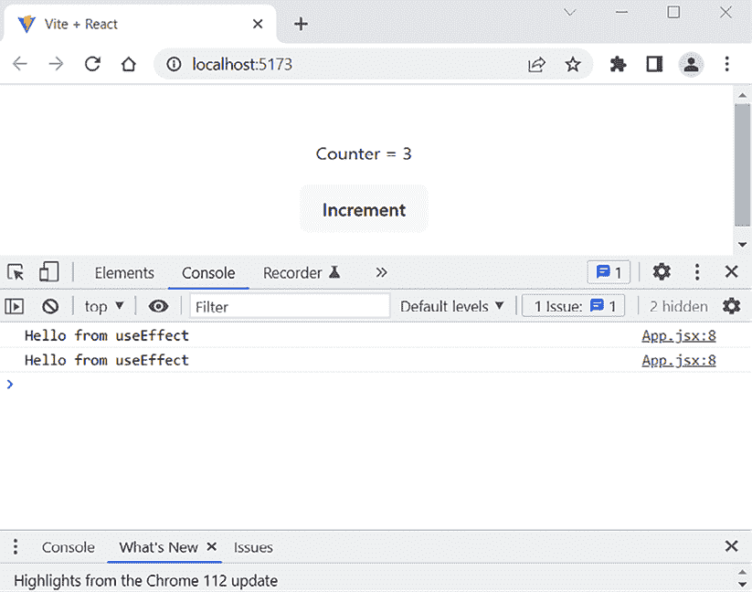

图 8.8：带有空数组的 useEffect

```java
unmounted):
```

```java
useEffect(() => {
  console.log('Hello from useEffect');
  return () => {
    console.log('Clean up function');
  });
}, [count]); 
```

如果你使用这些更改运行计数器应用，你可以在控制台中看到发生的情况，如下面的屏幕截图所示。由于 Strict Mode，组件最初渲染了两次。在初始渲染后，组件被卸载（从 DOM 中移除），因此会调用清理函数：

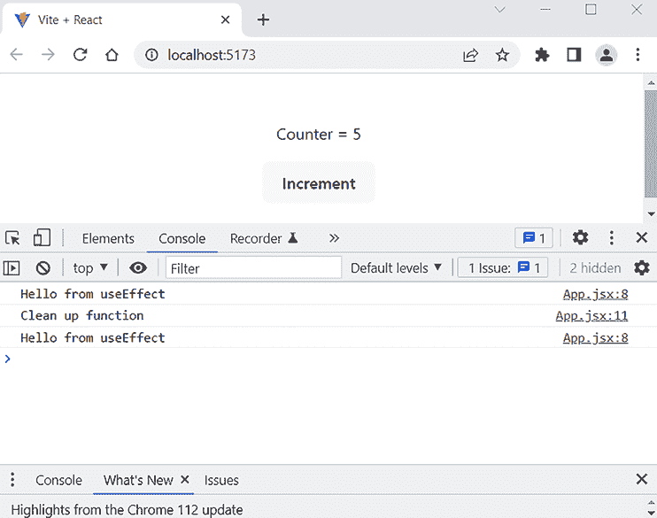

图 8.9：清理函数

## useRef

`useRef` 钩子返回一个可变的 `ref` 对象，可以用来访问 DOM 节点。你可以在以下操作中看到它：

```java
const ref = useRef(initialValue) 
```

返回的 `ref` 对象具有一个 `current` 属性，该属性使用传递的参数初始化（`initialValue`）。在下一个示例中，我们创建了一个名为 `inputRef` 的 `ref` 对象并将其初始化为 `null`。然后，我们使用 JSX 元素的 `ref` 属性并将我们的 `ref` 对象传递给它。现在，它包含我们的 `input` 元素，我们可以使用 `current` 属性来执行 `input` 元素的 `focus` 函数。现在，当按钮被按下时，输入元素将被聚焦：

```java
import { useRef } from 'react';
import './App.css';
function App() {
  const inputRef = useRef(null);
  return (
    <>
      <input ref={inputRef} />
      <button onClick={() => inputRef.current.focus()}>
        Focus input
      </button>
    </>
  );
}
export default App; 
```

在本节中，我们学习了 React 钩子的基础知识，当我们开始实现前端时，我们将实际使用它们。React 中还有其他有用的钩子函数可用，接下来你将学习如何创建你自己的钩子。

## 自定义钩子

你可以在 React 中构建自己的钩子。正如我们已经看到的，钩子的名称应该以 `use` 字符开头，并且它们是 JavaScript 函数。自定义钩子也可以调用其他钩子。使用自定义钩子，你可以减少组件代码的复杂性。

让我们通过一个简单的例子来创建一个自定义钩子：

1.  我们将创建一个 `useTitle` 钩子，它可以用来更新文档标题。我们将在名为 `useTitle.js` 的文件中定义它。首先，我们定义一个函数，它接受一个名为 `title` 的参数。代码如下所示：

    ```java
    // useTitle.js
    function useTitle(title) {
    } 
    ```

1.  接下来，我们将使用 `useEffect` 钩子来更新文档标题，每次 `title` 参数改变时，如下所示：

    ```java
    import { useEffect } from 'react';
    function useTitle(title) {
      useEffect(() => {
        document.title = title;
      }, [title]);
    }
    export default useTitle; 
    ```

1.  现在，我们可以开始使用我们的自定义钩子了。让我们在计数器示例中使用它，并将当前计数器的值打印到文档标题中。首先，我们必须将 `useTitle` 钩子导入到我们的 `Counter` 组件中，如下所示：

    ```java
    **import** **useTitle** **from****'./useTitle'****;**
    function Counter() {
      return (
        <>
        </>
      );
    };
    export default Counter; 
    ```

1.  然后，我们将使用 `useTitle` 钩子将 `count` 状态值打印到文档标题中。我们可以在 `Counter` 组件函数的最高级别调用我们的钩子函数，每次组件渲染时，`useTitle` 钩子函数都会被调用，我们可以在文档标题中看到当前的计数器值。代码如下所示：

    ```java
    import React, { useState } from 'react';
    import useTitle from './useTitle';
    function App() {
      const [count, setCount] = useState(0);
      useTitle(`You clicked ${count} times`);
      return (
        <>
          <p>Counter = {count}</p>
          <button onClick={ () => setCount(count + 1) }>
            Increment
          </button>
        </>
      );
    };
    export default App; 
    ```

1.  现在，如果你点击按钮，`count` 状态值也会通过我们的自定义钩子显示在文档标题中，如下面的截图所示：

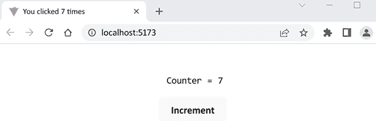

图 8.10：自定义钩子

你现在已经掌握了 React 钩子（hooks）的基本知识以及如何创建你自己的自定义钩子。

# 上下文 API

如果你的组件树很深且复杂，使用属性传递数据可能会很麻烦。你必须通过组件树中的所有组件传递数据。**上下文 API** 解决了这个问题，并且建议用于需要在整个组件树中的多个组件中使用 *全局* 数据——例如，主题或认证用户。

**上下文**是通过 `createContext` 方法创建的，该方法接受一个参数来定义默认值。你可以为上下文创建自己的文件，代码如下：

```java
import React from 'react';
const AuthContext = React.createContext('');
export default AuthContext; 
```

接下来，我们将使用上下文提供者组件，它使我们的上下文对其他组件可用。上下文提供者组件有一个 `value` 属性，它将被传递给消费组件。在以下示例中，我们使用上下文提供者组件包裹了 `<MyComponent />`，因此 `userName` 值在我们的组件树中的 `<MyComponent />` 下可用：

```java
import React from 'react';
import AuthContext from './AuthContext';
import MyComponent from './MyComponent';
function App() {
  // User is authenticated and we get the username
  const userName = 'john';
  return (
    <AuthContext.Provider value={userName}>
      <MyComponent />
    </AuthContext.Provider>
  );
};
export default App; 
```

现在，我们可以通过使用 `useContext()` 钩子在任何组件树中的组件中访问提供的值，如下所示：

```java
import React from 'react';
import AuthContext from './AuthContext';
function MyComponent() {
  const authContext = React.useContext(AuthContext);
  return(
    <>
      Welcome {authContext}
    </>
  );
}
export default MyComponent; 
```

组件现在渲染了 `Welcome` `john` 文本。

# 使用 React 处理列表

对于列表处理，我们将学习 JavaScript 的`map()`方法，这在您必须操作列表时非常有用。`map()`方法创建一个新的数组，该数组包含对原始数组中每个元素调用函数的结果。在下面的示例中，每个数组元素都乘以`2`：

```java
const arr = [1, 2, 3, 4];
const resArr = arr.map(x => x * 2); // resArr = [2, 4, 6, 8] 
```

以下示例代码演示了一个组件，该组件将整数数组转换为列表项数组，并在`ul`元素内渲染这些项：

```java
import React from 'react';
function MyList() {
  const data = [1, 2, 3, 4, 5];

  return (
    <>
      <ul>
        {
        data.map((number) =>
          <li>Listitem {number}</li>)
        }
      </ul>
    </>
  );
};
export default MyList; 
```

以下截图显示了组件渲染后的样子。如果您打开控制台，您可以看到一个警告（**列表中的每个子项都应该有一个唯一的** **"****key****"** **属性**）：

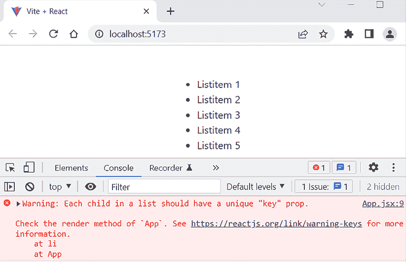

图 8.11：React 列表组件

React 中的列表项需要一个**唯一键**，该键用于检测已更新、添加或删除的行。`map()`方法也有`index`作为第二个参数，我们用它来处理警告：

```java
function MyList() {
  const data = [1, 2, 3, 4, 5];
  return (
    <>
      <ul>
        {
        data.map((number, **index**) =>
          <li **key****=****{index}**>Listitem {number}</li>)
        }
      </ul>
    </>
  );
};
export default MyList; 
```

现在，添加了键之后，控制台中没有警告。

不建议使用`index`，因为如果列表被重新排序或添加或删除列表项，它可能会导致错误。相反，如果存在，您应该使用数据中的唯一键。还有一些库可供您使用，例如**uuid**([`github.com/uuidjs/uuid`](https://github.com/uuidjs/uuid))来生成唯一 ID。

如果数据是对象数组，以表格格式呈现会更好。我们以与列表相同的方式执行此操作，但现在我们只是将数组映射到表格行（`tr`元素）并在`table`元素内渲染这些行，如下面的组件代码所示。现在数据中有一个唯一的 ID，因此我们可以将其用作键：

```java
function MyTable() {
  const data = [
    {id: 1, brand: 'Ford', model: 'Mustang'},
    {id: 2, brand: 'VW', model: 'Beetle'},
    {id: 3, brand: 'Tesla', model: 'Model S'}];
  return (
    <>
      <table>
        <tbody>
        {
        data.map((item) =>
          <tr key={item.id}>
            <td>{item.brand}</td><td>{item.model}</td>
          </tr>)
        }
        </tbody>
      </table>
    </>
  );
};
export default MyTable; 
```

以下截图显示了组件渲染后的样子。您应该在 HTML 表格中看到数据：

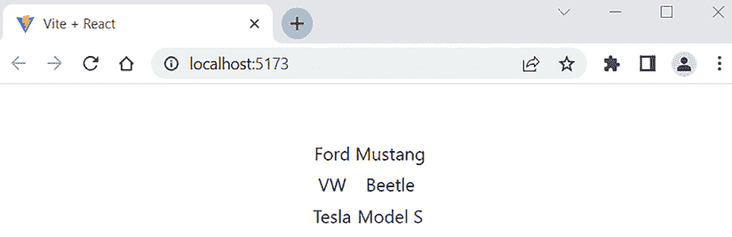

图 8.12：React 表格

现在，我们已经学习了如何使用`map()`方法处理列表数据，以及如何使用例如 HTML `table`元素来渲染它。

# 使用 React 处理事件

React 中的事件处理类似于处理 DOM 元素事件。与 HTML 事件处理相比，区别在于 React 中事件命名使用*camelCase*。以下示例组件代码向按钮添加事件监听器，并在按钮被按下时显示警告消息：

```java
function MyComponent() {
  // This is called when the button is pressed
  const handleClick = () => {
    alert('Button pressed');
  }
  return (
    <>
      <button onClick={handleClick}>Press Me</button>
    </>
  );
};
export default MyComponent; 
```

正如我们在前面的计数器示例中学到的那样，您必须将函数传递给事件处理器而不是调用它。现在，`handleClick`函数在`return`语句外部定义，我们可以通过函数名来引用它：

```java
// Correct
<button onClick={handleClick}>Press Me</button>
// Wrong
<button onClick={handleClick()}>Press Me</button> 
```

在 React 中，您不能从事件处理器返回`false`以防止默认行为。相反，您应该调用事件对象的`preventDefault()`方法。在以下示例中，我们使用一个`form`元素，我们想要防止表单提交：

```java
function MyForm() {
  // This is called when the form is submitted
  const handleSubmit = (event) => {
    event.preventDefault(); // Prevents default behavior
    alert('Form submit');
  }
  return (
    <form onSubmit={handleSubmit}>
      <input type="submit" value="Submit" />
    </form>
  );
};
export default MyForm; 
```

现在，当您按下**提交**按钮时，您可以看到警告，并且表单将不会提交。

# 使用 React 处理表单

在 React 中处理表单略有不同。一个 HTML `form`在提交时会导航到下一页。在 React 中，我们通常希望在提交后调用一个可以访问表单数据的 JavaScript 函数，并避免导航到下一页。我们已经在上一节中介绍了如何使用`preventDefault()`来避免提交。

让我们首先创建一个包含一个输入字段和一个**提交**按钮的最简表单。为了获取输入字段的值，我们使用`onChange`事件处理程序。我们使用`useState`钩子创建一个名为`text`的状态变量。当输入字段的值发生变化时，新值将被保存到状态中。这个组件被称为**受控组件**，因为表单数据由 React 处理。在非受控组件中，表单数据仅由 DOM 处理。

`setText(event.target.value)`语句从`input`字段获取值并将其保存到状态中。最后，当用户按下**提交**按钮时，我们将显示输入的值。以下是我们的第一个表单的源代码：

```java
import { useState } from 'react';
function MyForm() {
  const [text, setText] = useState('');
  // Save input element value to state when it has been changed
  const handleChange = (event) => {
    setText(event.target.value);
  }
  const handleSubmit = (event) => {
    alert(`You typed: ${text}`);
    event.preventDefault();
  }
  return (
    <form onSubmit={handleSubmit}>
      <input type="text" onChange={handleChange}
          value={text}/>
      <input type="submit" value="Press me"/>
    </form>
  );
};
export default MyForm; 
```

在按下**提交**按钮后，这是我们的表单组件的截图：

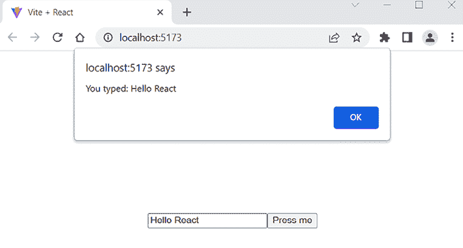

图 8.13：表单组件

你也可以使用 JSX 编写内联`onChange`处理程序函数，如下例所示。如果你有一个简单的处理程序函数，这是一种相当常见的做法，它可以使你的代码更易于阅读：

```java
return (
  <form onSubmit={handleSubmit}>
    <input
      type="text"
      onChange={event => setText(event.target.value)}
      value={text}/
    >
    <input type="submit" value="Press me"/>
  </form>
); 
```

现在是查看 React 开发者工具的好时机，这对于调试 React 应用非常有用。

如果你还没有安装 React 开发者工具，你可以在*第七章*中找到说明，*设置环境和工具 – 前端*。

如果我们用我们的 React 表单应用打开 React 开发者工具的**组件**标签，并在输入字段中输入一些内容，我们可以看到状态值是如何变化的，并且我们可以检查 props 和状态当前的值。

以下截图显示了我们在输入字段中输入内容时状态是如何变化的：

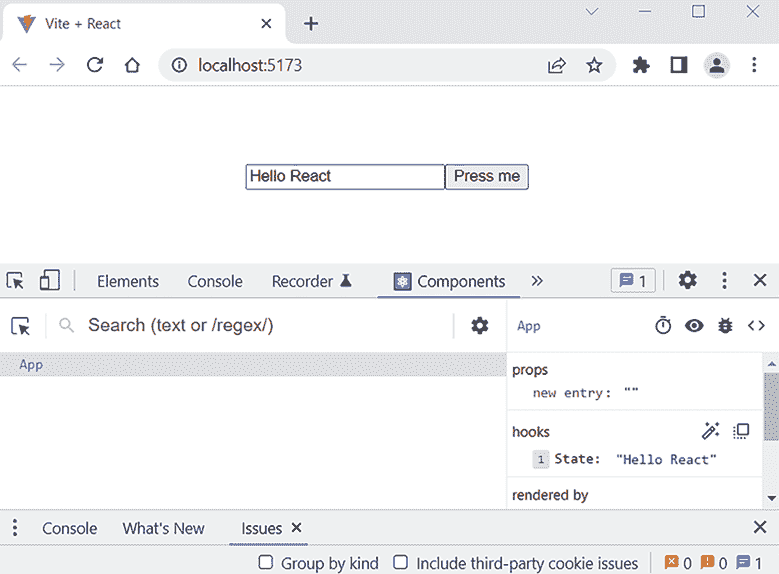

图 8.14：React 开发者工具

```java
user state is an object with three attributes: firstName, lastName, and email:
```

```java
const [user, setUser] = useState({
  firstName: '',
  lastName: '',
  email: ''
}); 
```

处理多个输入字段的一种方法是为每个输入字段添加尽可能多的更改处理程序，但这会创建大量的样板代码，我们希望避免。因此，我们在输入字段中添加`name`属性。我们可以在更改处理程序中使用这些属性来识别哪个输入字段触发了更改处理程序。`input`元素的`name`属性值必须与我们想要保存值的 state 对象属性的名称相同，值属性应该是`object.property`，例如，在姓氏输入元素中。代码如下所示：

```java
<input type="text" **name=****"lastName"** onChange={handleChange}
  **value={user.lastName****}/**> 
```

现在，如果触发处理器的输入字段是姓氏字段，那么 `event.target.name` 就是 `lastName`，并且输入的值将被保存到状态对象的 `lastName` 字段。在这里，我们还将使用在 *Props 和状态* 部分中引入的对象展开运算符。这样，我们可以使用一个更改处理器来处理所有输入字段：

```java
const handleChange = (event) => {
  setUser({...user, [event.target.name]:
      event.target.value});
} 
```

这是组件的完整源代码：

```java
import { useState } from 'react';
function MyForm() {
  const [user, setUser] = useState({
    firstName: '',
    lastName: '',
    email: ''
  });
  // Save input box value to state when it has been changed
  const handleChange = (event) => {
    setUser({...user, [event.target.name]:
        event.target.value});
  }
  const handleSubmit = (event) => {
    alert(`Hello ${user.firstName} ${user.lastName}`);
    event.preventDefault();
  }
  return (
    <form onSubmit={handleSubmit}>
      <label>First name </label>
      <input type="text" name="firstName" onChange=
          {handleChange}
        value={user.firstName}/><br/>
      <label>Last name </label>
      <input type="text" name="lastName" onChange=
          {handleChange}
        value={user.lastName}/><br/>
      <label>Email </label>
      <input type="email" name="email" onChange=
          {handleChange}
        value={user.email}/><br/>
      <input type="submit" value="Submit"/>
    </form>
  );
};
export default MyForm; 
```

这是提交按钮被按下后我们的表单组件的截图：

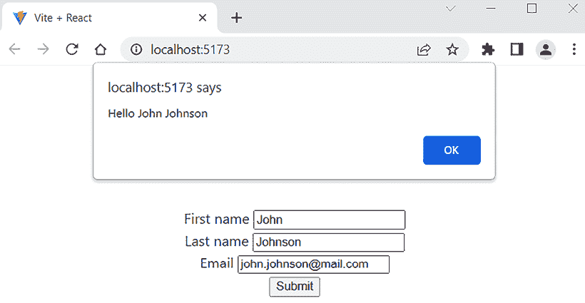

图 8.15：React 表单组件

```java
onChange event handler, we call the correct update function to save values into the states. In this case, we don’t need the name input element’s name attribute:
```

```java
import { useState } from 'react';
function MyForm() {
  const [firstName, setFirstName] = useState('');
  const [lastName, setLastName] = useState('');
  const [email, setEmail] = useState('');
  const handleSubmit = (event) => {
    alert('Hello ${firstName} ${lastName}');
    event.preventDefault();
  }
  return (
    <form onSubmit={handleSubmit}>
      <label>First name </label>
      <input
        onChange={e => setFirstName(e.target.value)}
        value={firstName}/><br/>
      <label>Last name </label>
      <input
        onChange={e => setLastName(e.target.value)}
        value={lastName}/><br/>
      <label>Email </label>
      <input
        onChange={e => setEmail(e.target.value)}
        value={email}/><br/>
      <input type="submit" value="Press me"/>
    </form>
  );
};
export default MyForm; 
```

我们现在知道了如何使用 React 处理表单，我们将在实现前端时使用这些技能。

# 摘要

在本章中，我们开始学习 React，我们将使用它来构建我们的前端。在我们的前端开发中，我们将使用 ES6，这使得我们的代码更简洁，正如我们在本章中看到的。在开始使用 React 进行开发之前，我们涵盖了基础知识，例如 React 组件、JSX、props、state 和 hooks。然后我们探讨了进一步开发所需的功能。我们学习了条件渲染和上下文，以及如何使用 React 处理列表、表单和事件。

在下一章中，我们将专注于 TypeScript 与 React。我们将学习 TypeScript 的基础知识以及如何在我们的 React 项目中使用它。

# 问题

1.  什么是 React 组件？

1.  状态和 props 是什么？

1.  React 应用程序中的数据是如何流动的？

1.  无状态组件和有状态组件有什么区别？

1.  JSX 是什么？

1.  React 钩子是如何命名的？

1.  上下文是如何工作的？

# 进一步阅读

这里有一些其他关于学习 React 的好资源：

+   *《React 完全指南》*，作者 Maximilian Schwarzmüller ([`www.packtpub.com/product/react-the-complete-guide-includes-hooks-react-router-and-redux-2021-updated-second-edition-video/9781801812603`](https://www.packtpub.com/product/react-the-complete-guide-includes-hooks-react-router-and-redux-2021-updated-second-edition-video/9781801812603))

+   *《2023 年终极 React 课程》*，作者 Jonas Schmedtmann ([`www.udemy.com/course/the-ultimate-react-course/`](https://www.udemy.com/course/the-ultimate-react-course/))

# 在 Discord 上了解更多

要加入这本书的 Discord 社区——在那里你可以分享反馈、向作者提问，并了解新发布的内容——请扫描下面的二维码：

[`packt.link/FullStackSpringBootReact4e`](https://packt.link/FullStackSpringBootReact4e)


