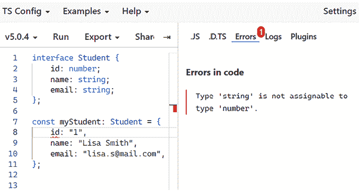

# 第九章：TypeScript 简介

本章介绍了 TypeScript。我们将涵盖使用 TypeScript 与 React 一起使用所需的基本技能，并使用 TypeScript 创建我们的第一个 React 应用程序。

在本章中，我们将探讨以下主题：

+   理解 TypeScript

+   在 React 中使用 TypeScript 功能

+   使用 TypeScript 创建 React 应用程序

# 技术要求

对于我们的工作，需要 React 版本 18 或更高版本。

您可以在本章的 GitHub 链接中找到更多资源：[`github.com/PacktPublishing/Full-Stack-Development-with-Spring-Boot-3-and-React-Fourth-Edition/tree/main/Chapter09`](https://github.com/PacktPublishing/Full-Stack-Development-with-Spring-Boot-3-and-React-Fourth-Edition/tree/main/Chapter09)。

# 理解 TypeScript

**TypeScript** ([`www.typescriptlang.org/`](https://www.typescriptlang.org/)) 是由微软开发的 JavaScript 的强类型超集。近年来，TypeScript 的采用率增长了很多，并且在业界得到了广泛的应用。它有一个活跃的开发社区，并且得到了大多数流行库的支持。在 JetBrains 2022 开发者生态系统报告中，TypeScript 被命名为增长最快的编程语言 ([`www.jetbrains.com/lp/devecosystem-2022/`](https://www.jetbrains.com/lp/devecosystem-2022/))。

与 JavaScript 相比，TypeScript 提供了几个优势，这主要归功于强类型：

+   TypeScript 允许您为变量、函数和类定义 **类型**。这允许您在开发过程中早期捕获错误。

+   TypeScript 提高了您应用程序的可扩展性，并使您的代码更容易维护。

+   TypeScript 提高了代码的可读性，并使您的代码更具自文档化特性。

与 JavaScript 相比，如果您不熟悉静态类型，TypeScript 的学习曲线可能会更陡峭。

尝试 TypeScript 最简单的方法是使用在线环境，例如 *TypeScript Playground* ([`www.typescriptlang.org/play`](https://www.typescriptlang.org/play))。如果您想在本地编写 TypeScript 代码，可以使用 `npm` 在您的计算机上安装 TypeScript 编译器。这在我们 React 项目中不是必需的，因为 Vite 内置了 TypeScript 支持。TypeScript 被转换为纯 JavaScript，然后可以在 JavaScript 引擎中执行。

以下 `npm` 命令全局安装最新版本的 TypeScript，允许您在任何终端中使用 TypeScript：

```java
npm install -g typescript 
```

您可以通过检查 TypeScript 版本号来验证安装：

```java
tsc --version 
```

如果您正在使用 Windows PowerShell，可能会收到一个错误，表明 **在此系统上已禁用脚本运行**。在这种情况下，您必须更改执行策略才能运行安装命令。您可以在 [`go.microsoft.com/fwlink/?LinkID=135170`](https://go.microsoft.com/fwlink/?LinkID=135170) 上了解更多信息。

与 JavaScript 类似，TypeScript 拥有良好的 IDE 支持，这使得你的编码更加高效，具有诸如代码检查和代码自动补全等特性——例如，Visual Studio Code 中的 IntelliSense。

## 常见类型

当你初始化变量时，TypeScript 会自动定义变量的类型。这被称为**类型推断**。在以下示例中，我们声明了一个`message`变量并将其赋值为字符串值。如果我们尝试将其重新赋值为其他类型，我们会得到一个错误，如下面的图片所示：


图 9.1：类型推断

TypeScript 有以下原始类型：`string`，`number`，和`boolean`。`number`类型代表整数和浮点数。你还可以使用以下语法为变量设置显式类型：

```java
let variable_name: type; 
```

以下代码演示了显式类型定义：

```java
let email: string;
let age: number;
let isActive: boolean; 
```

可以使用`typeof`关键字检查变量的类型，它返回一个表示应用到的变量类型的字符串：

```java
// Check variable type
console.log(typeof email); // Output is "string"
typeof email === "string" // true
typeof age === "string" // false 
```

如果你不知道变量的类型，你可以使用`unknown`类型。当你从外部源获取值时，例如，你不知道它的类型，可以使用它：

```java
let externalValue: unknown; 
```

当一个值赋给未知变量时，你可以使用`typeof`关键字检查其类型。

TypeScript 还提供了`any`类型。如果你使用`any`类型定义一个变量，TypeScript 不会对该变量执行类型检查或推断。你应该尽可能避免使用`any`类型，因为它会抵消 TypeScript 的效果。

**数组**可以像 JavaScript 中一样声明，但你必须定义数组中元素的类型：

```java
let arrayOfNums: number[] = [1, 2, 3, 4];
let animals: string[] = ["Dog", "Cat", "Tiger"]; 
```

你还可以以下这种方式使用`Array`泛型类型（`Array<TypeOfElement>`）：

```java
let arrayOfNums: Array<number> = [1, 2, 3, 4];
let animals: Array<string> = ["Dog", "Cat", "Tiger"]; 
```

类型推断也适用于对象。如果你创建以下对象，TypeScript 会创建一个具有以下推断类型的对象：`id: number`，`name: string`，和`email: string`：

```java
const student = {
  id: 1,
  name: "Lisa Smith ",
  email: "lisa.s@mail.com ",
}; 
```

你也可以使用`interface`或`type`关键字定义一个对象，它描述了对象的形状。`type`和`interface`非常相似，大多数情况下你可以自由选择使用哪一个：

```java
// Using interface
interface Student {
    id: number;
    name: string;
    email: string;
};
// Or using type
type Student = {
    id: number;
    name: string;
    email: string;
}; 
```

然后，你可以声明一个符合`Student`接口或类型的对象：

```java
const myStudent: Student = {
    id: 1,
    name: "Lisa Smith ",
    email: "lisa.s@mail.com ",
}; 
```

你可以在 TypeScript 文档中了解更多关于`type`和`interface`之间差异的信息：[`www.typescriptlang.org/docs/handbook/2/everyday-types.html#differences-between-type-aliases-and-interfaces`](https://www.typescriptlang.org/docs/handbook/2/everyday-types.html#differences-between-type-aliases-and-interfaces)。

现在，如果你尝试创建一个不符合接口或类型的对象，你会得到一个错误。在下一张图片中，我们创建了一个对象，其中`id`属性值是`string`，但在接口中定义为`number`：



图 9.2：接口

你可以通过在属性名末尾使用问号 (`?`) 来定义可选属性。在以下示例中，我们将 `email` 标记为可选。现在，你可以创建一个没有电子邮件的学生对象，因为它是一个可选属性：

```java
type Student = {
    id: number;
    name: string;
    email?: string;
};
// Student object without email
const myStudent: Student = {
    id: 1,
    name: "Lisa Smith"
} 
```

**可选链操作符** (`?.`) 可以用来安全地访问可能为 `null` 或 `undefined` 的对象属性和方法，而不会导致错误。这对于可选属性非常有用。让我们看看以下类型，其中 `address` 是可选的：

```java
type Person = {
    name: string,
    email: string;
    address?: {
        street: string;
        city: string;
    }
} 
```

你可以基于 `Person` 类型创建一个没有定义 `address` 属性的对象：

```java
const person: Person = { 
    name: "John Johnson",
    email: "j.j@mail.com"
} 
```

现在，如果你尝试访问 `address` 属性，将会抛出一个错误：

```java
// Error is thrown
console.log(person.address.street); 
```

然而，如果你使用可选链，控制台将打印出值 `undefined`，而不会抛出错误：

```java
// Output is undefined
console.log(person.address?.street); 
```

在 TypeScript 中，有许多方式可以组合类型。你可以使用 `|` 运算符来创建一个 **联合类型**，它处理不同的类型。例如，以下示例定义了一个可以包含字符串或数字的类型：

```java
type InputType = string | number;
// Use your type
let name: InputType = "Hello";
let age: InputType = 12; 
```

你也可以使用联合类型来定义字符串或数字的集合，如下面的示例所示：

```java
type Fuel = "diesel" | "gasoline" | "electric ";
type NoOfGears = 5 | 6 | 7; 
```

现在，我们可以以以下方式使用我们的联合类型：

```java
type Car = {
  brand: string;
  fuel: Fuel;
  gears: NoOfGears;
} 
```

如果你创建一个新的 `Car` 对象并尝试分配 `Fuel` 或 `NoOfGears` 联合类型中未定义的其他值，你会得到一个错误。

## 函数

当你定义函数时，你可以按以下方式设置参数类型：

```java
function sayHello(**name: string**) {
  console.log("Hello " + name);
} 
```

如果你现在尝试使用不同的参数类型来调用函数，你会得到一个错误：


图 9.3：函数调用

如果函数参数类型未定义，它隐式地具有 `any` 类型。你还可以在函数参数中使用联合类型：

```java
function checkId(**id: string | number**) {
  if (typeof id === "string ")
    // do something
  else
    // do something else
} 
```

函数的返回类型可以声明如下：

```java
function calcSum(x: number, y: number): **number** {
  return x + y;
} 
```

箭头函数在 TypeScript 中的工作方式相同，例如：

```java
const calcSum = (x:number, y:number): number => x + y; 
```

如果箭头函数没有返回任何内容，你可以使用 `void` 关键字：

```java
const sayHello = (name: string): void => console.log("Hello " + name); 
```

现在，你已经遇到了一些 TypeScript 基础知识，我们将学习如何在我们的 React 应用程序中应用这些新技能。

# 在 React 中使用 TypeScript 功能

TypeScript 是你 React 项目的宝贵补充，尤其是在它们变得复杂时。在本节中，我们将学习如何在我们的 React 组件中获得属性和状态类型验证，并在开发早期检测潜在的错误。

## 状态和属性

在 React 中，你必须定义组件属性的类型。我们已经了解到组件属性是 JavaScript 对象，因此我们可以使用 `type` 或 `interface` 来定义属性类型。

让我们看看一个例子，其中组件接收一个 `name` (`string`) 和 `age` (`number`) 属性：

```java
function HelloComponent({ name, age }) {
  return(
    <>
      Hello {name}, you are {age} years old!
    </>
  );
}
export default HelloComponent; 
```

现在，我们可以渲染我们的 `HelloComponent` 并将其属性传递给它：

```java
// imports...
function App() {
  return(
    <HelloComponent name="Mary" age={12} />
  )
}
export default App; 
```

如果我们使用 TypeScript，我们可以首先创建一个 `type` 来描述我们的属性：

```java
type HelloProps = {
  name: string;
  age: number;
}; 
```

然后，我们可以在组件属性中使用我们的 `HelloProps` 类型：

```java
function HelloComponent({ name, age }: **HelloProps**) {
  return(
    <>
      Hello {name}, you are {age} years old!
    </>
  );
}
export default HelloComponent; 
```

现在，如果我们使用错误的类型传递属性，我们会得到一个错误。这很好，因为现在我们可以在开发阶段捕获潜在的错误：


图 9.4：输入 props

如果我们使用了 JavaScript，在这个阶段我们不会看到错误。在 JavaScript 中，如果我们把字符串作为`age`prop 而不是数字传递，它仍然可以工作，但如果我们稍后尝试对其进行数值操作，可能会遇到意外的行为或错误。

如果有可选的 props，你可以在定义 props 的类型时使用问号来标记这些 props - 例如，如果`age`是可选的：

```java
type HelloProps = {
  name: string;
  **age?**: number;
}; 
```

现在，你可以使用你的组件，带有或不带有`age`props。

如果你想要通过 props 传递一个函数，你可以在你的`type`中定义它，使用以下语法：

```java
// Function without parameters 
type HelloProps = {
  name: string;
  age: number;
  **fn****:** **() =>****void****;**
};
// Function with parameters
type HelloProps = {
  name: string;
  age: number;
  **fn****:** **(msg: string) =>** **void****;**
}; 
```

很常见的情况是你想在应用中的多个文件中使用相同的`type`。在这种情况下，将类型提取到它们自己的文件并导出它们是一个好习惯：

```java
// types.ts file
export type HelloProps = {
  name: string;
  age: number;
}; 
```

然后，你可以将类型导入到任何需要它的组件中：

```java
// Import type and use it in your component
import { HelloProps } from ./types;
function HelloComponent({ name, age }: HelloProps) {
  return(
    <>
      Hello {name}, you are {age} years old!
    </>
  );
}
export default HelloComponent; 
```

正如我们在第八章中提到的，你还可以使用箭头函数来创建一个函数组件。有一个标准的 React 类型，`FC`（**函数组件**），我们可以与箭头函数一起使用。这个类型接受一个泛型参数，指定了 prop 类型，在我们的例子中是`HelloProps`：

```java
import React from 'react';
import { HelloProps } from './types';
const HelloComponent: React.FC<HelloProps> = ({ name, age }) => {
  return (
    <>
      Hello {name}, you are {age} years old!
    </>
  );
};
export default HelloComponent; 
```

现在，你已经学会了如何在你的 React 应用中定义 prop 类型，所以我们将继续到状态。当你使用我们在第八章中学习的`useState`钩子创建状态时，类型推断会在你使用常见原始类型时处理类型。例如：

```java
// boolean
const [isReady, setReady] = useState(false);
// string
const [message, setMessage] = useState("");
// number
const [count, setCount] = useState(0); 
```

如果你尝试使用不同的类型来更新状态，你会得到一个错误：


图 9.5：输入状态

你还可以显式地定义状态类型。如果你想将你的状态初始化为`null`或`undefined`，你必须这样做。在这种情况下，你可以使用联合操作符，语法如下：

```java
const [message, setMessage] = useState<string | undefined>(undefined); 
```

如果你有一个复杂的状态，你可以使用`type`或`interface`。在下面的例子中，我们创建了一个描述用户的类型。然后，我们创建了一个状态，并用一个空的`User`对象初始化它。如果你想允许`null`值，你可以使用联合来允许`User`对象或`null`值：

```java
type User = {
  id: number;
  name: string;
  email: number;
};
// Use type with state, the initial value is an empty User object
const [user, setUser] = useState<User>({} as User);
// If null values are accepted
const [user, setUser] = useState<User | null>(null); 
```

## 事件

在第八章中，我们学习了如何在 React 应用中读取用户输入。我们使用了输入元素的`onChange`事件处理程序来将输入的数据保存到状态中。当使用 TypeScript 时，我们必须定义事件类型。在下面的屏幕截图中，你可以看到如果没有定义类型，我们会得到一个错误：


图 9.6：输入事件

让我们看看我们如何处理一个输入元素的更改事件。让我们看一个例子，其中`return`语句中的输入元素代码如下：

```java
<input 
  type="text" 
  onChange={handleChange} 
  value={name} 
/> 
```

当用户在输入元素中输入某些内容时，会调用事件处理函数，代码如下：

```java
const handleChange = (event) => {
  setName(event.target.value);
} 
```

现在，我们必须定义事件类型。为此，我们可以使用预定义的`React.ChangeEvent`类型。

你可以在 React TypeScript Cheatsheet 中阅读事件类型的完整列表：[`react-typescript-cheatsheet.netlify.app/docs/basic/getting-started/forms_and_events/`](https://react-typescript-cheatsheet.netlify.app/docs/basic/getting-started/forms_and_events/).

我们想要处理一个输入元素的 change 事件，所以类型如下：

```java
const handleChange = (event: **React.ChangeEvent<HTMLInputElement>**) => {
  setName(event.target.value);
} 
```

表单提交处理函数处理表单提交。这个函数应该接受一个类型为`React.FormEvent<HTMLFormElement>`的事件参数：

```java
const handleSubmit = (event: **React.FormEvent<HTMLFormElement>**) => {
  event.preventDefault();
  alert(`Hello ${name}`);
} 
```

现在，我们知道如何在我们的 React 应用中使用 TypeScript 处理事件。接下来，我们将学习如何实际创建一个使用 TypeScript 的 React 应用。

# 使用 TypeScript 创建 React 应用

现在，我们将使用 Vite 创建一个 React 应用，我们将使用 TypeScript 而不是 JavaScript。当我们在我们的汽车后端开发前端时，我们将使用 TypeScript。正如我们之前提到的，Vite 自带内置的 TypeScript 支持：

1.  使用以下命令创建一个新的 React 应用：

    ```java
    npm create vite@latest 
    ```

1.  接下来，将你的项目命名为`tsapp`，并选择**React**框架和**TypeScript**变体：


图 9.7：React TypeScript 应用

1.  然后，转到你的应用文件夹，安装依赖项，并使用以下命令运行你的应用：

    ```java
    cd tsapp
    npm install
    npm run dev 
    ```

1.  在 VS Code 中打开你的应用文件夹，你会看到我们的`App`组件的文件名是`App.tsx`：

    图 9.8：App.tsx

    TypeScript React 文件的文件扩展名是`.tsx`（将 JSX 与 TypeScript 结合）。TypeScript 文件的常规文件扩展名是`.ts`。

1.  在你的项目根目录中找到`tsconfig.json`文件。这是一个由 TypeScript 使用的配置文件，用于指定编译器选项，例如编译输出的目标版本或使用的模块系统。我们可以使用 Vite 定义的默认设置。

    让我们创建一个 React 应用，这是我们之前在定义事件类型时作为示例使用的。用户可以输入一个名字，当按钮被按下时，会使用 alert 显示 hello 消息：

1.  首先，我们将从`App.tsx`文件的返回语句中删除代码，只留下片段。在删除所有未使用的导入（除了`useState`导入）之后，你的代码应该看起来像以下这样：

    ```java
    import { useState } from 'react';
    import './App.css';
    function App() {
      return (
        <>
        </>
      )
    }
    export default App; 
    ```

1.  接下来，创建一个`state`来存储用户输入到输入元素中的值：

    ```java
    function App() {
      **const** **[name, setName] =** **useState****(****""****);**
      return (
        <>
        </>
      )
    } 
    ```

1.  之后，在`return`语句中添加两个输入元素，一个用于收集用户输入，另一个用于提交表单：

    ```java
    // App.tsx return statement
    return (
      <>
        <form onSubmit={handleSubmit}>
          <input
            type="text"
            value={name}
            onChange={handleChange}
          />
          <input type="submit" value="Submit"/>
        </form>
      </>
    ) 
    ```

1.  接下来，创建事件处理函数，`handleSubmit`和`handleChange`。现在，我们还需要定义事件类型：

    ```java
    // imports
    function App() {
      const [name, setName] = useState("");
      const handleChange = (event: React.ChangeEvent<HTMLInputElement>) => {
        setName(event.target.value);
      }
      const handleSubmit = (event: React.FormEvent<HTMLFormElement>) => {
        event.preventDefault();
        alert(`Hello ${name}`);
      }
    // continue... 
    ```

1.  使用`npm run dev`命令运行应用。

1.  尝试将你的名字输入到输入元素中，然后按下**提交**按钮。你应该能看到显示你名字的 hello 消息：


图 9.9：React TypeScript 应用

## Vite 和 TypeScript

Vite 将 TypeScript 文件转换为 JavaScript，但它不执行类型检查。Vite 使用 **esbuild** 来转换 TypeScript 文件，因为它的速度比 TypeScript 编译器 (`tsc`) 快得多。

VS Code IDE 为我们处理类型检查，你应该修复 IDE 中显示的所有错误。你还可以使用一个名为 `vite-plugin-checker` 的 Vite 插件 ([`github.com/fi3ework/vite-plugin-checker`](https://github.com/fi3ework/vite-plugin-checker))。类型检查在我们构建 Vite 应用到生产环境时进行，所有错误应在生产构建之前修复。我们将在本书的后面部分构建我们的 Vite 应用。

# 摘要

在本章中，我们开始学习 TypeScript 以及如何在我们的 React 应用中使用它。现在，我们知道了如何在 TypeScript 中使用常见类型，以及如何为 React 组件的 props 和 states 定义类型。我们还学习了如何为事件定义类型，并使用 Vite 创建了我们的第一个带有 TypeScript 的 React 应用。

在下一章中，我们将专注于使用 React 进行网络编程。我们还将使用 GitHub REST API 来学习如何使用 React 消费 RESTful 网络服务。

# 问题

1.  什么是 TypeScript？

1.  我们如何定义变量类型？

1.  我们如何在函数中定义类型？

1.  我们如何为 React 的 props 和 states 定义类型？

1.  我们如何定义事件类型？

1.  我们如何使用 Vite 创建一个 React TypeScript 应用？

# 进一步阅读

这里有一些学习 React 与 TypeScript 的其他有用资源：

+   React TypeScript Cheatsheets ([`react-typescript-cheatsheet.netlify.app/`](https://react-typescript-cheatsheet.netlify.app/))

+   *《用 TypeScript 学习 React，第二版》*，作者 Carl Rippon ([`www.packtpub.com/product/learn-react-with-typescript-second-edition/9781804614204`](https://www.packtpub.com/product/learn-react-with-typescript-second-edition/9781804614204))

+   *《精通 TypeScript》*，作者 Nathan Rozentals ([`www.packtpub.com/product/mastering-typescript-fourth-edition/9781800564732`](https://www.packtpub.com/product/mastering-typescript-fourth-edition/9781800564732))

# 在 Discord 上了解更多

要加入本书的 Discord 社区——在那里你可以分享反馈、向作者提问，并了解新版本——请扫描下面的二维码：

[`packt.link/FullStackSpringBootReact4e`](https://packt.link/FullStackSpringBootReact4e)


