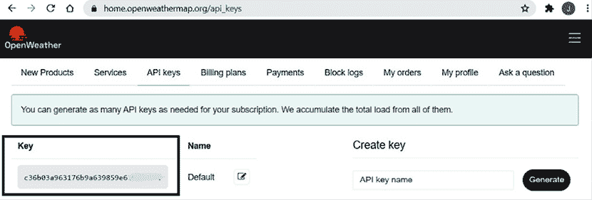
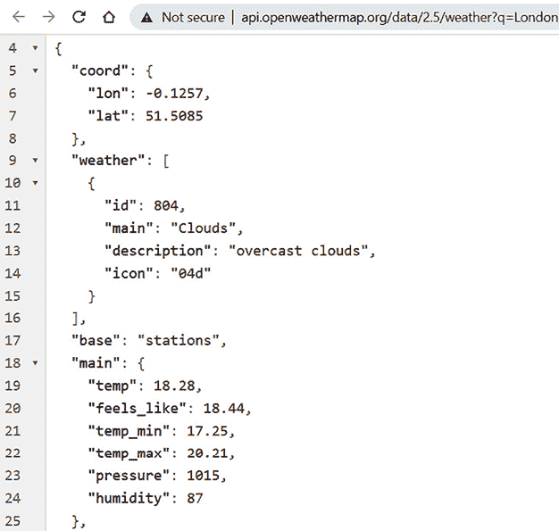
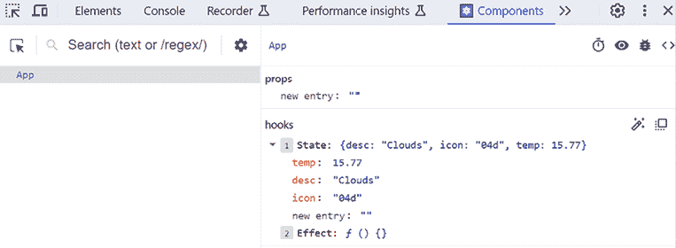
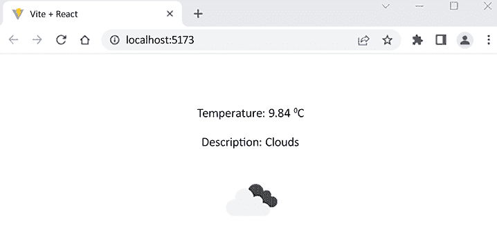
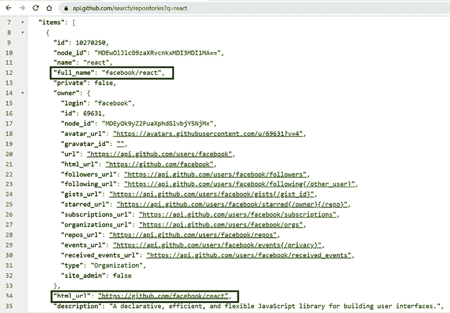
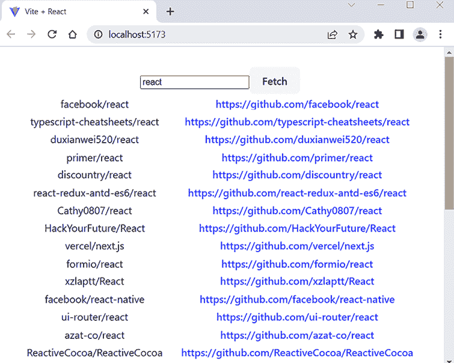
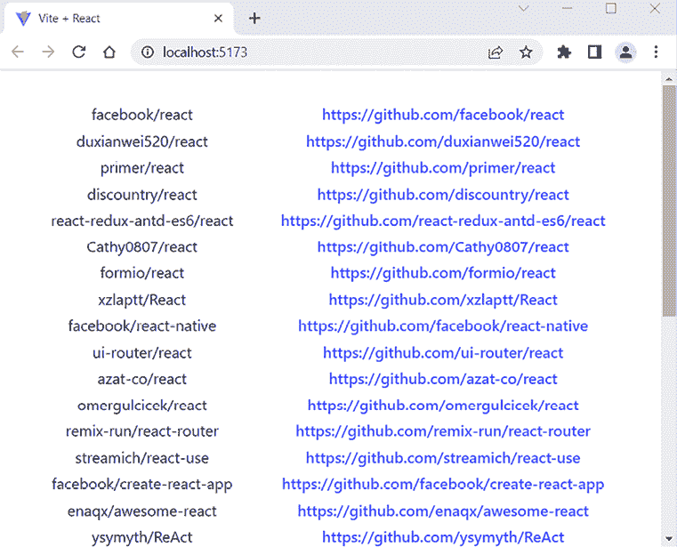

# 10

# 使用 React 消费 REST API

本章解释了使用 React 进行网络操作。这是一个在大多数 React 应用中都需要的重要技能。我们将学习承诺，它可以使异步代码更简洁、更易读。对于网络操作，我们将使用`fetch`和 Axios 库。作为一个例子，我们将使用 OpenWeather 和 GitHub REST API 来展示如何使用 React 消费 RESTful Web 服务。我们还将看到 React Query 库的实际应用。

在本章中，我们将涵盖以下主题：

+   承诺

+   使用`fetch` API

+   使用 Axios 库

+   实际示例

+   处理竞态条件

+   使用 React Query 库

# 技术要求

以下 GitHub 链接将需要：[`github.com/PacktPublishing/Full-Stack-Development-with-Spring-Boot-3-and-React-Fourth-Edition/tree/main/Chapter10`](https://github.com/PacktPublishing/Full-Stack-Development-with-Spring-Boot-3-and-React-Fourth-Edition/tree/main/Chapter10)。

# 承诺

处理异步操作的传统方式是使用**回调函数**来处理操作的成功或失败。如果操作成功，则调用`success`函数；否则，调用`failure`函数。以下（抽象）示例展示了使用回调函数的想法：

```java
function doAsyncCall(success,  failure) {
  // Do some API call
  if (SUCCEED)
    success(resp);
  else
    failure(err);
}
success(response) {
  // Do something with response
}
failure(error) {
  // Handle error
}
doAsyncCall(success, failure); 
```

现在，**承诺**是 JavaScript 异步编程的一个基本部分。承诺是一个表示异步操作结果的对象。使用承诺可以简化执行异步调用时的代码。承诺是非阻塞的。如果你正在使用不支持承诺的较旧库进行异步操作，代码将变得难以阅读和维护。在这种情况下，你将面临多个嵌套的回调，这些回调非常难以阅读。错误处理也将变得困难，因为你将不得不在每个回调中检查错误。

如果我们使用的 API 或库支持承诺，我们可以使用承诺执行异步调用。以下示例中，执行了一个异步调用。当响应返回时，`then`方法内部的回调函数将被执行，并将响应作为参数传递：

```java
doAsyncCall()
.then(response => // Do something with the response) 
```

`then`方法返回一个承诺。承诺可以处于以下三种状态之一：

+   **挂起**：初始状态

+   **已满足（或已解决）**：成功运行

+   **拒绝**：失败操作

以下代码演示了一个简单的承诺对象，其中`setTimeout`模拟了一个异步操作：

```java
const myPromise = new Promise((resolve, reject) => {
  setTimeout(() => {
    resolve("Hello");
  }, 500);
}); 
```

当承诺对象被创建以及计时器正在运行时，承诺处于**挂起**状态。500 毫秒后，`resolve`函数被调用，并带有值`"Hello"`，承诺进入**已满足**状态。如果有错误，承诺状态将变为**拒绝**，这可以通过稍后展示的`catch()`函数来处理。

你可以将多个 `then` 实例链接起来，这意味着你可以依次运行多个异步操作：

```java
doAsyncCall()
.then(response => // Get some data from the response)
.then(data => // Do something with the data 
```

你也可以通过使用 `catch()` 来向承诺添加错误处理。如果前面的 `then` 链中发生任何错误，`catch()` 将被执行：

```java
doAsyncCall()
.then(response => // Get some data from the response)
.then(data => // Do something with data)
.catch(error => console.error(error)) 
```

## async 和 await

有一种更现代的方式来处理异步调用，它涉及到 `async`/`await`，这是在 ECMAScript 2017 中引入的。`async`/`await` 方法基于承诺。要使用 `async`/`await`，你必须定义一个可以包含 `await` 表达式的 `async()` 函数。

以下是一个包含 `async`/`await` 的异步调用的示例。正如你所看到的，你可以以类似于同步代码的方式编写代码：

```java
const doAsyncCall = **async** () => {
  const response = await fetch('http ://someapi .com');
  const data = **await** response.json();
  // Do something with the data
} 
```

`fetch()` 函数返回一个承诺，但现在它使用 `await` 而不是 `then` 方法来处理。

对于错误处理，你可以使用与 `async`/`await` 一起的 `try...catch`，如下面的示例所示：

```java
const doAsyncCall = async () => {
  **try** **{**
    const response = await fetch('http ://someapi .com');
    const data = await response.json();
    // Do something with the data
  **}**
  **catch****(err) {**
    console.error(err);
  **}**
**}** 
```

现在我们已经了解了承诺，我们可以开始学习 `fetch` API，我们可以使用它来在我们的 React 应用中进行请求。

# 使用 fetch API

使用 `fetch` API，你可以进行网络请求。`fetch` API 的理念类似于传统的 `XMLHttpRequest` 或 jQuery Ajax API，但 `fetch` API 还支持承诺，这使得它更易于使用。如果你使用 `fetch`，并且它被现代浏览器原生支持，你不需要安装任何库。

`fetch` API 提供了一个具有一个强制参数的 `fetch()` 方法：你正在调用的资源的路径。在网页请求的情况下，它将是服务的 URL。对于简单的 `GET` 方法调用，它返回一个响应，其语法如下：

```java
fetch('http ://someapi .com')
.then(response => response.json())
.then(data => console.log(data))
.catch(error => console.error(error)) 
```

`fetch()` 方法返回一个包含响应的承诺。你可以使用 `json()` 方法从响应中提取 JSON 数据，此方法也返回一个承诺。

传递给第一个 `then` 语句的 `response` 是一个包含 `ok` 和 `status` 属性的对象，我们可以使用这些属性来检查请求是否成功。如果响应状态是 `2XX` 形式，则 `ok` 属性值为 `true`：

```java
fetch('http ://someapi .com')
.then(response => { 
  if (response.ok)
    // Successful request -> Status 2XX
  else
    // Something went wrong -> Error response
})
.then(data => console.log(data))
.catch(error => console.error(error)) 
```

要使用另一个 HTTP 方法，例如 `POST`，你必须定义它在 `fetch()` 方法的第二个参数中。第二个参数是一个对象，你可以在其中定义多个请求设置。以下源代码使用 `POST` 方法进行请求：

```java
fetch('http ://someapi .com'**, {****method****:** **'POST'****}**)
.then(response => response.json())
.then(data => console.log(data))
.catch(error => console.error(error)) 
```

你也可以在第二个参数中添加头信息。以下 `fetch()` 调用包含 `'Content-Type':'application/json'` 头信息。建议添加 `'Content-Type'` 头信息，因为这样服务器可以正确地解释请求体：

```java
fetch('http ://someapi .com',
  {
    method: 'POST',
    **headers****: {****'Content-Type'****:****'application/json'****}**
  }
.then(response => response.json())
.then(data => console.log(data))
.catch(error => console.error(error)) 
```

如果你必须在请求体中发送 JSON 编码的数据，这样做的方法如下：

```java
fetch('http ://someapi. com',
{
  method: 'POST',
  headers: {'Content-Type':'application/json'},
  **body****:** **JSON****.****stringify****(data)**
}
.then(response => response.json())
.then(data => console.log(data))
.catch(error => console.error(error)) 
```

`fetch` API 不是在 React 应用中执行请求的唯一方式。还有其他库你可以使用。在下一节中，我们将学习如何使用这样一个流行的库：`axios`。

# 使用 Axios 库

您还可以使用其他库进行网络调用。一个非常流行的库是`axios`([`github.com/axios/axios`](https://github.com/axios/axios))，您可以使用`npm`在您的 React 应用程序中安装它：

```java
npm install axios 
```

在使用它之前，您必须将以下`import`语句添加到您的 React 组件中：

```java
import axios from 'axios'; 
```

`axios`库有一些优点，例如自动转换 JSON 数据，因此在使用`axios`时不需要`json()`函数。以下代码展示了使用`axios`进行的一个示例调用：

```java
axios.get('http ://someapi .com')
.then(response => console.log(response))
.catch(error => console.log(error)) 
```

`axios`库为不同的 HTTP 方法提供了自己的调用方法。例如，如果您想发送一个`POST`请求并在正文中发送一个对象，`axios`提供了`axios.post()`方法：

```java
axios.post('http ://someapi .com', { newObject })
.then(response => console.log(response))
.catch(error => console.log(error)) 
```

您还可以使用`axios()`函数并传递一个配置对象，该对象指定了请求的详细信息，例如方法、头、数据和 URL：

```java
const response = await axios({
  method: 'POST',
  url: 'https ://myapi .com/api/cars',
  headers: { 'Content-Type': 'application/json' },
  data: { brand: 'Ford', model: 'Ranger' },
}); 
```

上面的示例代码向 https ://myapi .com/api/cars 端点发送了一个 POST 请求。请求体包含一个对象，Axios 会自动将数据字符串化。

现在，我们准备查看一些涉及 React 网络的实际示例。

# 实际示例

在本节中，我们将通过两个示例来介绍在 React 应用程序中使用公共 REST API。在第一个示例中，我们使用 OpenWeather API 获取伦敦的当前天气并在组件中渲染它。在第二个示例中，我们使用 GitHub API 并允许用户通过关键词检索仓库。

## OpenWeather API

首先，我们将创建一个 React 应用程序，显示伦敦的当前天气。我们将在应用程序中显示温度、描述和天气图标。这些天气数据将从**OpenWeather**([`openweathermap.org/`](https://openweathermap.org/))获取。

您需要注册 OpenWeather 以获取 API 密钥。免费账户将满足我们的需求。一旦注册，请导航到您的账户信息以找到**API 密钥**标签。在那里，您将看到用于您的 React 天气应用程序所需的 API 密钥：



图 10.1：OpenWeather API 密钥

您的 API 密钥将在成功注册后的 2 小时内自动激活，因此您可能需要等待一段时间才能在此部分使用它。

让我们使用 Vite 创建一个新的 React 应用程序：

1.  在 Windows 的终端或 macOS/Linux 的终端中打开一个终端，并输入以下命令：

    ```java
    npm create vite@latest 
    ```

1.  将您的应用程序命名为`weatherapp`，并选择**React**框架和**JavaScript**变体。

1.  导航到`weatherapp`文件夹并安装依赖项：

    ```java
    cd weatherapp
    npm install 
    ```

1.  使用以下命令启动您的应用程序：

    ```java
    npm run dev 
    ```

1.  使用 VS Code 打开您的项目文件夹，并在编辑视图中打开`App.jsx`文件。删除片段（`<></>`）内的所有代码，并删除未使用的导入。现在，您的源代码应该如下所示：

    ```java
    import './App.css'
    function App() {
      return (
        <>
        </>
      );
    }
    export default App; 
    ```

1.  首先，我们必须添加存储响应数据的所需状态。在我们的应用中，我们将展示温度、描述和天气图标。我们有三个相关值，因此最好创建一个对象状态，而不是创建多个单独的状态：

    ```java
    **import** **{ useState }** **from****'react'****;**
    import './App.css';
    function App() {
      **const** **[weather, setWeather] =** **useState****({**
          **temp****:** **''****,** **desc****:** **''****,** **icon****:** **''**
      **});**
      return (
        <>
        </>
      );
    }
    export default App; 
    ```

1.  当你使用 REST API 时，你应该检查响应，以便你可以看到 JSON 数据的格式。以下是返回伦敦当前天气的地址：[`api.openweathermap.org/data/2.5/weather?q=London&units=Metric&APIkey=YOUR_KEY`](https://api.openweathermap.org/data/2.5/weather?q=London&units=Metric&APIkey=YOUR_KEY)。

    如果你将 URL 复制到浏览器中，你可以查看 JSON 响应数据：

    

    图 10.2：按城市获取天气

    从响应中，你可以看到`temp`可以通过`main.temp`访问。你还可以看到`description`和`icon`位于`weather`数组中，该数组只有一个元素，我们可以通过`weather[0].description`和`weather[0].icon`来访问它。

1.  我们将在接下来的几个步骤中，在`useEffect`钩子函数内部实现`fetch`调用。从 React 导入`useEffect`：

    ```java
    import { useState**, useEffect** } from 'react'; 
    ```

1.  使用`fetch`在`useEffect`钩子函数中执行 REST API 调用，使用空数组作为第二个参数。因此，fetch 是在第一次渲染后执行的。在成功响应后，我们将天气数据保存到状态中。一旦状态值发生变化，组件将重新渲染。以下是为`useEffect`钩子函数提供的源代码。它将在第一次渲染后执行一次`fetch()`函数（注意！请在代码中使用你自己的 API 密钥）：

    ```java
    useEffect(() => {   
      fetch('https://api.openweathermap.org/data/2.5/
             weather?q=London&APIKey=YOUR_API_KEY&units=metric')
      .then(response => response.json())
      .then(result => {
        setWeather({
          temp: result.main.temp, 
          desc: result.weather[0].main, 
          icon: result.weather[0].icon
        });
      })
      .catch(err => console.error(err))
    }, []) 
    ```

1.  一旦添加了`useEffect`函数，请求将在第一次渲染后执行。我们可以使用 React Developer Tools 来检查是否一切正常。在浏览器中打开你的应用，并打开你的 React Developer Tools **组件**标签。现在，你可以看到状态已经更新为响应中的值：

    图 10.3：天气组件

    你也可以从**网络**标签中检查请求状态是否为`200 OK`。

1.  最后，我们将实现`return`语句以显示天气值。这里我们将使用**条件渲染**；否则，由于第一次渲染调用中没有图像代码，图像上传将不会成功，我们会得到错误。

    要显示天气图标，我们必须在图标代码之前添加`https://openweathermap.org/img/wn/`，并在图标代码之后添加`@2x.png`。

    你可以在 OpenWeather 文档中找到有关图标的信息：[`openweathermap.org/weather-conditions`](https://openweathermap.org/weather-conditions)。

    然后，我们可以将连接的图像 URL 设置为`img`元素的`src`属性。温度和描述显示在段落元素中。`°C`是摄氏度符号：

    ```java
    if (weather.icon) {
      return (
        <>
          <p>Temperature: {weather.temp} °C</p>
          <p>Description: {weather.desc}</p>
          
        </>
      );
    }
    else {
      return <div>Loading...</div>
    } 
    ```

1.  现在，你的应用应该已经准备好了。当你用浏览器打开它时，它应该看起来如下：



图 10.4：WeatherApp

整个 `App.jsx` 文件的源代码如下：

```java
import { useState, useEffect } from 'react';
import './App.css'
function App() {
  const [weather, setWeather] = useState({temp: '', desc: '', icon: ''});

  useEffect(() => { 
    fetch('https://api.openweathermap.org/data/2.5/weather?q=\
          London&APIKey=YOUR_API_KEY&units=metric')
    .then(response => response.json())
    .then(result => {
      setWeather({
        temp: result.main.temp, 
        desc: result.weather[0].main, 
        icon: result.weather[0].icon
      });
    })
    .catch(err => console.error(err))
  }, [])
  if (weather.icon) {
    return (
      <>
        <p>Temperature: {weather.temp} °C</p>
        <p>Description: {weather.desc}</p>
        
      </>
    );
  }
  else {
    return <>Loading...</>
  }
}
export default App 
```

在我们的例子中，我们检查了天气图标是否加载以确认获取是否完成。这不是最佳解决方案，因为如果获取以错误结束，我们的组件仍然渲染一个加载消息。布尔状态在这种场景中被大量使用，但它也不能解决问题。最佳解决方案是一个表示请求确切状态的状态（挂起、解决、拒绝）。你可以在 Kent C. Dodds 的博客文章 *Stop using isLoading Booleans* 中了解更多信息：[`kentcdodds.com/blog/stop-using-isloading-booleans`](https://kentcdodds.com/blog/stop-using-isloading-booleans)。这个问题可以通过 React Query 库来解决，我们将在本章后面使用它。

## GitHub API

在第二个示例中，我们将创建一个使用 GitHub API 通过关键词获取仓库的应用。用户输入一个关键词，我们将获取包含该关键词的仓库。我们将使用 `axios` 库进行网络请求，并且在这个例子中我们也将练习使用 TypeScript。

让我们先看看如何使用 TypeScript 通过 `axios` 发送一个 `GET` 请求。你可以发送一个 `GET` 请求并使用 TypeScript 泛型指定期望的数据类型，如下面的示例所示：

```java
import axios from 'axios';
type MyDataType = {
  id: number;
  name: string;
}
axios.get<MyDataType>(apiUrl)
.then(response => console.log(response.data))
.catch(err => console.error(err)); 
```

如果你尝试访问不在期望数据类型中的字段，你将在开发早期阶段得到一个错误。此时，重要的是要理解 TypeScript 被编译成 JavaScript，并且所有类型信息都被移除。因此，TypeScript 对运行时行为没有直接影响。如果 REST API 返回的数据类型与预期不同，TypeScript 不会将其作为运行时错误捕获。

现在，我们可以开始开发我们的 GitHub 应用：

1.  使用 Vite 创建一个名为 `restgithub` 的新 React 应用，选择 **React** 框架和 **TypeScript** 变体。

1.  安装依赖项，启动应用，并使用 VS Code 打开项目文件夹。

1.  在你的项目文件夹中使用以下 `npm` 命令安装 `axios`：

    ```java
    npm install axios 
    ```

1.  从 `App.tsx` 文件中的片段 `<></>` 内移除额外的代码。你的 `App.tsx` 代码应如下所示：

    ```java
    import './App.css';
    function App() {
      return (
        <>
        </>
      );
    }
    export default App; 
    ```

    搜索仓库的 GitHub REST API 的 URL 如下：`https://api.github.com/search/repositories?q={KEYWORD}`。

    你可以在 [`docs.github.com/en/rest`](https://docs.github.com/en/rest) 找到 GitHub REST API 文档。

    让我们通过在浏览器中输入 URL 并使用 `react` 关键词来检查 JSON 响应：

    

    图 10.5：GitHub REST API

    从响应中，我们可以看到仓库以名为 `items` 的 JSON 数组形式返回。从单个仓库中，我们将展示 `full_name` 和 `html_url` 的值。

1.  我们将在表格中展示数据，并使用 `map()` 函数将值转换为表格行，如 *第八章* 中所示。`id` 可以用作表格行的键。

    我们将使用用户输入的关键字执行 REST API 调用。一种实现方式是创建一个输入字段和按钮。用户将关键字输入到输入字段中，当按钮被按下时，执行 REST API 调用。

    我们不能在`useEffect()`钩子函数中执行 REST API 调用，因为在那个阶段，当组件第一次渲染时，用户输入是不可用的。

    我们将创建两个状态，一个用于用户输入，一个用于 JSON 响应中的数据。当我们使用 TypeScript 时，我们必须为仓库定义一个类型，如下面的代码所示。`repodata`状态是一个`Repository`类型的数组，因为仓库作为 JSON 数组返回。我们只需要访问三个字段；因此，只定义了这些字段。我们还将导入`axios`，我们将在稍后发送请求时使用它：

    ```java
    import { useState } from 'react';
    import axios from 'axios';
    import './App.css';
    type Repository = {
      id: number;
      full_name: string;
      html_url: string;
    };
    function App() {
      const [keyword, setKeyword] = useState('');
      const [repodata, setRepodata] = useState<Repository[]>([]);
      return (
        <>
        </>
      );
    }
    export default App; 
    ```

1.  接下来，我们将在`return`语句中实现输入字段和按钮。我们还需要为我们的输入字段添加一个变化监听器，以便能够将输入值保存到名为`keyword`的状态中。按钮有一个点击监听器，它调用将使用给定关键字执行 REST API 调用的函数：

    ```java
    const handleClick = () => {
      // REST API call
    }
    return (
      <>
        <input
          value={keyword}
          onChange={e => setKeyword(e.target.value)} 
        />
        <button onClick={handleClick}>Fetch</button>
      </>
    ); 
    ```

1.  在`handleClick()`函数中，我们将使用模板字符串连接`url`和`keyword`状态（注意！使用反引号```java `` ```）。我们将使用`axios.get()`方法发送请求。正如我们之前所学的，Axios 不需要在响应上调用`.json()`方法。Axios 会自动解析响应数据，然后我们将响应数据中的`items`数组保存到`repodata`状态。我们还使用`catch()`来处理错误。由于我们使用 TypeScript，我们将在`GET`请求中定义预期的数据类型。我们已经看到响应是一个包含`item`属性的对象。`item`属性的内容是一个仓库对象的数组；因此，数据类型是`<{ items: Repository[] }>`：

    ```java
    const handleClick = () => {
      axios.get<{ items: Repository[] }> (`https://api.github.com/
                  search/repositories?q=${keyword}`)
      .then(response => setRepodata(response.data.items))
      .catch(err => console.error(err))
    } 
    ```

1.  在`return`语句中，我们将使用`map()`函数将`data`状态转换为表格行。仓库的`url`属性将是`<a>`元素的`href`值。每个仓库都有一个唯一的`id`属性，我们可以将其用作表格行的键。我们使用条件渲染来处理响应没有返回任何仓库的情况：

    ```java
    return (
      <>
        <input
          value={keyword}
          onChange={e => setKeyword(e.target.value)} 
        />
        <button onClick={handleClick}>Fetch</button>
        **{repodata.length === 0 ? (**
          **<****p****>****No data available****</****p****>**
        **)** **:** **(**
          **<****table****>**
            **<****tbody****>**
              **{repodata.map(repo => (**
                **<****tr****key****=****{repo.id}****>**
                  **<****td****>****{repo.full_name}****</****td****>**
                  **<****td****>**
                    **<****a****href****=****{repo.html_url}****>****{repo.html_url}****</****a****>**
                  **</****td****>**
                **</****tr****>**
              **))}**
            **</****tbody****>**
          **</****table****>**
        **)}** 
      </>
    ); 
    ```

1.  以下截图显示了在 REST API 调用中使用`react`关键字后的最终应用：



图 10.6：GitHub REST API

`App.jsx`文件的源代码如下：

```java
import { useState } from 'react';
import axios from 'axios';
import './App.css';
type Repository = {
  id: number;
  full_name: string;
  html_url: string;
};
function App() {
  const [keyword, setKeyword] = useState('');
  const [repodata, setRepodata] = useState<Repository[]>([]);
  const handleClick = () => {
    axios.get<{ items: Repository[] 
      }>(`https://api.github.com/search/repositories?q=${keyword}`)
    .then(response => setRepodata(response.data.items))
    .catch(err => console.error(err));
  }

  return (
    <>
      <input
        value={keyword}
        onChange={e => setKeyword(e.target.value)} 
      />
      <button onClick={handleClick}>Fetch</button>
      {repodata.length === 0 ? (
        <p>No data available</p>
      ) : (
        <table>
          <tbody>
            {repodata.map((repo) => (
              <tr key={repo.id}>
                <td>{repo.full_name}</td>
                <td>
                  <a href={repo.html_url}>{repo.html_url}</a>
                </td>
              </tr>
            ))}
          </tbody>
        </table>
      )}
    </>
  );
}
export default App; 
```

GitHub API 有一个 API 速率限制（未认证的每日请求数量），所以如果你的代码停止工作，原因可能在这里。我们使用的搜索端点每分钟限制 10 个请求。如果你超过了这个限制，你必须等待一分钟。

# 处理竞态条件

如果你的组件快速进行多次请求，可能会导致**竞态条件**，这可能会产生不可预测或错误的结果。网络请求是异步的；因此，请求不一定按照发送的顺序完成。

以下示例代码在`props.carid`值变化时发送网络请求：

```java
import { useEffect, useState } from 'react';
function CarData(props) {
  const [data, setData] = useState({});
  useEffect(() => {
    fetch(`https ://carapi .com/car/${props.carid}`)    .then(response => response.json())
    .then(cardata => setData(cardata))
  }, [props.carid]);

  if (data) {
    return <div>{data.car.brand}</div>;
  } else {
    return null;
  }
continue... 
```

现在，如果`carid`快速变化多次，渲染的数据可能不是来自最后发送的请求。

我们可以使用`useEffect`清理函数来避免竞态条件。首先，在`useEffect()`内部创建一个名为`ignore`的布尔变量，初始值为`false`。然后，在清理函数中更新`ignore`变量的值为`true`。在状态更新中，我们检查`ignore`变量的值，并且只有当值为`false`时，状态才会更新，这意味着没有新的值替换`props.carid`，并且效果没有被清理：

```java
import { useEffect, useState } from 'react';
function CarData(props) {
  const [data, setData] = useState({});
  useEffect(() => {
    **let** **ignore =** **false****;**
    fetch(`https ://carapi .com/car/${props.carid}`)
    .then(response => response.json())
    .then(cardata => { 
      **if** **(!ignore) {**
        **setData****(cardata)**
      **}**
  });
    **return****() =>** **{**
      **ignore =** **true****;**
    **};**
  }, [props.carid]);
  if (data) {
    return <div>{data.car.brand}</div>;
  } else {
    return null;
  }
continue... 
```

现在，每次组件重新渲染时，清理函数都会被调用，并将`ignore`更新为`true`，效果被清理。只有最后请求的结果会被渲染，我们可以避免竞态条件。

我们接下来将开始使用的 React Query 提供了一些处理竞态条件的机制，例如并发控制。它确保对于给定的查询键，一次只发送一个请求。

# 使用 React Query 库

在适当的 React 应用程序中，如果你要进行大量的网络调用，建议使用第三方网络库。最受欢迎的两个库是**React Query**（[`tanstack.com/query`](https://tanstack.com/query)），也称为**Tanstack Query**，以及**SWR**（[`swr.vercel.app/`](https://swr.vercel.app/)）。这些库提供了许多有用的功能，例如数据缓存和性能优化。

在本节中，我们将学习如何在 React 应用程序中使用 React Query 获取数据。我们将创建一个 React 应用程序，使用`react`关键字从 GitHub REST API 获取仓库：

1.  首先，使用 Vite 创建一个名为`gitapi`的 React 应用程序，选择**React**框架和**JavaScript**变体。安装依赖项并移动到你的项目文件夹。

1.  接下来，使用以下命令在你的项目文件夹中安装 React Query 和`axios`（注意！在本书中，我们使用 Tanstack Query v4）：

    ```java
    // install v4
    npm install @tanstack/react-query@4
    npm install axios 
    ```

1.  从`App.jsx`文件中移除片段`<></>`内的额外代码。你的`App.jsx`代码应如下所示：

    ```java
    import './App.css';
    function App() {
      return (
        <>
        </>
      );
    }
    export default App; 
    ```

1.  React Query 提供了`QueryClientProvider`和`QueryClient`组件，用于处理数据缓存。将这些组件导入到你的`App`组件中。然后，创建一个`QueryClient`实例并在我们的`App`组件中渲染`QueryClientProvider`：

    ```java
    import './App.css';
    **import** **{** **QueryClient****,** **QueryClientProvider** **}** **from**
      **'@tanstack/react-query'****;**
    **const** **queryClient =** **new****QueryClient****();**
    function App() {
      return (
        <>
          **<****QueryClientProvider****client****=****{queryClient}****>**
          **</****QueryClientProvider****>**
        </>
      )
    }
    export default App; 
    ```

    React Query 提供了一个名为`useQuery`的钩子函数，用于调用网络请求。其语法如下：

    ```java
    const query = useQuery({ queryKey: ['repositories'], queryFn:
      getRepositories }) 
    ```

    注意：

    +   `queryKey`是查询的唯一键，它用于缓存和重新获取数据。

    +   `queryFn` 是一个用于获取数据的函数，它应该返回一个 promise。

    `useQuery` 钩子返回的 `query` 对象包含重要的属性，例如查询的状态：

    ```java
    const { isLoading, isError, isSuccess } = useQuery({ queryKey:
      ['repositories'], queryFn: getRepositories }) 
    ```

    可能的状态值如下：

    +   `isLoading`：数据尚未可用。

    +   `isError`：查询以错误结束。

    +   `isSuccess`：查询成功结束，查询数据可用。

    `query` 对象的 `data` 属性包含响应返回的数据。

    使用这些信息，我们可以继续使用 `useQuery` 使用 GitHub 示例。

1.  我们将创建一个新的组件来获取数据。在 `src` 文件夹中创建一个名为 `Repositories.jsx` 的新文件，并用以下启动代码填充它：

    ```java
    function Repositories() {
      return (
        <> </>
      )
    }
    export default Repositories; 
    ```

1.  导入 `useQuery` 钩子，创建一个名为 `getRepositories()` 的函数，该函数在 GitHub REST API 上调用 `axios.get()`。在这里，我们使用 Axios 的 `async`/`await`。调用 `useQuery` 钩子函数，并将 `queryFn` 属性的值设置为我们的 `fetch` 函数，`getRepositories`：

    ```java
    import { useQuery } from '@tanstack/react-query';
    import axios from 'axios';
    function Repositories() {
      const getRepositories = async () => {
        const response = await axios.get("https://api.github\
          .com/search/repositories?q=react");
        return response.data.items;
      }
      const { isLoading, isError, data } = useQuery({
        queryKey: ['repositories'],
        queryFn: getRepositories,
      })
      return (
        <></>
      )
    }
    export default Repositories; 
    ```

1.  接下来，实现条件渲染。当数据可用时渲染仓库。如果 REST API 调用以错误结束，我们也会渲染一条消息：

    ```java
    // Repositories.jsx
    if (isLoading) {
      return <p>Loading...</p>
    }
    if (isError) {
      return <p>Error...</p>
    }
    else {
      return (
        <table>
          <tbody>
          {
          data.map(repo =>
            <tr key={repo.id}>
              <td>{repo.full_name}</td>
              <td>
                <a href={repo.html_url}>{repo.html_url}</a>
              </td>
            </tr>)
          }
        </tbody>
        </table>
      )
    } 
    ```

1.  在最后一步，将我们的 `Repositories` 组件导入到 `App` 组件中，并在 `QueryClientProvider` 组件内部渲染它：

    ```java
    // App.jsx
    import './App.css'
    **import****Repositories****from****'./Repositories'**
    import { QueryClient, QueryClientProvider } from '@tanstack/react-
      query'
    const queryClient = new QueryClient()
    function App() {
      return (
        <>
          <QueryClientProvider client={queryClient}>
            **<****Repositories** **/>**
          </QueryClientProvider>
        </>
      )
    }
    export default App 
    ```

1.  现在，您的应用程序应该看起来如下，并且使用 React Query 库获取了仓库。我们还能够轻松地使用其内置功能处理请求状态。我们不需要任何状态来存储响应数据，因为 React Query 处理数据管理和缓存：



图 10.7：Tanstack Query

你也应该看到，当浏览器 **重新聚焦**（当用户返回到应用程序的窗口或标签页）时，React Query 会自动重新获取。这是一个很好的功能；每次你重新聚焦浏览器时，你都可以看到更新的数据。你可以全局或按查询更改此默认行为。

当网络重新连接或查询挂载了一个新实例（组件被插入到 DOM 中）时，也会自动执行重新获取。

React Query 有一个重要的属性称为 `staleTime`，它定义了数据在成为陈旧并触发后台重新获取之前被认为是新鲜的时长。默认情况下，`staleTime` 为 0，这意味着在查询成功后数据立即变为陈旧。通过设置 `staleTime` 的值，如果您的数据不经常变化，您可以避免不必要的重新获取。以下示例显示了如何在您的查询中设置 `staleTime`：

```java
const { isLoading, isError, data } = useQuery({
  queryKey: ['repositories'],
  queryFn: getRepositories,
  staleTime: 60 * 1000, // in milliseconds -> 1 minute
}) 
```

还有一个 `cacheTime` 属性，它定义了何时回收不活跃的查询，默认时间是 5 分钟。

React Query 通过提供用于创建、更新和删除数据的`useMutation`钩子，简化了数据处理变动的处理，同时内置了错误处理和缓存失效功能。下面是一个添加新汽车的`useMutation`示例。现在，因为我们想添加一辆新车，所以我们使用`axios.post()`方法：

```java
// import useMutation
import { useMutation } from '@tanstack/react-query'
// usage
const mutation = useMutation({
  mutationFn: (newCar) => {
    return axios.post('api/cars', newCar);
  },
  onError: (error, variables, context) => {
    // Error in mutation
  },
  onSuccess: (data, variables, context) => {
    // Successful mutation
  },
}) 
```

在更新或删除的情况下，你可以使用`axios.put()`、`axios.patch()`或`axios.delete()`方法。

`mutationFn`属性值是一个函数，它向服务器发送`POST`请求并返回一个 promise。React Query 的变动也提供了副作用，如`onSuccess`和`onError`，这些可以在变动中使用。`onSuccess`用于定义一个回调函数，可以根据成功的变动响应执行任何必要的操作，例如更新 UI 或显示成功消息。`onError`用于指定一个回调函数，如果变动操作遇到错误，该函数将被执行。

然后，我们可以以下方式执行变动：

```java
mutation.mutate(newCar); 
```

`QueryClient`提供了一个`invalidateQueries()`方法，可以用来使缓存中的查询失效。如果查询在缓存中失效，它将被重新获取。在之前的例子中，我们使用`useMutation`将新车添加到服务器。如果我们有一个获取所有汽车的查询，并且查询 ID 是`cars`，我们可以在新车添加成功后以下方式使其失效：

```java
import { useQuery, useMutation, **useQueryClient** } from
  '@tanstack/react-query'
**const** **queryClient =** **useQueryClient****();**
// Fetch all cars
const { data } = useQuery({ 
  queryKey: ['cars'], queryFn: fetchCars 
})
// Add a new car
const mutation = useMutation({
  mutationFn: (newCar) => {
    return axios.post('api/cars', newCar);
  },
  onError: (error, variables, context) => {
    // Error in mutation
  },
  onSuccess: (data, variables, context) => {
    // Invalidate cars query -> refetch
    **queryClient.****invalidateQueries****({** **queryKey****: [****'cars'****] });**
  },
}) 
```

这意味着在服务器添加了一辆新车之后，汽车将被重新获取。

由于 React Query 提供的内置功能，我们不得不编写更少的代码来获得适当的错误处理、数据缓存等功能。现在我们已经学习了使用 React 进行网络操作，我们可以在我们的前端实现中利用这些技能。

# 摘要

在这一章中，我们专注于使用 React 进行网络操作。我们从 promise 开始，这使得异步网络调用更容易实现。这是一种更干净的方式来处理调用，比使用传统的回调函数要好得多。

在这本书中，我们使用 Axios 和 React Query 库在我们的前端进行网络操作。我们学习了使用这些库的基础知识。我们实现了两个使用`fetch`API 和 Axios 调用 REST API 的 React 示例应用，并在浏览器中展示了响应数据。我们学习了竞争条件，并探讨了如何使用 React Query 库获取数据。

在下一章中，我们将探讨一些有用的 React 组件，我们将在我们的前端中使用它们。

# 问题

1.  什么是 promise？

1.  `fetch`和`axios`是什么？

1.  什么是 React Query？

1.  使用网络库的好处是什么？

# 进一步阅读

有其他一些很好的资源可以用来学习关于 promises 和异步操作的知识。以下是一些资源：

+   *使用 promises*，由 MDN 网络文档([`developer.mozilla.org/en-US/docs/Web/JavaScript/Guide/Using_promises`](https://developer.mozilla.org/en-US/docs/Web/JavaScript/Guide/Using_promises))

+   *Fetch 标准* ([`fetch.spec.whatwg.org/`](https://fetch.spec.whatwg.org/))

# 在 Discord 上了解更多信息

要加入这本书的 Discord 社区——在那里您可以分享反馈、向作者提问，并了解新版本——请扫描下面的二维码：

[`packt.link/FullStackSpringBootReact4e`](https://packt.link/FullStackSpringBootReact4e)


