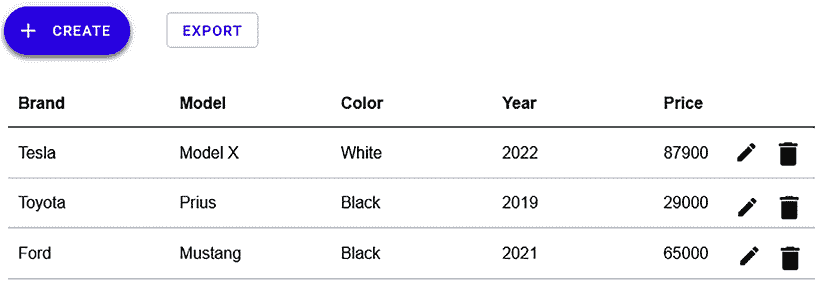
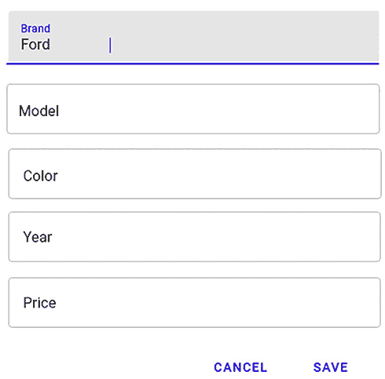
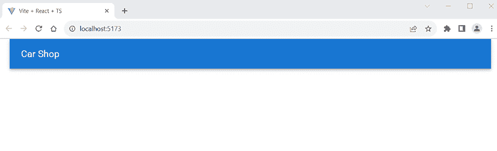

# 12

# 为我们的 Spring Boot RESTful Web 服务设置前端

本章解释了开始开发我们的汽车数据库应用程序前端部分所需的步骤。我们首先将定义我们正在开发的函数。然后，我们将进行 UI 的模拟。作为后端，我们将使用第五章中提到的 Spring Boot 应用程序，即*第五章*，*保护后端*。我们将从后端的不安全版本开始开发。最后，我们将创建用于前端开发的 React 应用程序。

在本章中，我们将涵盖以下主题：

+   模拟 UI

+   准备 Spring Boot 后端

+   创建前端 React 项目

# 技术要求

我们在第五章中创建的*第五章*，*保护后端*中的 Spring Boot 应用程序是必需的。

还需要安装 Node.js，并且需要以下 GitHub 链接中的代码来跟随本章的示例：[`github.com/PacktPublishing/Full-Stack-Development-with-Spring-Boot-3-and-React-Fourth-Edition/tree/main/Chapter12`](https://github.com/PacktPublishing/Full-Stack-Development-with-Spring-Boot-3-and-React-Fourth-Edition/tree/main/Chapter12)。

# 模拟 UI

在本书的前几章中，我们创建了一个提供 RESTful API 的汽车数据库后端。现在，是时候开始构建我们应用程序的前端了。

我们将创建一个具有以下规格的前端：

+   它以表格形式列出数据库中的汽车，并提供**分页**、**排序**和**筛选**功能。

+   有一个按钮可以打开一个用于向数据库添加新汽车的**模态表单**。

+   在汽车表的每一行中，都有一个按钮可以**编辑**汽车或从数据库中**删除**它。

+   表格中有一个链接或按钮，可以**导出**数据到**CSV**文件。

UI 模拟通常在前端开发的早期创建，为用户提供用户界面的视觉表示。模拟通常由设计师完成，然后提供给开发者。有许多不同的应用程序可以创建模拟，例如 Figma、Balsamiq 和 Adobe XD，或者您甚至可以使用铅笔和纸。您还可以创建交互式模拟来展示多个功能。

如果您已经完成了模拟，在开始编写任何实际代码之前与客户讨论需求会容易得多。有了模拟，客户也更容易理解前端的概念，并提出对其的修改建议。与实际前端源代码的修改相比，对模拟的修改真的非常容易和快速。

以下截图显示了我们的汽车列表前端示例模拟：



图 12.1：前端模拟

当用户按下**+ 创建**按钮时打开的模态表单看起来如下：



图 12.2：模态表单模拟

现在我们已经准备好了我们的 UI 模拟，让我们看看如何准备我们的 Spring Boot 后端。

# 准备 Spring Boot 后端

我们将在本章开始前端开发，使用未加密的后端版本。然后：

+   在 *第十三章*，*添加 CRUD 功能* 中，我们将实现所有 CRUD 功能。

+   在 *第十四章*，*使用 MUI 美化前端* 中，我们将继续使用 Material UI 组件来完善我们的 UI。

+   最后，在 *第十六章*，*保护您的应用程序* 中，我们将启用后端的安全性，进行必要的修改，并实现身份验证。

在 Eclipse 中打开我们在 *第五章*，*保护后端* 中创建的 Spring Boot 应用程序。打开定义 Spring Security 配置的 `SecurityConfig.java` 文件。暂时注释掉当前配置，并允许所有人访问所有端点。参考以下修改：

```java
@Bean
public SecurityFilterChain filterChain(HttpSecurity http) throws Exception
  {
    **// Add this one**
    **http.csrf((csrf) -> csrf.disable()).cors(withDefaults())**
        **.authorizeHttpRequests((authorizeHttpRequests) ->** 
             **authorizeHttpRequests.anyRequest().permitAll());**
    **/* COMMENT THIS OUT**
    http.csrf((csrf) -> csrf.disable()) 
        .cors(withDefaults())
        .sessionManagement((sessionManagement) ->
            sessionManagement.sessionCreationPolicy(\
                SessionCreationPolicy.STATELESS))
        .authorizeHttpRequests( (authorizeHttpRequests) -> 
            authorizeHttpRequests
        .requestMatchers(HttpMethod.POST, "/login").permitAll()
        .anyRequest().authenticated())
        .addFilterBefore(authenticationFilter, 
            UsernamePasswordAuthenticationFilter.class)
        .exceptionHandling((exceptionHandling) ->
            exceptionHandling.authenticationEntryPoint(
                exceptionHandler));
    ***/**
    return http.build();
} 
```

现在，如果您启动 MariaDB 数据库，运行后端，并向 `http:/localhost:8080/api/cars` 端点发送 `GET` 请求，您应该会在响应中获取所有汽车，如下面的截图所示：

![图片 B19818_12_03.png]

图 12.3：GET 请求

现在，我们已准备好创建前端 React 项目。

# 创建前端 React 项目

在我们开始编写前端代码之前，我们必须创建一个新的 React 应用程序。我们将在 React 前端使用 TypeScript：

1.  打开 PowerShell 或任何其他合适的终端。通过输入以下命令创建一个新的 React 应用程序：

    ```java
    npm create vite@4 
    ```

    在本书中，我们使用 Vite 版本 4.4。您也可以使用最新版本，但那时您需要检查 Vite 文档中的更改。

1.  将您的项目命名为 `carfront`，并选择 **React** 框架和 **TypeScript** 变体：

![图片 B19818_12_04.png]

![图 12.4：前端项目]

1.  切换到项目文件夹，并输入以下命令安装依赖项：

    ```java
    cd carfront
    npm install 
    ```

1.  通过输入以下命令安装 MUI 组件库，该命令安装了 Material UI 核心库和两个 Emotion 库。**Emotion** 是一个用于使用 JavaScript 编写 CSS 的库 ([`emotion.sh/docs/introduction`](https://emotion.sh/docs/introduction))：

    ```java
    npm install @mui/material @emotion/react @emotion/styled 
    ```

1.  此外，安装 React Query v4 和 Axios，我们将在前端使用它们进行网络操作：

    ```java
    npm install @tanstack/react-query@4
    npm install axios 
    ```

1.  在项目的 `root` 文件夹中输入以下命令来运行应用程序：

    ```java
    npm run dev 
    ```

1.  使用 Visual Studio Code 打开 `src` 文件夹，并从 `App.tsx` 文件中删除任何多余的代码。由于我们正在使用 TypeScript，文件扩展名现在是 `.tsx`。此外，删除 `App.css` 样式表文件导入。我们将在 `App.tsx` 文件中使用 MUI 的 `AppBar` 组件来创建应用程序的工具栏。

    如果您想回顾，我们已经在 *第十一章*，*React 的有用第三方组件* 中查看过 MUI 的 `AppBar`。

    如下代码所示，将 `AppBar` 组件包裹在 MUI 的 `Container` 组件内部，这是一个基本的布局组件，它水平居中你的应用内容。我们可以使用 `position` 属性来定义应用栏的定位行为。值 `static` 表示当用户滚动时，应用栏不会固定在顶部。如果你使用 `position="fixed"`，则将应用栏固定在页面顶部。你还需要导入我们使用的所有 MUI 组件：

    ```java
    import AppBar from '@mui/material/AppBar';
    import Toolbar from '@mui/material/Toolbar';
    import Typography from '@mui/material/Typography';
    import Container from '@mui/material/Container';
    import CssBaseline from '@mui/material/CssBaseline';
    function App() {
      return (
        <Container maxWidth="xl">
        <CssBaseline />
          <AppBar position="static">
            <Toolbar>
              <Typography variant="h6">
                Car Shop
              </Typography>
            </Toolbar>
          </AppBar>
        </Container>
      );
    }
    export default App; 
    ```

    `maxWidth` 属性定义了我们的应用的最大宽度，我们使用了最大值。我们还使用了 MUI 的 `CssBaseline` 组件，该组件用于解决跨浏览器的不一致性，确保 React 应用的外观在不同浏览器中保持一致。通常，它被包含在应用的最顶层，以确保其样式全局应用。

1.  我们将移除所有预定义的样式。因此，从 `main.tsx` 文件中移除 `index.css` 样式表导入。代码应如下所示：

    ```java
    import React from 'react'
    import ReactDOM from 'react-dom/client'
    import App from './App.tsx'
    ReactDOM.createRoot(document.getElementById('root') as HTMLElement).
      render(
      <React.StrictMode>
        <App />
      </React.StrictMode>,
    ) 
    ```

现在，你的前端起点应如下所示：



图 12.5：汽车商店

我们已经为前端创建了 React 项目，可以继续进行进一步的开发。

# 摘要

在本章中，我们使用在 *第五章*，*保护你的后端* 中创建的后端开始了我们的前端开发。我们定义了前端的功能，并创建了 UI 的原型。我们以后端的不安全版本开始前端开发，因此对我们的 Spring Security 配置类进行了一些修改。我们还创建了我们在开发过程中将使用的 React 应用。

在下一章中，我们将向我们的前端添加 **创建**、**读取**、**更新** 和 **删除** （**CRUD**） 功能。

# 问题

1.  为什么你应该对 UI 进行原型设计？

1.  你如何从后端禁用 Spring Security？

# 进一步阅读

对于学习 UI 设计和 MUI，有许多其他优秀的资源可用。这里列出了一些：

+   *《别让我思考（第三版）：网络可用性的常识方法》*，作者 Steve Krug ([`sensible.com/dont-make-me-think/`](https://sensible.com/dont-make-me-think/))

+   MUI 博客——关于 MUI 的最新信息 ([`mui.com/blog/`](https://mui.com/blog/))

+   Material UI GitHub 仓库 ([`github.com/mui/material-ui`](https://github.com/mui/material-ui))

# 在 Discord 上了解更多

要加入本书的 Discord 社区——在那里你可以分享反馈、向作者提问，并了解新版本——请扫描下面的二维码：

[`packt.link/FullStackSpringBootReact4e`](https://packt.link/FullStackSpringBootReact4e)


