# 第十三章：添加 CRUD 功能

本章描述了如何在我们的前端中实现 **创建**、**读取**、**更新** 和 **删除**（**CRUD**）功能。我们将使用我们在 *第十一章*，*React 的有用第三方组件* 中学习到的组件。我们将从后端获取数据并在表格中展示数据。然后，我们将实现删除、编辑和创建功能。在本章的最后部分，我们将添加功能，以便我们可以将数据导出为 CSV 文件。

在本章中，我们将涵盖以下主题：

+   创建列表页面

+   添加删除功能

+   添加添加功能

+   添加编辑功能

+   将数据导出为 CSV

# 技术要求

我们在 *第十二章*，*为我们的 Spring Boot RESTful Web 服务设置前端* 中创建的 Spring Boot `cardatabase` 应用程序（未加密的后端）以及同一章中创建的 React 应用程序 `carfront` 都是必需的。

还需要以下 GitHub 链接：[`github.com/PacktPublishing/Full-Stack-Development-with-Spring-Boot-3-and-React-Fourth-Edition/tree/main/Chapter13`](https://github.com/PacktPublishing/Full-Stack-Development-with-Spring-Boot-3-and-React-Fourth-Edition/tree/main/Chapter13)。

# 创建列表页面

在本节的第一部分，我们将创建一个列表页面来显示带有分页、过滤和排序功能的汽车：

1.  运行你的未加密的 Spring Boot 后端。可以通过向 `http://localhost:8080/api/cars` URL 发送 `GET` 请求来获取汽车，如 *第四章*，*使用 Spring Boot 创建 RESTful Web 服务* 中所示。现在，让我们检查响应中的 JSON 数据。汽车数组可以在 JSON 响应数据的 `_embedded.cars` 节点中找到：

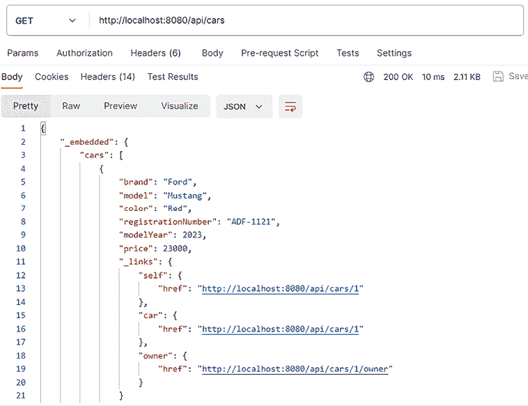

图 13.1：获取汽车

1.  使用 Visual Studio Code 打开 `carfront` React 应用程序（我们在上一章中创建的 React 应用程序）。

1.  我们正在使用 React Query 进行网络操作，因此我们首先需要初始化查询提供者。

你在 *第十章*，*使用 React 消费 REST API* 中学习了 React Query 的基础知识。

使用 `QueryClientProvider` 组件来连接并提供 `QueryClient` 给你的应用程序。打开你的 `App.tsx` 文件，并将高亮的导入和组件添加到 `App` 组件中：

```java
import AppBar from '@mui/material/AppBar';
import Toolbar from '@mui/material/Toolbar';
import Typography from '@mui/material/Typography';
import Container from '@mui/material/Container';
import CssBaseline from '@mui/material/CssBaseline';
**import** **{** **QueryClient****,** **QueryClientProvider** **}** **from****'@tanstack/react-**
  **query'****;**
**const** **queryClient =** **new****QueryClient****();**
function App() {
  return (
    <Container maxWidth="xl">
      <CssBaseline />
      <AppBar position="static">
        <Toolbar>
        <Typography variant="h6">
        Car Shop
        </Typography>
        </Toolbar>
     </AppBar>
     **<****QueryClientProvider****client****=****{queryClient}****>**
     **</****QueryClientProvider****>**
   </Container>
  )
}
export default App; 
```

现在，让我们获取一些汽车。

## 从后端获取数据

一旦我们知道了如何从后端获取汽车，我们就可以准备实现列表页面来显示汽车。以下步骤描述了实际操作：

1.  当你的应用程序有多个组件时，建议为它们创建一个文件夹。在 `src` 文件夹中创建一个名为 `components` 的新文件夹。使用 Visual Studio Code，你可以通过在侧边栏文件资源管理器中右键单击文件夹并从菜单中选择 **New Folder...** 来创建文件夹：

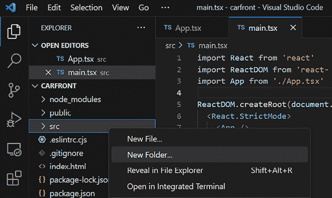

图 13.2：新文件夹

1.  在`components`文件夹中创建一个名为`Carlist.tsx`的新文件。你的项目结构应该如下所示：

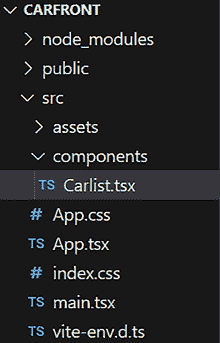

图 13.3：项目结构

1.  在编辑器视图中打开`Carlist.tsx`文件，并编写组件的基本代码，如下所示：

    ```java
    function Carlist() {
      return(
        <></>
      );
    }
    export default Carlist; 
    ```

1.  现在，当我们使用 TypeScript 时，我们必须为我们的汽车数据定义类型。让我们创建一个新文件，在那里定义我们的类型。在你的项目`src`文件夹中创建一个名为`types.ts`的文件。从响应中，你可以看到汽车对象看起来如下，它包含所有汽车属性，还包括链接：

    ```java
    {
        "brand": "Ford",
        "model": "Mustang",
        "color": "Red",
        "registrationNumber": "ADF-1121",
        "modelYear": 2023,
        "price": 59000,
        "_links": {
          "self": {
             "href": "http ://localhost :8080/api/cars/1"
          },
          "car": {
             "href": "http ://localhost :8080/api/cars/1"
          },
          "owner": {
             "href": "http ://localhost :8080/api/cars/1/owner"
          }
        }
    } 
    ```

1.  在`types.ts`文件中创建以下`CarResponse`类型，并导出它，以便我们可以在需要它的文件中使用：

    ```java
    export type CarResponse = {
      brand: string;
      model: string;
      color: string;
      registrationNumber: string;
      modelYear: number;
      price: number;
      _links: {
        self: {
          href: string;
        },
        car: {
          href: string;
        },
        owner: {
          href: string;
        }
      };
    } 
    ```

1.  接下来，我们将创建一个函数，通过向我们的后端发送一个`GET`请求到`http://localhost:8080/api/cars`端点来获取汽车。该函数返回一个包含我们定义在`types.ts`文件中的`CarResponse`对象数组的**promise**。我们可以使用`Promise<Type>`泛型，其中`Type`表示 promise 解析的值类型。打开`Carlist.tsx`文件，并添加以下导入和函数：

    ```java
    **import** **{** **CarResponse** **}** **from****'../types'****;**
    **import** **axios** **from****'axios'****;**
    function Carlist() {
      **const** **getCars =** **async** **():** **Promise****<****CarResponse****[]> => {**
        **const** **response =** **await** **axios.****get****(****"http** **://localhost** **:8080/api/**
                                          **cars"****);**
        **return** **response.****data****.****_embedded****.****cars****;**
      **}**
      return(
        <></>
      );
    }
    export default Carlist; 
    ```

1.  接下来，我们将使用`useQuery`钩子来获取汽车：

    ```java
    **import** **{ useQuery }** **from****'@tanstack/react-query'****;**
    import { CarResponse } from '../types';
    import axios from 'axios';
    function Carlist() {
      const getCars = async (): Promise<CarResponse[]> => {
        const response = await axios.get("http ://localhost :8080/api/
                                          cars");
        return response.data._embedded.cars;
      }
      **const** **{ data, error, isSuccess } =** **useQuery****({**
        **queryKey****: [****"cars"****],** 
        **queryFn****: getCars**
      **});**
      return (
        <></>
      );
    }
    export default Carlist; 
    ```

    `useQuery`钩子使用 TypeScript 泛型，因为它不获取数据，也不知道你的数据类型。然而，React Query 可以推断数据类型，因此我们在这里不需要手动使用泛型。如果你显式设置泛型，代码看起来像这样：

    ```java
    useQuery<CarResponse[], Error> 
    ```

1.  我们将使用**条件渲染**来检查获取操作是否成功以及是否存在任何错误。如果`isSuccess`为`false`，则表示数据获取仍在进行中，在这种情况下，会返回一个加载信息。我们还会检查`error`是否为`true`，这表示存在错误，并返回一个错误信息。当数据可用时，我们使用`map`函数将汽车对象转换成`return`语句中的表格行，并添加`table`元素：

    ```java
    // Carlist.tsx
    if (!isSuccess) {
      return <span>Loading...</span>
    }
    else if (error) {
      return <span>Error when fetching cars...</span>
    }
    else {
      return ( 
         <table>
            <tbody>
            {
             data.map((car: CarResponse) => 
                <tr key={car._links.self.href}>
                  <td>{car.brand}</td>
                  <td>{car.model}</td>
                  <td>{car.color}</td> 
                 <td>{car.registrationNumber}</td> 
                 <td>{car.modelYear}</td>
                 <td>{car.price}</td>
                </tr>)
              }
          </tbody>
        </table>
      );
    } 
    ```

1.  最后，我们必须在`App.tsx`文件中导入并渲染`Carlist`组件。在`App.tsx`文件中，添加`import`语句，然后渲染`Carlist`组件在`QueryClientProvider`组件内部，如高亮所示。`QueryClientProvider`是一个提供 React Query 上下文到你的组件的组件，它应该包裹你进行 REST API 请求的组件：

    ```java
    import AppBar from '@mui/material/AppBar';
    import Toolbar from '@mui/material/Toolbar';
    import Typography from '@mui/material/Typography';
    import Container from '@mui/material/Container';
    import CssBaseline from '@mui/material/CssBaseline';
    import { QueryClient, QueryClientProvider } from '@tanstack/react-
      query';
    **import****Carlist****from****'./components/Carlist'****;**
    const queryClient = new QueryClient();
    function App() {
      return (
        <Container maxWidth="xl">
          <CssBaseline />
          <AppBar position="static">
            <Toolbar>
              <Typography variant="h6">
              Car shop
              </Typography>
            </Toolbar>
          </AppBar>
          <QueryClientProvider client={queryClient}>
            **<****Carlist** **/>**
          </QueryClientProvider>
        </Container>
      )
    }
    export default App; 
    ```

1.  现在，如果你使用`npm run dev`命令启动 React 应用，你应该看到以下列表页面。请注意，你的后端也应该正在运行：

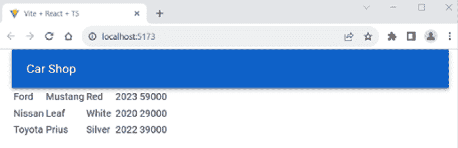

图 13.4：汽车前端

## 使用环境变量

在我们继续之前，让我们做一些代码重构。当我们在源代码中创建更多的 CRUD 功能时，服务器 URL 可以重复多次，并且当后端部署到非本地主机的服务器时，它将发生变化；因此，最好将其定义为 **环境变量**。然后，当 URL 值更改时，我们只需在一个地方修改它。

当使用 Vite 时，环境变量名称应该以文本 `VITE_` 开头。只有以 `VITE_` 为前缀的变量才会暴露给您的源代码：

1.  在我们应用程序的根文件夹中创建一个新的 `.env` 文件。在编辑器中打开文件，并添加以下行到文件中：

    ```java
    VITE_API_URL=http://localhost:8080 
    ```

1.  我们还将所有 API 调用函数分离到它们自己的模块中。在您的项目 `src` 文件夹中创建一个名为 `api` 的新文件夹。在 `api` 文件夹中创建一个名为 `carapi.ts` 的新文件，现在您的项目结构应该如下所示：

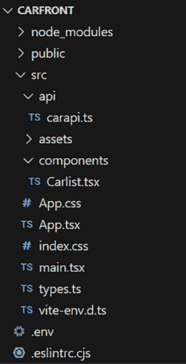

图 13.5：项目结构

1.  将 `getCars` 函数从 `Carlist.tsx` 文件复制到 `carapi.ts` 文件中。在函数开头添加 `export`，以便我们可以在其他组件中使用它。在 Vite 中，环境变量通过 `import.meta.env` 作为字符串暴露给您的应用程序源代码。然后，我们可以将服务器 URL 环境变量导入到 `getCars` 函数中并在那里使用它。我们还需要将 `axios` 和 `CarResponse` 类型导入到 `carapi.ts` 文件中：

    ```java
    // carapi.ts
    import { CarResponse } from '../types';
    import axios from 'axios';
    **export** const getCars = async (): Promise<CarResponse[]> => {
      const response = await axios.get(**`****${****import****.meta.env.VITE_API_URL}****/**
                                        **api/cars`**);
      return response.data._embedded.cars;
    } 
    ```

1.  现在，我们可以从 `Carlist.tsx` 文件中移除 `getCars` 函数和未使用的 `axios` 导入，并从 `carapi.ts` 文件中导入它。源代码应如下所示：

    ```java
    // Carlist.tsx
    // Remove getCars function and import it from carapi.ts
    import { useQuery } from '@tanstack/react-query';
    **import** **{ getCars }** **from****'../api/carapi'****;**
    function Carlist() {
      const { data, error, isSuccess } = useQuery({
        queryKey: ["cars"], 
        queryFn: getCars
      });
      if (!isSuccess) {
        return <span>Loading...</span>
      }
      else if (error) {
        return <span>Error when fetching cars...</span>
      }
      else {
        return (
          <table>
            <tbody>
            {
            data.map((car: CarResponse) => 
              <tr key={car._links.self.href}>
                <td>{car.brand}</td>
                <td>{car.model}</td> 
                <td>{car.color}</td> 
                <td>{car.registrationNumber}</td> 
                <td>{car.modelYear}</td>
                <td>{car.price}</td> 
              </tr>)
            }
            </tbody>
          </table>
        );
        }
      }
    export default Carlist; 
    ```

在这些重构步骤之后，您应该看到与之前相同的汽车列表页面。

## 添加分页、过滤和排序

我们已经在 *第十一章* 中使用了 `ag-grid` 组件来实现数据网格，*React 的有用第三方组件*，它也可以在这里使用。相反，我们将使用新的 MUI `DataGrid` 组件来获得开箱即用的分页、过滤和排序功能：

1.  在终端中按 *Ctrl* + *C* 停止开发服务器。

1.  我们将安装 MUI 数据网格社区版。以下是在撰写本文时的安装命令，但您应该从 MUI 文档中检查最新的安装命令和用法：

    ```java
    npm install @mui/x-data-grid 
    ```

1.  安装完成后，重新启动应用程序。

1.  将 `DataGrid` 组件导入到您的 `Carlist.tsx` 文件中。我们还将导入 `GridColDef`，它是 MUI 数据网格中列定义的类型：

    ```java
    import { DataGrid, GridColDef } from '@mui/x-data-grid'; 
    ```

1.  网格列定义在 `columns` 变量中，该变量具有 `GridColDef[]` 类型。列的 `field` 属性定义了列中的数据来源；我们使用我们的汽车对象属性。`headerName` 属性可以用来设置列的标题。我们还将设置列的宽度。在 `Carlist` 组件内部添加以下列定义代码：

    ```java
    const columns: GridColDef[] = [
      {field: 'brand', headerName: 'Brand', width: 200},
      {field: 'model', headerName: 'Model', width: 200},
      {field: 'color', headerName: 'Color', width: 200},
      {field: 'registrationNumber', headerName: 'Reg.nr.', width: 150},
      {field: 'modelYear', headerName: 'Model Year', width: 150},
      {field: 'price', headerName: 'Price', width: 150},
    ]; 
    ```

1.  然后，从组件的`return`语句中移除`table`及其所有子元素，并添加`DataGrid`组件。同时移除在`map`函数中使用的未使用的`CarResponse`导入。数据网格的数据源是`data`，它包含获取的汽车，并使用`rows`属性定义。`DataGrid`组件要求所有行都具有一个唯一的 ID 属性，该属性使用`getRowId`属性定义。我们可以使用汽车对象的`link`字段，因为它包含唯一的汽车 ID（`_links.self.href`）。请参考以下`return`语句的源代码：

    ```java
    if (!isSuccess) {
      return <span>Loading...</span>
    }
    else if (error) {
      return <span>Error when fetching cars...</span>
    }
    else {
      return (
        **<****DataGrid**
          **rows****=****{data}**
          **columns****=****{columns}**
          **getRowId****=****{row** **=>** **row._links.self.href}**
        **/>**
      );
    } 
    ```

使用 MUI `DataGrid`组件，我们仅通过少量编码就实现了我们表格的所有必要功能。现在，列表页面看起来如下所示：

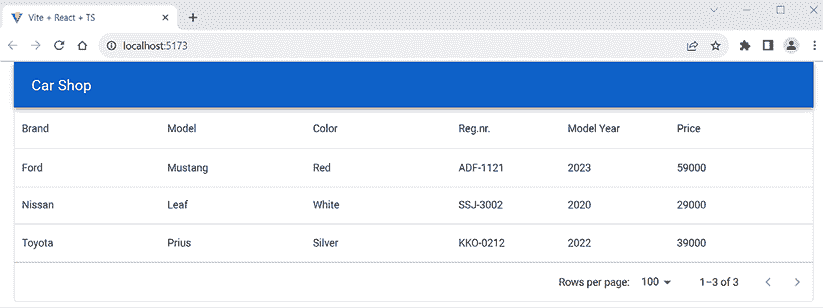

图 13.6：汽车前端

数据网格列可以通过列菜单和点击**筛选**菜单项进行筛选。您还可以从列菜单设置列的可见性：

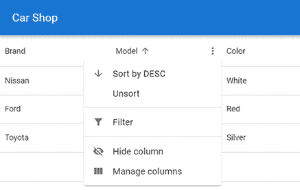

图 13.7：列菜单

接下来，我们将实现删除功能。

# 添加删除功能

可以通过向`http://localhost:8080/api/cars/{carId}`端点发送`DELETE`方法请求从数据库中删除项目。如果我们查看 JSON 响应数据，我们可以看到每辆车都包含一个指向自身的链接，该链接可以从`_links.self.href`节点访问，如下面的截图所示：

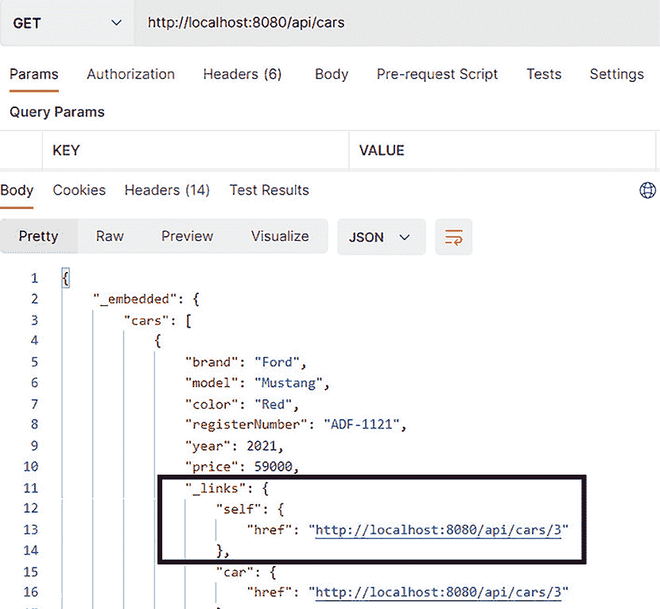

图 13.8：汽车链接

我们已经在上一节中使用了`link`字段来为网格中的每一行设置一个唯一的 ID。该行 ID 可以在删除时使用，正如我们稍后将要看到的。

以下步骤演示了如何实现删除功能：

1.  首先，我们将在 MUI `DataGrid`的每一行创建一个按钮。当我们需要更复杂的单元格内容时，我们可以使用`renderCell`列属性来定义单元格内容如何渲染。

    让我们使用`renderCell`来向表中添加一个新列，以渲染`button`元素。传递给函数的`params`参数是一个包含一行所有值的行对象。`params`的类型是`GridCellParams`，由 MUI 提供。在我们的情况下，它包含每行中的一个指向汽车的链接，这在删除时是必需的。链接位于行的`_links.self.href`属性中，我们将传递此值到`delete`函数。让我们首先在按钮被按下时显示一个带有 ID 的警告框来测试按钮是否正常工作。请参考以下源代码：

    ```java
    // Import GridCellParams
    import { DataGrid, GridColDef, **GridCellParams** } from '@mui/x-data-
      grid';
    // Add delete button column to columns
    const columns: GridColDef[] = [
      {field: 'brand', headerName: 'Brand', width: 200},
      {field: 'model', headerName: 'Model', width: 200},
      {field: 'color', headerName: 'Color', width: 200},
      {field: 'registrationNumber', headerName: 'Reg.nr.', width: 150},
      {field: 'modelYear', headerName: 'Model Year', width: 150},
      {field: 'price', headerName: 'Price', width: 150},
      **{**
        **field****:** **'delete'****,**
        **headerName****:** **''****,**
        **width****:** **90****,**
        **sortable****:** **false****,**
        **filterable****:** **false****,**
        **disableColumnMenu****:** **true****,**
        **renderCell****:** **(****params: GridCellParams****) =>** **(**
          **<****button**
            **onClick****=****{()** **=>** **alert(params.row._links.car.href)}**
            **>**
            **Delete**
          **</****button****>**
        **),**
      **},**
    ]; 
    ```

    我们不想为`按钮`列启用排序和筛选功能，因此将`filterable`和`sortable`属性设置为`false`。我们还将此列的列菜单禁用，通过将`disableColumnMenu`属性设置为`true`。按钮在被按下时会调用`onDelClick`函数，并将一个链接（`row.id`）作为参数传递给该函数，链接值将在一个警告框中显示。

1.  现在，你应该在每个行中看到一个 **删除** 按钮。如果你按下任何一个按钮，你可以看到一个显示汽车链接的警告。要删除汽车，我们应该向其链接发送一个 `DELETE` 请求：

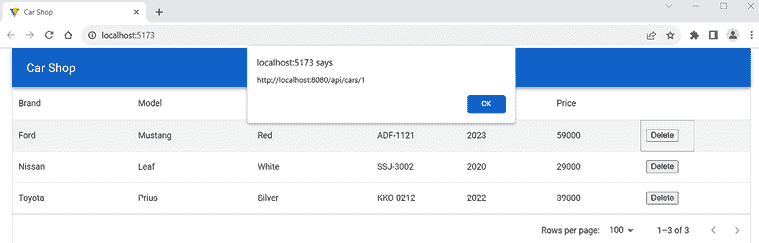

图 13.9：删除按钮

1.  接下来，我们将实现 `deleteCar` 函数，该函数使用 Axios 的 `delete` 方法向汽车链接发送 `DELETE` 请求。向后端发送 `DELETE` 请求会返回一个已删除的汽车对象。我们将在 `carapi.ts` 文件中实现 `deleteCar` 函数并将其导出。打开 `carapi.ts` 文件并添加以下函数：

    ```java
    // carapi.ts
    export const deleteCar = async (link: string): Promise<CarResponse> =>
    {
      const response = await axios.delete(link);
      return response.data
    } 
    ```

1.  我们使用 React Query 的 `useMutation` 钩子来处理删除。我们在 *第十章* 中看到了一个例子。首先，我们必须将 `useMutation` 导入到 `Carlist.tsx` 文件中。我们还将从 `carapi.ts` 文件中导入 `deleteCar` 函数：

    ```java
    // Carlist.tsx
    import { useQuery, **useMutation** } from '@tanstack/react-query';
    import { getCars, **deleteCar** } from '../api/carapi'; 
    ```

1.  添加 `useMutation` 钩子，它调用我们的 `deleteCar` 函数：

    ```java
    // Carlist.tsx
    const { mutate } = useMutation(deleteCar, {
       onSuccess: () => {
          // Car deleted
        },
        onError: (err) => {
          console.error(err);
        },
    }); 
    ```

1.  然后，在我们的删除按钮中调用 `mutate` 并将汽车链接作为参数传递：

    ```java
    // Carlist.tsx columns
    {
        field: 'delete',
        headerName: '',
        width: 90,
        sortable: false,
           filterable: false,
        disableColumnMenu: true,
        renderCell: (params: GridCellParams) => (
           <button 
            onClick={() => **mutate(params.row._links.car.href)**}
            >
            Delete
          </button>
        ),
      },
    }); 
    ```

1.  现在，如果你启动应用程序并按下 **删除** 按钮，汽车将从数据库中删除，但在前端它仍然存在。你可以手动刷新浏览器，之后汽车将从表中消失。

1.  我们还可以在删除汽车时自动刷新前端。在 React Query 中，获取的数据被保存到一个由查询客户端处理的缓存中。`QueryClient` 有一个 **查询失效** 功能，我们可以使用它来重新获取数据。首先，我们必须导入并调用 `useQueryClient` 钩子函数，它返回当前的查询客户端：

    ```java
    // Carlist.tsx
    import { useQuery, useMutation, **useQueryClient** } from '@tanstack/
      react-query';
    import { deleteCar } from '../api/carapi';
    import { DataGrid, GridColDef, GridCellParams } from '@mui/x-data-
      grid';
    function Carlist() {
      **const** **queryClient =** **useQueryClient****();**
      // continue... 
    ```

1.  `queryClient` 有一个 `invalidateQueries` 方法，我们可以在成功删除后调用它来重新获取我们的数据。你可以传递你想要重新获取的查询的键。我们获取汽车的查询键是 `cars`，我们在 `useQuery` 钩子中定义了它：

    ```java
    // Carlist.tsx
    const { mutate } = useMutation(deleteCar, {
        onSuccess: () => {
          **queryClient.****invalidateQueries****({** **queryKey****: [****'cars'****] });**
        },
        onError: (err) => {
          console.error(err);
        },
      }); 
    ```

现在，每次删除汽车时，都会重新获取所有汽车。当按下 **删除** 按钮时，汽车从列表中消失。删除后，你可以重新启动后端以重新填充数据库。

你还可以看到，当你点击网格中的任何一行时，该行会被选中。你可以通过将网格的 `disableRowSelectionOnClick` 属性设置为 `true` 来禁用此功能：

```java
<DataGrid
  rows={cars}
  columns={columns}
  **disableRowSelectionOnClick={****true****}**
  getRowId={row => row._links.self.href}
/> 
```

## 显示通知消息

如果删除成功或出现任何错误，向用户显示一些反馈会很好。让我们实现一个 **通知消息** 来显示删除的状态。为此，我们将使用 MUI 的 `Snackbar` 组件：

1.  首先，我们必须通过将以下 `import` 语句添加到我们的 `Carlist.tsx` 文件中来导入 `Snackbar` 组件：

    ```java
    import Snackbar from '@mui/material/Snackbar'; 
    ```

1.  `Snackbar` 组件的 `open` 属性值是一个布尔值，如果它是 `true`，则组件显示；否则，它隐藏。让我们导入 `useState` 钩子并定义一个名为 `open` 的状态来处理我们的 `Snackbar` 组件的可见性。初始值是 `false`，因为消息只有在删除后才会显示：

    ```java
    //Carlist.tsx
    **import** **{ useState }** **from****'react'****;**
    import { useQuery, useMutation, useQueryClient } from '@tanstack/
      react-query';
    import { deleteCar } from '../api/carapi';
    import { DataGrid, GridColDef, GridCellParams } from '@mui/x-data-
      grid';
    import Snackbar from '@mui/material/Snackbar';
    function Carlist() {
      **const** **[open, setOpen] =** **useState****(****false****);**
      const queryClient = useQueryClient();
      // continue... 
    ```

1.  接下来，我们在 MUI `DataGrid` 组件之后的 `return` 语句中添加 `Snackbar` 组件。`autoHideDuration` 属性定义了在自动调用 `onClose` 函数并消失消息之前的时间（以毫秒为单位）。`message` 属性定义了要显示的消息。我们还需要将 `DataGrid` 和 `Snackbar` 组件包裹在片段 (`<></>`) 中：

    ```java
    // Carlist.tsx
    if (!isSuccess) {
      return <span>Loading...</span>
    }
    else if (error) {
      return <span>Error when fetching cars...</span>
    }
    else {
      return (
        **<>**
          <DataGrid
            rows={data}
            columns={columns}
            disableRowSelectionOnClick={true}
            getRowId={row => row._links.self.href} />
          **<****Snackbar**
            **open****=****{open}**
            **autoHideDuration****=****{2000}**
            **onClose****=****{()** **=>** **setOpen(false)}**
            **message="Car deleted" />**
        **</>**
    ); 
    ```

1.  最后，在 `useMutation` 钩子中成功删除后，我们将 `open` 状态设置为 `true`：

    ```java
    // Carlist.tsx
    const { mutate } = useMutation(deleteCar, {
      onSuccess: () => {
        **setOpen****(****true****);**
        queryClient.invalidateQueries(["cars"]);
      },
      onError: (err) => {
        console.error(err);
      },
    }); 
    ```

现在，当车辆被删除时，您将看到以下截图所示的托盘消息：

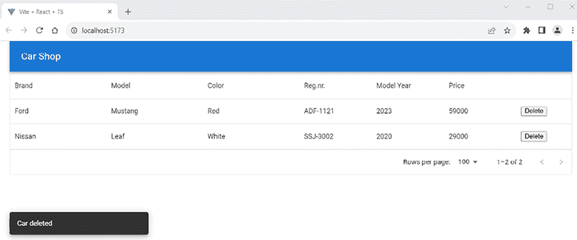

图 13.10：托盘消息

## 添加确认对话框窗口

为了避免意外删除车辆，在按下 **删除** 按钮后有一个确认对话框将很有用。我们将使用 `window` 对象的 `confirm` 方法来实现这一点。它打开一个带有可选消息的对话框，如果您按下 **确定** 按钮，则返回 `true`。将 `confirm` 添加到删除按钮的 `onClick` 事件处理器：

```java
// Carlist.tsx columns
{
  field: 'delete',
  headerName: '',
  width: 90,
  sortable: false,
  filterable: false,
  disableColumnMenu: true,
  renderCell: (params: GridCellParams) => (
    <button 
      onClick={() => **{**
        **if (window.confirm(`Are you sure you want to delete ${params.row.**
                            **brand} ${params.row.model}?`)) {**
          **mutate(params.row._links.car.href);**
        **}**
      **}}**
    >
      Delete
    </button>
  ),
} 
```

在确认消息中，我们使用了 ES6 字符串插值来显示车辆的品牌和型号。（注意！记得使用反引号。）

如果您现在按下 **删除** 按钮，将打开确认对话框，并且只有当您按下 **确定** 按钮时，车辆才会被删除：

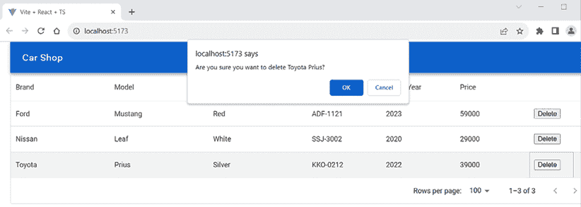

图 13.11：确认对话框

接下来，我们将开始实现添加新车的功能。

# 添加添加功能

下一步是为前端添加添加功能。我们将使用 MUI 模态对话框来实现这一点。

我们在 *第十一章* 中介绍了 MUI 模态表单，*React 的有用第三方组件*。

我们将在用户界面中添加一个 **新车辆** 按钮，当按下时将打开模态表单。模态表单包含添加新车辆所需的所有字段，以及保存和取消的按钮。

以下步骤展示了如何使用模态对话框组件创建添加功能：

1.  在 `components` 文件夹中创建一个名为 `AddCar.tsx` 的新文件，并将一些功能组件基础代码写入文件，如下所示。添加 MUI `Dialog` 组件的导入：

    ```java
    import Dialog from '@mui/material/Dialog';
    import DialogActions from '@mui/material/DialogActions';
    import DialogContent from '@mui/material/DialogContent';
    import DialogTitle from '@mui/material/DialogTitle';
    function AddCar() {
      return(
        <></>
      );
    }
    export default AddCar; 
    ```

1.  我们已经定义了我们的 `Car` 响应数据类型（一个包含链接的车辆对象）。让我们也创建一个不包含链接的车辆对象类型，因为用户不会在表单中输入链接。我们需要这个状态来保存新车辆。将以下 `Car` 类型添加到您的 `types.ts` 文件中：

    ```java
    export type Car = {
      brand: string;
      model: string;
      color: string;
      registrationNumber: string;
      modelYear: number;
      price: number;
    } 
    ```

1.  使用 `useState` 钩子声明一个包含所有车辆字段的 `Car` 类型状态。对于对话框，我们还需要一个布尔状态来定义对话框表单的可见性：

    ```java
    **import** **{ useState }** **from****'react'****;**
    import Dialog from '@mui/material/Dialog';
    import DialogActions from '@mui/material/DialogActions';
    import DialogContent from '@mui/material/DialogContent';
    import DialogTitle from '@mui/material/DialogTitle';
    **import** **{** **Car** **}** **from****'../types'****;**
    function AddCar() {
      **const** **[open, setOpen] =** **useState****(****false****);**
      **const** **[car, setCar] = useState<****Car****>({**
        **brand****:** **''****,**
        **model****:** **''****,**
        **color****:** **''****,**
        **registrationNumber****:** **''****,**
        **modelYear****:** **0****,**
        **price****:** **0**
      **});**

      return(
        <></>
      );
    }
    export default AddCar; 
    ```

1.  接下来，我们添加两个函数来关闭和打开对话框表单。`handleClose` 和 `handleOpen` 函数设置 `open` 状态的值，这会影响模态表单的可见性：

    ```java
    // AddCar.tsx
    // Open the modal form
    const handleClickOpen = () => {
      setOpen(true);
    };

    // Close the modal form
    const handleClose = () => {
      setOpen(false);
    }; 
    ```

1.  在`AddCar`组件的`return`语句中添加`Dialog`组件。表单包含带有按钮和收集汽车数据的输入字段的 MUI `Dialog`组件。打开模态窗口的按钮必须位于`Dialog`组件之外。所有输入字段都应该有一个`name`属性，其值与将要保存到状态中的名称相同。输入字段还具有`onChange`属性，通过调用`handleChange`函数将值保存到`car`状态。`handleChange`函数通过创建一个新的对象并基于输入元素的名称和用户输入的新值更新属性来动态更新`car`状态：

    ```java
    // AddCar.tsx
    const handleChange = (event : React.ChangeEvent<HTMLInputElement>) =>
    {
      setCar({...car, [event.target.name]:
          event.target.value});
    }
    return(
      <>
        <button onClick={handleClickOpen}>New Car</button>
        <Dialog open={open} onClose={handleClose}>
          <DialogTitle>New car</DialogTitle>
          <DialogContent>
            <input placeholder="Brand" name="brand"
              value={car.brand} onChange={handleChange}/><br/>
            <input placeholder="Model" name="model"
              value={car.model} onChange={handleChange}/><br/>
            <input placeholder="Color" name="color"
              value={car.color} onChange={handleChange}/><br/>
            <input placeholder="Year" name="modelYear"
              value={car.modelYear} onChange={handleChange}/><br/>
            <input placeholder="Reg.nr" name="registrationNumber"
              value={car.registrationNumber} onChange={handleChange}/><br/>
            <input placeholder="Price" name="price"
               value={car.price} onChange={handleChange}/><br/>
          </DialogContent>
          <DialogActions>
             <button onClick={handleClose}>Cancel</button>
             <button onClick={handleClose}>Save</button>
          </DialogActions>
        </Dialog>            
      </>
    ); 
    ```

1.  在`carapi.ts`文件中实现`addCar`函数，该函数将向后端`api/cars`端点发送`POST`请求。我们使用 Axios 的`post`方法发送`POST`请求。请求将包括在主体内的新汽车对象和`'Content-Type':'application/json'`头。我们还需要导入`Car`类型，因为我们正在将新汽车对象作为参数传递给函数：

    ```java
    // carapi.ts
    import { CarResponse, Car} from '../types';
    // Add a new car
    export const addCar = async (car: Car): Promise<CarResponse> => {
      const response = await axios.post(`${import.meta.env.VITE_API_
                       URL}/api/cars`, car, {
        headers: {
          'Content-Type': 'application/json',
        },  
      });

      return response.data;
    } 
    ```

1.  接下来，我们使用与删除功能中相同的 React Query `useMutation`钩子。在汽车添加成功后，我们也使汽车查询失效。我们在`useMutation`钩子中使用的`addCar`函数是从`carapi.ts`文件中导入的。将以下导入和`useMutation`钩子添加到你的`AddCar.tsx`文件中。我们还需要使用`useQueryClient`钩子从上下文中获取查询客户端。请记住，上下文用于将查询客户端提供给组件树中深层的组件：

    ```java
    // AddCar.tsx
    // Add the following imports
    import { useMutation, useQueryClient } from '@tanstack/react-query';
    import { addCar } from '../api/carapi';
    // Add inside the AddCar component function
    const queryClient = useQueryClient();
    // Add inside the AddCar component function
    const { mutate } = useMutation(addCar, {
      onSuccess: () => {
        queryClient.invalidateQueries(["cars"]);
      },
      onError: (err) => {
        console.error(err);
      },
    }); 
    ```

1.  将`AddCar`组件导入到`Carlist.tsx`文件中：

    ```java
    // Carlist.tsx
    import AddCar from './AddCar'; 
    ```

1.  将`AddCar`组件添加到`Carlist.tsx`文件的`return`语句中。你还需要导入`AddCar`组件。现在，`Carlist.tsx`文件的`return`语句应该如下所示：

    ```java
    // Carlist.tsx
    // Add the following import
    import AddCar from './AddCar';
    // Render the AddCar component 
    return (
      <>
        **<****AddCar** **/>**
        <DataGrid
          rows={data}
          columns={columns}
          disableRowSelectionOnClick={true}
          getRowId={row => row._links.self.href}/>
        <Snackbar
          open={open}
          autoHideDuration={2000}
          onClose={() => setOpen(false)}
          message="Car deleted"
        />
      </>
    ); 
    ```

1.  如果你启动了汽车商店应用，它现在应该看起来像以下这样：

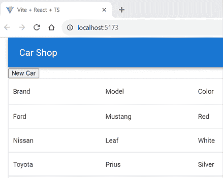

图 13.12：汽车商店

如果你按下**新汽车**按钮，它应该打开模态表单。

1.  要保存新汽车，在`AddCar.tsx`文件中创建一个名为`handleSave`的函数。`handleSave`函数调用`mutate`。然后，我们将`car`状态重置为其初始状态，并关闭模态表单：

    ```java
    // AddCar.tsx
    // Save car and close modal form
    const handleSave = () => {
      mutate(car);   
      setCar({ brand: '', model: '', color: '',  registrationNumber:'',
               modelYear: 0, price: 0 });
      handleClose();
    } 
    ```

1.  最后，我们必须将`AddCar`组件的`onClick`保存按钮更改为调用`handleSave`函数：

    ```java
    // AddCar.tsx
    <DialogActions>
      <button onClick={handleClose}>Cancel</button>
      <button onClick={**handleSave**}>Save</button>
    </DialogActions> 
    ```

1.  现在，你可以通过按下**新汽车**按钮打开模态表单。你会看到当字段为空时，每个字段中都有占位符文本。你可以用数据填写表单并按下**保存**按钮。此时，表单的外观并不美观，但我们将在下一章中对其进行样式化：

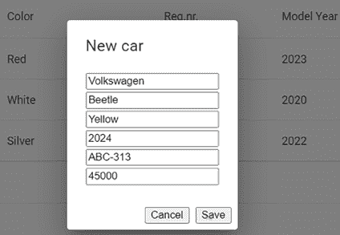

图 13.13：添加新汽车

1.  保存后，列表页面会刷新，新汽车可以在列表中看到：

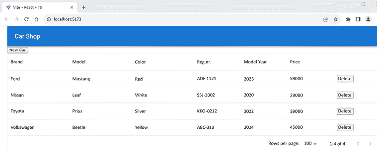

图 13.14：汽车商店

1.  现在，我们可以进行一些代码重构。当我们开始实现编辑功能时，我们实际上需要在**编辑**表单中与**新汽车**表单中相同的字段。让我们创建一个新的组件来渲染我们的**新汽车**表单中的文本字段。想法是将文本字段拆分到它们自己的组件中，然后可以在**新汽车**和**编辑**表单中使用这个组件。在`components`文件夹中创建一个新的文件名为`CarDialogContent.tsx`。我们必须使用`props`将`car`对象和`handleChange`函数传递给组件。为此，我们创建了一个新的类型`DialogFormProps`。我们可以在同一文件中定义这个类型，因为我们不需要在任何其他文件中使用它：

    ```java
    // CarDialogContent.tsx
    import { Car } from '../types';
    type DialogFormProps = {
      car: Car;
      handleChange: (event: React.ChangeEvent<HTMLInputElement>) =>
        void;
    }
    function CarDialogContent({ car, handleChange }: DialogFormProps) {
      return (
        <></>
      );
    }
    export default CarDialogContent; 
    ```

1.  然后，我们可以将`DialogContent`组件从`AddCar`组件移动到`CarDialogContent`组件。您的代码应该如下所示：

    ```java
    // CarDialogContent.tsx
    **import****DialogContent****from****'@mui/material/DialogContent'**;
    import { Car } from '../types';
    type DialogFormProps = {
      car: Car;
      handleChange: (event: React.ChangeEvent<HTMLInputElement>) =>
        void;
    }
    function CarDialogContent({ car, handleChange}: DialogFormProps) {
      return (
        **<****DialogContent****>**
          **<****input****placeholder****=****"Brand"****name****=****"brand"**
            **value****=****{car.brand}****onChange****=****{handleChange}/****><****br****/>**
          **<****input****placeholder****=****"Model"****name****=****"model"**
            **value****=****{car.model}****onChange****=****{handleChange}/****><****br****/>**
          **<****input****placeholder****=****"Color"****name****=****"color"**
            **value****=****{car.color}****onChange****=****{handleChange}/****><****br****/>**
          **<****input****placeholder****=****"Year"****name****=****"****modelYear"**
            **value****=****{car.modelYear}****onChange****=****{handleChange}/****><****br****/>**
          **<****input****placeholder****=****"Reg.nr."****name****=****"registrationNumber"**
            **value****=****{car.registrationNumber}****onChange****=****{handleChange}/****><****br****/>**
          **<****input****placeholder****=****"****Price"****name****=****"price"**
            **value****=****{car.price}****onChange****=****{handleChange}/****><****br****/>**
        **</****DialogContent****>**
      );
    }
    export default CarDialogContent; 
    ```

1.  现在，我们可以将`CarDialogContent`导入到`AddCar`组件中，并在`Dialog`组件内部渲染它。使用属性将`car`状态和`handleChange`函数传递给组件。同时，从`AddCar`组件中删除未使用的 MUI `DialogContent`导入：

    ```java
    // AddCar.tsx
    // Add the following import 
    // and remove unused imports: DialogContent
    **import****CarDialogContent****from****'./CarDialogContent'****;**
    // render CarDialogContent and pass props
    return(
      <div>
        <Button onClick={handleClickOpen}>New Car</Button>
        <Dialog open={open} onClose={handleClose}>
          <DialogTitle>New car</DialogTitle>
            **<****CarDialogContent****car****=****{car}****handleChange****=****{handleChange}/****>**
          <DialogActions>
             <Button onClick={handleClose}>Cancel</Button>
             <Button onClick={handleSave}>Save</Button>
          </DialogActions>
        </Dialog>
      </div>
    ); 
    ```

1.  尝试添加一辆新车，它应该像重构之前一样工作。

接下来，我们将开始实现编辑功能。

# 添加编辑功能

我们将通过在每个表格行中添加**编辑**按钮来实现编辑功能。当按下行中的**编辑**按钮时，它将打开一个模态表单，用户可以在其中编辑现有的汽车并保存他们的更改。想法是将网格行中的汽车数据传递到编辑表单中，当表单打开时，表单字段将被填充：

1.  首先，在`components`文件夹中创建一个名为`EditCar.tsx`的文件。我们必须为我们的属性定义一个`FormProps`类型，并且这个类型可以在我们的组件内部定义，因为我们不需要这个类型在其他任何地方。传递给`EditCar`组件的数据类型是`CarResponse`类型。我们还将创建一个用于汽车数据的`state`，就像我们在添加功能部分所做的那样。`EditCar.tsx`文件的代码如下：

    ```java
    // EditCar.tsx
    import { useState } from 'react';
    import { Car, CarResponse } from '../types';
    type FormProps = {
      cardata: CarResponse;
    }
    function EditCar({ cardata }: FormProps) {
      const [car, setCar] = useState<Car>({
        brand: '',
        model: '',
        color: '',
        registrationNumber: '',
        modelYear: 0,  
        price: 0
      });

      return(
        <></>
      );  
    }
    export default EditCar; 
    ```

1.  我们将创建一个当按下**编辑**按钮时将打开的对话框。我们需要`open`状态来定义对话框是可见的还是隐藏的。添加打开和关闭`Dialog`组件并保存更新的函数：

    ```java
    // EditCar.tsx
    import { useState } from 'react';
    **import****Dialog****from****'@mui/material/Dialog'****;**
    **import****DialogActions****from****'@mui/material/DialogActions'****;**
    **import****DialogTitle****from****'@mui/material/DialogTitle'****;**
    import { Car, CarResponse } from '../types';
    type FormProps = {
      cardata: CarResponse;
    }
    function EditCar({ cardata }: FormProps) {
      const [open, setOpen] = useState(false);
      const [car, setCar] = useState<Car>({
        brand: '',
        model: '',
        color: '',
        registrationNumber: '',
        modelYear: 0,  
        price: 0
      });
      **const****handleClickOpen** **= () => {**
        **setOpen****(****true****);**
      **};**

      **const****handleClose** **= () => {**
        **setOpen****(****false****);**
      **};**

      **const****handleSave** **= () => {**
        **setOpen****(****false****);**
      **}**
      return(
        <>
          **<****button****onClick****=****{handleClickOpen}****>**
            **Edit**
          **</****button****>**
          **<****Dialog****open****=****{open}****onClose****=****{handleClose}****>**
            **<****DialogTitle****>****Edit car****</****DialogTitle****>**
            **<****DialogActions****>**
              **<****button****onClick****=****{handleClose}****>****Cancel****</****button****>**
              **<****button****onClick****=****{handleSave}****>****Save****</****button****>**
            **</****DialogActions****>**
          **</****Dialog****>**
        </>
      );
    }
    export default EditCar; 
    ```

1.  接下来，我们将导入`CarDialogContent`组件并在`Dialog`组件内部渲染它。我们还需要添加`handleChange`函数，该函数将保存编辑的值到`car`状态。我们使用属性传递`car`状态和`handleChange`函数，就像我们之前在添加功能中做的那样：

    ```java
    // EditCar.tsx
    // Add the following import
    **import****CarDialogContent****from****'./CarDialogContent'****;**
    // Add handleChange function
    const handleChange = (event : React.ChangeEvent<HTMLInputElement>) =>
    {
      setCar({...car, [event.target.name]: event.target.value});
    }
    // render CarDialogContent inside the Dialog
    return(
      <>
        <button onClick={handleClickOpen}>
          Edit
        </button>
        <Dialog open={open} onClose={handleClose}>
          <DialogTitle>Edit car</DialogTitle>
          **<****CarDialogContent****car****=****{car}****handleChange****=****{handleChange}/****>**
          <DialogActions>
            <button onClick={handleClose}>Cancel</button>
            <button onClick={handleSave}>Save</button>
          </DialogActions>
        </Dialog>
      </>
    ); 
    ```

1.  现在，我们将使用`handleClickOpen`函数中的属性设置`car`状态值：

    ```java
    // EditCar.tsx
    const handleClickOpen = () => {
      **setCar****({**
        **brand****: cardata.****brand****,**
        **model****: cardata.****model****,**
        **color****: cardata.****color****,**
        **registrationNumber****: cardata.****registrationNumber****,**
        **modelYear****: cardata.****modelYear****,**
        **price****: cardata.****price**
      **});**
      setOpen(true);
    }; 
    ```

我们的形式将使用传递给组件的属性中的汽车对象的值进行填充。

1.  在这一步中，我们将向`Carlist`组件中的数据网格添加编辑功能。打开`Carlist.tsx`文件并导入`EditCar`组件。创建一个新列，使用`renderCell`列属性渲染`EditCar`组件，就像我们在删除功能部分所做的那样。我们将行对象传递给`EditCar`组件，该对象包含汽车对象：

    ```java
    // Carlist.tsx
    // Add the following import
    **import****EditCar****from****'./EditCar'****;**
    // Add a new column
    const columns: GridColDef[] = [
      {field: 'brand', headerName: 'Brand', width: 200},
      {field: 'model', headerName: 'Model', width: 200},
      {field: 'color', headerName: 'Color', width: 200},
      {field: 'registrationNumber', headerName: 'Reg.nr.', width: 150},
      {field: 'modelYear', headerName: 'Model Year', width: 150},
      {field: 'price', headerName: 'Price', width: 150},
      **{**
        **field****:** **'edit'****,**
        **headerName****:** **''****,**
        **width****:** **90****,**
        **sortable****:** **false****,**
        **filterable****:** **false****,**
        **disableColumnMenu****:** **true****,**
        **renderCell****:** **(****params: GridCellParams****) =>**
          **<****EditCar****cardata****=****{params.row}** **/>**
      **},**
      {
        field: 'delete',
        headerName: '',
        width: 90,
        sortable: false,
        filterable: false,
        disableColumnMenu: true,
        renderCell: (params: GridCellParams) => (
          <button 
            onClick={() => {
              if (window.confirm(`Are you sure you want to delete
                  ${params.row.brand} ${params.row.model}?`))
                mutate(params.row._links.car.href)
            }}>
            Delete
          </button>
        ),
      },
    ]; 
    ```

1.  现在，您应该在汽车列表的每一行中看到**编辑**按钮。当您按下**编辑**按钮时，它应该打开汽车表单并使用您按下的按钮所在的行的汽车填充字段：

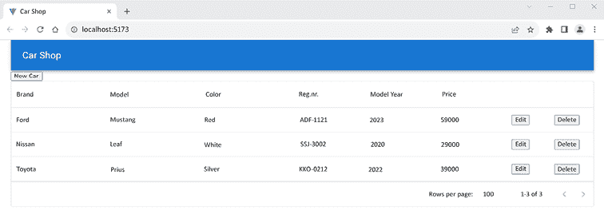

图 13.15：编辑按钮

1.  接下来，我们必须实现发送更新汽车到后端的更新请求。为了更新汽车数据，我们必须向`http://localhost:8080/api/cars/[carid]` URL 发送一个`PUT`请求。链接将与删除功能中的链接相同。请求包含在主体中的更新汽车对象，以及我们为添加功能设置的`'Content-Type':'application/json'`头。对于更新功能，我们需要一个新的类型。在 React Query 中，突变函数只能接受一个参数，但在我们的情况下，我们必须发送汽车对象（`Car`类型）及其链接。

    我们可以通过传递一个包含两个值的对象来解决。打开`types.ts`文件并创建以下类型，称为`CarEntry`：

    ```java
    export type CarEntry = {
      car: Car;
      url: string;
    } 
    ```

1.  然后，打开`carapi.ts`文件，创建以下函数并导出它。该函数接受`CarEntry`类型的对象作为参数，并具有`car`和`url`属性，其中我们获取请求中需要的值：

    ```java
    // carapi.ts
    // Add CarEntry to import
    import { CarResponse, Car, **CarEntry** } from '../types';
    // Add updateCar function
    export const updateCar = async (carEntry: CarEntry):
      Promise<CarResponse> => {
      const response = await axios.put(carEntry.url, carEntry.car, {
        headers: {
          'Content-Type': 'application/json'
        },
      });
      return response.data;
    } 
    ```

1.  接下来，我们将`updateCar`函数导入到`EditCar`组件中，并使用`useMutation`钩子发送请求。在编辑成功后，我们使汽车查询失效以重新获取列表；因此，我们还需要获取查询客户端：

    ```java
    // EditCar.tsx
    // Add the following imports
    import { updateCar } from '../api/carapi';
    import { useMutation, useQueryClient } from '@tanstack/react-query';
    // Get query client
    const queryClient = useQueryClient();
    // Use useMutation hook
    const { mutate } = useMutation(updateCar, {
      onSuccess: () => {
        queryClient.invalidateQueries(["cars"]);
      },
      onError: (err) => {
        console.error(err);
      }
    }); 
    ```

1.  然后，在`handleSave`函数中调用`mutate`。如前所述，`mutate`只接受一个参数，我们必须传递汽车对象和 URL；因此，我们创建一个包含这两个值的对象，并将其传递。我们还需要导入`CarEntry`类型：

    ```java
    // EditCar.tsx
    // Add CarEntry import
    import { Car, CarResponse, CarEntry } from '../types';
    // Modify handleSave function
    const handleSave = () => {
      **const** **url = cardata.****_links****.****self****.****href****;**
      **const****carEntry****:** **CarEntry** **= {car, url}**
      **mutate****(carEntry);**
      **setCar****({** **brand****:** **''****,** **model****:** **''****,** **color****:** **''****,** **registrationNumber****:****''****,**
               **modelYear****:** **0****,** **price****:** **0** **});**
      setOpen(false);
    } 
    ```

1.  最后，如果您在表中按下**编辑**按钮，它将打开模态表单并显示该行的汽车。当您按下**保存**按钮时，更新的值将保存到数据库中：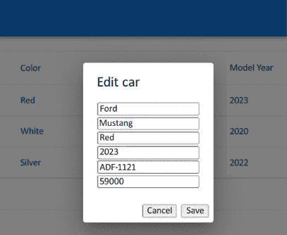

    图 13.16：编辑汽车

    类似地，如果您按下**新建汽车**按钮，它将打开一个空表单，并在表单填写并按下**保存**按钮时将新汽车保存到数据库中。我们通过使用组件属性，使用一个组件来处理这两个用例。

1.  您还可以看到在编辑汽车时后端发生的情况。如果您在成功编辑后查看 Eclipse 控制台，您可以看到有一个`update` SQL 语句更新数据库：

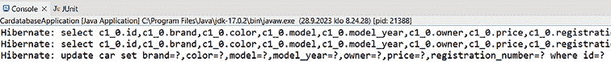

图 13.17：更新汽车语句

现在，我们已经实现了所有 CRUD 功能。

# 将数据导出到 CSV

我们还将实现一个功能，即数据的 **逗号分隔值**（**CSV**）导出。我们不需要任何额外的库来进行导出，因为 MUI 数据网格提供了这个功能。我们将激活数据网格工具栏，它包含许多有用的功能：

1.  将以下导入添加到 `Carlist.tsx` 文件中。`GridToolbar` 组件是 MUI 数据网格的工具栏，它包含许多有用的功能，如导出：

    ```java
    import { 
      DataGrid, 
      GridColDef, 
      GridCellParams,
    **GridToolbar**
    } from '@mui/x-data-grid'; 
    ```

1.  我们需要启用我们的工具栏，其中包含 **导出** 按钮和其他按钮。要在 MUI 数据网格中启用工具栏，你必须使用 `slots` 属性并将值设置为 `toolbar: GridToolbar`。`slots` 属性可以用来覆盖数据网格的内部组件：

    ```java
    return(
      <>
        <AddCar />
        <DataGrid
          rows={cars}
          columns={columns}
          disableRowSelectionOnClick={true}
          getRowId={row => row._links.self.href}
          **slots****={{ toolbar: GridToolbar }}**
        />
        <Snackbar
           open={open}
           autoHideDuration={2000}
           onClose={() => setOpen(false)}
           message="Car deleted"
        />
      </>
    ); 
    ```

1.  现在，你将在网格中看到 **导出** 按钮。如果你按下按钮并选择 **下载为 CSV**，网格数据将被导出到 CSV 文件。你可以使用 **导出** 按钮打印你的网格，你将获得一个打印友好的页面版本（你也可以使用工具栏隐藏和过滤列，并设置行密度）：

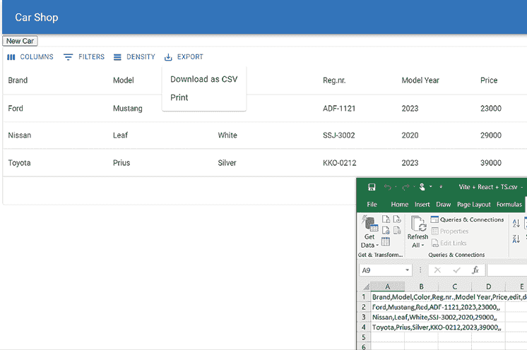

图 13.18：导出 CSV

1.  你可以通过编辑 `index.html` 页面来更改页面标题和图标，如下面的代码所示。图标可以在你的项目的 `public` 文件夹中找到，你可以使用自己的图标而不是 Vite 的默认图标：

    ```java
    <!DOCTYPE html>
    <html lang="en">
      <head>
        <meta charset="UTF-8" />
        **<****link****rel****=****"icon"****type****=****"image/svg+xml"****href****=****"****/vite.svg"** **/>**
        <meta name="viewport" content="width=device-width, initial-
                                       scale=1.0" />
        **<****title****>****Car Shop****</****title****>**
      </head>
      <body>
        <div id="root"></div>
        <script type="module" src="img/main.tsx"></script>
      </body>
    </html> 
    ```

现在，所有功能都已实现。在 *第十四章*，*使用 React MUI 美化前端* 中，我们将专注于美化前端。

# 摘要

在本章中，我们实现了我们应用的所有功能。我们从从后端获取汽车并在 MUI `DataGrid` 中显示它们开始，MUI `DataGrid` 提供了分页、排序和过滤功能。然后，我们实现了删除功能并使用 `SnackBar` 组件向用户反馈。

使用 MUI 模态 `dialog` 组件实现了添加和编辑功能。最后，我们实现了将数据导出到 CSV 文件的能力。

在下一章中，我们将使用 React Material UI 组件库来美化我们的前端。

# 问题

1.  你如何使用 React 和 REST API 获取并展示数据？

1.  你如何使用 React 和 REST API 删除数据？

1.  你如何使用 React 和 MUI 显示 toast 消息？

1.  你如何使用 React 和 REST API 添加数据？

1.  你如何使用 React 和 REST API 更新数据？

1.  你如何使用 React 将数据导出到 CSV 文件？

# 进一步阅读

对于学习 React 和 React Query，还有其他很好的资源。例如：

+   *实用 React 查询 – TkDoDo 的博客*，由 Dominik Dorfmeister 提供 ([`tkdodo.eu/blog/practical-react-query`](https://tkdodo.eu/blog/practical-react-query))

+   *Material Design Blog*，由 Google 提供 ([`material.io/blog/`](https://material.io/blog/))

# 在 Discord 上了解更多

要加入本书的 Discord 社区——在那里您可以分享反馈、向作者提问以及了解新书发布——请扫描下面的二维码：

[`packt.link/FullStackSpringBootReact4e`](https://packt.link/FullStackSpringBootReact4e)


