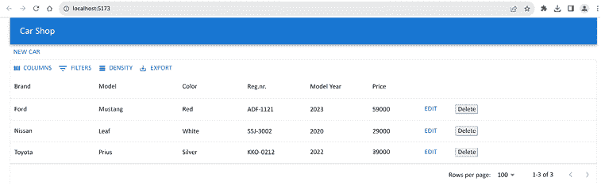
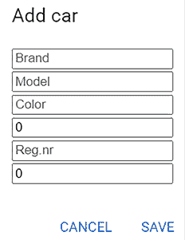
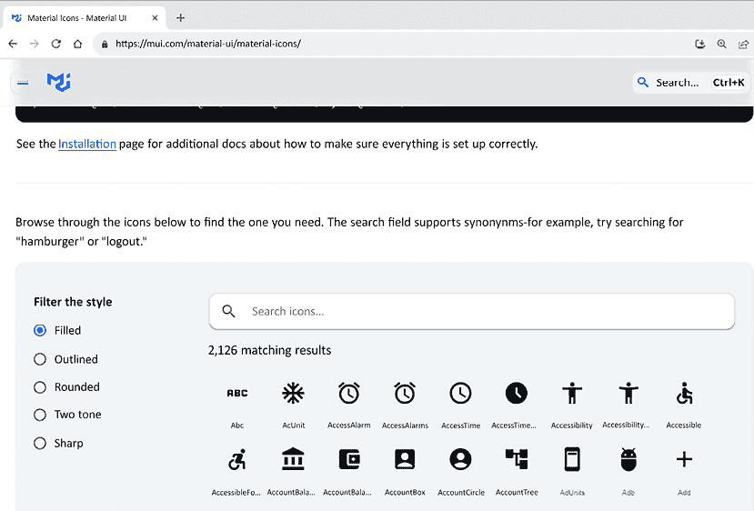
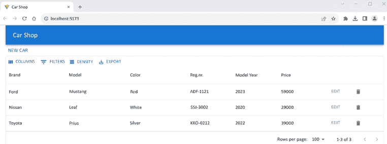
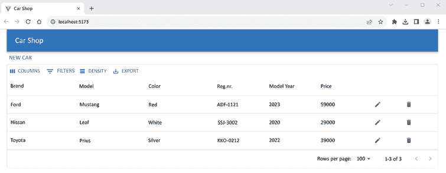
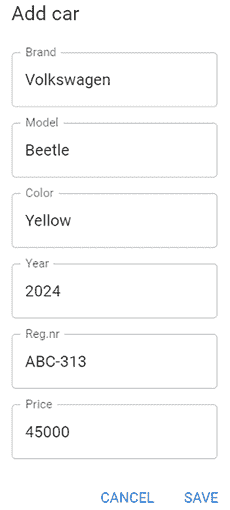

# 第十四章：使用 MUI 设计前端

本章解释了如何在我们的前端使用 **Material U**I （**MUI**）组件。我们将使用 `Button` 组件来显示样式化按钮。我们还将使用 MUI 图标和 `IconButton` 组件。我们模态表单中的输入字段将被 `TextField` 组件替换。

在本章中，我们将涵盖以下主题：

+   使用 MUI `Button` 组件

+   使用 MUI `Icon` 和 `IconButton` 组件

+   使用 MUI `TextField` 组件

在本章结束时，我们将拥有一个专业且光鲜的用户界面，React 前端中的代码更改最小。

# 技术要求

我们在第五章，*保护后端*中创建的 Spring Boot 应用程序是必需的，以及第十二章，*为我们的 Spring Boot RESTful Web 服务设置前端*（未加密的后端）中的修改。

我们还需要在第十三章，*添加 CRUD 功能*中使用的 React 应用程序。

在以下 GitHub 链接中可用的代码示例也将被需要：[`github.com/PacktPublishing/Full-Stack-Development-with-Spring-Boot-3-and-React-Fourth-Edition/tree/main/Chapter14`](https://github.com/PacktPublishing/Full-Stack-Development-with-Spring-Boot-3-and-React-Fourth-Edition/tree/main/Chapter14)。

# 使用 MUI Button 组件

我们的前端已经使用了一些 Material UI 组件，例如 `AppBar` 和 `Dialog`，但我们仍然在使用大量未加样式的 HTML 元素。首先，我们将用 Material UI `Button` 组件替换 HTML 按钮元素。

执行以下步骤以在我们的 **新汽车** 和 **编辑汽车** 模态表单中实现 `Button` 组件：

1.  将 MUI `Button` 组件导入到 `AddCar.tsx` 和 `EditCar.tsx` 文件中：

    ```java
    // AddCar.tsx & EditCar.tsx
    import Button from '@mui/material/Button'; 
    ```

1.  将 `AddCar` 组件中的按钮更改为使用 `Button` 组件。我们正在使用 `'``text``'` 按钮，这是 `Button` 的默认类型。

    如果你想要使用其他按钮类型，例如 `'``outlined``'`，你可以通过使用 `variant` 属性来更改它（[`mui.com/material-ui/api/button/#Button-prop-variant`](https://mui.com/material-ui/api/button/#Button-prop-variant)）。

    以下代码显示了 `AddCar` 组件的 `return` 语句及其更改：

    ```java
    // AddCar.tsx
    return(
      <>
        **<****Button****onClick****=****{handleClickOpen}****>****New Car****</****Button****>**
        <Dialog open={open} onClose={handleClose}>
          <DialogTitle>New car</DialogTitle>
          <CarDialogContent car={car} handleChange={handleChange}/>
          <DialogActions>
             **<****Button****onClick****=****{handleClose}****>****Cancel****</****Button****>**
             **<****Button****onClick****=****{handleSave}****>****Save****</****Button****>**
          </DialogActions>
        </Dialog>
      </>
    ); 
    ```

1.  将 `EditCar` 组件中的按钮更改为 `Button` 组件。我们将设置 **编辑** 按钮的 `size` 为 `"``small``"`，因为按钮是在汽车网格中显示的。以下代码显示了 `EditCar` 组件的 `return` 语句及其更改：

    ```java
    // EditCar.tsx
    return(
      <>
        **<****Button****size****=****"small"****onClick****=****{handleClickOpen}****>**
          Edit
        **</****Button****>**
        <Dialog open={open} onClose={handleClose}>
          <DialogTitle>Edit car</DialogTitle>
          <CarDialogContent car={car} handleChange={handleChange}/>
          <DialogActions>
            **<****Button****onClick****=****{handleClose}****>****Cancel****</****Button****>**
            **<****Button****onClick****=****{handleSave}****>****Save****</****Button****>**
          </DialogActions>
        </Dialog>
      </>
    ); 
    ```

1.  现在，汽车列表看起来如下截图所示：



图 14.1：Carlist 按钮

模态表单按钮应如下所示：



图 14.2：表单按钮

现在，添加和编辑表单中的按钮已经使用 MUI `Button` 组件实现。

# 使用 MUI 图标和 IconButton 组件

在本节中，我们将使用`IconButton`组件在网格中的**EDIT**和**DELETE**按钮。MUI 提供了预构建的 SVG 图标，我们必须通过在终端中使用以下命令来安装：

```java
npm install @mui/icons-material 
```

让我们先在网格中实现**DELETE**按钮。MUI `IconButton`组件可以用来渲染图标按钮。我们刚刚安装的`@mui/icons-material`包包含许多可以与 MUI 一起使用的图标。

你可以在 MUI 文档中找到可用的图标列表（[`mui.com/material-ui/material-icons/`](https://mui.com/material-ui/material-icons/)）。有一个搜索功能，如果你点击列表中的任何图标，你可以找到特定图标的正确导入语句：



图 14.3：Material Icons

我们需要一个图标来为我们的**DELETE**按钮，所以我们将使用一个名为`DeleteIcon`的图标：

1.  打开`Carlist.tsx`文件并添加以下导入：

    ```java
    // Carlist.tsx
    import IconButton from '@mui/material/IconButton';
    import DeleteIcon from '@mui/icons-material/Delete'; 
    ```

1.  接下来，我们将在我们的网格中渲染`IconButton`组件。我们将修改代码中定义网格列的**DELETE**按钮。将`button`元素改为`IconButton`组件，并在`IconButton`组件内渲染`DeleteIcon`。将按钮和图标的大小都设置为小。图标按钮没有可访问的名称，因此我们将使用`aria-label`来定义一个标签我们的删除图标按钮的字符串。`aria-label`属性仅对辅助技术（如屏幕阅读器）可见：

    ```java
    // Carlist.tsx
    const columns: GridColDef[] = [
      {field: 'brand', headerName: 'Brand', width: 200},
      {field: 'model', headerName: 'Model', width: 200},
      {field: 'color', headerName: 'Color', width: 200},
      {field: 'registrationNumber', headerName: 'Reg.nr.', width: 150},
      {field: 'modelYear', headerName: 'Model Year', width: 150},
      {field: 'price', headerName: 'Price', width: 150},
      {
        field: 'edit',
        headerName: '',
        width: 90,
        sortable: false,
        filterable: false,
        disableColumnMenu: true,
        renderCell: (params: GridCellParams) => 
          <CarForm mode="Edit" cardata={params.row} />
      },
      {
        field: 'delete',
        headerName: '',
        width: 90,
        sortable: false,
        filterable: false,
        disableColumnMenu: true,
        renderCell: (params: GridCellParams) => (
          **<****IconButton****aria-label****=****"delete"****size****=****"small"**
            onClick={() => {
              if (window.confirm(`Are you sure you want to delete
                  ${params.row.brand} ${params.row.model}?`))
                mutate(params.row._links.car.href)
            }}>
            **<****DeleteIcon****fontSize****=****"small"** **/>**
          **</****IconButton****>**
        ),
      },
    ]; 
    ```

1.  现在，网格中的**DELETE**按钮应该看起来像下面的截图：



图 14.4：删除图标按钮

1.  接下来，我们将使用`IconButton`组件实现**EDIT**按钮。打开`EditCar.tsx`文件并导入`IconButton`组件和`EditIcon`图标：

    ```java
    // EditCar.tsx
    import IconButton from '@mui/material/IconButton';
    import EditIcon from '@mui/icons-material/Edit'; 
    ```

1.  然后，在`return`语句中渲染`IconButton`和`EditIcon`。按钮和图标的大小设置为小，与删除按钮相同：

    ```java
    // EditCar.tsx
    return(
      <>
        **<****IconButton****aria-label****=****"edit"****size****=****"small"**
          **onClick****=****{handleClickOpen}****>**
          **<****EditIcon****fontSize****=** **"small"** **/>**
        **</****IconButton****>**
        <Dialog open={open} onClose={handleClose}>
          <DialogTitle>Edit car</DialogTitle>
          <CarDialogContent car={car} handleChange={handleChange}/>
          <DialogActions>
            <Button onClick={handleClose}>Cancel</Button>
            <Button onClick={handleSave}>Save</Button>
          </DialogActions>
        </Dialog>
      </>
    ); 
    ```

1.  最后，你将看到两个按钮都作为图标渲染，如下面的截图所示：



图 14.5：图标按钮

我们还可以使用`Tooltip`组件为我们的编辑和删除图标按钮添加工具提示。`Tooltip`组件包裹你想要附加工具提示的组件。以下示例显示了如何为编辑按钮添加工具提示：

1.  首先，通过在`EditCar`组件中添加以下导入来导入`Tooltip`组件：

    ```java
    import Tooltip from '@mui/material/Tooltip'; 
    ```

1.  然后，使用`Tooltip`组件包裹`IconButton`组件。`title`属性用于定义在工具提示中显示的文本：

    ```java
    // EditCar.tsx
    **<****Tooltip** **title=****"Edit car"****>**
      <IconButton aria-label="edit" size="small"
        onClick={handleClickOpen}>
        <EditIcon fontSize= "small" />
      </IconButton>
    **</****Tooltip****>** 
    ```

1.  现在，如果你将鼠标悬停在编辑按钮上，你将看到一个工具提示，如下面的截图所示：


图 14.6：Tooltip

接下来，我们将使用 MUI `TextField`组件实现文本字段。

# 使用 MUI `TextField`组件

在本节中，我们将将模态表单中的文本输入字段更改为 MUI `TextField`和`Stack`组件：

1.  将以下导入语句添加到 `CarDialogContent.tsx` 文件中。`Stack` 是一个一维 MUI 布局组件，我们可以用它来设置文本字段之间的间距：

    ```java
    import TextField from '@mui/material/TextField';
    import Stack from '@mui/material/Stack'; 
    ```

1.  然后，将添加和编辑表单中的输入元素更改为 `TextField` 组件。我们使用 `label` 属性来设置 `TextField` 组件的标签。有三种不同的文本输入变体（视觉样式）可用，我们使用的是 `outlined` 变体，这是默认变体。其他变体是 `standard` 和 `filled`。你可以使用 `variant` 属性来更改值。文本字段被包裹在 `Stack` 组件中，以便在组件之间获得一些间距并设置顶部边距：

    ```java
    // CarDialogContent.tsx
    return (
      <DialogContent>
        **<****Stack****spacing****=****{2}****mt****=****{1}****>**
          **<****TextField****label****=****"Brand"****name****=****"brand"**
            **value****=****{car.brand}****onChange****=****{handleChange}/****>**
          **<****TextField****label****=****"Model"****name****=****"model"**
            **value****=****{car.model}****onChange****=****{handleChange}/****>**
          **<****TextField****label****=****"Color"****name****=****"color"**
            **value****=****{car.color}****onChange****=****{handleChange}/****>**
          **<****TextField****label****=****"Year"****name****=****"modelYear"**
            **value****=****{car.modelYear}****onChange****=****{handleChange}/****>**
          **<****TextField****label****=****"Reg.nr."****name****=****"registrationNumber"**
            **value****=****{car.registrationNumber}****onChange****=****{handleChange}/****>**
          **<****TextField****label****=****"Price"****name****=****"price"**
            **value****=****{car.price}****onChange****=****{handleChange}/****>**
        **</****Stack****>**
      </DialogContent>
    ); 
    ```

    你可以在 [`mui.com/system/spacing/`](https://mui.com/system/spacing/) 上了解更多关于间距和所使用的单位的信息。

1.  修改后，添加和编辑模态表单应该看起来如下，因为我们在这两个表单中都使用了 `CarDialogContent` 组件：



图 14.7：文本字段

现在，我们已经使用 MUI 组件完成了前端样式的设计。

# 摘要

在本章中，我们使用 MUI 最终完成了前端的设计，MUI 是一个实现谷歌 Material Design 的 React 组件库。我们用 MUI 的 `Button` 和 `IconButton` 组件替换了按钮。我们的模态表单通过 MUI 的 `TextField` 组件获得了新的外观。经过这些修改后，我们的前端看起来更加专业和统一。

在下一章中，我们将专注于前端测试。

# 问题

1.  MUI 是什么？

1.  你如何使用不同的 Material UI 组件？

1.  你如何使用 MUI 图标？

# 进一步阅读

+   另一个了解 Material UI 的好资源是 *MUI 设计资源* ([`mui.com/material-ui/getting-started/design-resources/`](https://mui.com/material-ui/getting-started/design-resources/).)

# 在 Discord 上了解更多

要加入这本书的 Discord 社区——在那里你可以分享反馈、向作者提问，并了解新发布的内容——请扫描下面的二维码：

[`packt.link/FullStackSpringBootReact4e`](https://packt.link/FullStackSpringBootReact4e)


