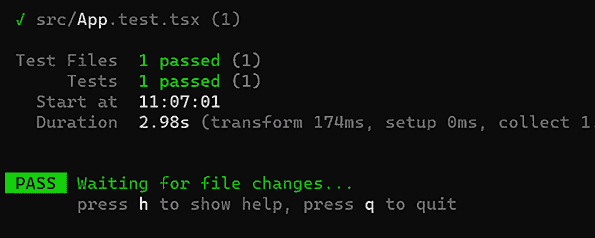
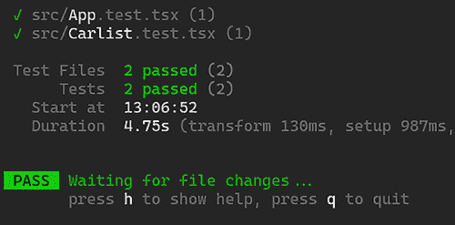
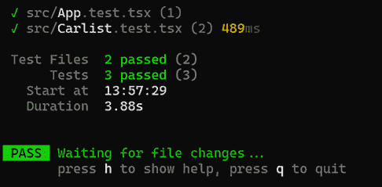
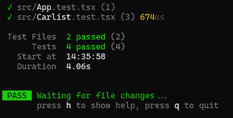
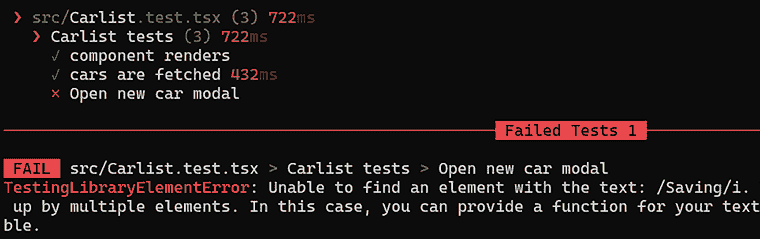

# 15

# 测试 React 应用

本章解释了测试 React 应用的基础知识。它将为我们提供一个使用 Jest 的概述，Jest 是一个 JavaScript 测试框架。我们将探讨如何创建和运行新的测试套件和测试。为了测试我们的 React Vite 项目，我们还将学习如何结合使用 React Testing Library 和 Vitest。

在本章中，我们将涵盖以下主题：

+   使用 Jest

+   使用 React 测试库

+   使用 Vitest

+   在测试中触发事件

+   端到端测试

# 技术要求

我们在 *第五章*，*保护后端安全* 中创建的 Spring Boot 应用程序，以及我们在 *第十四章*，*使用 React MUI 设计前端样式* 中使用的 React 应用程序都是必需的。

在以下 GitHub 链接中可用的代码示例也将需要跟随本章：[`github.com/PacktPublishing/Full-Stack-Development-with-Spring-Boot-3-and-React-Fourth-Edition/tree/main/Chapter15`](https://github.com/PacktPublishing/Full-Stack-Development-with-Spring-Boot-3-and-React-Fourth-Edition/tree/main/Chapter15)。

# 使用 Jest

**Jest** 是由 Meta Inc. 开发的 JavaScript 测试框架，[`jestjs.io/`](https://jestjs.io/)。它广泛用于 React，并为测试提供了许多有用的功能。例如，您可以创建一个 **快照** 测试，从中可以获取 React 树的快照，并调查状态是如何变化的。Jest 具有模拟功能，您可以使用它来测试，例如，您的异步 REST API 调用。它还提供了在测试用例中进行断言所需的函数。

为了演示语法，我们将看到如何为一个基本的 TypeScript 函数创建一个测试用例，该函数执行一些简单的计算。以下函数接受两个数字作为参数，并返回这两个数字的乘积：

```java
// multi.ts
export const calcMulti = (x: number, y: number): number => {
  return x * y;
} 
```

以下代码片段显示了针对前面函数的 Jest 测试：

```java
// multi.test.ts
import { calcMulti } from './multi';
test("2 * 3 equals 6", ()  =>  {
  expect(calcMulti(2, 3)).toBe(6);
}); 
```

测试用例以一个 `test()` 方法开始，该方法运行测试用例。`test()` 方法需要两个必需的参数：测试名称（一个描述性字符串）和包含测试代码的匿名函数。当您想要测试值时，将使用 `expect()` 函数，它为您提供了访问多个 **匹配器** 的权限。`toBe()` 函数是一个匹配器，它检查函数的结果是否等于匹配器中的值。

Jest 中有许多不同的匹配器可用，您可以在文档中找到它们：[`jestjs.io/docs/using-matchers`](https://jestjs.io/docs/using-matchers)。

`describe()` 是一个在测试套件中用来将相关的测试用例组合在一起的功能。它帮助您根据功能组织测试，或者在 React 中，根据被测试的组件来组织。在下面的示例中，我们有一个包含 `App` 组件两个测试用例的测试套件：

```java
describe("App component", () => {
  test("App component renders", () => {
    // 1st test case
  })
  test("Header text", () => {
    // 2nd test case
  })
}); 
```

# 使用 React 测试库

**React Testing Library** ([`testing-library.com/`](https://testing-library.com/))是一套用于测试 React 组件的工具和 API。它可以用于 DOM 测试和查询。React Testing Library 提供了一套查询函数，帮助您根据文本内容、标签等搜索元素。它还提供了模拟用户操作的工具，例如点击按钮和输入字段。

让我们通过一些 React Testing Library 中的重要概念来学习。Testing Library 提供了一个`render()`方法，它将 React 元素渲染到 DOM 中，使其可用于测试：

```java
import { render } from '@testing-library/react'
render(<MyComponent />); 
```

**查询**可以用来在页面上查找元素。`screen`对象是一个用于查询渲染组件的实用工具。它提供了一套查询方法，可以用来在页面上查找元素。有不同类型的查询，以不同的关键词开头：`getBy`、`findBy`或`queryBy`。`getBy`和`findBy`查询如果没有找到元素会抛出错误。`queryBy`查询如果没有找到元素则返回`null`。

应该使用哪种查询取决于具体情况，你可以在[`testing-library.com/docs/dom-testing-library/cheatsheet/`](https://testing-library.com/docs/dom-testing-library/cheatsheet/)了解更多关于不同查询之间的差异。

例如，`getByText()`方法会在文档中查询包含指定文本的元素：

```java
import { render, screen } from '@testing-library/react'
render(<MyComponent />);
// Find text Hello World (case-insensitive)
screen.getByText(/Hello World/i); 
```

`/Hello World/i`中的正斜杠(`/`)用于定义正则表达式模式，而末尾的`i`标志代表不区分大小写。这意味着它正在寻找包含“Hello World”文本的内容，且不区分大小写。你也可以通过传递一个字符串作为参数来使用一个完全匹配的字符串，该字符串是区分大小写的：

```java
screen.getByText("Hello World"); 
```

然后，我们可以使用`expect`来进行断言。`jest-dom`是 React Testing Library 的配套库，它提供了一些在测试 React 组件时非常有用的自定义匹配器。例如，它的`toBeInTheDocument()`匹配器检查元素是否存在于文档中。如果以下断言通过，则测试用例将通过；否则，它将失败：

```java
import { render, screen } from '@testing-library/react'
import matchers from '@testing-library/jest-dom/matchers ';
render(<MyComponent />);
expect(screen.getByText(/Hello World/i)).toBeInTheDocument(); 
```

你可以在`jest-dom`文档中找到所有匹配器：[`github.com/testing-library/jest-dom`](https://github.com/testing-library/jest-dom)。

现在我们已经学习了 Jest 和 React Testing Library 的基础知识。这两个库都是测试 React 应用所必需的。Jest 是一个提供测试环境和断言库的测试框架。React Testing Library 是一个专为测试 React 组件设计的实用库。接下来，我们将学习如何在 Vite 项目中开始测试。

# 使用 Vitest

**Vitest** ([`vitest.dev/`](https://vitest.dev/)) 是 Vite 项目的测试框架。在 Vite 项目中也可以使用 Jest，并且有一些库提供了 Jest 的 Vite 集成（例如，[`github.com/sodatea/vite-jest`](https://github.com/sodatea/vite-jest)）。在这本书中，我们将使用 Vitest，因为它更容易与 Vite 一起使用。Vitest 与 Jest 类似，它提供了`test`、`describe`和`expect`，这些我们在 Jest 部分已经了解过。

在本节中，我们将为我们在第十四章中使用的用于*使用 MUI 设计前端*的前端项目创建使用 Vitest 和 React 测试库的测试。

## 安装和配置

第一步是将 Vitest 和 React 测试库安装到我们的项目中：

1.  在 Visual Studio Code 中打开项目。在终端中移动到你的项目文件夹，并在你的项目文件夹内执行以下`npm`命令：

    ```java
    npm install -D vitest @testing-library/react @testing-library/jest-
      dom jsdom 
    ```

    `npm`命令中的`-D`标志表示应该将包保存为`package.json`文件`devDependencies`部分的开发依赖项。这些包对于开发和测试是必要的，但不是应用程序生产运行时所需的。

1.  接下来，我们必须通过使用 Vite 配置文件`vite.config.ts`来配置 Vitest。打开文件，并添加一个新的`test`属性，进行以下更改：

    ```java
    import { defineConfig } from 'vite/config'
    import react from '@vitejs/plugin-react'
    // https://vitejs.dev/config/
    export default defineConfig({
      plugins: [react()],
      **test****: {**
        **globals****:** **true****,**
        **environment****:** **'jsdom'****,**
      **},**
    }) 
    ```

    默认情况下，Vitest 不提供全局 API。`globals: true`设置允许我们全局引用 API（如`test`、`expect`等），就像 Jest 一样。`environment: 'jsdom '`设置定义了我们正在使用浏览器环境而不是 Node.js。

1.  现在，你可以在`test`属性中看到一个 TypeScript 类型错误，因为`test`类型在 Vite 的配置中不存在。你可以从 Vitest 导入扩展的 Vite 配置来消除错误。按照以下代码修改`defineConfig`导入：

    ```java
    // Modify defineConfig import
    import { defineConfig } from **'****vitest/config'** 
    ```

1.  接下来，我们将向`package.json`文件添加`test`脚本：

    ```java
    "scripts": {
        "dev": "vite",
        "build": "tsc && vite build",
        "lint": "eslint src --ext ts,tsx --report-unused-disable-             directives --max-warnings 0",
        "preview": "vite preview",
        **"test"****:****"vitest"**
      }, 
    ```

1.  现在，我们可以使用以下`npm`命令运行我们的测试。在这个阶段，你会得到一个错误，因为我们还没有任何测试：

    ```java
    npm run test 
    ```

如果你想要从 VS Code IDE 运行测试，也可以找到一个 Vitest 的 Visual Studio Code 扩展：[`marketplace.visualstudio.com/items?itemName=ZixuanChen.vitest-explorer`](https://marketplace.visualstudio.com/items?itemName=ZixuanChen.vitest-explorer)。

默认情况下，测试运行中要包含的文件是通过以下全局模式定义的（[`vitest.dev/config/#include`](https://vitest.dev/config/#include)）：

```java
['**/*.{test,spec}.?(c|m)[jt]s?(x)'] 
```

我们将使用`component.test.tsx`命名约定来命名我们的测试文件。

## 运行我们的第一个测试

现在，我们将创建我们的第一个测试用例，以验证我们的`App`组件是否渲染，并且可以找到应用头部文本：

1.  在你的 React 应用程序的`src`文件夹中创建一个名为`App.test.tsx`的新文件，并创建一个新的测试用例。因为我们使用 Vitest，所以从`vitest`导入`describe`和`test`：

    ```java
    import { describe, test } from 'vitest';
    describe("App tests", () => {
      test("component renders", () => {
      // Test case code
      })
    }); 
    ```

1.  然后，我们可以使用 React Testing Library 的`render`方法来渲染我们的`App`组件：

    ```java
    import { describe, test } from 'vitest';
    **import** **{ render }** **from****'@testing-library/react'****;**
    **import****App****from****'./App'****;**
    describe("App tests", () => {
      test("component renders", () => {
        **render****(****<****App** **/>****);**
      })
    }); 
    ```

1.  接下来，我们使用`screen`对象及其查询 API 来验证应用头部文本已被渲染：

    ```java
    import { describe, test, **expect** } from 'vitest';
    import { render, **screen** } from '@testing-library/react';
    import App from './App';
    describe("App tests", () => {
      test("component renders", () => {
        render(<App />);
        **expect****(screen.****getByText****(****/Car Shop/i****)).****toBeDefined****();**
      })
    }); 
    ```

1.  如果你想要使用`jest-dom`库的匹配器，例如我们之前使用的`toBeInTheDocument()`，你应该导入`jest-dom/vitest`包，它扩展了匹配器：

    ```java
    import { describe, test, expect } from 'vitest';
    import { render, screen } from '@testing-library/react';
    import App from './App';
    **import****'@testing-library/jest-dom/vitest'****;**
    describe("App tests", () => {
      test("component renders", () => {
        render(<App />);
        expect(screen.getByText(/Car Shop/i
            ))**.toBeInTheDocument****();**
      })
    }); 
    ```

1.  最后，我们可以在终端中输入以下命令来运行我们的测试：

    ```java
    npm run test 
    ```

我们应该看到测试通过了：



图 15.1：测试运行

测试是在**监视模式**下运行的，这意味着每次你修改源代码时，与代码更改相关的测试都会重新运行。你可以通过按*q*键退出监视模式，如图所示。你也可以通过按*r*键手动触发测试重新运行。

如果需要，你可以创建一个测试设置文件，该文件可以用于设置运行测试所需的环境和配置。设置文件将在每个测试文件之前运行。

你必须在`vite.config.ts`文件中的`test`节点中指定测试设置文件的路径：

```java
// vite.config.ts
test: {
  **setupFiles****: [****'./src/testSetup.ts'****],**
  globals: true,
  environment: 'jsdom',
}, 
```

你还可以执行在测试用例前后所需的任务。Vitest 提供了`beforeEach`和`afterEach`函数，你可以使用这些函数在测试用例前后调用代码。例如，你可以在每个测试用例之后运行 React Testing Library 的`cleanup`函数来卸载已挂载的 React 组件。如果你只想在所有测试用例之前或之后调用一次代码，你可以使用`beforeAll`或`afterAll`函数。

## 测试我们的 Carlist 组件

现在我们来为我们的`Carlist`组件编写一个测试。我们将使用我们的后端 REST API，在这一节中，你应该运行我们在上一章中使用过的后端。在测试中使用真实 API 更接近真实世界场景，并允许进行端到端集成测试。然而，真实 API 总是有一些延迟，使得测试运行速度变慢。

你也可以使用**模拟 API**。如果开发者没有访问真实 API 的权限，这很常见。使用模拟 API 需要创建和维护模拟 API 的实现。对于 React，有几个库可以用来实现这一点，例如**msw**（模拟服务工作者）和**nock**。

让我们开始吧：

1.  在你的`src`文件夹中创建一个名为`Carlist.test.tsx`的新文件。我们将导入`Carlist`组件并将其渲染。当后端数据尚未可用时，组件会渲染`'Loading...'`文本。起始代码如下所示：

    ```java
    import { describe, expect, test } from 'vitest';
    import { render, screen } from '@testing-library/react';
    import '@testing-library/jest-dom/vitest';
    import Carlist from './components/Carlist';
    describe("Carlist tests", () => {
      test("component renders", () => {
        render(<Carlist />);
        expect(screen.getByText(/Loading/i)).toBeInTheDocument();
      })
    }); 
    ```

1.  现在，如果你运行你的测试用例，你将得到以下错误：**未设置 QueryClient，使用 QueryClientProvider 设置一个**。我们在`Carlist`组件中使用 React Query 进行网络操作；因此，我们需要在组件中使用`QueryClientProvider`。下面的源代码显示了我们可以如何做到这一点。我们必须创建一个新的`QueryClient`并将重试设置为`false`。默认情况下，React Query 会重试查询三次，这可能会在你想测试错误情况时导致测试用例超时：

    ```java
    **import** **{** **QueryClient****,** **QueryClientProvider** **}** **from**
      **'@tanstack/react-query'****;**
    import { describe, test } from 'vitest';
    import { render, screen } from '@testing-library/react';
    import '@testing-library/jest-dom/vitest';
    import Carlist from './components/Carlist';
    **const** **queryClient =** **new****QueryClient****({**
      **defaultOptions****: {**
        **queries****: {**
          **retry****:** **false****,**
        **},**
      **},**
    **});**
    **const****wrapper** **= (****{**
      **children } : { children: React.ReactNode }****) => (**
        **<****QueryClientProvider****client****=** **{**
          **queryClient}****>****{children}**
        **</****QueryClientProvider****>****);**
    describe("Carlist tests", () => {
      test("component renders", () => {
        render(<Carlist />, **{ wrapper }**);
      expect(screen.getByText(/Loading/i)).toBeInTheDocument();
      })
    }); 
    ```

    我们还创建了一个返回`QueryClientProvider`组件的包装器。然后，我们使用`render`函数的第二个参数并传递我们的`wrapper`，这是一个 React 组件，这样`wrapper`就可以包裹`Carlist`组件。当你想要用额外的包装器包裹你的组件时，这是一个有用的功能。最终结果是`Carlist`组件被包裹在`QueryClientProvider`内部。

1.  现在，如果你重新运行你的测试，你将不会得到错误，并且你的新测试用例将通过。测试运行现在包括两个测试文件和两个测试：



图 15.2：测试运行

1.  接下来，我们将测试我们的`getCars`获取是否被调用，并且汽车在数据网格中渲染。网络调用是异步的，我们不知道响应何时到达。我们将使用 React Testing Library 的`waitFor`函数等待直到**新汽车**按钮被渲染，因为那时我们知道网络请求已经成功。测试将在条件满足后继续进行。

    最后，我们将使用匹配器来检查文档中是否可以找到`Ford`文本。将以下高亮的导入添加到`Carlist.test.tsx`文件中：

    ```java
    import { render, screen, waitFor } from '@testing-library/
      react'; 
    ```

1.  测试看起来如下：

    ```java
    describe("Carlist tests", () => {
      test("component renders", () => {
        render(<Carlist />, { wrapper });
        expect(screen.getByText(/Loading/i)
          ).toBeInTheDocument();
      })
      **test****(****"Cars are fetched"****,** **async** **() => {**
        **render****(****<****Carlist** **/>****, { wrapper });**
        **await****waitFor****(****() =>** **screen.****getByText****(****/New Car/i****));**
        **expect****(screen.****getByText****(****/Ford/i****)).****toBeInTheDocument****();**
      **})**
    }); 
    ```

1.  如果你重新运行测试，你现在可以看到三个测试通过了：



图 15.3：测试运行

我们现在已经学习了 Vitest 的基础知识以及如何在 Vite React 应用中创建和运行测试用例。接下来，我们将学习如何在测试用例中模拟用户操作。

# 测试中触发事件

React Testing Library 提供了一个`fireEvent()`方法，可以在测试用例中触发 DOM 事件。`fireEvent()`方法的使用方式如下。首先，我们必须从 React Testing Library 中导入它：

```java
import { render, screen, fireEvent } from '@testing-library/react'; 
```

接下来，我们必须找到元素并触发其事件。以下示例显示了如何触发输入元素的更改事件和按钮的点击事件：

```java
// Find input element by placeholder text
const input = screen.getByPlaceholderText('Name');
// Set input element's value
fireEvent.change(input, {target: {value: 'John'}});
// Find button element by text
const btn = screen.getByText('Submit');
// Click button
fireEvent.click(btn); 
```

事件触发后，我们可以断言预期的行为。

对于 Testing Library 还有一个配套库，称为`user-event`。`fireEvent`函数触发元素事件，但浏览器做的不仅仅是触发一个事件。例如，如果用户在输入元素中输入一些文本，它首先会被聚焦，然后触发键盘和输入事件。`user-event`模拟完整的用户交互。

要使用`user-event`库，我们必须使用以下`npm`命令在我们的项目中安装它：

```java
npm install -D @testing-library/user-event 
```

接下来，我们必须在测试文件中导入`userEvent`：

```java
import userEvent from '@testing-library/user-event'; 
```

然后，我们可以使用 `userEvent.setup()` 函数创建一个 `userEvent` 实例。我们也可以直接调用 API，这将在内部调用 `userEvent.setup()`，这就是我们将在以下示例中使用的做法。`userEvent` 提供了多个与 UI 交互的函数，例如 `click()` 和 `type()`：

```java
// Click a button
await userEvent.click(element);
// Type a value into an input element
await userEvent.type(element, value); 
```

作为示例，我们将创建一个新的测试用例，模拟在 `Carlist` 组件中按下 **新汽车** 按钮，然后检查模态表单是否已打开：

1.  打开 `Carlist.test.tsx` 文件并导入 `userEvent`：

    ```java
    import userEvent from '@testing-library/user-event'; 
    ```

1.  在 `describe()` 函数中创建一个新的测试，其中包含我们的 `Carlist` 组件测试。在测试中，我们将渲染 `Carlist` 组件并等待 **新汽车** 按钮被渲染：

    ```java
    test("Open new car modal", async () => {
      render(<Carlist />, { wrapper });
      await waitFor(() => screen.getByText(/New Car/i));
    }) 
    ```

1.  然后，使用 `getByText` 查询找到按钮，并使用 `userEvent.click()` 函数来点击按钮。使用匹配器来验证文档中是否可以找到 **保存** 按钮：

    ```java
    test("Open new car modal", async () => {
      render(<Carlist />, { wrapper });
      await waitFor(() => screen.getByText(/New Car/i));
      **await** **userEvent.****click****(screen.****getByText****(****/New Car/i****));**
      **expect****(screen.****getByText****(****/Save/i****)).****toBeInTheDocument****();**
    }) 
    ```

1.  现在，重新运行你的测试，你会看到有四个测试用例通过了：

    图 15.4：测试运行

    我们可以使用 `getByRole` 查询根据元素的角色找到元素，例如按钮、链接等。以下是如何使用 `getByRole` 查询找到包含文本 `保存` 的按钮的示例。第一个参数定义了角色，第二个参数的 `name` 选项定义了按钮文本：

    ```java
    screen.getByRole('button', { name: 'Save' }); 
    ```

1.  我们也可以通过更改测试匹配器中的文本来测试失败的测试看起来如何，例如：

    ```java
    expect(screen.getByText(/Saving/i)).toBeInTheDocument(); 
    ```

现在，如果我们重新运行测试，我们可以看到有一个测试失败了，以及失败的原因：



图 15.5：失败的测试

现在，你已经了解了在 React 组件中测试用户交互的基础知识。

# 端到端测试

**端到端**（**E2E**）**测试**是一种专注于测试整个应用程序工作流程的方法。我们不会在本书中详细讨论它，但我们会给你一个大致的了解，并介绍一些我们可以使用的工具。

目标是模拟用户场景和与应用程序的交互，以确保所有组件都能正确协同工作。端到端测试覆盖前端、后端以及正在测试的软件的所有接口或外部依赖。端到端测试的范围也可以是 *跨浏览器* 或 *跨平台*，即使用多个不同的网络浏览器或移动设备来测试应用程序。

有几种工具可用于端到端测试，例如：

+   **Cypress** ([`www.cypress.io/`](https://www.cypress.io/))：这是一个可以用来创建 Web 应用程序端到端测试的工具。Cypress 测试易于编写和阅读。你可以在浏览器中看到测试执行期间应用程序的行为，并且它还有助于你在出现失败时进行调试。你可以免费使用 Cypress，但有一些限制。

+   **Playwright** ([`playwright.dev/`](https://playwright.dev/))：这是一个为 E2E 测试设计的测试自动化框架，由微软开发。您可以为 Playwright 获取一个 Visual Studio Code 扩展，并在您的项目中开始使用它。使用 Playwright 编写测试的默认语言是 TypeScript，但您也可以使用 JavaScript。

E2E 测试有助于验证您的应用程序是否满足其功能需求。

# 摘要

在本章中，我们提供了如何测试 React 应用程序的基本概述。我们介绍了 Jest，一个 JavaScript 测试框架，以及 React Testing Library，它可以用来测试 React 组件。我们还学习了如何使用 Vitest 在我们的 Vite React 应用程序中创建和运行测试，并以对 E2E 测试的简要讨论结束。

在下一章中，我们将确保我们的应用程序的安全，并将登录功能添加到前端。

# 问题

1.  Jest 是什么？

1.  什么是 React Testing Library？

1.  Vitest 是什么？

1.  您如何在测试用例中触发事件？

1.  E2E 测试的目的是什么？

# 进一步阅读

这里有一些其他关于学习 React 和测试的资源：

+   *使用 React Testing Library 简化测试*，由 Scottie Crump 编著 ([`www.packtpub.com/product/simplify-testing-with-react-testing-library/9781800564459`](https://www.packtpub.com/product/simplify-testing-with-react-testing-library/9781800564459))

+   *React Testing Library 教程*，由 Robin Wieruch 编著 ([`www.robinwieruch.de/react-testing-library/`](https://www.robinwieruch.de/react-testing-library/))

# 在 Discord 上了解更多

要加入这本书的 Discord 社区——在那里您可以分享反馈、向作者提问，并了解新版本——请扫描下面的二维码：

[`packt.link/FullStackSpringBootReact4e`](https://packt.link/FullStackSpringBootReact4e)


