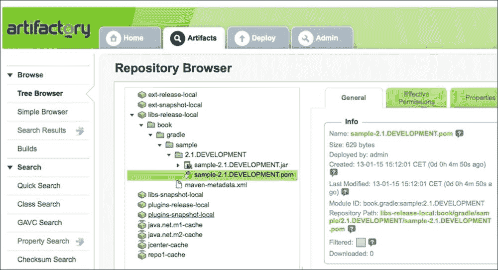
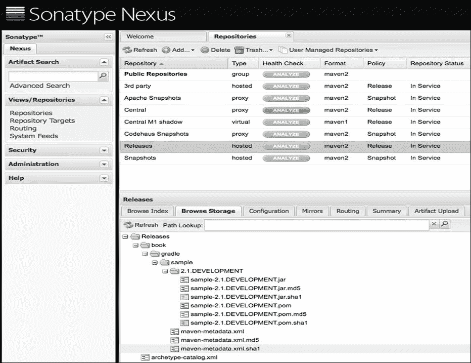

# 第五章：发布到 Maven 仓库

在上一章中，你学习了如何使用`Upload`任务发布你的项目工件。在本章中，你将了解更多关于将工件发布到 Maven 仓库的新功能和仍在开发中的特性。

你将了解 Gradle 中的新发布机制。这个特性目前仍在开发中，这意味着实现可能会在未来发生变化。但到目前为止，这种发布工件的方式将是默认的。

# 定义发布

我们必须将`maven-publish`插件添加到我们的项目中，以添加 Gradle 的新发布功能。该插件允许我们定义和部署我们的项目工件以 Maven 格式。这意味着我们的部署项目可以被支持 Maven 格式的其他开发者和项目使用。例如，其他项目可以使用 Gradle 或 Maven 并定义一个对我们发布的工件依赖。

`maven-publish`插件基于一个通用的`publishing`插件。`publishing`插件为我们项目添加了一个新的`publishing`扩展。我们可以在构建脚本中使用`publications`配置块来配置我们想要发布的工件和想要部署到的仓库。`publications`扩展在`org.gradle.api.publish`包中有`PublishingExtension`类型。该插件还向项目中添加了通用的生命周期`publish`任务。其他任务可以作为任务依赖添加到这个任务中；因此，通过单个`publish`任务，可以发布项目中的所有发布。

`maven-publish`插件还向项目中添加了额外的任务规则。有一个任务用于为项目中的每个发布生成 Maven POM 文件。插件还添加了一个新的任务规则，用于将每个发布发布到本地 Maven 仓库。最后，基于发布和仓库的组合添加了一个任务规则，用于将发布发布到指定的仓库。

让我们创建一个示例构建文件，并应用`maven-publish`插件来查看新任务：

```java
apply plugin: 'maven-publish'
apply plugin: 'java'
```

现在，我们将从命令行调用`tasks`任务：

```java
$ gradle tasks
...
Publishing tasks
----------------
publish - Publishes all publications produced by this project.
publishToMavenLocal - Publishes all Maven publications produced by this project to the local Maven cache.
...
BUILD SUCCESSFUL

Total time: 4.647 secs

```

我们可以在输出中看到`publish`和`publishToMavenLocal`任务。用于将单个发布发布到仓库的动态任务规则没有显示。

要配置我们的发布，我们必须首先添加一个`publishing`配置块。在块内部，我们定义`publications`配置块。在这个块中，我们定义一个发布。发布定义了需要发布的内容。`maven-publish`插件期望发布具有在`org.gradle.api.publish.maven`包中找到的`MavenPublication`类型。除了需要发布的工件之外，我们还可以定义生成 POM 文件的详细信息。

# 定义发布工件

我们定义的任何出版物都必须在我们的项目中具有唯一的名称。我们可以在`publications`配置块内添加多个具有自己名称的出版物。要添加工件，我们可以在出版物定义中使用`artifact`方法。我们还可以使用`artifacts`属性直接设置所有工件。

我们可以使用以下方式使用`artifact`方法定义工件：

| 类型 | 描述 |
| --- | --- |
| `AbstractArchiveTask` | 从归档任务中提取了工件的信息。工件是`org.gradle.api.artifacts`包中`PublishArtifact`的一个实例。 |
| `File` | 工件的信息是从文件名中提取的。 |
| `Map` | 这是定义工件的另一种方式。该映射必须包含一个`source`键，它引用一个文件或归档任务。我们可以使用其他属性来进一步配置工件，例如`classifier`和`extension`。 |

# 使用归档任务工件

在下面的示例构建文件中，我们定义了一个名为`publishJar`的新出版物，并将`jar`归档任务的输出定义为工件：

```java
apply plugin: 'maven-publish'
apply plugin: 'java'

// Configuration block for publishing
// artifacts from the project.
publishing {

  // Define publications with what
  // needs to be published.
  publications {

    // Name of this publication
    // is publishJar.
    publishJar(MavenPublication) {

      // Use output of jar task
      // as the artifact for
      // the publication.
      artifact jar

      // Alternatively we can use
      // a Map notation:
      // artifact source: jar
    }

  }
}
```

接下来，我们将运行`tasks`任务，在输出中，我们将能够看到为发布此出版物而新生成的任务：

```java
$ gradle tasks
...
Publishing tasks
----------------
generatePomFileForPublishJarPublication - Generates the Maven POM file for publication 'publishJar'.
publish - Publishes all publications produced by this project.
publishPublishJarPublicationToMavenLocal - Publishes Maven publication 'publishJar' to the local Maven repository.
publishToMavenLocal - Publishes all Maven publications produced by this project to the local Maven cache.
...
BUILD SUCCESSFUL

Total time: 4.215 secs

```

注意到两个额外的任务，`generatePomFileForPublishJarPublication`和`publishPublishJarPublicationToMavenLocal`。出版物的名称`publishJar`用于这两个任务。Gradle 使用`generatePomFileFor<publicationName>Publication`模式为出版物生成 POM。将出版物发布到本地 Maven 仓库的任务模式是`publish<publicationName>PublicationToMavenLocal`。在本章的后面部分，我们将看到如何添加其他仓库。我们目前还不能调用这些任务，因为我们还需要设置`group`和`version`项目属性，但我们将在这部分关于生成 POM 文件的章节中介绍。现在我们可以专注于在本节中定义出版物的工件。

对于一个出版物，我们不仅限于一个工件；我们可以通过多次调用`artifact`方法来添加更多工件。或者，我们可以使用`artifacts`属性分配多个工件。对于单个出版物，每个工件都应该具有唯一的`classifier`和`extension`属性值。在我们可以调用任何任务之前，Gradle 将检查这一点，因此当工件没有唯一的`classifier`和`extensions`属性值的组合时，我们会立即收到错误消息。

在下面的示例构建文件中，我们使用`artifact`方法向我们的出版物添加了两个额外的工件：

```java
apply plugin: 'maven-publish'
apply plugin: 'java'

task sourcesJar(type: Jar) {
  from sourceSets.main.allJava
  classifier = 'sources'
}

task javadocJar(type: Jar) {
  from javadoc
}

publishing {

  publications {

    publishJar(MavenPublication) {

      artifact jar

      artifact sourcesJar

      artifact javadocJar {
        // Each artifact must have
        // a unique classifier.
        // We can set the classifier
        // via the task as in sourcesJar
        // or here in the artifact configuration.
        classifier = 'javadoc'
      }

      // Or with a Map notation we
      // can write:
      // artifact source: javadocJar, classifier: 'javadoc'

    }

  }
}
```

除了使用`artifact`方法外，我们还可以使用`artifacts`属性并分配多个工件。我们分配的每个工件都必须具有唯一的`classifier`和`extension`属性值的组合。在下一个示例构建文件中，我们将使用与上一个示例相同的工件，但这次我们将它们分配给`artifacts`属性：

```java
apply plugin: 'maven-publish'
apply plugin: 'java'

task sourcesJar(type: Jar) {
  from sourceSets.main.allJava
  classifier = 'sources'
}

task javadocJar(type: Jar) {
  from javadoc
  classifier = 'javadoc'
}

publishing {

  publications {

    publishJar(MavenPublication) {

      // Use artifacts property to
      // define the artifacts.
      // The classifier for each of
      // these artifacts must be
      // unique.
      artifacts = [
        jar,
        sourcesJar,
        javaDocJar]

    }

  }
}
```

# 使用文件工件

除了存档任务外，我们还可以使用文件作为工件。Gradle 尝试从文件名中提取`extension`和`classifier`属性。我们也可以在我们将文件添加为发布工件时自行配置这些属性。

在下面的构建文件示例中，我们使用`src/files/README`和`src/files/COPYRIGHT`文件作为发布工件：

```java
apply plugin: 'maven-publish'

publishing {
  publications {
    documentation(MavenPublication) {

      // Use file name as a publication artifact.
      artifact 'src/files/README'

      artifact('src/files/COPYRIGHT') {
        // Each file artifact must have a
        // unique classifier and extension.
        classifier = 'metaInformation'
      }

      // Alternative syntax is with
      // the Map notation:
      // artifact source: 'src/files/README'
      // artifact source: 'src/files/COPYRIGHT',
      //          extension: 'metaInformation'

    }
  }
}
```

# 使用软件组件

除了`artifact`方法和`artifacts`属性外，我们还可以在`publications`配置块内部使用`from`方法。我们将`SoftwareComponent`指定为 Gradle 的`from`方法的参数。`java`插件添加了名为`java`的`SoftwareComponent`，它包括`jar`工件和所有运行时依赖项。`war`插件添加了作为`SoftwareComponent`的`war`工件。`SoftwareComponent`是 Gradle 构建模型的一部分，它定义了一个依赖于其他代码或作为其他代码依赖项的代码片段。

在下一个示例构建文件中，我们将应用`war`插件到我们的项目中，这将隐式添加`java`插件。我们还定义了两个发布，每个都使用来自两个插件的`SoftwareComponent`。以下代码展示了这一点：

```java
apply plugin: 'maven-publish'
apply plugin: 'war'

publishing {

  publications {

    // First publication with
    // the name javaJar, contains
    // the artifact created by the
    // jar task.
    javaJar(MavenPublication) {
      from components.java
    }

    // Second publication with
    // the name webWar, contains
    // the artifact created by
    // the war task.
    webWar(MavenPublication) {
      from components.web
    }

  }

}
```

# 生成 POM 文件

Maven 发布的一个重要部分是 POM 文件。我们已经看到 Gradle 为我们项目添加了`generatePom<publicationName>`任务。此外，我们可以在发布配置内部定义 POM 文件的一些属性。Gradle 还提供了一个钩子来进一步自定义生成的 POM 文件。

Gradle 在生成的 POM 文件中使用项目的`version`、`group`和`name`属性。我们创建一个新的示例构建文件，在其中定义项目属性，以便它们包含在 POM 文件中。以下代码展示了这一点：

```java
apply plugin: 'maven-publish'
apply plugin: 'java'

// Defined project properties, that are
// used in the generated POM file.
// The name of the project is by default
// the directory name, but we can
// change it via a settings.gradle file
// and the rootProject.name property.
version = '2.1.RELEASE'
group = 'book.gradle'

repositories {
  jcenter()
}

dependencies {
  compile 'org.springframework:spring-context:4.1.4.RELEASE'
}

publishing {
  publications {
    sample(MavenPublication) {
      from components.java
    }
  }
}
```

现在我们执行`generatePomFileForSamplePublication`任务。`pom-default.xml`文件在`build/publications/sample`目录下创建。如果我们打开该文件，我们可以看到`groupId`、`artifactId`和`version`元素填充了从我们的 Gradle 构建文件中获取的值。以下代码展示了这一点：

```java
<?xml version="1.0" encoding="UTF-8"?>
<project xsi:schemaLocation="http://maven.apache.org/POM/4.0.0 http://maven.apache.org/xsd/maven-4.0.0.xsd" 
    >
  <modelVersion>4.0.0</modelVersion>
  <groupId>book.gradle</groupId>
  <artifactId>sample</artifactId>
  <version>2.1.RELEASE</version>
  <dependencies>
    <dependency>
      <groupId>org.springframework</groupId>
      <artifactId>spring-context</artifactId>
      <version>4.1.4.RELEASE</version>
      <scope>runtime</scope>
    </dependency>
  </dependencies>
</project>
```

我们可以在发布配置内部覆盖`groupId`、`artifactId`和`version`的值。我们使用`groupId`、`artifactId`和`version`属性设置不同于从项目属性中获取的默认值。在下一个示例构建文件中，我们将使用这些方法来设置值：

```java
apply plugin: 'maven-publish'
apply plugin: 'java'

version = '2.1.DEVELOPMENT'
group = 'book.gradle'

repositories {
  jcenter()
}

dependencies {
  compile 'org.springframework:spring-context:4.1.4.RELEASE'
}

publishing {
  publications {
    sample(MavenPublication) {
      groupId = 'book.sample.gradle'
      artifactId ='bookSample'
      version = '2.1'

      from components.java
    }
  }
}
```

再次执行`generatePomFileForSamplePublication`任务后，我们可以在生成的 POM 文件中看到新值。以下代码展示了这一点：

```java
<?xml version="1.0" encoding="UTF-8"?>
<project xsi:schemaLocation="http://maven.apache.org/POM/4.0.0 http://maven.apache.org/xsd/maven-4.0.0.xsd" 
    >
  <modelVersion>4.0.0</modelVersion>
  <groupId>book.sample.gradle</groupId>
  <artifactId>bookSample</artifactId>
  <version>2.1</version>
  <dependencies>
    <dependency>
      <groupId>org.springframework</groupId>
      <artifactId>spring-context</artifactId>
      <version>4.1.4.RELEASE</version>
      <scope>runtime</scope>
    </dependency>
  </dependencies>
</project>
```

你可能已经注意到，`generatePomFile<publicationName>Publication` 任务还向生成的 POM 文件中添加了一个 `dependencies` 元素。我们的项目依赖项被添加到 POM 文件中作为运行时依赖项。这是因为我们在发布配置中使用 `from` 方法并指定 `components.java` 值。Java 软件组件不仅将 `jar` 存档任务作为一个工件，还将项目依赖项转换为 Maven 运行时依赖项。如果我们使用存档任务来定义工件，则不会将 `dependencies` 元素添加到 POM 文件中。

在下面的示例构建文件中，我们使用 `artifact` 方法来定义发布：

```java
apply plugin: 'maven-publish'
apply plugin: 'java'

// Defined project properties, that are
// used in the generated POM file.
// The name of the project is by default
// the directory name, but we can
// change it via a settings.gradle file
// and the rootProject.name property.
version = '2.1.RELEASE'
group = 'book.gradle'

repositories {
  jcenter()
}

dependencies {
  compile 'org.springframework:spring-context:4.1.4.RELEASE'
}

publishing {
  publications {
    sample(MavenPublication) {
      artifact jar
    }
  }
}
```

当我们从命令行运行 `generatePomFileForSamplePublication` 任务时，会生成 POM 文件。现在 POM 文件的内容如下：

```java
<?xml version="1.0" encoding="UTF-8"?>
<project xsi:schemaLocation="http://maven.apache.org/POM/4.0.0 http://maven.apache.org/xsd/maven-4.0.0.xsd" 
    >
  <modelVersion>4.0.0</modelVersion>
  <groupId>book.gradle</groupId>
  <artifactId>sample</artifactId>
  <version>2.1.RELEASE</version>
</project>
```

在下一节中，我们将学习如何使用钩子自定义 POM 文件。然后，例如，我们还可以更改项目依赖项的 Maven 依赖项作用域。

## 自定义 POM 文件

要向生成的 POM 文件添加一些额外元素，我们必须使用 `pom` 属性，它是 `MavenPublication` 的一部分。这返回一个 `MavenPom` 对象，我们可以从这个对象调用 `withXml` 方法来向 POM 文件添加额外元素。我们将使用 `withXml` 方法的闭包来访问 `XmlProvider` 对象。使用 `XmlProvider` 对象，我们可以通过 `asElement` 方法获取 DOM 元素的引用，通过 `asNode` 方法获取 Groovy 节点对象，或者通过 `asString` 方法获取 `StringBuilder` 对象来扩展 POM XML。

在下面的示例构建文件中，我们将 `organization` 和 `issueManagement` 元素添加到生成的 POM 文件中：

```java
apply plugin: 'maven-publish'
apply plugin: 'java'

version = '2.1.RELEASE'
group = 'book.gradle'

repositories {
  jcenter()
}

dependencies {
  compile 'org.springframework:spring-context:4.1.4.RELEASE'
}

publishing {
  publications {
    sample(MavenPublication) {
      from components.java

      pom.withXml {

        asNode()
          .appendNode('organization')
          .with {
            appendNode('name', 'Gradle')
            appendNode('url', 'http://www.gradle.org')
        }

        asNode()
          .appendNode('issueManagement')
          .with {
            appendNode('system', 'Jenkins')
            appendNode('url', 'http://buildserver/')
          }
      }
    }
  }
}
```

如果我们生成 POM 文件，我们可以在 XML 版本中看到我们新创建的元素。这在上面的代码中显示如下：

```java
<?xml version="1.0" encoding="UTF-8"?>
<project  xsi:schemaLocation="http://maven.apache.org/POM/4.0.0 http://maven.apache.org/xsd/maven-4.0.0.xsd" >
  <modelVersion>4.0.0</modelVersion>
  <groupId>book.gradle</groupId>
  <artifactId>sample</artifactId>
  <version>2.1.RELEASE</version>
  <dependencies>
    <dependency>
      <groupId>org.springframework</groupId>
      <artifactId>spring-context</artifactId>
      <version>4.1.4.RELEASE</version>
      <scope>runtime</scope>
    </dependency>
  </dependencies>
  <organization>
    <name>Gradle</name>
    <url>http://www.gradle.org</url>
  </organization>
  <issueManagement>
    <system>Jenkins</system>
    <url>http://buildserver/</url>
  </issueManagement>
</project>
```

在上一节中，我们已经了解到，如果我们使用 `from` 方法并指定 `components.java` 值，所有项目依赖项都会被添加到生成的 POM 文件中作为运行时依赖项。这不一定总是我们想要的。使用 `withXml` 方法，我们不仅可以添加新元素，还可以更改值。

让我们在其中添加一个钩子，将依赖项的运行时作用域更改为编译作用域。在下一个构建文件中，我们将实现这一点：

```java
apply plugin: 'maven-publish'
apply plugin: 'java'

version = '2.1.RELEASE'
group = 'book.gradle'

repositories {
  jcenter()
}

dependencies {
  compile 'org.springframework:spring-context:4.1.4.RELEASE'
}

publishing {
  publications {
    sample(MavenPublication) {
      from components.java

      pom.withXml {
        asNode()
          .dependencies
          .dependency
          .findAll { dependency ->
            // Find all with scope runtime.
            // Could be more specific if we would
            // have more dependencies. For example
            // check group, name and version.
            dependency.scope.text() == 'runtime'
          }
          .each { dependency ->
            // Set scope value to compile.
            dependency.scope*.value = 'compile'
          }
      }
    }
  }
}
```

生成的 POM 文件现在具有以下内容：

```java
<?xml version="1.0" encoding="UTF-8"?>
<project  xsi:schemaLocation="http://maven.apache.org/POM/4.0.0 http://maven.apache.org/xsd/maven-4.0.0.xsd" >
  <modelVersion>4.0.0</modelVersion>
  <groupId>book.gradle</groupId>
  <artifactId>sample</artifactId>
  <version>2.1.RELEASE</version>
  <dependencies>
    <dependency>
      <groupId>org.springframework</groupId>
      <artifactId>spring-context</artifactId>
      <version>4.1.4.RELEASE</version>
      <scope>compile</scope>
    </dependency>
  </dependencies>
</project>
```

另一种解决方案是使用 `artifact` 方法而不是 `from` 方法来配置发布。这样，`dependencies` 不会添加到 POM 文件中，因为 Gradle 无法确定工件的依赖项。使用 `withXml` 方法，我们可以根据项目依赖项自行添加它。

在下面的示例构建文件中，此解决方案得到实现：

```java
apply plugin: 'maven-publish'
apply plugin: 'java'

version = '2.1.RELEASE'
group = 'book.gradle'

repositories {
  jcenter()
}

dependencies {
  compile 'org.springframework:spring-context:4.1.4.RELEASE'
}

publishing {
  publications {
    sample(MavenPublication) {
      artifact jar

      pom.withXml {
        // Create dependencies element.
        def dependencies =
          asNode()
            .appendNode('dependencies')

        project
          .configurations['compile']
          .allDependencies
          ?.each { dependency ->

            // Add a dependency element with
            // groupId, artifactId, version and scope,
            // to the dependencies element.
            dependencies.appendNode('dependency').with {
              appendNode('groupId', dependency.group)
              appendNode('artifactId', dependency.name)
              appendNode('version', dependency.version)
              appendNode('scope', 'compile')
            }

          }
      }
    }
  }
}
```

当我们调用 `generatePomFileForSamplePublication` 任务时，我们得到以下 POM 文件：

```java
<?xml version="1.0" encoding="UTF-8"?>
<project  xsi:schemaLocation="http://maven.apache.org/POM/4.0.0 http://maven.apache.org/xsd/maven-4.0.0.xsd" >
  <modelVersion>4.0.0</modelVersion>
  <groupId>book.gradle</groupId>
  <artifactId>sample</artifactId>
  <version>2.1.RELEASE</version>
  <dependencies>
    <dependency>
      <groupId>org.springframework</groupId>
      <artifactId>spring-context</artifactId>
      <version>4.1.4.RELEASE</version>
      <scope>compile</scope>
    </dependency>
  </dependencies>
</project>
```

# 定义仓库

我们必须配置一个 Maven 仓库来发布我们的配置发布。我们可以选择本地目录或仓库管理器，如 Artifactory 或 Nexus。Gradle 还添加了对将发布安装到我们的本地 Maven 仓库的支持。

## 发布到本地 Maven 仓库

Gradle 已经将我们的本地 Maven 仓库作为发布的目的地。对于每个命名的发布，都有一个`publish<publicationName>ToMavenLocal`任务。Gradle 还创建了`publishToMavenLocal`任务，该任务将所有发布发布到本地 Maven 仓库。

我们有以下示例构建文件：

```java
apply plugin: 'maven-publish'
apply plugin: 'java'

version = '2.1.DEVELOPMENT'
group = 'book.gradle'

repositories {
  jcenter()
}

dependencies {
  compile 'org.springframework:spring-context:4.1.4.RELEASE'
}

publishing {

  publications {
    publishJar(MavenPublication) {
      artifactId = 'sample'

      from components.java
    }
  }

}
```

在命令行中，我们将运行`publishToMavenLocal`任务，并查看哪些任务被执行：

```java
$ gradle publishToMavenLocal
:generatePomFileForPublishJarPublication
:compileJava
:processResources UP-TO-DATE
:classes
:jar
:publishPublishJarPublicationToMavenLocal
:publishToMavenLocal

BUILD SUCCESSFUL

Total time: 5.135 secs

```

你可能已经注意到，首先使用`jar`任务及其任务依赖项创建了发布工件。然后生成 POM 文件，我们的发布通过`publishPublishJarPublicationToMavenLocal`任务复制到本地 Maven 仓库，该任务是`publishToMavenLocal`的任务依赖项。

当我们查看本地 Maven 仓库目录时，我们看到我们的项目工件已发布：

```java
/Users/mrhaki/.m2/repository/
book
└── gradle
 └── sample
 ├── 2.1.RELEASE
 │   ├── sample-2.1.RELEASE.jar
 │   └── sample-2.1.RELEASE.pom
 └── maven-metadata-local.xml

```

## 发布到 Maven 仓库

如果我们有我们自己的公司 Maven 仓库或我们想要发布发布的目录，那么我们必须将其添加到`publishing`配置块中。在块内部，我们可以添加包含一个或多个命名仓库的`repositories`配置块。对于每个发布和仓库的组合，Gradle 创建一个具有`publish<publicationName>To<repositoryName>Repository`名称模式的任务。

在下一个示例构建文件中，我们将定义一个名为`localRepo`的简单目录仓库：

```java
apply plugin: 'maven-publish'
apply plugin: 'java'

version = '2.1.DEVELOPMENT'
group = 'book.gradle'

repositories {
  jcenter()
}

dependencies {
  compile 'org.springframework:spring-context:4.1.4.RELEASE'
}

publishing {

  publications {
    publishJar(MavenPublication) {
      artifactId = 'sample'

      from components.java
    }
  }

  // Add a Maven repository for
  // the publications.
  repositories {
    maven {
      name = 'localRepo'
      url = "$buildDir/localRepo"
    }
  }
}
```

首先，我们将运行`tasks`任务，以查看哪个任务被添加到`Publishing tasks`组：

```java
$ gradle tasks
...
Publishing tasks
----------------
generatePomFileForPublishJarPublication - Generates the Maven POM file for publication 'publishJar'.
publish - Publishes all publications produced by this project.
publishPublishJarPublicationToLocalRepoRepository - Publishes Maven publication 'publishJar' to Maven repository 'localRepo'.
publishPublishJarPublicationToMavenLocal - Publishes Maven publication 'publishJar' to the local Maven repository.
publishToMavenLocal - Publishes all Maven publications produced by this project to the local Maven cache.
...
BUILD SUCCESSFUL

Total time: 4.514 secs

```

要发布我们的项目工件，我们可以执行`publishPublishJarPublicationToLocalRepoRepository`或`publish`任务。以下输出显示了执行的任务：

```java
$ gradle publish
:generatePomFileForPublishJarPublication
:compileJava
:processResources UP-TO-DATE
:classes
:jar
:publishPublishJarPublicationToLocalRepoRepository
Uploading: book/gradle/sample/2.1.DEVELOPMENT/sample-2.1.DEVELOPMENT.jar to repository remote at file:/Users/mrhaki/Projects/book/sample/build/localRepo/
Transferring 2K from remote
Uploaded 2K
:publish

BUILD SUCCESSFUL

Total time: 5.012 secs

```

一旦执行任务，我们将在`build/localRepo`目录中获得以下文件：

```java
build/localRepo/
└── book
 └── gradle
 └── sample
 ├── 2.1.DEVELOPMENT
 │   ├── sample-2.1.DEVELOPMENT.jar
 │   ├── sample-2.1.DEVELOPMENT.jar.md5
 │   ├── sample-2.1.DEVELOPMENT.jar.sha1
 │   ├── sample-2.1.DEVELOPMENT.pom
 │   ├── sample-2.1.DEVELOPMENT.pom.md5
 │   └── sample-2.1.DEVELOPMENT.pom.sha1
 ├── maven-metadata.xml
 ├── maven-metadata.xml.md5
 └── maven-metadata.xml.sha1

```

## 发布到 Artifactory

要将我们的发布发布到具有 Maven 布局的 Artifactory 仓库，我们只需在`publications.repositories`配置块中配置仓库。我们可以设置`url`属性、一个`name`和可选的安全凭据。

在下一个示例构建文件中，我们使用一个 Artifactory 仓库来发布发布：

```java
apply plugin: 'maven-publish'
apply plugin: 'java'

version = '2.1.DEVELOPMENT'
group = 'book.gradle'

repositories {
  jcenter()
}

dependencies {
  compile 'org.springframework:spring-context:4.1.4.RELEASE'
}

publishing {

  publications {
    publishJar(MavenPublication) {
      artifactId = 'sample'

      from components.java
    }
  }

  // Add a Artifactory repository for
  // the publications with Maven layout.
  repositories {
    maven {
      name = 'artifactory'
      url = "http://localhost:8081/artifactory/libs-release-local"

      // Username and password should be
      // saved outside build file in
      // real life, eg. in gradle.properties
      // or passed via command line as 
      // project properties. 
      credentials {
        username = 'user'
        password = 'passw0rd'
      }
    }
  }
}
```

Gradle 根据发布名称和仓库名称创建一个新的`publishPublishJarPublicationToArtifactoryRepository`任务。当我们调用任务时，我们可以看到发布已部署到 Artifactory 仓库。以下代码显示了这一点：

```java
$ gradle publishPublishJarPublicationToArtifactoryRepository
:generatePomFileForPublishJarPublication
:compileJava
:processResources UP-TO-DATE
:classes
:jar
:publishPublishJarPublicationToArtifactoryRepository
Uploading: book/gradle/sample/2.1.DEVELOPMENT/sample-2.1.DEVELOPMENT.jar to repository remote at http://localhost:8081/artifactory/libs-release-local
Transferring 2K from remote
Uploaded 2K

BUILD SUCCESSFUL

Total time: 5.012 secs

```

当我们在网页浏览器中打开 Artifactory 网络应用程序时，我们可以看到我们的项目现在是仓库的一部分，如下面的截图所示：



## 发布到 Nexus

另一个仓库管理器是 Nexus。将发布物发布到 Nexus 仓库管理器与发布到 Artifactory 或本地目录并没有太大的区别。我们只需要更改 `url` 属性以引用仓库，并设置可选的安全凭据。

在以下示例构建文件中，我们使用 Nexus 仓库管理器：

```java
apply plugin: 'maven-publish'
apply plugin: 'java'

version = '2.1.DEVELOPMENT'
group = 'book.gradle'

repositories {
  jcenter()
}

dependencies {
  compile 'org.springframework:spring-context:4.1.4.RELEASE'
}

publishing {

  publications {
    publishJar(MavenPublication) {
      artifactId = 'sample'

      from components.java
    }
  }

  // Add a Maven repository for
  // the publications.
  repositories {
    maven {
      name = 'nexus'
      url = "http://localhost:8081/nexus/content/repositories/releases"
      credentials {
        username = 'admin'
        password = 'admin123'
      }
    }
  }
}
```

这次，创建了 `publishPublishJarPublicationToNexusRepository` 任务。该任务也被添加为 `publish` 任务的依赖任务。为了完成这个任务，请使用以下代码：

```java
$ gradle publishPublishJarPublicationToNexusRepository
:generatePomFileForPublishJarPublication
:compileJava
:processResources UP-TO-DATE
:classes
:jar
:publishPublishJarPublicationToNexusRepository
Uploading: book/gradle/sample/2.1.DEVELOPMENT/sample-2.1.DEVELOPMENT.jar to repository remote at http://localhost:8081/nexus/content/repositories/releases
Transferring 2K from remote
Uploaded 2K

BUILD SUCCESSFUL

Total time: 5.012 secs

```

当我们在仓库内部查看 Nexus 网络应用程序时，我们可以看到我们的项目被添加到了仓库中，如下面的截图所示：



# 摘要

在本章中，你学习了如何使用新的和正在发展的 `maven-publish` 插件。你看到了如何使用 `publications` 配置块声明你的发布物。Gradle 将会根据你声明的发布物自动创建新的任务。

你还学习了如何自定义 Gradle 发布任务生成的 POM 文件。

最后，你看到了如何配置 Maven 仓库，以便你可以将你的发布物部署到它们。我们配置了一个本地目录，这也可以是一个网络共享，并展示了如何配置 Artifactory 或 Nexus 仓库管理器。

在下一章中，你将看到如何上传到 Bintray。
