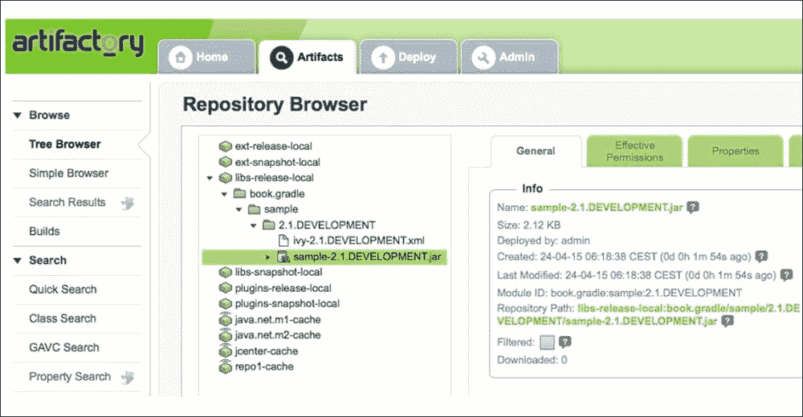
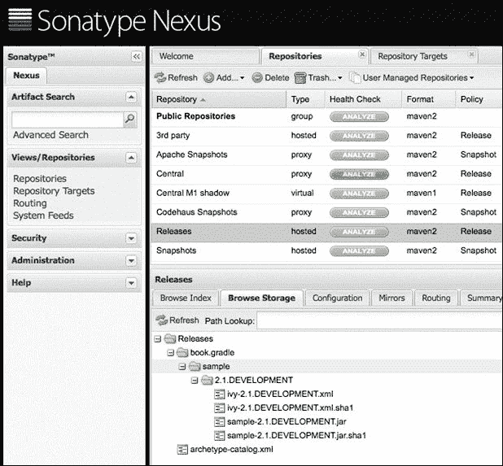

# 第七章：发布到 Ivy 仓库

在前一章中，您学习了如何将我们的项目工件发布到 Maven 仓库。在本章中，我们将使用一个 Ivy 仓库进行发布。

就像发布到 Maven 仓库一样，我们将使用 Gradle 中新的和孵化中的发布功能来发布到 Ivy 仓库。

# 定义发布内容

我们必须将`ivy-publish`插件添加到我们的项目中，以便能够将我们的工件发布到 Ivy 仓库。该插件允许我们使用 Ivy 格式来描述需要发布的工件。

`ivy-publish`插件基于通用的`publishing`插件。`publishing`插件为我们项目添加了一个新的`publishing`扩展。我们可以在构建脚本中使用`publications`配置块来配置我们想要发布的工件和想要部署到的仓库。`publications`扩展在`org.gradle.api.publish`包中有`PublishingExtension`类型。该插件还向项目添加了一个通用的生命周期`publish`任务。可以将其他任务作为任务依赖添加到这个任务中，因此，通过单个`publish`任务，可以发布项目的所有发布内容。

`ivy-publish`插件还为项目添加了一些额外的任务规则。有一个任务用于为项目中的每个发布内容生成 Ivy 描述符文件。插件还基于发布内容和仓库的组合添加了一个任务规则，用于将发布内容发布到指定的仓库。

让我们创建一个示例构建文件，并将`ivy-publish`插件应用到项目中，以查看新任务：

```java
apply plugin: 'ivy-publish'
apply plugin: 'java'
```

现在，我们将从命令行调用`tasks`任务：

```java
$ gradle tasks
...
Publishing tasks
----------------
publish - Publishes all publications produced by this project.
...
BUILD SUCCESSFUL

Total time: 4.589 secs

```

在输出中，我们看到`publish`任务。用于将单个发布内容发布到仓库的动态任务规则没有显示。

要配置我们的发布内容，我们首先需要添加一个`publishing`配置块。在该块内部，我们将定义`publications`配置块。在这个块中，我们定义一个发布内容。发布内容定义了需要发布的内容。`ivy-publish`插件期望在`org.gradle.api.publish.ivy`包中找到一个`IvyPublication`类型的发布内容。除了需要发布的工件之外，我们还可以定义生成的 Ivy 描述符文件的详细信息。

# 定义发布工件

我们定义的发布内容必须在我们的项目中具有唯一名称。我们可以在`publications`配置块内部添加多个具有自己名称的发布内容。要添加工件，我们可以在发布内容定义中使用`artifact`方法。我们还可以使用`artifacts`属性直接设置所有工件。

我们可以使用以下表格中描述的方式，使用`artifact`方法定义工件：

| 类型 | 描述 |
| --- | --- |
| `AbstractArchiveTask` | 工件信息是从归档任务中提取的。工件是`org.gradle.api.artifacts`包中的`PublishArtifact`实例。 |
| `File` | 工件的信息是从文件名中提取的。 |
| `Map` | 这是一种定义工件的其他方式。该映射必须包含一个`source`键，它引用一个文件或归档任务，以及其他我们可以使用的属性，例如`classifier`和`extension`，以进一步配置工件。 |

# 使用归档任务工件

在以下示例构建文件中，我们定义了一个名为`publishJar`的新出版物，并定义了`jar`归档任务的输出作为工件：

```java
apply plugin: 'ivy-publish'
apply plugin: 'java'

// Configuration block for publishing
// artifacts from the project.
publishing {

  // Define publications with what
  // needs to be published.
  publications {

    // Name of this publication
    // is publishJar.
    publishJar(IvyPublication) {

      // Use output of jar task
      // as the artifact for
      // the publication.
      artifact jar

      // Alternatively we can use
      // a Map notation:
      // artifact source: jar
    }

  }
}
```

接下来，我们运行`tasks`任务，并在输出中我们看到为发布此出版物生成的新任务：

```java
$ gradle tasks
...
Publishing tasks
----------------
generateDescriptorFileForPublishJarPublication - Generates the Ivy Module Descriptor XML file for publication 'publishJar'.
publish - Publishes all publications produced by this project.
...
BUILD SUCCESSFUL

Total time: 4.215 secs

```

注意额外的任务，`generateDescriptorFileForPublishJarPublication`。这个任务的名称用于`publishJar`出版物。Gradle 使用以下模式为`generateDescriptorFileFor<publicationName>Publication`出版物生成一个任务以生成 Ivy 描述符 XML 文件。我们目前还不能调用这个任务，因为我们还需要设置`group`和`version`项目属性，但我们将在这部分关于生成 Ivy 描述符文件的章节中看到这一点。现在，我们将专注于在本节中定义出版物的工件。

我们不局限于为出版物使用一个工件；我们可以通过多次调用`artifact`方法来添加更多。我们甚至可以使用`artifacts`属性来分配多个工件。对于单个出版物，每个工件都必须具有唯一的`classifier`和`extension`属性值。在我们可以调用任何任务之前，Gradle 会检查这一点，所以当工件没有唯一的`classifier`和`extensions`属性值的组合时，我们会立即收到错误信息。

在以下示例构建文件中，我们使用`artifact`方法向我们的出版物添加了两个额外的工件：

```java
apply plugin: 'ivy-publish'
apply plugin: 'java'

task sourcesJar(type: Jar) {
  from sourceSets.main.allJava
  classifier = 'sources'
}

task javadocJar(type: Jar) {
  from javadoc
}

publishing {

  publications {

    publishJar(IvyPublication) {

      artifact jar

      // Add output of sourcesJar task
      // as an artifacts. In the task
      // the classifier is already
      // set to sources.
      artifact sourcesJar

      artifact javadocJar {
        // Each artifact must have
        // a unique classifier.
        // We can set the classifier
        // via the task as in sourcesJar
        // or here in the artifact configuration.
        classifier = 'javadoc'
      }

      // Or with a Map notation we
      // can write:
      // artifact source: javadocJar, classifier: 'javadoc'

    }

  }
}
```

除了使用`artifact`方法之外，我们还可以使用`artifacts`属性并分配多个工件。我们分配的每个工件都必须具有唯一的`classifier`和`extension`属性值的组合。在下一个示例构建文件中，我们将使用与上一个示例相同的工件，但这次我们将它们分配给`artifacts`属性：

```java
apply plugin: 'ivy-publish'
apply plugin: 'java'

task sourcesJar(type: Jar) {
  from sourceSets.main.allJava
  classifier = 'sources'
}

task javadocJar(type: Jar) {
  from javadoc
  classifier = 'javadoc'
}

publishing {

  publications {

    publishJar(IvyPublication) {

      // Use artifacts property to
      // define the artifacts.
      // The classifier for each of
      // these artifacts must be
      // unique.
      artifacts = [
        jar,
        sourcesJar,
        javaDocJar]

    }

  }
}
```

## 使用文件工件

除了归档任务之外，我们还可以使用文件作为工件。Gradle 会尝试从文件名中提取`extension`和`classifier`属性。当我们添加文件作为发布工件时，我们也可以自己配置这些属性。

在以下示例构建文件中，我们使用`src/files/README`和`src/files/COPYRIGHT`文件作为发布工件：

```java
apply plugin: 'ivy-publish'

publishing {
  publications {
    documentation(IvyPublication) {

      // Use file name as a publication artifact.
      artifact 'src/files/README'

      artifact('src/files/COPYRIGHT') {
        // Each file artifact must have a
        // unique classifier and extension.
        classifier = 'metaInformation'
      }

      // Alternative syntax is with
      // the Map notation:
      // artifact source: 'src/files/README'
      // artifact source: 'src/files/COPYRIGHT',
      //          extension: 'metaInformation'

    }
  }
}
```

## 使用软件组件

除了`artifact`方法和`artifacts`属性外，我们还可以在`publications`配置块中使用`from`方法。我们指定一个 Gradle `SoftwareComponent`对象作为`from`方法的参数。`java`插件添加了一个名为`java`的`SoftwareComponent`对象，它包括`jar`归档任务和所有运行时依赖项。`war`插件添加了`war`归档任务作为`SoftwareComponent`对象。

在下一个示例构建文件中，我们将`war`插件应用到我们的项目中。`war`插件扩展了`java`插件，因此我们也将隐式地应用到我们的项目中`java`插件。我们还将定义两个发布，每个都使用来自两个插件的`SoftwareComponent`对象：

```java
apply plugin: 'ivy-publish'
apply plugin: 'war'

publishing {

  publications {

    // First publication with
    // the name javaJar, contains
    // the artifact created by the
    // jar task.
    javaJar(IvyPublication) {
      from components.java
    }

    // Second publication with
    // the name webWar, contains
    // the artifact created by
    // the war task.
    webWar(IvyPublication) {
      from components.web
    }

  }

}
```

# 生成 Ivy 描述符文件

Ivy 发布的的一个重要部分是描述符文件。我们已经看到 Gradle 为我们项目添加了一个`generateDescriptorFile<publicationName>`任务。此外，我们可以在发布配置中定义描述符文件的一些属性。Gradle 还提供了一个钩子来进一步自定义生成的描述符文件。

Gradle 使用项目的`version`、`group`、`name`和`status`属性在生成的 Ivy 描述符文件中的`info`元素。我们将创建一个新的示例构建文件，在其中定义项目属性，因此它们将被包含在文件中：

```java
apply plugin: 'ivy-publish'
apply plugin: 'java'

// Defined project properties, that are
// used in the generated descriptor file.
// The name of the project is by default
// the directory name, but we can
// change it via a settings.gradle file
// and the rootProject.name property.
version = '2.1.RELEASE'
group = 'book.gradle'

repositories {
  jcenter()
}

dependencies {
  compile 'org.springframework:spring-context:4.1.4.RELEASE'
}

publishing {
  publications {
    sample(IvyPublication) {
      from components.java
    }
  }
}
```

现在，我们执行`generateDescriptorFileForSamplePublication`任务。在`build/publications/sample`目录中创建了一个`ivy.xml`文件。如果我们打开文件，我们可以看到`info`元素属性被填充了来自我们的 Gradle 构建文件中的值。下面的代码显示了这一点：

```java
<?xml version="1.0" encoding="UTF-8"?>
<ivy-module version="2.0">
  <info organisation="book.gradle" module="sample" revision="2.1.RELEASE" status="integration" publication="20150424051601"/>
  <configurations>
    <conf name="default" visibility="public" extends="runtime"/>
    <conf name="runtime" visibility="public"/>
  </configurations>
  <publications>
    <artifact name="sample" type="jar" ext="jar" conf="runtime"/>
  </publications>
  <dependencies>
    <dependency org="org.springframework" name="spring-context" rev="4.1.4.RELEASE" conf="runtime-&gt;default"/>
  </dependencies>
</ivy-module>
```

我们可以在发布配置中覆盖`organisation`、`module`、`revision`、`status`和`branch`的值。我们需要在`IvyPublication`的配置块中设置属性。`status`和`branch`属性需要通过`descriptor`属性设置。通过`descriptor`属性，我们还可以向 Ivy 描述符文件中的`info`元素添加新的子元素。在下一个示例构建文件中，我们将使用这些方法来设置值：

```java
apply plugin: 'ivy-publish'
apply plugin: 'java'

version = '2.1.DEVELOPMENT'
group = 'book.gradle'

repositories {
  jcenter()
}

dependencies {
  compile 'org.springframework:spring-context:4.1.4.RELEASE'
}

publishing {
  publications {
    sample(IvyPublication) {
      organisation = 'book.sample.gradle'
      module ='bookSample'
      version = '2.1'
      descriptor.status = 'published'
      descriptor.branch = 'n/a'

      // Add extra element as child
      // for info.
      descriptor.extraInfo '', 'ivyauthor', 'Hubert Klein Ikkink'

      from components.java
    }
  }
}
```

我们再次执行`generateDescriptorFileForSamplePublication`任务，如下面的代码所示，我们可以在生成的 Ivy 描述符文件中看到新的值：

```java
<?xml version="1.0" encoding="UTF-8"?>
<ivy-module version="2.0">
  <info organisation="book.sample.gradle" module="bookSample" branch="n/a" revision="2.1.DEVELOPMENT" status="published" publication="20150424053039">
    <ns:ivyauthor xmlns:ns="">Hubert Klein Ikkink</ns:ivyauthor>
  </info>
  <configurations>
    <conf name="default" visibility="public" extends="runtime"/>
    <conf name="runtime" visibility="public"/>
  </configurations>
  <publications>
    <artifact name="bookSample" type="jar" ext="jar" conf="runtime"/>
  </publications>
  <dependencies>
    <dependency org="org.springframework" name="spring-context" rev="4.1.4.RELEASE" conf="runtime-&gt;default"/>
  </dependencies>
</ivy-module>
```

我们项目的依赖项被添加到生成的描述符文件中的依赖项中。这是因为我们在发布配置中使用`from`方法并指定`components.java`值。Java 软件组件不仅添加了`jar`归档任务作为归档，还将项目依赖项转换为描述符文件中的依赖项。如果我们使用归档任务来定义归档，则不会添加`dependencies`元素。

在下面的示例构建文件中，我们使用`artifact`方法来定义发布：

```java
apply plugin: 'ivy-publish'
apply plugin: 'java'

// Defined project properties, that are
// used in the generated descriptor file.
// The name of the project is by default
// the directory name, but we can
// change it via a settings.gradle file
// and the rootProject.name property.
version = '2.1.RELEASE'
group = 'book.gradle'

repositories {
  jcenter()
}

dependencies {
  compile 'org.springframework:spring-context:4.1.4.RELEASE'
}

publishing {
  publications {
    sample(IvyPublication) {
      artifact jar
    }
  }
}
```

当我们从命令行运行`generateDescriptorFileForSamplePublication`任务时，Ivy 描述符文件被生成。现在文件的内容如下：

```java
<?xml version="1.0" encoding="UTF-8"?>
<ivy-module version="2.0">
  <info organisation="book.gradle" module="sample" revision="2.1.RELEASE" status="integration" publication="20150424053351"/>
  <configurations/>
  <publications>
    <artifact name="sample" type="jar" ext="jar"/>
  </publications>
  <dependencies/>
</ivy-module>
```

在下一节中，你将学习如何使用`descriptor`属性的`withXml`方法来自定义描述符。然后，例如，我们还可以更改项目依赖项的依赖范围。

## 自定义描述符文件

要向生成的文件中添加额外元素，我们必须使用`IvyPublication`的一部分`descriptor`属性。这返回一个`IvyModuleDescriptorSpec`对象，我们将从这个对象调用`withXml`方法来向描述符文件添加额外元素。我们使用一个闭包与`withXml`方法来访问一个`XmlProvider`对象。有了`XmlProvider`对象，我们可以通过`asElement`方法获取一个 DOM 元素的引用，通过`asNode`方法获取一个 Groovy 节点对象，或者通过`asString`方法获取一个`StringBuilder`对象来扩展描述符 XML。

在以下示例构建文件中，我们将`description`和`issueMangement`元素添加到生成的描述符文件中：

```java
apply plugin: 'ivy-publish'
apply plugin: 'java'

version = '2.1.RELEASE'
group = 'book.gradle'

repositories {
  jcenter()
}

dependencies {
  compile 'org.springframework:spring-context:4.1.4.RELEASE'
}

publishing {
  publications {
    sample(IvyPublication) {
      from components.java

      // Customize generated descriptor XML.
      descriptor.withXml {

        asNode()
          .appendNode('description', 
                'Sample Gradle project')

        asNode()
          .appendNode('issueManagement')
          .with {
            appendNode('system', 'Jenkins')
            appendNode('url', 'http://buildserver/')
          }
      }
    }
  }
}
```

如果我们生成 Ivy 描述符文件，我们可以在 XML 版本中看到我们新创建的元素：

```java
<?xml version="1.0" encoding="UTF-8"?>
<ivy-module version="2.0">
  <info organisation="book.gradle" module="sample" revision="2.1.RELEASE" status="integration" publication="20150424053914"/>
  <configurations>
    <conf name="default" visibility="public" extends="runtime"/>
    <conf name="runtime" visibility="public"/>
  </configurations>
  <publications>
    <artifact name="sample" type="jar" ext="jar" conf="runtime"/>
  </publications>
  <dependencies>
    <dependency org="org.springframework" name="spring-context" rev="4.1.4.RELEASE" conf="runtime-&gt;default"/>
  </dependencies>
  <description>Sample Gradle project</description>
  <issueManagement>
    <system>Jenkins</system>
    <url>http://buildserver/</url>
  </issueManagement>
</ivy-module>
```

在上一节中，你已经了解到，如果我们使用带有`components.java`值的`from`方法，所有项目依赖项都会被添加到生成的描述符文件中作为运行时依赖项。这可能不是我们总是想要的。使用`withXml`方法，我们不仅可以添加新元素，还可以更改值。

让我们在 info 元素中更改模块属性的地方添加一个钩子。在下一个构建文件中，我们将实现这一点：

```java
apply plugin: 'ivy-publish'
apply plugin: 'java'

version = '2.1.RELEASE'
group = 'book.gradle'

repositories {
  jcenter()
}

dependencies {
  compile 'org.springframework:spring-context:4.1.4.RELEASE'
}

publishing {
  publications {
    sample(IvyPublication) {
      from components.java

      descriptor.withXml {
        // Replace value for module attribute
        // in info element.
        new StringBuilder(
          asString()
            .replaceAll(
              /module="sample"/,
              'module="ivyChapter"'))
      }
    }
  }
}
```

生成的描述符文件现在有以下内容：

```java
<?xml version="1.0" encoding="UTF-8"?>
<ivy-module version="2.0">
  <info organisation="book.gradle" module="ivyChapter" revision="2.1.RELEASE" status="integration" publication="20150424055754"/>
  <configurations>
    <conf name="default" visibility="public" extends="runtime"/>
    <conf name="runtime" visibility="public"/>
  </configurations>
  <publications>
    <artifact name="sample" type="jar" ext="jar" conf="runtime"/>
  </publications>
  <dependencies>
    <dependency org="org.springframework" name="spring-context" rev="4.1.4.RELEASE" conf="runtime-&gt;default"/>
  </dependencies>
</ivy-module>
```

# 定义仓库

我们必须配置一个 Ivy 仓库来发布我们的配置出版物。我们可以选择本地目录或仓库管理器，如 Artifactory 或 Nexus。

## 发布到本地目录

如果我们有一个想要发布我们出版物的目录，我们必须将其添加到`publishing`配置块中。在块内部，我们添加一个包含一个或多个命名仓库的`repositories`配置块。对于每个出版和仓库的组合，Gradle 都会创建一个名为`publish<publicationName>To<repositoryName>Repository`的任务。

在下一个示例构建文件中，我们定义一个名为`localRepo`的简单目录仓库：

```java
apply plugin: 'ivy-publish'
apply plugin: 'java'

version = '2.1.DEVELOPMENT'
group = 'book.gradle'

repositories {
  jcenter()
}

dependencies {
  compile 'org.springframework:spring-context:4.1.4.RELEASE'
}

publishing {

  publications {
    publishJar(IvyPublication) {
      module = 'sample'

      from components.java
    }
  }

  // Add a local director as repository
  // for the publications.
  repositories {
    ivy {
      name = 'localRepo'
      url = "$buildDir/localRepo"
    }
  }
}
```

首先，我们运行`tasks`任务来查看哪些任务被添加到`Publishing tasks`组：

```java
$ gradle tasks
...
Publishing tasks
----------------
generateDescriptorFileForPublishJarPublication - Generates the Ivy Module Descriptor XML file for publication 'publishJar'.
publish - Publishes all publications produced by this project.
publishPublishJarPublicationToLocalRepoRepository - Publishes Ivy publication 'publishJar' to Ivy repository 'localRepo'.
...
BUILD SUCCESSFUL

Total time: 11.514 secs

```

要发布我们的项目工件，我们可以执行`publishPublishJarPublicationToLocalRepoRepository`或`publish`任务。以下输出显示了执行的任务：

```java
$ gradle publish
:generateDescriptorFileForPublishJarPublication
:compileJava
:processResources UP-TO-DATE
:classes
:jar
:publishPublishJarPublicationToLocalRepoRepository
:publish

BUILD SUCCESSFUL

Total time: 6.383 secs

```

一旦任务运行完成，我们将在`build/localRepo`目录中获得以下文件：

```java
build/localRepo/
└── book.gradle
 └── sample
 └── 2.1.DEVELOPMENT
 ├── ivy-2.1.DEVELOPMENT.xml
 ├── ivy-2.1.DEVELOPMENT.xml.sha1
 ├── sample-2.1.DEVELOPMENT.jar
 └── sample-2.1.DEVELOPMENT.jar.sha1

```

## 发布到 Artifactory

要将我们的发布内容发布到 Artifactory 存储库，我们只需在`publications.repositories`配置块中配置存储库。我们可以设置`url`属性、一个`name`以及可选的安全凭据。

在下一个示例构建文件中，我们将使用 Artifactory 存储库来发布发布内容：

```java
apply plugin: 'ivy-publish'
apply plugin: 'java'

version = '2.1.DEVELOPMENT'
group = 'book.gradle'

repositories {
  jcenter()
}

dependencies {
  compile 'org.springframework:spring-context:4.1.4.RELEASE'
}

publishing {

  publications {
    publishJar(IvyPublication) {
      module = 'sample'

      from components.java
    }
  }

  // Add a Artifactory repository for
  // the publications with Maven layout.
  repositories {
    ivy {
      name = 'artifactory'
      url = "http://localhost:8081/artifactory/libs-release-local"

      // Username and password should be
      // saved outside build file in
      // real life, eg. in gradle.properties.
      credentials {
        username = 'user'
        password = 'passw0rd'
      }
    }
  }
}
```

Gradle 根据发布名称和存储库名称创建了一个新的任务`publishPublishJarPublicationToArtifactoryRepository`。当我们调用该任务时，我们可以看到发布已部署到 Artifactory 存储库，如下面的代码所示：

```java
$ gradle publishPublishJarPublicationToArtifactoryRepository
:generateDescriptorFileForPublishJarPublication
:compileJava UP-TO-DATE
:processResources UP-TO-DATE
:classes UP-TO-DATE
:jar UP-TO-DATE
:publishPublishJarPublicationToArtifactoryRepository
Upload http://localhost:8081/artifactory/libs-release-local/book.gradle/sample/2.1.DEVELOPMENT/sample-2.1.DEVELOPMENT.jar
Upload http://localhost:8081/artifactory/libs-release-local/book.gradle/sample/2.1.DEVELOPMENT/sample-2.1.DEVELOPMENT.jar.sha1
Upload http://localhost:8081/artifactory/libs-release-local/book.gradle/sample/2.1.DEVELOPMENT/ivy-2.1.DEVELOPMENT.xml
Upload http://localhost:8081/artifactory/libs-release-local/book.gradle/sample/2.1.DEVELOPMENT/ivy-2.1.DEVELOPMENT.xml.sha1

BUILD SUCCESSFUL

Total time: 12.214 secs

```

当我们在 Web 浏览器中打开 Artifactory Web 应用程序时，我们可以看到我们的项目现在是存储库的一部分，如下面的截图所示：



## 发布到 Nexus

另一个存储库管理器是 Nexus。将发布到 Nexus 存储库管理器与发布到 Artifactory 或本地目录没有太大区别。我们只需更改`url`属性以引用存储库并设置正确可选的安全凭据。

在以下示例构建文件中，我们使用 Nexus 存储库管理器：

```java
apply plugin: 'ivy-publish'
apply plugin: 'java'

version = '2.1.DEVELOPMENT'
group = 'book.gradle'

repositories {
  jcenter()
}

dependencies {
  compile 'org.springframework:spring-context:4.1.4.RELEASE'
}

publishing {

  publications {
    publishJar(IvyPublication) {
      module = 'sample'

      from components.java
    }
  }

  // Add a Nexus repository for
  // the publications.
  repositories {
    ivy {
      name = 'nexus'
      url = "http://localhost:8081/nexus/content/repositories/releases"
      credentials {
        username = 'admin'
        password = 'admin123'
      }
    }
  }
}
```

这次，创建了`publishPublishJarPublicationToNexusRepository`任务。该任务也被添加为`publish`任务的依赖任务。以下代码展示了这一点：

```java
$ gradle publishPublishJarPublicationToNexusRepository
:generateDescriptorFileForPublishJarPublication
:compileJava UP-TO-DATE
:processResources UP-TO-DATE
:classes UP-TO-DATE
:jar UP-TO-DATE
:publishPublishJarPublicationToNexusRepository
Upload http://localhost:8081/nexus/content/repositories/releases/book.gradle/sample/2.1.DEVELOPMENT/sample-2.1.DEVELOPMENT.jar
Upload http://localhost:8081/nexus/content/repositories/releases/book.gradle/sample/2.1.DEVELOPMENT/sample-2.1.DEVELOPMENT.jar.sha1
Upload http://localhost:8081/nexus/content/repositories/releases/book.gradle/sample/2.1.DEVELOPMENT/ivy-2.1.DEVELOPMENT.xml
Upload http://localhost:8081/nexus/content/repositories/releases/book.gradle/sample/2.1.DEVELOPMENT/ivy-2.1.DEVELOPMENT.xml.sha1

BUILD SUCCESSFUL

Total time: 5.746 secs

```

当我们查看存储库中的 Nexus Web 应用程序时，我们可以看到我们的项目已添加到存储库中，如下面的截图所示：



# 摘要

在本章中，您学习了如何使用新的孵化`ivy-publish`插件。您看到了如何使用`publications`配置块声明我们的发布内容。Gradle 将自动创建基于我们声明的发布内容的新任务。

您还学习了如何自定义 Gradle 发布任务生成的 Ivy 描述符文件。

最后，您看到了我们如何配置存储库以部署我们的发布内容。我们使用了`file`协议的本地目录，并使用了 Artifactory 和 Nexus 存储库管理器。

在本书中，我们看到了我们如何在项目中定义所需的依赖项。您学习了如何自定义依赖项解析以及如何定义存储依赖项的存储库。

然后，您学习了如何将我们的项目作为他人的依赖项进行部署。我们看到了如何将发布到 Maven 存储库，包括 Bintray 和 Ivy 存储库。您现在有了使用 Gradle 在 Java 项目中管理依赖项的知识。
