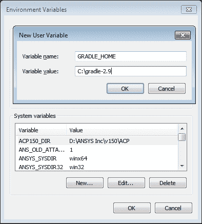

# 第一章：运行您的第一个 Gradle 任务

我们将开始一段快速学习**Gradle 基础知识**的旅程。为了温和地开始，我们首先将安装 Gradle。然后，我们将通过查看`gradle`命令的用法来熟悉 Gradle 的命令行界面。此外，到本章结束时，我们将运行我们的第一个 Gradle 构建脚本。

构建软件工件是一个复杂的过程，涉及各种活动，如编译源代码、运行自动化测试、打包可分发文件等。这些活动进一步分解成许多步骤，通常依赖于执行顺序、获取依赖工件、解析配置变量等。手动执行所有这些活动既繁琐又容易出错。一个好的构建自动化工具可以帮助我们以可重复的方式减少构建正确工件所需的时间和精力。

Gradle 是一个高级构建自动化工具，它从各种经过验证的构建工具中汲取精华，并在其基础上进行创新。Gradle 可以用于生成诸如 Web 应用程序、应用程序库、文档、静态站点、移动应用、命令行和桌面应用程序等工件。Gradle 可以用于基于各种语言和技术堆栈的项目构建，例如 Java、C/C++、Android、Scala、Groovy、Play、Grails 等。由于**Java 虚拟机**（**JVM**）恰好是 Gradle 支持的第一类平台之一，本书中的示例将主要关注构建基于 Java 的项目。

Gradle 像 Ant 一样让我们对构建有完全的控制权，但通过提供智能默认值（以约定形式）来避免重复。Gradle 真正通过约定而非配置来工作，就像 Maven 一样。然而，当我们需要偏离时，它永远不会妨碍我们。这也与 Maven 形成了鲜明的对比。Gradle 试图在约定和可配置性之间保持适当的平衡。

前一代构建工具，如 Ant 和 Maven，选择 XML 来表示构建逻辑。虽然 XML 是可读的，但它更多的是一种机器友好的格式（更容易被程序读取/写入）。它非常适合表示和交换层次化数据，但当涉及到编写任何逻辑时，即使是简单的逻辑也可能会轻易地占用数百行。另一方面，Gradle 构建可以通过非常人性化的 Groovy DSL 进行配置。Groovy 是一种强大、表达性强且低仪式的动态语言，非常适合构建脚本。

Gradle 本身是一个用 Java 和 Groovy 编写的**JVM**应用程序。由于 Gradle 在 JVM 上运行，因此它在 Windows、Mac OS X 和 Linux 上运行方式相同。Gradle 还拥有先进的依赖关系解析系统，可以从现有的 Maven 和 Ivy 仓库或甚至文件系统中解析依赖关系。

经过多年的发展，Gradle 已经成长为一个非常稳定的开源项目，拥有活跃的贡献者和商业支持。丰富的插件生态系统和充满活力的社区使 Gradle 成为各种项目的绝佳选择。Gradle 已经拥有一个令人印象深刻的采用者名单，其中包括像 Google Android、LinkedIn、Unity 3D、Netflix 等科技巨头。开源库和框架，如 Spring、Hibernate 和 Grails，正在使用 Gradle 来驱动它们的构建过程。

# 安装 Gradle

在我们运行 Gradle 之前，我们必须在我们的机器上安装它。Gradle 可以通过多种方式安装和更新。我们将首先了解一种更手动的方法来安装 Gradle，然后简要地看看通过一些常用的包管理器安装 Gradle 的方法。我们可以选择任何一种适合的方法。无论我们以何种方式安装 Gradle，我们都必须满足以下先决条件。

Gradle 需要**Java 运行时环境**（**JRE**）6 或**Java 开发工具包**（**JDK**）1.6 或更高版本。没有其他依赖项。我们建议安装 JDK。要验证这一点，我们可以在命令行中使用以下命令检查 Java 版本：

```java
$ java -version 
java version "1.8.0"
Java(TM) SE Runtime Environment (build 1.8.0-b132)
Java HotSpot(TM) 64-Bit Server VM (build 25.0-b70, mixed mode)

```

如果我们没有看到与前面命令中显示的输出大致相同的内容，那么我们的 JDK 安装存在问题。

### 注意

可以从以下 URL 下载最新的 JDK：

[`www.oracle.com/technetwork/java/javase/downloads/index.html`](http://www.oracle.com/technetwork/java/javase/downloads/index.html)

## 手动安装

如果我们想要对安装有更精细的控制，那么这是一个合适的方法。这可能是在我们无法使用包管理器、需要下载和安装非常具体的二进制文件，或者在公司防火墙后面（自动下载包管理器不被允许）的情况下。我们需要下载 Gradle 的二进制文件，并在命令行上使它们可用于使用。

可以从[`www.gradle.org/downloads`](http://www.gradle.org/downloads)下载最新的 Gradle 发行版。截至编写时，最新版本是 2.9。

Gradle 二进制发行版有两种形式，如下所示：

+   `gradle-2.9-all.zip`：此文件包含二进制文件、源代码和文档

+   `gradle-2.9-bin.zip`：此文件仅包含二进制文件

我们可以根据需要下载上述任何一种。此外，这是一个与操作系统无关的 zip 文件，因此相同的 zip 文件可以在 Mac OS X、Windows 和 Linux 上提取。下一节将 Gradle 命令添加到命令行。本节取决于我们使用的操作系统。

### 在 Mac OS X 和 Linux 上安装

假设我们将下载的 zip 文件提取为`~/gradle-2.9/`。现在，我们只需根据操作系统和使用的 shell，在`.bashrc`/、`.bash_profile`/或`.zshrc`的末尾添加以下两行：

```java
export GRADLE_HOME=~/gradle-2.9
export PATH=$PATH:$GRADLE_HOME/bin
```

重新启动终端或源修改后的文件以使更改生效。

### 在 Windows 上安装

假设我们将 zip 文件解压为 `C:\gradle-2.9`，然后执行以下步骤：

1.  打开开始菜单，右键单击 **计算机** 并选择 **属性**。

1.  在 **高级系统设置** 中，选择 **高级** 选项卡，然后选择 **环境变量...**。![在 Windows 上安装]

1.  点击 **新建**。

1.  创建一个值为 `C:\gradle-2.9` 的 `GRADLE_HOME` 环境变量。

    ### 小贴士

    **下载示例代码**

    您可以从您在 [`www.packtpub.com`](http://www.packtpub.com) 的账户中下载示例代码文件，以获取您购买的所有 Packt 出版物的书籍。如果您在其他地方购买了此书，您可以访问 [`www.packtpub.com/support`](http://www.packtpub.com/support) 并注册以将文件直接通过电子邮件发送给您。

    

    ### 小贴士

    在未来，当我们下载 Gradle 的后续版本时，我们需要更改此值以指向正确的文件夹。

1.  编辑（或添加，如果尚未存在）`PATH` 环境变量。在其值的末尾，追加 `;%GRADLE_HOME%\bin`（如果存在多个路径条目，请添加分号）。

## 安装 Gradle 的替代方法

虽然手动安装可以完全控制安装过程，但下载和提取正确版本、升级到最新版本、卸载和编辑环境变量等任务很快就会变得繁琐且容易出错。这就是为什么许多人更喜欢使用包管理器来控制整个过程。

### 通过操作系统特定的包管理器安装

在手动安装时，如前文所述，非常简单，我们可以通过使用包管理器使其变得超级简单。

一些 Linux 发行版，如 Ubuntu，随其包管理器提供，而 Mac OS X 和 Windows 默认没有安装任何包管理器。然而，幸运的是，这两个平台都有多个包管理器可用。我们将看到 Mac 上的 Homebrew 和 Windows 上的 Chocolatey 的示例。

#### Mac OS X

确保已安装 Homebrew。如果是的话，安装 Gradle 只需使用以下命令：

```java
$ brew install gradle

```

### 注意

更多关于 Homebrew 的详细信息可以在 [`brew.sh`](http://brew.sh) 找到。

#### Linux (Ubuntu)

在 Ubuntu 上使用内置的包管理器，称为 **高级包装工具**（**APT**），我们可以使用以下命令安装 Gradle：

```java
$ sudo apt-get install gradle

```

#### Windows

如果我们已安装 Chocolatey，安装 Gradle 只需一个命令：

```java
c:\> cinst gradle

```

### 注意

更多关于 Chocolatey 的详细信息可以在 [`chocolatey.org`](https://chocolatey.org) 找到。

### 通过 SDKMAN 安装

**SDKMAN** 代表 **软件开发工具包管理器**。正如其自身所说，网站将其描述为：*SDKMAN! 是一种用于管理大多数基于 Unix 的系统上多个软件开发工具包并行版本的工具。*

SDKMAN 相对于其他包管理器的优势在于，我们可以在系统上安装多个 Gradle 版本，并为给定的项目选择不同的版本。如果我们已经安装了它，我们只需要运行以下命令：

```java
$ sdk install gradle

```

SDKMAN 可以从[`sdkman.io/`](http://sdkman.io/)安装。

## 验证安装

无论我们选择哪种方式安装 Gradle，在继续之前验证它是否正常工作都是一个好主意。我们可以通过简单地检查命令行上的 Gradle 版本来完成这个任务：

```java
$ gradle --version
------------------------------------------------------------
Gradle 2.9
------------------------------------------------------------

Build time:   2015-11-17 07:02:17 UTC
Build number: none
Revision:     b463d7980c40d44c4657dc80025275b84a29e31f

Groovy:       2.4.4
Ant:          Apache Ant(TM) version 1.9.3 compiled on December 23 2013
JVM:          1.8.0_25 (Oracle Corporation 25.25-b02)
OS:           Mac OS X 10.10.5 x86_64

```

如果我们看到类似上面的输出，那么我们已经正确地在我们的机器上安装了 Gradle。

### 小贴士

我们可以使用`-v`代替`--version`来得到相同的结果。

## 设置 JVM 选项

虽然大多数情况下并不需要，但如果我们需要为 Gradle 将要使用的 JVM 设置一些全局选项，Gradle 提供了一个方便的方式来完成这个任务。我们可以通过设置`GRADLE_OPTS`环境变量并使用可接受的标志来调整 JVM。

Gradle 也尊重`JAVA_OPTS`环境变量。然而，在设置它时我们需要小心，因为它会影响机器上所有 Java 程序设置。我们应该通过这个变量设置我们希望对所有 Java 应用程序保持通用的设置，而那些只需要应用到 Gradle 的设置应该通过`GRADLE_OPTS`设置。

### 小贴士

一些常用的选项是`-Xms`和`-Xmx`，它们设置 JVM 的最小和最大堆大小。

# Gradle 命令行界面

与其他构建工具一样，Gradle 主要是通过命令行运行的。这就是为什么花些时间熟悉其命令行界面是值得的。通常，一个`gradle`命令是从项目目录的根目录发出的，并执行一些任务。假设我们目前在`hello-gradle`目录中，该目录目前为空。

Gradle 提供了一个非常简单的**命令行界面**（**CLI**），其形式如下：

```java
gradle [options…] [tasks…]

```

如我们所见，除了`gradle`命令本身之外，其他一切都是可选的。`options`调整 Gradle 的执行，而`tasks`（我们将在后面详细讨论）是工作的基本单元。选项对所有项目都是通用的，并且特定于 Gradle，但任务可能因运行`gradle`命令的项目而异。

有些任务在所有项目中都是可用的。其中之一就是`help`任务：

```java
$ gradle help
:help

Welcome to Gradle 2.9.

To run a build, run gradle <task> ...

To see a list of available tasks, run gradle tasks

To see a list of command-line options, run gradle --help

To see more detail about a task, run gradle help --task <task>

BUILD SUCCESSFUL

Total time: 0.639 secs

```

Gradle 通过告诉我们如何查找所有可用的任务和列出所有命令行选项来帮助我们。让我们首先检查一下我们项目当前可用的其他任务。记住我们仍然在空的目录`hello-gradle`中：

```java
$ gradle tasks
:tasks

------------------------------------------------------------
All tasks runnable from root project
------------------------------------------------------------

Build Setup tasks
-----------------
init - Initializes a new Gradle build. [incubating]
wrapper - Generates Gradle wrapper files. [incubating]

Help tasks
----------
components - Displays the components produced by root project 'hello-gradle'. [incubating]
dependencies - Displays all dependencies declared in root project 'hello-gradle'.
dependencyInsight - Displays the insight into a specific dependency in root project 'hello-gradle'.
help - Displays a help message.
model - Displays the configuration model of root project 'hello-gradle'. [incubating]
projects - Displays the sub-projects of root project 'hello-gradle'.
properties - Displays the properties of root project 'hello-gradle'.
tasks - Displays the tasks runnable from root project 'hello-gradle'.

To see all tasks and more detail, run gradle tasks --all

To see more detail about a task, run gradle help --task <task>

BUILD SUCCESSFUL

Total time: 0.652 secs

```

这显示了一些即使我们没有在我们的项目中添加任何任务也能使用的通用任务。我们可以尝试运行所有这些任务并查看输出。我们将在接下来的章节中详细了解这些任务。

另一个有用的命令`gradle help`建议我们使用`--help`选项来检查所有可用的选项。

### 小贴士

`help`任务与`--help`选项并不相同。

当我们运行 `gradle --help` 命令时，我们得到以下输出：

```java
$ gradle --help

USAGE: gradle [option...] [task...]

-?, -h, --help          Shows this help message.
-a, --no-rebuild        Do not rebuild project dependencies.
-b, --build-file        Specifies the build file.
…..

```

（输出被截断以节省空间。）

选项有一个长形式，如 `--help`，可能还有一个短形式，如 `-h`。我们之前已经使用了一个选项，即 `--version` 或 `-v`，它会打印有关 Gradle 版本的信息。以下是一些常用选项；还有更多选项，可以使用 `gradle --help` 命令查看：

| 选项 | 描述 |
| --- | --- |
| `-b`, `--build-file` | 这指定了一个构建文件（默认：`build.gradle`） |
| `--continue` | 即使任务失败，也会继续任务执行 |
| `-D`, `--system-prop` | 这会设置 JVM 的系统属性 |
| `-d`, `--debug` | 这会打印调试级别的日志 |
| `--gui` | 这将启动 Gradle 图形用户界面 |
| `-i`, `--info` | 这会打印信息级别的日志 |
| `-P`, `--project-prop` | 这会给项目添加一个属性 |
| `-q`, `--quiet` | 这只记录错误 |
| `-s`, `--stacktrace` | 这会打印异常的堆栈跟踪 |
| `-x`, `--exclude-task` | 这会排除一个特定的任务 |

# 第一个 Gradle 构建脚本

因此，我们现在已经准备好湿脚并看到我们的第一个 Gradle 脚本的实际应用。让我们在 `hello-gradle` 目录中创建一个名为 `build.gradle` 的文件。除非使用 `--build-file` 选项提供了构建文件路径，否则 Gradle 将当前目录视为项目根目录，并尝试在那里找到 `build.gradle` 文件。如果我们之前使用过 Ant 或 Maven，我们可以将此文件与 `build.xml` 或 `pom.xml` 相关联。

现在，打开 `build.gradle` 文件，让我们通过添加以下行来声明一个任务：

```java
task helloWorld
```

我们应该在命令行上看到以下任务：

```java
$ gradle tasks
...
Other tasks
-----------
helloWorld
...

```

在这里，我们已经成功创建了一个名为 `helloWorld` 的任务对象。任务在 Gradle 中是一等对象，这意味着它们具有属性和方法。这为我们提供了在构建的可定制性和可编程性方面的巨大灵活性。

然而，这个任务实际上还没有做任何事情。所以让我们给这个任务添加一些有意义的操作：

```java
task helloWorld << {
  println "Hello, World!"
}
```

现在从命令行，我们可以通过以下命令执行此任务：

```java
$ gradle -q helloWorld
Hello, World!

```

注意，我们使用了 `–q` 标志来减少输出中的冗余。当运行此任务时，我们看到我们的任务生成的输出，但没有来自 Gradle 的任何内容，除非是错误。

现在，让我们简要地了解 `build.gradle` 文件。第一行声明了任务并开始了一个代码块的主体，该代码块将在最后执行。左移运算符 (`<<`) 可能感觉放置得有些奇怪，但在这种情况下非常重要。我们将在后面的章节中看到它确切的意义。第二行是一个 Groovy 语句，它会将给定的字符串打印到控制台。此外，第三行结束了代码块。

### 小贴士

Groovy 的 `println "Hello, World!"` 等同于 Java 中的 `System.out.println("Hello, World!")`。

## 任务名称缩写

当从命令行调用 gradle 任务时，我们可以通过只输入足以唯一识别任务名称的字符来节省几个按键。例如，可以使用`gradle hW`调用`helloWorld`任务。我们也可以使用`helloW`、`hWorld`，甚至`heWo`。然而，如果我们只调用`gradle h`，那么将会调用`help`任务。

当我们需要频繁调用长的 Gradle 任务名称时，这非常有用。例如，名为`deployToProductionServer`的任务可以通过调用`gradle dTPS`来调用，前提是这个缩写不匹配任何其他任务名称。

## Gradle 守护进程

当我们谈论频繁调用 Gradle 时，了解一个推荐的技术来提高构建性能是个好时机。Gradle 守护进程，一个在后台持续运行的进程，可以显著加快构建速度。

对于给定的 gradle 命令调用，我们可以指定`--daemon`标志来启用守护进程。然而，我们应该记住，当我们启动守护进程时，只有后续的构建会更快，但当前的构建不会。例如：

```java
$ gradle helloWorld --daemon
Starting a new Gradle Daemon for this build (subsequent builds will be faster).
:helloWorld
Hello, World!

BUILD SUCCESSFUL

Total time: 2.899 secs

$ gradle helloWorld
:helloWorld
Hello, World!

BUILD SUCCESSFUL

Total time: 0.6 secs

```

在前面的例子中，如果我们注意到两次运行所需的时间，第二次完成得更快，这要归功于 Gradle 守护进程。

我们也可以通过传递`--no-daemon`标志来防止特定的构建调用使用守护进程。

有多种方法可以启用或禁用 Gradle 守护进程，这些方法在[`docs.gradle.org/current/userguide/gradle_daemon.html`](https://docs.gradle.org/current/userguide/gradle_daemon.html)中有文档说明。

## Gradle Wrapper

Gradle Wrapper 由 Linux/Mac OS X 的`gradlew`外壳脚本、Windows 的`gradlew.bat`批处理脚本和一些辅助文件组成。这些文件可以通过运行 gradle `wrapper`任务生成，并且应该与项目源代码一起提交到版本控制系统（VCS）。我们不必使用系统范围内的`gradle`命令，而是可以通过包装脚本运行构建。

通过包装脚本运行构建的一些优点如下：

1.  我们不需要手动下载和安装 Gradle。包装脚本会处理这一点。

1.  它使用项目所需的具体版本的 Gradle。这减少了由于不兼容的 Gradle 版本而破坏项目构建的风险。我们可以安全地升级（或降级）系统范围内的 Gradle 安装，而不会影响我们的项目。

1.  它在团队中所有开发者的机器上透明地强制执行相同版本的 Gradle。

1.  在持续集成构建环境中，这非常有用，因为我们不需要在服务器上安装/更新 Gradle。

### 生成包装文件

Gradle 的`wrapper`任务已经对所有 Gradle 项目可用。要生成包装脚本和辅助文件，只需从命令行执行以下代码：

```java
$ gradle wrapper 

```

在生成`wrapper`时，我们可以指定确切的 Gradle 版本如下：

```java
$ gradle wrapper --gradle-version 2.9

```

在这个例子中，我们指定要使用的 Gradle 版本是 2.9。运行此命令后，我们应该将生成的文件提交到版本控制系统中。我们可以自定义`wrapper`任务来使用配置的 Gradle 版本，生成不同名称的包装脚本，更改它们的位置等等。

### 通过包装器运行构建

为了利用包装脚本的好处，而不是使用`gradle`命令，我们需要根据我们的操作系统调用基于我们的操作系统的包装脚本。

在 Mac OS X/Linux 上：

```java
$ ./gradlew taskName

```

在 Windows 上：

```java
$ gradlew taskName

```

我们可以使用与传递给`gradle`命令完全相同的方式使用参数和标志。

# 摘要

在本章中，我们首先对 Gradle 进行了简要介绍。然后，我们探讨了手动安装以及通过软件包管理器安装的方法。我们还学习了 Gradle 的命令行界面。最后，我们编写了我们的第一个 Gradle 构建脚本。

如果你已经跟随着本章内容学习到了这里，你现在就可以在你的机器上检查任何基于 Gradle 的项目并执行构建了。此外，你已经具备了编写一个非常基础的 Gradle 构建脚本的知识。接下来，我们将探讨如何使用 Gradle 构建基于 Java 的项目。
