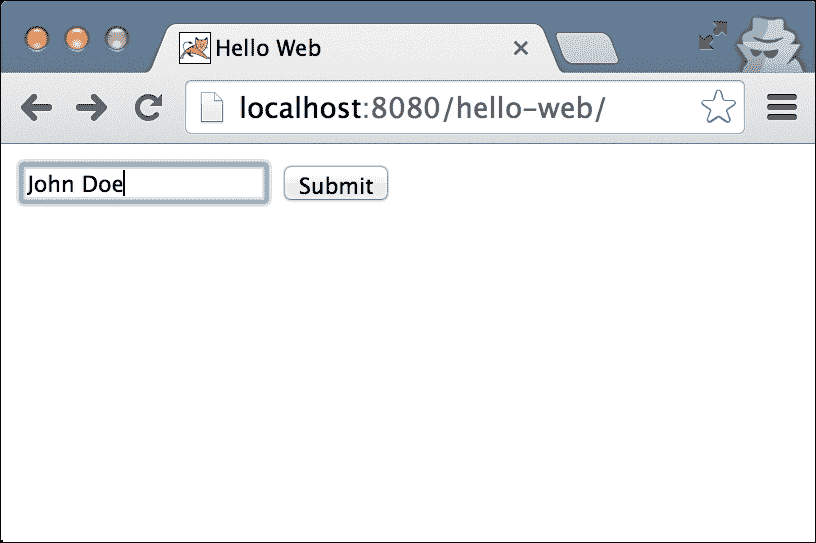
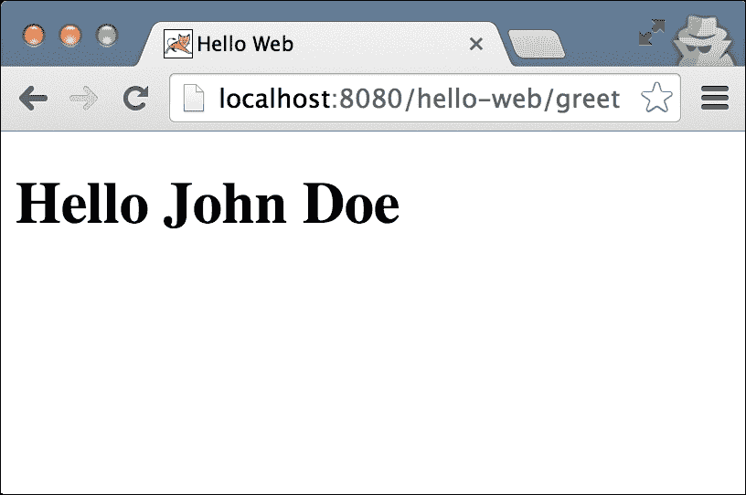

# 第三章。构建 Web 应用程序

现在我们已经看到了使用 Gradle 构建命令行 Java 应用程序的便捷性，我们不应该对基于 Java servlet 规范构建 web 应用程序也同样容易感到惊讶。

在本章中，我们将首先构建一个简单的 web 应用程序，它以 `WAR` 文件的形式分发，可以部署到任何 servlet 容器。然后，我们将看看如何在构建文件中配置依赖项和仓库。

# 构建简单的 Java web 项目

再次强调，我们将使我们的应用程序尽可能简单，并创建一个基于上一章开发的 web 版本的应用程序。该应用程序将提供一个用户输入姓名的表单和一个 **提交** 按钮。当用户点击 **提交** 按钮时，将显示问候语。

该应用程序将基于 Servlet 3.1 规范。我们将重用上一章中开发的 `GreetService`。表单将由静态 HTML 文件提供服务，该文件可以将数据发送到我们的 servlet。servlet 将创建一个问候消息并将其转发到 JSP 进行渲染。

### 注意

更多关于 Servlet 规范 3.1 的详细信息，请访问 [`jcp.org/aboutJava/communityprocess/final/jsr340/index.html`](https://jcp.org/aboutJava/communityprocess/final/jsr340/index.html)。

## 创建源文件

让我们以 `hello-web` 作为项目的根目录。其结构类似于我们之前看到的简单 Java 应用程序的结构，增加了一个新的部分，即 web 应用程序根目录。默认情况下，web 应用程序根目录位于 `src/main/webapp`。熟悉 Maven 的人会立刻注意到，这个路径与 Maven 使用的路径相同。

Web 应用程序根目录（`webapp`）包含运行 web 应用程序所需的所有公共资源，包括动态页面，如 JSP 或其他视图模板引擎（如 Thymeleaf、FreeMarker、Velocity 等）所需的文件；以及静态资源，如 HTML、CSS、JavaScript 和图像文件；以及特殊目录 `WEB-INF` 中的其他配置文件，如 `web.xml`。存储在 `WEB-INF` 中的文件不能直接被客户端访问；因此，这是一个存储受保护文件的完美位置。

我们将开始创建最终应用程序应具有的目录结构：

```java
hello-web
├── build.gradle
└── src
 └── main
 ├── java// source root
 │ └── com
 │     └── packtpub
 │         └── ge
 │             └── hello
 │                 ├── GreetingService.java
 │                 └── GreetingServlet.java
 └── webapp// web-app root
 ├── WEB-INF
 │ └── greet.jsp
 └── index.html

```

然后，执行以下步骤：

1.  让我们先添加上一章中熟悉的 `GreetingService` 到我们的源代码中。我们可能会注意到，复制 Java 源文件并不是重用的正确方式。有更好的方法来组织这样的依赖。其中一种方法就是使用多模块项目。我们将在 第五章 中看到这一点，*多项目构建*。

1.  现在，将以下内容添加到 `index.html` 文件中：

    ```java
    <!doctype html>
    <html>
      <head>
        <title>Hello Web</title>
      </head>
      <body>
        <form action="greet" method="post">
          <input type="text" name="name"/>
          <input type="submit"/>
        </form>
      </body>
    </html>
    ```

    此文件以 HTML 5 的`doctype`声明开始，这是我们能够使用的最简单的`doctype`。然后，我们创建一个表单，它将向`greet`端点（它是页面的一个相对路径）发送 POST 请求。

1.  现在，在这个应用程序的核心部分，有一个名为`GreetServlet`的 servlet，它响应 POST 请求：

    ```java
    package com.packtpub.ge.hello;

    import javax.servlet.*;
    import javax.servlet.annotation.WebServlet;
    import javax.servlet.http.*;
    import java.io.IOException;

    @WebServlet("/greet")
    public class GreetingServlet extends HttpServlet {

      GreetingService service = new GreetingService();

      @Override
      public void doPost(HttpServletRequest request,
                         HttpServletResponse response)
        throws ServletException, IOException {

        String name = request.getParameter("name");
        String message = service.greet(name);
        request.setAttribute("message", message);

        RequestDispatcher dispatcher = getServletContext()
          .getRequestDispatcher("/WEB-INF/greet.jsp");

        dispatcher.forward(request, response);
      }

    }
    ```

    在前面的代码中，`WebServlet`注解的值将这个 servlet 映射到应用程序上下文中的`/greet`路径。然后，在这个 servlet 中创建了一个`GreetService`实例。重写的方法`doPost`从`request`对象中提取名称，生成问候信息，将此消息作为属性设置回`request`，以便在 JSP 中访问，然后最终将请求转发到位于`/WEB-INF/greet.jsp`的`greet.jsp`文件。

1.  这将带我们到`greet.jsp`文件，它被保存在`WEB-INF`中，这样它就不能直接访问，并且请求必须始终通过设置正确请求属性的 servlet 来传递：

    ```java
    <!doctype html>
    <html>
      <head>
        <title>Hello Web</title>
      </head>
      <body>
        <h1>${requestScope.message}</h1>
      </body>
    </html>
    ```

    这个 JSP 只是打印出在请求属性中可用的`message`。

## 创建构建文件

最后，让我们在项目的根目录中创建我们一直在等待的文件——`build.gradle`文件：

```java
apply plugin: 'war'

repositories {
    mavenCentral()
}

dependencies {
    providedCompile 'javax.servlet:javax.servlet-api:3.1.0'
}
```

让我们现在尝试理解这个文件：

+   第一行将`war`插件应用于项目。此插件向项目添加一个`war`任务。有人可能会想知道为什么我们不需要应用`java`插件来编译类。这是因为`war`插件扩展了`java`插件；因此，当我们应用`java`插件时所有可用的任务仍然可用，除了`war`任务。

+   接下来是`repositories`部分，它配置我们的构建过程以在 Maven 中央仓库中查找所有依赖项。

最后，在`dependencies`块中，我们将`servlet-api`添加到`providedCompile`配置（范围）。这告诉 Gradle 不要将 servlet API 打包到应用程序中，因为它将在应用程序部署的容器中已经可用。`providedCompile`配置是由`war`插件添加的（它还添加了`providedRuntime`）。如果我们有任何其他需要与我们的应用程序一起打包的依赖项，它将使用编译配置声明。例如，如果我们的应用程序依赖于 Spring 框架，那么依赖项部分可能看起来如下：

```java
dependencies {
    compile 'org.springframework:spring-context:4.0.6.RELEASE'
    providedCompile 'javax.servlet:javax.servlet-api:3.1.0'
}
```

如果觉得`repositories`、`configurations`和`dependencies`的细节有点模糊，请不要担心。我们很快将在本章的后面部分更详细地看到它们。

## 构建工件

现在我们已经准备好了构建文件，我们必须构建可部署的 WAR 文件。让我们使用以下命令来验证我们的构建任务：

```java
$ gradle tasks --all
…
war - Generates a war archive with all the compiled classes, the web-app content and the libraries. [classes]
…

```

我们会注意到那里的`war`任务，它依赖于`classes`（任务）。我们不需要显式地编译和构建 Java 源代码，这由`classes`任务自动处理。所以我们现在需要做的就是，使用以下命令：

```java
$ gradle war

```

一旦构建完成，我们将看到目录结构类似于以下结构：

```java
hello-web
├── build
│ ├── classes
│ │ └── main
│ │     └── com
│ │         └── packtpub
│ │             └── ge
│ │                 └── hello
│ │                     ├── GreetService.class
│ │                     └── GreetServlet.class
│ ├── dependency-cache
│ ├── libs
│ │ └── hello-web.war
│ └── tmp
│     └── war
│         └── MANIFEST.MF
…

```

WAR 文件创建在`/build/libs/hello-web.war`。

### 注意

`war`文件不过是一个具有不同文件扩展名的 ZIP 文件。对于`.ear`或`.jar`文件也是如此。我们可以使用标准的 zip/unzip 工具，或者使用 JDK 的`jar`实用程序对这些文件执行各种操作。要列出 WAR 的内容，使用`jar -tf build/libs/hello-web.war`。

让我们检查这个 WAR 文件的内容：

…

```java
├── META-INF
│ └── MANIFEST.MF
├── WEB-INF
│ ├── classes
│ │ └── com
│ │     └── packtpub
│ │         └── ge
│ │             └── hello
│ │                 ├── GreetService.class
│ │                 └── GreetServlet.class
│ └── greet.jsp
└── index.html

```

完美。编译后的类已经落在`WEB-INF/classes`目录中。servlet API 的 JAR 文件没有包含在内，因为它在`providedCompile`范围内。

### 提示

**练习**

在`dependencies`部分添加`compile 'org.springframework:spring-context:4.0.6.RELEASE'`，然后执行`gradle war`文件，查看创建的 WAR 文件的内容。

## 运行 web 应用

我们在创建 web-app 方面已经走了很长的路。然而，为了使用它，它必须部署到一个 servlet 容器中。可以通过复制 servlet 容器指定目录（例如 Tomcat 中的`webapps`）中的`.war`文件来经典地部署到 servlet 容器中。或者，可以使用一种更近期的技术将 Servlet 容器嵌入到 Java 应用中，该应用被打包为`.jar`文件，并以任何其他`java –jar`命令运行。

Web 应用通常以三种模式运行，开发、功能测试和生产。所有三种模式的关键特性如下有所不同：

+   在开发模式下运行 web 的关键特性包括更快的部署（最好是热重载）、快速的服务器启动和关闭、非常低的服务器占用空间等。

+   在功能测试期间，我们通常在整个测试套件的运行中只部署一次`web-app`。我们需要尽可能地模拟应用的生产类似行为。我们需要设置和销毁 web-app 的状态（如数据库），对于所有测试使用轻量级数据库（最好是内存中的）。我们还需要模拟外部服务。

+   相比之下，在生产部署中，应用服务器（无论是独立还是嵌入）的配置、安全性、应用优化、缓存等，具有更高的优先级；像热部署这样的特性很少使用；更快的启动时间具有较低的优先级。

我们将在本章中仅涵盖开发场景。我们将从传统的做法开始，以突出其问题，然后转向 Gradle 的方式。

现在，如果我们需要手动部署 war 文件。我们可以选择任何 Java Servlet 容器，例如 Jetty 或 Tomcat 来运行我们的 Web 应用。在这个例子中，让我们使用 Tomcat。假设 Tomcat 安装在 `~/tomcat` 或 `C:\tomcat`（根据我们使用的操作系统）：

1.  如果服务器正在运行，理想情况下我们应该停止它。

1.  将 WAR 文件复制到 Tomcat 的 `webapp` (`~/tomcat/webapps`) 目录。

1.  然后，使用 `~/tomcat/bin/startup.sh` 或 `C:\tomcat\bin\startup.bat` 启动 Tomcat 服务器。

然而，在 Gradle 的时代，这种部署方式感觉已经过时了。特别是，在开发 Web 应用时，我们必须不断将应用程序打包成 `war` 文件，将最新版本复制到容器中，并重新启动容器以运行最新代码。当我们说构建自动化时，这隐含着不需要手动干预，一切应该一键（或在 Gradle 的情况下，一键命令）完成。幸运的是，有许多选项可以实现这种程度的自动化。

### 插件拯救

默认情况下，Gradle 不支持现代 Servlet 容器。然而，这正是 Gradle 架构的美丽之处。创新和/或实现不必来自少数几个创建 Gradle 的人。借助插件 API，任何人都可以创建功能丰富的插件。我们将使用一个名为 Gretty 的插件来为我们的 Web 应用开发时间部署，但你也应该检查其他插件，看看哪个最适合你。

### 注意

可用 `jetty` 插件，该插件随 Gradle 一起提供。然而，它并未得到积极更新；因此，它官方只支持 Jetty 6.x（截至本文撰写时）。所以，如果我们的 Web 应用基于 Servlet 2.5 规范或更低版本，我们可以使用它。

Gretty 插件可以在 Gradle 插件门户中找到（请参阅以下参考）。此插件为构建添加了众多任务，并支持 Tomcat 和 Jetty 的各种版本。安装它非常简单。此代码使用与上一节相同的 `hello-web` 源代码，但更新了 `build.gradle` 文件。此示例的完整源代码可以在书籍示例代码的 `chapter-03/hello-gretty` 目录中找到。

只需在 `build.gradle` 的第一行包含以下内容：

```java
plugins {
 id "org.akhikhl.gretty" version "1.2.4"
}

```

就这样——我们完成了。这是 Gradle 中应用插件的新语法，它是在 Gradle 2.1 中添加的。这对于应用第三方插件特别有用。与调用 `apply` 方法应用插件不同，我们从第一行的插件块开始。然后，我们指定插件的 ID。对于应用外部插件，我们必须使用完全限定的插件 ID 和版本。我们可以在该块内包含 `war` 插件的应用。对于内部插件，我们不需要指定版本。它看起来如下：

```java
plugins {
  id "org.akhikhl.gretty" version "1.2.4"
  id "war"
}
```

如果我们现在运行`gradle tasks`，必须在`Gretty`组下有一个`appRun`任务。这个组中还有许多由 Gretty 插件添加的任务。如果我们运行`appRun`任务，而没有明确配置插件，那么默认情况下将在`http://localhot:8080`上运行 Jetty 9。我们可以打开浏览器进行验证。

该插件暴露了许多配置，以便控制服务器版本、端口号等各个方面。在`build.gradle`文件中添加一个`gretty`块，如下所示：`

+   如果我们想在 8080 端口上使用 Tomcat 8，我们将添加以下代码行：

    ```java
    gretty {
      servletContainer = 'tomcat8'
      port = 8080
    }
    ```

+   如果我们想在 9080 端口上使用 Jetty 9，我们需要添加以下代码行：

    ```java
    gretty {
      servletContainer = 'jetty9'
      port = 9080
    }
    ```

Gretty 提供了许多更多的配置选项；我们建议您查看 Gretty 的在线文档。请参阅参考文献部分中 Gretty 的链接。

运行中的应用程序看起来如下：



一旦按下**提交**按钮，我们将得到以下结果：



# 参考文献

对于 Gradle，请参考以下 URL：

+   Gradle 插件门户：[`plugins.gradle.org/`](https://plugins.gradle.org/)

对于 Gretty，请参考以下 URL：

+   Gretty 插件：[`plugins.gradle.org/plugin/org.akhikhl.gretty`](https://plugins.gradle.org/plugin/org.akhikhl.gretty)

+   Gretty 文档：[`akhikhl.github.io/gretty-doc/`](http://akhikhl.github.io/gretty-doc/)

有许多插件可用于自动化部署。其中一些列在这里：

+   货物插件：[`github.com/bmuschko/gradle-cargo-plugin`](https://github.com/bmuschko/gradle-cargo-plugin)

+   Arquillian 插件：[`github.com/arquillian/arquillian-gradle-plugin`](https://github.com/arquillian/arquillian-gradle-plugin)

+   Tomcat 插件：[`github.com/bmuschko/gradle-tomcat-plugin`](https://github.com/bmuschko/gradle-tomcat-plugin)

# 项目依赖

在现实生活中，我们处理的应用程序比我们刚才看到的要复杂得多。这些应用程序依赖于其他专门的组件来提供某些功能。例如，企业 Java 应用程序的构建可能依赖于各种组件，如 Maven 中央的开源库、内部开发和托管的库，以及（可能）其他子项目。这些依赖项本身位于各种位置，如本地内网、本地文件系统等。它们需要被解析、下载，并引入构建的适当配置（如`compile`、`testCompile`等）。

Gradle 在定位和使依赖项在适当的`classpath`和打包（如果需要）中可用方面做得非常出色。让我们从最常见的依赖类型——外部库——开始。

## 外部库

几乎所有现实世界的项目都依赖于外部库来重用经过验证和测试的组件。这些依赖包括语言工具、数据库驱动程序、Web 框架、XML/JSON 序列化库、ORM、日志工具等等。

项目的依赖关系在构建文件中的`dependencies`部分声明。

Gradle 提供了声明工件坐标的极其简洁的语法。它通常采用`group:name:version`的形式。请注意，每个值都由冒号（`:`）分隔。

例如，Spring 框架的核心库可以使用以下代码引用：

```java
dependencies {
  compile 'org.springframework:spring-core:4.0.6.RELEASE'
}
```

### 注意

对于那些不喜欢简洁性的人来说，依赖项可以用更描述性的格式（称为映射格式）引用。

```java
compile group:'org.springframework', name:'spring-core', version:'4.0.6.RELEASE'
```

我们也可以如下指定多个依赖项：

```java
configurationName dep1, dep2, dep3…. 
```

其中`configurationName`代表配置，如`compile`、`testCompile`等，我们很快就会看到在这个上下文中配置是什么。

### 动态版本

我们的依赖版本会时不时地更新。此外，当我们处于开发阶段时，我们不想手动检查是否有新版本可用。

在这种情况下，我们可以添加一个`+`来表示上述版本，给定工件的数量。例如，`org.slf4j:slf4j-nop:1.7+`声明任何高于 1.7 的 SLF4J 版本。让我们将其包含在一个`build.gradle`文件中，并检查 Gradle 为我们带来了什么。

我们在我们的`build.gradle`文件中运行以下代码：

```java
runtime 'org.slf4j:slf4j-nop:1.7+'
```

然后，我们运行`dependencies`任务：

```java
$ gradle dependencies
…
+--- org.slf4j:slf4j-nop:1.7+ -> 1.7.7
|    \--- org.slf4j:slf4j-api:1.7.7
…

```

我们可以看到 Gradle 选择了 1.7.7 版本，因为这是本书撰写时可用的新版版本。如果你观察第二行，它告诉我们`slf4j-nop`依赖于`slf4j-api`；因此，它是我们项目的传递依赖。

这里有一个警告，始终只使用`+`进行小版本升级（如前例中的`1.7+`）。让主版本自动更新（例如，想象 Spring 自动从 3 更新到 4，`compile 'org.springframework:spring-core:+'`）不过是一场赌博。动态依赖解析是一个很好的功能，但应该谨慎使用。理想情况下，它应该只在项目的开发阶段使用，而不是用于发布候选版本。

当依赖项的版本更新到与我们的应用程序不兼容的版本时，我们会得到一个不稳定的构建。我们应该追求可重复的构建，这样的构建应该产生完全相同的工件，无论是今天还是一年后。

### 传递依赖

默认情况下，Gradle 非常智能地解析传递依赖，如果存在，优先选择最新的冲突版本。然而，由于某种原因，如果我们想禁用传递依赖，我们只需要在我们的依赖声明中提供一个额外的块：

```java
    runtime ('org.slf4j:slf4j-nop:1.7+') {
        transitive = false
    }
```

现在，如果我们检查`dependencies`任务的输出，我们会看到不再包含其他依赖项：

```java
\--- org.slf4j:slf4j-nop:1.7.2

```

我们也可以强制指定库的给定版本，即使有相同的工件，较新版本通过传递依赖项获取；我们强制指定的版本将获胜：

```java
    runtime ('org.slf4j:slf4j-nop:1.7.2') {
        force = true  
    }
```

现在运行依赖项任务将产生：

```java
+--- org.slf4j:slf4j-api:1.7.2
\--- org.slf4j:slf4j-nop:1.7.7
 \--- org.slf4j:slf4j-api:1.7.7 -> 1.7.2

```

这表明较旧的`slf4j-api`版本获胜，即使可以通过传递依赖项获取较新版本。

## 依赖项配置

Gradle 提供了一种非常优雅的方式来声明在项目构建的不同阶段构建不同源代码组所需的依赖项。

### 小贴士

这些源代码组被称为**源集**。源集最简单和最易于理解的例子是`main`和`test`。`main`源集包含将被编译和构建为 JAR 文件并部署到某处或发布到某个仓库的文件。另一方面，`test`源集包含将由 JUnit 等测试工具执行的文件，但不会进入生产环境。现在，这两个源集对依赖项、构建、打包和执行有不同的要求。我们将在第七章中看到如何添加新的源集，*使用 Gradle 进行测试和报告*，以进行集成测试。

由于我们在源集中定义了相关源代码的组，因此依赖项也被定义为名为**配置**的组。每个配置都有自己的名称，例如`编译`、`测试编译`等。包含在各种配置中的依赖项也有所不同。配置是根据依赖项的特性进行分组的。例如，以下是由`java`和`war`插件添加的配置：

+   `编译`：这是由`java`插件添加的。向此配置添加依赖意味着该依赖项是编译源代码所必需的。在`war`的情况下，这些依赖项也将被复制到`WEB-INF/lib`中。此类依赖项的例子包括 Spring 框架、Hibernate 等库。

+   `运行时`：这是由`java`插件添加的。默认情况下，这包括`编译`依赖项。此组中的依赖项在运行时对于编译的源代码是必需的，但它们不是编译它的必需品。例如，JDBC 驱动程序这样的依赖项仅是运行时依赖项。我们不需要它们在我们的类路径上编译源代码，因为我们针对的是 JDK 中可用的标准 JDBC API 接口进行编码。然而，为了我们的应用程序能够正常运行，我们需要在运行时特定的驱动程序实现。例如，`runtime 'mysql:mysql-connector-java:5.1.37'`包括 MySQL 驱动程序。

+   `testCompile`：这是由 `java` 插件添加的。默认情况下，这包括 `compile` 依赖项。添加到该配置的依赖项仅对测试源可用。例如，JUnit、TestNG 等测试库，或者仅由测试源使用的任何库，如 Mockito。它们既不需要编译，也不需要在主源集的运行时存在。在构建 `web-app` 的情况下，它们不会包含在 `war` 中。

+   `testRuntime`：这是由 `java` 插件添加的。默认情况下，这包括 `testCompile` 和 `runtime` 依赖项。此配置中的依赖项仅需要在运行时（即在运行测试时）测试源。因此，它们不包括在测试的编译类路径中。这就像运行时配置一样，但仅限于测试源。

+   `providedCompile`：这是由 `war` 插件添加的。例如，servlet API 这样的依赖项由应用程序服务器提供，因此不需要打包在我们的 `war` 中。任何我们期望已经包含在服务器运行时中的内容都可以添加到这个配置中。然而，它必须在源代码编译时存在。因此，我们可以将这些依赖项声明为 `providedCompile`。例如，servlet API 和任何在服务器运行时提供的 Java EE 实现。此类依赖项不会包含在 `war` 中。

+   `providedRuntime`：这是由 `war` 插件添加的。服务器和应用程序将在应用运行时提供的依赖项不需要在编译时包含，因为没有直接引用实现。此类库可以添加到该配置中。此类依赖项将不会包含在 `war` 中。因此，我们应该确保在应用运行时有实现可用。

如我们所知，当我们应用 `war` 插件时，`java` 插件也会被应用。这就是为什么当我们构建 Web 应用程序时，所有六个配置都可用。可以通过插件添加更多配置，或者我们可以在构建脚本中自行声明它们。

有趣的是，配置不仅包括依赖项，还包括由该配置生成的工件。

## 仓库

仓库部分配置了 Gradle 将在其中查找依赖项的仓库。Gradle 将依赖项下载到其自己的缓存中，这样就不需要在每次运行 Gradle 时都进行下载。我们可以按以下方式配置多个仓库：

```java
repositories {
  mavenCentral()  // shortcut to maven central
  mavenLocal()    // shortcut to maven local (typically ~/.m2)
  jcenter()       // shortcut to jcenter
  maven {
    url "http://repo.company.com/maven"
  }
  ivy {
    url "http://repo.company.com/ivy"
  }
  flatDir {       // jars kept on local file system
    dirs 'libDir'
  }
}
```

支持使用 Maven、Ivy 和平面目录（文件系统）等仓库进行依赖项解析和上传工件。对于常用的 Maven 仓库，如 `mavenCentral()`、`jcenter()` 和 `mavenLocal()`，还有一些更具体的便捷方法可用。然而，可以使用以下语法轻松配置更多 Maven 仓库：

```java
maven {
  url"http://intranet.example.com/repo"
}
```

在中央仓库之前，项目通常会在文件系统中管理库，这些库大多与源代码一起提交。有些项目仍然这样做；尽管我们不建议这样做，但人们有自己的理由这样做，而 Gradle 没有不支持的理由。

需要记住的是，Gradle 并不会自动假设任何仓库来搜索和下载依赖项。我们必须在 `repositories` 块中显式配置至少一个仓库，Gradle 将在其中搜索工件。

### **提示**

**练习**

使用以下方法将 Apache Commons Lang 库包含到消息中，以将其转换为标题大小写：

```java
WordUtils.capitalize(String str)
```

将字符串中所有空格分隔的单词转换为大写。

# **总结**

在本章中，我们首先使用 Gradle 开发了一个 Web 应用程序。我们通过构建应用程序生成了 WAR 工件，然后将其部署到本地 Tomcat。然后，我们学习了关于 Gradle 中的依赖管理、配置和支持的仓库的一些基础知识。

### **注意**

读者应该在 Gradle 的官方文档中花更多时间详细阅读这些概念，官方文档地址为 [`docs.gradle.org/current/userguide/userguide`](https://docs.gradle.org/current/userguide/userguide)。

目前，我们应该能够使用 Gradle 构建最常见类型的 Java 应用程序。在下一章中，我们将尝试理解 Gradle 提供的 Groovy DSL 以及基本的项目模型。
