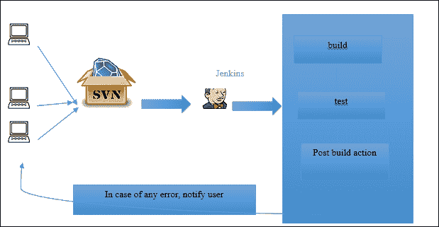
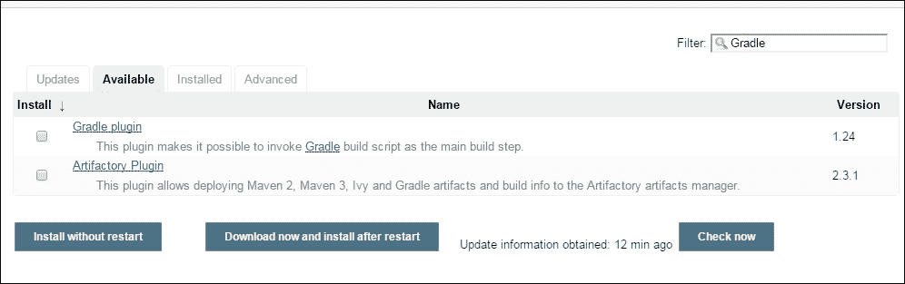
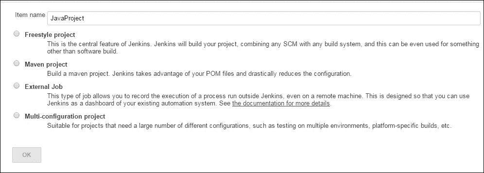
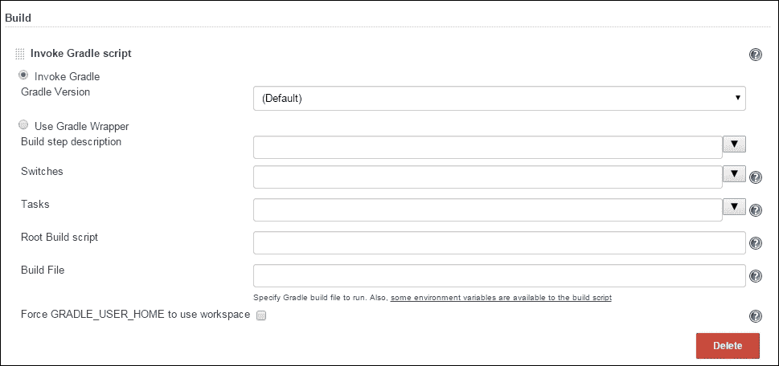
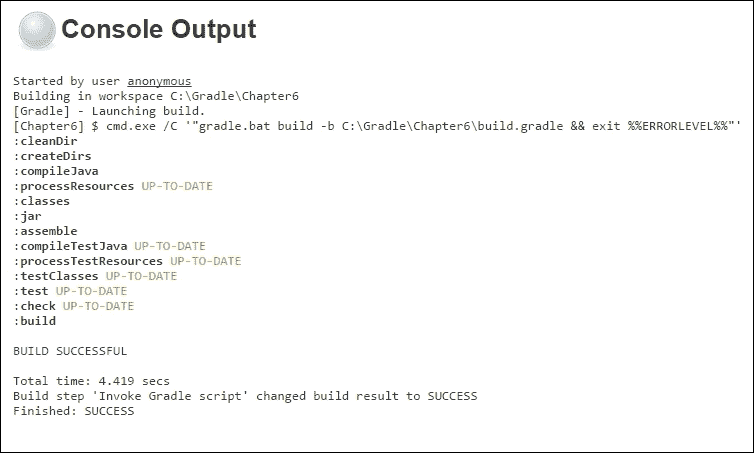

# 第六章：使用 Gradle 的实战项目

到目前为止，我们已经讨论了构建 Java 项目、Web 项目、Gradle 生命周期和 Gradle 的多模块功能。正如我们所知，在 Gradle 之前，市场上有很多其他的构建工具，其中最受欢迎的是 Ant 和 Maven。由于许多项目构建脚本已经用这两种构建工具编写。在本章中，我们将讨论不同的迁移策略，将现有项目的构建脚本从 Ant、Maven 迁移到 Gradle。同时，我们还将关注将 Gradle 构建脚本集成到持续集成工具（如 Jenkins）以及为代码生成 Java 文档。

# 从基于 Ant 的项目迁移

Ant 是最初且最受欢迎的构建工具之一，与其他基于脚本的原生构建工具相比，它使构建和部署过程变得更加简单。尽管如此，你仍然可以找到许多使用 Ant 构建脚本来构建项目的项目。Ant 是在命令式编程模型的哲学基础上开发的，它告诉系统做什么以及如何做。因此，你可以控制构建脚本中的每一个动作或步骤。以下是一个用于构建任何 Java 项目的示例 Ant 构建脚本。在这里，我们只考虑构建 Java 项目所需的最小任务，因为我们的目的是讨论从 Ant 脚本迁移到 Gradle 脚本的策略：

```java
<project name="Ant build project" default="createJar">
  <target name="clean" description="clean the existing dirs">
    <delete dir="build"/>
    <delete dir="dist"/>
  </target>

  <target name="compile" description="compile the source"
    depends="clean">
    <mkdir dir="build"/>
    <mkdir dir="dist"/>
    <mkdir dir="build/classes"/>
    <javac srcdir="src" destdir="build/classes"/>
  </target>
  <target name="createJar" depends="compile" description="create the
    jar">
    <jar jarfile="dist/JavaProject-1.0.jar" basedir="build/classes"/>
  </target>
</project>
```

在这里，我们定义了三个目标，例如`clean`、`compile`和`createJar`，分别用于删除目录、创建目录、编译源目录中存在的 Java 文件，并最终创建`.jar`文件。开发者可以遵循以下三种不同的策略来将构建脚本从 Ant 迁移到 Gradle：

+   导入 Ant 文件

+   使用 AntBuilder API

+   将 Ant 任务重写为 Gradle 任务

我们将用示例讨论每一个。

## 导入 Ant 文件

迁移的最简单和最直接的方法是将你的 Ant 脚本文件直接导入到 Gradle 脚本中。考虑以下结构：

```java
C:\GRADLE\CHAPTER6
│   build_import.gradle
│   build.xml
│
└───src
 └───main
 └───java
 └───ch6
 SampleJava.java

```

在这里，项目名称是`Chapter6`，Java 源目录是`src/main/java`，Ant 构建脚本文件是`build.xml`。上面提到了`build.xml`的源代码。现在，作为迁移的一部分，创建一个包含以下内容的`build_import.gradle`文件：

```java
ant.importBuild 'build.xml'
```

就这样。是的，我们已经成功将 Ant 构建脚本迁移到了 Gradle 脚本。现在，尝试执行以下命令：

```java
> gradle –b build_import.gradle createJar
:clean
:compile
:createJar
BUILD SUCCESSFUL
Total time: 3.045 secs

```

执行此操作后，你可以在项目目录中找到`build`/`classes`和`dist`目录，其中`dist`包含`JavaProject.jar`文件。

## 使用 AntBuilder API

迁移的另一种方法是使用 AntBuilder API。默认情况下，Gradle 为用户提供了一个 AntBuilder 对象`ant`。用户可以直接在 Gradle 脚本中使用此对象来调用 Ant 任务。以下是一个使用 AntBuilder API 的`build_antbuilder.gradle`文件的示例代码：

```java
task cleanDir << {
  ant.delete(dir:"build")
  ant.delete(dir:"dist")
}

task compileSrc(dependsOn:'cleanDir') << {
  ant.mkdir(dir:"build/classes")
  ant.mkdir(dir:"dist")
  ant.javac(srcdir:"src", destdir:"build/classes", includeantruntime:"false")
}
task createJar(dependsOn:'compileSrc') << {
  ant.jar(destfile: "dist/JavaProject-1.0.jar", basedir:"build/classes")
}
```

在这里，你可以看到我们使用了不同的 Ant 任务，如`mkdir`、`javac`、`jar`等，作为`ant`对象的方法。现在，执行以下命令：

```java
> gradle –b build_antbuilder.gradle createJar
:cleanDir
:compileSrc
:createJar
BUILD SUCCESSFUL
Total time: 3.437 secs

```

在这里，你也会发现相同的输出，即它会创建一个`build`/`classes`目录，其中你可以找到类文件，以及一个`dist`目录，其中你可以找到`.jar`文件。

## 将 Ant 任务重写为 Gradle 任务

这是最终的方案。使用这种方法而不是使用`ant`对象，你实际上是用实际的 Gradle 任务重写了完整的构建逻辑或功能。遵循这一策略的一个简单方法就是用户首先需要逻辑上理解用 Ant 编写的完整流程文件，然后逐步将其转换为 Gradle 脚本。对于 Ant 中定义的所有目标，用户可以在 Gradle 中创建任务，对于 Ant 中定义的所有任务，用户可以使用 Gradle 功能来复制相同的行为。Gradle 提供了不同的标准插件来支持构建需求的大部分步骤。插件有自己的生命周期，借助插件，用户可以避免为常见的构建功能重写大量的样板脚本。其中一个这样的插件是`java`插件。我们已经在第二章中看到了`java`插件的详细信息，即*构建 Java 项目*。如果我们想将这个 Ant 脚本迁移到 Gradle 脚本以构建一个 Java 项目，用户可以简单地使用一个`Java`插件，任务就完成了。

考虑以下内容的`build.gradle`文件：

```java
apply plugin:'java'
```

如果开发者遵循`java`插件的默认约定，他只需要写这一行就能构建一个 Java 项目，在执行`gradle build`命令后，所有必要的步骤都会完成，例如编译代码、执行单元测试用例，以及准备`.jar`文件。然而，这并不总是如此；许多遗留项目并不遵循约定，它们可能有自己的一套约定。`gradle`插件提供了根据项目需求配置插件的灵活性。以下示例代码将 Ant 脚本重写为 Gradle 脚本：

```java
apply plugin:'java'

task cleanDir << {
  delete "build"
  delete "dist"
}

task createDirs(dependsOn:'cleanDir') << {
  def classes = file("build/classes")
  def dist = file("dist")
  classes.mkdirs()
  dist.mkdirs()

}
compileJava {
  File classesDir = file("build/classes")
  FileTree srcDir = fileTree(dir: "src")
  source srcDir
  destinationDir classesDir
}
task createJar(type: Jar) {
  destinationDir = file("dist")
  baseName = "JavaProject-1.0"
  from "build/classes"
}
createJar.dependsOn compileJava
compileJava.dependsOn createDirs
```

```java
gradle createJar command, it will generate the same output which was generated by following above migration strategies.
```

# 从 Maven 项目迁移

Maven，另一个构建工具，在 Ant 之后获得了最多的普及，它还带来了依赖管理解决方案，以解决用户在 Ant 中遇到的问题。Ant 的第一个问题是命令式编程，用户必须编写大量的样板代码。另一个问题是依赖管理。Ant 没有内置的依赖管理解决方案（Ant 后来与 Ivy 集成以进行依赖管理）。用户必须在每个构建文件中写入它需要下载的每个 JAR 文件的路径，在传递依赖的情况下，对用户来说识别每个依赖的 JAR 文件并在构建文件中提及 JAR 名称非常复杂。此外，在版本冲突的情况下，这消耗了开发者大量的精力。Maven 带来了声明式编程模型和内置的依赖管理解决方案。Gradle 也是基于这些原则构建的；因此，从 Maven 迁移到 Gradle 对用户来说似乎非常舒适。

与 Ant 迁移类似，Gradle 不提供任何导入功能或内置的 Maven 对象。用户需要将 Maven 脚本重写为 Gradle 脚本。以下是一些有助于您顺利从 Maven 迁移到 Gradle 的概念：

+   插件声明

+   常见约定

+   依赖管理

+   仓库配置

让我们转向这些概念的解释：

+   **插件声明**：插件是 Maven 和 Gradle 功能的关键驱动。与 Maven 插件相同，Gradle 也将大部分功能打包成插件。在 Maven 中，用户可以通过以下 XML 格式包含插件：

    ```java
    <plugin>
      <artifactId>pluginName</artifactId>
      <version>2.3.2</version>
    </plugin>
    ```

    要包含一个插件，用户只需写下以下`apply plugin`语句：

    ```java
    apply plugin: '<plugin name>'
    ```

+   **常见约定**：在 Maven 和 Gradle 中，插件总是为其功能提供一些常见约定。例如，如果用户包含一个`java`插件，常见约定是源代码位置应该是`src/main/java`，测试代码位置应该是`src/test/java`，等等。如果用户包含插件并遵循相同的约定，那么他可以避免编写任何样板代码，这可以节省他的时间和精力。

+   **依赖管理**：Maven 和 Gradle 都自带内置的依赖管理功能。用户无需担心项目中每个单独的 JAR 文件。他只需在项目中提及一级依赖，其余的都由构建工具处理。

    在 Maven 中，用户可以以下格式提及依赖：

    ```java
    <dependency>
      <groupId> org.apache.logging.log4j</ groupId>
      <artifactId>log4j-core </ artifactId>
      <version>1.2</version>
      <scope>compile</scope>
    </dependency>
    ```

    要在 Gradle 中定义依赖，用户必须使用以下语法：

    ```java
    dependencies{
    compile(' org.apache.logging.log4j: log4j-core:1.2') 
    }
    ```

    对于 Maven 来说，作用域是针对依赖配置的。你可能已经注意到了 Maven 中的作用域属性和 Gradle 中的依赖配置属性。在 Maven 中，作用域标识了在构建的哪个阶段需要下载依赖。在 Gradle 中，依赖配置满足同样的需求。

+   **仓库配置**：每当谈到依赖项时，首先想到的是仓库。这是你下载依赖项的位置。以下是一个代码片段，可以帮助你在 Maven 中提及仓库位置：

    ```java
    <repositories>
      <repository>
        <id>repository_1</id>
        <name>custom Name</name>
        <url> http://companylocalrepository.org </url>
       </repository>
    </repositories>
    ```

    在 Gradle 中，你可以使用以下语法提及仓库：

    ```java
    repositories {
      maven {
        url "http://companylocalrepository.org"
      }
    }
    ```

正如我们所看到的，Maven 和 Gradle 在构建任何项目时遵循相同的哲学。主要区别是 Maven 使用 XML，它擅长结构，但在配置构建脚本时可能会很痛苦，而 Gradle 使用 Groovy 脚本，它是一种 DSL，在管理和更改默认行为时提供了很大的灵活性。

# 发布工件

构建软件没有多大意义，除非你将你的软件发布到一些常见的仓库，以便在需要时可以被其他软件或项目重用。我们已经讨论了在下载依赖项时的仓库。仓库的另一个方面是将构建结果（JAR、WAR、EAR 等）上传到某个常见位置，以便其他开发者可以下载。Gradle 中的不同插件提供了一种自动化的方式来发布插件的默认工件。例如，一个 `java` 插件提供了一个任务来上传 JAR 文件，一个 `war` 插件提供了一个任务来上传 WAR 文件，一个 `scala` 插件提供了一个任务来上传 JAR 文件，等等。用户只需要配置 *上传仓库* 位置。如果用户不想上传默认的构建工件，或者用户想上传一些自定义工件，他可以轻松地自定义 Gradle 任务来上传其他工件，并按照他的自定义要求。

正如我们所看到的，一个 `java` 插件提供了不同的配置，如编译、测试编译、运行时等，以下载特定范围的 JAR 文件。为了上传工件，Gradle 提供了一个额外的配置，**存档**。用户可以在存档配置中配置工件，并使用 `uploadArchive` 任务将工件上传到仓库。

以下是一个构建文件（`build_uploadArtifact.gradle`）的示例，用于上传由 `java` 插件生成的 JAR 文件：

```java
apply plugin: 'java'
version=1.0
repositories {
  mavenCentral()
}
dependencies {
  compile ('log4j:log4j:1.2.16')
}
uploadArchives {
  repositories {
    maven {
      credentials {
        username "user1"
        password "user1"
      }
      url "http://company.private.repo"
    }
  }
}
```

你可以执行 `gradle –b build_uploadArtifact.gradle uploadArchives` 命令来上传工件。作为生命周期的一部分，它将构建并上传工件。

在前面的例子中，`uploadArchives` 任务将工件上传到仓库（在 URL 中提及）。如果是一个受保护的仓库，你可以提供用户名和密码，否则忽略它。你已经注意到我们没有在这里提到存档，那么会上传什么？正如我们已经讨论过的，一个 `java` 插件构建 JAR 文件，一个 `war` 插件构建 WAR 文件，等等。因此，插件默认生成的工件将默认作为 `uploadArchives` 任务的一部分上传。我们将看到另一个示例，说明如何上传你的自定义工件。

以下是 `build_uploadCustom.gradle` 文件：

```java
apply plugin: 'java'
archivesBaseName="JavaProject" // to customize Jar Name
version=1.0
repositories {
  mavenCentral()
}
def customFile= file('configurations.xml')
task customZip(type: Zip) {
  from 'src'
}
artifacts {
  archives customFile
  archives customZip
}
uploadArchives {
  repositories {
    flatDir {dirs "./tempRepo"}
  }
}
```

现在，执行 `gradle –b build_uploadCustom.gradle uploadArchives` 命令：

```java
>gradle -b build_uploadCustom.gradle uploadArchives
:customZip UP-TO-DATE
:compileJava UP-TO-DATE
:processResources UP-TO-DATE
:classes UP-TO-DATE
:jar UP-TO-DATE
:uploadArchives

BUILD SUCCESSFUL

Total time: 4.014 secs

```

在这里，你可以发现执行构建脚本后创建了一个新的目录 `tempRepo`。这个目录包含了 Gradle 脚本发布的所有上述工件（ZIP、JAR 和 XML 文件）。

在前面的例子中，我们涵盖了以下两个情况：

+   上传自定义文件（一个 XML 文件和一个 ZIP 文件以及默认的工件）

+   上传到本地文件系统（不在中央仓库上）

如果你将任何其他自定义文件（JAR、WAR 或其他文件）配置到存档中，它也会被上传到仓库。在这里，我们配置了两个额外的文件，一个是 `.xml` 文件，另一个是 `.zip` 文件，以及默认的 Java 工件。如果你想与你的团队成员共享工件，同时又不希望将工件上传到仓库，除非它通过了集成测试，Gradle 提供了使用 `flatDir` 将文件上传到本地文件系统的灵活性。

Gradle 最近引入了一个 `maven-publish` 插件，以便更好地控制发布过程。它提供了许多额外的灵活性，以及默认的发布任务。用户可以修改 POM 文件，发布多个模块等等。

### 注意

你可以在 [`docs.gradle.org/current/userguide/publishing_maven.html`](https://docs.gradle.org/current/userguide/publishing_maven.html) 找到更多详细信息。

# 持续集成

**持续集成**（**CI**）是你在任何地方都能看到的流行术语之一。从其名称可以看出，CI 是每次代码库有提交时进行代码集成的过程。它编译代码，运行单元测试并准备构建。用户在这里获得的一个好处是，如果存在编译问题和集成问题，用户可以在早期阶段发现，而不是等到太晚。以下是一个 CI 工具遵循的通用工作流程：



图 6.1

Gradle 如何融入这个流程？为了规划任何软件的构建和部署自动化解决方案，我们需要一套不同的工具协同工作以实现共同目标。Jenkins 是帮助整合完整工作流程的集成工具之一。它还基于插件的概念；你可以根据需要向 Jenkins 添加不同的插件（例如，Gradle、Git、Svn 等），并配置它们以规划自动化流程。

在这里，我们假设你已经安装了 Jenkins。你可以通过导航到 **管理 Jenkins** | **管理插件** | **搜索 Gradle** 来安装一个 **Gradle 插件**。



图 6.2

一旦安装了插件，你就可以使用以下截图在 Jenkins 中配置作业：



图 6.3

在项目配置屏幕下，你需要配置仓库路径。默认情况下，Jenkins 提供了 CVS 和 SVN 插件。如果你需要其他仓库（如 Perforce 或 Git），你可以添加相应的插件。在仓库配置之后，你需要配置 **构建触发器**。它允许你定期触发构建，或者如果你想在每个提交时构建，你可以选择 **轮询源代码管理**。现在，是时候配置你的构建脚本，该脚本将构建你的项目。

在 **构建** 菜单下，你可以选择 **调用 Gradle 脚本**：



图 6.4

如果你使用的是默认的构建文件名 `build.gradle`，则无需配置构建文件。在 **任务** 下，你可以提及你想要执行的任务名称。例如，如果你想构建项目，你可以在文本框中提及 `build`。

一旦完成配置，你可以在左侧菜单中点击 **现在构建** 来构建项目。完成后，点击相应的构建编号，它将在主屏幕上显示 **控制台输出**：



图 6.5

# 生成文档

文档是开发生命周期的重要组成部分，但开发者对其关注不足。如果代码没有适当记录，它总是会增加维护工作量，而且如果代码缺乏文档，新团队成员理解代码也需要花费时间。当你将 **Java 插件**应用到构建文件时，Gradle 会为你提供一个 `javadoc` 任务。默认情况下，即使用户在文件中没有提及任何 **Javadoc**，Gradle 也会为你的代码生成初始文档。

考虑以下 Java 示例代码：

```java
package ch6;
public class SampleTask  {
  public static void main(String[] args) {
    System.out.println("Building Project");

  }
  public String greetings(String name) {
    return "hello "+name;
  }
}
```

现在，尝试执行以下命令：

```java
> gradle clean javadoc
:clean
:cleanDir
:createDirs
:compileJava
:processResources UP-TO-DATE
:classes
:javadoc

BUILD SUCCESSFUL

Total time: 4.341 secs

```

此命令将在 `<project> \build\docs\javadoc` 生成基本的 Java 文档。

根据要求，你可以在上述类中添加自己的标签（`@description`、`@param` 等）和详细信息，以获取更新的 Java 文档。

# 摘要

在本章中，我们讨论了从现有的构建工具迁移到 Gradle 的不同迁移策略，这对于计划将现有的 Ant 和 Maven 脚本迁移到 Gradle 的用户来说非常有用。我们还讨论了如何将工件发布到仓库，这是任何构建工具的关键功能，它帮助用户始终从仓库获取最新的工件。我们借助 Jenkins 讨论了 CI 框架，以及 Gradle 如何融入这一流程，从而自动化构建和部署解决方案。最后，我们讨论了如何为 Java 代码生成文档。

在下一章中，我们将讨论如何将 TestNG 与 Gradle 集成，这将帮助用户将测试用例作为 Gradle 构建的一部分运行。我们还将讨论集成测试策略以及 Gradle 与代码分析和代码覆盖率工具的集成。
