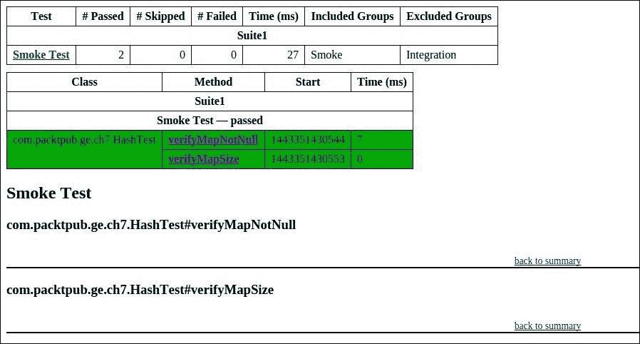
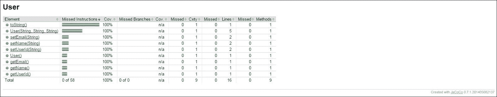
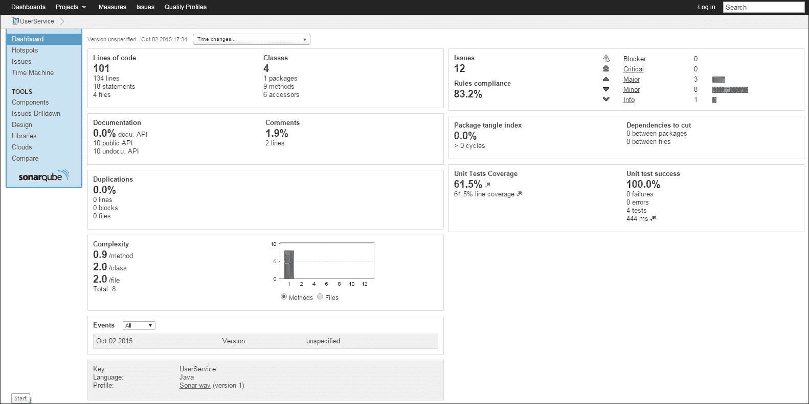
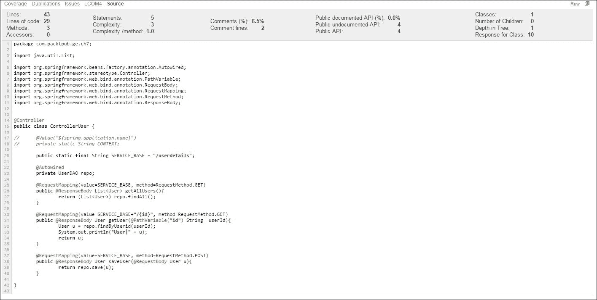

# 第七章。使用 Gradle 进行测试和报告

在本章中，我们将涵盖四个不同的主题：使用 TestNG 进行测试、集成测试、使用 JaCoCo 进行代码覆盖率以及使用 Sonar 进行代码分析。在第二章中，*构建 Java 项目*，我们已经讨论了使用 JUnit 进行单元测试。在本章中，我们将介绍另一个广泛使用的测试工具，TestNG。代码覆盖率和代码质量是**测试驱动开发**（**TDD**）中的另外两个重要方面。在今天的敏捷开发过程中，开发者需要对其开发的代码进行持续的反馈。代码质量工具帮助我们实现这一目标。通常，这些工具与**持续集成**（**CI**）系统集成，以便这些报告每天（甚至每次提交后）生成，在不同团队之间共享，甚至可以持久化以供未来分析。在本章中，我们将专注于不同工具的 Gradle 方面。我们将主要介绍支持这些特性的不同 Gradle 插件。

# 使用 TestNG 进行测试

使用 TestNG 与我们在第二章中讨论的 JUnit 集成类似，即*构建 Java 项目*。第一步是创建带有 TestNG 依赖项的构建文件并配置测试闭包。以下构建文件将 TestNG 库添加为`testCompile`依赖项，并在测试闭包中，我们添加了一个`testng.xml`文件来执行测试用例。在本节中，我们将简要讨论`testng.xml`的使用：

```java
apply plugin:'java'

repositories {
  mavenCentral()
}

dependencies {
  testCompile 'org.testng:testng:6.8.21'
}

test {
  ignoreFailures = true
  useTestNG(){
    suites("src/test/resources/testng.xml")
  }
}
```

### 注意

然而，你可以在[`testng.org/doc/documentation-main.html`](http://testng.org/doc/documentation-main.html)了解更多关于 TestNG 配置的信息。

在我们的示例中，我们创建了三个测试用例，分别命名为`verifyMapSize`、`verifyMapNotNull`和`addEvenNumbers`。这些测试用例被分组为`Smoke`和`Integration`测试用例。如果你执行 Gradle 测试命令，所有三个测试用例都将被执行，并在`build/reports/tests`目录中创建测试报告。报告的外观和感觉与我们在前面看到的 JUnit 报告类似。实际的 TestNG 报告是在项目主目录下的`test-output/`目录中创建的。JUnit 和 TestNG 都生成它们自己的不同报告格式，但 Gradle 将它们协调成标准的外观和感觉：

```java
package com.packtpub.ge.ch7;

import java.util.HashMap;

import org.testng.Assert;
import org.testng.annotations.AfterMethod;
import org.testng.annotations.BeforeClass;
import org.testng.annotations.Test;

public class HashTest {

  private HashMap<Integer,String> hm;

  @BeforeClass(alwaysRun = true)
  public void setup(){
    hm = new HashMap<Integer, String>();
  }

  @AfterMethod(alwaysRun = true)
  public void cleantask(){
    hm.clear();
  }

  @Test(groups = "Smoke")
  public void verifyMapSize(){
    Assert.assertEquals(hm.size(), 0);
    hm.put(1, "first");
    hm.put(2, "second");
    hm.put(3, "third");
    Assert.assertEquals(hm.size(), 3);
  }

  @Test(groups = "Smoke")
  public void verifyMapNotNull(){
    Assert.assertNotNull(hm);

  }

  @Test(groups = "Integration")
  public void addEvenNumbers(){
    hm.put(2, "second");
    hm.put(4, "fourth");
    Assert.assertEquals(hm.size(), 2);
  }

}
```

一个 TestNG 测试用例可以从命令行、Ant 文件、Gradle 脚本、Eclipse 插件或 TestNG 测试套件文件中执行。TestNG 套件文件提供了一个灵活的测试执行控制机制。在测试套件文件中，你可以定义测试类、测试、测试组名称、监听器信息等。

我们在`src/test/resource`文件夹中创建了一个示例`testng.xml`文件。该文件包含一些重要信息。用于创建报告格式的**监听器配置**，一个**测试组**声明为`Smoke`，以及一个名为`com.packtpub.ge.ch7.HashTest`的测试类。

Gradle 不会强迫你将`testng.xml`放在`src/test/resources`中，我们只是这样做作为一种保持其组织性的手段：

```java
<!DOCTYPE suite SYSTEM "http://testng.org/testng-1.0.dtd" >
<suite name="Suite1" verbose="1" >
  <listeners>
    <listener class-name="org.testng.reporters.EmailableReporter" />
  </listeners>
  <test name="Smoke Test">
  <groups>
    <run>
      <exclude name="Integration"  />
      <include name="Smoke"  />
    </run>
  </groups>
  <classes>
    <class name="com.packtpub.ge.ch7.HashTest">
    </class>
  </classes>
  </test>
</suite>
```

由于我们只包含了标记为`Smoke`的测试用例，当我们执行`gradle test`命令时，TestNG 只调用了两个测试用例，`verifyMapNotNull`和`addEvenNumbers`。以下图显示了在`<Project_Home>/test-output/`目录中创建的 TestNG 报告：



图 7.1

# 集成测试

单元测试是软件开发生命周期中的关键步骤之一。它是验证代码质量的第一步检查。大多数基本功能都可以通过单元测试用例进行测试。它们快速且执行时间短。我们讨论了 JUnit 框架和 TestNG 框架来对代码进行单元测试。质量检查流程的下一步是集成测试。根据单元测试的一般定义，你将代码划分为小的单元并独立测试它们，这在独立开发代码时是好的。一旦你提交了代码并与其他开发者集成代码，你需要另一个级别的测试，这被称为集成测试。它验证不同组件按预期协同工作或否。你的测试报告可能在单元测试中给出 100%的成功结果，但除非你执行集成测试，否则你不能保证整个软件的功能。

我们已经看到了 Gradle 对单元测试的支持以及 Gradle 如何提供约定来在不同的目录结构和任务中编写测试类以及执行测试用例。在提供约定的术语中，Gradle 不会区分单元测试和集成测试。要在 Gradle 中同时启用单元测试和集成测试，你需要自定义 Gradle 以启用两者。考虑以下项目源代码的层次结构：

```java
C:.
└───IntegrationSample
 └───src
 ├───main
 │   └───java
 └───test
 └───java

```

这是您为源代码和测试代码创建的标准文件夹结构。您创建 `src/test/java` 来存储您的单元测试用例。现在，如果您想将集成测试用例添加到项目中，您可以将集成测试用例合并到相同的目录结构中；然而，这并不是一个好的设计——因为您可能希望在构建项目时每次都执行单元测试，并且可能希望每两周或每周执行一次集成测试——这可能会根据项目的复杂性和大小消耗更多时间。因此，而不是将集成测试合并到单元测试用例的目录结构中，我们建议您为集成测试用例创建一个单独的目录结构，`src/integrationTest/java`，并在您的 Gradle 构建脚本中进行配置。

以下将是存储集成测试用例的更新目录结构：

```java
C:.
└───IntegrationSample
 └───src
 ├───integrationTest
 │   └───java
 ├───main
 │   └───java
 └───test
 └───java

```

一旦创建了目录结构，您需要在您的 Gradle 构建脚本中进行配置。更新的构建脚本如下：

```java
apply plugin: 'java'
sourceSets {
   integrationTest {
       java.srcDir file('src/integrationTest/java')
       resources.srcDir file('src/integrationTest/resources') // to add the resources
   }
}

task runIntegrationTest(type: Test) {
   testClassesDir = sourceSets.integrationTest.output.classesDir
   classpath = sourceSets.integrationTest.runtimeClasspath
}
```

在这里，我们添加了一个额外的配置，`integrationTest`，以添加集成测试用例。为了执行集成测试，我们还定义了一个任务，`runIntegrationTest`，其类型为 `Test`，并配置了 `testClassesDir` 和类路径属性。一旦我们在构建脚本中添加了额外的 `sourceSets`，Java 插件会自动将两个新的依赖配置添加到您的构建脚本中 `integrationTestCompile` 和 `integrationTestRuntime`。

执行以下命令以检查当前依赖项：

```java
> gradle dependencies
------------------------------------------------------------
Root project
------------------------------------------------------------
……...
compile - Compile classpath for source set 'main'.
No dependencies
integrationTestCompile - Compile classpath for source set 'integration test'.
No dependencies
integrationTestRuntime - Runtime classpath for source set 'integration test'.
No dependencies
……….
BUILD SUCCESSFUL
Total time: 3.34 secs

```

在这里，`integrationTestCompile` 可以用于配置编译测试用例所需的依赖项，而 `integrationTestRuntime` 可以用于配置执行测试用例所需的依赖项。如您所见，没有为集成测试用例显式配置依赖项。您可以在依赖项闭包下进行配置：

```java
dependencies {
// other configuration dependencies 
integrationTestCompile 'org.hibernate:hibernate:3.2.3.ga'
}
```

我们不希望在每次构建项目时都执行集成测试。因此，要执行集成测试，您需要显式执行以下命令：

```java
> gradle runIntegrationTest

```

这将调用 `runIntegrationTest` 任务并执行集成测试用例。如果您希望在构建代码时每次都执行这些测试用例，您可以使用 `dependsOn` 或其他依赖属性将此任务与其他任务链接。

# 代码覆盖率

有许多可用于源代码分析的覆盖率工具，例如 EMMA、Corbatura、JaCoCo 等。在本节中，我们将介绍 Gradle 与 JaCoCo 的集成以进行源代码分析。

在我们开始之前，我们需要了解代码覆盖率是什么以及为什么它在测试驱动开发中很重要。

代码覆盖率是我们用来检查源代码被测试了多少的指标。更高的代码覆盖率意味着我们的代码被测试的比例更大。代码覆盖率通常在单元测试周期中完成。在代码覆盖率期间，开发者必须确保源代码中的不同逻辑路径已被测试和验证，以达到更好的代码覆盖率。

这里，重要的是要理解代码覆盖率与代码质量没有直接关系。高代码覆盖率并不能保证编写了高质量的代码。开发者必须使用静态代码分析工具，如 PMD ([`pmd.github.io/`](https://pmd.github.io/)) 来查找代码的质量。另一个需要记住的点是，即使有 100%的代码覆盖率，也不能保证编写了完全无错误的代码。因此，许多开发者认为这不是衡量代码质量或单元测试的正确指标。然而，70-80%的代码覆盖率被认为是健康代码覆盖率的好数字。

在 Gradle 中，代码覆盖率工具 JaCoCo 可以像任何其他插件一样应用于项目：

```java
apply plugin: 'jacoco'
```

我们的`build.gradle`文件包含以下内容。我们创建了一些 TestNG 测试用例来测试源代码的功能。我们还配置了一个测试任务，使其依赖于`jacocoTestReport`任务。这是为了确保在运行和创建测试覆盖率报告之前执行测试用例：

```java
apply plugin: 'java'
apply plugin: 'jacoco'

repositories {
  mavenCentral()
}

dependencies {
  testCompile 'org.testng:testng:6.8.8'
}

test{
    systemProperty "url",System.properties['url']
    useTestNG()
}

jacocoTestReport.dependsOn test
```

默认情况下，报告将在`<build dir>/reports/jacoco/test/html`目录下创建，并将生成一个 HTML 报告文件。例如，我们创建了一个简单的 POJO `User.java`文件，其中包含 getter 和 setter 方法。我们还创建了一些单元测试用例来验证功能。以下两个示例测试用例如下：

```java
  @Test
  public void userEmailTest() {
    User user1 = new User("User2", "User2 user2", "user2@abc.com");
    Assert.assertEquals(user1.getEmail(), "user2@abc.com");
  }

  @Test
  public void userIdTest() {
    User user1 = new User();
    user1.setUserId("User3");
    user1.setName("User3 user3");
    user1.setEmail("user3@abc.com");
    Assert.assertEquals(user1.getName(), "User3 user3");
    Assert.assertEquals(user1.getUserId(), "User3");
  }
```

接下来，我们可以执行`jacocoTestReport`任务来生成代码覆盖率报告：

```java
> gradle clean jacocoTestReport
:clean
:compileJava
:processResources UP-TO-DATE
:classes
:compileTestJava
:processTestResources UP-TO-DATE
:testClasses
:test
:jacocoTestReport

BUILD SUCCESSFUL

Total time: 7.433 secs

```

在覆盖率报告中，你可以观察到 Java 类的所有方法都经过了单元测试。你可以进一步通过报告中的链接深入挖掘，这些链接显示了源代码的行覆盖率。源代码用绿色和红色标记来显示已覆盖和未测试的部分。以下图（*图 7.2*）显示了`User.java`类的代码覆盖率统计：



图 7.2

默认情况下，HTML 报告文件将在`build/reports/jacoco/test/html`目录下生成。此外，`jacoco`插件的默认版本可以通过修改以下`jacoco`扩展来修改：

```java
jacoco {
    toolVersion = "<Required-Version>"
    reportsDir = file("Path_to_Jacoco_ReportDir")
}
```

类似地，可以通过以下方式配置`jacocoTestReport`任务来自定义报告：

```java
jacocoTestReport {
    reports {
        xml.enabled false
        html.destination "<Path_to_dircectory>"
    }
}
```

# 代码分析报告

Sonar 是最受欢迎的质量管理工具之一，它可以从代码行数、文档、测试覆盖率、问题复杂度等方面对项目进行全面分析。作为开发者，我们主要对以下领域感兴趣：

+   重复的代码行

+   源代码中缺少注释，尤其是在公共 API 中

+   不遵循编码标准和最佳实践

+   寻找代码复杂性

+   单元测试产生的代码覆盖率

在本节中，我们将讨论 Gradle 与 Sonar 的集成。唯一的前提是，Sonar 服务器应该已安装并运行。

运行 Sonar 的前提是在机器上安装 Java。一旦满足前提条件，你只需三个简单步骤就可以安装 Sonar，如下所示：

1.  从[`www.sonarqube.org/downloads/`](http://www.sonarqube.org/downloads/)下载分发版并将其解压。

1.  打开控制台并启动 Sonar 服务器：

    +   在 Windows 平台上，启动`$SONAR_HOME\bin\windows-x86-32\StartSonar.bat`

    +   在其他平台上，启动`$SONAR_HOME/bin/[OS]/sonar.sh`

1.  访问`http://localhost:9000`。

要运行`sonar-runner`插件，我们只需应用`sonar-runner`插件并将其配置为连接到 Sonar 服务器。

使用以下内容为你的项目创建构建文件`build.gradle`：

```java
apply plugin: 'groovy'
apply plugin: "sonar-runner"

repositories {
    mavenCentral()
}

version = '1.0'
repositories {
    mavenCentral()
}

sonarRunner {
  sonarProperties {
    property "sonar.host.url", "http://<IP_ADDRESS>:<PORT>"
    property "sonar.jdbc.url",
    "jdbc:h2:tcp://<IP_ADDRESS>:<PORT>/sonar"
    property "sonar.jdbc.driverClassName", "org.h2.Driver"
    property "sonar.jdbc.username", "sonar"
    property "sonar.jdbc.password", "sonar"
  }
}
```

上述配置是自我解释的。你需要添加诸如 Sonar URL、DB URL 和 JDBC 驱动程序详情等配置，我们的构建文件就准备好了。

下一步是运行`sonarRunner`任务进行代码分析。在成功执行此任务后，你将在 Sonar 服务器上找到报告：

```java
>gradle clean sonarRunner
:clean
:compileJava
:processResources UP-TO-DATE
:classes
:compileTestJava
:processTestResources UP-TO-DATE
:testClasses
:test
:sonarRunner
SonarQube Runner 2.3
Java 1.7.0_51 Oracle Corporation (64-bit)
Windows 7 6.1 amd64
INFO: Runner configuration file: NONE
INFO: Project configuration file: <Project_Home>\UserService\build\tmp\sonarRunner\sonar-project.properties
INFO: Default locale: "en_IN", source code encoding: "windows-1252" (analysis is platform dependent)
INFO: Work directory: <Project_Home>\UserService\build\sonar
INFO: SonarQube Server 3.7.4
...
...

```

现在，你可以打开`http://localhost:9000/`来浏览项目。这个页面是默认仪表板页面，显示了所有项目的详细信息。你可以找到你的项目并浏览其详细信息。详细信息将如下显示：



图 7.3

你可以通过遵循项目主页提供的链接进一步验证每个指标的详细信息。例如，以下图显示了 Sonar 中的源代码相关指标。它提供了代码复杂性、代码行数、方法、文档等详细信息：



图 7.4

### 注意

你可以在[`docs.sonarqube.org/display/SONAR/Documentation/`](http://docs.sonarqube.org/display/SONAR/Documentation/)找到更多关于 Sonar 的信息。

# 摘要

在本章中，我们讨论了 Gradle 的测试和报告方面。我们的讨论从 TestNG 开始，并讨论了如何配置 Gradle 以支持集成测试用例与单元测试用例分离。然后，我们讨论了 JaCoCo 的代码覆盖率，最后我们讨论了 Gradle 与 Sonar 的集成。

在下一章中，我们将讨论如何在构建脚本和插件中组织构建逻辑。我们将探讨如何模块化插件代码，以便在多项目 Gradle 构建中共享。我们还将探讨如何在 Gradle 中创建自定义插件。
