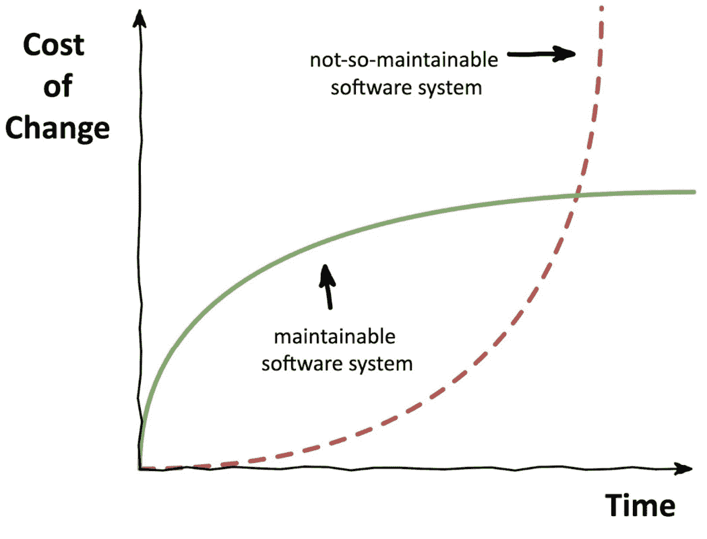
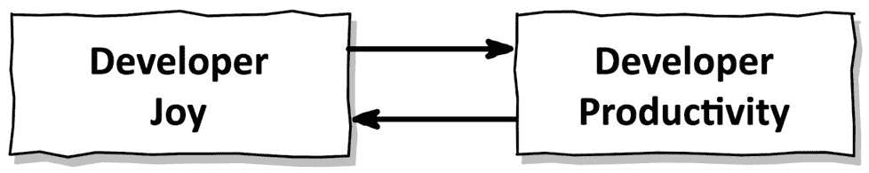
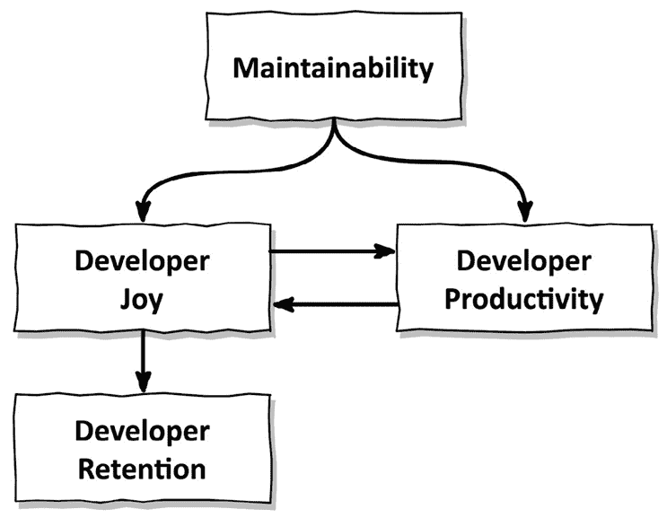
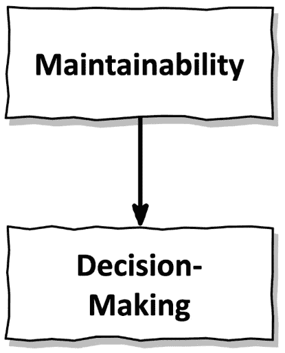
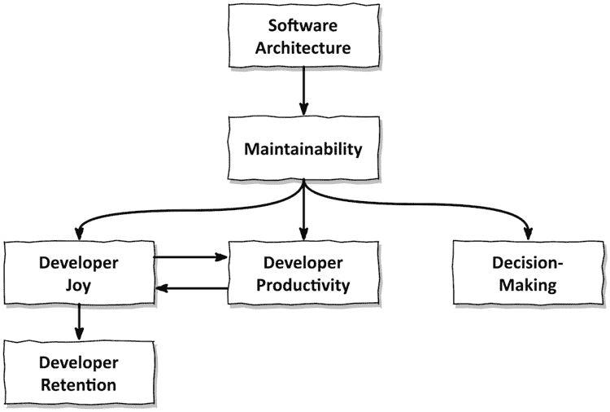

# 第一章：可维护性

这本书是关于软件架构的。*架构*的一个定义是*系统或过程的结构*。在我们的情况下，它是软件系统的结构。

架构是设计这个结构以达到某种目的。我们是有意识地设计我们的软件系统以满足某些要求。软件必须满足的功能性要求是为了为用户创造价值。没有功能性，软件就毫无价值，因为它不会产生价值。

同样，软件还应该满足一些质量要求（也称为非功能性要求），以使其用户、开发人员和利益相关者认为它是高质量的。其中一个质量要求就是**可维护性**。

如果我告诉你，可维护性作为一个质量属性，从某种意义上说，比功能更重要，而且我们应该优先设计软件的可维护性，而不是其他一切，你会说什么？一旦我们确立了可维护性作为一个重要的质量，我们将使用本书的其余部分来探讨我们如何通过应用清洁和六边形架构的概念来提高我们软件的可维护性。

# 可维护性到底是什么意思？

在你把我当作疯子并开始寻找退书选项之前，让我解释一下我所说的可维护性是什么意思。

可维护性只是构成软件架构的许多潜在质量要求之一。我向 ChatGPT 询问了一份质量要求清单，这是结果：

+   可扩展性

+   灵活性

+   可维护性

+   安全性

+   可靠性

+   模块化

+   性能

+   互操作性

+   可测试性

+   成本效益

列表还没有结束。1

1 关于软件质量的一些灵感（这是由人类创造的，而不是语言模型），请查看 [`quality.arc42.org/`](https://quality.arc42.org/)。

作为软件架构师，我们设计我们的软件以满足对软件最重要的质量要求。对于一个高吞吐量交易应用，我们可能会关注可扩展性和可靠性。对于一个处理德国个人可识别信息的应用，我们可能希望关注安全性。

我认为将可维护性与其他质量要求混为一谈是不正确的，因为可维护性是特殊的。如果软件是可维护的，这意味着它很容易改变。如果它容易改变，它就灵活，可能模块化。它也可能具有成本效益，因为容易的改变意味着低成本的改变。如果它是可维护的，我们可能可以将其演变为可扩展的、安全的、可靠的和性能良好的，如果需要的话。我们可以改变软件以与其他系统互操作，因为它容易改变。最后但同样重要的是，可维护性意味着可测试性，因为可维护的软件最有可能是由较小的、更简单的组件设计的，这使得测试变得容易。

你可以在这里看到我所做的工作。我向人工智能请求了一份质量要求列表，并将它们全部与可维护性联系起来。我可能可以用类似合理的论据将更多的质量要求与可维护性联系起来。当然，这有点过于简单化，但核心是真实的：如果软件是可维护的，它就更容易在任何方向上进化，无论是功能性的还是非功能性的。我们都知道，在软件系统的生命周期中，变化是常见的。

# 可维护性使功能得以实现

现在回到我在这章开头提出的观点：可维护性比功能性更重要。

如果你问一个产品人员一个软件项目中最重要的东西是什么，他们会告诉你，软件为用户提供的价值是最重要的。对用户没有价值的软件意味着用户不会为其付费。而没有付费的用户，我们就无法拥有一个可行的商业模式，这是商业世界中成功的主要衡量标准。

因此，我们的软件需要提供价值。但是，它不应该以牺牲可维护性为代价。2 想想，与那些你必须逐行代码地艰难推进的软件系统相比，向一个易于更改的软件系统添加功能要高效和愉快得多！我非常确信，你曾经参与过那些充斥着冗余和仪式的软件项目，要完成一个你认为只需几个小时就能完成的功能，却需要花费几天或几周的时间。

2 在本书的语境中，我将“可维护性”一词与“代码库的可更改性”同义使用。有关可维护性的定义，请参阅[`quality.arc42.org/qualities/maintainability`](https://quality.arc42.org/qualities/maintainability)（所有这些都与更改软件有关）。

以这种方式，可维护性是功能性的关键支持者。糟糕的可维护性意味着功能的变化随着时间的推移变得越来越昂贵，如图 *图 1.1* 所示：

图 1.1 – 一个可维护的软件系统比一个不太可维护的软件系统具有更小的生命周期成本

在一个不太可维护的软件系统中，功能的变化很快就会变得非常昂贵，以至于变化变得痛苦。产品人员会对工程师抱怨变化的成本。工程师会通过说推出新功能始终比提高可维护性具有更高的优先级来为自己辩护。随着变化成本的提高，冲突的可能性也会增加。

可维护性是一种安抚剂。它与变更成本成反比，因此与冲突的可能性成反比。你有没有想过在软件系统中添加可维护性以避免冲突？我认为那本身就是一项很好的投资。

但那些尽管可维护性差却取得成功的庞大软件系统怎么办？确实，有些商业上成功的软件系统几乎不可维护。我工作过的系统中，向表单中添加一个字段的项目需要花费开发者几周的时间，而客户很高兴为我的时间支付溢价。

这些系统通常属于以下一个（或两个）类别之一：

+   它们处于生命周期的末期，系统变更很少

+   他们背后有一个财务状况良好的公司，愿意花钱解决问题

即使公司有大量的资金可以花费，公司也会意识到，通过投资可维护性，他们可以减少维护成本。因此，通常，已经有计划进行中，以使软件更具可维护性。

我们应该始终关注我们正在创建的软件的可维护性，以免其退化成令人恐惧的**大泥球**，但如果我们的软件不属于之前提到的两种类别之一，我们应该更加关注。

这是否意味着我们甚至在开始编程之前就必须花大量时间规划可维护的架构？我们是否必须进行**大设计前期**（通常被认为与瀑布方法同义）？不，我们不必。但我们确实需要进行**一些前期设计**（我们应该称之为**SDUF**？）来将可维护性的种子植入软件中，这样随着时间的推移，可以更容易地将架构演变到所需的状态。

那部分前期设计包括选择一种定义我们正在构建的软件的护栏的架构风格。这本书将帮助你决定*纯净*——或*端口和适配器/六边形*——架构是否适合你的环境。

# 可维护性带来开发者的快乐

作为一名开发者，你更愿意在易于更改的软件上工作，还是更愿意在难以更改的软件上工作？不必回答；这是一个修辞问题。

除了直接影响变更成本之外，可维护性还有另一个好处：它使开发者快乐（或者，根据他们目前正在从事的项目，至少使他们不那么悲伤）。

我想用来描述这种快乐的是**开发者快乐**。它也被称为**开发者体验**或**开发者赋能**。无论我们称之为什么，它都意味着我们提供了开发者完成工作所需的环境。

开发者快乐与开发者生产力直接相关。一般来说，如果开发者快乐，他们会做得更好。而且如果他们做得好，他们会更快乐。开发者快乐与开发者生产力之间存在双向相关性：

图 1.2 – 开发者快乐影响开发者生产力，反之亦然

这种相关性已经在开发者生产力*SPACE 框架*中被认可。3 虽然 SPACE 没有提供一个关于如何衡量开发者生产力的简单答案，但它提供了五个类别来衡量此类指标，以便我们可以有意识地选择一组涵盖所有这些类别的指标，以最好地衡量我们公司和项目背景下的开发者生产力。其中这些类别之一（**SPACE**中的**S**）是**满意度和福祉**，我在本章将其翻译为开发者快乐。

3 *《开发者生产力空间》* 由 Nicole Forsgren 等人著，2021 年 3 月 6 日。“SPACE”代表满意度与福祉、绩效、活动、沟通与协作，以及效率和流程。参见[`queue.acm.org/detail.cfm?id=3454124`](https://queue.acm.org/detail.cfm?id=3454124)。

开发者快乐不仅会导致更高的生产力，而且自然会带来更好的留存率。一个享受自己工作的开发者会留在公司。或者更确切地说，一个不喜欢自己工作的开发者更有可能离开去寻找更广阔的天地。

那么，可维护性是如何进入画面的呢？嗯，如果我们的软件系统是可维护的，我们实施更改所需的时间会更少，因此我们更有效率。此外，如果我们的软件系统是可维护的，我们在进行更改时会感到更多的快乐，因为效率更高，我们可以从中获得更多的自豪感。即使我们的软件的可维护性不如我们希望的那样（坦白说，这是一个同义反复），但如果我们有机会随着时间的推移提高可维护性，我们会更加快乐和高效。如果我们快乐，我们更有可能留下来。

以图表形式表达，看起来是这样的：

图 1.3 – 可维护性直接影响开发者快乐和生产力，而开发者快乐影响留存

# 可维护性支持决策

在构建软件系统时，我们每天都要解决问题。对于大多数我们面临的问题，都有不止一个解决方案。我们必须做出决定，在那些解决方案之间进行选择。

我们是否为构建的新功能复制这段代码？我们是自己创建对象还是使用依赖注入框架？我们是使用重载构造函数来创建这个对象，还是创建一个构建器？

我们中的许多决定甚至都不是有意识地做出的。我们只是应用之前使用过的模式或原则，直觉告诉我们这些在当前情况下会有效，如下所示：

+   当我们发现代码重复时，我们应用**不要重复自己（DRY）**原则

+   我们使用**依赖注入**来使代码更易于测试

+   我们引入了一个**构建者**来简化对象的创建过程

如果我们看看这些以及其他许多众所周知的模式，那么它们的效果是什么？在许多情况下，主要的效果是使代码在未来更容易更改（即，使它更易于维护）。可维护性已经融入了我们每天自动做出的许多决策中！

我们甚至可以在面对需要更多比仅仅应用预定义模式更复杂的决策时利用这一点。*每当我们必须在多个选项之间做出决定时，我们可以选择那些在未来使代码更容易更改的选项*。4 不再需要在不同的选项之间痛苦挣扎。我们只需选择最能提高可维护性的那个。用图表表达，这很简单：

4 在 2022 年的一次同名演讲中，（实用主义）Dave Thomas 将基于可变性的决策原则称为“一条规则统治一切”。我没有在网上找到这次演讲，但希望他将来会在他的网站上添加。请参阅 [`pragdave.me/talks-and-interviews.html`](https://pragdave.me/talks-and-interviews.html)。

图 1.4 – 可维护性影响决策

就像大多数原则一样，这当然是一种概括。在特定的情境下，正确的决策可能是不提高甚至降低可维护性的选项。但作为一个默认的规则，选择可维护性是一个简化日常决策的指南。

# 维护可维护性

好的，我假设你相信我，认为可维护性对开发者的快乐、生产力和决策能力有积极影响。我们如何知道我们对代码库所做的更改增加了（至少没有减少）可维护性？我们如何随着时间的推移管理可维护性？

那个问题的答案是创建和维护一个使创建可维护代码变得容易的架构。一个好的架构使得在代码库中导航变得容易。在一个易于导航的代码库中，修改现有功能或添加新功能变得轻而易举。我们应用程序组件之间的依赖关系清晰且不混乱。总之，好的架构提高了可维护性：

图 1.5 – 软件架构影响可维护性

通过扩展，一个好的架构可以提升开发者的快乐、开发效率、留存率以及决策能力。我们可以继续探讨更多直接或间接受到软件架构影响的事物。

这种相关性意味着我们应该在如何构建我们的代码结构上投入一些思考。我们如何将代码文件分组为组件？我们如何管理这些组件之间的依赖关系？哪些依赖是必要的，哪些应该被劝阻以保持代码库的灵活性，便于更改？这引出了本书的目的。本书展示了一种构建代码库的方法，使其易于维护。本书中描述的架构风格是实现 Clean/六边形架构的一种方式。然而，这种架构风格并不是解决所有软件构建问题的万能钥匙。正如我们将在*第十五章*，“选择架构风格”中学习到的，它并不适合所有类型的软件应用。

我鼓励你将本书中学到的知识运用到实践中，尝试不同的想法，修改它们以使其成为你自己的，然后将它们添加到你的工具箱中，以便在特定情境下觉得合适时应用。以下每一章的结尾都有一个名为*这如何帮助我构建可维护的软件？*的部分。这一部分将总结每一章的主要思想，并希望帮助你做出关于当前或未来软件项目架构的决定。
