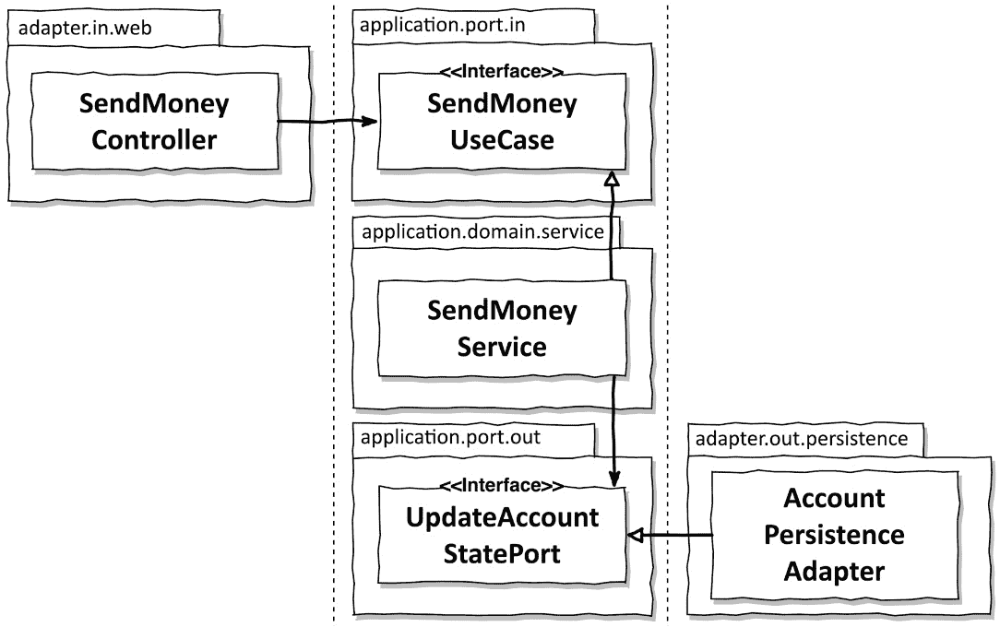

# 4

# 代码组织

只需通过查看代码就能识别架构，这不是很好吗？

在本章中，我们将探讨不同的代码组织方法，并介绍一种直接反映六边形架构的表达式包结构。

在绿色软件项目中，我们首先试图做对的事情是包结构。我们设置了一个看起来很不错的结构，打算在整个项目中使用。然后，在项目进行中，事情变得繁忙，我们意识到在许多地方，包结构只是无序代码混乱的一个漂亮门面。一个包中的类导入其他包中的类，而这些类本不应该被导入。

我们将讨论 BuckPal 示例应用程序的结构化选项，该应用程序在*前言*中介绍。更具体地说，我们将查看*发送金钱*用例，它允许用户将资金从他们的账户转移到另一个账户。

# 分层组织

我们组织代码的第一个方法是按层。我们可能会这样组织代码：

对于我们的每一层——`web`、`domain`和`persistence`——我们都有一个专门的包。如*第二章*中讨论的，*层有什么问题？*，简单的层可能不是我们代码的最佳结构，有多个原因，因此我们已应用了`domain`包。我们通过在`domain`包中引入`AccountRepository`接口并在`persistence`包中实现它来做到这一点。

我们可以找到至少三个原因说明这种包结构不是最优的，然而：

+   首先，我们在应用的功能切片或特性之间没有包边界。如果我们添加一个用于管理用户的特性，我们将在`web`包中添加一个`UserController`；在`domain`包中添加`UserService`、`UserRepository`和`User`；在`persistence`包中添加`UserRepositoryImpl`。如果没有进一步的结构，这可能会迅速变成一个类混乱，导致应用中看似无关的特性之间出现不希望出现的副作用。

+   第二，我们看不到我们的应用提供了哪些用例。你能说出`AccountService`或`AccountController`类实现了哪些用例吗？如果我们正在寻找某个特性，我们必须猜测哪个服务实现了它，然后在该服务中搜索负责的方法。

+   最后，我们在包结构中看不到我们的目标架构。我们可以猜测我们已经遵循了六边形架构风格，然后浏览`web`和`persistence`包中的类来找到网络和持久性适配器。但我们无法一眼看出哪个功能是由网络适配器调用的，哪个功能是由持久性适配器提供给领域层的。输入和输出端口隐藏在代码中。

让我们尝试解决“按层组织”方法的一些问题。

# 按功能组织

下一个方法是将我们的代码按功能组织：

从本质上讲，我们将所有与账户相关的代码都放入了高级包`account`中。我们还移除了层包。

每个新的特性组都会在`account`旁边获得一个新的高级包，我们可以通过使用**包私有**可见性来强制特性之间的包边界，对于不应从外部访问的类。

包边界，结合包私有可见性，使我们能够避免特性之间的不必要依赖。

我们还将`AccountService`重命名为`SendMoneyService`以缩小其责任范围（我们实际上也可以在按层划分包的方法中这样做）。现在我们可以看到，只需看类名，代码就实现了*发送货币*用例。罗伯特·马丁将使应用程序的功能在代码中可见称为“呼啸架构”，因为它在我们面前大声喊出其意图。1

1 呼啸架构*：《清晰架构》*，罗伯特·C·马丁，普雷蒂斯·霍尔，2017 年，*第二十一章*。

然而，按特性划分包的方法使得我们的架构在代码中的表现比按层划分包的方法更加不明显。我们没有包名来识别我们的适配器，而且我们仍然看不到输入和输出端口。更重要的是，尽管我们已经反转了领域代码和持久化代码之间的依赖关系，使得`SendMoneyService`只知道`AccountRepository`接口而不是其实例，但我们不能使用包私有可见性来保护领域代码免受对持久化代码的意外依赖。

那么，我们如何使我们的目标架构一目了然？如果我们可以像*图 3**.4*那样指向架构图中的一个框，并立即知道代码的哪个部分负责该框，那就太好了。

让我们再迈出一步，创建一个足够表达以支持这种架构的包结构。

# 一个具有建筑表达性的包结构

在六角架构中，我们有实体、用例、**输入**和**输出****端口**，以及输入和输出（或“**驱动**”和“**被驱动**”）适配器作为我们的主要架构元素。让我们将这些元素放入一个能够表达这种架构的包结构中：

我们可以直接将架构的每个元素映射到其中一个包。在最高级别，我们有`adapter`和`application`包。

`adapter`包包含调用应用程序输入端口的输入适配器和为应用程序输出端口提供实现的输出适配器。在我们的案例中，我们正在构建一个简单的 Web 应用程序，使用`web`和`persistence`适配器，每个适配器都有自己的子包。

将适配器的代码移动到它们自己的包中有一个好处，那就是我们可以非常容易地用另一个实现替换一个适配器，如果需要的话。想象一下，我们开始实现一个针对简单键值数据库的持久性适配器，因为我们认为我们知道了所需的访问模式，但那些模式已经改变了，现在我们最好使用一个 SQL 数据库。我们只需在新的适配器包中实现所有相关的输出端口，然后删除旧包。

`application` 包包含“六边形”，即我们的应用程序代码。这段代码由我们的领域模型组成，该模型位于 `domain` 包中，以及端点接口，它们位于 `port` 包中。

为什么端口在 `application` 包内而不是旁边？端口是我们将 `port` 包应用于 `application` 包的方式，这表明应用程序拥有端口。

`domain` 包包含我们的领域实体和领域服务，这些服务实现了输入端口并在领域实体之间进行协调。

最后，有一个 `common` 包，其中包含一些在代码库的其余部分共享的代码。

哇，这么多听起来很技术性的包。这不令人困惑吗？

想象一下，我们在办公室墙上挂着一个关于我们的六边形架构的高级视图，我们正在和一个同事讨论修改客户端以使用我们正在消费的第三方 API。在讨论这个话题时，我们可以指向海报上的相应输出适配器，以便更好地理解彼此。然后，当我们交谈完毕后，我们坐在 IDE 前，可以立即开始修改客户端，因为我们讨论过的 API 客户端代码可以在 `adapter/out/<适配器名称>` 包中找到。这比令人困惑要更有帮助，不是吗？

这种包结构是对抗所谓的**架构/代码差距**或**模型/代码差距**的有力元素。2 这些术语描述了这样一个事实：在大多数软件开发项目中，架构只是一个抽象概念，不能直接映射到代码。随着时间的推移，如果包结构（以及其他因素）不能反映架构，代码通常会越来越偏离目标架构。

2 模型/代码差距：乔治·费尔班克斯、马歇尔和布赖恩德，《Just Enough Architecture》，2010 年，第 167 页。

此外，这种表达式的包结构促进了关于架构的积极思考。我们必须积极决定将我们的代码放入哪个包。但是，包的数量那么多，是不是意味着为了允许跨包访问，所有内容都必须是公开的？

至少对于适配器包来说，这一点并不成立。它们包含的所有类都可以是包私有的，因为它们除了通过端口接口（这些接口位于`application`包内）之外，不会被外部世界调用。因此，没有从**应用层**到适配器类的意外依赖。

然而，在`application`包内部，确实有一些类必须是公共的。端口必须是公共的，因为它们必须按设计对适配器可访问。域模型必须是公共的，以便对服务以及可能对适配器可访问。服务不需要是公共的，因为它们可以隐藏在传入端口接口后面。

因此，是的，这样一个细粒度的包结构要求我们使一些类成为公共的，而在较粗粒度的包结构中它们可能是包私有的。我们将在*第十二章*中探讨如何捕捉对这些公共类的不希望访问，*强制架构边界*。

你可能会注意到这个包结构只包含一个域，即处理账户交易的域。然而，许多应用程序将包含来自多个域的代码。

正如我们将在*第十三章*中学习的，*管理多个边界上下文*，六边形架构并没有真正告诉我们如何管理多个域。当然，我们可以将每个域的代码放入`domain`包下的自己的子包中，并通过这种方式将域分开。但是，如果你正在考虑按域分别分离端口和适配器，那么请小心，因为这很快就会变成一个映射噩梦。更多关于这一点的内容请参考*第十三章*。

就像每个结构一样，在软件项目的整个生命周期中维护这个包结构需要纪律。此外，也可能会出现包结构根本不适合的情况，我们别无选择，只能扩大架构/代码差距，创建一个不反映架构的包。

没有完美。但通过一个有表达力的包结构，我们至少可以减少代码和架构之间的差距。

# 依赖注入的作用

之前描述的包结构在很大程度上有助于实现干净的架构，但这样一个架构的基本要求是**应用层**不依赖于传入和传出的适配器，正如我们在*第三章*中学习的，*反转依赖*。

对于传入适配器，例如我们的 Web 适配器，这很容易，因为控制流的方向与适配器和域代码之间的依赖关系相同。适配器只需在应用层调用服务。为了清楚地展示我们应用的入口点，我们希望将实际服务隐藏在端口接口后面。

对于外出的适配器，例如我们的持久化适配器，我们必须利用**依赖倒置原则**来逆转对控制流方向的依赖。

我们已经看到了它是如何工作的。我们在应用层内部创建了一个接口，由适配器内部的类实现。在我们的六边形架构中，这个接口是一个端口。然后应用层调用这个端口接口来调用适配器的功能，如图 *图 4.1* 所示。

图 4.1 – 网络控制器调用一个由服务实现的外来端口，而服务调用一个由适配器实现的外出端口

但谁为应用提供实现端口接口的实际对象呢？我们不希望在应用层手动实例化端口，因为我们不希望引入对适配器的依赖。

这就是**依赖注入**发挥作用的地方。我们引入了一个对所有层都有依赖的中立组件。这个组件负责实例化构成我们架构的大多数类。

在前面的示例图中，中立的依赖注入组件会创建`SendMoneyController`、`SendMoneyService`和`AccountPersistenceAdapter`类的实例。由于`SendMoneyController`需要一个`SendMoneyUseCase`，依赖注入机制将在构造过程中给它一个`SendMoneyService`类的实例。控制器不知道它实际上得到了一个`SendMoneyService`实例，因为它只需要知道接口。

类似地，在构建`SendMoneyService`实例时，依赖注入机制将以`UpdateAccountStatePort`接口的形式注入`AccountPersistenceAdapter`类的实例。服务永远不会知道接口背后的实际类。

我们将在*第十章*“组装*应用”中更详细地讨论使用 Spring 框架初始化应用，作为一个例子。

# 这如何帮助我构建可维护的软件？

我们研究了适用于六边形架构的包结构，使其尽可能接近目标代码结构。现在，在代码中找到架构元素变成了一件通过架构图上某些框的名称导航包结构的事情，这有助于沟通、开发和维护。

在接下来的章节中，我们将通过在应用层、网络适配器和持久化适配器中实现一个用例来展示这个包结构和依赖注入的实际应用。
