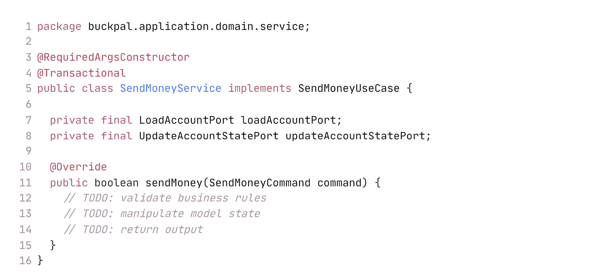

# 5

# 实现用例

让我们最终看看我们如何能在实际代码中实现所讨论的架构。

由于在我们的架构中，应用程序、Web 和持久化层耦合得非常松散，我们可以完全自由地以我们觉得合适的方式对领域代码进行建模。我们可以进行**领域驱动设计**（**DDD**），实现一个丰富的或贫血的领域模型，或者发明我们自己的做事方式。

本章描述了在之前章节中引入的六边形架构风格中实现用例的一种有见地的方法。

对于以领域为中心的架构来说，我们将从一个领域实体开始，然后围绕它构建一个用例。

# 实现领域模型

我们希望实现将资金从一个账户发送到另一个账户的用例。以面向对象的方式建模的一种方法是为允许我们从源账户取款并将资金存入目标账户创建一个`Account`实体：

`Account`实体提供了实际账户的当前快照。每次从账户取款和存款都会在`Activity`实体中捕获。由于始终将账户的所有活动加载到内存中并不明智，`Account`实体只保留最近几天或几周的活动窗口，这些活动被捕获在`ActivityWindow`值对象中。

为了仍然能够计算当前账户余额，`Account`实体额外具有`baselineBalance`属性，表示活动窗口的第一个活动之前账户所拥有的余额。因此，总余额是基线余额加上窗口中所有活动的余额。

使用这个模型，将取款和存款到账户的操作变成在活动窗口中添加一个新的活动，就像在`withdraw()`和`deposit()`方法中所做的那样。在我们能够取款之前，我们检查业务规则，该规则规定我们不能透支账户。

现在我们有了允许我们取款和存款的`Account`，我们可以向外扩展，围绕它构建一个用例。

# 用例的要点

首先，让我们讨论一下用例实际上做什么。通常，它遵循以下步骤：

1.  获取输入。

1.  验证业务规则。

1.  操作模型状态。

1.  返回输出。

用例从传入的适配器获取输入。你可能想知道为什么我没有将第一步称为“验证输入”。答案是，我相信用例代码应该只关注领域逻辑，我们不应该让它受到输入验证的污染。所以，我们将输入验证放在其他地方，就像我们很快就会看到的那样。

然而，用例负责验证业务规则。它与领域实体共同承担这一责任。我们将在本章后面讨论**输入验证**和**业务规则验证**之间的区别。

如果业务规则得到满足，用例就会根据输入以某种方式操纵模型的状态。通常，它将改变领域对象的状态，并将这个新状态传递给由持久化适配器实现的端口以进行持久化。如果用例驱动其他比持久化更广泛的影响，它将调用适当的适配器以处理每个副作用。

最后一步是将输出适配器的返回值转换为输出对象，该对象将被返回给调用适配器。

考虑到这些步骤，让我们看看我们如何实现我们的 *发送金钱* 用例。

为了避免在 *第二章* 中讨论的广泛服务问题，我们将为每个用例创建一个单独的服务类，而不是将所有用例放入一个单一的服务类中。

这里有一个预告：

该服务实现了 `SendMoneyUseCase` 输入端口接口，并调用 `Load` **AccountPort** 输出端口接口来加载一个账户，以及 `UpdateAccountState` **端口** 端口以在数据库中持久化更新的账户状态。

服务还设置了数据库事务的边界，如 `@Transactional` 注解所暗示的。更多关于这一点的内容请参阅 *第七章**，实现* *持久化适配器*。

*图 5**.1* 提供了相关组件的视觉概述：

图 5.1 – 一个服务实现一个用例，修改领域模型，并调用输出端口以持久化修改后的状态

注意

在这个例子中，`UpdateAccountStatePort` 和 `LoadAccountPort` 是由持久化适配器实现的端口接口。如果它们经常一起使用，我们也可以将它们合并到一个更广泛接口中。我们甚至可以将该接口命名为 `AccountRepository` 以保持 DDD 语言的连贯性。在这个例子以及本书的其余部分，我选择仅在持久化适配器中使用“Repository”这个名字，但你也可以选择不同的名字！

让我们来处理我们在前面的代码中留下的那些 `TODO` 注释。

# 验证输入

现在，我们正在讨论验证输入，尽管我刚刚声称这不是用例类的责任。然而，我认为它属于应用层，所以这就是讨论它的地方。

为什么不让调用适配器在将输入发送到用例之前进行验证呢？好吧，我们是否希望信任调用者已经验证了用例所需的全部内容？此外，用例可能被多个适配器调用，因此验证必须由每个适配器实现，而且可能会出错或完全忘记。

应用程序层应该关心输入验证，因为，否则它可能会从应用程序核心外部获得无效输入。这可能会损害我们模型的状态。

但如果不在用例类中，我们将输入验证放在哪里？

我们将让输入模型来处理这个问题。对于 *Send money* 用例，输入模型是我们之前在代码示例中已经看到的 `SendMoneyCommand` 类。更确切地说，我们将在构造函数中进行验证：

要发送金钱，我们需要源账户和目标账户的 ID 以及要转移的金额。这些参数都不能为 `null`，金额必须大于零。如果任何这些条件被违反，我们将在构造过程中抛出异常，简单地拒绝对象创建。

通过使用 `SendMoneyCommand`，我们使其 **不可变**。因此，一旦成功构建，我们可以确信状态是有效的，并且不能被改变为无效状态。

由于 `SendMoneyCommand` 是用例 API 的一部分，它位于传入端口包中。因此，验证仍然位于应用程序的核心（在我们架构六边形的边缘），但不会污染神圣的用例代码。

但是，当有库可以为我们完成这项脏活时，我们真的想手动实现每个验证检查吗？我经常听到这样的说法：“你不应该在模型类中使用库。”当然，减少依赖到最小是明智的，但如果我们可以使用一个小型依赖项来节省我们的时间，那么为什么不使用它呢？让我们通过 Java 的 Bean Validation API 探索一下这可能会是什么样子。1

1 Bean Validation: [`beanvalidation.org/`](https://beanvalidation.org/).

Bean Validation 允许我们在类的字段上使用注解来表示所需的验证规则：

`Validator` 类提供了 `validate()` 方法，我们只需在构造函数的最后一句调用它。这将评估字段上的 Bean Validation 注解（在这种情况下是 `@NotNull`），并在违反时抛出异常。如果默认的 Bean Validation 注解对于某些验证来说不够表达，我们可以像对 `@PositiveMoney` 注解那样实现我们自己的注解和验证器。2

2 你可以在 GitHub 仓库 [`github.com/thombergs/buckpal`](https://github.com/thombergs/buckpal) 中找到实现 `@PositiveMoney` 注解和验证器的完整代码。

`Validator` 类的实现可能看起来像这样：

通过将验证定位在输入模型中，我们在用例实现周围创建了一个**反腐败层**。这不是指分层架构中的层，而是指围绕我们的用例的一个薄薄的、保护性的屏幕，将不良输入弹回调用者。

注意，在`SendMoneyCommand`类中使用的“命令”一词并不符合“命令模式”的常见解释。3 在实际调用用例的`execute()`方法中。在我们的例子中，命令只是一个数据传输对象，它将所需的参数传递给执行命令的用例服务。我们可以称它为`SendMoneyDTO`，但我喜欢使用“命令”这个词，以使其非常清楚地表明我们正在通过这个用例改变模型状态。

3 命令模式：[`zh.wikipedia.org/wiki/命令模式`](https://zh.wikipedia.org/wiki/命令模式)。

# 构造函数的力量

我们的`SendMoneyCommand`将很多责任放在了构造函数上。由于该类是不可变的，构造函数的参数列表包含了一个对应于类每个属性的参数。并且由于构造函数还验证参数，因此不可能创建一个无效状态的对象。

在我们的例子中，构造函数只有三个参数。如果我们有更多的参数会怎样？我们能不能使用构建器模式使其使用更加方便？我们可以将具有长参数列表的构造函数设为私有，并在构建器的`build()`方法中隐藏对其的调用。然后，我们就不必调用一个带有 20 个参数的构造函数，而可以构建一个像这样的对象：

我们仍然可以让构造函数进行验证，这样构建器就不能构建一个无效状态的对象。

听起来不错？想想如果我们不得不向`SendMoneyCommandBuilder`（在软件项目的生命周期中这种情况会发生很多次）添加另一个字段会发生什么。我们将新字段添加到构造函数和构建器中。然后，一个同事（或者一个电话，一封电子邮件，一只蝴蝶……）打断我们的思路。休息后，我们回到编码，忘记将新字段添加到调用构建器以创建对象的代码中。

当我们尝试创建一个无效状态的不变对象时，编译器不会给出任何警告！当然，在运行时——希望是在单元测试中——我们的验证逻辑仍然会起作用，并抛出一个错误，因为我们遗漏了一个参数。

但如果我们直接使用构造函数而不是通过构建器隐藏它，每次添加新字段或删除现有字段时，我们都可以通过跟踪编译错误来反映代码库中其他部分的更改。

长参数列表甚至可以格式化得很好，并且好的集成开发环境（IDE）可以帮助提供参数名称提示：

图 5.2 – IDE 在参数列表中显示参数名称提示，帮助我们避免迷失方向

为了使前面的代码更加易于阅读和操作，我们可以引入不可变的`Address`值对象，例如，因为它们属于一起。我们甚至可以更进一步，创建`City`和`ZipCode`值对象，例如。这将减少将一个`String`参数与另一个参数混淆的可能性，因为如果我们将`City`传递给`ZipCode`参数或反之亦然，编译器会报错。

虽然在某些情况下，构建器可能是更好的解决方案。例如，如果前一个示例中的`ClassWithManyFields`的一些参数是可选的，我们就必须将`null`值传递给构造函数，这最多是丑陋的。构建器允许我们仅定义所需的参数。但如果我们使用构建器，我们必须非常确保在忘记定义一个必需参数时，`build()`方法会大声失败，因为编译器不会为我们检查这一点！

# 不同用例的输入模型

我们可能会倾向于为不同的用例使用相同的输入模型。让我们考虑*注册账户*和*更新账户详情*用例。这两个用例最初几乎需要相同的输入，即一些账户详情，例如用户名和电子邮件地址。

*更新*用例需要需要更新的账户的 ID，而*注册*用例则不需要。如果这两个用例使用相同的输入模型，我们总是必须将一个`null`账户 ID 传递给*注册*用例。这最多是令人烦恼的，最坏的情况是，因为这两个用例现在必须一起演变。

在我们的不可变命令对象中允许`null`作为字段的有效状态本身就是一种代码异味。但更重要的是，我们现在是如何处理输入验证的？由于一个需要 ID 而另一个不需要，验证对于*注册*和*更新*用例必须不同。我们必须将自定义验证逻辑构建到用例本身中，这将污染我们神圣的业务代码，使其充满输入验证问题。

此外，如果在*注册账户*用例中账户 ID 字段意外地有一个非空值，我们该怎么办？我们是抛出错误吗？还是简单地忽略它？这些问题是维护工程师（包括未来的我们）在看到代码时会提出的问题。

为每个用例创建一个专门的输入模型可以使用例更加清晰，并且将其与其他用例解耦，防止出现不希望的结果。然而，这也有代价，因为我们必须将传入的数据映射到不同用例的不同输入模型。我们将在*第九章*“边界之间的映射”中讨论这种映射策略以及其他映射策略。

# 验证业务规则

虽然验证输入不是用例逻辑的一部分，但验证业务规则绝对是的。业务规则是应用程序的核心，应该得到适当的关注。但我们在什么时候处理输入验证，在什么时候处理业务规则呢？

两者之间一个非常实际的区分是，验证业务规则需要访问领域模型当前状态，而验证输入则不需要。输入验证可以声明式地实现，就像我们之前用`@NotNull`注解做的那样，而业务规则则需要更多的上下文。

我们也可以说，输入验证是一种语法验证，而业务规则在用例的上下文中是一种语义验证。

让我们以规则“源账户不得透支”为例。根据之前的定义，这是一个业务规则，因为它需要访问模型当前状态来检查源账户的余额。

相比之下，规则“转账金额必须大于零”可以在不访问模型的情况下进行验证，因此可以作为输入验证的一部分实现。

我知道这种区分可能会引起争议。你可能会争辩说，转账金额如此重要，验证它无论如何都应该被视为一项业务规则。

然而，这种区分有助于我们将某些验证放置在代码库中，并在以后轻松地再次找到它们。这就像回答验证是否需要访问当前模型状态的问题一样简单。这不仅帮助我们首先实施规则，而且也有助于未来的维护工程师再次找到它。这也是我第一章中提出的“可维护性”主张的一个很好的例子，即可维护性支持决策。

那么，我们如何实现业务规则呢？

最好的办法是将业务规则放入领域实体中，就像我们对规则“源账户不得透支”所做的那样：

这样，业务规则就很容易定位和推理，因为它紧挨着需要遵守此规则的业务逻辑。

如果在领域实体中验证业务规则不可行，我们可以在用例代码开始处理领域实体之前进行验证：

我们调用一个执行实际验证的方法，并在验证失败时抛出一个专门的异常。然后，与用户交互的适配器可以将此异常显示为错误消息或以任何其他它认为合适的方式处理。

在前面的情况下，验证只是检查源账户和目标账户是否实际上存在于数据库中。更复杂的业务规则可能需要我们首先从数据库中加载领域模型，然后对其状态进行一些检查。如果我们无论如何都必须加载领域模型，我们应该在领域实体本身中实现业务规则，就像我们之前对规则“源账户不得”*透支*”所做的那样。

# 丰富的领域模型与贫血领域模型

我们的建筑风格留出了如何实现我们的领域模型的空间。这既是福也是祸，因为我们可以在我们的环境中做我们认为正确的事情，但同时也因为没有任何指导方针来帮助我们而感到苦恼。

常见的讨论是是否根据 DDD 哲学实现一个**丰富的领域模型**或一个“**贫血**”**领域模型**。让我们讨论每种方法如何适合我们的架构。

在一个丰富的领域模型中，尽可能多的领域逻辑都实现在应用程序核心的实体中。实体提供更改状态的方法，并且只允许根据业务规则进行更改。这是我们之前追求“账户”实体的方式。在这种情况下，我们的用例实现在哪里？

在这种情况下，我们的用例作为进入领域模型的入口点。用例仅仅代表了用户的意图，并将其转换为对领域实体的编排方法调用，这些实体实际完成工作。许多业务规则位于实体中而不是用例实现中。

“发送金钱”用例服务将加载源账户和目标账户实体，调用它们的`withdraw()`和`deposit()`方法，并将它们发送回数据库。4

4 实际上，“发送金钱”用例还必须确保在源账户和目标账户之间没有同时进行其他资金转账，以避免透支账户。

在一个“贫血”的领域模型中，实体本身非常瘦。它们通常只提供用于存储状态的字段以及用于读取和更改状态的 getter 和 setter 方法。它们不包含任何领域逻辑。

这意味着领域逻辑是在用例类中实现的。它们负责验证业务规则，更改实体的状态，并将它们传递给负责将它们存储在数据库中的输出端口。“丰富性”包含在用例中而不是实体中。

无论是哪种风格，还是任何其他风格，都可以使用本书中讨论的架构方法来实现。请随意选择适合您需求的一种。

# 不同用例的不同输出模型

一旦用例完成了其工作，它应该向调用者返回什么？

与输入类似，如果输出尽可能具体到用例，那么它就有好处。输出应仅包括调用者实际需要的数据。

在*发送金钱*用例的示例代码中，我们返回一个布尔值。这是我们在这个上下文中可能返回的最小和最具体的值。

我们可能会被诱惑将更新后的实体`Account`完整地返回给调用者。也许调用者对账户的新余额感兴趣。

但我们真的希望让*发送金钱*用例返回这些数据吗？调用者真的需要它吗？如果是这样，我们是否应该创建一个专门用于访问这些数据的用例，以便不同的调用者可以使用？

对于这些问题，没有唯一的正确答案。但我们应该提出这些问题，以尽量使我们的用例尽可能具体。如果有疑问，尽可能返回最少的。

在用例之间共享相同的输出模型也往往会紧密耦合这些用例。如果一个用例需要在输出模型中添加新字段，其他用例也必须处理这个字段，即使它与它们无关。共享模型由于多种原因，在长期运行中往往会肿瘤般地增长。应用单一责任原则并保持模型分离有助于解耦用例。

出于同样的原因，我们可能想要抵制使用我们的领域实体作为输出模型的诱惑。我们不希望我们的领域实体在不必要的情况下发生变化。然而，我们将在*第十一章*中更多地讨论将实体用作输入或输出模型，*有意识地走捷径*。

# 那么，只读用例怎么办？

到目前为止，我们已经讨论了如何实现可能修改我们模型状态的用例。我们如何处理只读用例？让我们假设 UI 需要显示账户余额。我们是否为这个用例创建一个特定的用例实现？

对于这种只读操作，谈论其用例可能会显得有些尴尬。当然，UI 需要这些数据用于我们可能称之为*查看账户余额*的用例，但在某些情况下，将这称为“用例”可能有些人为。如果在这个项目的背景下，这被视为一个用例，那么我们应该像其他用例一样实施它。

然而，从应用程序核心的角度来看，这只是一个简单的数据查询。因此，如果在这个项目的背景下，这不被视为一个用例，我们可以将其实现为一个查询，以将其与真正的用例区分开来。

在我们的架构风格中，实现这一点的办法之一是为查询创建一个专门的输入端口，并在“查询服务”中实现它：

`GetAccountBalanceUseCase`调用输出端口`LoadAccountPort`，从数据库实际加载数据。它使用`GetAccountBalanceQuery`类型作为其输入模型。

这样，只读查询在我们的代码库中可以清楚地与修改用例（或“命令”）区分开来。我们只需查看输入类型的名称，就能知道我们正在处理什么。这与**命令查询分离**（**CQS**）和**命令查询责任分离**（**CQRS**）等概念相得益彰。

在前面的代码中，服务实际上并没有做任何工作，只是将查询传递到输出端口。如果我们跨层使用相同的模型，我们可以走捷径，让客户端直接调用输出端口。我们将在*第十一章*中讨论这个捷径，*有意识地走捷径*。

# 这如何帮助我构建可维护的软件？

我们的架构允许我们根据需要实现领域逻辑，但如果我们独立地建模用例的输入和输出，我们可以避免不希望的副作用。

是的，这比在用例之间共享模型要复杂得多。我们必须为每个用例引入一个单独的模型，并将此模型与我们的实体进行映射。

但是，针对特定用例的模型可以清晰地理解用例，从而在长期内更容易维护。此外，它们还允许多个开发者并行工作在不同的用例上，而不会相互干扰。

与严格的输入验证相结合，针对特定用例的输入和输出模型对于构建可维护的代码库大有裨益。

在下一章中，我们将从应用程序的中心“向外迈出一步”，并探讨构建一个网络适配器，为用户提供与我们的用例进行交流的渠道。
