# 7

# 实现持久化适配器

在*第二章*，“层有什么问题？”中，我抱怨了传统的分层架构，并声称它促进了*数据库驱动设计*，因为最终，一切依赖于持久化层。在本章中，我们将探讨如何使持久化层成为应用程序层的插件，以反转这种依赖关系。

# 依赖倒置

我们将不讨论持久化层，而是讨论一个为领域服务提供持久化功能的持久化适配器。*图 7.1*展示了我们如何应用依赖倒置原则来实现这一点：

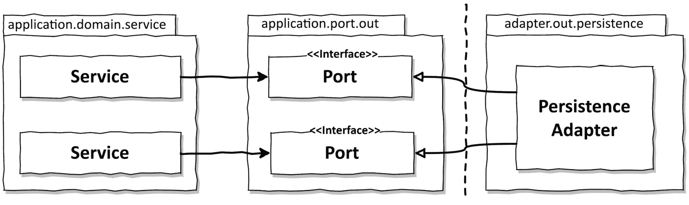

图 7.1 – 核心服务使用端口访问持久化适配器

我们的领域服务调用端口接口以访问持久化功能。这些端口由一个持久化适配器类实现，该类执行实际的持久化工作，并负责与数据库通信。

在六边形架构术语中，持久化适配器是一个*驱动*或*输出*适配器，因为它是由我们的应用程序调用的，而不是反过来。

端口在领域服务和持久化代码之间实际上是一个间接层。让我们提醒自己，我们添加这个间接层是为了能够在不思考持久化问题的情况下演进领域代码，也就是说，没有对持久化层的代码依赖。在持久化代码中的重构不会导致核心代码的改变。

自然地，在运行时，我们仍然有应用程序核心对持久化适配器的依赖。如果我们修改持久化层的代码并引入了一个错误，例如，我们仍然可能会破坏应用程序核心的功能。然而，只要端口合约得到满足，我们就可以在持久化适配器中自由地做我们想做的事情，而不会影响核心。

# 持久化适配器的职责

让我们看看持久化适配器通常都做什么：

1.  接收输入。

1.  将输入映射到数据库格式。

1.  将输入发送到数据库。

1.  将数据库输出映射到应用程序格式。

1.  返回输出。

持久化适配器通过端口接口接收输入。输入模型可能是一个领域实体或一个专门用于特定数据库操作的对象，具体由接口指定。

然后它将输入模型映射到它可以处理以修改或查询数据库的格式。在 Java 项目中，我们通常使用**Java 持久化 API**（**JPA**）与数据库通信，因此我们可能会将输入映射到反映数据库表结构的 JPA 实体对象。根据上下文，将输入模型映射到 JPA 实体可能是一项工作量很大但收益甚微的工作，所以我们将在*第九章*“*边界之间的映射*”中讨论不进行映射的策略。

我们可能不会使用 JPA 或其他对象关系映射框架，而是使用任何其他技术来与数据库通信。我们可能将输入模型映射到普通的 SQL 语句并将这些语句发送到数据库，或者我们将传入的数据序列化到文件中，然后从那里读取它们。

重要的是，持久化适配器的输入模型位于应用程序核心，而不是持久化适配器本身，这样持久化适配器的变化就不会影响核心。

接下来，持久化适配器查询数据库并接收查询结果。

最后，它将数据库答案映射到端口期望的输出模型，并返回它。同样，输出模型位于应用程序核心而不是持久化适配器中，这对于确保依赖关系指向正确的方向非常重要。

除了输入和输出模型位于应用程序核心而不是持久化适配器本身之外，责任实际上与传统持久层的责任没有太大区别。

然而，按照这里描述的方式实现持久化适配器不可避免地会引发一些问题，这些问题在我们实现传统持久层时可能不会提出，因为我们已经习惯了传统的方式，没有考虑这些问题。

# 端口接口切割

在实现服务时，人们可能会想到的一个问题是，如何切割定义应用程序核心可用的数据库操作的端口接口。

创建一个单一的存储库接口，为某个实体提供所有数据库操作，是一种常见的做法，如*图 7.2*所示。

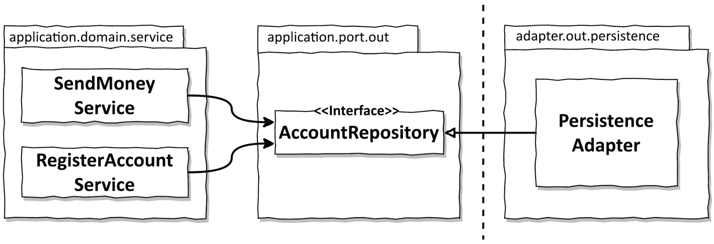

*图 7.2* – 将所有数据库操作集中到单个输出端口接口使所有服务都依赖于它们不需要的方法

每个依赖于数据库操作的服务都将随后依赖于这个单一的“广泛”端口接口，即使它只使用接口中的一个方法。这意味着我们在代码库中存在不必要的依赖。

在我们的环境中不需要的方法的依赖关系会使代码更难以理解和测试。想象一下，我们正在为前图中所示的`RegisterAccountService`编写单元测试。我们需要为`AccountRepository`接口的哪些方法创建模拟？我们必须首先找出服务实际调用的`AccountRepository`方法的哪些。只模拟接口的一部分可能会导致其他问题，因为下一个处理这个测试的人可能会期望接口被完全模拟并遇到错误。因此，他们又得进行一些研究。

用罗伯特·C·马丁的话来说，“*依赖于携带你不需要的负担的东西可能会给你带来你意想不到的麻烦。*”1

1. 接口分离原则*：罗伯特·C·马丁的《Clean Architecture》，第 86 页。

**接口分离原则**为这个问题提供了一个答案。它指出，宽泛的接口应该被分割成具体的接口，这样客户端只知道他们需要的那些方法。如果我们将这个原则应用到我们的输出端口上，我们可能会得到如图*图 7.3*所示的结果。

图 7.3 – 应用接口分离原则消除了不必要的依赖，并使现有的依赖更加明显

现在，每个服务只依赖于它实际需要的那些方法。更重要的是，端口的名称清楚地说明了它们的内容。在测试中，我们不再需要考虑要模拟哪些方法，因为大多数情况下，每个端口只有一个方法。

拥有如此狭窄的端口使得编码成为一种即插即用的体验。当处理一个服务时，我们只需“插入”我们需要的端口。没有需要携带的负担。

当然，“每个端口一个方法”的方法可能并不适用于所有情况。可能有一些数据库操作组非常紧密且经常一起使用，我们可能希望将它们捆绑在一个单独的接口中。

# 持久化适配器的切片

在前面的图中，我们看到了一个实现所有持久化端口的单一持久化适配器类。然而，没有规则禁止我们创建超过一个持久化适配器，只要所有持久化端口都得到了实现。

例如，我们可能会选择为需要持久化操作（或在领域驱动设计术语中称为聚合）的每个领域实体组实现一个持久化适配器，如图*图 7.4*所示。

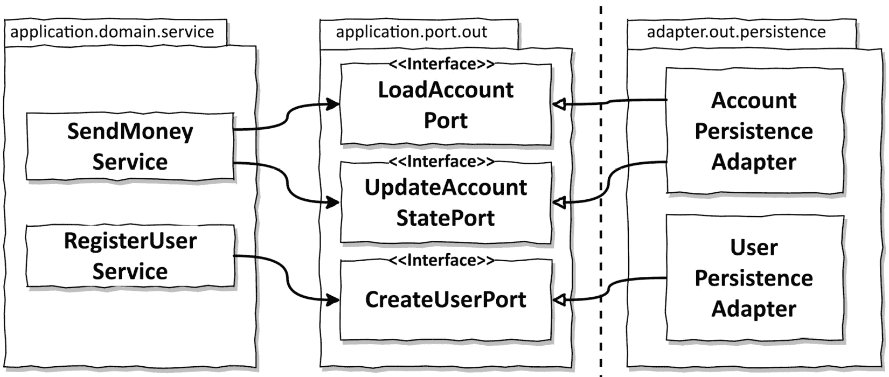

图 7.4 – 我们可以为每个聚合创建多个持久化适配器

这样，我们的持久化适配器会自动沿着我们支持持久化功能的领域边界进行切片。

我们可能会将我们的持久化适配器分成更多类——例如，当我们想使用 JPA（或另一个对象关系映射器）实现几个持久化端口，并使用纯 SQL 实现一些其他端口以获得更好的性能时。然后我们可能会创建一个 JPA 适配器和一個纯 SQL 适配器，每个适配器实现持久化端口的子集。

记住，我们的领域代码不关心哪个类最终实现了持久化端口定义的契约。我们在持久化层中可以自由地按照我们的看法行事，只要所有端口都得到了实现。

每个聚合只有一个持久化适配器的方法也是为将来分离多个边界上下文的持久化需求打下良好基础。比如说，经过一段时间，我们确定了一个负责围绕计费用例的边界上下文。*图 7**.5* 将这个新领域添加到应用中。

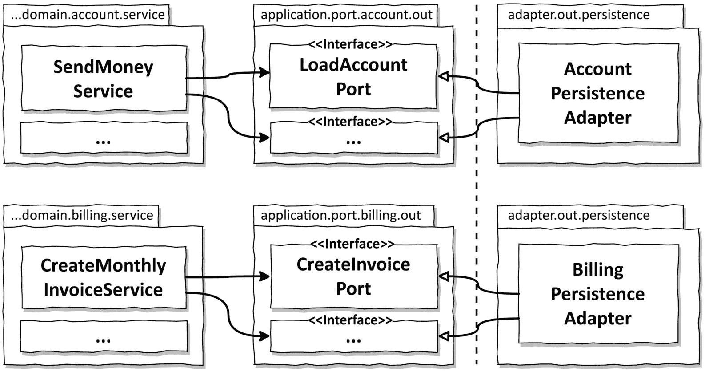

图 7.5 – 如果我们想在边界上下文之间创建硬边界，每个边界上下文都应该有自己的持久化适配器(s)

每个 `account` 上下文可能无法访问 `billing` 上下文的持久化适配器，反之亦然。如果一个上下文需要另一个上下文的东西，它们可以调用对方的领域服务，或者我们可以引入一个应用服务作为边界上下文之间的协调者。我们将在 *第十三章*，*管理多个边界上下文* 中更多地讨论这个话题。

# Spring Data JPA 的示例

让我们看看一个代码示例，该示例实现了前面图中的 `AccountPersistenceAdapter`。这个适配器将需要在数据库中保存和加载账户。我们已经在 *第五章*，*实现用例* 中看到了 `Account` 实体，但这里再次提供其结构以供参考：

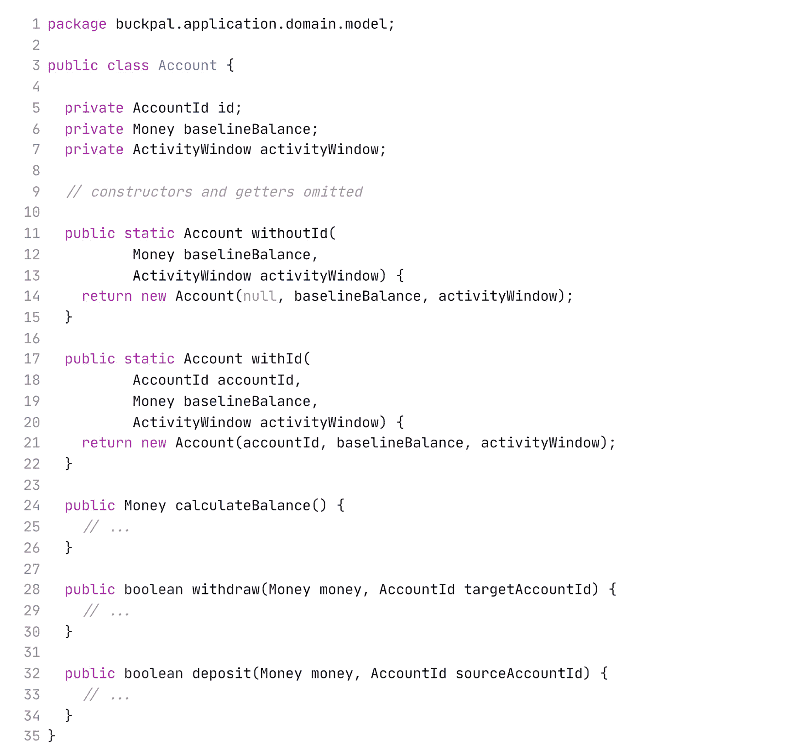

注意

`Account` 类不是一个简单的数据类，带有获取器和设置器，而是试图尽可能不可变。它只提供工厂方法来创建一个处于有效状态的账户，并且所有修改方法都会进行一些验证，例如在取款前检查账户余额，这样我们就不能创建一个无效的领域模型。

我们将使用 Spring Data JPA 与数据库通信，因此我们还需要用 `@Entity` 注解的类来表示账户的数据库状态：

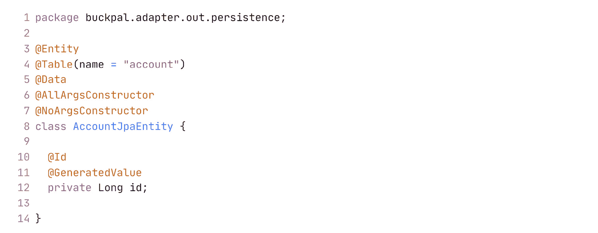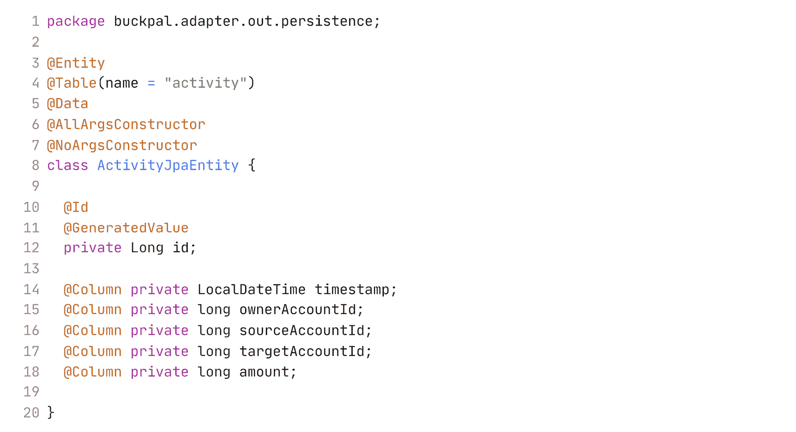

在这个阶段，账户的状态仅仅是一个 ID。稍后，可能会添加额外的字段，如用户 ID。更有趣的是`ActivityJpaEntity`，它包含了一个特定账户的所有活动。我们本可以使用 JPA 的`@ManyToOne`或`@OneToMany`注解将`ActivitiyJpaEntity`与`AccountJpaEntity`连接起来，以标记它们之间的关系，但我们选择现在不这样做，因为这会给数据库查询带来副作用。实际上，在这个阶段，使用比 JPA 更简单的对象关系映射器来实现持久化适配器可能更容易，但我们仍然会使用它，因为我们认为我们可能在将来需要它。2

2. Java Persistence API：这对你来说熟悉吗？你选择 JPA 作为对象关系映射器，因为它正是人们用来解决这个问题的工具。开发了几个月后，你开始诅咒懒加载和缓存功能，希望有更简单的方法。JPA 是一个伟大的工具，但对于许多问题，更简单的解决方案可能确实更简单。看看 Spring Data JDBC 或 jOOQ 作为替代方案。

接下来，我们将使用 Spring Data 创建仓库接口，这些接口提供开箱即用的基本**创建**、**读取**、**更新**和**删除**（CRUD）功能，以及自定义查询以从数据库中加载某些活动：

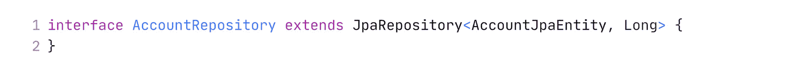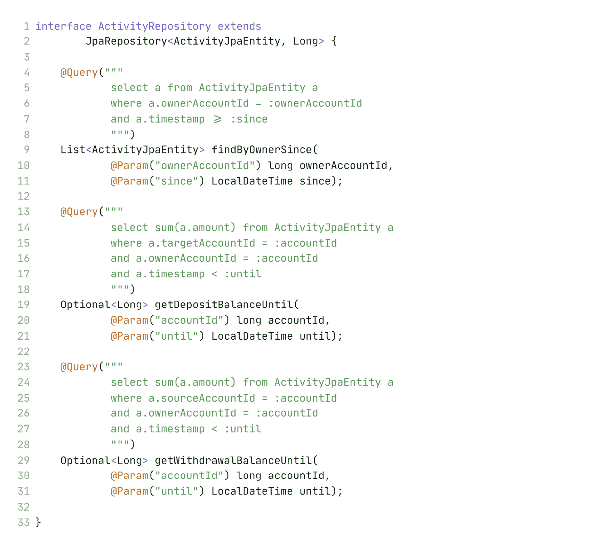

Spring Boot 将自动找到这些仓库，Spring Data 将执行其魔法，为仓库接口提供实现，该接口实际上会与数据库通信。

在有了 JPA 实体和仓库之后，我们可以实现一个持久化适配器，为我们的应用程序提供持久化功能：

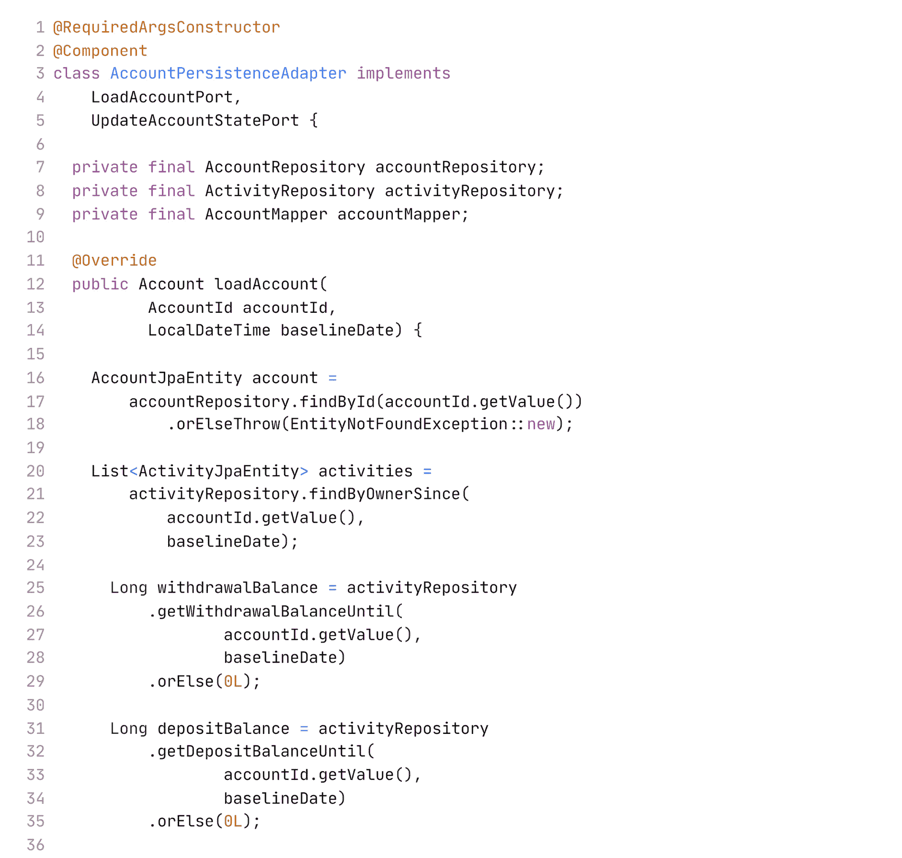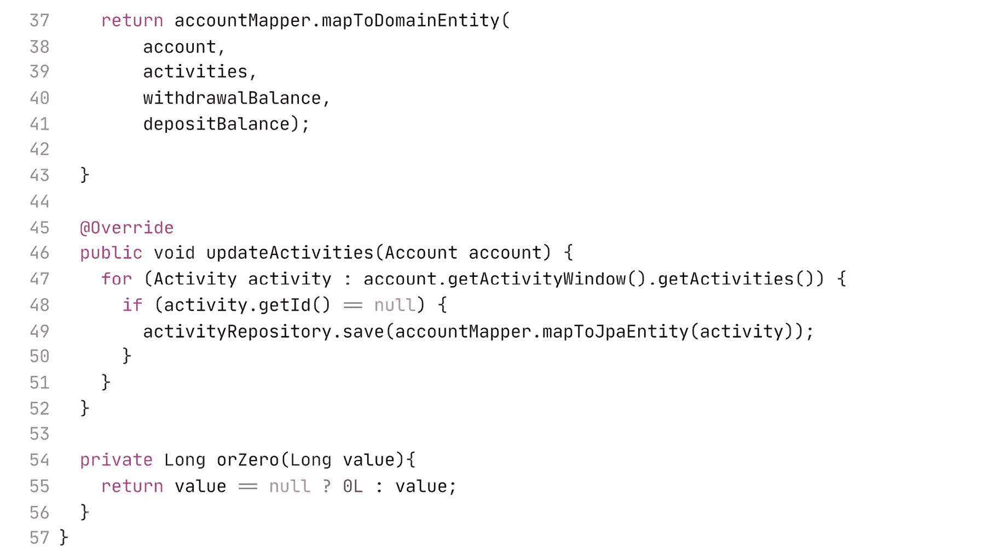

持久化适配器实现了应用程序需要的两个端口，`LoadAccountPort`和`UpdateAccountStatePort`。

要从数据库中加载一个账户，我们首先从`AccountRepository`中加载它，然后通过`ActivityRepository`加载这个账户在特定时间窗口内的活动。

要创建一个有效的`Account`域实体，我们还需要这个账户在活动窗口开始前的余额，所以我们从数据库中获取这个账户的所有提款和存款的总和。

最后，我们将所有这些数据映射到`Account`域实体，并将其返回给调用者。

要更新账户的状态，我们遍历`Account`实体的所有活动，并检查它们是否有 ID。如果没有，它们是新的活动，然后我们通过`ActivityRepository`将它们持久化。

在之前描述的场景中，我们在`Account`和`Activity`域模型与`AccountJpaEntity`和`ActivityJpaEntity`数据库模型之间建立了双向映射。我们为什么还要做这种来回映射的努力？我们为什么不直接将 JPA 注解移动到`Account`和`Activity`类中，并将它们直接作为实体存储在数据库中呢？

这种*无映射*策略可能是一个有效的选择，正如我们将在*第九章*中看到的，*边界之间的映射*，当我们讨论映射策略时。然而，JPA 随后迫使我们对领域模型做出妥协。例如，JPA 要求实体有一个无参构造函数。或者，在持久化层中，从性能角度来看，“多对一”关系可能是有意义的，但在领域模型中，我们希望这种关系是相反的。

因此，如果我们想创建一个不向持久化层做出妥协的丰富领域模型，我们就必须在领域模型和持久化模型之间进行映射。

# 那么，数据库事务怎么办呢？

我们还没有涉及到数据库事务的话题。我们的事务边界在哪里？

事务应该跨越在某个用例中执行的所有数据库写操作，确保如果其中一个操作失败，所有这些操作都可以一起回滚。

由于持久化适配器不知道哪些其他数据库操作是同一用例的一部分，它不能决定何时打开和关闭事务。我们必须将这项责任委托给协调对持久化适配器调用服务的服务。

在 Java 和 Spring 中，最简单的方法是将`@Transactional`注解添加到领域服务类中，这样 Spring 就会将所有公共方法包装在一个事务中：

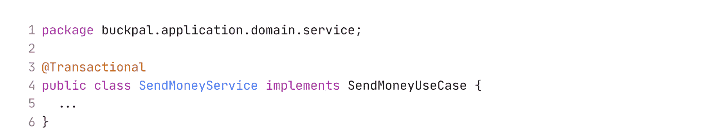

但是，`@Transactional`注解不是引入了我们不想在我们的宝贵领域代码中拥有的框架的依赖吗？嗯，是的，我们对注解有依赖，但我们也为此获得了事务处理！我们不想为了保持代码“纯净”而构建自己的事务机制。

# 这如何帮助我构建可维护的软件？

构建一个作为领域代码插件的持久化适配器，可以将领域代码从持久化细节中解放出来，从而我们可以构建一个丰富的领域模型。

使用窄端口接口，我们可以灵活地以某种方式实现一个端口，以另一种方式实现另一个端口，甚至可能使用不同的持久化技术，而应用程序不会注意到。我们甚至可以替换整个持久化层，只要遵守端口合约。3

3. 替换持久化层：虽然我见过几次这种情况（并且有很好的理由），但需要替换整个持久化层的概率通常相当低。即便如此，拥有专门的持久化端口仍然值得，因为它增加了可测试性。例如，我们可以轻松实现一个内存中的持久化适配器，用于测试。

现在我们已经构建了一个领域模型和一些适配器，让我们看看我们如何测试它们是否真的在按照我们期望的方式工作。
