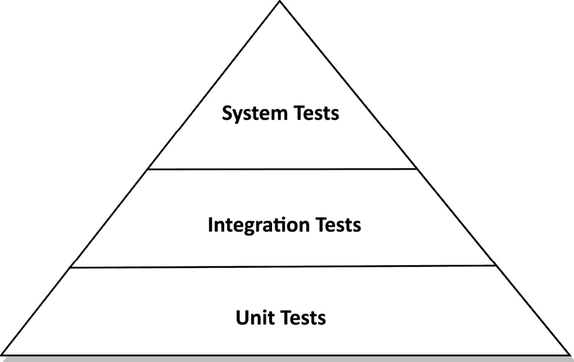
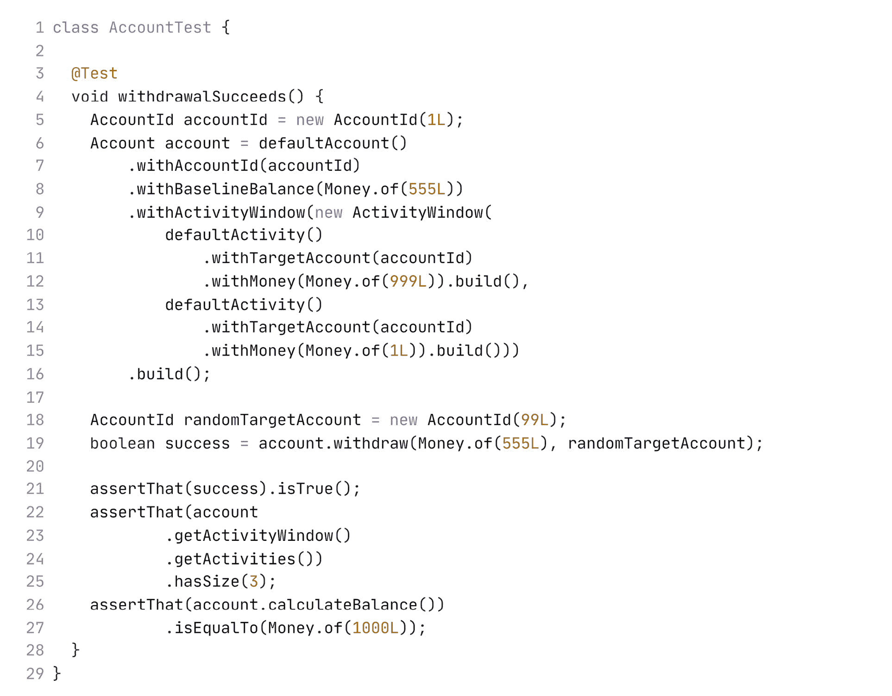
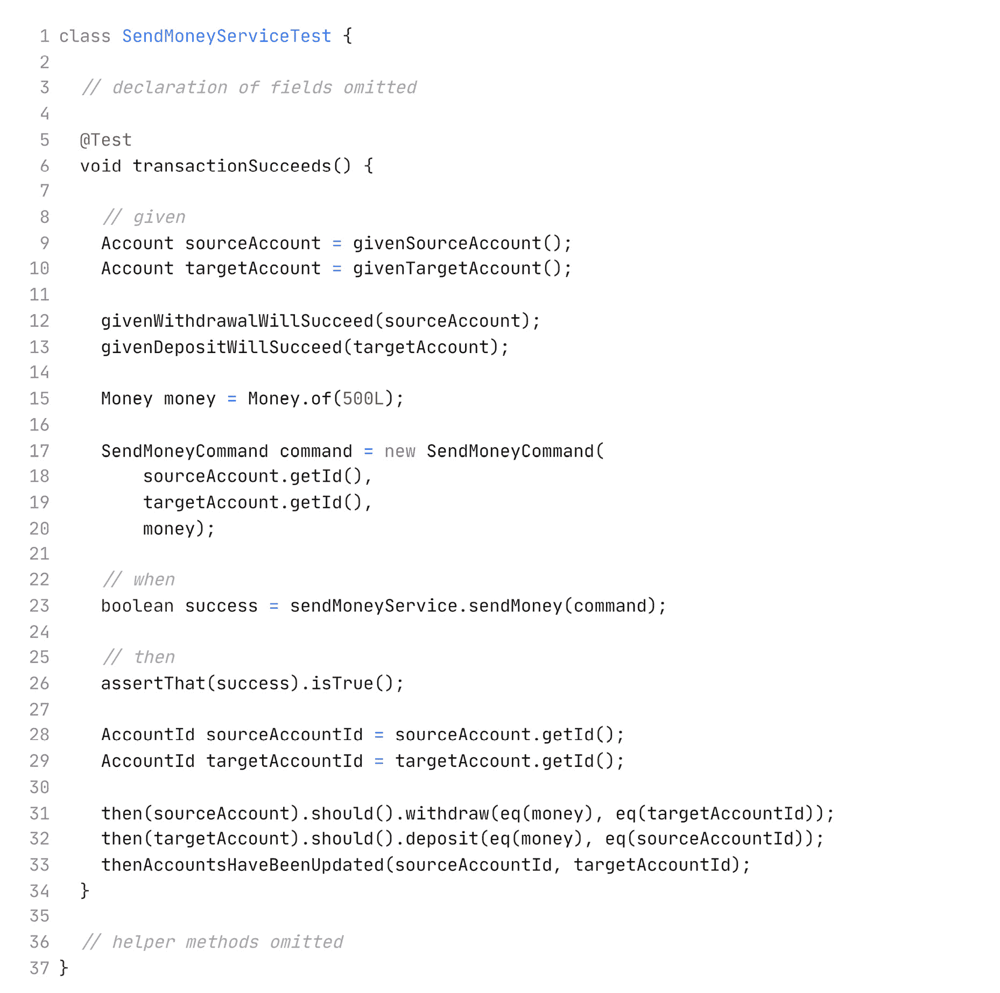
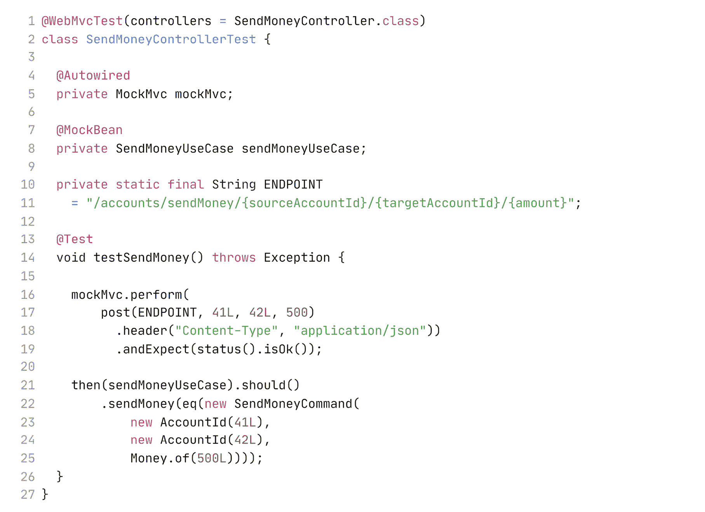
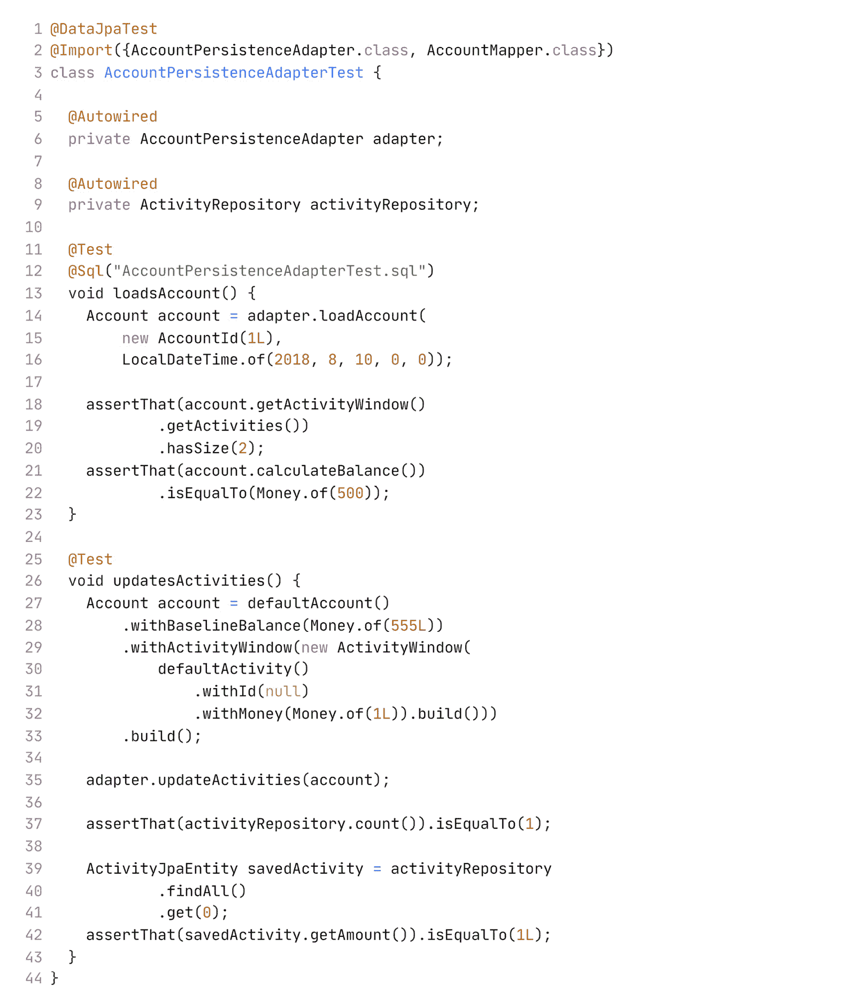
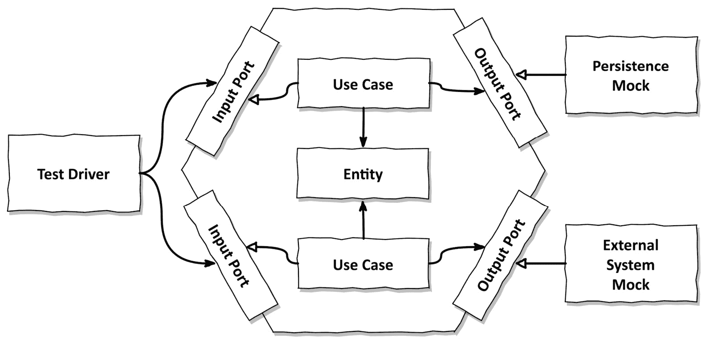
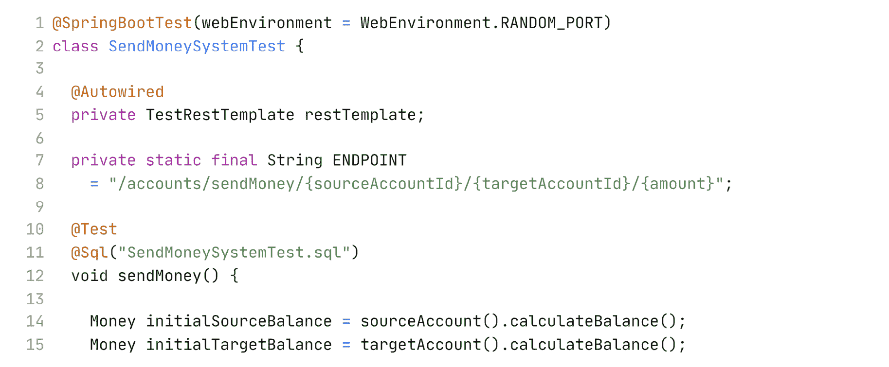
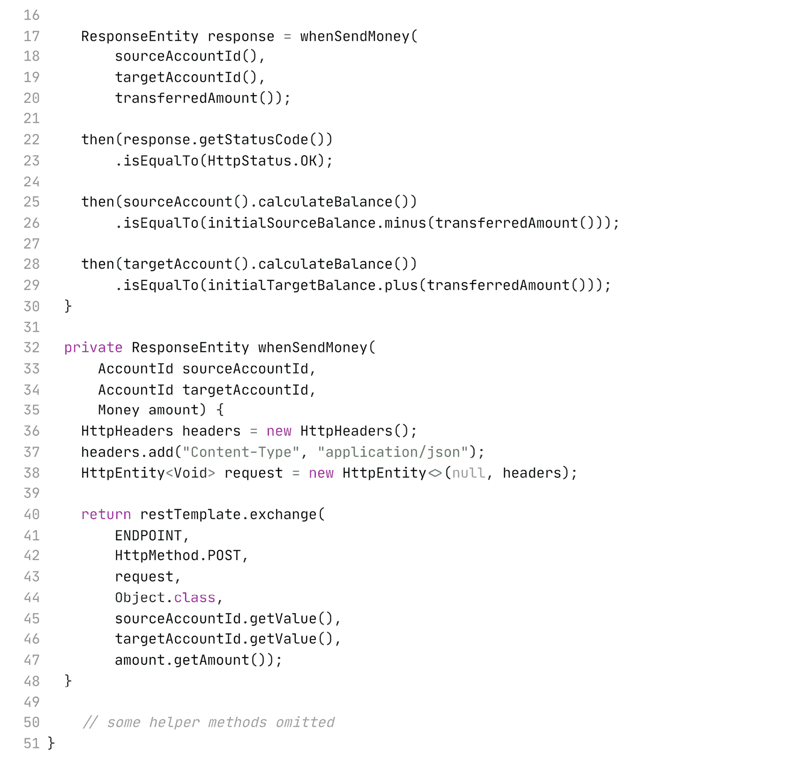

# 第八章：测试架构元素

在我见证的许多项目中，尤其是那些存在了一段时间并且随着时间的推移轮换了许多开发者的项目，自动化测试是一个谜。每个人都根据他们认为合适的方式编写测试，因为这是由某个尘封的规则所要求的，但没有人能回答关于团队测试策略的针对性问题。

本章提供了一种针对六边形架构的测试策略。对于我们架构的每个元素，我们将讨论覆盖它的测试类型。

# 测试金字塔

让我们从**测试金字塔**1 的讨论开始，如图 8.1 所示，这是一个帮助我们决定我们应该追求多少种类型测试的隐喻。

1 测试金字塔可以追溯到 2009 年迈克·科恩的书籍《敏捷成功》。

图 8.1 – 根据测试金字塔，我们应该创建许多低成本测试和较少的高成本测试

金字塔的基本陈述是我们应该有高覆盖率的细粒度测试，这些测试易于构建、易于维护、运行速度快且稳定。这些是验证单个单元（通常是一个类）按预期工作的单元测试。

一旦测试组合了多个单元并跨越了单元边界、架构边界甚至系统边界，它们往往变得更昂贵来构建、运行速度更慢、更脆弱（由于某些配置错误而不是功能错误而失败）。金字塔告诉我们，这些测试变得越昂贵，我们就越不应该追求对这些测试的高覆盖率，否则我们将花费太多时间构建测试而不是新功能。

根据上下文，测试金字塔通常以不同的层次展示。让我们看看我选择讨论测试我们的六边形架构的层次。

注意

*单元测试*、*集成测试*和*系统测试*的定义随着上下文的不同而变化。在一个项目中，它们可能意味着与另一个项目不同的事情。

以下是我们将在本章中使用的不同测试类型的解释：

+   **单元测试**是金字塔的基础。单元测试通常实例化一个类并通过其接口测试其功能。如果被测试的类对其他类有非平凡的依赖，我们可以用模拟对象替换这些依赖，模拟对象模拟真实对象的行为，以满足测试的要求。

+   **集成测试**构成了金字塔的下一层。这些测试实例化一个由多个单元组成的网络，并通过将一些数据通过入口类的接口发送到网络中，来验证这个网络是否按预期工作。在我们的解释中，集成测试将跨越两个层之间的边界，因此对象网络可能不完整或必须在某些点上与模拟对象交互。

+   最后，**系统测试**启动构成我们应用程序的整个对象网络，并验证某个用例是否在应用程序的所有层中按预期工作。

在系统测试之上，可能有一层端到端测试，包括应用程序的用户界面。在这里我们不会考虑端到端测试，因为我们只在本书中讨论后端架构。

注意

测试金字塔，像任何其他指导一样，并不是你测试策略的万能钥匙。它是一个好的默认选择，但如果你在你的环境中可以廉价地创建和维护集成或系统测试，你可以也应该创建更多的这些测试，因为它们比单元测试更不容易受到实现细节变化的影响。这会使金字塔的侧面更陡峭，甚至可能颠倒它们。

现在我们已经定义了一些测试类型，让我们看看哪种类型的测试最适合我们六边形架构的每一层。

# 使用单元测试测试领域实体

我们将从查看我们架构中心的领域实体开始。让我们回顾一下来自*第五章*，*实现用例*中的`Account`实体。`Account`的状态由一个账户在过去的某个时间点所拥有的余额（基线余额）以及自那时起所进行的存款和取款（活动）列表组成。

我们现在想验证`withdraw()`方法是否按预期工作：

前面的测试是一个简单的单元测试，它实例化了一个处于特定状态的`Account`，调用其`withdraw()`方法，并验证取款是否成功以及它对正在测试的`Account`对象的状态产生了预期的副作用。

测试设置相当简单，易于理解，并且运行非常快。测试没有比这更简单了。这样的单元测试是我们验证编码在我们领域实体中的业务规则的最佳选择。我们不需要任何其他类型的测试，因为领域实体的行为与其他类几乎没有任何依赖。

# 使用单元测试测试用例

向外扩展一层，下一个要测试的架构元素是作为领域服务实现的用例。让我们看看在*第五章*，*实现用例*中讨论的`SendMoneyService`测试。*发送金钱*用例从源账户取款并将其存入目标账户。我们想验证当交易成功时，一切是否按预期工作：

为了使测试更易于阅读，它被结构化为`given`/`when`/`then`部分，这在**行为驱动开发**中是常用的。

在`given`部分，我们创建源和目标`Account`对象，并使用以`given...()`开头的某些方法将它们置于正确的状态。我们还创建了一个`SendMoneyCommand`对象，作为用例的输入。在`when`部分，我们简单地调用`sendMoney()`方法来调用用例。在`then`部分，我们断言交易成功，并验证源和目标`Account`对象上是否调用了某些方法。

在底层，测试使用 Mockito 库来创建`given...()`方法。2 Mockito 还提供了`then()`方法来验证是否在模拟对象上调用过某个方法。

2 Mockito: [`site.mockito.org/`](https://site.mockito.org/).

注意

如果过度使用模拟，可能会产生虚假的安全感。模拟的行为可能与真实对象不同，即使在测试结果为绿色的情况下，也可能在生产中引发问题。如果你可以不花费太多额外努力就使用真实对象而不是模拟对象，那么你可能应该这样做。在前面的例子中，我们可能会选择与真实的`Account`对象而不是模拟对象一起工作，例如。这不应该需要更多的努力，因为`Account`类是一个领域模型类，它不依赖于其他类的任何复杂依赖。

由于被测试的使用案例服务是无状态的，我们无法在`then`部分验证某个状态。相反，测试验证服务是否与其（模拟的）依赖项上的某些方法进行了交互。这意味着测试容易受到被测试代码结构变化的影响，而不仅仅是其行为。这反过来意味着，如果被测试代码重构，测试需要修改的可能性更高。

考虑到这一点，我们应该仔细思考在测试中我们实际上想要验证哪些交互。可能一个好的主意不是像前面测试中那样验证所有交互，而是专注于最重要的那些。否则，我们必须随着被测试类的每一次更改而更改测试，这会削弱测试的价值。

虽然这个测试仍然是一个单元测试，但它接近于集成测试，因为我们测试了依赖项上的交互。然而，由于我们使用模拟并且不需要管理真实依赖项，所以它比完整的集成测试更容易创建和维护。

# 使用集成测试测试 Web 适配器

向外移动另一层，我们到达了我们的适配器。让我们讨论如何测试 Web 适配器。

回想一下，一个 Web 适配器通过 HTTP 接收输入，例如 JSON 字符串形式的输入，可能对其进行一些验证，将输入映射到用例期望的格式，然后将它传递给那个用例。然后它将用例的结果映射回 JSON，并通过 HTTP 响应将其返回给客户端。

在对 Web 适配器的测试中，我们想要确保所有这些步骤都按预期工作：

前面的测试是对名为`SendMoneyController`的 Web 控制器的标准集成测试，该控制器是用 Spring Boot 框架构建的。在`testSendMoney()`方法中，我们向 Web 控制器发送一个模拟 HTTP 请求，以触发从一个账户到另一个账户的交易。

通过使用`isOk()`方法，我们验证 HTTP 响应的状态是`200`，并验证模拟的用例类已被调用。

这个测试覆盖了 Web 适配器的大多数职责。

我们实际上并没有通过 HTTP 协议进行测试，因为我们用`MockMvc`对象模拟了它。我们相信框架能够正确地将一切转换为 HTTP 协议。没有必要测试框架。

然而，从将输入从 JSON 映射到`SendMoneyCommand`对象的全过程都被覆盖了。如果我们像在*第五章*“实现用例”中解释的那样，将`SendMoneyCommand`对象构建为一个自我验证的命令，我们甚至可以确保这种映射产生了对用例而言语法上有效的输入。此外，我们还验证了用例确实被调用，并且 HTTP 响应具有预期的状态。

那么，为什么这是一个集成测试而不是单元测试呢？尽管在这个测试中似乎我们只测试了一个单一的 Web 控制器类，但在引擎盖下还有更多的事情在进行。通过使用`@WebMvcTest`注解，我们告诉 Spring 实例化一个负责响应特定请求路径、在 Java 和 JSON 之间进行映射、验证 HTTP 输入等的整个对象网络。在这个测试中，我们验证我们的 Web 控制器作为这个网络的一部分是否正常工作。

由于 Web 控制器与 Spring 框架紧密耦合，因此当它集成到这个框架中进行测试时是有意义的，而不是在隔离状态下进行测试。如果我们用普通的单元测试来测试 Web 控制器，我们就会失去对所有映射、验证和 HTTP 内容的覆盖，并且我们永远无法确定它是否在生产环境中实际工作，在那里它只是框架机械结构中的一个齿轮。

# 使用集成测试测试持久化适配器

由于同样的原因，用集成测试而不是单元测试来覆盖持久化适配器是有意义的，因为我们不仅想要验证适配器内部的逻辑，还要验证其映射到数据库的过程。

我们想测试我们在 *第七章*，*实现持久性适配器* 中构建的持久性适配器。适配器有两个方法，一个是从数据库中加载 `Account` 实体，另一个是将新的账户活动保存到数据库中：

使用 `@DataJpaTest`，我们告诉 Spring 实例化数据库访问所需的网络对象，包括连接到数据库的我们的 Spring Data 仓库。我们使用 `@Import` 注解导入一些额外的配置，以确保某些对象被添加到该网络中。这些对象是测试中的适配器所需的，以便将传入的领域对象映射到数据库对象，例如。

在对 `loadAccount()` 方法的测试中，我们使用名为 `AccountPersistenceAdapterTest.sql` 的 SQL 脚本将数据库置于某种状态。然后，我们简单地通过适配器 API 加载账户，并验证它具有我们根据 SQL 脚本中的数据库状态所期望的状态。

对于 `updateActivities()` 的测试，方向相反。我们创建一个带有新账户活动的 `Account` 对象，并将其传递给适配器以持久化。然后，我们检查该活动是否已通过 `ActivityRepository` 的 API 保存到数据库中。

这些测试的一个重要方面是我们没有模拟数据库。测试实际上击中了数据库。如果我们模拟了数据库，测试仍然会覆盖相同的代码行，产生相同的代码行高覆盖率。然而，尽管有这种高覆盖率，由于 SQL 语句中的错误或数据库表与 Java 对象之间意外的映射错误，测试在真实数据库的设置中仍然有相当高的失败概率。

注意，默认情况下，Spring 将启动一个内存数据库以在测试期间使用。这非常实用，因为我们不需要进行任何配置，测试将直接工作。然而，由于这个内存数据库很可能不是我们在生产中使用的数据库，即使在内存数据库上测试工作完美，仍然有相当大的可能性在真实数据库上出现问题。例如，数据库供应商喜欢实现他们自己的 SQL 版本。

因此，持久性适配器测试应该针对真实数据库运行。在这方面，**Testcontainers** 等库非常有帮助，可以根据需要启动一个包含数据库的 Docker 容器。3

3 Testcontainers: [`www.testcontainers.org/`](https://www.testcontainers.org/).

对真实数据库进行测试的好处是，我们不必处理两个不同的数据库系统。如果我们使用测试期间的内存数据库，我们可能需要以某种方式配置它，或者我们可能需要为每个数据库创建数据库迁移脚本的单独版本，这对我们测试的可维护性是一个很大的打击。

# 使用系统测试测试主要路径

在金字塔的顶部是我所说的**系统测试**。系统测试启动整个应用，并对其 API 运行请求，验证我们所有的层是否协同工作。

六角架构的核心是创建一个清晰定义的应用与外部世界之间的边界。这样做使得我们的应用边界在设计上非常易于测试。为了在本地测试我们的应用，我们只需按照*图 8.2*中概述的方法，用模拟适配器替换适配器即可。

图 8.2 – 通过用模拟替换适配器，我们可以运行和测试我们的应用，而不依赖于外部世界

在左侧，我们可以用测试驱动器替换输入适配器，该驱动器调用应用输入端口以与之交互。测试驱动器可以实施某些测试场景，模拟自动化测试期间的用户行为。

在右侧，我们可以用模拟适配器替换输出适配器，该适配器模拟真实适配器的行为并返回先前指定的值。4

4 模拟：根据你询问的对象和你在测试中做的事情，你最好将之称为“伪造”或“存根”，而不是“模拟”。每个术语似乎都有略微不同的语义，但最终，它们都是用“模拟”的事物来替换“真实”的事物，以便在测试中使用。我通常喜欢给事物取一个恰当的名字，但在这个情况下，我认为讨论模拟结束和存根开始之间的细微差别没有价值。或者，情况是否相反？

这样，我们可以创建“应用测试”，它覆盖了从输入端口到我们的领域服务和实体，再到输出端口的“六边形”应用。

然而，我认为，我们不应该编写模拟输入和输出适配器的“应用测试”，而应该旨在编写覆盖从真实输入适配器到真实输出适配器整个路径的“系统测试”。这些测试揭示了如果我们模拟输入和输出适配器，我们可能无法捕捉到的许多微妙错误。这些错误包括层之间的映射错误，或者简单地是应用与它所交流的外部系统之间的错误期望。

这样的“系统测试”要求我们能够在测试设置中启动应用所交流的真实外部系统。

在输入端，我们需要确保我们可以向应用程序发出真实的 HTTP 请求，例如，使请求通过我们的真实 Web 适配器。然而，这应该相当简单，因为我们只需在本地启动我们的应用程序，让它像在生产环境中一样监听 HTTP 请求。

在输出端，我们需要启动一个真实的数据库，例如，以便我们的测试可以通过真实持久化适配器进行。如今，大多数数据库都通过提供我们可以本地启动的 Docker 镜像来简化这一点。如果我们的应用程序与不是数据库的第三方系统通信，我们仍然应该尝试找到（或创建）一个包含该系统的 Docker 镜像，这样我们就可以通过启动本地 Docker 容器来测试我们的应用程序。

如果没有可用的 Docker 镜像来模拟外部系统，我们可以编写一个自定义的模拟输出适配器来模拟真实情况。六角架构使我们能够轻松地将真实输出适配器替换为这个模拟适配器，以便于我们的测试。如果 Docker 镜像变得可用，我们也可以轻松地切换到真实输出适配器。

当然，测试模拟适配器而不是真实适配器有合理的理由。例如，如果我们的应用程序在多个配置文件中运行，并且每个配置文件使用不同的（真实）输入或输出适配器，这些适配器针对相同的输入和输出端口实现，我们可能希望有隔离应用程序错误和适配器错误的测试。那么，只覆盖我们六角的应用程序测试正是我们想要的工具。然而，对于具有数据库的标准 Web 应用程序，其中输入和输出适配器相对静态，我们可能更希望专注于系统测试。

系统测试看起来会是什么样子？在一个针对 *发送金钱* 用例的系统测试中，我们向应用程序发送一个 HTTP 请求，并验证响应以及账户的新余额。

在 Java 和 Spring 世界中，它可能看起来是这样的：

使用 `@SpringBootTest`，我们告诉 Spring 启动构成应用程序的对象网络。我们还配置应用程序在随机端口上公开自己。

在测试方法中，我们只需创建一个请求，将其发送到应用程序，然后检查响应状态和账户的新余额。

我们使用 `TestRestTemplate` 发送请求，而不是之前在 Web 适配器测试中使用的 `MockMvc`。这意味着测试会进行真实的 HTTP 调用，使测试更接近生产环境。

正如我们处理真实的 HTTP 一样，我们通过真实的输出适配器。在我们的案例中，这只是一个将应用程序连接到数据库的持久性适配器。在一个与其他系统通信的应用程序中，我们会放置额外的输出适配器。对于系统测试来说，并不是总是可行让所有这些第三方系统都运行起来，所以最终我们可能需要模拟它们。我们的六边形架构使我们能够尽可能容易地做到这一点，因为我们只需要模拟几个输出端口接口。

注意，我特意使测试尽可能易于阅读。我将所有丑陋的逻辑都隐藏在辅助方法中。这些方法现在形成了一个特定领域语言，我们可以用它来验证事物的状态。

尽管像这样的特定领域语言在任何类型的测试中都是一个好主意，但在系统测试中它更为重要。系统测试比单元测试或集成测试更好地模拟了应用程序的真实用户，因此我们可以从用户的角度验证应用程序。有了合适的词汇，这会容易得多。这个词汇库还使领域专家能够对测试进行推理并提供反馈，这些专家最适合体现应用程序的用户，而且可能不是程序员。有专门的库用于行为驱动开发，例如 JGiven5，它提供了一个框架来为您的测试创建词汇。

5 JGiven: [`jgiven.org/`](https://jgiven.org/).

如果我们像前几节描述的那样创建单元测试和集成测试，系统测试将覆盖大量相同的代码。它们甚至提供任何额外的优势吗？是的，它们确实提供了。通常，它们会清除单元测试和集成测试之外的其他类型的错误。例如，某些层之间的映射可能不正确，而这仅凭单元测试和集成测试我们是无法注意到的。

如果系统测试结合多个用例来创建场景，它们就能发挥最大的优势。每个场景代表用户可能通过应用程序的某个特定路径。如果最重要的场景通过系统测试得到覆盖，我们可以假设我们最新的修改并没有破坏它们，并且可以准备发货。

# 多少测试才算足够？

我参与过的许多项目团队都无法回答的一个问题是我们应该进行多少测试。如果我们的测试覆盖了 80%的代码行数，这足够了吗？应该更高吗？

行覆盖率不是一个衡量测试成功的良好指标。除了 100%之外的其他任何目标都是完全没有意义的，因为代码库的重要部分可能根本未被覆盖。6 即使在 100%的情况下，我们仍然不能确定每个错误都已被消除。

6 测试覆盖率：如果你想了解更多关于 100%测试覆盖率的信息，请查看我那带有讽刺意味标题的文章《为什么你应该强制执行 100%代码覆盖率》，链接为[`reflectoring.io/100-percent-test-coverage/`](https://reflectoring.io/100-percent-test-coverage/)。

我建议通过我们感觉有多舒服地发布软件来衡量测试的成功。如果我们对测试足够信任，在执行它们之后发布软件，那么我们就做得很好。我们发布得越频繁，我们对测试的信任就越多。如果我们一年只发布两次，没有人会信任测试，因为它们一年只证明自己两次。

这需要我们在前几次发布时跳出一个信仰的飞跃，但如果我们把修复和从生产中的错误中学习作为优先事项，我们就走上了正确的道路。对于每个生产错误，我们应该问自己，“为什么我们的测试没有捕捉到这个错误？”记录下答案，然后添加一个覆盖它的测试。随着时间的推移，这将使我们感到发布软件很舒服，而且文档甚至提供了一个衡量我们随着时间的推移改进的指标。

然而，从定义我们应该创建的测试的策略开始是有帮助的。我们六边形架构的一个这样的策略是：

+   在实现领域实体时，用单元测试来覆盖它。

+   在实现用例服务时，用单元测试来覆盖它。

+   在实现适配器时，用集成测试来覆盖它。

+   用系统测试覆盖用户可以通过应用程序采取的最重要路径。

注意到短语“while implementing”——当测试在开发功能期间完成而不是之后，它们就变成了一个开发工具，不再感觉像是一项任务。

然而，如果我们每次添加一个新字段时都必须花一个小时来修复测试，那么我们做错了。很可能，我们的测试对代码的结构变化过于脆弱，我们应该看看如何改进。如果我们不得不为每次重构修改测试，测试就会失去价值。

# 这如何帮助我构建可维护的软件？

六边形架构风格清晰地分离了领域逻辑和外部适配器。这有助于我们定义一个清晰的测试策略，用单元测试覆盖中心领域逻辑，用集成测试覆盖适配器。

输入和输出端口为测试提供了非常明显的模拟点。对于每个端口，我们可以决定模拟它或使用真实实现。如果端口每个都非常小且专注，模拟它们就像轻松完成任务一样，而不是一项任务。端口接口提供的方法越少，我们在测试中必须模拟的方法就越少混淆。

如果模拟某些事物变得过于繁重，或者如果我们不知道应该使用哪种测试来覆盖代码库的某个部分，那么这就是一个警告信号。在这方面，我们的测试有额外的责任，即充当一个“金丝雀”——提醒我们关于架构中的缺陷，并将我们引回创建可维护代码库的正确道路。

到目前为止，我们主要独立地讨论了我们的用例和适配器。它们之间是如何相互通信的呢？在下一章中，我们将探讨一些设计数据模型的方法，这些模型构成了它们之间的通用语言。
