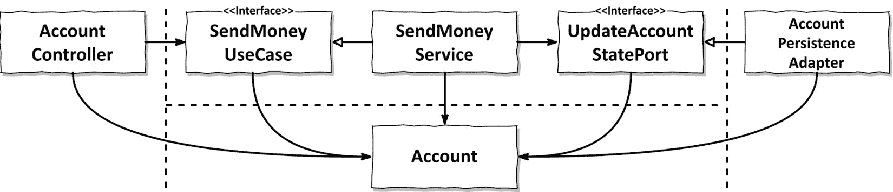
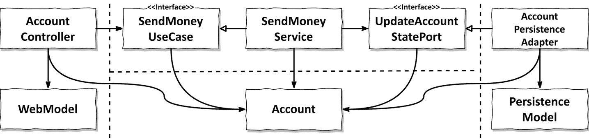
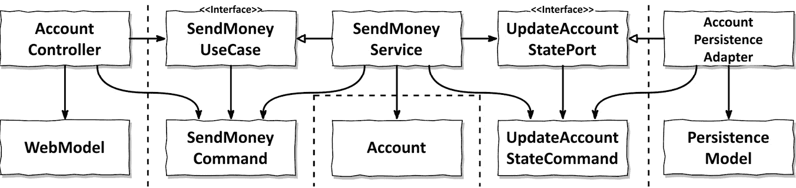
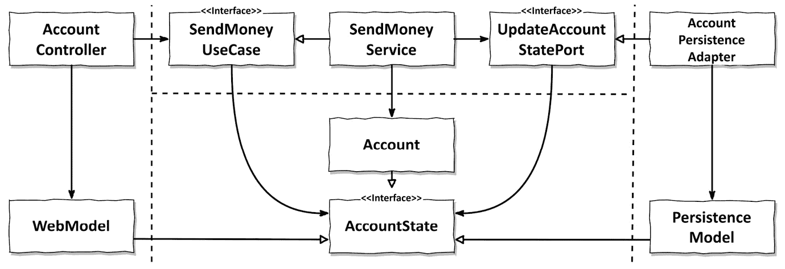

# 9

# 边界之间的映射

在前面的章节中，我们讨论了网络、应用、领域和持久层以及每个层对实现用例的贡献。

然而，我们几乎还没有触及到令人恐惧且无处不在的主题，即层之间模型之间的映射。我敢打赌，你可能在某个时候讨论过是否在两层中使用相同的模型以避免实现映射器。

争论可能如下进行：

支持映射的开发者：

“*如果我们不在层之间进行映射，我们不得不在两层中使用相同的模型，这意味着层将* *紧密耦合!*”

反对映射的开发者：

“*但是如果我们确实在层之间进行映射，我们将产生大量的样板代码，这对于许多用例来说都是过度的，因为它们只进行 CRUD 操作，并且层之间已经使用相同的模型了!*”

在此类讨论中，通常双方的观点都有一定的真实性。让我们讨论一些映射策略及其优缺点，看看我们是否可以帮助这些开发者做出决定。

# “无映射”策略

第一种策略实际上根本不进行映射。

图 9.1 – 如果端口接口使用领域模型作为输入和输出模型，我们可以选择不在层之间进行映射

*图 9**.1*显示了与我们 BuckPal 示例应用中的“发送金钱”用例相关的组件。

在网络层，网络控制器调用`SendMoneyUseCase`接口来执行用例。此接口接受一个`Account`对象作为参数。这意味着网络层和应用层都需要访问`Account`类——它们都在使用相同的模型。

在应用的反面，我们也有持久层和应用层之间相同的关系。

由于所有层都使用相同的模型，我们不需要在它们之间实现映射。

但这种设计的后果是什么？

网络层和持久层可能对其模型有特殊要求。例如，如果我们的网络层通过 REST 公开其模型，模型类可能需要一些注解来定义如何将某些字段序列化为 JSON。如果我们在使用**对象关系映射**（**ORM**）框架时也是如此，这可能会要求一些注解来定义数据库映射。框架还可能要求类遵循某种契约。

在示例中，所有那些特殊要求都必须在`Account`领域模型类中处理，即使领域层和应用层对它们不感兴趣。这违反了单一职责原则，因为`Account`类必须因为与网络、应用和持久层相关的原因而更改。

除了技术要求之外，每一层可能还需要在`Account`类上某些自定义字段。这可能导致领域模型碎片化，某些字段仅在某一层中相关。

然而，这难道意味着我们永远不应该实施“无映射”策略吗？当然不是。尽管这可能感觉有些不妥，但“无映射”策略可以完全有效。

考虑一个简单的 CRUD 用例。我们真的需要将相同的字段从网络模型映射到领域模型，再从领域模型映射到持久化模型吗？我认为我们不需要。

那么那些在领域模型上的 JSON 或 ORM 注解呢？它们真的会困扰我们吗？即使我们必须在持久化层发生变化时更改领域模型中的一个或两个注解，那又如何呢？

只要所有层都需要在完全相同的结构中精确地获取相同的信息，那么“无映射”策略就是一个完全有效的选择。

然而，一旦我们在应用或领域层（除了注解之外）处理网络或持久化问题，我们应转向另一种映射策略。

从这里引入的教训对两位开发者来说很重要：尽管我们过去决定了一种特定的映射策略，但我们可以在以后更改它。

根据我的经验，许多用例最初都是简单的 CRUD 用例。后来，它们可能发展成为具有丰富行为和验证的完整业务用例，这证明了更昂贵的映射策略的合理性。或者它们可能永远保持 CRUD 状态，在这种情况下，我们很高兴我们没有投资于不同的映射策略。

# “双向”映射策略

每一层都有自己的模型，这种映射策略我称之为“双向”映射策略，如*图 9.2*所示。2*。

图 9.2 – 每个适配器都有自己的模型，适配器负责将模型映射到领域模型，并返回

每一层都有自己的模型，其结构可能与领域模型完全不同。

网络层将网络模型映射到入站端口期望的输入模型。它还将入站端口返回的领域对象映射回网络模型。

持久化层负责在用于出站端口的领域模型和持久化模型之间进行类似的映射。

两个层都进行双向映射，因此命名为“双向”映射。

由于每一层都有自己的模型，它可以修改自己的模型而不影响其他层（只要内容没有改变）。网络模型可以有一个结构，允许最佳地展示数据。领域模型可以有一个结构，最好地实现用例。持久性模型可以有一个结构，满足 ORM 映射器将对象持久化到数据库所需的结构。

这种映射策略还导致了一个干净的领域模型，它不会受到网络或持久性问题的污染。它不包含 JSON 或 ORM 映射注解。满足了单一职责原则。

“双向”映射的另一个优点是，在“无映射”策略之后，它在概念上是最简单的映射策略。映射责任是清晰的：外层/适配器映射到内层模型的模型，并返回。内层只知道自己的模型，可以专注于领域逻辑而不是映射。

与每种映射策略一样，“双向”映射也有其缺点。

首先，它通常会导致大量的样板代码。即使我们使用许多映射框架之一来减少代码量，实现模型之间的映射通常也会占用我们大量的时间。这部分原因是调试映射逻辑很痛苦——尤其是在使用一个隐藏其内部工作原理在通用代码和反射层之后的映射框架时。

另一个潜在的缺点是，传入和传出的端口使用领域对象作为输入参数和返回值。适配器将这些映射到它们自己的模型，但这仍然比我们引入一个专门的“传输模型”（如我们接下来要讨论的“完全”映射策略）创建了更多的层间耦合。

就像“无映射”策略一样，“双向”映射策略也不是万能的。然而，在许多项目中，这种映射被认为是一条神圣的法律，我们必须在整个代码库中遵守，即使是对于最简单的 CRUD 用例。这无必要地减慢了开发速度。

不应该将任何单一的映射策略视为铁律。相反，我们应该为每个用例做出决定。

# “完全”映射策略

另一种映射策略是我所说的“完全”映射策略，如*图 9.3*所示。

图 9.3 – 每个操作都需要自己的模型，网络适配器和应用层将各自的模型映射到它们想要执行的操作所期望的模型

这种映射策略为每个操作引入了一个单独的输入和输出模型。我们不是使用域模型在层边界之间进行通信，而是使用针对每个操作的特定模型，例如`SendMoneyCommand`，它在图中充当`SendMoneyUseCase`端口的输入模型。我们可以将这些模型称为“命令”、“请求”或类似名称。

网络层负责将其输入映射到应用层的命令对象。这样的命令使得应用层的接口非常明确，几乎没有解释的空间。每个用例都有自己的命令，具有自己的字段和验证。我们不需要猜测哪些字段应该填写，哪些字段最好留空，因为它们可能会触发我们不希望针对当前用例的验证。

然后，应用层负责将命令对象映射到根据用例需要修改域模型所需的内容。

自然地，从一层映射到多个不同的命令需要比从单个网络模型到域模型之间的映射更多的映射代码。然而，这种映射比必须处理多个用例需求而不是单个用例的映射要容易实现和维护得多。

我不主张将这种映射策略作为全局模式。它在网络层（或任何其他传入适配器）和应用层之间发挥其优势，以清楚地界定应用的状态修改用例。由于映射开销，我不会在应用层和持久层之间使用它。

通常，我会将这种类型的映射限制在操作的输入模型上，并简单地使用域对象作为输出模型。例如，`SendMoneyUseCase`可能会返回一个带有更新后余额的`Account`对象。

这表明映射策略可以并且应该混合使用。不需要任何单一的映射策略成为所有层级的全局规则。

# “单向”映射策略

还有一种映射策略，它有一套自己的优缺点：即*图 9.4*中展示的“单向”策略。

图 9.4 – 域模型和适配器模型实现相同的“状态”接口，每个层只需要映射从其他层接收到的对象一次

在这种策略中，所有层的模型实现相同的接口，通过在相关属性上提供 getter 方法来封装域模型的状态。

领域模型本身可以实现丰富的行为，我们可以从应用层的服务中访问这些行为。如果我们想将领域对象传递到外层，我们可以这样做，无需映射，因为领域对象实现了传入和传出端口所期望的状态接口。

外层可以决定它们是否可以使用该接口，或者是否需要将其映射到自己的模型。由于修改行为没有通过状态接口暴露，它们不能无意中修改领域对象的状态。

我们从外层传递到应用层的对象也实现了这个状态接口。然后应用层必须将其映射到真实领域模型，以便访问其行为。这种映射与**领域驱动设计**中的工厂概念相得益彰。在领域驱动设计（DDD）中，工厂负责从某种状态重新构建领域对象，这正是我们所做的。1

1 工厂：*领域驱动设计*，作者埃里克·埃文斯，Addison-Wesley，2004 年，第 158 页。

映射责任是明确的：如果一个层从另一个层接收对象，我们就将其映射为该层可以处理的东西。因此，每个层只映射一个方向，这使得这是一个“单向”映射策略。

然而，随着映射在层之间分布，这个策略在概念上比其他策略更难。

如果层之间的模型相似，这种策略最能发挥其优势。例如，对于只读操作，Web 层可能根本不需要映射到自己的模型，因为状态接口提供了它所需的所有信息。

# 何时使用哪种映射策略？

这确实是一个价值百万的问题，不是吗？

答案是通常令人不满意的“这取决于”。

由于每种映射策略都有不同的优缺点，我们应抵制将单一策略定义为整个代码库的硬性全局规则的冲动。这与我们的直觉相悖，因为它感觉在同一个代码库中混合模式是不整洁的。但为了满足我们对整洁的感觉，明知不是最适合某个工作的模式，却选择它，这是不负责任的，简单明了。

此外，随着软件随时间演变，昨天最适合工作的策略可能今天不再是最适合的。我们可能不是从固定的映射策略开始并保持它——无论发生什么——而是从一个简单的策略开始，这个策略允许我们快速演进代码，然后转向一个更复杂的策略，帮助我们更好地解耦层。

为了决定何时使用哪种策略，我们需要在团队内部达成一套指导原则。这些指导原则应该回答在何种情况下哪种映射策略应该是首选，以及为什么它们是首选，这样我们才能评估这些原因在一段时间后是否仍然适用。

例如，我们可能为修改用例定义不同的映射指南，而不是为查询定义。我们可能还希望在 Web 层和应用层之间以及应用层和持久层之间使用不同的映射策略。

这些情况的指导原则可能看起来是这样的：

+   如果我们正在处理一个修改用例，那么在 Web 层和应用层之间，“完整”映射策略是首选，以便将用例彼此解耦。这为我们提供了清晰的每个用例验证规则，我们不必处理某个用例中不需要的字段。

+   如果我们正在处理一个修改用例，那么在应用层和持久层之间，“无映射”策略是首选，以便能够快速进化代码而不需要映射开销。然而，一旦我们必须在应用层处理持久性问题，我们就转向“双向”映射策略以保持持久性问题在持久层。

+   如果我们正在处理一个查询，那么在 Web 层和应用层之间以及应用层和持久层之间，“无映射”策略是首选，以便能够快速进化代码而不需要映射开销。然而，一旦我们必须在应用层处理 Web 或持久性问题，我们就转向 Web 层和应用层或应用层和持久层之间的“双向”映射策略。

为了成功应用这样的指南，它们必须存在于开发者的脑海中。因此，这些指南应该作为一个团队的努力持续讨论和修订。

# 这如何帮助我构建可维护的软件？

进出端口充当我们应用程序各层之间的守门人。它们定义了层与层之间如何相互通信，以及我们如何在不同层之间映射模型。

通过为每个用例设置狭窄的端口，我们可以为不同的用例选择不同的映射策略，甚至随着时间的推移进行进化，而不影响其他用例，从而在某个特定时间选择某种特定情况的最佳策略。

为每个用例选择不同的映射策略比简单地使用相同的映射策略更困难，需要更多的沟通，但只要映射指南是已知的，它将使团队能够获得一个只做它需要做的事情且更容易维护的代码库。

现在我们知道了构成我们应用程序的组件以及它们如何通信，我们可以探索如何将不同的组件组装成一个可工作的应用程序。
