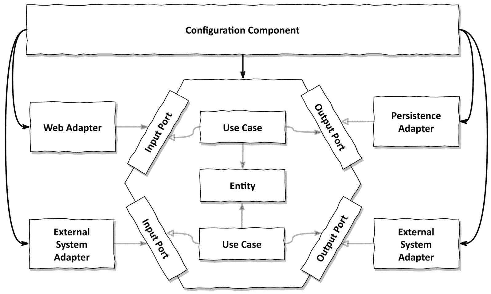
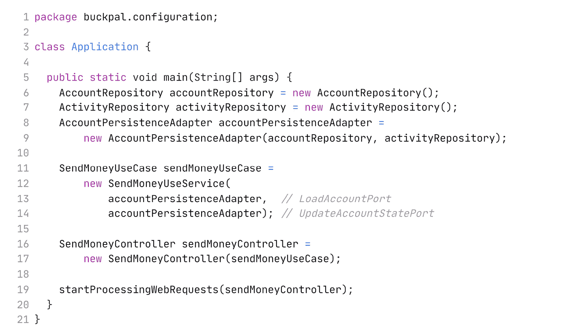
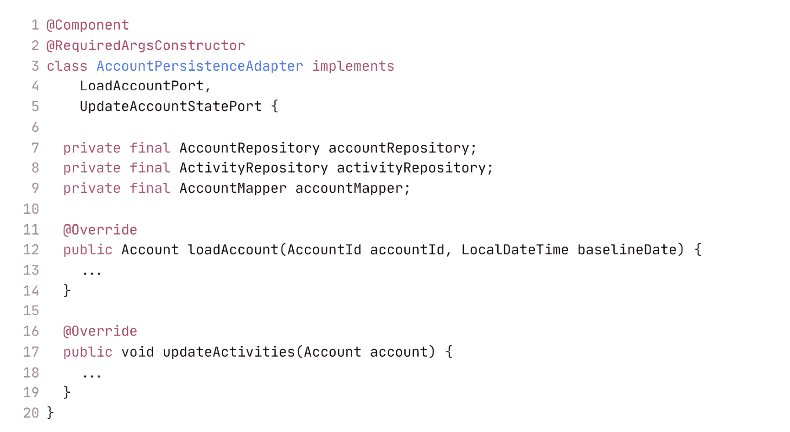
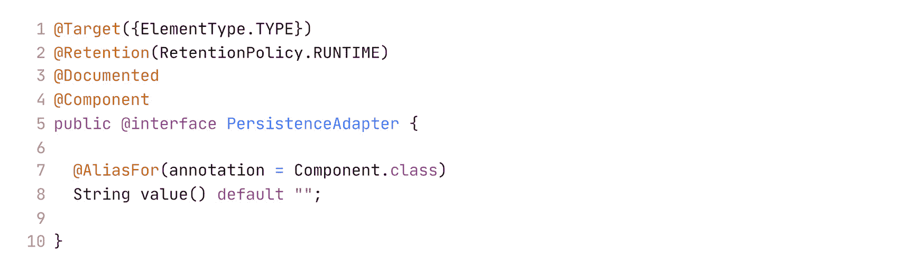
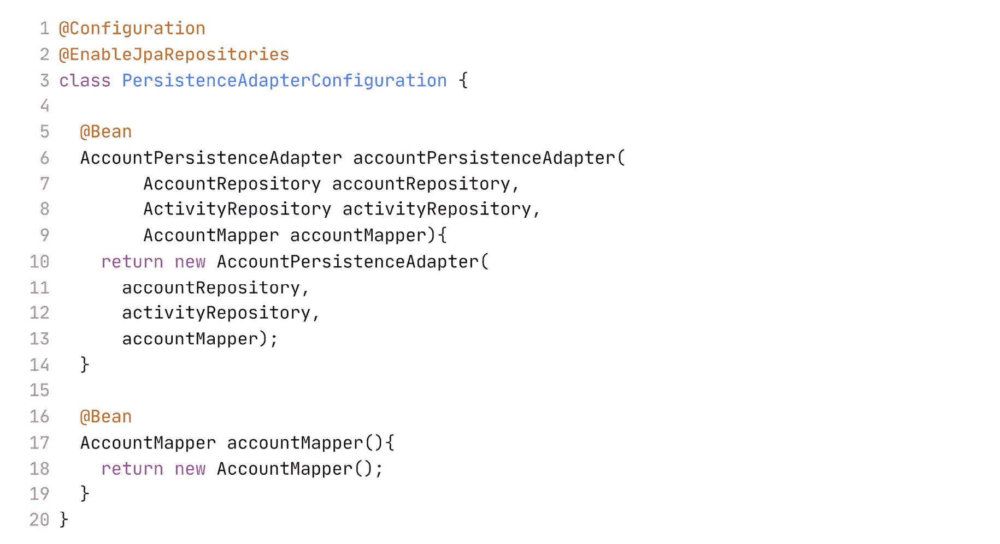

# 10

# 组装应用程序

现在我们已经实现了一些用例、Web 适配器和持久化适配器，我们需要将它们组装成一个可工作的应用程序。如*第四章*中所述，*组织代码*，我们依赖于依赖注入机制在启动时实例化我们的类并将它们连接起来。在本章中，我们将讨论一些使用纯 Java 和 Spring 以及 Spring Boot 框架来实现这一点的途径。

# 为什么甚至要关心组装？

为什么我们不在需要的时候和需要的地方实例化用例和适配器呢？因为我们希望保持代码依赖指向正确的方向。记住：所有依赖都应该指向内部，指向我们应用程序的领域代码，这样当外部层发生变化时，领域代码就不需要改变。

如果一个用例需要调用持久化适配器，并且自己实例化它，那么我们就创建了一个错误方向的代码依赖。

这就是为什么我们创建了输出端口接口。用例只知道接口，并在运行时提供了一个该接口的实现。

这种编程风格的一个很好的副作用是，我们创建的代码更容易测试。如果我们能够将一个类需要的所有对象传递给它的构造函数，我们可以选择传递模拟对象而不是真实对象，这使得为该类创建一个隔离的单元测试变得容易。

那么，谁负责创建我们的对象实例？我们如何在不违反**依赖规则**的情况下完成它？

答案是，必须有一个中立于我们架构的配置组件，并且它对所有类都有依赖关系，以便实例化它们，如图*图 10**.1*所示。

图 10.1 – 中立配置组件可以访问所有类以实例化它们

在*第三章*中引入的*反转依赖*的*整洁架构*中，这个配置组件会在最外层圆圈，可以访问所有内层，如依赖规则所定义。

配置组件负责将我们提供的各个部分组装成一个可工作的应用程序。它必须执行以下操作：

+   创建 Web 适配器实例。

+   确保 HTTP 请求实际上被路由到 Web 适配器。

+   创建用例实例。

+   提供带有用例实例的 Web 适配器。

+   创建持久化适配器实例。

+   提供带有持久化适配器实例的用例。

+   确保持久化适配器实际上可以访问数据库。

此外，配置组件应该能够访问某些配置参数的来源，例如配置文件或命令行参数。在应用程序组装期间，配置组件将这些参数传递给应用程序组件，以控制行为，例如访问哪个数据库或使用哪个服务器发送电子邮件。

这些责任很多（即：改变的原因）。我们这里不是违反了**单一职责原则**吗？是的，我们是，但如果我们想保持应用程序的其他部分干净，我们需要一个外部组件来处理连接。而这个组件必须了解所有移动部件，以便将它们组装成一个可工作的应用程序。

# 通过纯代码进行组装

实现负责组装应用程序的配置组件有几种方法。如果我们正在构建一个没有依赖注入框架支持的应用程序，我们可以使用纯代码创建这样一个组件：

这段代码片段是一个简化的示例，展示了这样一个配置组件可能的样子。在 Java 中，应用程序是从`main`方法启动的。在这个方法中，我们实例化所有需要的类，从 Web 控制器到持久化适配器，并将它们连接在一起。

最后，我们调用神秘的方法`startProcessingWebRequests()`，它通过 HTTP 公开了 Web 控制器。1 然后，应用程序就准备好处理请求了。

1 `startProcessingWebRequests()`方法只是一个占位符，用于任何必要的引导逻辑，以便通过 HTTP 公开我们的 Web 适配器。我们并不真的想自己实现它。在实际的应用程序中，一个框架会为我们做这件事。

这种纯代码方法是最基本的组装应用程序的方式。然而，它也有一些缺点：

+   首先，前面的代码是为只有一个 Web 控制器、用例和持久化适配器的应用程序编写的。想象一下，为了引导一个完整的商业应用程序，我们还需要编写多少类似的代码！

+   其次，由于我们是从它们的包外部实例化所有类的，因此这些类都必须是公开的。这意味着，例如，Java 编译器不会阻止直接访问公开的持久化适配器，因为它公开了。如果我们能通过使用包私有可见性来避免这种不想要的依赖，那将很棒。

幸运的是，有一些依赖注入框架可以为我们做脏活，同时仍然保持包私有依赖。Spring 框架目前在 Java 世界中是最受欢迎的。Spring 还提供了许多其他功能，包括 Web 和数据库支持，因此我们最终不必实现神秘的`startProcessingWebRequests()`方法。

# 通过 Spring 的类路径扫描进行组装

如果我们使用 Spring 框架来组装我们的应用程序，结果被称为 **应用程序上下文**。应用程序上下文包含构成应用程序的所有对象（在 Java 术语中称为 **bean**）。

Spring 提供了多种方法来组装应用程序上下文，每种方法都有其自身的优缺点。让我们先从最流行（也是最方便）的方法开始讨论：**类路径扫描**。

使用类路径扫描，Spring 会遍历类路径中某个片段中所有可用的类，并搜索带有 `@Component` 注解的类。框架随后会从这些类中创建对象。这些类应该有一个接受所有必需字段作为参数的构造函数，就像我们来自 *第七章**，实现* *持久化适配器* *的 `AccountPersistenceAdapter` 类一样：

在这种情况下，我们甚至没有自己编写构造函数，而是使用 Lombok 库的 `@RequiredArgsConstructor` 注解来为我们完成这项工作，该注解创建了一个接受所有 `final` 字段作为参数的构造函数。

Spring 会找到这个构造函数，并搜索带有 `@Component` 注解的、所需参数类型的类，并以类似的方式实例化它们，将它们添加到应用程序上下文中。一旦所有必需的对象都可用，它最终会调用 `AccountPersistenceAdapter` 的构造函数，并将生成的对象添加到应用程序上下文中。

类路径扫描是组装应用程序的一种非常方便的方法。我们只需要在代码库中添加一些 `@Component` 注解，并确保提供正确的构造函数。

我们也可以为 Spring 创建自己的 stereotypes 注解以便它能够识别。例如，我们可以创建一个 `@PersistenceAdapter` 注解：

这个注解通过 `@Component` 进行了元注解，以便 Spring 知道在类路径扫描期间应该选择它。现在，我们可以使用 `@PersistenceAdapter` 而不是 `@Component` 来标记我们的持久化适配器类作为应用程序的一部分。通过这个注解，我们已经使我们的架构对阅读代码的人更加明显。

然而，类路径扫描方法也有其缺点。首先，它是侵入性的，因为它要求我们在类中添加一个特定框架的注解。如果你是一个 Clean Architecture 的坚定支持者，你会说这是被禁止的，因为它将我们的代码绑定到了一个特定的框架。

我可以说，在通常的应用程序开发中，一个类上的单个注解并不是什么大问题，并且可以很容易地进行重构，如果确实需要的话。

然而，在其他上下文中，例如当为其他开发者构建库或框架时，这可能会是一个不可行的选择，因为我们不希望让我们的用户依赖于 Spring 框架。

类路径扫描方法的一个潜在缺点是可能会发生一些神奇的事情。这里的“神奇”指的是那种不良的魔法，它会导致难以解释的效果，如果你不是 Spring 专家，可能需要花费数天时间才能弄清楚。

由于类路径扫描是应用组装中一个非常钝的武器，所以会发生魔法。我们只需将 Spring 指向我们应用程序的父包，并告诉它在这个包内寻找带有`@Component`注解的类。

你能记住你应用程序中存在的每一个类吗？可能不会。肯定有一些我们实际上不希望在应用程序上下文中存在的类。也许这个类甚至以邪恶的方式操纵应用程序上下文，导致难以追踪的错误。

让我们看看另一种提供更多控制的方法。

# 通过 Spring 的 Java 配置进行组装

虽然类路径扫描是应用组装的棍棒，但 Spring 的 Java 配置是手术刀。2 这种方法与本章前面介绍的直接代码方法类似，但它更整洁，并为我们提供了一个框架，这样我们就不必手动编写所有代码。

2 棍棒与手术刀：如果你没有像我一样在角色扮演视频游戏中花费大量时间杀怪物，并且不知道什么是棍棒，那么棍棒是一种带有重锤头的棍子，可以用作武器。它是一种非常钝的武器，可以在不需要特别瞄准的情况下造成大量伤害。

在这种方法中，我们创建配置类，每个配置类负责构建一组要添加到应用程序上下文中的 bean。

例如，我们可以创建一个配置类，该类负责实例化我们所有的持久化适配器：

`@Configuration`注解将此类标记为配置类，以便 Spring 的类路径扫描器可以识别。因此，在这种情况下，我们仍然使用类路径扫描，但我们只选择我们的配置类而不是每个单个 bean，这减少了发生邪恶魔法的机会。

这些 bean 本身是在配置类的`@Bean`注解的工厂方法中创建的。在前面的例子中，我们向应用程序上下文添加了一个持久化适配器。它需要两个仓库和一个映射器作为构造函数的输入。Spring 会自动将这些对象作为输入提供给工厂方法。

但 Spring 从哪里获取仓库对象呢？如果它们是在另一个配置类的工厂方法中手动创建的，那么 Spring 会自动将这些对象作为参数提供给前面代码示例中的工厂方法。然而，在这种情况下，它们是由 Spring 本身创建的，由`@EnableJpaRepositories`注解触发。如果 Spring Boot 发现这个注解，它将自动为我们定义的所有 Spring Data 仓库接口提供实现。

如果你熟悉 Spring Boot，你可能知道我们可以在主应用程序类中添加 `@EnableJpa` **Repositories** 注解，而不是我们的自定义配置类。是的，这是可能的，但每次启动应用程序时，它都会激活 JPA 存储库，即使我们在不需要持久化的测试中启动应用程序。因此，通过将此类“功能注解”移动到单独的配置“模块”，我们变得更加灵活，可以启动应用程序的某些部分，而无需总是启动整个应用程序。

通过 `PersistenceAdapterConfiguration` 类，我们创建了一个紧密作用域的持久化模块，它实例化了我们在持久化层中需要的所有对象。当我们在仍然完全控制哪些豆类被添加到应用程序上下文的同时，它将被 Spring 的类路径扫描自动识别。

类似地，我们可以为网络适配器或应用程序层中的某些模块创建配置类。现在，我们可以创建一个包含某些模块的应用程序上下文，同时模拟其他模块的豆类，这在测试中提供了很大的灵活性。我们甚至可以将每个模块的代码推送到其自己的代码库、包或 JAR 文件中，而无需进行太多重构。

此外，这种方法不会强迫我们在代码库中到处添加 `@Component` 注解，就像类路径扫描方法那样。因此，我们可以保持应用程序层的清洁，而不依赖于 Spring 框架（或任何其他框架）。

然而，这个解决方案有一个问题。如果配置类不在创建豆类（在这种情况下是持久化适配器类）的类所在的同一包中，那些类必须是公共的。为了限制可见性，我们可以使用包作为模块边界，并在每个包中创建一个专门的配置类。这样，我们无法使用子包，正如将在*第十二章*中讨论的，*强制* *架构边界*。

# 这如何帮助我构建可维护的软件？

Spring 和 Spring Boot（以及类似的框架）提供了许多使我们的工作更轻松的功能。其中一个主要功能是从我们作为应用程序开发者提供的部分（类）组装应用程序。

类路径扫描是一个非常方便的功能。我们只需将 Spring 指向一个包，它就会从找到的类中组装一个应用程序。这允许我们快速开发，无需考虑应用程序的整体结构。

然而，一旦代码库增长，这很快就会导致缺乏透明度。我们不知道哪些豆类确切地被加载到应用程序上下文中。此外，我们无法轻松启动应用程序上下文的孤立部分以用于测试。

通过创建一个专门负责组装我们应用程序的配置组件，我们可以将应用程序代码从这个责任中解放出来（读作：“变化的原因”——记得“SOLID”中的“S”吗？）。作为回报，我们得到了高度凝聚的模块，我们可以将它们彼此独立启动，并且可以轻松地在代码库中移动。通常，这需要我们额外花费一些时间来维护这个配置组件。

我们在这章和上一章中已经讨论了很多关于如何“正确地”做事的不同选项。然而，有时“正确的方式”并不可行。在下一章中，我们将讨论捷径、我们为此付出的代价，以及何时值得采取这些捷径。
