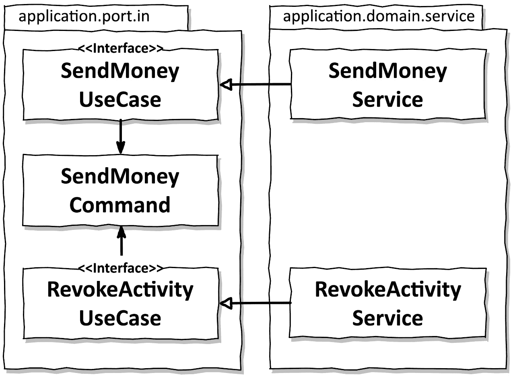

# 11

# 有意识地走捷径

在这本书的序言中，我诅咒了这样一个事实，那就是我们感觉被迫一直走捷径，积累了一大堆我们永远没有机会偿还的技术债务。

为了防止走捷径，我们必须能够识别它们。因此，本章的目标是提高人们对一些潜在捷径的认识，并讨论它们的影响。

有了这个信息，我们可以识别并修复意外的捷径。或者，如果合理的话，我们甚至可以有意选择捷径的影响。1

1 想象一下在一本关于土木工程的书或，甚至更可怕，在一本关于航空电子学的书中谈论捷径！然而，我们中的大多数人并不是在建造软件高楼大厦或飞机。软件是软的，比硬件更容易改变，所以有时（有意识地！）先走捷径，然后再修复（或永不修复）实际上是更经济的。

# 为什么捷径就像破窗

在 1969 年，心理学家*菲利普·津巴多*进行了一项实验，以测试后来被称为[**破窗** **理论**](https://www.theatlantic.com/magazine/archive/1982/03/broken-windows/304465/)**y**的理论。2

2 破窗理论：[`www.theatlantic.com/magazine/archive/1982/03/broken-windows/304465/`](https://www.theatlantic.com/magazine/archive/1982/03/broken-windows/304465/)。

他的团队在布朗克斯的一个街区停了一辆没有车牌的车，另一辆在帕洛阿尔托一个所谓的“更好”的街区。然后，他们等待。

布朗克斯的车在 24 小时内被洗劫一空，然后路人开始随意破坏它。

帕洛阿尔托的车一周内没有被触及，所以津巴多团队砸了一扇窗户。从那时起，这辆车和布朗克斯的那辆车有相似的命运，在很短的时间内被路过的行人破坏。

参与抢劫和破坏汽车的人来自所有社会阶层，包括那些在其他方面守法且行为良好的公民。

这种人类行为被称为“破窗理论”。用我自己的话说：

*一旦某物看起来破旧、损坏、[插入负面形容词]，或者总体上无人照管，人类大脑就会觉得让它变得更破旧、损坏、或者[插入负面形容词]是合理的。*

这个理论适用于生活的许多领域：

+   在一个常见的破坏行为的社区，掠夺或损坏无人照料的汽车的门槛很低。

+   当一辆车有破窗时，即使在“好”的街区，进一步破坏它的门槛也很低。

+   在一个杂乱的卧室里，把衣服扔在地上而不是放进衣柜的门槛很低。

+   在一个学生经常打断课程的教室里，向同学讲一个笑话的门槛很低。

将其应用于代码工作，意味着以下内容：

+   当在一个低质量的代码库上工作时，增加更多低质量代码的门槛很低。

+   当在一个有很多编码违规的代码库上工作时，增加另一个编码违规的门槛很低。

+   当在一个有很多捷径的代码库上工作时，增加另一个捷径的门槛很低。

考虑到所有这些，许多所谓的“遗留”代码库的质量随着时间的推移而严重下降，这真的令人惊讶吗？

# 从头开始的责任

虽然与代码打交道并不真的感觉像是抢劫一辆车，但我们所有人都在不知不觉中受到“破窗”心理的影响。这使得项目开始时尽可能干净、尽可能少地采取捷径和尽可能少的技术债务变得非常重要。这是因为，一旦出现捷径，它就会像破窗一样吸引更多的捷径。

由于软件项目通常是一项非常昂贵且持续时间长的努力，因此作为软件开发者，防止出现“破窗”现象是一项巨大的责任。我们甚至可能不是完成项目的最后一批人，其他人需要接手。对他们来说，这是一个他们还没有建立联系的遗留代码库，进一步降低了创建“破窗”现象的门槛。

然而，有时我们决定采取捷径是务实的选择，无论是由于我们正在工作的代码部分对整个项目来说并不那么重要，我们正在做原型设计，还是出于经济原因。

我们应该非常小心地记录这些有意识添加的捷径，例如，以**架构决策记录**（**ADRs**）的形式，正如*迈克尔·尼加德*在他的博客[i[n hi](http://thinkrelevance.com/blog/2011/11/15/documenting-architecture-decisions)]中提出的。3 我们应该对我们的未来自己和我们的继任者负责。如果团队中的每个成员都了解这份文档，它甚至可以减少“破窗”效应，因为团队将知道这些捷径是经过深思熟虑并且有充分的理由而采取的。

3 架构决策记录：`thinkrelevance.com/blog/2011/11/15/documenting-architecture-decisions`。

以下各节将讨论一种可以被视为本书中提出的六边形架构风格中的捷径的模式。我们将探讨这些捷径的影响以及支持或反对采取这些捷径的论点。

# 在用例之间共享模型

在*第五章*《实现用例》中，我论证了不同的用例应该有不同的**输入和输出模型**，这意味着输入参数的类型和返回值的类型应该是不同的。

*图 11.1*展示了两个用例共享相同输入模型的一个示例：

图 11.1 – 在用例之间共享输入或输出模型会导致用例之间的耦合

在这种情况下，共享的影响是`SendMoneyUseCase`和`RevokeActivityUseCase`相互耦合。如果我们对共享的`SendMoneyCommand`类中的某个部分进行更改，这两个用例都会受到影响。它们在单一责任原则（如第*3 章**，反转依赖关系*）的层面上共享一个改变的理由。如果两个用例共享相同的输出模型，情况也是如此。

如果用例在功能上是耦合的，即它们共享一定的需求，那么在用例之间共享输入和输出模型是有效的。在这种情况下，如果我们改变某些细节，我们实际上希望两个用例都受到影响。

然而，如果两个用例都应该能够独立于彼此进化，那么这是一个捷径。在这种情况下，我们应该从一开始就分离用例，即使这意味着如果它们一开始看起来相同，也需要复制输入和输出类。

因此，当围绕一个类似的概念构建多个用例时，定期询问用例是否应该独立于彼此进化是有意义的。一旦答案变成“是”，就是时候分离输入和输出模型了。

# 使用领域实体作为输入或输出模型

如果我们有一个`Account`领域实体和一个传入端口`SendMoneyUseCase`，我们可能会倾向于使用该实体作为传入端口的输入和/或输出模型，如图*11**.2*所示。

图 11.2 – 将领域实体用作用例的输入或输出模型会将领域实体耦合到用例中

传入端口依赖于领域实体。这种依赖的结果是，我们又为`Account`实体增加了一个改变的理由。

等一下，`Account`实体并不依赖于`SendMoneyUseCase`传入端口（情况相反），那么传入端口怎么能成为改变实体的原因呢？

假设我们在用例中需要一些关于账户的信息，而这些信息目前不在`Account`实体中。然而，这些信息最终不应该存储在`Account`实体中，而应该存储在不同的领域或边界上下文中。尽管如此，我们仍然倾向于向`Account`实体添加一个新字段，因为它已经在用例接口中可用。

对于简单的创建或更新用例，在用例接口中的领域实体可能就足够了，因为实体包含了我们持久化其状态在数据库中所需的确切信息。

一旦一个用例不仅仅是更新数据库中的几个字段，而是实现更复杂的领域逻辑（可能将部分领域逻辑委托给丰富的领域实体），我们就应该为用例接口使用专门的输入和输出模型，因为我们不希望用例的变化传播到领域实体。

这种快捷方式之所以危险，是因为许多用例最初只是作为一个简单的创建或更新用例开始，但随着时间的推移，它们变成了复杂的领域逻辑的怪物。这在敏捷环境中尤其如此，我们从一个最小可行产品开始，随着前进添加复杂性。因此，如果我们最初使用领域实体作为输入模型，我们必须找到在何时用独立于领域实体的专用输入模型替换它的时机。

# 跳过输入端口

虽然输出端口对于反转应用程序层和输出适配器之间的依赖关系（使依赖关系指向内部）是必要的，但我们不需要输入端口来实现依赖反转。我们可以决定让输入适配器直接访问我们的应用程序或领域服务，而不在之间使用输入端口，如图*图 12.3*所示。

图 11.3 – 没有输入端口，我们失去了对领域逻辑的清晰标记的入口点

通过移除输入端口，我们减少了输入适配器和应用程序层之间的抽象层。移除抽象层通常感觉相当不错。

然而，输入端口定义了进入我们应用程序核心的入口点。一旦我们移除了它们，我们必须更多地了解我们应用程序的内部结构，以找出我们可以调用以实现特定用例的服务方法。通过维护专门的输入端口，我们可以一眼就识别出应用程序的入口点。这使得新开发者更容易在代码库中找到方向。

保持输入端口的另一个原因是它们使我们能够轻松地强制执行架构。在第十二章“强制执行架构边界”中，我们将学习到的强制执行选项，我们可以确保输入适配器只调用输入端口，而不是应用程序服务。这使得每个进入应用程序层的入口点都是一个非常明智的决定。我们不能再意外调用一个本不应该从输入适配器调用的服务方法。

如果一个应用程序足够小，或者只有一个输入适配器，并且我们可以在不借助输入端口的情况下掌握整个控制流，我们可能希望不使用输入端口。然而，我们有多少时候可以说我们知道一个应用程序将始终保持小规模，或者在其整个生命周期中只会有一个输入适配器呢？

# 跳过服务

除了入站端口之外，对于某些用例，我们可能希望完全跳过服务层，如图*11**.4*所示。

图 11.4 – 没有服务，我们的代码库中不再有用例的表示

在这里，出站适配器中的`AccountPersistenceAdapter`类直接实现了一个入站端口，并取代了通常实现入站端口的那个服务。

对于简单的 CRUD 用例来说，这样做是非常有诱惑力的，因为在这种情况下，服务通常只将创建、更新或删除请求转发给持久化适配器，而不添加任何领域逻辑。我们可以让持久化适配器直接实现用例，而不是转发。

然而，这需要入站适配器和出站适配器之间的共享模型，在这种情况下是`Account`领域实体，因此通常意味着我们正在使用之前描述的领域模型作为输入模型。

此外，我们不再在我们的应用程序核心中有用例的表示。如果 CRUD 用例随着时间的推移变得更加复杂，由于用例已经在那里实现，因此直接将领域逻辑添加到出站适配器中是有诱惑力的。这分散了领域逻辑，使其更难找到和维护。

最后，为了防止样板式的传递服务，我们最终可能选择在简单 CRUD 用例中跳过服务。然而，然后团队应该制定明确的指南，一旦用例预期要做的事情不仅仅是创建、更新或删除实体，就立即引入服务。

# 这如何帮助我构建可维护的软件？

有时候，从经济角度来看，走捷径是有意义的。本章提供了一些关于某些捷径可能带来的后果的见解，以帮助决定是否采取这些捷径。

讨论表明，对于简单的 CRUD 用例来说，引入捷径是有诱惑力的，因为对于它们来说，实现整个架构感觉像是过度杀鸡（而且捷径并不感觉像捷径）。然而，由于所有应用程序都是从小的开始的，因此对于团队来说，在用例超出其 CRUD 状态时达成一致非常重要。只有这样，团队才能用长期更易于维护的架构替换捷径。

有些用例永远不会超出它们的 CRUD 状态。对于它们来说，永远保留捷径可能更实用，因为它们实际上并不涉及维护开销。

在任何情况下，我们都应该记录架构和选择特定捷径的原因，以便我们（或我们的继任者）可以在未来重新评估这些决定。

即使有时捷径是可以接受的，我们仍然希望有意识地做出走捷径的决定。这意味着我们应该定义一种“正确”的做事方式，并强制执行这种方式，以便在有充分理由的情况下我们可以偏离这种方式。在下一章中，我们将探讨一些强制执行我们架构的方法。
