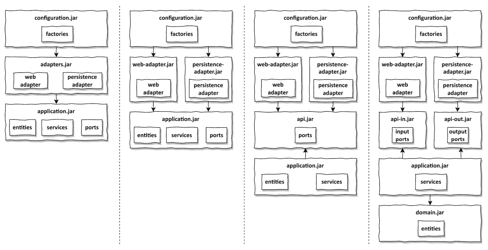

# 第十二章：强制执行架构边界

在前面的章节中，我们讨论了很多关于架构的内容，现在有一个目标架构来指导我们如何编写代码以及将其放置在哪里，感觉很好。

然而，在每一个大型软件项目中，架构往往会随着时间的推移而侵蚀。层之间的边界减弱，代码变得难以测试，我们通常需要越来越多的时间来实现新功能。

在本章中，我们将讨论我们可以采取的一些措施来强制执行架构内的边界，从而对抗架构侵蚀。

# 边界和依赖关系

在我们讨论强制执行架构边界的不同方法之前，让我们讨论架构中的边界在哪里，以及**强制执行边界**实际上意味着什么。

图 12.1 – 强制执行架构边界意味着确保依赖关系指向正确的方向（虚线箭头表示根据我们的架构不允许的依赖关系）

*图 12.1* 展示了我们的六边形架构元素可能分布在四个层次上，类似于在*第三章*中介绍的通用 Clean Architecture 方法，“反转依赖”。

最内层包含领域实体和领域服务。围绕它的应用层可以访问这些实体和服务以实现一个用例，通常是通过应用服务。适配器通过输入端口访问这些服务，或者通过输出端口被这些服务访问。最后，配置层包含创建适配器和服务对象的工厂，并将它们提供给依赖注入机制。

在前面的图中，我们的架构边界变得非常清晰。每一层与其相邻的内层和外层之间都有一个边界。根据依赖规则，跨越此类层边界的依赖关系必须始终指向内层。

本章介绍如何强制执行依赖规则。我们希望确保没有非法的依赖关系指向错误的方向（图中用虚线箭头表示）。

# 可见性修饰符

让我们从面向对象语言（特别是 Java）提供给我们强制执行边界的最基本工具开始：**可见性修饰符**。

可见性修饰符在过去几年中我进行的几乎所有入门级职位面试中都是一个话题。我会问应聘者 Java 提供了哪些可见性修饰符以及它们之间的区别是什么。

大多数受访者只列出`public`、`protected`和`private`修饰符。只有少数人知道`default`修饰符。这总是我询问一些关于为什么这样的可见性修饰符有意义的绝佳机会，以便找出受访者是否能够从他们以前的知识中抽象出来。

那么，为什么包私有修饰符如此重要呢？因为它允许我们使用 Java 包将类分组到紧密的“模块”中。此类模块内的类可以相互访问，但不能从包外部访问。然后我们可以选择将特定的类设置为公共的，作为模块的入口点。这减少了因引入指向错误方向的依赖而意外违反依赖规则的风险。

让我们再次看看*第四章*中讨论的包结构，即*组织代码*，考虑到可见性修饰符：

我们可以将`persistence`包中的类设置为包私有（在上述树中用`o`标记），因为它们不需要被外部世界访问。持久性适配器通过其实现的输出端口进行访问。出于同样的原因，我们也可以将`SendMoneyService`类设置为包私有。依赖注入机制通常使用反射来实例化类，因此即使它们是包私有的，它们仍然能够实例化这些类。

使用 Spring，这种方法只有在使用第*第十章*中讨论的类路径扫描方法时才有效，即*组装应用程序*，然而，因为其他方法要求我们自行创建这些对象的实例，这需要公共访问。

示例中的其余类必须根据我们的架构定义为公共的（用`+`标记）：`domain`包需要被其他层访问，而`application`层需要被`web`和`persistence`适配器访问。

对于只有几个类的简单模块，包私有修饰符非常出色。然而，一旦包中的类达到一定数量，那么在同一个包中有这么多类就会变得令人困惑。在这种情况下，我喜欢创建子包，以便更容易找到代码（并且，我必须承认，这满足了我的审美感）。这就是包私有修饰符无法发挥作用的地方，因为 Java 将子包视为不同的包，我们无法访问子包的包私有成员。因此，子包中的成员必须是`public`的，这样它们就会暴露给外部世界，从而使我们的架构容易受到非法依赖的影响。

# 编译后适应度函数

一旦我们在类上使用公共修饰符，编译器就会允许任何其他类使用它，即使根据我们的架构，依赖关系的方向指向错误的方向。

由于编译器在这些情况下不会帮助我们，我们必须找到其他方法来检查依赖规则没有被违反。

一种方法是引入一个**适应度函数**——一个接受我们的架构作为输入并确定其在特定方面的适应度的函数。在我们的情况下，“适应度”定义为“依赖规则*未被违反*”。

理想情况下，编译器在编译过程中为我们运行一个适应度函数，但如果没有这个功能，我们可以在代码编译后运行此函数。这种运行时检查最好在持续集成构建的自动化测试中进行。

支持此类 Java 架构适应度函数的工具是**ArchUnit**。1 除了其他功能外，ArchUnit 提供了一个 API 来检查依赖是否指向预期的方向。如果它发现违规，它将抛出一个异常。最好在基于 JUnit 等单元测试框架的测试中运行，以便在依赖违规的情况下使测试失败。

1 ArchUnit: https://github.com/TNG/ArchUnit.

使用 ArchUnit，我们现在可以检查我们各层之间的依赖关系，假设每一层都有自己的包，正如前一小节中讨论的包结构所定义的。例如，我们可以检查领域模型没有对外部任何内容的依赖：

此规则验证了*图 12*.2 中可视化的依赖规则。

图 12.2 – 我们的领域模型可能访问自身和一些库包，但它可能不能访问任何其他包中的代码，例如包含我们的适配器的包（受 https://www.archunit.org/use-cases 中的图表启发）

前述规则的问题是，如果我们使用领域模型中的某些库代码，我们必须为每个引入的依赖（例如，我在示例中用`lombok`和`java`）添加一个例外。在*第十四章*《基于组件的软件架构方法》中，我们将看到一个没有这个问题的规则。

经过一些工作，我们甚至可以在 ArchUnit API 之上创建一种**领域特定语言**（**DSL**），允许我们指定六边形架构中的所有相关包，然后自动检查这些包之间的所有依赖是否指向正确的方向：

在前面的代码示例中，我们首先指定应用程序的父包。然后我们继续指定领域、适配器、应用程序和配置层的子包。最后的`check()`调用将执行一系列检查，验证包依赖是否根据依赖规则有效。如果您想尝试这个六边形架构 DSL 的代码，它可以在 GitHub 上找到。2

2 Hexagonal Architecture DSL for ArchUnit: [`github.com/thombergs/buckpal/blob/master/src/test/java/io/reflectoring/buckpal/archunit/HexagonalArchitecture.java`](https://github.com/thombergs/buckpal/blob/master/src/test/java/io/reflectoring/buckpal/archunit/HexagonalArchitecture.java).

虽然像之前的编译后检查这样的检查可以在对抗非法依赖方面大有帮助，但它们并不是万无一失的。例如，如果我们把前面的代码示例中的包名`buckpal`拼写错误，测试将找不到任何类，因此没有发现依赖违规。一个简单的拼写错误，或者更重要的是，一个重命名包的重构，可以使整个测试变得毫无用处。我们应该努力使这些测试重构安全，或者至少在重构破坏了它们时使它们失败。在前面的例子中，当提到的某个包不存在时，例如（因为它被重命名了），我们可以使测试失败。

# 构建工件

到目前为止，我们用于在代码库内划分架构边界的唯一工具是包。我们所有的代码都一直是同一个单体构建工件的一部分。

构建工件是（希望是自动化）构建过程的结果。在 Java 世界中，目前最流行的构建工具是 Maven 和 Gradle。因此，到目前为止，假设我们只有一个 Maven 或 Gradle 构建脚本，并且我们可以调用 Maven 或 Gradle 来编译、测试和打包我们应用程序的代码到一个单一的 JAR 文件中。

构建工具的一个主要功能是依赖关系解析。为了将某个代码库转换为构建工件，构建工具首先检查代码库所依赖的所有工件是否可用。如果不可用，它尝试从工件仓库中加载它们。如果这失败了，构建将在尝试编译代码之前因为错误而失败。

我们可以利用这一点来强制执行架构模块和层之间的依赖关系（以及因此强制执行边界）。对于这样的每个模块或层，我们创建一个独立的构建模块，它有自己的代码库和自己的构建工件（JAR 文件）作为结果。在每个模块的构建脚本中，我们只指定那些根据我们的架构允许的其他模块的依赖关系。开发者不能再无意中创建非法依赖，因为类甚至不在类路径上，他们将会遇到编译错误。

图 12.3 – 将我们的架构划分为多个构建工件的不同方式以禁止非法依赖

*图 12**.3* 展示了将我们的架构划分为单独构建工件的不完整选项集。

从左侧开始，我们看到一个基本的三个模块构建，包括配置、适配器和应用层的独立构建工件。`配置`模块可以访问`适配器`模块，而`适配器`模块又可以访问`应用`模块。由于它们之间存在隐式的传递依赖，`配置`模块也可以访问`应用`模块。`适配器`模块包含`web`适配器和`持久化`适配器。这意味着构建工具不会禁止这些适配器之间的依赖关系。虽然根据依赖规则，这些适配器之间的依赖关系并不是严格禁止的（因为这两个适配器都在同一个外部层中），但在大多数情况下，保持适配器相互隔离是明智的。毕竟，我们通常不希望持久化层的变化泄露到网络层，反之亦然（记住单一职责原则！）。同样的原则也适用于其他类型的适配器，例如连接我们的应用程序到某个第三方 API 的适配器。我们不希望通过在适配器之间添加意外的依赖关系，让该 API 的细节泄露到其他适配器中。

因此，我们可以将单个适配器模块拆分为多个构建模块，每个适配器一个，如*图 12**.3*的第二列所示。

接下来，我们还可以决定进一步拆分应用模块。它目前包含传入和传出端口到我们的应用程序，实现或使用这些端口的业务逻辑，以及应该包含大部分领域逻辑的领域实体。

如果我们决定我们的领域实体不应用于我们的端口内作为传输对象（即，我们希望禁止从*第九章*，*边界之间的映射*）中提到的*无映射*策略），我们可以应用依赖倒置原则，并拉出一个单独的`api`模块，该模块只包含端口接口（*图 12**.3*中的第三列）。`适配器`模块和`应用`模块可以访问`api`模块，但反之则不行。`api`模块无法访问领域实体，也不能在端口接口中使用它们。此外，适配器也不再直接访问实体和服务，因此它们必须通过端口进行访问。

我们甚至可以更进一步，将`api`模块拆分为两个部分，一部分只包含传入端口，另一部分只包含传出端口（*图 12**.3*中的第四列）。这样，我们通过仅在输入或传出端口上声明依赖关系，就可以清楚地表明某个适配器是传入适配器还是传出适配器。

此外，我们甚至可以将应用程序模块进一步拆分，创建一个只包含服务的模块，另一个只包含领域模型。这确保了领域模型不会访问服务，并且它允许其他应用程序（具有不同的用例和因此不同的服务）通过简单地声明对领域构建实体的依赖来使用相同的领域模型。

*图 12**.3* 展示了将应用程序划分为构建模块的许多不同方法，当然，图中所描述的不仅仅是四种方法。关键是，我们划分的模块越细，我们就能越强有力地控制它们之间的依赖关系。然而，划分得越细，我们之间就需要进行更多的映射，强制执行在 *第九章* 中介绍的一种映射策略，即 *边界之间的映射*。

此外，使用构建模块来划分架构边界与使用简单的包作为边界相比，具有许多优势：

1.  首先，构建工具绝对讨厌循环依赖。循环依赖很糟糕，因为循环内某个模块的更改可能会意味着循环内所有其他模块的更改，这违反了单一职责原则。构建工具不允许循环依赖，因为它们在尝试解决它们时会陷入无限循环。因此，我们可以确信我们的构建模块之间没有循环依赖。

与此相反，Java 编译器根本不在乎两个或更多包之间是否存在循环依赖。

1.  第二，构建模块允许在某些模块内进行独立的代码更改，而无需考虑其他模块。想象一下，如果我们必须在应用程序层进行重大重构，这会导致某个适配器暂时出现编译错误。如果适配器和应用程序层在同一个构建模块中，一些 IDE 会坚持要求在我们可以运行应用程序层的测试之前，必须修复适配器中的所有编译错误，即使测试不需要适配器来编译。然而，如果应用程序层在其自己的构建模块中，IDE 就不会关心适配器，我们可以随意运行应用程序层的测试。对于使用 Maven 或 Gradle 运行构建过程来说，也是如此：如果两个层都在同一个构建模块中，构建会因为任一层的编译错误而失败。

因此，多个构建模块允许每个模块进行独立的更改。我们甚至可以选择将每个模块放入其自己的代码仓库中，允许不同的团队维护不同的模块。

1.  最后，在构建脚本中明确声明每个模块间的依赖关系后，添加新依赖关系就变成了一种有意识的行为，而不是意外。一个需要访问他们目前无法访问的类的开发者，在将其添加到构建脚本之前，可能会对依赖关系是否真正合理这个问题进行一些思考。

这些优势伴随着维护构建脚本的额外成本，因此，在将其拆分为不同的构建模块之前，架构应该相对稳定。

此外，构建模块随着时间的推移往往不太灵活。一旦选择，我们往往会坚持最初定义的模块。如果模块的切割一开始就不正确，由于重构的额外努力，我们不太可能后来纠正它。当所有代码都位于单个构建模块内时，重构更容易。

# 这如何帮助我构建可维护的软件？

软件架构基本上是关于管理架构元素之间的依赖关系。如果依赖关系变得一团糟，架构也会变得一团糟。

因此，为了随着时间的推移保持架构，我们需要不断确保依赖关系指向正确的方向。

在生成新代码或重构现有代码时，我们应该牢记包结构，并在可能的情况下使用包私有可见性，以避免对不应从包外部访问的类产生依赖。

如果我们需要在单个构建模块内强制执行架构边界，并且包私有修饰符不起作用，因为包结构不允许这样做，我们可以利用后编译工具，如 ArchUnit。

每当我们觉得架构足够稳定时，我们应该将架构元素提取到它们自己的构建模块中，因为这提供了对依赖关系的明确控制。

这三种方法可以结合起来强制执行架构边界，从而随着时间的推移保持代码库的可维护性。

在下一章中，我们将继续探讨架构边界，但从一个不同的角度：我们将思考如何在同一应用程序中管理多个领域（或边界上下文），同时保持它们之间的界限清晰。
