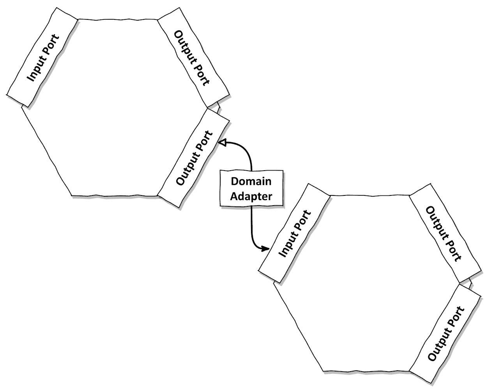
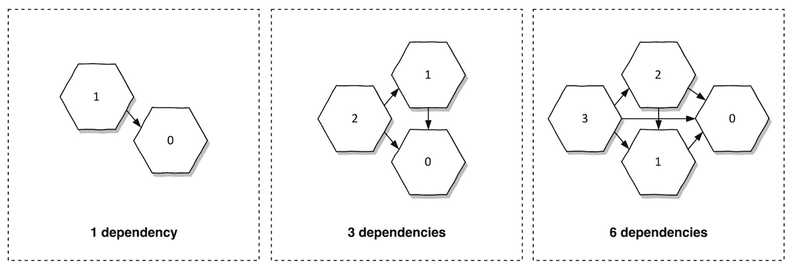
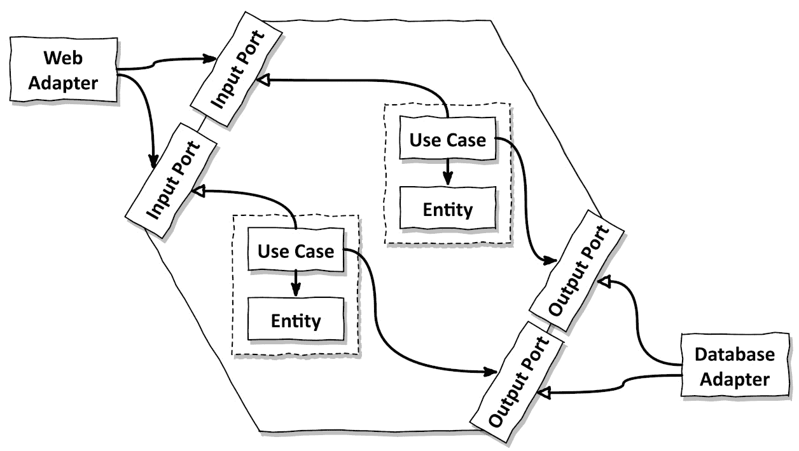
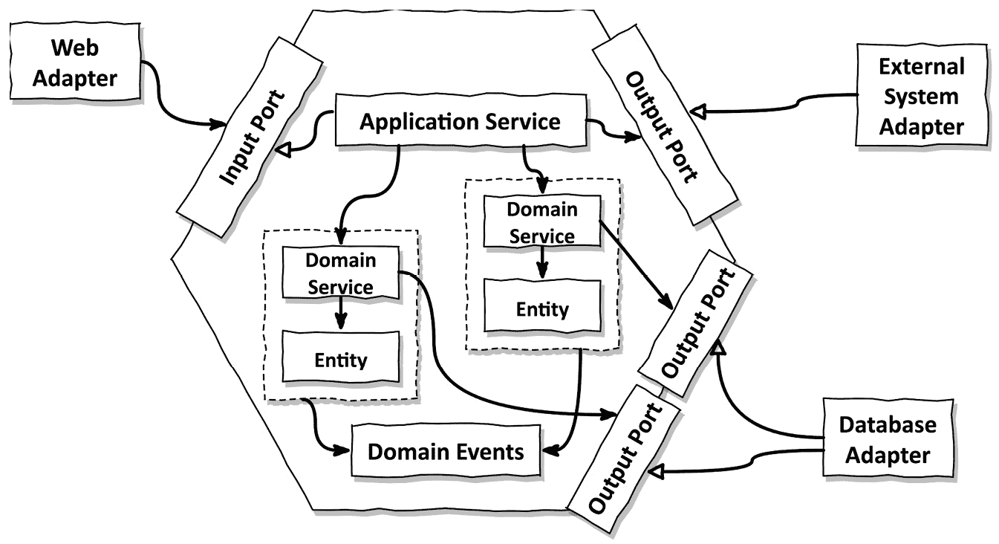

# 13

# 管理多个边界上下文

许多应用程序由多个领域组成，或者，按照领域驱动设计的语言来说，由多个边界上下文组成。术语“**边界上下文**”告诉我们，不同领域之间应该有边界。如果我们不同领域之间没有边界，那么这些领域中的类之间的依赖关系将没有限制。最终，领域之间的依赖关系会增长，将它们耦合在一起。这种耦合意味着领域不能再独立地进化，而只能一起进化。我们最初甚至可以不把代码分成不同的领域！

将代码分离到不同的领域中的整个原因是为了让这些领域能够独立进化。这是对第三章“反转依赖”中讨论的单一职责原则的应用。不过，这次我们不是在谈论单个类的职责，而是在谈论构成边界上下文的一组类的职责。如果一个边界上下文的职责发生变化，我们不希望改变其他边界上下文的代码！

管理边界上下文，即保持它们之间的边界清晰，是软件工程的主要挑战之一。许多开发者与所谓的“遗留软件”相关的痛苦都源于边界不明确。而且，事实证明，软件不需要很长时间就会变成“遗留”。

因此，不出所料（至少在回顾时是这样），这本书第一版的许多读者问我如何使用六边形架构管理多个边界上下文。不幸的是，答案并不简单。就像经常发生的那样，有几种方法可以做到这一点，而且它们本身并没有对错之分。让我们讨论一些分离边界上下文的方法。

# 每个边界上下文一个六边形？

当与六边形架构和多个边界上下文一起工作时，我们的本能是为每个边界上下文创建一个单独的“六边形”。结果看起来就像 *图 13.1*。

图 13.1 – 如果每个边界上下文都作为自己的六边形实现，我们需要为边界上下文之间的每条通信线路提供一个输出端口、一个适配器和输入端口

每个边界上下文都生活在自己的六边形中，提供输入端口以与之交互，并使用输出端口与外界交互。

理想情况下，边界上下文之间根本不需要相互通信，因此两者之间没有任何依赖关系。然而，在现实世界中，这种情况很少见。让我们假设左侧的边界上下文需要调用右侧边界上下文的一些功能。

如果我们使用六边形架构提供的架构元素，我们在第一个限制上下文中添加一个输出端口，在第二个限制上下文中添加一个输入端口。然后，我们创建一个适配器，该适配器实现输出端口，进行任何必要的映射，并调用第二个限制上下文的输入端口。

问题解决，对吧？

事实上，在纸上这看起来是一个非常干净的解决方案。限制上下文之间被最优地分隔开来。它们之间的依赖关系以端口和适配器的形式清晰地结构化。新的限制上下文之间的依赖关系需要我们明确地将它们添加到现有的端口中，或者添加一个新的端口。由于创建这种依赖关系涉及许多仪式，因此依赖关系不太可能“意外”地出现。

然而，如果我们进一步思考，除了两个限制上下文之外，这种架构的扩展性并不好。对于具有一个依赖关系的两个限制上下文，我们需要实现一个适配器（如图中名为 *领域适配器* 的框所示）。如果我们排除了循环依赖，我们可能需要为三个限制上下文实现三个适配器，为四个限制上下文实现六个适配器，依此类推，如图 *图 13.2* 所示。1

1 我用来计算 *n* 个限制上下文之间潜在依赖关系的公式是 *n-1 + n-2 + ... + 1*。第一个限制上下文有 *n-1* 个潜在的、非循环的依赖关系，第二个有 *n-2*，依此类推。最后一个限制上下文不能依赖于另一个限制上下文，因为它的每个依赖关系都会是一个循环依赖，而我们不想允许循环依赖。

图 13.2 – 即使排除了循环依赖，限制上下文之间的潜在依赖关系数量与限制上下文数量不成比例增长

对于每个依赖关系，我们可能需要实现一个至少包含一个相关输入和输出端口的适配器。每个适配器都必须从一个领域模型映射到另一个领域模型。这很快就会变成一个开发和维护的繁琐工作。如果这是一个繁琐的工作，并且所需的努力超过了它带来的价值，团队将采取捷径来避免它，结果是一个乍一看像六边形架构但缺乏其承诺的架构。

如果我们查看介绍六边形架构的原始文章，六边形架构的意图从来不是在端口和适配器中封装单个限制上下文。2 相反，其意图是封装一个 *应用程序*。这个应用程序可能由许多限制上下文组成，也可能没有任何限制上下文。

2 关于六边形架构的原始文章：[`alistair.cockburn.us/hexagonal-architecture/`](https://alistair.cockburn.us/hexagonal-architecture/).

当我们准备将它们提取到它们自己的应用程序（即它们自己的（微）服务）中时，将每个边界上下文包裹在其自己的六边形中是有意义的。这意味着我们应该非常确定我们放置在他们之间的边界是正确的边界，我们不期望它们会改变。

这里的要点是，六边形架构并不提供一种可扩展的解决方案来管理同一应用程序中的多个边界上下文。它不必这样做。我们可以从领域驱动设计中汲取灵感，以解耦我们的边界上下文，因为在六边形内部，我们可以做我们喜欢的事情。

# 解耦的边界上下文

在上一节中，我们了解到端口和适配器应该封装整个应用程序，而不是单独封装每个边界上下文。那么，我们如何保持边界上下文之间的分离呢？

在简单的情况下，我们可能会有不相互通信的边界上下文。它们通过代码提供完全独立的路径。在这种情况下，我们可以为每个边界上下文构建专门的输入和输出端口，就像在*图 13.3*中所示。

图 13.3 – 如果边界上下文（虚线）之间不需要相互通信，每个上下文都可以实现自己的输入端口并调用自己的输出端口

这个例子展示了一个具有两个边界上下文的六边形架构。网络适配器驱动应用程序，而数据库适配器由应用程序驱动。这些适配器代表任何其他输入和输出适配器 – 并非每个应用程序都是具有数据库的 Web 应用程序。

每个边界上下文通过一个或多个专门的输入端口公开其自己的用例。网络适配器知道所有输入端口，因此可以调用所有边界上下文的功能。

除了为我们的每个边界上下文设置专门的输入端口外，我们还可以实现一个“广泛”的输入端口，通过该端口网络适配器将请求路由到多个边界上下文。在这种情况下，上下文之间的边界将对外部我们的六边形隐藏。这可能是或可能不是根据情况而定的。

此外，每个边界上下文定义自己的输出端口到数据库，以便它可以独立于任何其他边界上下文存储和检索其数据。

虽然按边界上下文分割输入端口是可选的，但我强烈建议将存储和检索特定边界上下文领域数据的输出端口与其他边界上下文分开。如果一个边界上下文关注金融交易，而另一个关注用户注册，那么应该有一个（或多个）输出端口专门用于存储和检索交易数据，另一个则专门用于存储和检索注册数据。

每个边界上下文都应该有自己的持久化存储。如果边界上下文共享输出端口来存储和检索数据，它们会很快变得紧密耦合，因为它们都依赖于相同的数据模型。想象一下，如果我们需要将一个边界上下文从六边形应用中提取出来，成为一个独立的微服务，因为我们了解到它与其他应用的其他部分有不同的可扩展性要求。如果这个边界上下文与另一个边界上下文共享数据库模型，那么提取就会变得非常困难。我们不想让新的微服务触及另一个应用的数据库，对吧？出于同样的原因，我们希望保持每个边界上下文的数据库模型独立。

只要多个边界上下文在同一个运行时中执行，它们可能共享一个物理数据库并参与相同的数据库事务。但在那个数据库中，不同边界上下文的数据之间应该有清晰的边界，例如，以单独的数据库模式的形式，或者至少不同的数据库表。

将输入和输出端口这样分开，会有一个很好的效果，那就是边界上下文之间完全解耦。每个边界上下文都可以独立发展，而不会以任何方式影响其他上下文。但它们之所以解耦，仅仅是因为它们没有相互交流。如果我们有跨越多个边界上下文的使用案例，或者如果一个边界上下文需要与另一个上下文交流，会怎样呢？

# 适当地耦合的边界上下文

如果所有耦合都可以避免，软件架构将会容易得多。在现实世界的应用中，一个边界上下文很可能需要另一个边界上下文的支持来完成其工作。

举个例子，又是我们那个关注货币交易的边界上下文。出于安全考虑，我们希望记录哪个用户发起了一笔交易。这意味着我们的边界上下文需要一些关于用户的信息，这些信息存在于另一个边界上下文中。但我们的边界上下文不需要与用户管理上下文紧密耦合。

在我们的“事务管理”边界上下文中，不必知道整个用户对象，可能只需要知道用户的 ID。虽然“注册”上下文中的用户对象是一个具有许多属性的复杂对象，但在事务上下文中，用户的表示可能只是用户 ID 的包装。在 *发送金钱* 使用案例中，我们现在可以仅接受执行事务的用户 ID 作为输入，并将其记录下来。我们不需要将事务上下文耦合到用户的所有其他细节。

但我们可能希望验证用户没有被阻止进行交易。在这种情况下，我们可以使用领域事件。3 当用户管理上下文中用户的状态发生变化时，我们触发一个可以被其他边界上下文接收的领域事件。例如，我们的交易上下文可能会监听当用户新注册或被阻止时的事件。然后它可以将其存储在自己的数据库中，以便在 *发送金钱* 使用案例中稍后用于验证用户的状态。

3 领域驱动设计中的事件：Vaughn Vernon 著的《领域驱动设计》实施，Pearson，2013，*第八章*。

另一个可能的解决方案是在用户管理和事务上下文之间引入一个应用服务作为协调者。4 应用服务实现了 *发送金钱* 输入端口。当被调用时，它首先向用户管理边界上下文询问用户的状态，然后将状态传递给由事务上下文提供的 *发送金钱* 使用案例 – 一种不同的实现，但效果与使用领域事件时相同。

4 领域驱动设计中的应用服务：Vaughn Vernon 著的《领域驱动设计》实施，Pearson，2013，*第十四章*。

这些只是如何“适当地”耦合边界上下文的两个例子。如果您还没有这样做，我建议您阅读领域驱动设计的文献以获得灵感。

回到六边形架构，适当地耦合多个边界上下文可能看起来像 *图 13.4*。4。

图 13.4 – 如果我们有多边界上下文跨越的使用案例，我们可以引入一个应用服务来协调和领域事件，以便在上下文之间共享信息

我们已经引入了一个应用程序服务作为我们有限上下文之上的协调者。现在，输入端口由这个服务而不是由有限上下文本身实现。应用程序服务可以调用输出端口从其他系统获取所需信息，然后调用有限上下文提供的域服务之一或多个。除了协调对有限上下文的调用外，应用程序服务还充当**事务边界**，这样我们就可以在同一个数据库事务中调用多个域服务，例如。

有限上下文内的领域服务仍然使用它们自己的数据库输出端口来保持有限上下文之间的数据模型分离。我们可能会决定这种分离不是必要的，并使用单个数据库输出端口代替（但我们应该意识到共享数据模型会导致非常紧密的耦合）。

有限上下文可以访问一组共享的领域事件，它们可以分别发出和监听，以松散耦合的方式交换信息。

# 这如何帮助我构建可维护的软件？

管理领域之间的边界是软件开发中最困难的部分之一。在一个小的代码库中，边界可能不是必要的，因为整个代码库的心理模型仍然适合我们的大脑工作记忆。但是，一旦代码库达到一定规模，我们应该确保在领域之间引入边界，这样我们就可以单独推理每个领域。如果我们不这样做，依赖关系就会悄悄进入，使我们的代码库变成那些令人讨厌的“大泥球”之一。

六边形架构主要关注管理应用程序与外部世界之间的边界。这个边界由应用程序提供的某些输入端口和应用程序期望的某些输出端口组成。

六边形架构并不能帮助我们管理应用程序内部更细粒度的边界。在我们的“六边形”内部，我们可以做任何我们想做的事情。如果代码库太大，超出了我们的工作记忆，我们应该退回到领域驱动设计或其他概念，在代码库内部创建边界。

在下一章中，我们将探讨一种轻量级的方法来创建边界，我们可以使用或不用六边形架构。
