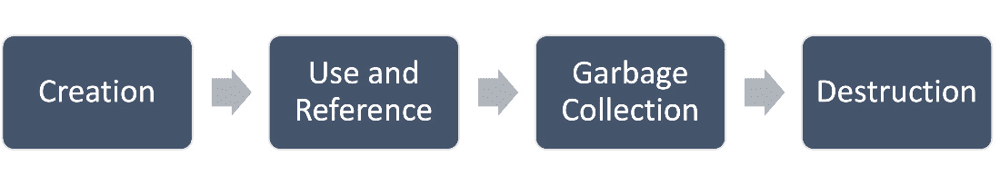

# 第六章：战略性对象创建和不可变性

本章继续我们的寻找方法，以从我们的 Java 应用程序中获得最佳性能。创建对象是所有 Java 应用程序的核心部分，因此目标不是消除它；而是采取战略性的对象创建方法。

我们如何以及何时创建对象可能在应用程序性能中扮演关键角色。对象创建不仅影响性能，还影响整体效率、垃圾回收和内存使用。本章旨在为您提供实现对象创建策略所需的知识和技能。

对象创建策略的核心部分是对象不可变性的概念。本章提供了如何使对象不可变的信息和示例，并解释了为什么你应该考虑这一点。

本章涵盖了以下主要主题：

+   最小化对象创建

+   对象不可变性

+   垃圾回收

+   设计模式

到本章结束时，你应该对战略性对象创建和对象不可变性的强大概念有一个理解和欣赏。这种理解将帮助你提高 Java 应用程序的性能。

# 技术要求

要遵循本章中的示例和说明，你需要能够加载、编辑和运行 Java 代码。如果你还没有设置你的开发环境，请参阅*第一章*。

本章的代码可以在以下位置找到：[`github.com/PacktPublishing/High-Performance-with-Java/tree/main/Chapter06`](https://github.com/PacktPublishing/High-Performance-with-Java/tree/main/Chapter06)。

# 最小化对象创建

在追求高性能应用程序时，最小化对象创建是一个关键关注点。每次我们创建一个对象，我们都会使用内存和处理资源。尽管现代系统拥有令人印象深刻的内存容量和处理能力，但它们并非无限。

为了确保我们正确处理这个关注点，我们应该寻求理解 Java 对象的整个生命周期，对象创建如何影响内存，以及对象池是什么。我们还应该尝试不同的对象初始化方法和减少系统开销的方法。这就是本节的目标。让我们通过查看 Java 对象的整个生命周期来开始我们最小化对象创建的探索。

## Java 对象生命周期

Java 编程语言中对象的概念并非新颖。在考虑高性能 Java 应用程序时，我们需要考虑我们对象的整个生命周期。对象的创建、使用和删除直接影响到我们应用程序的整体性能。以下图展示了典型对象的典型生命周期：



图 6.1 – Java 对象生命周期

如*图 6**.1 所示，对象生命周期的第一步是对象创建。当创建一个新对象时，它被称为使用`new`关键字在堆上分配内存，以便我们可以存储对象的数据：

```java
public class Corgi {
  // Instance variables
  private String name;
  private int age;
  private int weight;
  // Constructor
  public Corgi(String name, int age, int weight) {
    this.name = name;
    this.age = age;
    this.weight = weight;
  }
  // Getter methods
  // Setter methods
  // Methods
}
```

对象生命周期的下一阶段是其使用和引用。这是执行对象方法并引用其属性的地方。

第三个阶段是垃圾回收。一旦我们停止使用一个对象，并且它不能再被引用，Java 虚拟机（**JVM**）的垃圾回收器将回收该对象使用的内存。

对象生命周期的最后阶段是它被销毁。垃圾回收器为我们处理这个问题。一旦对象被销毁，它就不再对应用程序可访问。

理解对象的生命周期是能够创建和采用对象创建策略的先决条件。

## 内存

我们隐含地理解到，对象的存在需要内存，并且我们的应用程序在某一时刻使用的对象越多，所需的内存就越多。为了支持高性能，我们应该努力理解 Java 如何管理特定于对象创建的内存。为了帮助我们的理解，让我们看看三个关键点。

### 栈与堆内存

**栈**和**堆**都用于内存分配，用于不同的目的，并且表现不同。让我们首先定义栈。

栈

栈是内存区域，其中使用**后进先出**（**LIFO**）模型存储静态元素集合。

接下来，让我们看看堆是什么，以便我们可以将其与栈进行比较，并确定它们如何影响性能。

堆

堆是用于动态内存分配的内存区域。当我们使用应用程序中的`new`关键字时，对象在堆上分配。

Java 使用栈和堆，正如你所学的，它们的使用方式不同。让我们更深入地了解栈。我们通常使用栈来存储应用程序的局部变量，以及方法引用信息。栈使用**LIFO**以高效访问局部变量和方法调用。栈的限制因素包括其有限的生命周期和大小。这使得使用栈进行长期对象存储不切实际。

当我们使用 Java 的`new`关键字时，我们将对象推入堆中。堆为我们提供动态内存分配。当我们使用堆时，我们的对象可以存在于创建它们的方法的范围之外。这需要使用 JVM 的垃圾回收器从堆中移除不可达的项。

下表总结了 Java 中栈和堆之间的差异：

| **特征** | **栈** | **堆** |
| --- | --- | --- |
| 存储 | 局部变量 | 对象及其方法和属性 |
| 内存管理 | LIFO 顺序 | 由 JVM 垃圾回收器管理 |
| 大小 | 有限 | 大于栈 |
| 生命周期 | 变量存在直到声明它的方法结束 | 对象存在直到它们不再可达 |
| 性能 | 快速分配和释放 | 比栈慢 |

表 6.1 – 栈和堆比较

栈和堆之间的关键区别在于它们的使用范围、内存管理方式、访问速度和存储大小。此外，还有运行时出错的风险。例如，栈可能会耗尽内存，导致`StackOverflowError`错误。如果堆耗尽内存，可能会抛出`OutOfMemoryError`错误。我们需要处理这些错误。让我们看一个例子：

```java
public static void main(String[] args) {
  // Catch StackOverflowError
  try {
    // your code goes here
  } catch (StackOverflowError e) {
    System.out.println("Caught StackOverflowError");
  }
  // Catch OutOfMemoryError
  try {
    // your code goes here
  } catch (OutOfMemoryError e) {
    System.out.println("Caught OutOfMemoryError");
  }
}
```

正如你所见，我们使用了`try`-`catch`块来捕获错误。此外，重要的是要知道这些错误是`Error`的实例，而不是`Exception`。因此，这些确实是错误，而不是异常。

### 垃圾回收的内存管理

Java 编程语言中最受推崇的特性之一是其**垃圾回收**。这种自动内存释放可以减轻开发者的许多负担，但也有一些缺点。让我们更深入地了解一下 Java 看似简单的垃圾回收机制。

Java 的垃圾回收器识别应用中不再可达的对象。一旦识别，这些对象将被移除，它们所使用的内存将被释放，使其可用于应用。

虽然我们可以赞扬垃圾回收器的努力，并感激它为我们的应用释放的内存，但它可能会对性能产生影响。当我们有频繁的垃圾回收周期时，运行时可能会引入暂停和响应速度降低。缓解策略包括最小化对象创建和及时处理对象。这些策略可以减少垃圾回收的频率。

我们将在本章后面讨论如何实现这些策略。

### 优化技术

我们可以采用几种策略来帮助优化 Java 应用程序中的内存使用：

+   限制对象创建；仅在绝对需要时创建

+   避免在循环中创建对象

+   使用局部变量和对象池（见*第四章*）

+   实现对象不可变性（本章后面的*对象不可变性*部分将介绍）

+   使用性能分析工具来监控内存使用（见*第十四章*）

在我们的 Java 应用程序中进行内存管理时，采取有目的和了解的方法是很重要的。为此，我们需要了解内存限制以及内存是如何分配和释放的。

## 对象池

如您可能从*第四章*中回忆起，对象池是我们可以使用的重要设计模式，用于创建一组可以保存在池中、随时可供使用的对象，而不是在我们需要时分配它们，在它们超出作用域时释放它们。对象池通过重用对象帮助我们有效地管理系统资源。当我们的对象很大且创建需要花费大量时间时，这种方法的优点尤为明显。

## 初始化方法

在 Java 中创建对象有多种方式，我们的初始化方法可以显著影响 Java 应用程序的整体性能以及内存的使用方式。让我们看看四种方法：直接、懒加载、对象池和构建器。

### 直接初始化

创建新对象最常用的方法是**直接初始化**方法。如下面的示例所示，这种方法很简单。我们使用构造函数或初始化器来实现这种方法：

```java
Corgi myCorgi = new Corgi("Java", 3);
```

这种方法的优点是易于理解和编程。它也可以用于许多需要创建对象的场景。这种方法的缺点包括可能导致不必要的对象创建，这与我们最小化对象创建的目标相反。这在使用直接初始化方法在循环或频繁调用的方法中尤为明显。另一个缺点是使用这种方法创建的对象不能被重用。

### 懒加载初始化

将对象的创建推迟到应用程序需要时的策略被称为**懒加载初始化**。如下面的代码片段所示，除非存在特定条件，否则对象不会被创建：

```java
Corgi myCorgi = null; // Initialize to null
// ...
if (someCondition) {
    myCorgi = new Corgi("Java", 3); // Create the object when needed
}
```

这种方法的优点是对象创建直到需要时才最小化。此外，当我们有条件地创建多个对象时，内存使用量会减少。然而，这种策略会导致代码复杂性增加，并且在处理多线程环境时可能会引入同步问题。

### 对象池

我们还可以使用对象池来创建一个预初始化的对象池，这些对象可以多次使用，根据需要从池中取出并返回。以下代码片段显示了这种代码的结构：

```java
ObjectPool<Corgi> corgiPool = new ObjectPool<>(Corgi::new, 10); // Create a pool of 10 Corgi objects
// ...
Corgi myCorgi = corgiPool.acquire(); // Get obj from pool
// ...
corgiPool.release(myCorgi); // Release obj to the pool
```

您可以回顾*第四章*以获取关于对象池的更多详细信息。

### 构建器模式

另一种越来越受欢迎的对象创建方法是使用构建器模式。这是一种将对象构建和其表示分别处理的设计模式。这种方法使我们能够逐步创建多属性对象。以下代码片段说明了构建器模式的概念：

```java
CorgiBuilder builder = new CorgiBuilder();
builder.setName("Java");
builder.setAge(3);
Corgi myCorgi = builder.build();
```

这种方法的优点之一是它引入了对象构造的灵活性。这在创建复杂对象时非常有用。另一个优点是它允许我们通过具有复杂构造函数来设置选定的属性。构建者模式方法的缺点之一是我们必须为应用程序中使用的每种类型的对象定义一个单独的构建器类。这可能会显著增加我们代码的复杂性，并降低其可读性和可维护性。

## 开销减少

当我们考虑最小化对象创建的目标时，我们应该考虑对象池、对象克隆和对象序列化。我们在本章前面提到了对象池，并在*第四章*中提供了深入探讨。我们将把关于对象克隆的讨论留到本章的后面。现在，知道它可以与开销减少相关。

第三个概念是对象序列化。幸运的是，Java 允许我们将对象转换为二进制形式，也可以从二进制形式转换回对象。我们通常使用它进行对象持久化，也可以用它来创建具有减少开销的对象副本。

这里有一个例子，说明我们如何序列化（转换为二进制）和反序列化（转换回对象）：

```java
// Serialize the object
ByteArrayOutputStream outputStream = new ByteArrayOutputStream();
ObjectOutputStream objectOutputStream = new ObjectOutputStream(outputStream);
objectOutputStream.writeObject(originalCorgi);
// Deserialize the object
ByteArrayInputStream inputStream = new ByteArrayInputStream(outputStream.toByteArray());
ObjectInputStream objectInputStream = new ObjectInputStream(inputStream);
Corgi clonedCorgi = (Corgi) objectInputStream.readObject();
```

在创建对象时减少开销应该是我们期望应用程序具有高性能时的一个关键考虑因素。

# 对象不可变性

让我们继续学习如何最小化对象创建，以提高我们的 Java 应用程序的性能。**对象不可变性**指的是一旦实例化后就不能被修改的对象。不可变性可以被视为对象的属性或特征。使对象**不可变**的优点包括系统可预测性和性能。

让我们从对象不可变性的简要概述开始。

## 不可变性概述

对象不可变性不是一个新概念，但它是非常重要的。一般前提是我们创建一个具有所有期望的属性和行为的对象，然后在整个对象的生命周期中防止它被**修改**（改变）。

不可变对象被认为是安全的，因为它们不能被改变。这意味着我们可以在多线程环境中共享这些对象，而不需要同步。因此，并发编程得到了简化。你将在*第九章*中了解更多关于并发的内容。

已知不可变对象具有不可变状态、安全共享、可预测的行为，并与函数式编程原则一致。

## 最佳实践

创建不可变对象不仅仅是设置一个属性；它需要遵循某些最佳实践。我们希望我们的不可变对象是健壮的，代码是可维护的，并且对应用程序的整体性能有积极贡献。

理解这些最佳实践对于正确实施至关重要。

### 声明为 final

创建不可变对象的第一项最佳实践是确保所有属性都声明为`final`。以下代码展示了如何将类声明为`final`，以及两个变量：

```java
public final class ImmutableExample1 {
    private final int value;
    private final String text;
    public ImmutableExample1(int value, String text) {
        this.value = value;
        this.text = text;
    }
    // Getter methods...
}
```

遵循这项最佳实践可以确保一旦对象创建，其属性就不能更改。这也有助于我们检测任何在运行时更改对象的尝试。

### 完整构造函数

第二项最佳实践仅仅是确保类的所有属性都在构造函数中初始化。在构造函数中初始化所有字段很重要。目标是确保对象在创建时完全定义。记住，我们以后将无法更改对象。

### 避免 setter

当你成为一名资深的 Java 开发者时，你可能会在类中自动创建 setter 和 getter。我们不需要检查清单；这仅仅成为一种习惯。在不可变对象的情况下，我们不希望给我们的应用程序提供调用 setter 的能力，因为对象创建后不应对其进行任何更改。以下代码片段展示了如何创建一个带有构造函数的标准类。这里有一个 getter 方法，但没有 setter：

```java
public final class ImmutableExample2 {
    private final int value;
    private final String text;
    public ImmutableExample2(int value, String text) {
        this.value = value;
        this.text = text;
    }
    public int getValue() {
        return value;
    }
    public String getText() {
        return text;
    }
}
```

由于我们不应该在不可变对象上调用任何 setter，因此不包括它们在我们的类中是很重要的。

### 防御性复制

当我们从不可变对象返回一个指向内部可变对象的引用时，返回一个**防御性副本**是很重要的。这可以防止任何外部修改。以下代码片段演示了我们应该如何实现这项最佳实践：

```java
public final class ImmutableExample3 {
    private final List<String> data;
    public ImmutableExample3(List<String> data) {
        // Create a defensive copy to ensure the list cannot be 
        // modified externally
        this.data = new ArrayList<>(data);
    }
    public List<String> getData() {
        // Return an unmodifiable view of the list to prevent 
        // modifications
        return Collections.unmodifiableList(data);
    }
}
```

使用这种方法有助于确保对象的状态保持不可变。

### 注解

在创建不可变对象时，我们最后的最佳实践是使用`@Immutable`注解。在这里，我们使用的是**Lombok** **项目**库：

```java
import lombok.Immutable;
@Immutable
public final class ImmutableExample4 {
    private final int value;
    private final String text;
    public ImmutableExample4(int value, String text) {
        this.value = value;
        this.text = text;
    }
    // Getter methods...
}
```

当我们使用这个注解时，我们可以从自动生成的代码中受益，使我们更加高效。请注意，这个注解可能不会在 Lombok 的后续版本中可用。

## 性能优势

如你所学，对象的不可变性为我们和我们的应用程序提供了几个好处。其中一类好处是性能。以下是一个性能优势列表：

+   **可预测状态**：当使用不可变对象时，我们可以依赖它们的状态在其生命周期内保持不变。

+   **垃圾回收效率**：使用不可变对象减少了对象收集和销毁函数需要运行的频率。

+   **安全缓存**：我们可以安全地缓存不可变对象，甚至可以在多个线程之间共享它们，而无需担心数据损坏。

+   **减少开销**：因为不可变对象是线程安全的，所以我们不需要在多线程环境中使用同步机制。

+   **易于并行化**：当我们使用不可变对象时，可以简化并发编程和并行编程。

+   **函数式编程优势**：如前所述，不可变对象与函数式编程相一致。在该编程范式中，函数产生可预测的结果而没有副作用。

了解使用对象不可变性的性能优势可以鼓励我们采用这种方法，这可以导致 Java 应用程序的性能得到显著提升。

## 自定义类

我们之前已经讨论了实现不可变对象的最佳实践。除了这些最佳实践之外，我们还应该实现`equals`和`hashCode`方法。让我们在代码中看看这一点：

```java
@Override
public boolean equals(Object o) {
    if (this == o) return true;
    if (o == null || getClass() != o.getClass()) return false;
    CustomImmutable that = (CustomImmutable) o;
    return value == that.value && Objects.equals(text, that.text);
}
@Override
public int hashCode() {
    return Objects.hash(value, text);
}
```

正如你所见，当我们想要执行等性测试并确保与某些数据结构兼容时，我们可以在自定义不可变类中重写`equals`和`hashCode`方法。当我们这样做时，我们必须确保我们考虑了所有可能影响等性的属性。

## 字符串类

如你所知，字符串是常用的数据类型，它们本质上就是不可变的。让我们看看字符串作为不可变对象是如何工作的，这样我们就能更好地理解如何设计不可变对象。

字符串确实是不可变的，即使我们认为我们在修改它们，Java 也会创建一个新的对象。例如，考虑以下代码行：

```java
String original = "Java";
String modified = original.concat(", is the name of my Corgi");
```

正如你所见，当我们对第一个字符串调用`concat`方法时，会创建一个新的字符串对象。

字符串不可变性为我们提供了几个优势，例如线程安全、可预测的行为以及字符串操作的高效性。在底层，Java 维护一个字符串池，也称为内部池，用于存储唯一的字符串字面量。这是字符串不可变性的另一个优势。让我们在代码中看看这一点：

```java
String s1 = "Java"; // Stored in the string pool
String s2 = "Java"; // Reuses the same string from the pool
```

字符串不可变性的第五个优势是安全性。这意味着我们可以放心地使用字符串来存储敏感数据，例如银行信息、密码和加密密钥，因为无意中的修改被阻止了。

# 垃圾回收

我们已经确定，当我们的目标是让 Java 应用程序以高水平运行时，内存管理很重要。我们还探讨了垃圾收集的工作原理及其好处。

## 垃圾回收的影响

Java 垃圾回收的自动性导致许多开发者忽略了它。他们把垃圾回收视为理所当然，并且不实施任何最佳实践。对于小型项目来说，这没问题，因为这些项目不是数据密集型或内存密集型的。让我们看看垃圾回收如何影响我们的应用程序和内存管理：

+   **应用程序暂停**：频繁的垃圾回收周期可能导致我们的应用程序暂停。垃圾收集的类型和堆大小是决定这些暂停长度的重要因素。

+   **内存开销**：垃圾回收增加了内存开销。每次垃圾回收运行时，都会影响 CPU 周期和内存资源。

我们可以采取几种方法来帮助减轻垃圾回收对我们应用程序的影响：

+   有目的地管理我们对象的生命周期

+   避免不必要的对象创建

+   重复使用对象

+   实现对象池

+   使用不可变对象

在下一节中，我们将探讨对象拷贝如何与垃圾回收相关。

## 对象拷贝

如您所假设的，**对象拷贝**是指我们创建一个与现有对象完全相同的新对象。它与垃圾回收的相关性在于它可能对对象的管理和处置方式产生影响。这种影响类型受所使用的拷贝类型的影响。让我们看看两种拷贝类型：浅拷贝和深拷贝。

### 浅拷贝

**浅拷贝**的过程涉及通过复制原始对象的内容来创建一个新的对象。需要注意的是，如果原始对象包含对其他对象的引用，克隆将指向相同的对象。这是一个预期的行为；我们正在克隆所有对象，以便它们包含引用，但不包含被引用的对象。让我们通过一个简短的代码示例来看一下：

```java
class Corgi implements Cloneable {
    private String name;
    private String authenticityCertificate;
    // Constructor and getters ...
    @Override
    public Object clone() throws CloneNotSupportedException {
        return super.clone();
    }
}
```

如您所见，当我们克隆一个`Corgi`对象时，新的 Corgi 将共享与原始对象相同的`authenticityCertificate`。如果该字段是可变的，那么通过一个引用对其所做的更改将影响原始和克隆的 Corgi 对象。

### 深拷贝

当我们创建一个**深拷贝**时，我们仍然创建一个新的对象，但它也会递归地复制原始对象引用的所有对象。这种拷贝方法确保新对象及其子对象与原始对象独立。让我们通过代码来看一下：

```java
class Corgi implements Cloneable {
  private String name;
  private Address address;
  // Constructor and getters...
  @Override
  public Object clone() throws CloneNotSupportedException{
    Corgi clonedCorgi = (Corgi) super.clone();
    clonedCorgi.address = (Address) address.clone(); // Deep copy of the Address object
    return clonedCorgi;
  }
}
```

如您所见，当我们克隆一个`Corgi`对象时，它是一个新的`Corgi`对象，并且创建了一个新的`Address`对象。使用这种方法，我们可以对其中一个对象进行更改，而不会影响另一个对象。

# 设计模式

设计模式是经过时间考验的常见软件问题的解决方案。它们可以被认为是一套最佳实践，并且在 Java 开发中被广泛使用。关于战略对象创建和不可变性，有两个设计模式值得我们关注：

+   单例模式

+   工厂模式

设计模式是什么不是

设计模式是解决已知问题的结构化方法。它们不是算法、模板、库，甚至不是代码片段。相反，它们提供了我们可以遵循的高级指导。

让我们逐一查看这些模式，以便我们了解它们的使用如何帮助我们提高 Java 应用程序的性能。

## 单例模式

**单例设计模式**确保只有一个类的实例，并提供对该实例的全局访问。当应用程序管理数据库连接、资源管理、日志记录、缓存或配置设置时，通常使用此模式。

让我们看看这个模式的一个简单实现方法：

```java
public class Singleton {
    private static Singleton instance;
    private Singleton() {
        // Private constructor to prevent instantiation
    }
    public static Singleton getInstance() {
        if (instance == null) {
            instance = new Singleton();
        }
        return instance;
    }
}
```

上述代码是一个标准示例。正如您所看到的，这个类禁止创建多个实例。此外，`getInstance()` 方法是我们提供对 `Singleton` 类实例全局访问的方式。

## 工厂模式

**工厂设计模式**涉及一个超类和一个用于在其中创建对象的接口。此模式允许子类更改可以创建的内容。它促进了超类与正在创建的子类之间的松耦合。此模式最常见组件如下：

+   **抽象工厂**: 这是一个声明用于创建对象的方法的接口。

+   **具体工厂**: 这是一个实现抽象工厂接口的类。它创建具体对象。

+   **产品**: 这是工厂创建的对象。

+   **具体产品**: 这是实现产品接口的类。

使用此模式的优势包括关注点的分离、代码的可重用性、灵活性和封装。接下来，我们将查看几个代码片段，以展示简单的实现示例。

首先，这是一个抽象产品的示例：

```java
interface Product {
    void create();
}
```

现在，让我们看看具体产品的示例：

```java
class ConcreteProductA implements Product {
    @Override
    public void create() {
        System.out.println("Creating Concrete Product A");
    }
}
class ConcreteProductB implements Product {
    @Override
    public void create() {
        System.out.println("Creating Concrete Product B");
    }
}
```

以下代码片段说明了如何实现抽象工厂：

```java
interface Factory {
    Product createProduct();
}
```

最后，以下代码演示了如何实现具体工厂：

```java
class ConcreteFactoryA implements Factory {
    @Override
    public Product createProduct() {
        return new ConcreteProductA();
    }
}
 class ConcreteFactoryB implements Factory {
    @Override
    public Product createProduct() {
        return new ConcreteProductB();
    }
}
```

当您需要根据特定要求或条件创建对象时的灵活性时，工厂模式可以成为一个有价值的工具。

# 摘要

本章重点介绍了策略性对象创建和不可变性，这两个密切相关且同等重要的主题。我们研究了这些主题的各个方面，以帮助提高我们的 Java 应用程序的性能。具体来说，我们研究了最小化对象创建、对象不可变性、垃圾回收和设计模式。现在，您应该对策略性对象创建的重要性以及其实践和实现策略有更好的理解和深刻的认识。您也应该对对象不可变性的概念有牢固的掌握。

在下一章，*字符串对象*，我们将深入探讨字符串对象，同时涵盖诸如适当的字符串池、延迟初始化和字符串操作策略等主题。
