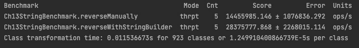

# 13

# 性能重点库

现代 Java 应用程序的性能是一个至关重要的关注点，它可以显著影响应用程序和组织的成功。性能可以包括执行速度、网络响应性和数据处理优化。无论你试图提高哪种类型的性能，选择和正确实施最理想的工具和库是实现性能改进目标的关键。

本章突出了可以显著提高 Java 应用程序性能的一组特定工具。首先介绍的工具是**Java 微基准工具**（**JMH**），它帮助我们创建可靠的基准。我们的 JMH 覆盖范围将包括基本知识和实践应用。Netty，一个专注于高性能的网络应用程序框架，也将被介绍。该框架的最大价值在于需要快速响应时间或可扩展网络架构的应用程序。

我们对以性能为重点的库的覆盖范围包括对 FasterXML Jackson 的考察，这是一个高速的**JavaScript 对象表示法**（**JSON**）处理器，正如你将有机会学习的，它促进了数据处理效率。FasterXML Jackson，也简称为 Jackson，具有流式和数据绑定 API，可以在处理 JSON 数据时显著提高性能。本章最后将介绍其他值得注意的库，包括 Eclipse Collections、Agrona 和 Guava。

在本章结束时，你应该对以性能为重点的库有基础的了解，并能够利用从实践练习中获得的知识来提高你的 Java 应用程序的性能。

本章涵盖了以下主要内容：

+   Java Microbenchmark Harness

+   Netty

+   FasterXML Jackson

+   其他值得注意的库

# 技术要求

要遵循本章中的示例和说明，你需要具备加载、编辑和运行 Java 代码的能力。如果你还没有设置你的开发环境，请参考*第一章*，*探索 Java 虚拟机（JVM）*。

本章的完整代码可以在以下链接找到：[`github.com/PacktPublishing/High-Performance-with-Java/tree/main/Chapter13`](https://github.com/PacktPublishing/High-Performance-with-Java/tree/main/Chapter13)。

# Java Microbenchmark Harness

基准测试对于衡量性能的能力至关重要。JMH 是一个用于实施严格基准的工具包。本节将探讨 JMH 及其关键特性，并提供实现示例。

Java Microbenchmark Harness (JMH)

JMH 用于构建和实施基准来分析 Java 代码的性能。它是由创建**Java 虚拟机**（**JVM**）的团队用 Java 编写的。

使用 JMH 的开发者可以以可重复和受控的条件来衡量 Java 代码片段的性能。

## 关键特性

JMH 是一个开源工具包，用于在纳米、微和宏观层面构建和实现基准测试。JMH 不仅仅是一个性能测试器；它旨在克服或避免常见的性能测量陷阱，包括预热时间和即时编译（**JIT**）的影响。

JMH 工具包的关键特性包括以下内容：

+   **注解**：正如您将在下一节中看到的那样，JMH 使用 Java 注解轻松定义基准测试。这个特性对开发者友好。

+   **JVM 集成**：JMH 与 JVM 间隔同步工作。这为我们提供了一致和可靠的结果。

+   **微基准测试支持**：正如其名所示，JMH 专注于小的代码片段。这有助于提高性能测量的准确性。

现在您对 JMH 工具包有了基本的了解，让我们看看如何编写基准测试。

## 将 JMH 库添加到您的 IDE 中

根据您的**集成开发环境**（**IDE**）设置，您可能需要手动将 JMH 库添加到 Java 项目中。以下步骤可用于 Visual Studio Code 将 JMH 库添加到 Java 项目中：

1.  创建一个**Maven** **quickstart**项目。

1.  通过添加以下依赖项编辑`pom.xml`文件：

    ```java
    <dependency>
        <groupId>org.openjdk.jmh</groupId>
        <artifactId>jmh-core</artifactId>
        <version>1.32</version>
        <scope>test</scope>
    </dependency>
    <dependency>
        <groupId>org.openjdk.jmh</groupId>
        <artifactId>jmh-generator-annprocess</artifactId>
        <version>1.32</version>
        <scope>test</scope>
    </dependency>
    ```

1.  使用命令面板通过**Maven：重新加载项目**保存并重新加载项目。

您可能会选择使用更健壮的 IDE，例如 IntelliJ IDEA。以下是向该 IDE 中的项目添加这些库的步骤：

1.  在 IntelliJ IDEA 中创建一个项目。

1.  选择**文件** | **项目结构**菜单选项。

1.  在**项目结构**界面中，选择**项目设置** | **库**。

1.  点击**+**按钮添加新的库。

1.  选择**从 Maven**选项。

1.  使用搜索功能查找`org.openjdk.jmh:jmh-core`的最新版本，然后点击**OK**将库添加到您的项目中。

1.  使用搜索功能查找`org.openjdk.jmh:jmh-generator-annprocess`的最新版本，然后点击**OK**将库添加到您的项目中。

1.  点击**应用**以应用更改，然后点击**OK**关闭**项目结构**对话框窗口。

1.  最后，确保库已自动添加到您的模块中。如果不是这种情况，请选择**文件** | **项目结构** | **模块**菜单选项。如果新的 JMH 库未列在**依赖项**区域中，请使用**+**按钮添加它们。

如果您不使用 Visual Studio Code 或 IntelliJ IDEA，请按照适合您 IDE 的步骤进行操作。

## 编写基准测试

要在 Java 代码中使用 JMH，我们只需添加`@Benchmark`注解，并使用 JMH 的核心 API 配置和执行基准测试。让我们看看代码中的示例。我们的示例测试了两种方法，它们以不同的方法进行字符串反转：

```java
package org.example;
import org.openjdk.jmh.annotations.Benchmark;
import org.openjdk.jmh.annotations.Setup;
import org.openjdk.jmh.annotations.State;
import org.openjdk.jmh.annotations.Scope;
import org.openjdk.jmh.runner.Runner;
import org.openjdk.jmh.runner.options.Options;
import org.openjdk.jmh.runner.options.OptionsBuilder;
@State(Scope.Thread)
public class Ch13StringBenchmark {
    private String sampleString;
    @Setup
    public void prepare() {
        sampleString = "The quick brown fox jumps over the lazy dog";
    }
    @Benchmark
    public String reverseWithStringBuilder() {
        return new StringBuilder(sampleString).reverse().toString();
    }
    @Benchmark
    public String reverseManually() {
        char[] strArray = sampleString.toCharArray();
        int left = 0;
        int right = strArray.length - 1;
        while (left < right) {
            char temp = strArray[left];
            strArray[left] = strArray[right];
            strArray[right] = temp;
            left++;
            right--;
        }
        return new String(strArray);
    }
    public static void main(String[] args) throws Exception {
        Options opt = new OptionsBuilder()
                .include(Ch13StringBenchmark.class.getSimpleName())
                .forks(1)
                .build();
        new Runner(opt).run();
    }
}
```

接下来，让我们运行我们的代码并查看结果。

## 运行基准测试

一旦我们定义了基准，我们只需通过 Java 应用程序中的`main()`方法或通过命令行运行它们。如果我们的应用程序不包含`main()`方法，那么我们将运行包含基准的类。在我们的上一个代码示例中，那将是`Ch13StringBenchmark()`类。JMH 提供了带有时间测量和吞吐量率的详细输出。分析这些数据可以为基准代码提供有关性能的显著见解。

即使我们的简单测试也产生了大量的输出。以下图提供了输出的最后一段。完整的输出可以在本章 GitHub 仓库的`Ch13StringBenchmarkOutput.txt`文件中找到。



图 13.1 – 最终基准输出

参考前面的输出，让我们看看如何分析这些信息以提供性能洞察。

## 分析结果

如您在上一节中看到的，JMH 提供了大量的输出。查看*图 13.1*中展示的最后三行输出，有几个列是我们应该理解的：

+   `Mode`：这是基准模式。我们的模式是`thrpt`，用于吞吐量。它也可以是`avgt`，用于平均时间。

+   `Cnt`：这是基准迭代的计数。在我们的案例中，每个基准都是`5`。

+   `Score`：这是基准分数，显示在我们的案例中是平均吞吐量时间（以微秒为单位）。

+   `Error`：此列包含分数的误差范围。

根据输出，我们可以看到第一个基准比第二个基准快。查看这类结果可以帮助开发者决定如何实现某些功能，以在代码中实现高性能。

## 用例

有几个常见的 JMH 用例：

+   算法优化

+   比较分析

+   性能回归测试

JMH 赋予 Java 开发者创建和实施基准的能力。分析结果可以帮助开发者根据经验数据进行分析，从而做出明智的决策。这可以导致更高效的 Java 应用程序。

# Netty

Netty，因其网络特性而巧妙地命名，是一个高性能、事件驱动的应用程序框架。这个框架通过简化网络功能编程（如使用**用户数据报协议**（UDP）和**传输控制协议**（TCP）套接字服务器）来帮助开发者创建网络应用程序。

网络编程通常涉及低级 API，Netty 提供了一定程度的抽象，使其更容易开发。Netty 架构可扩展，支持许多连接，并设计用于最小化延迟和资源开销。

## 核心功能

由于其可靠性、可扩展性和易用性，Netty 是许多网络开发者的首选框架。Netty 的核心功能包括以下内容：

+   **内置编解码器支持**：Netty 具有内置的编解码器，可以帮助开发人员处理包括 HTTP 和 WebSocket 在内的各种协议。Netty 否定了为支持的协议进行单独实现的需要。

+   **可定制管道**：Netty 框架包括一个管道架构，该架构有助于数据封装和处理程序。它采用模块化方法，使管道配置对开发人员来说变得简单易行。

+   **事件驱动**：Netty 的事件驱动设计导致异步输入/输出处理。这种非阻塞方法最小化了网络延迟。

在理解 Netty 核心功能的基础上，让我们回顾性能考虑因素。

## 性能考虑因素

在整本书中，我们的重点是高性能 Java 应用程序。Netty 是我们高性能工具套件的一个很好的补充。它通过其**线程模型灵活性**和**零拷贝能力**强调高性能。让我们看看那些性能考虑因素：

+   **线程模型灵活性**：Netty 的线程管理高度可配置。开发人员可以根据特定的用例（如扩展或缩减规模以及减少线程数量）配置 Netty 来管理其应用程序的线程。

+   **零拷贝能力**：Netty 的零拷贝 API 有助于使数据处理（输入和输出）更高效。这是通过最小化不必要的内存复制来实现的。

让我们看看使用 Netty 创建一个回显服务器的示例，该服务器简单地将其接收到的数据回显给客户端。

## 实现

以下示例演示了 Netty 处理网络事件相对容易，以及 Netty 如何促进网络通信中的高性能。请注意，你将在`pom.xml`文件中记录你的依赖项：

```java
import io.netty.bootstrap.ServerBootstrap;
import io.netty.channel.*;
import io.netty.channel.nio.NioEventLoopGroup;
import io.netty.channel.socket.SocketChannel;
import io.netty.channel.socket.nio.NioServerSocketChannel;
import io.netty.handler.codec.string.StringDecoder;
import io.netty.handler.codec.string.StringEncoder;
public class Ch13EchoServer {
  public static void main(String[] args) throws InterruptedException {
    EventLoopGroup bossGroup = new NioEventLoopGroup(1);
    EventLoopGroup workerGroup = new NioEventLoopGroup();
    try {
      ServerBootstrap b = new ServerBootstrap();
      b.group(bossGroup, workerGroup)
       .channel(NioServerSocketChannel.class)
       .childHandler(new ChannelInitializer<SocketChannel>() {
        @Override
        protected void initChannel(SocketChannel ch) throws Exception {
          ChannelPipeline p = ch.pipeline();
          p.addLast(new StringDecoder(), new StringEncoder(), new 
          Ch13EchoServerHandler());
        }
      });
      ChannelFuture f = b.bind(8080).sync();
      f.channel().closeFuture().sync();
    } finally {
        workerGroup.shutdownGracefully();
        bossGroup.shutdownGracefully();
    }
  }
  static class Ch13EchoServerHandler extends 
  ChannelInboundHandlerAdapter {
    @Override
    public void channelRead(ChannelHandlerContext ctx, Object msg) {
      ctx.write(msg);
      ctx.flush();
    }
  }
}
```

下面是 Netty 回显服务器的模拟输出：

```java
Server started on port 8080.
Client connected from IP: 192.168.1.5
Received from client: Hello Server!
Echoed back: Hello Server!
Received from client: This is a test message.
Echoed back: This is a test message.
Received from client: Netty is awesome!
Echoed back: Netty is awesome!
Client disconnected: IP 192.168.1.5
Server shutting down...
```

Netty 是一个成熟且健壮的网络应用程序开发框架。它本身具有可伸缩性，并提供了网络功能方面的性能优势。Netty 还引入了开发效率和更短的开发时间。

# FasterXML Jackson

JSON 是一种用于数据交换的文件格式。它是有结构和可读的文本，用于传输数据对象。该格式由数组和属性值对组成。以下代码块中提供的示例 JSON 对象代表一个社交媒体系统的用户配置文件。正如你所看到的，字段包含用户的姓名、年龄、电子邮件地址和爱好：

```java
{
    "name": "Neo Anderson",
    "age": 24,
    "email": "neo.anderson@matrix.com",
    "hobbies": ["coding", "hacking", "sleeping"]
}
```

这个 JSON 对象由属性值或键值对以及用户爱好的字符串数组组成。JSON 是数据存储和 Web 应用程序中数据表示的常用方法。

**FasterXML Jackson**是一个具有快速处理和创建 JSON 对象主要能力的库。这些对象是顺序读取的，从现在起称为**Jackson**，它使用游标来跟踪其位置。Jackson 被誉为性能最大化者和内存最小化者。

*FasterXML Jackson*中的*XML*表明它也能处理 XML 文件。除了 Jackson 快速处理 JSON 的能力外，它还可以处理**逗号分隔值**（**CSV**）、**可扩展标记语言**（**XML**）、**YAML Ain’t Markup Language**（**YAML**）和其他文件格式。

## 核心特性

Jackson 的核心特性包括以下内容：

+   **数据绑定**：数据绑定是 Jackson 的一个特性，它支持高效且可靠的 Java 对象与 JSON 文本之间的转换。实现方式简单直接。

数据绑定

计算机编程中的一种技术，它将数据源（提供者）和接收者（客户端）链接（绑定）在一起。

+   **流式 API**：Jackson 有一个高效、低级的流式 API 用于解析和生成 JSON。

+   **树模型**：当需要灵活的 JSON 操作时，Jackson 的树模型可以实现，以树结构表示 JSON 文档——节点树。这通常用于 JSON 结构复杂的情况下。

现在你已经了解了 Jackson 的核心特性，让我们回顾一下性能考虑因素。

## 性能考虑

这里详细说明的性能考虑因素展示了 Jackson 是如何被设计为一个以性能为重点的库：

+   **自定义序列化和反序列化**：Jackson 使开发者能够为自定义字段定义自己的序列化和反序列化器。这可以带来显著的性能提升。

+   **零拷贝**：与 Netty 一样，Jackson 的零拷贝 API 有助于使数据处理（输入和输出）高效。这是通过最小化不必要的内存复制来实现的。

让我们看看使用 Jackson 序列化和反序列化 Java 对象的示例。

## 实现

让我们先在我们的`pom.xml`文件中添加依赖项，以将 Jackson 包含到我们的项目中。这可能看起来是这样的：

```java
<dependencies>
    <dependency>
        <groupId>com.fasterxml.jackson.core</groupId>
        <artifactId>jackson-core</artifactId>
        <version>2.12.3</version>
    </dependency>
    <dependency>
        <groupId>com.fasterxml.jackson.core</groupId>
        <artifactId>jackson-databind</artifactId>
        <version>2.12.3</version>
    </dependency>
</dependencies>
```

以下示例说明了 Jackson 在开发对象序列化和反序列化方面的直接性：

```java
import com.fasterxml.jackson.databind.ObjectMapper;
  public class Ch13JacksonExample {
    public static void main(String[] args) throws Exception {
      ObjectMapper mapper = new ObjectMapper();
      // Example of a Plan Old Java Object (POJO)
      class User {
        public String name;
        public int age;
        // Constructors, getters, and setters have been omitted for 
        // brevity
      }
    // Serialize Java object to JSON
    User user = new User();
    user.name = "Neo Anderson";
    user.age = 24;
    String jsonOutput = mapper.writeValueAsString(user);
    System.out.println("Serialized JSON: " + jsonOutput);
    // Deserialize JSON to Java object
    String jsonInput = "{\"name\":\"Neo Anderson\",\"age\":24}";
    User userDeserialized = mapper.readValue(jsonInput, User.class);
    System.out.println("Deserialized user: " + userDeserialized.name);
  }
}
```

在本节中，我们了解到 Jackson 是处理 JSON 的关键工具。它速度快、灵活且健壮。当需要在 Java 应用程序中处理 JSON 时，Jackson 可能是你首先想到的工具。

# 其他值得注意的库

到目前为止，我们已经介绍了 JMH、Netty 和 Jackson，并提出了它们是专注于 Java 高性能的核心库。每个库都是为特定类型的任务设计的。还有其他值得学习的库。本节探讨了三个额外的库：**Agrona**、**Eclipse Collections**和**Guava**。

## Agrona

Agrona 是一个专门设计用于创建高性能 Java 应用程序的数据结构集合。这些数据结构包括映射和环形缓冲区。一个示例用例是一个股票交易应用程序，其成功取决于低延迟。

Agrona 的关键特性包括以下内容：

+   非阻塞数据结构——这支持高吞吐量和低延迟

+   专门为高频股票和证券交易系统设计

+   使用直接缓冲区，有助于提高堆外内存管理的效率

让我们看看 Agrona 的实现示例，它说明了如何使用特定的性能数据结构。在我们的示例中，我们将使用 `ManyToOneConcurrentArrayQueue` 数据结构：

```java
import org.agrona.concurrent.ManyToOneConcurrentArrayQueue;
public class Ch13AgronaExample {
  public static void main(String[] args) {
    // Create a queue with a capacity of 10 items
    ManyToOneConcurrentArrayQueue<String> queue = new 
    ManyToOneConcurrentArrayQueue<>(10);
    // Producer thread that offers elements to the queue
    Thread producer = new Thread(() -> {
      for (int i = 1; i <= 5; i++) {
        String element = "Element " + i;
        while (!queue.offer(element)) {
          // Retry until the element is successfully added
          System.out.println("Queue full, retrying to add: " + 
          element);
          try {
            Thread.sleep(10); // Sleep to simulate backoff
          } catch (InterruptedException e) {
              Thread.currentThread().interrupt();
          }
        }
        System.out.println("Produced: " + element);
      }
    });
    // Consumer thread that polls elements from the queue
    Thread consumer = new Thread(() -> {
      for (int i = 1; i <= 5; i++) {
        String element;
        while ((element = queue.poll()) == null) {
          // Wait until an element is available
          System.out.println("Queue empty, waiting for elements...");
          try {
            Thread.sleep(10); // Sleep to simulate processing delay
          } catch (InterruptedException e) {
              Thread.currentThread().interrupt();
          }
        }
        System.out.println("Consumed: " + element);
      }
    });
    // Start both threads
    producer.start();
    consumer.start();
    // Wait for both threads to finish execution
    try {
      producer.join();
      consumer.join();
    } catch (InterruptedException e) {
      Thread.currentThread().interrupt();
    }
  }
}
```

如您在前面代码中看到的，并从代码注释中推断，我们使用容量值 `10` 初始化 `ManyToOneConcurrentArrayQueue`。这种类型的队列非常适合只有一个 **客户** 和多个 **生产者** 的用例。我们的示例包括消费者和生产者线程。代码实现了基本的线程处理。

## Eclipse Collections

Eclipse Collections 是一组内存高效的算法和数据结构。这些集合可以用来显著提高性能。为大规模系统设计，Eclipse Collections 提供了可变和不可变两种形式。它们提供了高效的内存管理。

Eclipse Collections 的关键特性包括以下内容：

+   一个全面的数据结构集合，包括包、列表、映射、集合、栈等

+   原始集合及其相关类

+   可以转换集合并用于过滤、迭代和排序的实用方法

让我们演示如何使用 Eclipse Collections 中的 `ImmutableList`。这是更内存高效的集合之一：

```java
import org.eclipse.collections.api.factory.Lists;
import org.eclipse.collections.api.list.ImmutableList;
public class Ch13EclipseCollectionsExample {
    public static void main(String[] args) {
        // Creating an immutable list using Eclipse Collections
        ImmutableList<String> immutableList = Lists.immutable.
        of("Apple", "Pear", "Cherry", "Lime");
        // Displaying the original list
        System.out.println("Original immutable list: " + 
        immutableList);
        // Adding an item to the list, which returns a new immutable 
        // list
        ImmutableList<String> extendedList = immutableList.
        newWith("Orange");
        // Displaying the new list
        System.out.println("Extended immutable list: " + 
        extendedList);
        // Iterating over the list to print each element
        extendedList.forEach(System.out::println);
    }
}
```

我们的示例从创建一个不可变的水果列表开始。接下来，我们在列表中添加一个元素，然后遍历列表进行输出。

要在我们的应用程序中使用 Eclipse Collections，我们需要将库包含到我们的项目中。以 Maven 为例，我们只需简单地将以下内容添加到我们的 `pom.xml` 文件中：

```java
<dependency>
    <groupId>org.eclipse.collections</groupId>
    <artifactId>eclipse-collections-api</artifactId>
    <version>11.0.0</version>
</dependency>
<dependency>
    <groupId>org.eclipse.collections</groupId>
    <artifactId>eclipse-collections</artifactId>
    <version>11.0.0</version>
</dependency>
```

我们提供的代码片段为使用 Eclipse Collections 提供了基本介绍。

## Guava

Guava 是来自 Google 的一个产品，包括新的集合类型，如 multimap 和 multiset。它还包括不可变集合、图形库、对原生的支持以及缓存实用工具。以下是 Guava 的关键特性列表：

+   高级集合类型。

+   高级集合实用工具。

+   使用 `CacheBuilder` 的缓存支持。这可以用来提高应用程序的速度。

+   并发实用工具。

+   哈希实用工具。

+   输入/输出操作实用工具。

下面是一个示例应用程序，展示了 Guava 的 `CacheBuilder` 的使用。该应用程序创建了一个自动加载和存储基于值的键的缓存：

```java
import com.google.common.cache.CacheBuilder;
import com.google.common.cache.CacheLoader;
import com.google.common.cache.LoadingCache;
import java.util.concurrent.TimeUnit;
public class Ch13GuavaExample {
  public static void main(String[] args) throws Exception {
    LoadingCache<String, String> cache = CacheBuilder.newBuilder()
      .maximumSize(100)
      .expireAfterWrite(10, TimeUnit.MINUTES)
      .build(
        new CacheLoader<String, String>() {
          public String load(String key) {
            return "Value for " + key;
          }
        }
      );
    System.out.println(cache.get("key1"));
    System.out.println(cache.get("key2"));
    System.out.println(cache.get("key3"));
  }
}
```

Java 有几个库和框架可以用来提高整体性能。了解我们可用的库以及如何实现它们对于应用程序的成功至关重要。

# 摘要

本章探讨了几个关键的高性能库，我们可以利用这些库来提升我们的 Java 应用程序的性能。具体来说，我们回顾了 JMH，并指出它提供了可靠的性能基准测试。我们还研究了 Netty，并确定了它在提升网络应用程序性能方面的适用性。FastXML Jackson 也被审查，因为它在处理 JSON 对象方面的专用用途。最后，我们还介绍了三个额外的库：Agrona、Eclipse Collections 和 Guava。

本章中介绍的所有库都是针对特定的 Java 编程需求定制的。这些工具有望帮助我们显著提升 Java 应用程序的性能。在自己的 Java 项目中尝试这些库可以帮助巩固你对它们的理解，以及每个库的最佳使用案例。此外，适当地实现这些库可以导致 Java 应用程序的整体性能提升。
