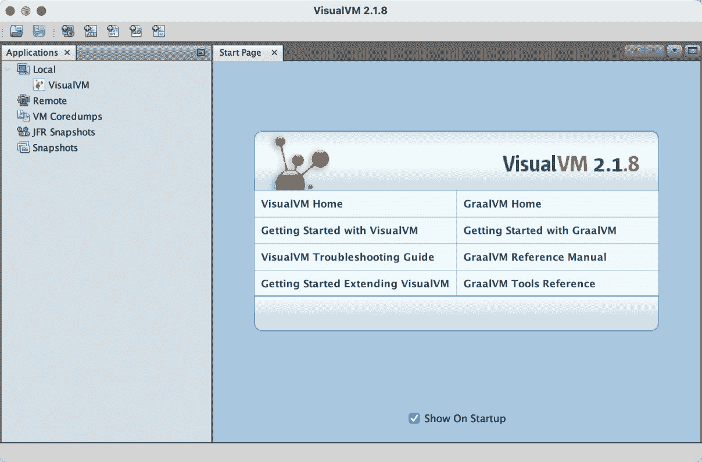
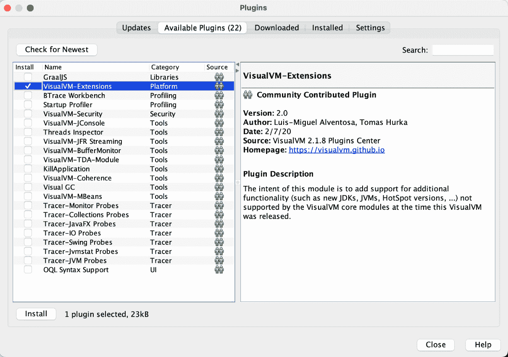
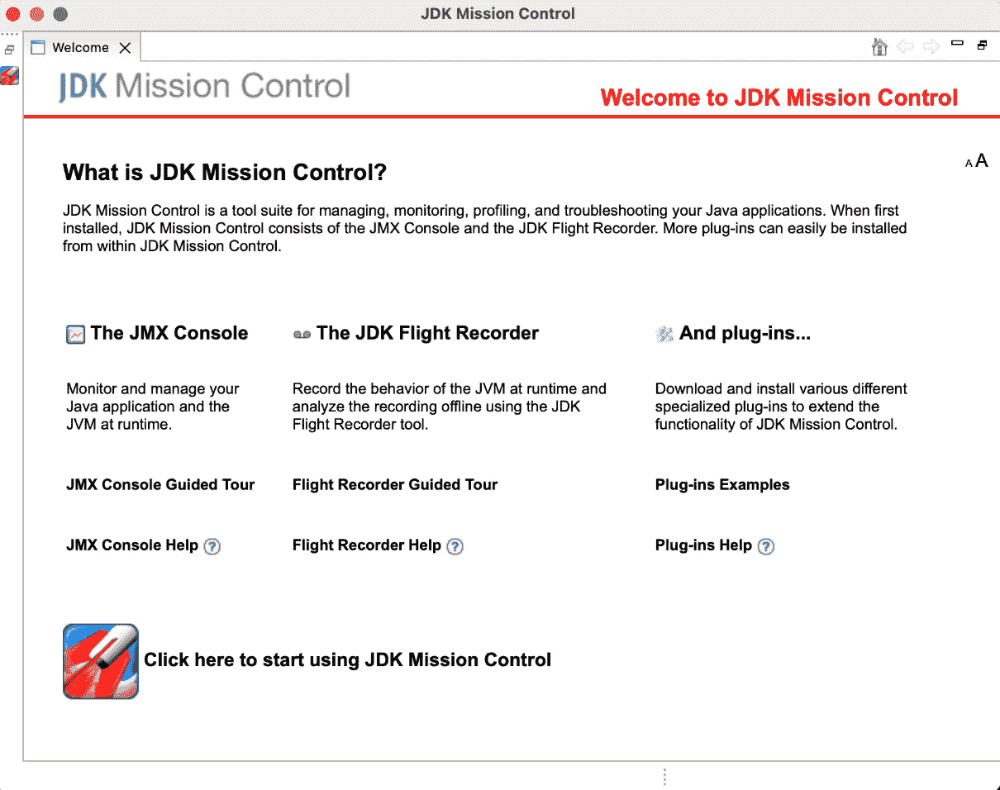
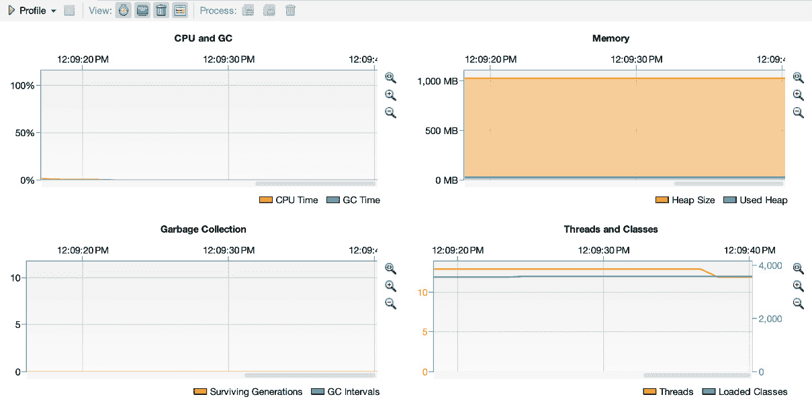
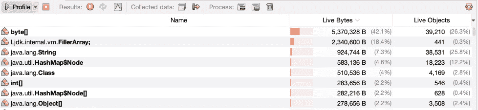
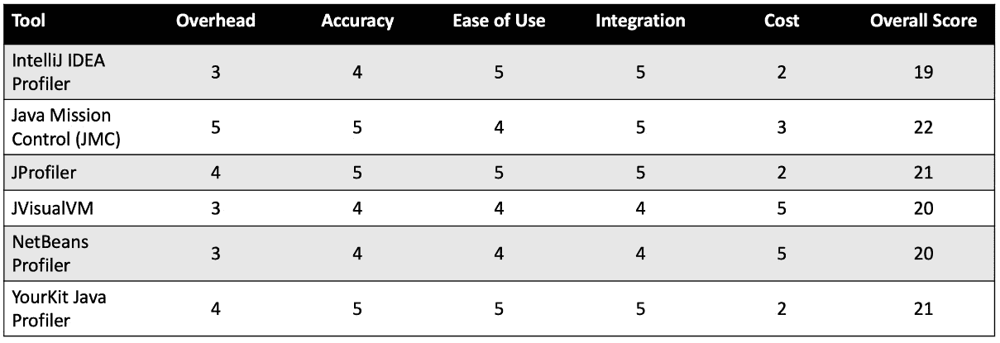

# 14

# 性能分析工具

随着我们的 Java 应用程序复杂性的增加，深入了解它们如何使用系统资源，如 CPU 和内存的需求变得越来越重要，并且是确保我们的应用程序高效运行的关键方面。这正是性能分析工具发挥作用的地方；它们可以帮助我们识别瓶颈和内存泄漏等问题，以便我们改进应用程序，提升用户体验和整体性能。

本章深入探讨性能分析和性能分析工具。我们将从性能分析及其对我们优化应用程序以实现最佳性能能力的重要性进行介绍。还将涵盖性能分析工具的分类及其用途，以帮助您获得基本理解，并最终对特定的性能分析工具进行回顾。

我们将涵盖与 Java 开发工具包（**JDK**）捆绑的性能分析工具以及嵌入在集成开发环境（**IDE**）中的性能分析工具，例如 IntelliJ IDEA、Eclipse 和 NetBeans。此外，还将审查第三方性能分析工具，包括 YourKit Java Profiler、JProfiler 和 VisualVM。目的是为您提供对各种性能分析工具的深入了解，包括它们的优缺点和实际用例，以便您确定哪种工具最适合您的需求并有效地使用它们。

我们对性能分析工具的覆盖包括比较分析，以帮助您评估性能开销、工具准确性、易用性、集成问题和成本。我们将以对未来的 Java 性能分析趋势的探讨结束本章，包括性能分析工具的进步、新兴标准和人工智能（**AI**）与机器学习（**ML**）的集成，以进一步优化性能。

到本章结束时，您应该对性能分析工具有一个基础的了解，并能够利用从实际练习中获得的知识来提高您的 Java 应用程序的性能。

本章涵盖了以下主要主题：

+   性能分析工具简介

+   JDK 内置的性能分析器

+   IDE 内置的性能分析器

+   其他性能分析器

+   性能分析工具比较分析

+   实践性能分析策略

+   案例研究

+   Java 性能分析的未来趋势

# 性能分析工具简介

性能分析工具在性能调整和主动应用程序增强中发挥着关键作用，以支持高性能 Java 应用程序。

性能分析

性能分析是分析软件运行时的过程，其目标是识别性能问题，包括瓶颈、资源使用和优化机会。

一旦我们构建和测试了我们的软件，它就会进入生产阶段。这是性能分析发生的地方，即在运行时。使用性能分析工具，我们可以深入了解我们应用程序的运行时行为。目标是拥有高效的代码和我们的系统以最佳性能运行，包括低延迟、高可靠性和高可用性。我们的应用程序不仅要准确执行，还需要高效执行。使用性能分析工具使我们能够定位性能问题，以便我们进一步优化我们的代码。

## 性能调优中性能分析的重要性

让我们看看五个具体的原因，这些原因说明了性能分析对支持性能调优的重要性：

+   **应用程序响应性**：性能调优的核心是确保我们的应用程序具有响应性。用户不应遭受高延迟。性能分析工具帮助我们分析我们的资源是如何使用的，揭示了改进的机会。

+   **瓶颈**：使用性能分析工具可以帮助我们识别性能瓶颈甚至潜在的瓶颈。这使我们能够采取主动的性能调优方法，并帮助我们避免未来的灾难性瓶颈。

+   **持续改进**：软件系统不是开发、部署后就不再关注了。我们维护我们的系统，并努力持续改进它们。今天表现良好的系统可能在新的操作系统发布或其它环境因素改变时表现不佳。这需要一种持续改进的心态。持续地对我们的应用程序进行性能分析并解决优化机会可以帮助确保我们的系统保持响应性和高效性。

+   **资源利用率**：应密切监控硬件资源（如 CPU 和内存）的使用，因为对这些资源的低效使用可能导致系统延迟和次优的输入/输出操作。性能分析工具可以帮助我们识别可以优化的区域。

+   **可扩展性**：我们的应用程序越大，即使是微小的性能问题对整体系统性能的影响也越显著。使用性能分析工具可以帮助我们识别提升性能和解决任何可能随着应用程序扩展而变得更加明显的相关问题的机会，这可能是由于需求的增加。

## 性能分析工具的类型及其用途

存在着七种广泛的性能分析工具类别，每个类别都有自己的关注领域或目的。现在让我们来回顾一下：

+   **CPU 性能分析器**：这一类性能分析器分析应用程序的 CPU 使用情况。它们可以识别我们应用程序中最占用 CPU 资源的方法。

+   **IDE 内嵌性能分析器**：大多数主要的 IDE（例如，NetBeans、Eclipse 和 IntelliJ IDEA）都有内置的性能分析工具。因为它们是 IDE 的一部分，所以它们可以无缝地与开发环境集成。这使得它们特别易于使用。

+   **输入/输出分析器**：这些分析器专门关注我们的应用程序的输入/输出操作。如果我们的输入/输出过程缓慢或效率低下，这些分析器可以将它们暴露出来，以便我们可以优化文件处理、数据库交互和网络通信等操作。

+   **内存分析器**：内存分析器为我们提供了内存分配和内存使用的窗口。这可以帮助我们识别实际或潜在的内存泄漏，并识别内存消耗优化的机会。我们可以使用这类分析器来深入了解垃圾收集、内存保留，甚至对象生命周期。

+   **网络分析器**：正如其名所示，这类分析器专门分析应用程序的网络通信。这些分析器可以帮助我们识别延迟问题，并了解带宽的使用情况。网络分析器还可以帮助我们识别次优或不高效的网络协议。

+   **专用分析器**：这是一类为特定性能情况提供定制功能的分析器。它们也可以用于特定环境（例如，分布式系统或实时系统）或特定场景。

+   **线程分析器**：线程分析器监控线程活动，在多线程环境中特别有用。这类分析器帮助我们检测线程竞争问题和潜在的死锁，并识别优化线程管理的机遇。

理解分析工具及其类别和使用方法非常重要。这些知识可以帮助您选择最适合您性能目标和系统要求的最合适的工具。

# JDK 中的分析器捆绑

JDK 包含了可以为我们提供关于 Java 应用程序性能宝贵见解的分析工具。强烈建议使用这些工具来识别性能问题和性能微调的机会。本节探讨了 JDK 内置的主要分析器——JVisualVM 和 **Java 使命控制**（**JMC**）。

## JVisualVM

**JVisualVM**，即 **Java 可视化虚拟机**，是 JDK 内置的一个强大的分析工具。它提供了一套令人印象深刻的特性，包括监控、分析和故障排除 Java 应用程序。

### 概述和功能

JVisualVM 提供了一个图形用户界面，它结合了多个 JDK 工具，包括 JConsole。界面如图所示。

图 14.1：JVisualVM 图形用户界面

JVisualVM 的关键特性总结如下：

+   **堆转储分析**：JVisualVM 能够捕获堆转储并为我们分析它们。这可以帮助我们深入了解内存使用情况，并识别实际或潜在的内存泄漏。

+   **插件集成**：此工具的功能可以通过众多可用的插件进行扩展。插件库可通过工具菜单访问，如下图所示。

图 14.2：JVisualVM 插件库

+   **监控**：JVisualVM 可以实时监控我们应用程序的内存消耗、垃圾回收、线程活动和 CPU 使用。

+   **配置文件分析**：此工具提供了对 CPU 和内存使用进行详细配置文件分析的能力。这有助于识别内存泄漏和瓶颈。

+   **线程分析**：JVisualVM 可以用来监控和分析我们应用程序的线程状态和线程活动。

### 用例和示例

我们可以使用 JVisualVM 进行多种用例，它在开发、测试和生产阶段特别有用。此工具为我们提供了详细的 CPU 和内存使用洞察。我们可以使用此工具查看哪些方法消耗了最多的 CPU 时间。我们还可以查看内存消耗、对象分配和垃圾回收，以帮助我们优化应用程序的内存使用。

例如，考虑一种情况，我们有一个用户报告偶尔出现延迟的 Web 应用程序。我们可以使用 JVisualVM 来监控我们应用程序的 CPU 和内存使用。这有助于我们识别峰值。从那里，我们可以分析线程转储以确定问题的来源。在这种情况下，问题可能只是一个导致偶尔延迟的单个 Java 方法或线程。使用配置文件分析工具可以帮助我们快速找到问题的核心，从而相应地改进我们的代码。

## JMC

JMC 是另一个强大的 JDK 工具，我们可以用它来配置文件和监控我们的 Java 应用程序，尤其是在生产环境中。如图下截图所示，JMC 包括**JMX 控制台**和**飞行记录器**。

图 14.3：JMC 欢迎屏幕

### 概述和功能

**Java 管理扩展**（**JMX**）控制台用于监控和管理我们的 Java 应用程序。**飞行记录器**用于持续监控和配置文件分析。它收集详细性能数据，对应用程序性能的影响有限。记录的事件包括方法调用、内存分配、线程活动和输入/输出操作。**Java 飞行记录器**（**JFR**）是 JMC 的核心组件，可以用来记录我们的运行应用程序，然后分析结果，给我们提供关于 CPU 使用、特定方法执行时间、内存分配数据等方面的洞察。

利用 JMC 和 JVisualVM 的功能可以深入了解我们应用程序的性能，使我们能够优化资源使用并提高应用程序的响应速度。在下一节中，我们将回顾 IDE 内嵌的配置文件分析工具。

# IDE 内嵌的配置文件分析器

Java 开发者使用他们最喜欢的 IDE 中的内置分析工具。使用这些分析器为我们提供了一个方便的方法，可以直接在我们的首选开发环境中分析我们的软件。本节探讨了 IntelliJ IDEA、Eclipse 和 NetBeans IDE 的内置功能。

## IntelliJ IDEA 分析器

**IntelliJ IDEA 分析器**允许我们在 IDE 内部对 Java 应用程序进行分析。这个强大的功能仅适用于 IDE 的商业版（**IntelliJ IDEA Ultimate**），因此如果您使用的是**社区版**（**CE**），则无法使用 IntelliJ IDEA 分析器。集成和设置都很简单；以下是步骤：

1.  打开 IntelliJ IDEA。

1.  编写或加载您的 Java 项目。

1.  使用**运行** | **分析**菜单选项来启动分析。

1.  选择您想要的分析类型（CPU 或内存）。

使用 CPU 分析，该工具可以识别代码中消耗最多 CPU 时间的函数。还提供了调用树，显示了代码路径和整体资源使用情况（CPU 和内存）。IntelliJ IDEA 分析器的内存分析功能包括跟踪对象分配、分析垃圾收集效率以及检测内存泄漏的能力。

## Eclipse 的测试和性能工具平台

Eclipse IDE 对于 Java 开发者来说很受欢迎，它之前有一个内置的分析工具，称为**测试和性能工具平台**（**TPTP**）。它作为插件提供，可在 Eclipse 市场获得。关键特性如下：

+   CPU 性能分析

+   内存分析

+   线程分析

+   输入/输出分析

+   网络活动

在此处提及 TPTP 是为了让使用 Eclipse 的开发者不会对 Eclipse 内置的分析工具感到困惑。TPTP 已被存档，可能是因为 JDK 内置分析工具功能的不断增强。

## NetBeans 分析器

NetBeans 分析器集成到 NetBeans IDE 中，并有一个顶级的**分析**菜单项，便于配置和访问。该工具可以在遥测、方法、对象、线程、锁和 SQL 查询等类别中进行性能分析。

以下截图显示了在**遥测分析**被选中时，工具仪表板的四个主要组件。

图 14.4：NetBeans 遥测分析器窗口

下图所示的对象分析器提供了实时分析，以便您可以在运行时审查应用程序的性能。

图 14.5：NetBeans 对象分析器窗口

了解与您的 IDE 集成的分析工具可以帮助您更有效地利用时间，因为这些集成工具与第三方工具相比，配置和使用起来最为简便，在某些情况下，甚至比使用 JDK 捆绑的分析工具还要容易。

# 其他分析器

到目前为止，我们已经查看了一些内置在 JDK 和 IDE 中的分析工具。还有一个第三类分析器，它们是 JDK 和 IDE 之外的外部分析器。本节回顾了该类别中最普遍的三个分析器。这些是专门工具，可以根据我们对运行时应用程序的复杂分析提供更深入的见解。

## YourKit Java Profiler

YourKit Javak Profiler 是一个具有开源许可的强大分析工具。高级功能和支持需要购买许可证。此工具的关键功能和能力如下：

+   **持续集成**/**持续交付**（**CI**/**CD**）集成

+   CPU 分析

+   数据库分析

+   输入/输出分析

+   内存分析

+   远程服务器分析

+   线程分析

## JProfiler

JProfiler 分析工具是一个商业应用程序，据说是一个直观的、适用于 Java 应用程序的全能分析器。它具有友好、易于使用的界面和以下强大功能：

+   CPU 分析

+   堆和对象图分析

+   IDE 集成

+   内存分析

+   移除服务器分析

+   SQL 分析

+   线程分析

## VisualVM 插件和扩展

我们之前介绍了 VisualVM 作为 JDK 捆绑的分析工具。本节将其包括在内，因为有许多第三方插件和扩展可以用来增强 VisualVM。

以下列表展示了可用的部分插件：

+   **缓冲区监控器**：可用于监控直接缓冲区使用。

+   **堆分析器**：此插件提供有限内存和堆分析。

+   **终止应用程序**：此插件便于终止无响应的监控进程。

+   **采样插件**：提供详细的 CPU 和内存采样选项。

+   **启动分析器**：此插件便于从启动时使用仪器分析。这对于运行时间较短的应用程序很有用。

+   **线程检查器**：提供高级线程分析。

+   **追踪器**：这是一个使用探针进行详细监控的框架。

+   **VisualGC**：为垃圾收集器提供深入分析和可视化。

除了 VisualVM 分析器外，还有额外的插件和扩展。此外，如果需要，开发者可以创建自己的自定义插件。

# 分析工具的比较分析

使用分析工具的一个好处是我们有多个选项可供选择。本节使用以下类别回顾了本章中介绍的六个顶级分析工具：

+   性能开销

+   准确性

+   易用性

+   集成

+   成本

通过对每个类别的分析，我们将对每个这些分析工具进行评分，以查看它们之间的对比。

## 性能开销

比较分析工具时，考虑它们的性能开销很重要。这个因素可以帮助你选择适合你用例的正确工具。以下是六个选定分析工具的性能开销回顾：

+   **IntelliJ IDEA Profiler**：这款工具的开销适中，适用于开发和测试；然而，它并不适合生产环境，尤其是在高负载应用中。

+   **JMC**：最小开销是 JMC 最强的特点之一。这在使用 JFR 时尤为明显。JMC 设计用于生产使用，通常对性能的影响可以忽略不计。

+   **JProfiler**：这款工具的开销适中，但具有高度详细的分析能力，使得开发者需要在详细洞察和增加开销之间做出艰难的决定。使用此工具进行开发和测试环境以及受控的生产实例的剖析是合适的。

+   **JVisualVM**：该分析工具的性能开销介于低到中等之间，取决于所需的剖析深度。它适用于开发和生产环境。

+   **NetBeans Profiler**：这款工具的开销适中，仅适用于非生产环境。

+   **YourKit Java Profiler**：这款工具具有高度的可配置性，有助于管理开销。它适用于生产和非生产环境。

## 准确度

并非所有分析工具都能达到 100%的准确度，了解您工具的准确度水平非常重要。以下是您特色分析工具准确度的综述：

+   **IntelliJ IDEA Profiler**：该工具在 CPU 和内存剖析方面具有最高的准确度。当剖析线程时，准确度会下降，并且可能会增加性能开销。

+   **JMC**：这是一款高精度分析工具，即使在生产环境中也能以最小的性能影响提供精确的结果。

+   **JProfiler**：这款分析工具提供高度准确的结果以及详细的可视化。

+   **JVisualVM**：虽然这款分析工具提供了准确采样和数据，但需要更高精度的需求会增加性能开销。

+   **NetBeans Profiler**：这款工具提供了准确的 CPU 和内存剖析以及实时线程分析。

+   **YourKit Java Profiler**：这款分析工具在 CPU、内存和线程分析方面提供高度准确的结果。

## 易用性

易用性是我们在选择分析工具时需要考虑的另一个重要因素。如果一个工具难以使用且需要大量时间，可能不是适合您的工具。以下是关于我们特色工具易用性的综述：

+   **IntelliJ IDEA Profiler**：这款工具无缝集成到 IntelliJ IDEA IDE 中，使其直观且易于使用。

+   **JMC**：这是一款高级工具，可能需要集中精力学习。

+   **JProfiler**：这款工具以其易用性而闻名。它也经过了详尽的文档记录。

+   **JVisualVM**：这款分析工具对初学者友好，具有简单的用户界面。

+   **NetBeans Profiler**：这款工具集成到 NetBeans IDE 中，使其易于使用。

+   **YourKit Java Profiler**：此分析工具具有直观的用户界面，易于使用。

## 集成

开发者倾向于选择具有深度集成的分析工具。以下是针对我们六个选定的分析工具的该特性的回顾：

+   **IntelliJ IDEA Profiler**：此工具深度集成到 IntelliJ IDEA IDE 中，并支持自定义工作流程。

+   **JMC**：JMC 与 JDK 捆绑，使得与基于 JVM 的应用程序的集成无缝。

+   **JProfiler**：此工具可以轻松集成到最流行的构建工具和 IDE 中。

+   **JVisualVM**：此工具与 IDE 集成，易于使用。

+   **NetBeans Profiler**：此工具完全集成到 NetBeans IDE 中。

+   **YourKit Java Profiler**：此分析工具支持与主要 IDE 和 CI/CD 集成。

## 成本和许可考虑因素

分析工具的成本可能是一个重要因素。独立开发者倾向于选择免费工具，而大型团队可能会选择支付更多功能强大的工具。以下是我们的六款工具的成本因素：

+   **IntelliJ IDEA Profiler**：此分析器包含在 IntelliJ IDEA Ultimate 版本中，需要付费订阅。

+   **JMC**：此工具在开发和测试中免费，但在生产中使用可能需要付费。

+   **JProfiler**：这是一个需要付费使用的商业工具。

+   **JVisualVM**：此工具免费，并捆绑在 JDK 中。

+   **NetBeans Profiler**：这是一个集成到 NetBeans IDE 中的免费工具。

+   **YourKit Java Profiler**：这是一个需要付费使用的商业工具。

## 每个工具的最佳用例

很可能没有单个分析工具会每次都满足您的需求。我们的每个工具都有它们最适合的具体用例：

+   **IntelliJ IDEA Profiler**：此工具最适合希望在开发期间使用集成分析工具的 IntelliJ IDEA 用户。

+   **JMC**：由于其低开销和提供详细分析的能力（尤其是在使用 JFR 时），此工具非常适合生产环境。

+   **JProfiler**：此分析工具非常适合希望有一个易于使用、功能强大且具有高级分析能力的开发者。

+   **JVisualVM**：此工具最适合希望在软件开发和测试阶段使用免费 CPU 和内存分析选项的开发者。

+   **NetBeans Profiler**：此工具非常适合想要一个可靠的集成分析工具（用于 CPU、内存和线程分析）的 NetBeans IDE 用户。

+   **YourKit Java Profiler**：此分析工具最适合希望在软件开发生命周期的所有阶段进行深入分析的用户，包括生产阶段。

## 评分我们的分析工具

以下表格根据性能开销、分析准确性、易用性、集成和成本对六个特色分析工具进行评分。评分范围从 1 到 5，1 为最低分，5 为最高分。

表 14.1：剖析工具评分矩阵

如您所见，没有单个工具在每个类别中都获得了最高分。根据这个评分，JMC 获得了最高的 22 分，其次是 JProfiler 和 YourKit Java 剖析器，各得 21 分。JVisualVM 和 NetBeans 剖析器得 20 分，IntelliJ IDEA 剖析器得分最低，为 19 分。

通过了解每个剖析工具的优势、局限性和权衡，您应该能够选择最适合您需求的工具。

# 实践剖析策略

剖析我们的 Java 应用程序以帮助识别和解决性能问题的益处已经得到证实。接下来，我们将探讨有效的剖析策略，以便您能够高效地优化 Java 应用程序。本节涵盖了识别性能瓶颈的策略，以及在不同开发和生产环境之间区分剖析方法。我们还将探讨如何实施持续剖析以进行长期性能管理。

## 识别性能瓶颈

剖析的主要目标是识别性能瓶颈。我们可以采用几种策略来实现这一目标，包括以下内容：

+   首先，监控 CPU 使用率、内存消耗和响应时间。这些高级指标可以帮助您确定需要进一步分析的区域。

+   考虑使用能够快速识别消耗最多 CPU 时间的方法的采样剖析器。例如，JVisualVM 和 IntelliJ IDEA 剖析器提供此类功能。目标是使用采样来定位问题，而不会对性能产生重大影响。

+   一旦确定了需要进一步分析的领域，请使用如 JProfiler 和 YourKit Java 剖析器提供的仪器剖析。这些工具可以帮助您检查特定的代码路径和方法。

+   一定要分析您应用程序的线程活动。这对于采用并发处理的应用程序至关重要。例如，JMC 和 NetBeans 剖析器等工具具有广泛的线程分析功能。它们可以用来检测线程竞争、死锁以及甚至低效的同步。

+   使用内存剖析器来分析对象分配，识别 Java 垃圾收集器未回收的对象，并捕获堆转储。例如，JProfiler 和 YourKit Java 剖析器具有这种功能，并有助于识别潜在的内存泄漏。

+   最后，如果你的应用程序大量使用数据库交互或输入/输出操作，请使用能够提供对 JDBC 调用和输入/输出洞察的剖析器。目标是识别低效的查询和输入/输出瓶颈。

## 开发与生产中的剖析

我们如何以及剖析什么应该由我们的当前环境来指导。在开发环境中进行剖析的方法应与在生产环境中剖析运行中的应用程序的方法不同。

以下表格提供了基于 10 个关键分析方面的开发环境和生产环境中分析的比较分析。

| **方面** | **开发分析** | **生产分析** |
| --- | --- | --- |
| 主要关注点 | 识别和解决性能问题 | 监控和解决运行时性能问题 |
| 访问要求 | 直接访问 | 远程访问 |
| 频率 | 经常性分析 | 根据观察进行选择性分析 |
| 性能影响 | 可以容忍高开销 | 需要最小开销 |
| 分析类型 | 详细仪器 | 抽样 |
| 工具 | IntelliJ IDEA 分析器、JProfiler 和 YourKit Java 分析器 | JMC 和 JVisualVM |
| 数据粒度 | 高 | 低 |
| 负载模拟 | 模拟真实负载 | 实时用户负载 |
| 自动化 | 集成到 CI/CD | 持续监控 |

表 14.2：分析比较分析

了解基于您的应用程序环境的分析差异可以帮助您进行有效的分析，从而允许您提高 Java 应用程序的性能。

## 持续分析

我们应该在开发过程中进行分析，然后在我们应用程序投入生产后持续进行。实施持续分析包括以下方面：

+   建立性能基线，以便您可以将其与未来的分析结果进行比较

+   将分析集成到您的 CI/CD 管道中

+   确保您正在监控关键性能指标，包括 CPU 使用情况、内存使用情况和响应时间

+   存储您的轮询数据，以便您可以进行历史分析

+   除了常规监控外，定期进行全面的分析审计

+   确保与开发团队沟通分析结果，使他们了解情况，并提高您当前系统的性能，有助于使未来的应用程序性能更佳

这些实用的分析策略可以帮助识别和解决性能瓶颈。建立一种正式的分析方法，可以细致地遵循，这一点非常重要。

# 案例研究

本节详细介绍了三个案例研究，以说明在现实场景中实际实施分析工具的实用方法。

## 案例研究 1 – 分析大型企业应用

**场景**：一家大型全球金融服务公司开发、测试和部署了一个企业应用来处理他们的交易和报告。最近，该应用开始出现性能下降。这在高峰用户交易时间尤为明显。

**分析工具**：开发团队选择了 JProfiler，因为它能够提供详细的分析，并且它与他们的开发环境集成。

**实施过程**：该公司采取了三步走的方法进行分析：

1.  他们首先进行了初步分析，查看 CPU 使用情况、内存使用情况和线程分析。

1.  接下来，他们使用第 1 步的配置文件数据来识别瓶颈。

1.  第三步是优化他们的企业应用。这次优化包括重写低效算法、实施更有效的数据结构、优化对象创建和销毁，以及通过实施精细的锁定机制减少线程竞争。

**结果**：交易时间显著改善，内存消耗现在稳定。此外，改进后的应用现在能够处理峰值负载时间，而不会出现网络延迟问题或影响用户体验。

## 案例研究 2 – 在微服务架构中进行性能调整

**场景**：一家科技公司使用微服务架构开发了一个大规模的电子商务应用。有许多微服务，其中主要的服务处理用户身份验证、产品库存、产品目录、支付交易和订单处理。员工和用户报告了间歇性的延迟问题和偶尔的超时。

**分析工具**：该科技公司选择 JMC 进行分析，因为它具有低开销，并且能够使用 JFR 在生产环境中监控应用程序。

**实施过程**：公司决定在所有微服务上启用 JFR 记录。他们的计划是在不显著影响性能的情况下收集详细性能数据。接下来，他们使用 JMC 分析 JFR 数据，以识别资源使用模式和潜在热点。

分析显示，他们的产品目录服务有间歇性的 CPU 使用高峰，影响了整体响应时间。他们的线程分析显示，订单处理服务由于线程竞争导致超时。他们还审查了网络分析数据，显示支付交易服务的数据库交互有高延迟。

在完成性能分析和配置文件后，开发团队优化了他们的电子商务应用。具体来说，他们通过实施缓存机制优化了产品目录服务。订单处理服务使用优化后的线程管理方案重写，采用了线程池。最后，支付交易服务的数据库查询得到优化，并实施了连接池。

**结果**：经过优化后，该科技公司的电子商务系统性能得到改善。延迟减少，稳定性显著提高，超时情况很少。员工报告满意度提高，用户投诉减少。

## 案例研究 3 – 分析和优化高吞吐量系统

**场景**：一家通信公司使用一个系统进行高吞吐量和实时数据处理与分析。在负载高峰期间，他们的系统性能显著下降。这导致数据处理和分析操作延迟。

**分析工具**：公司选择了 YourKit Java Profiler 工具，因为它具有全面的功能，非常适合高吞吐量系统。

**实施过程**：通信公司的开发团队采用了三步方法——进行初始配置文件、识别瓶颈和优化。

初始配置文件包括了对 CPU 和内存使用的分析。他们专注于系统的数据处理和分析组件。他们还进行了详细的线程分析，以帮助识别线程处理中明显的瓶颈。

他们的第二步是识别瓶颈。他们的 CPU 配置文件审查发现，他们的数据处理模块中包含了一些复杂的计算，这显著增加了 CPU 的使用。他们的内存配置文件结果显示，他们的分析模块内存使用量高。同样，该模块频繁的垃圾回收事件对系统的整体性能产生了负面影响。他们还分析了线程分析结果，结果显示在高峰数据负载期间存在线程竞争，进一步降低了性能。

公司的最后一步是对其系统进行优化。他们优化了数据处理算法以提高计算效率，并增强了并行处理以利用多核处理器。开发者还通过减少对象创建、改进数据结构和最小化垃圾回收来优化他们的分析模块。团队还优化了应用程序管理线程的方式。他们引入了线程池以减少线程竞争。

**结果**：通信公司的高吞吐量系统在系统优化后实现了显著的性能提升。他们的数据处理时间减少了 55%，分析处理期间的延迟最小化。他们的系统现在可以高效地处理高数据负载并满足实时数据处理需求。

三个案例研究展示了在不同情境下使用配置文件策略和工具的实际应用。它们都采用了类似的三步方法（配置文件、识别、优化）并且取得了成功的成果。

# Java 配置文件的未来趋势

软件开发领域一直在不断变化，配置文件工具和技术同样具有动态性。随着技术创新的出现，帮助开发者应对和管理这些技术的工具也应运而生。本节探讨了 Java 配置文件的未来趋势，重点关注配置文件工具与人工智能和机器学习的集成。本节最后列出了新兴的标准和最佳实践。

## 配置文件工具的进步

当前的配置文件工具持续得到改进，新版本经常发布。定期引入新的配置文件工具也是常见的。配置文件工具的关键进步体现在以下五个领域：

+   **改进的用户界面**：我们应该看到更直观的界面和更好的可视化。

+   **云原生配置文件**：云计算和分布式计算已成为常态，配置文件工具更有可能适应这些环境。

+   **增强实时性能分析**：性能分析工具将增强其实时处理能力，并持续减少其对性能的影响。

+   **低开销的仪器化**：对高吞吐量系统进行性能分析可能会导致系统延迟。未来的进步将减少这些系统对性能的影响。

+   **统一的监控和性能分析**：监控和性能分析工具的融合对于希望结合实时监控和深度性能数据的诊断的开发团队来说是有益的。

## 与 AI 和机器学习集成

性能分析工具可以利用 AI 和 ML 技术。这些技术可以帮助性能调优工作。以下是 AI 和 ML 在性能调优中使用的关键方面：

+   自适应性能分析

+   自动异常检测

+   智能优化建议

+   预测性能建模

+   根本原因分析

## 新兴标准和最佳实践

以下建议旨在帮助指导您有效使用现有的性能分析工具和技术，以及它们的发展：

+   采用持续性能分析策略。

+   在性能分析工具收集数据时，注意安全和隐私考虑。

+   与您的团队沟通和协作。这包括他们参与您的性能分析策略，审查结果，以及优化计划。

+   将您的性能分析工作纳入整体性能管理计划。

+   标准化您的性能分析 API，以便您可以引入互操作性和集成简化。这些标准可以帮助确保您的性能分析数据是一致的，并且您可以有效地在不同工具和环境之间比较标准。

重要的是要关注您使用的性能分析工具的变化，并意识到新工具和技术被引入的情况。这种意识，加上对最佳实践的遵守，可以帮助您充分利用性能分析工具和技术，从而实现高性能的 Java 应用程序。

# 摘要

本章全面探讨了性能分析工具及其在 Java 应用程序性能中的作用。我们探讨了各种性能分析器，包括包含在 JDK 中的和嵌入在 IDE 中的分析器，以及第三方工具如 JProfiler 和 YourKit Java Profiler。涵盖了实用的性能分析策略，以帮助识别性能瓶颈，开发环境和性能环境所需的独特性能分析方法，以及持续性能分析对长期性能管理的重要性。我们介绍了三个真实案例研究，以说明性能分析工具的应用。最后，我们考察了关于 Java 性能分析工具的未来趋势和最佳实践。

在下一章中，我们将探讨如何优化我们的数据库和查询，以增强我们的 Java 应用程序的性能。我们将回顾数据库设计考虑因素、有目的的 SQL 查询生成，以及包括规范化、索引、连接池、缓存、JDBC 和 ORM 优化、事务管理和测试在内的几种策略。

# 第五部分：高级主题

书的最后一部分讨论了推动 Java 性能优化的边界的高级主题。它从优化数据库和 SQL 查询的策略开始，接着是有效的代码监控和维护技术。你将学习关于单元和性能测试的知识，以确保你的应用程序符合性能标准。本部分以探索利用**人工智能**（**AI**）来提高 Java 应用程序的性能结束，提供了对未来趋势和技术的前瞻性视角。

本部分包含以下章节：

+   *第十五章*，*优化你的数据库和 SQL 查询*

+   *第十六章*，*代码监控和维护*

+   *第十七章*，*单元和性能测试*

+   *第十八章*，*利用人工智能（AI）提高高性能 Java 应用程序*
