# Java 编程的第一步

欢迎来到《Java 初学者实战自动化测试》。这是你在互联网上能找到的唯一一本教你成为强大的 Java 自动化测试者的所有主题的书。它包含了简单易懂的教学和简单技术，以有效地处理与 Java 相关的自动化/项目。考虑到我们将详细解释核心 Java 的每个主题，这将真正帮助我们开发和评估我们自己的 Java 自动化项目。

所有核心 Java 概念都是从零开始解释的。我们不假设读者有任何先验知识，因此我们认为所有读者都来自非编码背景，我们不仅教授每个主题，还通过我们将在实时中使用到的例子来支持他们。因此，我们不会只停留在理论上。

当你在市场上检查课程时，你应该尝试学习一个新概念。你只看到三条定义的线条后面跟着例子；这就是全部。但在这里，我们将了解为什么、何时以及在哪里在 Java 中使用**面向对象编程系统**（**OOPS**）的概念。还将有适当的编程示例，展示在实时使用中的特定 OOPS 概念。这样，我们的书将通过实时项目进行驱动；这完全是关于实践学习。这将在我们开始 Java 集合时发挥作用，例如核心 Java，这是本书的主要概念之一，因为绝对需要你开始基础知识并开发你工作场所的自动化框架。此外，由于 Java 集合是核心部分之一，在整个书中，我们将非常注意为我们将讨论的每个 Java 集合提供所有必要的实际场景。

我们将处理棘手的 Java 程序，查看打印输出、素数、斐波那契数列和金字塔。我们将按降序排序打印，查看数组矩阵，并打印最大列数。这本书将为你提供在接近和设计这些程序逻辑时所需的具体策略和技巧。这将帮助你超越界限，获得编写困难 Java 程序所需的逻辑。

本书讨论的程序来源于许多公司在面试中经常问到的问题。你将获得这些问题，包括详细的解决方案和接近该逻辑的方法。因此，这本书主要关注核心 Java。我们不涉及 Swing 和按钮，这些内容超出了本书中 Java 学习的范围。

在这本书中，我们将学习核心 Java、集合以及其他概念，如循环、类和数组。这些已经足够你开始并开发 Java 项目。无论你处于哪个领域，从这本书中获得的知识将帮助你立即开始自动化项目的测试。

本章将涵盖以下概念：

+   Java 及其安装简介

+   使用 Java 编辑器工具

+   编写您的第一个可执行 Java 程序

# Java 及其安装简介

当我们谈论 Java 时，首先想到的是它是平台无关的。这个特性使得 Java 成为市场上的热门编程工具。那么，平台无关性究竟意味着什么呢？

我们编写的代码与环境无关；无论是 Windows、Unix、Linux 还是 Solaris。基本上，当我们编写一个 Java 程序时，Java 编译器将程序转换为字节码。当我们运行 Java 代码时，Java 编译器将整个编程代码转换为字节码。例如，我们正在 Windows 机器上工作。当我们运行程序并且 Java 编译器运行并为我们创建字节码时，这个字节码可以在任何其他平台上执行，例如 Linux、macOS 和 Unix。这意味着我们在 Windows 上开发字节码，而这个字节码可以在任何其他平台上运行。所以这就是我们所说的平台无关性。

这是我们 Java 编程中的一项真正酷炫的特性。每次你要求某人下载 Java 时，你首先会被问到的第一个问题是，它是 JDK 还是 JRE？人们往往会在这两个术语之间感到困惑。在我们开始在我们的机器上下载和配置 Java 之前，我们需要对此有清晰的认识。让我们来看看这两个：

+   **JRE** 代表 **Java 运行时环境**：它负责运行我们的 Java 程序。如果我们的目标是仅仅运行一个纯 Java 核心代码，那么 JRE 就足够了。

+   **JDK** 代表 **Java 开发工具包**：它用于调试我们的 Java 代码，或者如果我们想拥有 Java 文档或其他类似的东西。

JDK 包含 JRE、Java 文档、调试工具和其他酷炫的东西。这是一个完整的 Java 套件，我们将从中获取所有组件。所以，我们下载什么取决于我们，但我建议我们只下载 JDK 以确保安全。如果我们只想练习和运行我们的程序，JRE 也足够了，但让我们坚持使用 JDK。

因此，现在让我们回到互联网上下载 Java，并尝试在我们的机器上配置它。要下载 Java，导航到以下页面：[`java.com/en/download/`](https://java.com/en/download/)。当你点击免费 Java 下载按钮时，如图所示，将下载 JRE 版本：

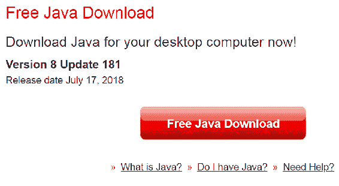

但我们打算在我们的程序中使用 JDK，因此导航到以下网站：[`www.oracle.com/technetwork/java/javase/downloads/index.html`](https://www.oracle.com/technetwork/java/javase/downloads/index.html)。在这里，有多个 JDK 版本。目前市场上最新的版本是 Java SE 10.0.2。点击下载，如图所示，以便将所有组件下载并配置到我们的机器上：

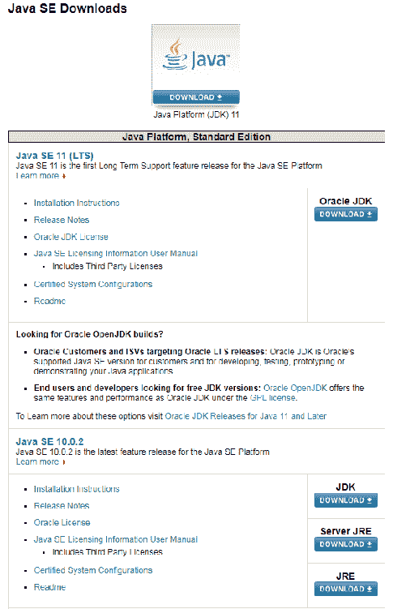

这需要一些时间，因为配置它需要相当多的步骤。继续点击“下一步”，以便在机器上成功配置 Java。要检查 Java 是否已安装在我们的机器上，导航到`C:\Program Files`。如果我们那里找到一个名为`Java`的文件夹，这意味着 Java 已成功安装在我们的机器上。`Java`文件夹如下面的截图所示：

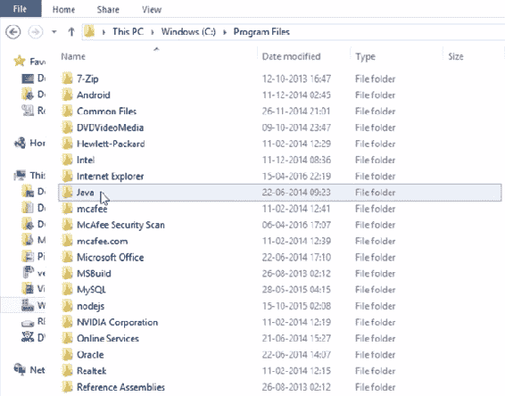

这里需要记住的一个重要点是，如果我们处于 64 位系统，那么我们才会看到“程序文件”中的这个`Java`文件夹。如果我们的机器是 32 位，那么我们需要回到`程序文件(x86)`以获取`Java`文件夹。

我们可以通过前往控制面板并点击“系统”来检查我们的系统类型。我正在工作的系统是 64 位，如下面的截图所示：

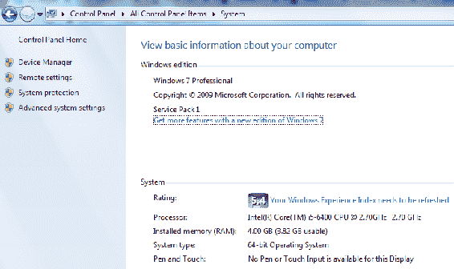

下载成功后，我们进入`Java`文件夹，并观察到 JDK 和 JRE 都已下载。我们进入 JDK 文件夹并复制整个文件路径。我们这样做是因为我们需要设置环境变量。设置环境变量意味着我们正在让系统知道 Java 文件夹的位置。

在我们的案例中，Java 文件夹位于`C:/Program Files/Java/JDK`，但 Windows 不知道它确切的位置。因此，为了使我们的系统知道 JDK 的主目录路径，我们将它放置在我们的系统变量中。这将帮助我们的机器知道 Java 文件夹的位置，这样每次我们运行程序时，它都会识别确切的 JDK 版本并运行我们的程序。为了在系统环境变量中更新此信息，我们复制整个 JDK 路径。前往控制面板，选择“系统和安全”，选择“系统”，然后点击“高级系统设置”。在高级系统设置中，选择“环境变量”。当我们点击“环境变量”时，会出现以下窗口：

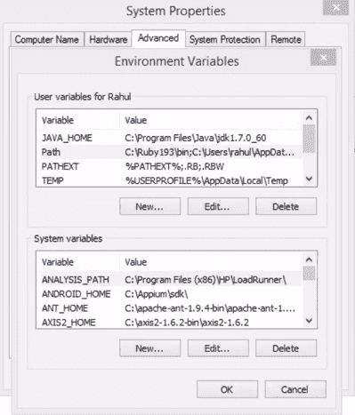

当我们在“拉胡尔的用户变量”部分点击“新建”时，我们会得到一个提示，要求添加一个新的用户变量。我们将名称设置为`JAVA_HOME`，将 JDK 路径粘贴到变量值文本框中，然后点击“确定”，如下面的截图所示：

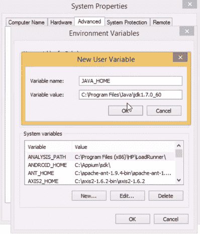

这就是我们的系统如何知道`Java`文件夹的确切位置。我们还需要更新另一个变量。为此，我们回到 JDK 文件夹并进入`bin`文件夹。我们会看到多个`.exe`文件，如下面的截图所示：

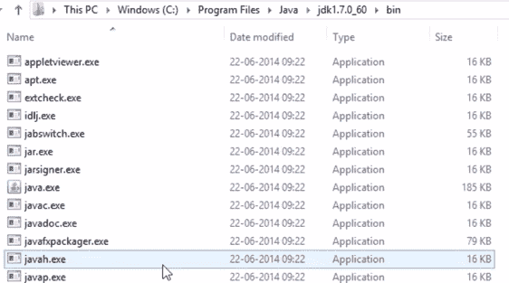

我们复制`bin`文件夹的位置路径，然后返回到我们的系统属性窗口。在系统变量中，我们会看到一个名为`Path`的变量。双击它将显示一个提示，要求编辑系统变量，如下面的截图所示：

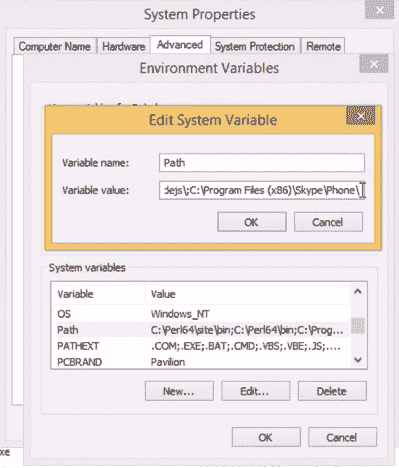

在变量值中，我们走到末尾，添加一个分号，然后粘贴`bin`文件夹的路径。这意味着我们正在将`Path`变量设置为`bin`文件夹。我们还需要在开始使用 Java 之前设置这两个变量。一旦我们设置了这两个变量并点击确定，我们就成功设置了环境变量。

如果我们想要交叉检查环境变量是否配置正确，我们使用命令提示符。在命令提示符中，我们输入`java -version`并按*Enter*。如果我们得到以下截图所示的输出，这意味着 Java 已经成功配置到我们的系统上：

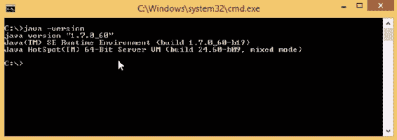

如果我们在添加变量之前运行命令，我们会看到 Java 没有被识别。只有设置好系统环境变量后，我们才能成功配置 Java。

之前的说明负责从我们这边安装和配置系统。接下来，我们将尝试下载 Eclipse，这是一个 Java 编辑器工具，我们在这里编写、运行和调试我们的代码。在下载 Eclipse 之前，我们必须确保 Java 在我们的机器上配置正确。如果安装或配置步骤中有任何错误，Eclipse 将无法正确安装。

# 使用 Java 编辑器工具

在这里，我们将查看我们将使用来编写 Java 代码的编辑器工具。市场上有很多工具可以作为新的 Java 编辑器，但我个人更喜欢使用 Eclipse。它带有许多内置功能和语法添加。随着我们的进展，我们将看到 Eclipse 的其他优点。其中一些优点不能从理论上讨论，所以一旦我们开始实际编码，我们就会理解它是如何提示我们编写正确语法的。因此，在整个书籍过程中，我们将使用 Eclipse IDE 编辑器编写所有的 Java 代码。

首先，我们下载 Eclipse IDE 编辑器，看看它提供的界面。以下链接将带我们到 Eclipse 的官方网站：[`www.eclipse.org/downloads/`](https://www.eclipse.org/downloads/)。网站看起来就像以下截图所示：


当我们点击“下载 64 位”按钮下的“下载包”时，它会带我们到以下页面：

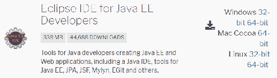

我们将使用 Eclipse IDE for Java EE Developers。我们可以根据我们正在工作的系统选择 32 位或 64 位。我们已经知道如何通过访问控制面板并遵循安装阶段的说明来检查我们的系统是 32 位还是 64 位。

我们需要确保的一个重要事项是，我们的 Java 版本与我们要下载的 IDE 兼容。如果我们的系统是 32 位的，而我们下载了 64 位的 Java，那么 Eclipse 将无法打开。所以请确保我们的系统、Java 和 Eclipse 版本都在同一条线上。

文件将以 ZIP 文件夹的形式下载，我们可以将其解压。以下屏幕截图显示了`eclipse`文件夹中将会出现的文件夹：

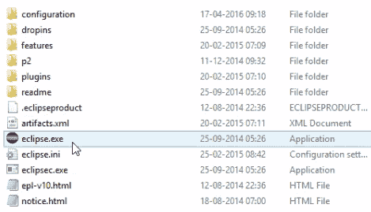

如果我们双击`eclipse.exe`文件，Eclipse 用户界面将打开。

如果我们要编写 Java 代码，我们需要创建一个 Java 项目。在左侧的空白窗格上右键点击，然后点击“新建”|“项目”。这在上面的屏幕截图中显示：

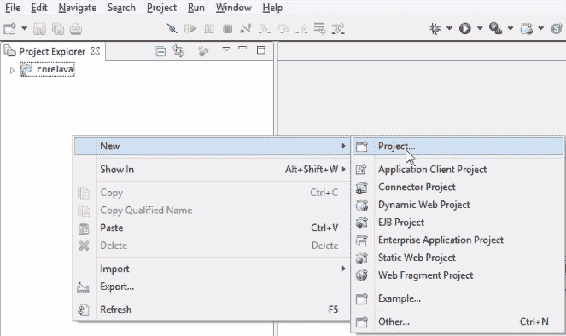

我们会收到一个提示，告诉 Eclipse 我们正在做什么类型的项目，如下面的屏幕截图所示：

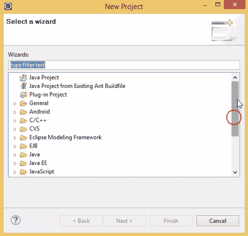

如我们所见，有很多不同的框架可供选择，例如 Java 项目、C/C++和 Android，但我们只对 Java 项目感兴趣，所以我们选择 Java 项目，然后点击“下一步”。我们将得到一个“新建 Java 项目”窗口，我们将在这里填写我们新项目所需的所有信息，如以下屏幕截图所示：

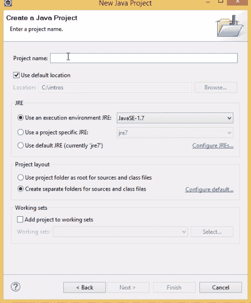

我们为将要创建的 Java 项目选择一个项目名称。我们将第一个项目命名为`coreJavaTraining`。点击“下一步”，然后点击“完成”。系统会提示我们是否要打开关联的视角？选择“否”：

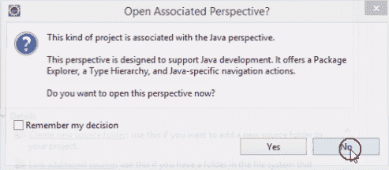

这样就可以成功创建`coreJavaTraining`项目了。在项目内部，有一个自动创建的源文件夹。这意味着我们需要在这个源文件夹内编写我们的类。这些类究竟是什么呢？基本上，所有的 Java 代码都是在一个类内部编写的。当我们用记事本编写 Java 时，我们打开记事本，编写 Java 代码，并将该记事本文件保存为`.java`扩展名。但在 Eclipse 中，所有这些工作都是由这个工具本身完成的。所以我们需要做的就是创建一个类，这将给我们一个合适的模板。我们右键点击源文件（`src`），然后点击“新建”|“类”。我们将得到一个 Java 类提示，我们将在这里输入类名。我们将这个类命名为`Firstclass`，并确保选中“public static void main (String[] args)”复选框；我们稍后会讨论这个选项的重要性。最后，我们点击“完成”。这在上面的屏幕截图中显示：

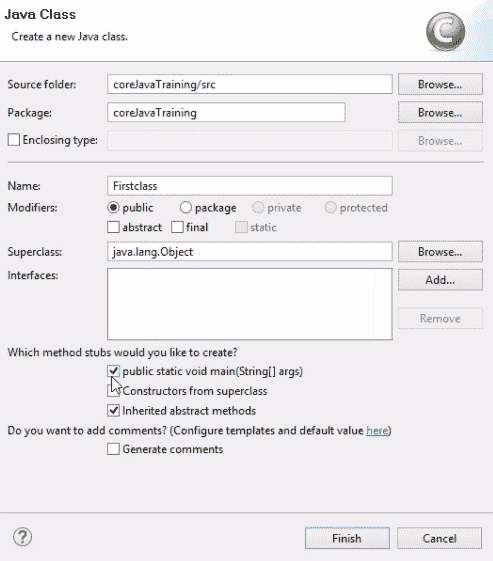

我们可以看到，内置的层次结构已经为我们创建好了，因为 Eclipse 创建了一个外部模板。在编辑器中我们可以看到，有一个类和 `public static void main`。所有这些都是由 Eclipse 工具创建的。如果我们不使用任何工具在记事本中正常编写，我们需要创建模板。但在 Eclipse 中，我们只需要给出类名。我们将输入的代码将被封装在类中；也就是说，在类的括号内。我们创建文件时使用的任何名称都将作为类名。

所有代码的执行都将放置在 `public static void main` 中，因为每次我们运行此文件时，Java 控制将直接进入此块。它不会触及 `public static void main` 外部编写的任何代码。简而言之，我们在 `public static void main` 块外编写代码，但最终我们需要在块内调用该代码。这是因为只有 `main` 块负责执行我们的 Java 代码。这就是为什么我们写 `public static void main`。随着我们在本书中的进一步学习，我们将了解 `public` 和 `void` 关键字，因为现在过早地深入了解这些内容。我们可以在以下截图中看到模板：

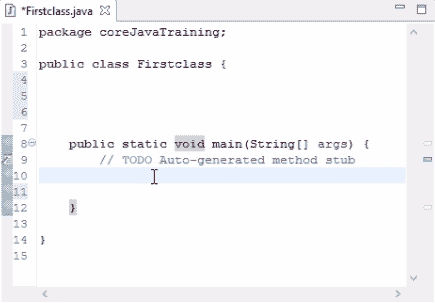

由 Eclipse 工具创建的类

# 编写您的第一个可执行 Java 程序

让我们从本节的基本编码开始。如果我们想在输出中打印某些内容，Java 中有一个名为 `System.out.println()` 的命令。此命令将在控制台打印输出。假设我们想打印 `hello world`，当我们运行以下代码时，`hello world` 将在我们的输出控制台中打印出来：

```java
Firstclass.java
```

因此，让我们运行代码。有两种方法可以运行代码：

+   右键单击项目资源管理器中的文件名，点击“运行方式”，然后选择“Java 应用程序”。

+   或者，我们可以点击工具栏中的运行图标，然后在“保存并启动”窗口中点击“确定”。图标看起来像这样：


这将运行我们的代码并打印我们的输出。以下截图显示了编辑器中的 `hello world` 消息：

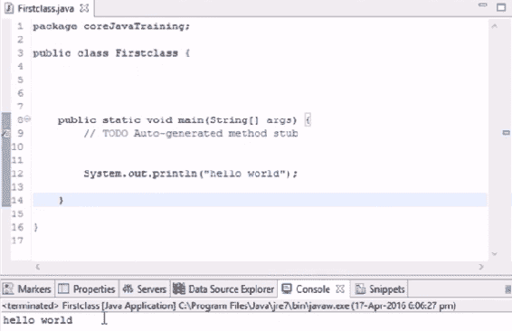

根据代码显示的输出“hello world”

简而言之，`System.out.println()` 用于在我们的控制台打印。我们将在几乎所有示例中使用这个命令来演示实际例子。如果我们从语句中移除 `ln`，则输出不会在新的一行打印。

让我们尝试打印一个语句，该语句将在同一行上显示两个打印命令的输出。在这里，我们在 `hello world` 语句之前添加一个 `System.out.println("hi")` 语句。如果我们运行代码，输出将如下所示：

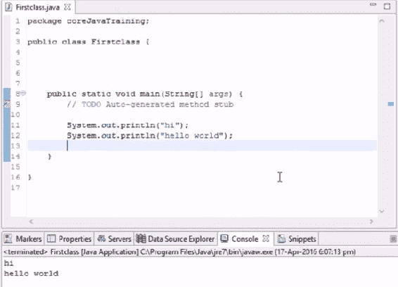

输出显示在两行上

观察到`hi`在一行上显示，然后`hello world`在下一行显示。在这里，`ln`将输出显示在下一行。如果我们从两个语句中删除`ln`并运行代码，消息将显示如下：

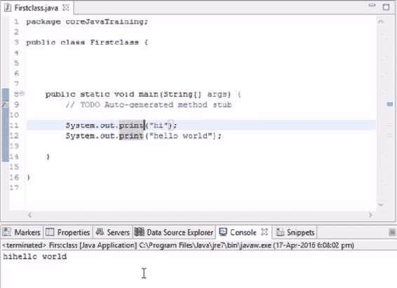

输出显示在同一行

我们看到`hihello world`在同一行打印。

如果我们编写代码，然后我们想部分检查输出，我们不需要删除代码行；我们只需要简单地注释掉它。我们可以通过在开头放置双斜杠（`//`）来注释掉它，这样 Java 就不会选择该行。这如下面的截图所示：

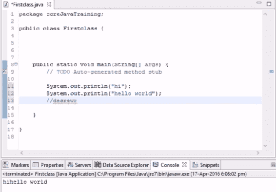

使用双斜杠进行注释

如果我们删除斜杠，并且语句只是一些随机单词，那么它将抛出错误。我们将看到一个带有交叉标记的红线下的代码。这意味着该行有错误。这如下面的截图所示：

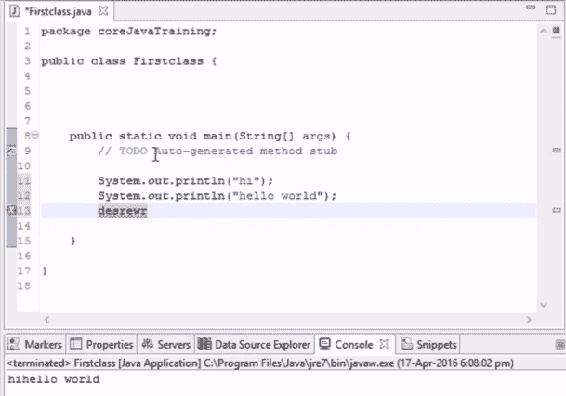

错误会在行号旁边用交叉标记标记

再次添加反斜杠以注释掉错误。

记住，在这里我们只在`main`块中编写我们的实际代码。如果我们想打印一个整数呢？

假设我们想打印数字`4`。要打印它，我们首先需要将其存储在变量中，然后我们将打印变量。所以当我们打印变量时，将自动打印表示该变量的值。对于这个例子，我们选择数字`4`，并将其赋值给名为`a`的变量。问题在于`a`不知道被分配了什么数据类型。因此，我们必须明确指出`a`是整数。如果我们没有指出`a`是整数，它将抛出错误。

简而言之，我们首先创建一个名为`a`的变量，它只作为整数使用，然后将整数值`4`放入其中。以下截图展示了我们正在讨论的例子：

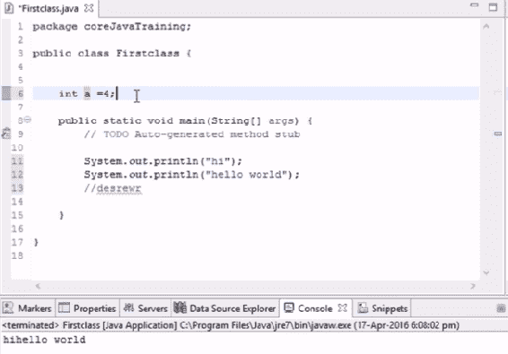

将值 4 赋给变量 a

因此，使用这种类型的代码，我们可以在外部输入，但如果我们想打印它，我们将在主块中输入。在这个例子中，我们想打印变量`a`的值，所以我们添加另一个`System.out.println(a)`语句。编辑器会在打印语句中的变量`a`上抛出错误。要了解错误是什么，我们将鼠标悬停在错误上，会显示一个弹出窗口，显示错误及其可能的修复方法，如下面的截图所示：

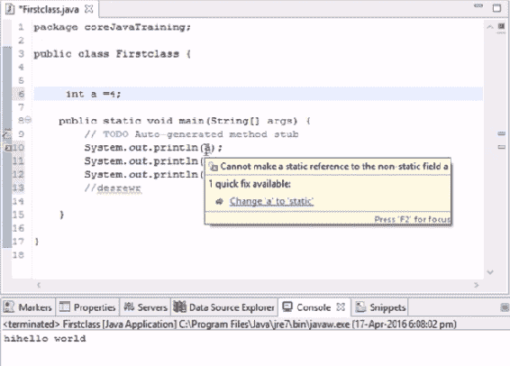

当鼠标悬停在其上时，会显示错误详情

错误详情中会有一个可点击的选项。这将自动通过添加所需内容来解决错误。这是编辑器的一个非常棒的功能，它在处理更复杂的例子时非常有帮助。

在我们的示例中，当我们点击错误详情弹出窗口中的`将 'a' 改为 'static'`时，`static`被添加到变量`a`中，我们能够运行代码。运行代码后，控制台将看起来像这样：

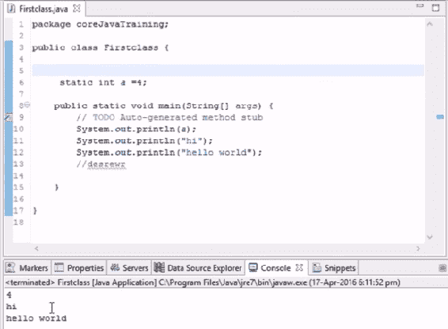

按照代码显示的 a 的值

我们将在后面的章节中详细探讨`static`究竟是什么。

# 概述

在本章中，我们对 Java 进行了简要介绍。然后，我们安装并配置了与 Java 一起工作的各种工具。继续前进，我们查看了我们将要用来编写自己的 Java 代码的编辑器。

最后，我们执行了第一个示例，看到了编辑器是如何工作的，以及它是如何处理错误的。

在下一章中，我们将学习一些基本概念，例如字符串、变量和方法，以及它们之间是如何不同的，我们将通过代码来了解。
