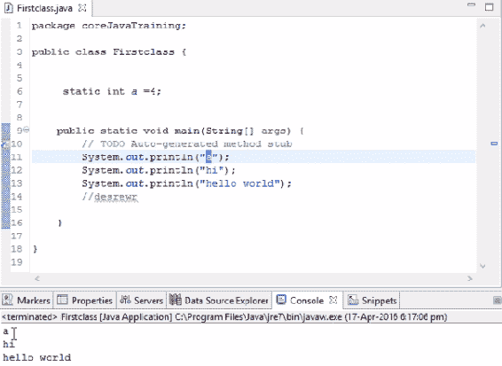
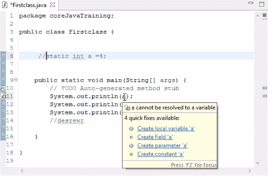
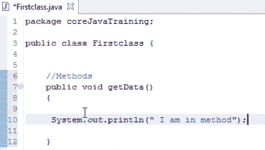
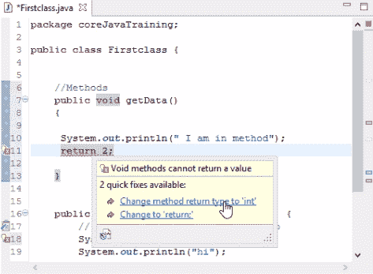
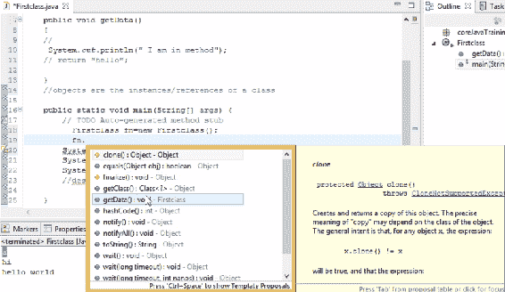
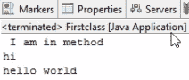
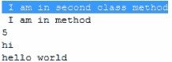

# 第二章：理解 Java 中的类、对象及其用法

在上一章中，我们简要介绍了 Java 以及我们将要输入代码的编辑器的安装方法。我们还编写并执行了在编辑器上的第一个代码。

在本章中，我们将深入探讨一些基本概念，例如字符串和变量，以及它们之间的不同。我们还将了解方法是什么，以及它们如何与不同的代码一起使用。我们将讨论对象在我们的代码中的重要性以及如何实现它们。

在本章中，我们将涵盖以下主题：

+   字符串和变量的区别

+   使用方法

+   Java 中类和对象的重要性

# 字符串和变量的区别

在第一章，“Java 中的第一步编程”，我们打印了一个字符串和变量。如果我们仔细观察，当我们打印一个变量时，我们并没有使用双引号，但是当我们打印一个字符串时，我们使用了它们。这是因为值已经存在于变量中，所以我们不需要使用任何双引号。如果我们使用它们，Java 会将其视为字符串，并且输出将像以下示例中的字母`a`一样打印。如果我们运行这个程序并观察输出，字母`a`将按以下截图所示打印：



输出显示根据代码的 a 的值

如果我们不使用双引号，Java 将检查是否有任何变量被定义为这个字母。如果有，它将打印该变量中的值。如果没有定义任何变量，那么它将给出一个错误。如果我们注释掉变量声明，我们会看到一个错误。将鼠标悬停在变量上，我们会得到一个提示说创建一个局部变量`a`，或者我们可以通过添加双引号来使用它：



提供代码错误纠正建议的快速修复下拉菜单

简而言之，如果我们简单地使用双引号，变量将被视为字符串，但如果我们不使用双引号，我们必须在某个地方声明变量。这就是打印字符串和打印变量之间的区别。

# 使用方法

基本上，方法是我们 Java 类中的代码块。让我们在这里写一个代码块作为例子，并观察开闭括号放置的位置。以下示例显示了一个完整的代码块：

```java
public void getData()
{
    static int a=4;
}
```

在这段代码中，我们给代码块命名为`getData()`，而`void`是这个方法的返回类型。

如果我们期望从方法返回一个数字，并且这个数字是一个整数，那么我们必须在`void`的位置写上`integer`。同样的规则也适用于字符串；如果我们计划从`getData()`方法返回一个字符串，那么我们必须将其声明为`string`。如果我们不返回任何内容，也就是说，如果我们只是写了几行代码，那么我们将其保留为`void`。

看看以下截图：



对于`getData()`，返回类型被指定为`void`。

在这里，我们没有返回任何内容，所以我们将其保持为`void`。

让我们在`System.out.println(" I am in method");`下面添加一行`return 2;`。在这里，我们返回的是一个整数。这就是为什么我们会在这里收到错误。如果我们将鼠标悬停在`return 2;`上显示的错误上，你会看到一个建议，将方法返回类型更改为'int'：



快速修复下拉菜单会显示建议以纠正代码错误

点击建议后，我们的 IDE 会自动将返回类型修改为整数，错误消失。字符串数据类型的情况也是如此。

我们将在第十章“关键字 final 的重要性、包和修饰符”中讨论`public`访问修饰符。由于 Java 中有不同的访问修饰符，如`public`、`private`、`protected`和`default`，所以有很多要讨论的内容。我们将通过适当的示例查看每个访问修饰符，以便详细解释。现在，我们只需将所有访问修饰符视为`public`。

现在你可能想知道为什么这些方法存在于 Java 中。它们有什么用？

假设我们正在执行一段 10 行的代码块，例如，在页面上添加两个整数。现在每次我们到达需要添加两个整数的页面时，我们必须再次编写这 10 行代码。也许复制这 10 行代码对于单个实例来说可能无关紧要，但如果在整个项目中需要这个代码块 10 次呢？所以 10 页和 10 行代码在单个 Java 程序中就变成了 100 行代码，这是我们在复制。为了避免这种情况，我们将所有 10 行代码写入一个代码块中，例如命名为`getData`或其他任何名称。此后，每次我们需要输入这 10 行代码时，我们只需简单地调用`getData`方法。所有 10 行代码都会落入这个特定的代码块中，并会被执行。在这种情况下，我们避免了 10 次编写代码；我们只在方法中编写一次，并在需要时调用该方法。

让我们用一个例子来解释这一点：

```java
package coreJavaTraining;

public class Firstclass {

    public void getData()
    {
        System.out.println(" I am in method")
    }
    public static void main(String[] args) {
        System.out.println(a);
        System.out.println("hi");
        System.out.println("hello world");
    }
}
```

在前面的类中，我们将“我在方法中”视为我们之前提到的 10 行代码。我们想要调用这个方法，但在这里`getData()`块在`main`方法块之外，这意味着代码无法执行。要执行它，我们必须将其移动到`main`方法块内部。在大多数情况下，人们只是将代码复制到`main`方法块中，然后收到错误，因为不允许在`main`方法块中存在方法。方法应该写在`main`方法块之外，但类内部。如果我们把东西写在类外部，那就没有意义，因为 Java 不会捕获它。但是，如果我们把方法写在`main`方法块之外，我们如何将其放入`main`方法块中呢？为此，我们需要为定义方法的类创建一个对象。在这里，我们的方法是在`Firstclass`类中定义的，所以我们为这个类创建一个对象，然后我们可以通过这个对象访问类中存在的方法和变量。

在下一节中，我们将了解对象是什么，在哪里使用它们，以及如何使用对象调用方法和变量。

# Java 中类和对象的重要性

对象是类的实例或引用。因此，我们可以通过它们的对象来调用类中存在的方法和变量。我们不能直接调用方法和对象，我们只能通过它们的对象来使用它们。因此，首先，我们需要为类创建对象，然后我们才能在`main`类中调用方法。

让我们看看前面的例子来解释这一点：

```java
package coreJavaTraining;

public class Firstclass {

    public void getData()
    {
        System.out.println(" I am in method");
    }
    public static void main(String[] args) 
    {
        System.out.println("hi");
        System.out.println("hello world");
    }
}
```

既然`main`方法块已经在类中，为什么我们还需要为这个类创建一个对象并调用它呢？

答案是，除非我们创建一个对象来调用方法，否则`main`方法块将无法知道其外部的方法。有一个例外，那就是`static`变量，表示该方法为静态。因此，通常情况下，只有通过对象才能访问其他方法。

# 在 Java 中创建对象

首先，我们需要在类中为对象分配一些内存。内存可以通过在类名后跟`new`操作符来分配。然后我们为它定义一个对象名称。返回类型始终应该是类名。这是为类创建内存分配的语法。因此，前一个示例的内存分配代码将类似于以下内容：

```java
Firstclass fn=new Firstclass();
```

在这里，我们说`fn`是`Firstclass`类的对象。现在我们已经创建了一个对象，让我们看看我们如何访问它。

# 在 Java 中访问对象

要访问类的成员方法，我们写入对象名称，然后 `.` (点)。所有符合该类的成员方法都会在下拉列表中显示——这是 Eclipse 的另一个优秀特性。我们只需在下拉列表中查找方法，而不是通过代码搜索它。

在示例中，我们使用的是`getData()`方法。其余显示的方法都是 Java 的内置方法。观察方法是如何显示的：



下拉菜单显示编辑器可用的所有类方法

在点击`getData()`时，`getData()`块将被转移到调用对象所在的行，当我们运行程序时，代码将作为`main`块的一部分执行。访问代码最终将如下所示：

```java
fn.getData();
```

让我们看看这个示例的最终代码将是什么样子：

```java
package coreJavaTraining;

public class Firstclass {

    public void getData()
    {
        System.out.println(" I am in method")
    }
    public static void main(String[] args) 
    {
        Firstclass fn=new Firstclass();
        fn.getData();
        System.out.println("hi");
        System.out.println("hello world");
    }
}
```

因此，如果我们运行示例中给出的类，我们的结果将如下所示：



根据代码显示的“I am in method”

输出中我们看到的是`I am in method`；这是因为控制从内存分配行开始，创建一个对象，然后使用该对象调用该类的的方法。控制返回到`getData()`块并完成该特定块中存在的代码行；它执行打印语句，我们看到它被打印出来。这就是为什么对象在调用方法时是强大的。

同样的技术也可以用于调用整数。假设我们在`a`类中声明一个变量并给它赋值。我们可以在`main`方法中添加以下行来打印变量的值：

```java
System.out.println(fn.a);
```

这是在 Java 中使用类、对象和方法的一种方式；基本上我们是在封装。

# 在不同类中访问方法

假设我们面临一个情况，我们正在处理一个类，我们需要访问另一个类中的对象；在 Java 中可以这样做。让我们用一个例子来帮助解释这一点。让我们使用两个类，`Firstclass()`（来自*Java 中访问对象*部分），然后我们创建一个新的类，称为`secondclass()`。在创建新类时，编辑器会创建默认代码，我们可以在其中添加代码。我们添加一个随机方法，`public void setData()`，在其中我们打印`I am in second class method`语句。

现在，我们想在`Firstclass()`类中实现`setData()`方法。基本上我们想在`Firstclass()`中执行`setData()`方法。并且只能通过该特定类的对象来调用方法。为此，我们在调用另一个类中方法的方法中创建一个对象。我们使用与上一个示例中相同的代码来为对象分配内存。以下代码被添加到`Firstclass()`的`main`方法中：

```java
secondclass sn= new secondclass();
sn.setData();
```

在`main`类中编写代码时，当我们输入`sn.`来调用方法时，我们又将得到 Java 中所有方法的选项。由于我们想调用`setData()`，我们从与我们共享的多个选项中选择它。这将通过为该类创建一个对象，成功地将`setData()`带入`Firstclass()`的`main`方法中。

如果我们运行代码，我们将得到以下输出：



输出显示“根据代码，我在第二个类方法中”

# 摘要

我们首先讨论了字符串和变量之间的区别，以及它们在代码中的表现形式。然后，我们了解了方法是什么，以及如何使用它们来编写我们的代码。接着，我们讨论了类和对象的重要性，以及它们是如何被用来调用执行类的方法的。我们学习了如何为对象分配内存，并在执行代码时调用该对象的方法。最后，我们学习了如何通过对象访问另一个类中存在的方法。

在下一章中，我们将学习更多关于字符串的知识，并查看`String`类。
