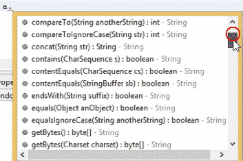
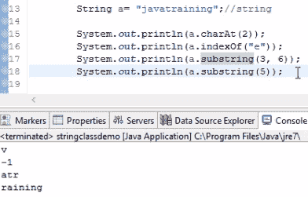

# 在 Java 中处理字符串及其功能

在本章中，我们将讨论字符串，并查看`String`类。我们还将学习如何定义字符串，并查看我们可以用哪些不同的方式定义字符串。然后，我们将讨论`String`类中的不同方法。最后，我们将编写一些简单的代码来反转字符串的内容，并检查反转后的字符串是否是回文。

在本章中，我们将涵盖以下主题：

+   字符串介绍

+   String 类及其方法

+   反转字符串的逻辑

# 字符串介绍

字符串是 Java 编程中最重要的概念之一。`String`是 Java 中预定义的类之一。因此，如果你想操作字符串，那么你可以简单地创建这个`String`类的一个对象，然后通过这个对象，你可以按照你的意愿操作字符串。你可以根据`substring`概念将字符串分成两部分。我们还可以连接两个字符串。所有这些都可以通过这个`String`类来完成。

让我们尝试自己操作一个字符串。创建一个新的 Java 类，并将其命名为`stringclassdemo`。

在几乎所有与 Java 相关的面试中，最常见的问题之一是程序员如何定义字符串。答案是你可以使用以下两种方式中的任何一种：

+   通过定义字符串字面量

+   通过创建 String 对象

现在，让我们逐个查看每种方法，以便了解声明字符串的不同方式。

# 定义字符串字面量

定义字符串字面量可以简单地这样做：

```java
        String a= "hello";
```

我们创建了一个名为`hello`的字符串，并将其存储在名为`a`的变量中。这就是我们定义`String`的方式，与定义字符串字面量相同。

假设你定义了另一个字符串，如下所示：

```java
        String a= "hello";
        String b= "hello";
```

不幸的是，即使`b`变量也有一个`hello`字符串，`a`变量也定义了相同的字符串。当 Java 程序编译这个时，它创建了一个名为`a`的`String`对象，并赋值为`hello`。

现在，在为这个`hello`字符串创建对象之前，`b`变量首先检查`String`池中是否已经定义了任何`hello`字符串实例。如果已经定义，它将简单地让`a`变量引用`b`对象，而不是单独创建另一个对象。

# 创建 String 类的对象

我们在以下代码行中创建了一个`String`类的对象：

```java
        String ab=new String();
```

现在，要创建一个`hello`字符串，你可以简单地传递一个参数给`String`类，如下所示：

```java
        String ab=new String("hello");
```

`ab`对象现在可以对这个`hello`字符串执行所有的字符串操作。

让我们再创建一个名为`b`的字符串，它也等于`hello`，如下所示：

```java
        String a=new String("hello");
        String b=new String("hello");
```

然而，这里已经使用`a`对象创建了一个`hello`字符串，当 Java 编译器到达`b`对象时，它还会创建一个额外的重复的`hello`字符串并将其分配给`b`，因为在这里我们明确地强制它为这个类创建一个对象。尽管已经存在一个重复的对象，但它仍然会为这个字符串创建一个对象；然而，在定义一个`String`字面量时，如果对象已经在`String`池中存在，它将不会创建它——相反，它直接引用已经创建的对象。

所以，这是使用`String`字面量对象创建字符串和单独使用`String`类创建对象之间的基本区别。最终，两者都支持`String`方法，但在定义字符串时，两种方法之间有一些区别。

我们刚刚学到的这两种方法有什么区别？这两个字符串都可以访问`hello`字符串，但你可以看到它们之间有一些区别。如果你在后台以字面形式声明字符串，那么 Java 会将`hello`分配给`a`变量。所以这是一种更直接创建字符串的方法，而不是使用对象创建方法。

在我们大多数常规 Java 工作经验中，我们更愿意使用`String`字面量。我们只需声明`a`等于`hello`，然后就这样。这就像你定义整数一样。但`String`是一个类，在后台，它为这个`hello`字符串创建一个单独的对象，而整数只是一个引用数据类型，所以后台不会发生任何事情。

让我们看看我们可以用我们创建的对象对这个`hello`字符串进行哪些操作。

# `String`类及其方法

我们有`a`变量，这个变量也充当一个对象。当我们输入`a.`到编辑器中，它会显示在该`String`类中存在的所有方法，如下面的截图所示：



它将字符串中的第一个字符读取为索引零，第二个字符为索引一，依此类推。当你在程序上工作时，如果你想获取索引二上的字符，你可以简单地使用以下语句：

```java
        Systme.out.println(a.charAt(2));
```

你将其打印到输出中，这样你就能看到那个字符。你可能想知道为什么我们需要从字符串中获取单个字符，但`charAt`方法经常被使用。在下一节中，我们将查看一个可以完全反转字符串的程序。

现在，我们只简要地概述一下这些方法。我们看到了如何获取特定索引位置上存在的字符。现在让我们尝试反转这个字符串。假设我们有存在的字符，我们需要找到该字符在字符串中存在的索引值。我们通过使用以下所示的`indexOf`方法来完成这个操作：

```java
        Systme.out.println(a.indexOf"e"));
```

运行这个程序。你可以看到字符 `l` 在 `2`，`H` 在 `0`，`e` 在索引 `1`，`l` 在索引 `2`。这就是如何借助 `String` 方法提取字符和索引。

但是，如果我只想从第一个字符开始提取到第三个字符的字符串呢？让我们看看下面的例子：

```java
        String a= "javatraining";
        a.substring(3, 6);
```

我们输入 `a.`，你可以看到有一个 `子字符串`。如果你想提取从索引 `3` 开始到索引 `6` 结束的字符串，这意味着 `j` 将在 `0`，`a` 在 `1`，以此类推。它从 `2` 开始，然后移动到 `3`，`4` 和 `5`，并打印出类似 `vatra` 的内容。

如果你想要从整个字符串中提取 `子字符串`，那么给出第一个字母的索引和最后一个字母的索引，这样我们的整个字符串就会在第一个和最后一个字母之间打印出来。记住，还有一个 `substring` 方法，使用这个方法，如果你不传递最后一个索引，只传递第一个索引，那么它将从索引 `5` 打印到字符串的最后一个索引，如下所示：

```java
        a.substring(5);
```

让我们打印输出并看看 `substring` 是如何提取的。这些结果如下面的截图所示：



在这里，`e` 的索引是 `-1`，因为在这个字符串中没有名为 `e` 的字母字符。每当没有内容时，它就会打印 `-1`。

这样就总结了 `substring`。如果我想将这个字符串与另一个名为 `rahul teaches` 的字符串连接起来，那么我这样做：

```java
        String a= "javatraining";
        System.out.priontln(a.concat("rahul teaches"));
```

存在于 `a` 变量中的 `javatraining` 字符串将与 `rahul teaches` 连接，并打印出 `javatrainingrahul teaches` 的输出。我们也可以使用 `a.length()`，这将给出从零开始的字符串的最大长度。还有一个叫做 `trim` 的类型。假设你的字符串中有一些空白字符，如下所示：

```java
        String a= " javatraining";
        System.out.println(a.trim());
```

在这里，字符串的第一个字符是一个空格，然后是其余的字符。如果你想删除这个空格，你可以简单地使用 `a.trim`。当你打印输出时，这个空格就会被删除。

如果你想将所有字母打印为大写，我们可以使用 `a.toUpperCase`。我们也可以通过使用 `a.toLowerCase` 来将它们转换为小写。

有一个更有趣的方法可以看看，那就是 `split`。基本上，我们可以根据我们的分隔符来分割整个字符串。为此，我们使用 `a.split()`。在这种情况下，我们想要根据代码中的斜杠来分割，如下所示：

```java
        String a= "java/training";
        System.out.println(a.split(/));
```

这意味着在 `/` 字符之前的整个字符串应该作为一个字符串分开，剩余的部分应该作为另一个字符串分开。这种方法不仅可以用来在斜杠处分割，还可以根据我们的需求分割，如下面的代码所示：

```java
        String a= "javatraining";
        System.out.println(a.split(t));
```

如果我们想要从`t`中分割我们的字符串，那么这意味着`java`将是一个字符串，而`raining`将是另一个字符串。因为我们会有两个字符串，所以我们的输出将存储这两个字符串在一个数组中，而这个数组的返回类型当然是`String`，因为它是在`String`中编写的，如下面的代码所示：

```java
        String arr[]=a.split("t");
        System.out.println(arr[0]);
        System.out.println(arr[1]);
```

如果你想要打印字符串的前一部分，那么它将被存储在数组系统的`0`索引中，而如果你想要打印字符串的第二部分，那么它将在数组的`1`索引中呈现。

我们在这里将要讨论的最后一种方法是`replace`方法，如下面的代码所示：

```java
        String a= "javatraining";
        System.out.println(a.replace("t", "s"));
```

在这里，我们想要将字符串中的`t`替换为一个随机的`s`。为此，我们使用`a.replace("t", "s")`，就是这样。打印出来后， wherever a `t` is present in the string, it will be changed to an `s`, and it will be printed in your output.

对于`String`方法来说，这基本上就结束了。你仍然可以通过使用`a.`并逐步遍历不同的方法来玩转它们，但这些都是我们在 Java 编程中使用的核心方法。

让我们尝试根据在本节中学到的方法解决一个例子。

# 反转字符串的逻辑

在本节中，让我们看看我们如何以相反的顺序打印一个字符串。这是雅虎面试中的一个问题。让我们为我们的例子创建一个`reversedemo`类。

我们有一个名为`Rahul`的字符串，我们想要输出为`luhaR`。还有一个概念我们需要注意：回文。如果你输入一个字符串，比如`madam`，并且我们反转这个字符串，它只会给出`madam`作为输出。这种类型的字符串被称为**回文**。以下代码中展示了一个回文的实例：

```java
package demopack;

public class reversedemo {

    public static void main(String[] args) {

        String s = "madam";
        String t= "";
        for(int i=s.length()-1; i>=0; i--)
        {
            t= t+ s.charAt(i);
        }
        System.out.println(t);
    }
}    
```

我们首先创建一个名为`s`的字符串和一个空字符串，名为`t`。我们创建这个空字符串是为了在`for`循环之后连接每个元素，以便在控制台以字符串的形式输出结果；否则，我们可能会得到如下所示的结果：

```java
m
a
d
a
m
```

使用连接逻辑，我们可以显示输出如下：

```java
madam
```

这是一个简单的逻辑，用于反转我们的字符串，并使用空字符串逻辑以字符串的形式显示它。我们使用了`charAt`方法并实现了我们的反转字符串。一旦我们有了反转的字符串，我们就可以很容易地将其与原始字符串进行比较——在我们的例子中，这涉及到将`t`字符串与`s`字符串进行比较，如果它们都匹配，那么我们可以打印出给定的字符串是一个回文。

忘记回文。这是字符串反转的概念。

# 概述

在本章中，我们介绍了字符串，这是 Java 中较为重要的类之一。我们探讨了定义字符串的不同方法。然后，我们研究了`String`类下的不同方法。我们查看了一些`String`类中最常用的方法，在最后一节中，我们通过一个反转字符串的示例来更好地理解`String`类。

在下一章中，我们将通过示例了解重要的循环和条件。
