# Java 程序的基础块——循环和条件

循环和条件是 Java 程序的基础。本章将通过示例帮助我们理解重要的循环和条件。在 Java 中学习这些循环和条件将使编写代码变得更加容易。

在本章中，我们将涵盖以下主题：

+   for 循环

+   if...else 条件

+   当前的 while 循环

+   嵌套循环

# 当前的 for 循环

让我们看看`for`循环是如何工作的。`for`循环是 Java 程序中最常用的循环之一，了解它是如何内部工作的非常重要。所以，假设我们想要使用`for`循环打印从 1 到 100 的数字。为了在`for`循环中按顺序执行数字 1 到 100 并写入它，我们将简单地写下：

```java
// 1 to 100

/*  for(initialization;condition;increment)
       {
       } */
    for (int i=0;i<100;i++)
    {
        system.out.println(i);
        }
}

```

由于我们想要打印`0`、`1`、`2`、`3`，我们使用`i++`。这意味着对于每个循环，它只增加`1`。在循环过程中，每次它也会检查前面的条件是否满足。所以，如果`1`小于`100`，它会进入循环；如果`2`小于`100`，它会进入循环。直到这个条件满足，它将一直循环。当`i`的值达到`100`时，`100`小于`100`，这是假的。那时，它将终止循环并退出。这里我们将使用一个基本示例：

```java
for (int i=0;i<5;i++)
    {
         system.out.println(i);
    }
```

要在 IDE 中以调试模式运行测试用例，请双击以下屏幕截图所示的位置：

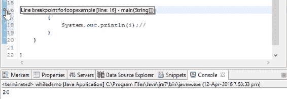

调试开始的行

当你看到蓝色图标时，通过点击类似昆虫的符号在调试模式下运行它。它将要求你在调试模式下启动。只需点击保存即可：

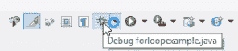

编辑器顶部的调试图标

你将在这里看到所有的变量值。一步一步地，我们将进入循环，并执行程序的下一步：

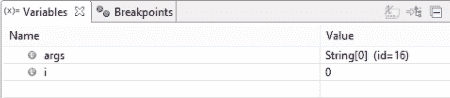

调试时的变量值

最后，当它达到值`4`，并且再次增加`1`后，它变成了`5`。注意，它在值变成`5`后没有进入循环，就退出了。这意味着条件不再满足，循环将运行五次。输出显示在下面的屏幕截图中：

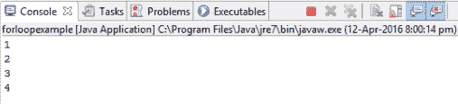

根据代码的最终输出

所以，这就是`for`循环的工作方式。

现在，如果我们把条件设置为以下内容，它将不会进入`for`循环，即使是第一次，因为条件是假的：

```java
for (int i=5;i<3;i++)
```

在调试模式下运行前面的条件时，整个循环将被跳过，输出中不会看到任何内容。

让我们看看另一个例子：

```java
for (int i=0;i<10;i+2 )
```

输出将是：

```java
0
2
4
6
8
```

这就是`for`循环在内部是如何工作的。

在下一节中，我们将学习`if...else`和`do...while`循环。

# if...else 条件

在我们学习`while`和`do...while`循环之前，我们将在本节中讨论`if`条件。在 Java 程序中，当使用`if`条件语句时，只有当条件满足时，`if`块中的语句才会执行。否则，将运行`else`块中的语句。此外，这种执行只发生一次。在`for`循环中，一个变量被初始化，循环一直运行，直到条件满足。

然而，在`if`的情况下，它不会一直循环。一旦满足`if`条件，它将进入循环一次；否则，它将进入`else`块。因此，控制将执行此`else`块中的语句，如下面的截图所示：

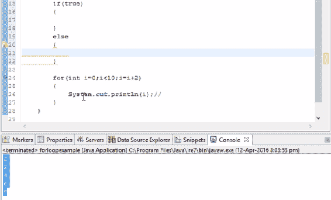

根据代码显示的 if...else 条件输出

但所有这些只发生一次，与`for`循环不同，在`for`循环中，条件满足直到它返回并执行。

让我们看看以下示例：

```java
    if(5>2)
    {
        System.out.println("success");
    }
    else
    {
        System.out.println("fail");
    }
```

下面的截图显示了这些错误：

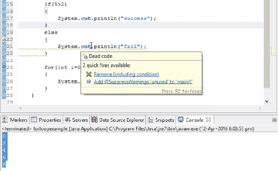

快速修复下拉菜单提供修正代码错误的建议

第一个错误是删除包含条件，这可以忽略。运行前面的程序，你会看到输出为`success`，因为进入的是条件`5`大于`2`为真：

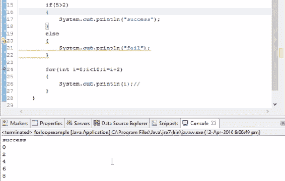

输出显示成功，如代码所示

如果我们更改条件并使`5`小于`2`，使条件为假，它将跳转到`else`块并执行`else`块中的语句。

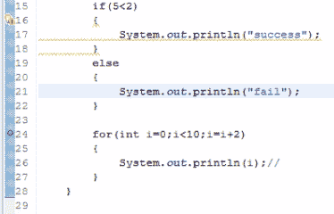

代码以输出失败

这次输出应该是`fail`，如下面的截图所示：

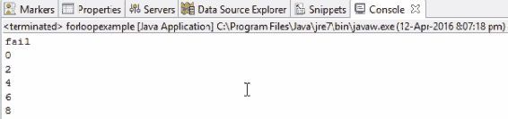

输出显示成功，如代码所示

这就是`if`条件的工作方式。

注意，如果你的块中只有一行，那么你可以去掉这些括号，因为最终它假设如果条件为真，则将执行下一行。这意味着如果你在你的块中只有一行，那么你可以去掉括号。但如果你想要有多个语句，如果你的条件为真，那么确保你在括号中写出这些语句以避免冲突。如果你没有指定括号，它仍然会打印为`success`，如下面的截图所示：

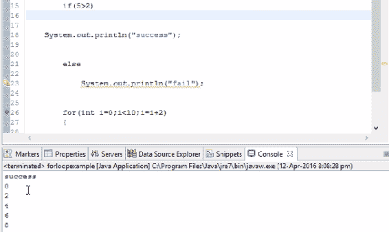

修改代码后输出显示成功

这里，`5`大于`2`。运行这个程序，程序将不使用括号运行。

现在，在添加一个额外的语句，比如`"second step"`，它会抛出一个错误，如下面的截图所示：

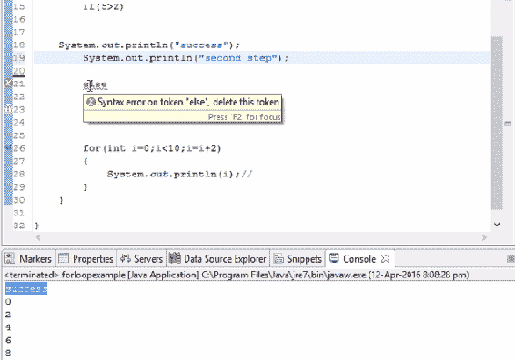

错误会在行号旁边的交叉标记中标记，显示语法错误

注意前一个截图中的语法错误。要么你应该保留一个括号，要么你应该避免这个步骤。为了消除这个错误，我们将整个块保留在括号中。这样，错误就会消失。

# 在`for`循环中引入`if...else`条件

现在，让我们将`if...else`条件引入`for`循环。让我们在我们的代码中添加以下内容：

```java
for (int i=0;i<10;i=i+2)
{
     if(i==8)
     system.out.println("print 8 is displayed");
     else 
        system.out.println("I did not find");
}
```

由于这里只有一个语句，我们不会在括号中写它。现在，让我们分析一下。值将从零开始进入`for`循环，直到值小于`10`。

进入`for`循环时，它会检查第一个值`0`是否等于`8`。由于它不相等，它会显示`"I didnot find"`。现在，第二次，将`2`加到`0`上（按照我们设定的条件）。请注意，这个新值仍然不等于`8`；因此，对于`0`、`2`、`4`和`6`这些值，输出将保持不变。接下来，当`8`进入`for`循环时，条件得到满足，并显示输出`" 8 is displayed"`：

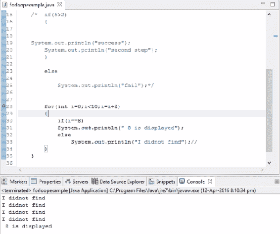

输出显示为`"8 is displayed"`和`"I didnot find"`。

现在，如果我们说`i=9`，它将永远不会被打印，因为我们设定的条件是`i+2`，这将是一个递增的偶数。这意味着条件没有得到满足，`if`条件之后的下一个步骤不会被执行。因此，我们可以这样说，如果条件为真，那么它才会被执行；如果不为真，则执行`else`块中的条件或语句。当你运行它时，你总是得到输出`"I did not find"`。

然而，如果我们写下以下语法，我们将得到输出为`"9 is displayed"`：

```java
for(int i=0;i<10;i=i+3)
```

这就是`if...else`条件在`for`循环中工作的方式。在下一节中，我们将详细了解`for`循环。

# `while`循环

在本节中，我们将详细了解`while`循环。首先，创建一个新的类。现在让我们看看我们如何在编写代码时利用这个`while`循环。假设我们想要按顺序打印从 1 到 10 的数字。我们如何使用`while`循环来打印这些数字？`while`循环的基本语法是：

```java
// While loop

while(boolean)
{

}
```

而在这里，如果布尔表达式返回`true`，则控制才会进入这个循环，而如果表达式返回`false`，则控制将不会进入循环。这就是你与`while`循环的基本简单概念。现在让我们假设我们想要从 1 到 10 引入数字。为此，我们将编写以下代码：

```java
//While loop 

//1 to 10

int i=0;
while(i<10)
{
      System.out.println(i);
}
```

如您所见，在前面的代码示例中，我们可以看到给定的条件是真实的。因此，它进入循环并打印`i`的值。这个循环会一直执行，直到表达式评估为`false`。根据我们的例子，条件始终为真；因此，它会进入无限循环并打印零。

这就是 `while` 循环的工作方式。除非这个参数中的条件变为假，否则这个循环永远不会停止执行。现在，如果我们打印变量后递增会发生什么？让我们看看我们这样做会发生什么：

```java
//While loop 

//1 to 10

int i=0;
while(i<10)
{
      System.out.println(i);
      i++;
}
```

输出将如以下截图所示：

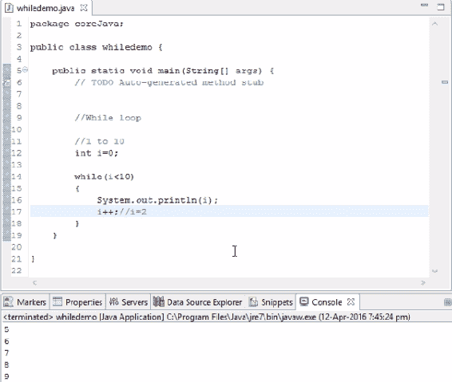

根据代码的 `while` 条件输出

如果我们使用以下条件：

```java
while(i<=10)
```

新的输出将是：

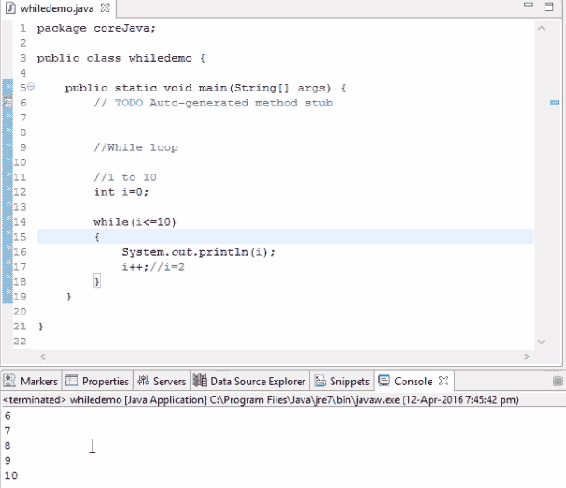

修改代码后的 `while` 条件输出

同样，你也可以反转条件，如下所示：

```java
//While loop 

//1 to 10

int i=10;
while(i>0)
{
      System.out.println(i);
      i++;//i=2
}
```

输出将无限循环，因为数字一直在增加，因为 `10` 大于 `0`。

如果我们使用递减条件，它将一直递减，直到条件变为假。之后，它将退出循环，如下面的代码示例所示：

```java
//While loop 

//1 to 10

int i=10;
while(i>0)
{
      System.out.println(i);
      i--;//i=2
}
```

上一段代码示例的输出将是：

```java
5
4
3
2
1
```

因此，这就是我们如何在 Java 程序中使用 `while` 循环语法。在下一节中，我们将看到如何处理 `do...while` 循环。

# `do...while` 循环

`do...while` 循环的语法是：

```java
do
{
}while();
```

让我们考虑以下示例，其中我们想要打印从 20 到 30 的数字：

```java
    int j=20;
do
{
    j++;
}while(j<30); // 1 loop of execution is guaranteed 
```

上述代码将输出 `20`、`21`、`22` 直到 `29`。因此，首先它执行，然后比较。

`while` 循环和 `do...while` 循环的基本区别在于，`while` 循环在没有评估布尔表达式的情况下不会执行，而 `do...while` 循环首先执行一个循环，然后评估是否运行更多循环。

让我们考虑以下示例，其中变量的值大于 `30`：

```java
int j=20;
do
{
    j++;
}while(j>30); // 1 loop of execution is guaranteed 
```

在这里，输出将是 `20`，而随后的脚本将终止，因为，如本节前面所述，在 `do...while` 循环中，保证执行一个循环。如果你在这个 `while` 循环中运行相同的逻辑，即使是第一次，它也不会执行。

因此，在下一节中，我们将尝试基于 `for` 循环、`while` 循环、`do...while` 循环和 `if` 条件的练习。这些程序将是非常好的动手学习，有助于理解循环。

在下一节中，我们将学习嵌套循环是如何工作的。

# 嵌套循环

这是一个最重要的概念之一。所有的编程逻辑都来自嵌套循环。如果你能掌握其背后的概念，那么你将很容易解决 Java 中的编程示例。所以，首先，我将写一个语法：

```java
for(int i=1;i<=4;i++)  // this block will loop for 4 times
{
}
```

上述语法表示循环将运行四次。如果我们再在上述块中写一个 `for` 循环会怎样？在循环中实现循环的概念称为 **嵌套循环**：

```java
     for(int i=1;i<=4;i++)  
     // (outer for loop) it will loop for 4 times
     {
         System.out.println("outer loop started");
         for(int j=1;j<=4;j++) //(inner for loop)
         {
             System.out.println("inner loop");
         }
         System.out.println("outer loop finished");
     }

```

因此，当我们完成前一个迭代一次时，一个循环系统就完成了。为了完成一个外层循环，我们必须完成所有四个内层循环。这意味着我们将不得不运行这个内层循环 16 次（四次乘以四次）才能完成这个外层循环四次。

输出结果如下所示：

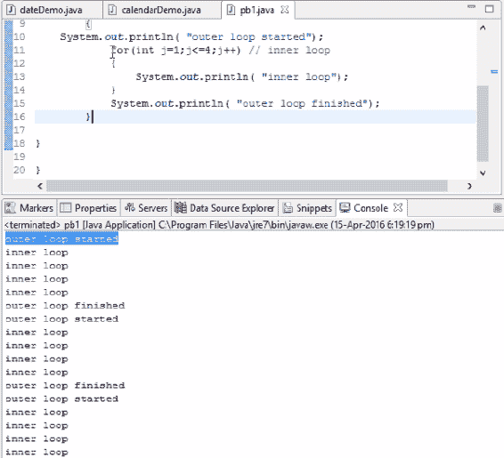

根据代码输出的嵌套循环

进一步学习，`for`循环的概念将被更频繁地使用。为了理解`for`循环的概念，让我们尝试解决几个示例。

# 示例 1

编写以下输出的代码：

```java
1 2 3 4
5 6 7
8 9
10
```

如我们从输出中观察到的，对于每一行，一个数字在递减。在这里，我们将探讨外循环和内循环的概念。代码如下：

```java
int k=1;
for(int i=0;i<4;i++)  
// (outer for loop) it will loop for 4 times
     {
         //System.out.println("outer loop started");
         for(int j=1;j<=4;j++) //(inner for loop)
         {
             System.out.print("k");
             System.out.print("\t");
         }
         System.out.println(" ");
    }
```

# 示例 2

编写以下输出的代码：

```java
1
2 3
4 5 6 
7 8 9 10
```

如您所见，本例中使用的输出与第一个示例的输出相反：

```java
int k=1;
for(int i=1;i<5;i++)  
// (outer for loop) it will loop for 4 times
     {
         //System.out.println("outer loop started");
         for(int j=1;j<=i;j++) //(inner for loop)
         {
             System.out.print("k");
             System.out.print("\t");
             k++;
         }
        System.out.println(" ");
     }
```

# 示例 3

以类似的方式，还有一个名为排序数字的程序

编写以下输出的代码：

```java
1
1 2 
1 2 3
1 2 3 4
```

上述输出的代码如下：

```java
    for(int i=1;i<5;i++)  
    // (outer for loop) it will loop for 4 times
         {
              for(int j=1;j<=i;j++) //(inner for loop)
              {
                  System.out.print("j");
                  System.out.print("\t");
              }
              System.out.println(" ");
         }
```

# 概述

通过使用简单的示例，我们学习了如何在 Java 中使用`if...else`条件语句。我们还看到了如何使用`for`循环和`while`循环来获取所需的输出。进一步学习，我们学习了如何使用嵌套`for`循环以特定模式获取输出。

在下一章中，我们将介绍一些重要概念，例如接口、它们的工作原理以及在 Java 中的使用。我们还将通过实际示例讨论继承。
