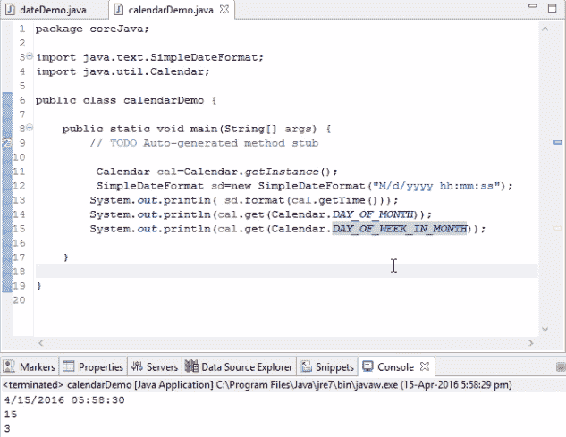

# 理解 Java 11 中的日期类和构造函数

`Date`类和构造函数是 Java 的重要组成部分。在本章中，我们将通过一些示例详细讨论这些内容。

在本章中，我们将涵盖：

+   `Date`类

+   `Calendar`类

+   构造函数

+   参数化构造函数

# `Date`类

为了理解`Date`类的概念，我们将首先为我们的`dateDemo`类创建源代码。假设我们想打印当前日期或当前时间。我们如何打印它？

有时，我们被要求将日期输入到当前日期字段中，我们需要从 Java 中获取它。在这种情况下，我们将使用`Date`类，它将给我们当前的日期和时间，以及以秒为单位的时间。因此，关于一天、一周、一个月、一年或小时的每个细节都可以通过 Java 类读取。Java 已经开发了一个名为`Date`的类，我们可以从中获取所有这些细节。以下截图显示了源代码：


显示使用日期类的源代码

基本上，我们需要使用那个特定类中的方法。为了使用那个类中的方法，我们需要创建那个特定类的对象。为此，让我们考虑以下代码语法：

```java
Date d= new Date();
```

这个`Date`类来自`util`包，`d`是包含日期和时间的`Date`类的对象。在前一章中，我们看到 Java 有一些包，如`java.lang`包，它捕获所有基本的 Java 内容，以及`java.util`包，这是我们拥有集合框架和`Date`类的地方。

前面的代码语法表明我们不知道`Date`类在哪里。为了使这个类在我们的 Java 文件中可用，我们需要导入`util` Java 包，因为`Date`类被封装在这个特定的包中。如果我们用它在前面类中导入包，你就可以成功使用那个日期。将鼠标移到这里，它会显示`import 'Date' (java.util)`，如下面的截图所示：


快速修复下拉菜单，提供纠正代码错误的建议

一旦点击它，你会看到：

```java
import java.util.Date
```

其中`util`是包，`Date`是一个类。

正如我们所见，`d`是包含日期和时间的对象，但我们如何打印它？因为它是一个对象格式，我们不能简单地使用以下：

```java
System.out.println(d)
```

要将其转换为可读文本，请参考以下截图：


将代码转换为可读文本格式

在这里，我们将`Date`转换为字符串，这样我们就可以在我们的输出中直观地看到它。如截图所示运行前面的代码，它打印出以下内容：

```java
Fri Apr 15 17:37:27 EDT 2016
```

这就是我们如何从当前系统的 Java 日期中打印整个日期、时间和月份。前面输出中的格式不是我们通常得到的，但它可能具有特定的格式，例如：

```java
mm//dd//yyyy
```

如果我们想要以前面的格式提取我们的日期，我们该如何做？

`d`对象提供了所有详细信息。但我们如何将这些详细信息转换为前面的格式呢？为此，我们将使用以下内容：

```java
       Date d= new Date();

        SimpleDateFormat sdf=new SimpleDateFormat("M/d/yyyy");
        System.out.println(sdf.format(d));
        System.out.println(d.toString());
```

前面代码语法的输出将是：


按照代码显示日期和时间

请参考以下 URL 以获取`SimpleDateFormat`格式代码：

+   [`www.tutorialspoint.com/java/java_date_time.htm`](http://www.tutorialspoint.com/java/java_date_time.htm)

现在，在修改对象和`SimpleDateFormat`代码后，我们看到以下内容：

```java
 Date d= new Date();

        SimpleDateFormat sdf=new SimpleDateFormat("M/d/yyyy");
        SimpleDateFormat sdf=new SimpleDateFormat("M/d/yyyy hh:mm:ss");
        System.out.println(sdf.format(d));
        System.out.println(sd.toString());
        System.out.println(d.toString());
```

输出将如下所示：


以新格式显示日期和时间

因此，我们实际上可以按照我们的要求格式化日期，并将其传递给`SimpleDateFormat`方法。我们可以将`d`对象放入一个参数中，这样它将以特定方式格式化。这就是 Java 中检索日期的方式。

在下一节中，我们将看到如何使用`Calendar`类。

# 日历类

在上一节中，我们探讨了`Date`类，我们学习了`Date`方法以及如何使用简单的日期格式标准来操作它们。在本节中，我们将学习`Calendar`类，它与`Date`类类似，但有一些额外功能。让我们看看它们是什么，以及我们如何使用它们通过`Calendar`类提取我们的日期格式。

首先，我们将创建一个具有不同名称的类以避免冲突。要创建`Calendar`实例，请运行以下代码：

```java
Calendar cal=Calendar.getInstance();
Date d=new Date();
```

步骤与`Date`类类似。然而，`Calendar`对象有一些`Date`不支持的独特功能。让我们来探索它们。

使用以下代码片段：

```java
        Calendar cal=Calendar.getInstance();
        SimpleDateFormat sd=new SimpleDateFormat("M/d/yyyy hh:mm:ss");
        System.out.println(sd.format(cal.getTime()));
```

前面代码的输出将是：


使用日历类显示日期和时间

现在，假设我们想要打印月份和星期几。我们将在前面的代码片段中添加以下行：

```java
System.out.println(cal.get(Calendar.DAY_OF_MONTH));
System.out.println(cal.get(Calendar.DAY_OF_WEEK_IN_MONTH));
```

输出将如下所示：



使用日历类显示日期、时间、月份中的天数和星期几

同样，我们可以从以下屏幕截图看到有多个属性可供选择：


显示日历类多个属性的下拉菜单

因此，在这里我们使用了`Calendar`实例来获取系统日期和时间，但在前面的类中我们使用了`Date`实例；这就是唯一的区别。在这个`Calendar`实例中有很多方法，你不会在`Date`类中找到。 

这就是根据我们的要求检索系统日期的方式。

# 构造函数

构造函数是 Java 编程语言中最重要概念之一。因此，在我们看到示例之前，让我们先了解什么是构造函数。

构造函数在创建对象时执行一段代码块。这意味着，每当我们为该类创建一个对象时，都会自动执行一个代码块。换句话说，每当创建一个对象时，都会调用构造函数。

所以构造函数在哪里使用，我们如何定义它？构造函数应该像方法一样编写，但方法和构造函数之间的唯一区别是构造函数不会返回任何值，并且构造函数的名称应该始终是类名。

要为这个类创建一个构造函数，我们将编写以下代码语法：

```java
public class constructDemo()
{
//
}
```

从前面的代码语法中可以看出，无论谁创建对象并调用构造函数，都会执行这个构造函数中写的内容。如果我们为前面称为`constructorDemo`的类创建一个对象，自动会执行这个代码块中的所有行。这就是构造函数的主要目的：

```java
package coreJava;

public class constructDemo {
    public constructDemo()
    {
        System.out.println("I am in the constructor");
    }
    public-void getdata()
    {
        System.out.println("I am the method");
    }
    // will not return value
    //name of constructor should be the class name
    public static void main(String[] args)  {
        // TODO Auto-generated method stub
        constructDemo cd= new constructDemo(); 
```

每当执行前面的行时，控制会自动检查是否存在显式定义的构造函数。如果已定义，它将执行特定的代码块。在 Java 中，每当创建一个对象时，都会调用构造函数。

前面代码的输出将是：

```java
I am in the constructor
```

我们实际上并没有为每个类创建构造函数，而是现在特别引入了构造函数的概念，因为在之前，我们在定义构造函数时没有使用任何概念。现在如果我们使用这个命令，程序仍然会运行，但这次它不会执行那个代码块。如果我们没有定义任何构造函数，编译器将调用默认构造函数。我们可能称之为隐式构造函数。

我们主要依赖于构造函数在实时中初始化对象，或者为我们的程序定义变量。构造函数和普通方法看起来相似，因为它们在括号中定义了访问修饰符，但不会接受任何返回类型，但在这种情况下它接受。因此，如果我们编写：

```java
public constructDemo()
{
    System.out.println("I am in the constructor");
    System.out.println("I am in the constructor lecture 1");

}
```

前面代码的输出将是：

```java
I am in the constructor
I am in the constructor lecture 1
```

因此，一般来说，人们使用前面的代码块来定义变量或在实时中初始化属性，然后继续使用构造函数。

在下一节中，我们将查看 Java 中另一个构造函数。

# 参数化构造函数

我们在上一节中学到的构造函数是默认构造函数，因为它不接受任何值。在具有相同语法的参数化构造函数中，我们实际上提供了一些参数，如下面的截图所示：


使用给定代码的参数化构造函数的输出

之前构造函数和这个构造函数之间的唯一区别是，在这里我们传递了参数，而在默认的构造函数中则没有传递任何参数。当我们运行我们的代码时，每当创建一个对象，如果我们没有传递任何参数，编译器会自动选择默认构造函数，如下面的截图所示：


当传递默认参数时的输出

现在，让我们为同一个类创建一个带有参数的另一个对象：

```java
constructDemo c=new constructDemo(4,5);
```

当我们按照前面提到的语法定义参数时，编译器在执行运行时检查是否存在具有两个整型参数的构造函数。如果找到了构造函数，它会执行以下代码语法：

```java
public constructDemo(int a, int b)
{
    System.out.println("I am in the parameterized constructor");
}
```

在没有定义参数的情况下，编译器会执行默认构造函数。前面代码的输出将是：

```java
 I am in the parameterized constructor
```

在运行时创建对象时，我们必须提供参数，因此在执行过程中，它会将参数与定义的构造函数进行比较。同样，我们可以为同一个类创建多个对象：

```java
constructDemo cd=new constructDemo();
constructDemo c=new constructDemo(4,5);
```

当两个构造函数一起运行时，输出将是：

```java
I am in the constructor
I am in the constructor lecture 1
I am in the parameterized constructor
```

现在，我们将创建一个类似类型的另一个构造函数，但这次只有一个参数：

```java
public constructDemo(String str)
{
    System.out.println(str);
}
public static void main(String[] args) 
{
    constructDemo cd=new constructDemo("hello");
}
```

输出将是：

```java
hello
```

因此，如果我们明确定义了某些内容，Java 编译器会优先选择显式构造函数，否则它会打印出隐式构造函数。这里需要注意的关键点是它不会返回任何值，并且构造函数必须只使用类名来定义。

# 摘要

在本章中，我们运行了一些代码示例，以了解`Date`类、`Calendar`类以及构造函数的工作原理。

在本章中，我们将探讨三个关键字：`super`、`this`，并讨论`finally`块。
