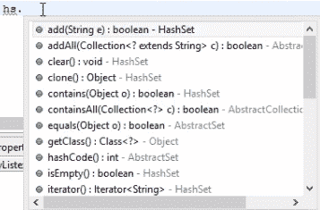

# 第九章：理解集合框架

在本章中，我们将深入探讨集合框架，该框架由接口和类组成。我们将查看三个主要集合：`List`、`Set`和`Map`。本章将讨论来自`List`集合的`ArrayList`、来自`Set`集合的`HashSet`以及来自`Map`集合的`HashMap`和`HashTable`。我们将通过查看示例来逐一介绍每个概念。

本章我们将涵盖以下主题：

+   集合框架

+   列表集合

+   集合集合

+   映射集合

# 集合框架

Java 集合框架基本上是一组接口和类的集合。为了高效编程或使用 Java 方法的灵活性，Java 设计了一个框架，该框架由不同的类和接口组成。集合框架有助于高效地存储和处理数据。这个框架有几个非常有用的类，它们提供了大量的有用功能，使得程序员的任务变得非常简单。

我们已经看到了许多关于数组和多维数组的概念。例如，在一个数组中，如果我们想从一个新的数组集中删除一个索引，我们可以使用集合框架来完成。假设在一个数组中有 10 个值，我们想删除第五个值，或者在第 5 个和第 6 个值之间插入一个值——在集合框架中，你将获得一些灵活的方法。

在接下来的章节中，我们将讨论这个集合框架中可用的方法类型，以及如何有效地使用它们。所以，为了给你一个概念，请记住，集合是一组类和接口。

我们将查看这个框架提供的集合。

# 列表集合

第一个集合是`List`集合/接口。列表是有序集合，有时我们也称其为序列。列表可以包含重复元素，就像数组一样，但数组与`ArrayList`之间有很多区别。你可以向这个`List`容器中插入多个值，它也可能包含重复元素。实际上，你可以从任何索引添加或删除任何值。比如说，你按顺序向列表中添加了 15 个元素，现在你想删除第 6 个元素，或者你想在第 10 个和第 11 个元素之间插入一个元素，或者你想知道一个元素在 15 个元素中的哪个索引。列表容器中有许多有用的 API 可以检索元素，而这些在数组中是得不到的。数组只能初始化；除此之外，你无法对数组执行任何方法，而使用`ArrayList`，你有很多灵活的方法可以操作。

`List`接口是一个集合，`ArrayList`、`LinkedList`和`vector`是实现了这个接口的三个类。这个接口提供了一组方法。它公开了一些方法，而这三个类在其类中使用这些方法。

在这三个中，让我们讨论一下`ArrayList`。这是最著名的一个，被大多数 Java 程序员使用。一旦你理解了`ArrayList`，你就可以轻松地了解`LinkedLists`和`vector`。在下一节中，我们将创建一个`ArrayList`类并实现`List`接口中的方法，以查看这些方法在检索或组织数据时的灵活性。当你有一组数据在容器中时，你可以通过`List`接口轻松地组织这些数据。

# `ArrayList`类

让我们从`ArrayList`类开始，它实现了`List`接口。创建一个新的类，命名为`arrayListexample`。我们将首先查看`ArrayList`中存在的方法，然后我们将讨论数组和`ArrayList`之间的区别。

我们首先声明`ArrayList`如下。如果你在你的 IDE 中悬停在`ArrayList`上，你会看到一个建议告诉你导入`java.util`以使用`ArrayList`：

```java
package coreJava;

public class arrayListexample {

    public static void main(String[] args) {

        ArrayList a=new ArrayList();

    }
}
```

一旦你这样做，它仍然会显示关于`ArrayList`的建议，并且如果你悬停在它上面，它会建议添加参数类型。为了移除这个建议，你可以向`ArrayList`传递一个参数类型，例如`Integer`或`String`：

```java
        ArrayList<String> a=new ArrayList<String>();
        a.add("rahul");
        a.add("java");
```

在传递参数类型后，你可以通过使用`a.`轻松地添加一些字符串实例，它将显示`ArrayList`支持的不同类型列表。对于`ArrayList`，我们没有定义特定的数组大小，而当你看到数组时，我们明确地定义了大小。在数组中，一旦我们定义了大小，就不能增加或减少大小。但在`ArrayList`中，你可以随时从列表中添加或删除元素，它是一个动态大小的数组。这是数组和`ArrayList`之间最基本的区别之一。

如果我们想要打印这个`ArrayList`，我们可以简单地通过添加以下代码行来实现：

```java
        System.out.println(a);
```

运行时，它将打印出`[rahul, java]`。但如果你想以数组的形式打印这个，我们需要写一个`for`循环。我们添加另一个对象，这次我们指定了字符串要放置的索引：

```java
        a.add("rahul");
        a.add("java");
        System.out.println(a);
        a.add(0, "student");
        System.out.println(a);
```

当我们打印这个时，它会给出以下输出：

```java
[rahul, java]
[student, rahul, java]
```

你可以看到，在第二行中，我们在列表中`rahul`之前添加了`student`，因为我们已经指定了它的索引为`0`。

如果我们想要从列表中删除一个条目，我们可以通过添加以下几行代码来实现：

```java
        a.remove(1);
        a.remove("java");
```

第一行代码将从列表的第一个索引处删除条目，而第二行将找到列表中的字符串并删除它。如果你想获取特定索引的条目，你可以使用`get`方法来实现：

```java
       a.get(2);
```

上述代码行将打印出`java`作为输出，因为它是在索引`2`处的元素。

假设你有一个包含 50 个元素的列表，你需要找出特定的字符串/整数是否存在于该列表中。如果你使用数组，你必须创建一个`for`循环来找出元素是否存在，但在`ArrayList`中，我们有一个`contains`方法会为我们检查整个列表，并以`true`或`false`的形式给出输出：

```java
        System.out.println(a.contains("java"));
```

这将输出`true`，因为元素存在于我们的列表中；如果你将其更改为，例如`testing`，它将返回`false`，因为它不在我们的列表中。

`ArrayList`中另一个有用的方法是`indexOf`方法。如果我们想从列表中找到特定元素的索引值，我们可以通过使用`indexOf`来知道：

```java
        System.out.println(a.indexOf("rahul"))
```

这将返回这个字符串的索引号。

现在，如果我们想检查数组是否为空，我们可以使用`ArrayList`中的`isEmpty`方法来做，它将返回`true`或`false`：

```java
        System.out.println(a.isEmpty());
```

这将返回`false`，因为我们的列表不是空的。

`ArrayList`中最后一个且最重要的方法是`size`方法，它返回列表的长度：

```java
        System.out.println(a.size());
```

关于`ArrayList`的另一件事是你需要知道的是，实现`List`接口的所有类都可以接受重复的值。我们知道在集合接口中扩展`List`的类：`ArrayList`、`LinkedList`和`vector`。并且所有这些类都可以接受重复的值。

# ArrayList 的示例

假设我们有一个包含重复数字的数组，例如 `{4, 5, 5, 5, 4, 6, 6, 9, 4}`，我们想要从这个数组中打印出唯一的数字，以及这个数字在这个数组中重复了多少次。我们的输出应该是“四个数字重复了三次，五个数字重复了三次，六个数字重复了两次，九个数字重复了一次。”

让我们把`ArrayList`的概念引入这里来解决这个谜题：

```java
package demopack;
import java.util.ArrayList;
public class collectiondemo {
    public static void main(String[] args) { 
        int a[] ={ 4,5,5,5,4,6,6,9,4}; 
        ArrayList<Integer>ab =new ArrayList<Integer>(); 
        for(int i=0;i<a.length;i++) 
        { 
            int k=0; 
            if(!ab.contains(a[i])) 
            { 
                ab.add(a[i]); 
                k++; 
                for(int j=i+1;j<a.length;j++) 
                { 
                    if(a[i]==a[j]) 
                    { 
                       k++; 
                    } 
                } 
                System.out.println(a[i]); 
                System.out.println(k); 
                if(k==1) 
                    System.out.println(a[i]+"is unique number"); 
            } 
        } 
    }
}
ArrayList with the ab object type. Then we create a for loop, and within it we use an if loop with !ab.contains to check whether the element is present within the loop. We need another for loop within this if loop to iterate through the remaining part of the array. The if loop within this for loop will work as a counter for us to increment the number of times a number is repeated in the array.
```

我们已经完成了`for`和`if`循环。我们打印出数组中的每个元素以及每个元素在数组中出现的次数。要打印唯一的数字，即不在数组中重复的数字，我们使用`if`循环并打印它。

这个例子就到这里了；你可以尝试用你自己的逻辑来编写这个例子。

# 集合的 Set

Java 中另一个重要的集合是`Set`集合/接口。`HashSet`、`TreeSet`和`LinkedHashSet`是三个实现`Set`接口的类。`Set`和`List`之间的主要区别是`Set`不接受重复的值。`Set`和`List`接口之间的另一个区别是，没有保证元素按顺序存储。

在本节中，我们将主要讨论`HashSet`。我们将举一个示例类来尝试理解这个概念。为这个部分创建一个类，命名为`hashSetexample`，并在类中创建一个对象以使用`HashSet`；它将建议你添加参数类型，在我们的例子中是`String`：

```java
package coreJava;

import java.util.HashSet;

public class hashSetexample {

    public static void main(String[] args) {

       HashSet<String> hs= new HashSet<String>();

    }
}
```

在你的集成开发环境（IDE）中，当你输入 `hs.` 时，它会显示 `HashSet` 提供的所有方法：



首先添加一些重复条目的字符串实例：

```java
        HashSet<String hs= new HashSet<String>();
        hs.add("USA");
        hs.add("UK");
        hs.add("INDIA");
        hs.add("INDIA");
        System.out.println(hs);
```

当你打印这个时，输出将如下所示：

```java
[USA, UK, INDIA]
```

我们可以看到，对于 `INDIA` 的重复条目，`HashSet` 会拒绝并只显示一个实例。

如果我们希望删除任何对象，我们可以使用 `remove` 方法，要获取列表的大小，则使用 `size` 方法：

```java
        System.out.println(hs.remove("UK"));
        System.out.println(hs.isEmpty());
        System.out.println(hs.size());
```

`isEmpty` 方法告诉我们列表是否为空——如果为空，它将返回 `true`，否则返回 `false`。

# 使用迭代器

要遍历列表中存在的每个元素，我们使用 `iterator` 方法。我们需要为这个 `Iterator` 类创建另一个对象，以及 `String` 参数类型：

```java
        Iterator<String> i=hs.iterator();
```

想象一下，我们有一组元素，并且它们从零开始按顺序排列，一、二、三等等。`iterator` 从零开始遍历每个元素，并打印出每个值对应的元素。我们为 `iterator` 创建了一个对象，并按以下方式打印值：

```java
        System.out.println(i.next());
        System.out.println(i.next());
```

第一次调用 `i.next()` 将打印零索引处的值，下一次 `i.next()` 实例将打印一索引处的值。如果我们有一个包含大约 100 个值的集合，我们将不得不使用 `while` 循环：

```java
        while(i.hasNext())
        {
            System.out.println(i.next());
        }
```

在这里，我们使用了 `hasNext` 方法，该方法检查集合中是否有下一个值。如果有下一个索引的值，它将返回 `true`，如果没有，则返回 `false`。在我们的例子中，它将返回 `true` 100 个值，然后返回 `false`，并退出 `while` 循环。

这就是如何使用 `iterator` 迭代 `Set` 接口中存在的对象。如果你在做自动化测试，比如 Selenium，你将频繁地使用这个 `while` 循环。

# Map 集合

我们还有一个名为 `Map` 的集合。我们将举一个例子，并在编写代码的过程中讨论 `Map`。此接口以键值对的形式接受值。

我们创建一个类，`hashMapexample`，并在其中定义 `HashMap`。`HashMap` 需要两种类型的参数，例如 `Integer` 和 `String`：

```java
package coreJava;

import java.util.HashMap;

public class hashMapexample {

    public static void main(String[] args) {

       HashMap<Integer, String> hm= new HashSet<Integer, String>();

    }
}
```

这里，`Integer` 是键，`String` 是值。现在，如果你在 IDE 中输入 `hm.`，你会看到 `HashMap` 中的一些方法；让我们使用 `put` 方法：

```java
        hm.put(0, "hello");
        hm.put(1, "goodbye");
        hm.put(2, "morning");
        hm.put(3, "evening");
```

`put` 方法以键和值的形式接收输入。此外，键的值需要是整数，也可以是字符串。键只是我们为值定义的东西。我们可以使用 `remove` 方法删除值：

```java
        hm.remove(2);
```

`HashMap` 中的 `entrySet` 方法以集合索引的形式存储每个键和值：

```java
        Set sn= hm.entrySet();
```

我们现在已将这个 `HashMap` 转换为集合。要遍历这个集合的每个索引，我们使用 `iterator`，就像在前一个部分中一样，我们使用 `while` 循环：

```java
        Iterator it= sn.iterator();

        while(it.hasNext())
        {
            Map.Entry mp=(Map.Entry)it.next();
            System.out.println(mp.getKey());
            System.out.println(mp.getValues());
        }
```

我们在这里需要使用 `Map.Entry`，因为每个索引中的元素都包含一个键和一个值，`Map.Entry` 帮助我们分离出键和值。当你打印这个 `while` 循环时，你应该得到以下输出：

```java
0
hello
1
goodbye
2
morning
3
evening
```

不使用 `Map.Entry`，将会抛出错误。这就是 `HashMap` 的工作方式。

# HashTable

还有一个名为 `HashTable` 的集合，但它与 `HashMap` 的操作方式相同。你只需要将 `HashMap` 改为 `HashTable`——就是这样。不过，`HashMap` 和 `HashTable` 之间还是有一点细微的差别。

`HashMap` 和 `HashTable` 之间的差异如下：

+   同步或线程安全

+   空键和空值

+   迭代值

# 同步或线程安全

这是两者之间最重要的差异。`HashMap` 是非同步的，也不是线程安全的。那么非同步是什么意思呢？这意味着如果有多个程序同时访问 `HashMap`，它会持续更新。现在假设有五个线程在 `HashMap` 上工作。这意味着五个不同的程序或线程可以同时访问 `HashMap`，这意味着没有同步。但在 `HashTable` 中，如果一个程序正在访问 `HashTable`，其他程序需要等待第一个程序释放 `HashTable` 资源。这是主要差异。另一方面，`HashTable` 是线程安全的，也是同步的。你应该在什么时候使用 `HashMap`？如果你的应用程序不需要多线程任务——换句话说，`HashMap` 更适合非线程应用程序。`HashTable` 应用于多线程应用程序。

# 空键和空值

`HashMap` 允许一个空键和任意数量的空值，而 `HashTable` 不允许在 `HashTable` 对象中存在空键和空值。假设你正在将员工记录输入到数据库中，当你在数据库中上传员工详细信息时，也许你不知道他们的电话号码，但你可以现在在键值和索引值中输入一个名为电话号码的字段；你现在可以将其留为空；你可以在以后更新它。这在 `HashMap` 中是可行的，但当你在使用 `HashTable` 时，它将不允许任何空键和空值。如果你觉得你想让你的程序非常安全，并且你想阻止多个线程同时访问它，那么你应该选择 `HashTable`。`HashTable` 是线程安全的，并且它不会在另一个程序完成对 `HashTable` 的操作之前释放其对象。

# 迭代值

`HashMap` 对象的值通过使用 `iterator` 进行迭代。除了 `vector` 类之外，`HashTable` 是唯一一个使用枚举器来迭代 `HashTable` 对象值的类。

在 `HashMap` 和 `HashTable` 之间，操作是相同的，除了我们刚刚描述的三个差异。

# 摘要

在本章中，我们探讨了集合框架和三种类型的集合：`List`、`Set`和`Map`。我们在`List`集合中探讨了`ArrayList`，并且还探讨了`ArrayList`的一个示例。`Set`集合与`ArrayList`不同——主要区别在于`Set`不接受重复的值。在最后一个集合，即`Map`集合中，我们看到了两种类型，`HashMap`和`HashTable`，以及两者之间的区别。
