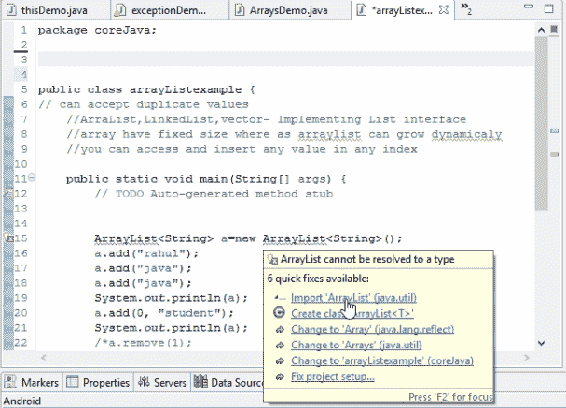
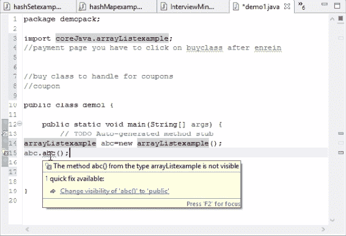
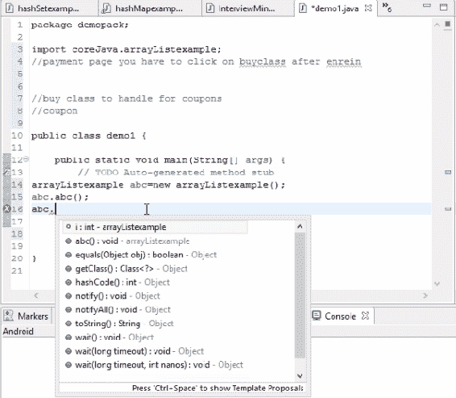
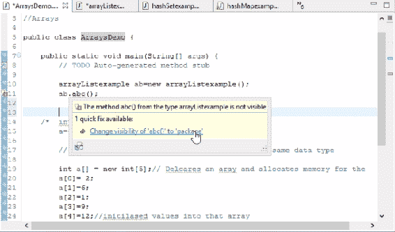

# `final` 关键字、包和修饰符的重要性

这是本书的最后一章。在这里，我们将处理一些更重要的概念，这将帮助我们编写和执行更好的代码。

在本章中，我们将探讨以下概念：

+   `final` 关键字

+   包

+   Java 中的修饰符

# `final` 关键字

首先，我们将创建一个新的类。如果我们声明任何变量为 `final`，这意味着该值不能再更改。让我们考虑以下代码：

```java
package coreJava;

public class finaldemo {

    public static void main(String[] args) {
        //TODO Auto-generated method stub
        final int i=4; //constant variables
    }
}
```

如您所见，我们已将整数值声明为 `4`。这意味着我们无法将此值更改为另一个数字。如果我们尝试这样做，它将抛出一个错误，表示 `移除 'final' 修饰符的 'i'`。如果我们想使一个值保持不变，这个关键字很有用。

如果我们将一个类标记为 `final`，它将抛出一个错误，因为当我们更改访问模式为 `final` 时，我们无法将其用作父类。换句话说，我们将无法从它继承属性。如果我们想继承属性，我们需要将其改回 `public`。`final` 关键字的逻辑是，一旦写入，我们就不能重写 `final` 方法。因此，这些是唯一的，不能再次使用相同的名称。

`final` 关键字可以在方法级别使用，以确保该方法不会被重写。在变量级别使用，以确保我们不会更改它，并且它也可以在类级别使用，以确保我们不会继承那个父类。

但请记住不要混淆 `final` 和 `finally`。`finally` 与 `try...catch` 异常有关。一旦执行了 `try` 或 `catch` 块，并前置任何错误，无论脚本是否通过，控制器都会来到这个日志并执行代码。`finally` 是关于限制访问的，例如我们无法使用它，继承它，甚至更改其值。我们已经探讨了包，以及如何将包导入其他类。我们已经探讨了接口的继承、运行时多态、字符串等等。这一切都是关于关键字。

在下一节，我们将学习关于包的内容。

# 包

当为每个 Java 类编写脚本时，会自动出现一个预填充的行。它是 `package coreJava`。由于我们在 Java 中创建了一个包，并将所有 Java 类放入该 `coreJava` 包中，所以我们将其视为 `package coreJava`。

包不过是类和接口的集合。例如，Java 自带一些内置包，如 `java.lang`；如果我们导入此包，只有在这种情况下，我们才能访问基本的基本方法，如 `public static void main`、整数或数组。所有这些类都来自这个 `java.lang` 包。定义包名很重要，因为没有它，我们无法访问包内存在的类。这是因为 `java.lang` 是默认包，并且它包含在 Java 编译器本身中。

我们还有一个包，`java.util`。我们在处理集合时使用了这个包；我们导入了`java.util`包。为了工作在`ArrayList`上，这个类位于`java.util`包中。因此，如果我们移除`import java.util.ArrayList`，它会抛出一个错误，因为它不属于`java.lang`。所有集合接口都来自`util`包。

但我们如何知道使用什么关键字？以下截图显示了如果我们悬停鼠标，Eclipse 会显示什么：



快速修复下拉菜单显示建议以纠正代码错误

我们正在导入`java.util`包。并且从那个包中，我们正在导入`ArrayList`类。它的语法将是：

```java
import package.classname
```

在这里，我们在这个 Java 类中使用`ArrayList`的原因是因为我们知道`ArrayList`位于`java.util`包中。但在使用 Eclipse 时我们不需要记住它。当你只是将鼠标悬停时，它会建议我们导入包，我们只需点击它。它将自动导入那个特定的包。

`HashSet`从相同的`util`包中导入`HashSet`类。如果我们去`HashMap`，它会带来`HashMap`。因此，每当我们想要工作在某个测试上时，我们需要导入那个包或类。`System.out.println()`也只来自一个包，但它们来自`java.lang`，这是一个内置的编译器。这些都是在 Java 包内建。

同时，我们也可以定义一个用户定义的 Java 包。在这种情况下，所有我们的测试用例都在一个名为`coreJava`的不同包中。如果有人想使用我们的类，他们只需要运行`import coreJava.classname`。

在下一节中，我们将查看`public`修饰符。

# Java 中的修饰符

有四种类型的访问修饰符：

+   `public`

+   `private`

+   `protected`

+   `default`

我们在这里不会讨论理论，因为您可以在 Google 上找到它。我们需要一个实际的方法，即这些访问修饰符的确切使用位置，或者包的确切导入位置。每当我们在整本书中创建方法时，我们每次只是使用`public`并编写方法。其他三个访问修饰符的工作方式类似。

现在我们来尝试理解每个这些访问修饰符如何帮助我们。

# `default`

如果我们没有提到任何访问修饰符，我们的 Java 类会自动认为它有一个`default`访问修饰符。如果是`default`，这意味着你可以在你的包中的任何地方访问这个方法。但如果你走出这个包，那么你将无法访问这个方法。即使我们将`package.classname`导入我们的新包中，如果我们没有将其指定为`public`，我们也将无法访问这个方法。如果你不指定它，那么默认情况下它认为它是一个`default`访问修饰符。`default`访问修饰符可以在包内任何地方访问，但不能在包外。

在`Packages`部分，我们导入了这个包并尝试使用它。正如你在以下截图中所看到的，第 15 行出现了一个错误：



快速修复下拉菜单，建议纠正代码中的默认错误

如果我们没有指定任何内容，我们就无法访问它，因此它与默认功能相同。这也适用于变量：

```java
public class arrayListexample {
    // can accept duplicate values
    //ArrayList, LinkedList, vector- Implementing List interface
    //array has fixed size where arraylist can grow dynamically
    //you can access and insert any value in any index
    int i=5;
```

如我们所见，在前面的代码中我们声明了一个整数。然而，它不会是`public`的；它是`default`。因此，我们无法在包外访问这个变量。如果我们导入它，我们将能够访问类但不是方法。如果我们想要访问，我们必须将其写为`public`。那么`public`访问修饰符做什么呢？

# `public`

在将方法或变量设置为`public`后，我们将能够在所有包中访问它。这意味着基本上是任何地方。对这个类这个包没有限制。前一个截图观察到的错误也会在我们将方法/变量设置为`public`时出现。

以下截图显示了我们将`int`值设置为`public`后的情况：



快速修复下拉菜单，建议纠正代码中的公共错误

在下一个类中，我们将探讨`private`和`protected`访问修饰符是什么。在这个之后还有两个更多的访问修饰符，让我们看看它们的作用。

# `private`

如果我们将我们的方法或变量标记为`private`，那么我们无法在类外访问它们。它们不能在包外或同一类外被访问。如果我们想在我们的`ArraysDemo`示例中访问这个，我们无法做到。即使我们尝试这样做，也会抛出一个错误，如下一个截图所示：



快速修复下拉菜单，建议纠正代码中的私有错误

这是因为，如果我们将任何方法或变量标记为`private`，我们就无法在特定类外访问它。除非我们将其更改为其他内容，否则它会抛出一个错误。这也适用于变量。

如果你想看到一个实时场景，比如说你正在支付并购买一个产品；所有的信用卡详情都会被当作`private`，因为它们不会在购买类之外被访问。如果它们可以被访问，那就是一个安全漏洞，对吧？所以为了使信用卡详情仅限于那个特定的类，开发者会将`private`变量赋予所有卡详情，这样其他类就不能使用它。即使他们使用了继承或导入了一个包，他们也无法访问那些敏感详情。还有很多实时场景；如果你正在开发测试框架，可能会有一些变量你不应该更改，并且始终将其保持为私有。

# `protected`

如果我们将变量或方法定义为 `private`，我们只能在子类中访问它们。这意味着如果我们将其定义为 `protected`，那么无论哪个类继承父类，只有那些子类才能访问该方法，其他类则不能。这一点可以通过以下代码片段来理解：

```java
protected void abc() {
    //TODO Auto-generated method stub
    System.out.println("Hello");
    }
```

`default` 和 `protected` 的区别在于，在 `default` 情况下，我们只能在同一个类包内访问一个类。即使是 `protected`，也能访问同一个包内的所有类，但它有一个额外的特性。这个额外的特性是指，如果我们想在其他包中访问它，只有继承父类属性的子类才能访问它。

同样的概念也适用于变量。

# 摘要

在本章中，我们学习了有助于我们理解包、修饰符和 Java 中的 `final` 关键字重要性的概念。

现在你已经阅读了所有章节，我希望你对这些概念有了更好的理解。
