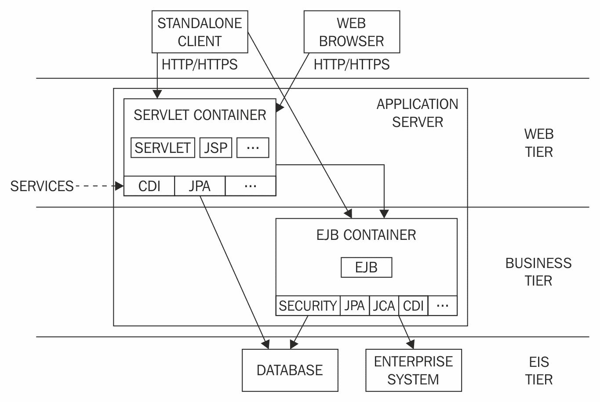
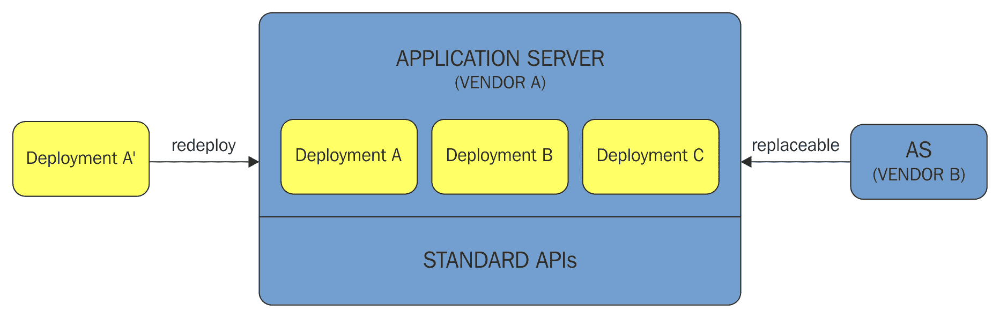
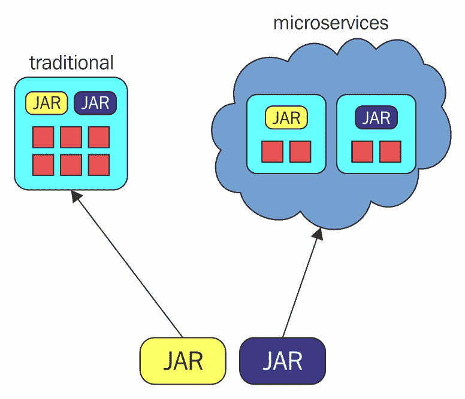
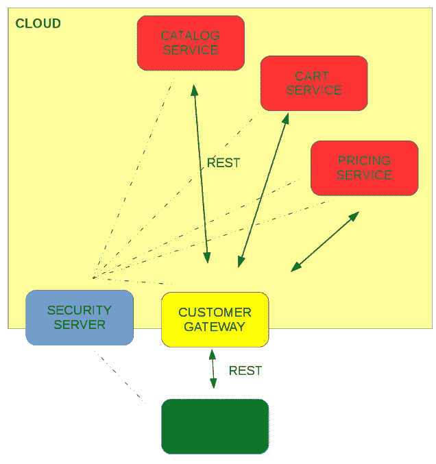

# Java EE 和现代架构方法论

在本章中，我们将向用户概述当前**Java** **企业版**（**EE**）的状态及其在现代架构方法论中的相关性，即**微服务**和**云计算**。我们将介绍本书中将使用的工具以及我们将要开发的应用程序。

让我们先回顾一下关于 Java EE 的几个基本事实。

# Java EE

在绘制 Java EE 架构之前，让我们快速了解一下该标准是如何创建的过程。

# Java 社区进程

Java EE 是一个为使用 Java 编程语言构建企业应用而设计的标准。它包含一系列规范，这些规范定义了标准实现所需的功能。

构成 Java EE 的规范是在一个开放、基于社区的过程中开发的。组织和个人用户都可以加入其中并参与开发。

作为一种标准，Java EE 可能具有多个实现。愿意创建 Java EE 认证产品的供应商必须通过一项技术合规性测试，这保证了产品与标准的一致性。

该标准为企业应用开发者和标准实现供应商之间的合同提供保障。应用开发者可以确信他们的应用将得到支持并且是可移植的，因为存在多个标准实现；他们不依赖于单一供应商。应用开发者可以自由地在不同的标准实现之间迁移他们的应用。

重要的是要注意，该标准并不决定服务器实现的细节。因此，供应商必须竞争以提供最有效、最稳健且易于使用的实现。

总结来说，Java EE 标准为企业应用开发者提供了编写受支持和可移植应用的能力。此外，基于社区的规范开发过程和供应商之间的竞争有助于标准的演变，并使用户能够根据需要选择最佳实现。

另一方面，Java EE 作为一种标准实现的事实导致其演变和决策过程比替代框架慢。在一个技术发展迅速的世界里，这成为一个更大的问题。因此，最近，人们努力重构标准和规范创建的方式。Java EE 正在转型为 EE4J，这是一个在 Eclipse 基金会治理下开发的标准。我们将在最终的第十二章：*未来方向*中回到这个话题。

# Java EE 应用程序的基本架构

Java EE 应用程序是用 Java 语言编写的，并在**Java 虚拟机**（**JVM**）上运行。在标准 Java SE 功能之上，Java EE 实现提供者实现了一系列服务，这些服务可以被这些应用程序使用。此类服务的例子可能包括安全、事务或依赖注入。

应用程序不直接与企业服务交互。相反，规范定义了**组件**和**容器**的概念。组件是用 Java 语言编写的软件单元，其配置和构建方式与标准 Java 类类似。区别在于组件提供的元数据允许它使用 Java EE 实现提供的运行时运行。这种可能因组件类型而异运行时称为容器。容器负责提供组件所需的所有企业服务的访问。

例如，让我们看一下以下组件：

```java
package org.tadamski.examples.javaee;

import org.tadamski.examples.java.ee.model.Foo;

import javax.ejb.Stateless;
import javax.enterprise.event.Event;
import javax.inject.Inject;
import javax.persistence.EntityManager;

//1
@Stateless
public class FooDaoBean implements FooDao {

    //2
    @Inject
    private EntityManager em;

    public void save(Foo foo) throws Exception {
        //3
        em.persist(foo);
    }
}
```

前面的脚本展示了一个`ejb`组件（1），即`FooDaoBean`，它负责将`Foo`类型的对象保存到数据库中。

运行此组件的`ejb`容器将负责管理此组件的所有实例的池化以及它们的生命周期。此外，此具体组件利用了企业服务数量：依赖注入（2）、ORM 持久化（3）和事务（此类组件的默认设置）。

通常，Java EE 运行时的目标是处理企业应用的所有技术方面，以便应用开发者可以专注于编写业务代码。前面的例子演示了在 Java EE 中是如何实现的：应用开发者使用 POJOs 编写代码，配置最小化（主要由注解提供）。应用开发者编写的代码以声明性方式实现业务功能，向中间件告知其技术需求。

# Java EE 标准的范围

传统上，用 Java EE 技术编写的业务应用基于三层架构，即 Web 层、业务层和企业信息系统层：



应用服务器实现了 Web 和业务层。它可以被各种类型的客户端访问

Web 组件，如**Servlets**、JSPs 或 JAX-RS，允许实现 Web 层。它们能够响应来自不同类型客户端的 HTTP 请求。例如，JSF 可以方便地创建 Web 用户界面，而 JAX-RS API 允许实现 RESTful 服务。

业务层由 EJB 实现，这些是基于 POJO 的池化组件，允许轻松实现事务操作，并提供广泛的特性，如安全、数据库、外部系统集成、远程访问或依赖注入。

尽管从宏观角度看架构非常直接，但它非常灵活，允许实现各种企业应用程序。此外，该标准在多年中不断发展，为广泛的业务使用提供了工具。

如果你查看 Java EE 规范（进一步阅读，链接 1），你将能够看到所有属于标准规范的部分。它们的共享量一开始可能会让人感到有些吓人。需要注意的是，在大多数情况下，你只需要处理其中的一小部分。另一方面，当你的应用程序需要任何类型的业务功能时，所需工具很可能已经集成在整个平台中，并且易于使用。

# Java EE 标准的实现

Java EE 标准实现是运行时，允许我们运行组件，并为他们提供 Java EE 标准中指定的服务。这样的运行时被称为**应用程序服务器**。

应用程序开发人员根据规范创建组件。这些组件被组装成存档，可以在应用程序服务器上部署。

应用程序服务器允许部署多个应用程序。此外，正如本章开头所暗示的，一个应用程序可以更改服务器实现，并使用来自其他供应商的应用程序服务器部署存档：



# 当前开发趋势

应用程序的开发方式随着时间的推移而演变。让我们概述一下近年来对软件开发产生重大影响的几个概念：云计算和微服务。

# 云计算

云计算是一种基础设施，使得能够按需自动配置计算资源。提供的资源类型取决于云服务提供商与客户之间的合同——云服务提供商可以提供软件服务，如电子邮件或磁盘存储，软件开发平台，虚拟机的访问，或运行软件应用程序的基础设施。

资源通过互联网动态和快速地提供，因此客户能够使用（并支付）他们当前使用的资源。另一方面，云服务提供商可以利用规模经济：专业化和资源的最优使用将导致质量提升和成本优化。

那么，从开发者的角度来看，与云计算基础设施的交互是什么样的呢？在开发过程中，云服务提供商提供了一个包含许多工具的平台：它使开发者能够运行多个应用程序框架、独立服务和数据库等。它提供了这些应用程序所需的功能和工具：扩展、网络、安全和通信。此外，如之前所暗示的，用户只为使用的资源付费；云基础设施将根据你的应用程序使用的负载调整提供的资源。

上述描述听起来很有希望，但它立即引发了许多问题，例如资源是如何分配和扩展的，我可以使用哪些类型的工具，以及提供的工具的 API 是什么。

本书的一个目标是在整个过程中为你提供所有这些信息。为了介绍章节的目的，承认最重要的信息就足够了：云计算基础设施将使我们能够使用按需提供的计算资源，利用各种工具进行开发和部署。

# 微服务

微服务架构是一种软件开发方法，它提倡从松散耦合的服务中创建一个应用程序，这些服务相互协作。

这样一种架构在长时间内被研究和宣传：不久前，人们对**面向服务的架构**（**SOA**）给予了大量的关注。更早之前，用于分布式计算的**CORBA**标准已经被设计出来。此外，使用松散耦合、高度内聚的服务来构建你的应用程序是一种良好的软件开发实践，并且它（以及应该）也可以应用于传统的单体应用程序。那么，为什么会有这个新概念的产生，它与什么不同？

在近年来，许多构建大型分布式系统的公司发现使用传统的单体软件架构来构建和维护他们的系统变得越来越困难，并决定将他们的系统重构为松散耦合的模块化分布式系统。观察那些成功做到这一点的公司的经验，我们能够收集到他们在构建的系统中的共同架构模式。这催生了微服务架构的概念。换句话说，微服务可以被看作是分布式计算系统的另一轮迭代，其特性是从实践经验中得出的。因此，而不是提供一个所有有志于实施者都必须遵守的微服务架构的定义，更容易提供一个微服务系统共有的特征集（进一步阅读，链接 2）。现在就让我们来做这件事。

微服务被构建为独立的、可独立部署的服务。从技术角度来看，这意味着它们在不同的进程中运行，并通过它们的 API 通过网络进行通信。每个服务都可以独立启动、停止和更新。每个服务对其自己的数据负责，并且只能通过它们的 API 修改其他服务的数据。

系统被分解为围绕业务功能的微服务。每个微服务都是由一个由所有必要的专业技术专家组成的小团队构建的。例如，在一个商店应用程序中，可能有一个评论服务。评论服务团队可能包括程序员、数据库工程师、测试员和领域专家。该团队负责该服务的各个方面——从获取客户反馈到数据库管理。

正如你所见，成功的微服务实践者并没有宣传一套应用应该遵守的推荐特性，而是创造了一个强制模块化和松散耦合的技术环境。

那么，如果你成功实施了微服务架构，你将获得哪些好处？

# 实施微服务的优势

首先要强调的是，如果你成功创建了一个具有强制模块化和松散耦合的架构特性的系统，你将获得一个高度模块化的系统，因为即时的修复和扩展不会妥协，并且在整个开发过程中有效地放弃服务之间的边界。

由于开发应用程序的模块化特性，构成它们的组件可以更有效地开发：由于每个服务都有一个小型、交叉团队在开发，其成员可以相对独立于其他团队地专注于自己的工作领域。正如实践所表明的，随着团队的增长，沟通开始越来越多地阻碍工作。小型、专注的团队对领域非常了解，他们也彼此了解，可以立即沟通，并推进工作。

此外，一个关键的事实是，该服务可以独立于其他服务进行部署。一个成功的微服务架构没有大系统发布的概念，即所有团队将他们的最新更新集中在一起，创建整个系统的一个主要版本。相反，所有团队都能够独立于其他服务发布和部署他们的新功能。团队之间没有同步，如果有服务的某个新版本可以发布，该服务的团队可以独立设计并执行。这种特性是持续集成的催化剂。团队能够构建管道，以便每个代码触发测试、审查和部署过程。

前一段描述的特征——小型、专注的团队和独立且自动化的构建和部署流程——导致了基于微服务的成功系统的重要特征：能够非常快速地实施所需变更。这是至关重要的，因为它允许立即响应用户需求。这缩短了客户和开发者之间的反馈循环，并允许系统快速进化以满足客户需求。

最后但同样重要的是，我们应该提到直接的技术后果。微服务可以更有效地进行扩展：当扩展传统的单体应用程序时，我们需要有效地复制多个应用服务器，复制应用程序中实现的所有功能。扩展微服务可以更加细致；我们能够只复制在不同服务器上需要更多实例的服务。

此外，微服务架构往往可以提高可用性：如果一个审查服务宕机，其他存储服务仍然可以正常工作，不受其影响。显然，这种情况远非理想，但比整个系统关闭要好得多。

在前一段中，我们提到前面的特征适用于成功的微服务实施。实际上，创建这样的系统并不简单。让我们来看看原因。

# 实施微服务的挑战

实施微服务架构所面临的挑战可以总结为一个词：分布式系统。

你将要实现的功能是否将在整个网络中使用多个服务。你将不得不处理网络延迟和故障。如果响应不是即时的怎么办？目标服务是否宕机或忙碌？我们应该如何找出原因，以及我们应该采取什么措施？

数据是否应该属于一个微服务？说起来容易，做起来难。我们可以使服务底层的数据库保持一致，但如何将这一信息传播到依赖这些数据的其他服务呢？

此外，每个团队可以独立工作是一件好事，但如果我们真的需要实现跨服务功能呢？那可能会变成一件头疼的事情：一个可能引入重大架构变化并严重影响整个架构的跨团队项目。

假设我们已经成功解决了前面的问题，并且系统正在运行。当发生错误时会发生什么？我们不得不分析散布在多个服务中的日志，还要追踪它们之间的网络交互。

那么，你应该如何决定微服务架构是否适合你的应用程序？

# 何时采用微服务架构

应主要考虑将微服务用于管理传统单体应用程序变得过于复杂，难以开发和维护的系统。如果你正在开发一个小型应用程序，前面段落中描述的额外复杂性可能会超过模块化带来的好处，并抑制而不是放大你的开发过程。

有建议（*进一步阅读*，链接 3）称，微服务架构应该是单体应用程序的演变。大多数系统应该从单体开始，只有当系统增长到难以开发和维护的程度时，才应考虑过渡到微服务。

最后但同样重要的是，如果系统设计得不好，过渡到微服务也不会神奇地解决其问题。更直白地说，分散一个混乱的系统只会导致更大的混乱。正如我们之前提到的，当系统的复杂性需要强加模块化时，应将微服务视为一种解决方案，而不是作为糟糕软件的神奇修复。

# 微服务与云

为了实现一个成功的微服务架构，我们需要尽可能自动化基础设施的大部分工作。最终，我们将处理一个包含大量独立服务，这些服务在网络中的某个地方运行的系统。手动维护这样的系统几乎是不可能的。

我们希望每个服务都能自动构建、测试、扩展和监控。云基础设施是一个自然的微服务环境，这允许你实现这一点。每个服务都可以在按需提供的资源上运行和扩展，可用的工具将允许我们以容错的方式构建、测试和连接服务。

你将在本书中学到所有这些内容。

是时候看看 Java EE 如何融入云微服务场景了。

# Java EE 微服务

如*Java EE 应用程序的基本架构*部分所述，在 Java EE 中，你通常创建包含应用程序的 JAR 文件，并在应用服务器上部署它们。在微服务中，我们希望将同类的 JAR 文件转换成可运行的服务：



在传统场景中，应用服务器必须支持标准中指定的所有 API。

在微服务场景中，我们希望将每个 JAR（微服务的实现）转换成一个可运行的 JAR。这可以通过为给定的微服务创建一个运行时，并将这个运行时和服务的存档组装成一个可运行的 JAR 来实现。由于组装的运行时只为一个服务使用，我们不需要在其中包含所有的 Java EE 模块。构建你的微服务的工具将不得不分析你的服务存档并创建一个运行时，其中只包含它所需的那些功能。

我们已经概述了如何使用 Java EE 作为微服务架构的基础，但这样做的好处是什么？首先，您将能够立即利用经过验证的技术和您对它们的经验。此外，还有一个可移植性方面。正如我们在前面的章节中提到的，我们鼓励您从单体应用程序开始，并在必要时将其重构为微服务。由于两种情况下都使用了共同的技术集合和标准归档格式，您可以轻松地在两者之间迁移，创建一个在必要时可以更改和重构的弹性架构。

# 本书的目标

正如您将在本书中学到的，您可以使用现有的 Java EE 知识来创建微服务架构。然而，这种知识是不够的，因为正如我们在“微服务”部分中提到的，这种架构引入了自己的复杂性，必须加以处理。

本书的目标是通过向您提供关于在云基础设施上运行基于微服务的应用程序的实用、动手实践介绍，来填补这一知识空白。本书假设您熟悉 Java EE 以及传统的 Java EE 应用程序开发方式。它将通过提供一组具体工具的信息来补充这一知识，这些工具将使您能够立即利用云计算和微服务。

我们想强调的是，本书不宣传任何特定的方法，正如我们在“微服务”部分中提到的，任何架构决策都应基于具体项目，考虑到所有优点和缺点。我们的目标是为您提供一套工具，以便如果您决定进行这种转型，您将立即知道该怎么做。

在本书中，我们将开发一个示例应用程序，它将作为我们所有示例的基础。现在让我们更深入地了解它。

# 宠物店应用程序

计算机编程书籍通常从`Hello World`应用程序开始。同样，描述框架的书籍通常开发宠物店应用程序。我们将遵循这一传统。我们将开发的宠物店将是一个简单的应用程序，允许您浏览宠物目录，将一些宠物添加到购物车，并完成支付。

在应用程序的开发过程中，我们将专注于云和微服务方面。服务代码简单，使用基本的 Java EE 技术，以便读者可以专注于本书所教授的内容：云集成和微服务开发。

让我们从应用程序的宏观角度来审视：



后端服务（红色）、网关（黄色）和安全服务器（蓝色）部署在云端。UI 应用程序（绿色）部署在云外。

网关服务负责为不同用户提供 API。客户网关为顾客提供一个 API，该 API 被实现商店接口的 web-client 宠物商店使用。客户网关协调对底层基础服务的调用，并且可以从云外访问。

安全服务负责 API 不同部分的访问认证和授权。它被所有其他组件使用。安全服务可以从云外访问。

核心功能由后端服务实现。后端服务不可从网关服务访问。让我们看看它们的函数：

+   目录服务：提供商店中可用的宠物信息

+   定价服务：负责提供特定宠物的价格

+   购物车服务：负责维护特定客户的购物车信息

我们将在整本书中逐步开发应用程序。应用程序附在书中，因此，在学习书中描述的各种概念的同时，您可以立即与之一起工作。

# 使用的技术

我们将使用 WildFly Swarm 将我们的传统 Java EE JAR 转换为可运行的 JAR，WildFly Swarm 是我们在第二章，*熟悉 WildFly Swarm*中将要介绍的工具。WildFly Swarm 能够将我们的应用程序包装成一个包含所需的最小数量库的 JAR，有效地从可部署的 JAR 中创建微服务。我们将在第三章，*调整应用程序大小*中介绍 Swarm 是如何做到的，以及在第四章，*调整您服务的配置*中讨论如何配置创建的服务。

在编写服务之后，我们必须为它们编写测试。我们将使用 Arquillian 库来完成这项工作。我们将在第五章，*使用 Arquillian 测试您的服务*中讨论如何使用它。

我们将使用 OpenShift 在云中部署创建的服务。在第六章，*使用 OpenShift 在云中部署应用程序*中，我们将向您介绍平台、API 以及它提供的工具的理论介绍。在第七章，*为您的应用程序配置持久存储*中，我们将讨论如何在 OpenShift 上为我们的应用程序配置持久存储，以及如何扩展和连接我们的服务。

在云中创建和部署应用程序对于它们准备就绪并不足够。我们还需要确保它们的安全，监控它们，并处理网络故障。

为了提供安全，我们将利用 Keycloak 服务器。为了处理网络故障，我们将使用 Hystrix 库。为了提供监控。

# 摘要

本章旨在为您概述阅读本书可以期待的内容。

我们回顾了关于 Java EE 及其传统开发企业应用方式的基本信息。随后，我们介绍了软件开发中的现代趋势：云计算和微服务架构。

然后，我们介绍了宠物商店——我们将在这本书中开发的全书示例应用程序。

最后，我们介绍了书中使用到的所有技术和工具，例如 WildFly Swarm、OpenShift、Hystrix、Jenkins 和 Keycloak。

# 进一步阅读

1.  [`www.oracle.com/technetwork/java/javaee/overview/index.html`](http://www.oracle.com/technetwork/java/javaee/overview/index.html)

1.  [`www.youtube.com/watch?v=wgdBVIX9ifA`](https://www.youtube.com/watch?v=wgdBVIX9ifA)

1.  [`martinfowler.com/bliki/MonolithFirst.html`](https://martinfowler.com/bliki/MonolithFirst.html)
