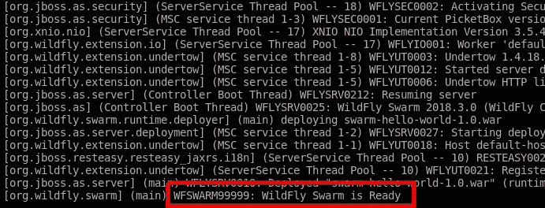
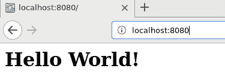
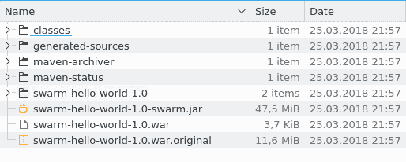

# 熟悉 WildFly Swarm

在本章中，我们将介绍 WildFly——它如何与 Java EE 相关以及其主要功能。我们将介绍 WildFly Swarm——WildFly 的子项目——描述其目的，并展示如何使用它来开发微服务。我们将使用 Swarm 创建和部署我们的第一个应用程序。

# 介绍 WildFly

大多数人可能都听说过 JBoss 应用服务器；WildFly 是其继任者。它是对 Java EE 规范的开放源代码实现，更重要的是，在本书的上下文中，它是 Swarm 项目的基石。

WildFly 具有可扩展的架构，这使其能够在高性能核心之上构建不同大小的发行版，正如我们将在下一章中学习的，Swarm 在很大程度上利用了这一点。

# 性能

当你听到“Java EE 应用服务器”这个短语时，你可能会首先想到“重量级”这个词，因为应用服务器通常就是这样描述的。然而，值得注意的是，Java EE 规范并没有规定其实施必须是缓慢和臃肿的，实际上，许多现代应用服务器（包括 WildFly）确实没有遵循这个不存在的规则。

WildFly 启动仅需几秒钟，在资源使用方面进行了高度优化。你将在整本书中多次看到它。我们将运行多个基于 WildFly 的服务和测试，所有这些服务和测试都将立即启动，并且占用很小的内存。

# 可扩展性

如前所述，WildFly 的默认发行版是一个包含所有必要库的 Java EE 应用服务器。由于 WildFly 的可扩展性，你可以轻松创建自己的服务器发行版。你可以删除未使用的子系统；这里的一个好例子可能是 Web 配置文件，它只包含用于服务网页所需的子系统，可能被视为一个 Web 服务器。添加自己的扩展以提供额外功能也很容易。

正如你将在本书后面学到的那样，Swarm 利用了这两种能力的许多细节，自动裁剪服务器，使其仅使用你的服务所需的库，并提供了一组针对微服务的专用扩展。

无论你打算使用哪种发行版，无论是经过裁剪的 Web 服务器、扩展了你自己子系统的完整发行版，还是 Swarm 微服务，它都可以利用核心提供的所有功能，例如高性能、模块化类加载和成熟的管理层。

# 部署模型

应用服务器提供在 JVM 中协同定位的企业功能，这些功能可以被多租户应用程序使用。这些应用程序可以共享服务，实时部署和卸载，并在 JVM 中相互通信。

在这本书中，我们将专注于基于 Swarm 的微服务，但请注意，这是一个有效的架构模型，其好处在选择适合您所解决问题的正确架构风格时应予以考虑。

单体应用程序的组件位于同一个 JVM 中，并且它们可以在其边界内直接通信。在这样的应用程序中，你不必考虑分布式系统固有的许多问题。如果你决定分发你的应用程序，你必须注意网络故障、服务发现、监控服务可用性以及处理它们的故障，仅举几个问题。此外，在单体应用程序中，你可以使用现成的技术，如事务或安全，这些技术已经过彻底测试，并且已被证明可以很好地工作。

# 介绍 WildFly Swarm

如我们之前讨论的，应用程序服务器提供了在同一个实例中部署和管理多个应用程序的可能性。此外，Java EE 兼容的应用程序服务器提供了 Java EE 伞下所有规范的实现，以便每个符合该规范的应用程序都可以使用它。

这样的功能对于所有应用程序架构来说并不是必需的。在我们示例应用程序中开发的服务中，我们可能不太关心管理、热部署以及所有 Java EE 库的支持。原因是我们将开发小型专注的微服务。如果微服务被更新，我们只需终止其容器并重新启动其新版本。此外，在服务创建时，我们将能够确定它在操作期间将使用的所有库。正因为如此，我们才能仅使用那些必要的依赖项构建可执行的 JAR 文件，从而最小化运行时大小和内存使用。最适合这种目的的工具是 WildFly Swarm。

WildFly Swarm 是 WildFly 的一个子项目，其目标是使微服务应用程序开发变得简单。在我们更深入地了解 Swarm 行为之前，让我们通过我们的第一个`Hello World` JAX-RS Swarm 服务来感受一下它。

# Java EE 应用程序

让我们创建一个简单的 Java EE 应用程序，其中包含一个 REST 资源，它使用`GET`方法来提供`Hello world!`消息：

```java
package org.packt.swarm;

import javax.ws.rs.GET;
import javax.ws.rs.Path;
import javax.ws.rs.Produces;

//1
@Path("/")
public class HelloWorldResource {

 //2
    @GET
    //3
    @Path("hello")
 @Produces({ "text/plain" })
 public String hello() {
 return "Hello World!";
    }
}
```

在上面的列表中，我们创建了一个简单的资源，利用了 JAX-RS 注解；我们定义了整个类的主要路径（1），并创建了被`GET`(2)和`Path`(3)注解的`"hello"`方法，这样当在`"/hello"`路径上调用 HTML get 方法时，就会执行`"hello"`方法。

此外，我们必须在`Path`（1）根上定义应用程序以启动 Web 应用程序：

```java
package org.packt.swarm;

import javax.ws.rs.ApplicationPath;
import javax.ws.rs.core.Application;

//1
@ApplicationPath("/")
public class HelloWorldApplication extends Application {
}
```

最后，我们必须配置`pom.xml`：

```java
<?xml version="1.0" encoding="UTF-8"?>
<project xmlns="http://maven.apache.org/POM/4.0.0"
         xmlns:xsi="http://www.w3.org/2001/XMLSchema-instance"
         xsi:schemaLocation="http://maven.apache.org/POM/4.0.0 http://maven.apache.org/xsd/maven-4.0.0.xsd">
    <modelVersion>4.0.0</modelVersion>

 <!-- 1 -->
 <groupId>org.packt.swarm</groupId>
    <artifactId>swarm-hello-world</artifactId>
    <version>1.0</version>
    <packaging>war</packaging>

    (...)

 <!-- 2 -->
    <dependencyManagement>
        <dependencies>
            <dependency>
                <groupId>org.jboss.spec</groupId>
                <artifactId>jboss-javaee-7.0</artifactId>
                <version>${version.jboss.spec.javaee.7.0}</version>
                <type>pom</type>
                <scope>import</scope>
            </dependency>
        </dependencies> </dependencyManagement>

 <!-- 3 -->
 <dependencies>
        <dependency>
            <groupId>org.jboss.spec.javax.ws.rs</groupId>
            <artifactId>jboss-jaxrs-api_2.0_spec</artifactId>
            <scope>provided</scope>
        </dependency> </dependencies>

    <build>
 <!-- 4 -->
 <plugins>
            <plugin>
                <artifactId>maven-war-plugin</artifactId>
                <version>${version.war.plugin}</version>
                <configuration>
                    <failOnMissingWebXml>false</failOnMissingWebXml>
                </configuration>
            </plugin> </plugins>
    </build>

</project>

```

我们正在使用战争类型（1）创建应用程序，以便它可以作为一个 Web 应用程序使用。我们正在引用 Java EE（2）和`jaxrs` API（3），这样我们就可以使用前面段落中提到的注解。最后，我们必须调整 war 插件，通知它我们不会使用`web.xml`文件。

就这样。这是一个简单的 REST `HelloWorld` 资源。我们现在将能够构建它并将其部署到 Java EE 应用程序服务器上。

# 适应 WildFly Swarm

现在我们都知道如何创建之前描述的 Java EE 应用程序，但我们是来这里学习如何使用 WildFly Swarm 的，所以让我们采用前面的应用程序来适应它。让我们卷起袖子，因为我们现在有一些艰苦的工作要做。

我们必须修改`pom.xml`：

```java
(...)

    <dependencies>
 <!-- 1 -->
        <dependency>
            <groupId>org.wildfly.swarm</groupId>
            <artifactId>jaxrs</artifactId>
            <version>${version.wildfly.swarm}</version> </dependency>
    </dependencies>

    <build>
        <plugins>
            (...)
 <!-- 2 -->
 <plugin>
                <groupId>org.wildfly.swarm</groupId>
                <artifactId>wildfly-swarm-plugin</artifactId>
                <version>${version.wildfly.swarm}</version>
                <executions>
                    <execution>
                        <goals>
                            <goal>package</goal>
                        </goals>
                    </execution>
                </executions> </plugin>
        </plugins>
    </build>

</project>

```

我们不得不向 Swarm 的 JAX-RS 模块（1）添加依赖项。这样的模块被称为分数，你将在下一章中了解更多关于它们的内容。请注意，我们不需要直接配置 JAX-RS API 依赖项，因为它将作为 JAX-RS 分数依赖项提供。

后来，我们不得不配置 WildFly Swarm 的 Maven 插件，该插件负责构建 Swarm 微服务（2）。你将在下一章中了解更多关于它的内容。

就这样。恭喜！你刚刚创建了你第一个 WildFly Swarm 应用程序。

示例参考：`chapter2/swarm-hello-world`（整个示例在附带的代码中可用，在目录：`chapter2/swarm-hello-world`目录中。）

# 这真的有效吗？

在我们更详细地查看发生了什么之前，让我们运行应用程序以证明它确实在运行。打开控制台，进入应用程序的根目录，并运行以下命令：

```java
mvn wildfly-swarm:run
```

Maven 命令运行成功：



swarm-hello-world 示例的控制台输出

我们可以打开网页浏览器并输入我们应用程序的地址，如下面的截图所示：



# 这里发生了什么？

应用程序确实在运行。让我们一步一步地看看刚才发生了什么：

1.  Maven 构建已运行。一个标准的 maven 包插件创建了一个 war 存档，其中包含了之前描述的类（并且也可以部署到标准应用程序服务器）。

1.  Swarm 插件为我们的应用程序构建了一个运行时。这个运行时基于 WildFly-core，只包含服务应用程序所需的库。

1.  插件构建了一个可运行的 JAR 文件，它结合了运行时和应用程序。

1.  由于我们指定了运行目标，插件在创建后立即启动了服务。

让我们看一下目标目录，以记录构建输出：



如您在前面的屏幕截图中所见，除了标准的 Maven 目标构件之外，还创建了一个额外的 JAR 文件：swarm-hello**-world-1.0-swarm.jar**。这是一个可运行的微服务。其名称由存档名称生成，并添加了 Swarm 后缀。此外，请注意，服务的大小为 47.5 MB。它比 WildFly 的 web 服务器配置略大。原因是必须添加一些额外的库（启用 REST 服务）到服务器中。

这个例子旨在让您对 WildFly Swarm 有一个初步的了解。如您所见，开发者的责任是实现业务功能并配置 Swarm Maven 插件。Swarm 负责其余工作：它创建了一个包含所有必要库的服务器，以使这些功能正常工作，并将存档与该服务器连接以创建一个可运行的微服务。由于这种约定优于配置的风格和自动服务器创建，许多配置负担从开发者那里移除，使他们可以专注于业务功能开发。显然，这种标准行为可以更改——您将在本书的后续部分了解更多相关信息。

# 摘要

本章的目标是向您介绍 WildFly Swarm——将其置于 WildFly 及其父项目的大背景下，展示其架构、特性和优势。最后，为了让您初步体验 WildFly Swarm，我们创建了一个简单的 Web 应用程序，并使用 Swarm 将其转换为一个微服务。在下一章中，我们将更深入地了解 WildFly Swarm 的模块化特性。

# 进一步阅读

1.  1.  [`wildfly.org/`](http://wildfly.org/)

    1.  [`wildfly-swarm.io/`](http://wildfly-swarm.io/)
